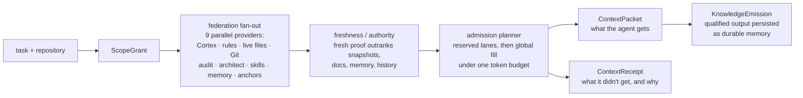

**Give an agent the whole repository, a stale plan, and every old lesson, and its attention fills before useful evidence arrives. Membrane sits between the agent and its sources, and returns the smallest useful set of current code, rules, decisions, and memory for each task — plus a receipt showing what entered context, what didn't, and why.**


## Three motions

| Motion | What it does |
|---|---|
| **Push** | Shrinks information already flowing through the agent workflow — command output, file reads, prose |
| **Pull** | Retrieves only what is relevant to the current task, from every source that might hold it |
| **Persist** | Keeps durable decisions, preferences, and lessons useful across sessions and machines |

All three share one context economy: compression, retrieval, curation, and assembly draw on the same budgets and the same telemetry, instead of each being a separate bolt-on.

## How a packet is assembled



Every source keeps its own type, authority, and freshness — the code graph is not flattened into the same blob as a six-week-old decision note. Conflicts are resolved by rank, not by whichever chunk embedded closest.

## What makes it different

- **Receipts for absence.** The receipt records what was skipped, timed out, inaccessible, or dropped for budget — not just what was returned. "Why didn't the agent know X" becomes a lookup instead of an argument.
- **Freshness beats similarity.** A stale but semantically-similar candidate cannot silently outrank current code.
- **Root confinement.** Access stays repository-bound even though the service can see a wider workspace.
- **Local-first data plane.** SQLite stores, local embeddings, a loopback service, Git-based event sync. No hosted context vendor sees credentials or content.
- **Replaceable producers.** Cortex, memory, rules, or a future provider can change without changing the client packet contract.

The contract is five typed shapes — `ScopeGrant`, `ContextCandidateSet`, `ContextPacket`, `ContextReceipt`, `KnowledgeEmission` — so provider database formats, parsers, and local paths never leak into client adapters. Claude, Codex, and any MCP client share one policy.

## Measured, not vibes

| Figure | Value |
|---|---|
| Warm `/federate` latency (resident gateway, 20 runs) | **p50 81.8 ms · p95 108.8 ms** (was 434–506 ms + ~150 ms spawn per request) |
| Admission budget | 4,096 tokens, with reserved lanes: memory 800 · skills 300, then global fill |
| Packet size cap | 30,000 code points, independent 10,000-char rendered-door cap |
| Federation deadlines | Claude 7 s · Codex 6.25 s inside a 9 s internal deadline |

## Inside

- **Crypt** — the durable-memory engine: a Rust CLI plus loopback HTTP service over SQLite, with a quantized vector store and hybrid retriever. Its legacy name is **Crypt**, and the installed `crypt*` binaries remain the compatibility facade.
- **MCP server** — ten tools over stdio (`membrane_context`, `membrane_source_read`, `membrane_cortex`, `membrane_knowledge_propose`, `membrane_checkpoint_save`, `membrane_checkpoint_load`, `membrane_working_context`, `membrane_temporal_fact`, `membrane_scratchpad`, `membrane_feedback`), serving both the 2025-03-26 and 2026-07-28 MCP discovery eras. The generated source of truth for this surface is [docs/product-truth.md](docs/product-truth.md).
- **Federation gateway** — a supervised resident worker behind `POST /federate` that fans out to the providers in parallel; HTTP-first with automatic CLI fallback.
- **Prompt hooks** — per-host recall planners (Claude and Codex) that route candidates through admission on every prompt.

## Running it

```sh
pnpm install        # Node >= 20, pnpm 11
pnpm test           # MCP server + client + install-binding suites

cargo build --workspace                          # Crypt engine
cargo test --workspace --features fastembed      # with real ONNX embeddings
```

Day-to-day surfaces are the installed shims: `crypt recall`, `crypt federate`, `crypt plan-context`, `crypt curate`, plus the compression trio `runc` (command output), `skel` (file skeletonization), and `compress` (prose).

## Recent

- **Vector backend bake-off (2026-08)** — reproducible Rust benchmark across Mac/Windows SIMD lanes; decision: keep vectors in Crypt, move to resident in-process f32 dispatch.
- **Resident federation gateway (2026-07)** — per-request spawns replaced by a supervised resident worker; warm-path latency dropped ~5×.
- **MCP dual-era stdio (2026-07)** — exact `@modelcontextprotocol/server@2.0.0`, enforced I/O schemas, structured tool results, W3C trace propagation through `/federate`, caller authorization bound to exact repo/root/scope.
- **Honesty pass (2026-08)** — reserved lanes documented as the explicit cross-provider score policy; write paths now refuse hand-typed scopes that would fork the corpus.

## Repository posture

This checkout is an internal mirror of a workspace-coupled control plane for the author's studio machines — not a standalone public product. Runtime wiring (hooks, Crypt loopback, federation providers, install binding) depends on the parent workspace. Naming: **Membrane** is the public name; RightContext survives as an internal alias in headers and telemetry tokens. Conversation-history compaction still belongs to each host, and the structured cognition layers (`plan` / `think` / `verify`) are design targets, not shipped code.

---

<sub><b><a href="https://orthic-labs.github.io">Orthic Labs</a></b> — local-first infrastructure for AI-assisted development.<br>
<a href="https://github.com/Orthic-Labs/Membrane">Membrane</a> · <a href="https://github.com/Orthic-Labs/Cortex">Cortex</a> · <a href="https://github.com/Orthic-Labs/Forge">Forge</a> · <a href="https://github.com/Orthic-Labs/Roundtable">Roundtable</a> · <a href="https://github.com/Orthic-Labs/Morph">Morph</a> · <a href="https://github.com/Orthic-Labs/CutRight">CutRight</a> · <a href="https://github.com/Orthic-Labs/claudecodeX">claudecodeX</a></sub>

<!-- blueprint:docs:start -->
## Support & pricing boundaries

The free/local operational boundary does not condition local correctness on payment, hosted service,
or telemetry. It is not a license grant. Paid support and prices are **unavailable**; team sync, fleet,
policy, managed updates, and optional telemetry are **undecided**. Any future
paid capability must never gate local safety, authority, receipts, updates, or
export. See [pricing](docs/pricing.md), [support policy](docs/support-policy.md),
and [public support boundaries](website/support-boundaries.md).

## Repository truth docs
- [Product overview](docs/product.md) — what this is and does (generated, code-grounded)
- [Architecture](docs/architecture.md) — components, flows, interfaces (generated, code-grounded)
- [Operations](docs/operations.md) — run and verify the product-truth surface (generated, code-grounded)
- [Protocol](docs/protocol.md) — MCP tool contract and behavior (generated, code-grounded)

Gate: `node tools/productization/check-docs.mjs --check` fails on a broken README link, a stale generated doc, a wrong tool count, or stale platform status.
<!-- blueprint:docs:end -->

<!-- support-matrix:start -->
## Support tier matrix

Generated from current MBR-801 installed-path conformance receipts — 0 of 10
platform/client pairs currently qualified. Full table, tiers, and reasons:
[docs/support-matrix.md](docs/support-matrix.md) (also machine-readable at `docs/support-matrix.json`).
This block, the JSON/MD matrix, and `server.json`'s per-target `platformReceipt`
fields are all written by `node tools/productization/generate-support-matrix.mjs`
from the same receipts; none of them is hand-maintained.
<!-- support-matrix:end -->
