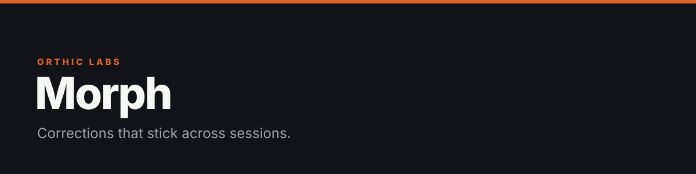
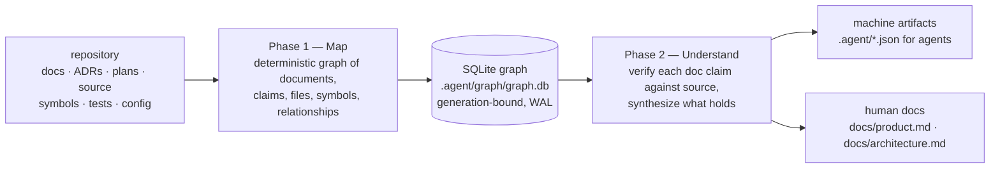

**Every repository tells two stories: what the docs claim and what the code does. Cortex maps both into one local, evidence-backed graph, so people and agents can find what is true, stale, contradictory, or still unknown — before changing the system.**

<sub>Nodes, edges, and flows are branded <b>Neurons</b>, <b>Synapses</b>, and <b>Circuits</b>.</sub>


## Two phases



Phase 1 is deterministic mapping. Phase 2 is judgment with receipts: every claim keeps its path, span, content hash, provider, generation, and confidence — and verdicts are sealed to exact document+code fingerprints, so unchanged inputs reuse verdicts and only affected ones recompute.

## What the graph refuses to fudge

- **Contradictions are surfaced, not averaged away.** A doc that disagrees with the code shows up as a disagreement.
- **An old plan cannot outrank current code.** Documents are tracked as current, historical, superseded, or invalidly marked; `supersedes` chains are kept as provenance and excluded from current truth.
- **Uncertainty stays visible.** Unsupported languages, truncated scans, and ambiguous edges are reported, not hidden.
- **Freshness by construction.** Commits, dirty overlays, provider versions, and content fingerprints invalidate only the evidence they touch.

Precision and confidence are explicit ladders, not adjectives:

| Ladder | Order |
|---|---|
| Code intelligence source | `COMPILER > AST > LEXICAL` — Tree-sitter for supported languages, deterministic lexical fallback everywhere, optional SCIP if the repo supplies an export |
| Edge resolution confidence | `EXACT_RESOLUTION > SAME_FILE_LEXICAL > CROSS_FILE_HEURISTIC > UNRESOLVED` — consumers filter by minimum tier |

The store is Node's built-in `node:sqlite` — no database server, no native packages. Writes are transactional per generation, so readers only ever see complete generations.

## Asking it questions

```sh
cortex                       # orient in the current repo
cortex "add rate limiting"   # orient around a task
cortex doctor --full --json  # health + coverage
```

| Query | Answers |
|---|---|
| `cortex graph search <term>` | where is this symbol/concept |
| `cortex graph neighbors <node>` | what touches it |
| `cortex graph path <a> <b>` | how are these connected |
| `cortex graph impact <node>` | what breaks if this changes |
| `cortex graph architecture` | component structure, from evidence |
| `cortex graph doc-truth` | which doc claims hold against source |
| `cortex graph mermaid` | render the graph as a diagram |

Beyond queries: `cortex phase2 plan|seal` (incremental verification), `cortex grant issue|check` (task-scoped path grants with TTL), `cortex neighborhood <anchor>` (bounded, token-budgeted graph slices), `cortex orient` (decision-only admission API returning `allow | continue | block | noop`), and a resident watch daemon (`cortex-watch`) that keeps freshness barriers warm across enrolled repos.

## Trust model

Repository content is untrusted data, never agent instruction. Secrets are redacted from outputs. Reads are confined to repository scope. Current code and executable proof outrank plans and historical documents. For federation, cross-repo graphs are never raw-merged — each repo's slices stay independently scoped by `repoId`.

## Cortex on Cortex

This repo maps itself: the current generation covers **129 files, 10 documents, 89 claims, 30 code refs**, and its own generated architecture doc reports 17 stale claims and 15 missing references — visible, because hiding them would defeat the point.

## Quick start

Install and run from npm (no source checkout needed):

```sh
npx -y @orthic-labs/cortex init    # enroll Cortex in the current repository
cortex status                       # freshness + coverage
cortex search "placeOrder"          # query the graph
```

From a source checkout:

```sh
pnpm install
pnpm test                       # requires Node >= 22.13
python3 -m pip install -r requirements-test.txt   # for the full workspace suite
pnpm run test:all
```

Bins: `cortex`, `cortex-watch`, `cortex-mcp` (MCP server), `cortex-install`.

## Recent

- **Freshness hardening** — canonicalized watcher paths, snapshot-backed freshness proofs, batched barrier writes, logically-sound incremental graph freshness.
- **Federation contract** — barrier fan-out across enrolled repos with independent receipts; one repo's timeout can't block another.
- **MCP server + host installers**, task-scoped grants, bounded neighborhoods, merkle reconciliation, resident watchman.

## Current limits

Parser depth varies by language (lexical fallback is broader than AST coverage). Dynamic runtime registration can stay unresolved without executable or compiler evidence. SCIP precision requires a repository-supplied export. Embeddings and semantic vector search are not active. No interactive visual graph explorer ships. Raw graph data is not copied into durable memory.

## Repository truth docs
- [Product overview](docs/product.md) — what this is and does (generated, code-grounded)
- [Architecture](docs/architecture.md) — components, flows, interfaces (generated, code-grounded)

## License

Cortex is **source-available**, not open source: the repository is covered by the
[Orthic Labs Source Use License v1.0](LICENSE), which permits internal and
evaluation use. The SDK (`sdk/`), schemas (`schemas/`), and examples
(`examples/`) are licensed under [Apache-2.0](LICENSES/README.md) for
integration use. Trademarks: see [TRADEMARKS.md](TRADEMARKS.md).

---

<sub><b><a href="https://orthic-labs.github.io">Orthic Labs</a></b> — local-first infrastructure for AI-assisted development.<br>
<a href="https://github.com/Orthic-Labs/Membrane">Membrane</a> · <a href="https://github.com/Orthic-Labs/Cortex">Cortex</a> · <a href="https://github.com/Orthic-Labs/Forge">Forge</a> · <a href="https://github.com/Orthic-Labs/Morph">Morph</a> · <a href="https://github.com/Orthic-Labs/CutRight">CutRight</a> · <a href="https://github.com/Orthic-Labs/claudecodeX">claudecodeX</a></sub>

<!-- cortex:docs:start -->
## Repository truth docs
- [Product overview](docs/product.md) — what this is and does (generated, code-grounded)
- [Architecture](docs/architecture.md) — components, flows, interfaces (generated, code-grounded)
<!-- cortex:docs:end -->


