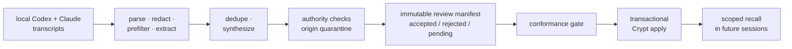

**AI assistants repeat the same mistakes because useful corrections disappear when the session ends. Morph mines local Codex and Claude transcripts for repeated, durable guidance and promotes it — through hard safety gates — into a small, scoped, reversible preference layer that future agents actually recall.**

<sub>Package & CLI id: <code>morph</code>.</sub>


It does not retrain the model, and it does not save private chain-of-thought. It learns things like *"always run focused tests before reporting a broad build complete"* — and refuses to learn things like *"the service is down today."*

## The pipeline



Mining never writes rules directly. It emits a review manifest; only an adjudicated manifest can be applied; and apply is transactional with rollback.

## What gets refused

Only authenticated **user-origin** evidence can create durable preference authority. Admission deterministically quarantines:

- assistant-authored narration and echoed tool/repository output (a prompt-injection lexical scan backs up the origin tags)
- permission or approval expansion, and anything that weakens security
- conflicts with the active `AGENTS.md` / `CLAUDE.md` / workspace rules, and contradictions with an active stored rule
- transient environment claims, forbidden scopes, unknown categories, duplicates, and rules too short to mean anything

Categories are a controlled taxonomy (`workflow`, `verification`, `safety`, `architecture`, `tooling`, `code-style`, `documentation`, `model-routing`); anything else is forced into review, never silently admitted.

## Scoped, not global

Record types stop every lesson from becoming a global command:

| Record type | Reach |
|---|---|
| `standing_preference` | Broad and durable — the only type eligible for the bounded always-on core |
| `locked_decision` | Binding, but only inside its declared scope |
| `operational_playbook` | Recalled when the task and scope match (the default) |
| `episodic_fact` | Supporting context, never a standing instruction |
| `unclassified` | Legacy/review state |

Only root-scoped standing preferences compile into the always-on core; everything else stays recall-gated — so the preference layer never grows into another giant prompt.

## Nothing applies unless it's exactly what was reviewed

Every manifest candidate carries its source session identities, per-transcript SHA-256 hashes, a payload SHA-256, rule type, scope, authority effect, and evidence links. Apply refuses: pending records, an edited payload whose hash no longer matches, a changed canonical rule pool, source sessions from another installation, out-of-manifest evidence, and authority-quarantined candidates.

And it's reversible: a run journal checkpoints every stage; safe resume reuses cached stages only while session identity still matches; apply captures snapshots first; rollback deletes only recorded IDs, restores snapshots, and runs `PRAGMA integrity_check` — no force flag bypasses a failed integrity proof.

## Surfaces

| Surface | Role | Status |
|---|---|---|
| **Taste** | durable preferences → Crypt | ships |
| **Doctor** | multiwriter conformance receipts (`issue` / `validate`) | ships; Blueprint/Sentinel checks not yet |
| **Insights** | failure/waste mining | deferred — not a product yet |

## Using it

```sh
python3 morph.py --smoke                            # dry-run the whole pipeline
python3 morph.py --incremental --manifest pending.json
python3 morph.py --apply-from-manifest resolved.json
python3 morph.py --compile-core path/to/core.json

python3 morph.py \
  --add-rule "Always run focused tests before reporting a broad build complete." \
  --category verification

python3 morph.py doctor issue --out receipt.json
python3 morph.py doctor validate --receipt receipt.json
```

Writes are opt-in (`--apply`); smoke and manifest generation stay dry-run. Extraction/synthesis lanes are `local` (default) or `minimax`; extraction can parallelize up to 5 workers while synthesis stays ordered. Tests: `python3 -m pytest -q`.

## Recent

- Every mined rule is now attributed to the machine that learned it; session IDs are installation-qualified so two machines can't collide.
- The Ollama lane was dropped entirely; the external lane is MiniMax at the proxy, with live e2e routing fixes.
- Lifecycle and verification fields land on the direct-rule path; scope dimensions and a planted-finding bench joined the eval harness.

## Current limits

A standalone checkout depends on parent-workspace memory/session modules and an installed Crypt (`workspace_runtime.py` is the single import boundary; offline stubs exist but are barred from live applies). Model-assisted extraction needs a configured lane. Lexical contradiction detection catches direct polarity conflicts, not every semantic conflict. Doctor does not yet cover Blueprint or Sentinel.

---

<sub><b><a href="https://orthic-labs.github.io">Orthic Labs</a></b> — local-first infrastructure for AI-assisted development.<br>
<a href="https://github.com/Orthic-Labs/Membrane">Membrane</a> · <a href="https://github.com/Orthic-Labs/Cortex">Cortex</a> · <a href="https://github.com/Orthic-Labs/Sentinel">Sentinel</a> · <a href="https://github.com/Orthic-Labs/Roundtable">Roundtable</a> · <a href="https://github.com/Orthic-Labs/Morph">Morph</a> · <a href="https://github.com/Orthic-Labs/CutRight">CutRight</a> · <a href="https://github.com/Orthic-Labs/claudecodeX">claudecodeX</a></sub>
