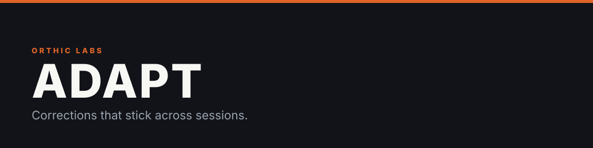
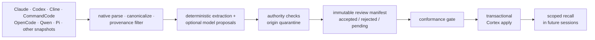

**Adapt is Membrane's governed behavioral-learning subsystem. Taste learns user-backed preferences; Insights learns evidence-backed agent/model/tool failures, gotchas, and waste. Cortex owns durable admission, lifecycle, storage, retrieval, and delivery.**

<sub>Package & CLI id: <code>adapt</code>.</sub>


Canonical semantics: [`../docs/subsystems/ADAPT_CANONICAL_PRODUCT_AND_ARCHITECTURE.md`](../docs/subsystems/ADAPT_CANONICAL_PRODUCT_AND_ARCHITECTURE.md). Runtime cutover: [`../migration/native-rust/MEMBRANE-NATIVE-RUST-MIGRATION-AND-CODERIGHT-INTEGRATION.md`](../migration/native-rust/MEMBRANE-NATIVE-RUST-MIGRATION-AND-CODERIGHT-INTEGRATION.md).

It does not retrain the model, and it does not save private chain-of-thought. It learns things like *"always run focused tests before reporting a broad build complete"* — and refuses to learn things like *"the service is down today."*

## The pipeline



Mining never writes rules directly. It emits a review manifest; only an adjudicated manifest can be applied; and apply is one authenticated, atomic Cortex batch.

## What gets refused

Only authenticated **user-origin** evidence can create durable preference authority. Admission deterministically quarantines:

- assistant-authored narration and echoed tool/repository output (a prompt-injection lexical scan backs up the origin tags)
- permission or approval expansion, and anything that weakens security
- conflicts with the active `AGENTS.md` / `CLAUDE.md` / workspace rules, and contradictions with an active stored rule
- transient environment claims, forbidden scopes, unknown categories, unsafe duplicate
  collapse, and rules too short to mean anything; the synthetic quality scorecard records
  one remaining product-fact modal false positive

Categories are a controlled taxonomy (`workflow`, `verification`, `safety`, `architecture`, `tooling`, `code-style`, `documentation`, `model-routing`); anything else is forced into review, never silently admitted.

## Scoped, not global

Record types stop every lesson from becoming a global command:

| Record type | Reach |
|---|---|
| `standing_preference` | Broad and durable — the only type eligible for the bounded always-on core |
| `locked_decision` | Taste only when it carries behavioral choice authority inside declared scope |
| `operational_playbook` | Recalled when the task and scope match (the default) |
| `episodic_fact` | Non-Taste Cortex proposal/context; never a preference |
| `unclassified` | Legacy/review state |

Only root-scoped standing preferences compile into the always-on core; everything else stays recall-gated — so the preference layer never grows into another giant prompt.

## Nothing applies unless it's exactly what was reviewed

Every manifest candidate carries its source session identities, per-transcript SHA-256 hashes, a payload SHA-256, rule type, scope, authority effect, and evidence links. Apply refuses: pending records, an edited payload whose hash no longer matches, a changed canonical rule pool, source sessions from another installation, out-of-manifest evidence, and authority-quarantined candidates.

Run journals checkpoint every stage; safe resume reuses cached stages only while session identity still matches. Cortex owns atomicity; failed batches return typed errors without exposing a compatibility reversal path.

## Surfaces

| Surface | Role | Status |
|---|---|---|
| **Taste** | reviewed preferences → Cortex | native source path and synthetic conformance gate pass; real-world held-out, implicit-evidence, and exact package qualification remain open |
| **Insights** | failure/waste episodes, issues, remediation proposals & outcomes | native detection and portable benchmark ship with documented detector gaps; automated effect remains blocked |
| **Adaptive evaluation** | delivery/effectiveness, counterfactuals, retirement suggestions & privacy-bounded aggregates | native contracts ship; only production-integrated, persisted receipts count as runtime evidence |

## Using it

```sh
membrane adapt mine --host pi transcript.jsonl > mined.json
membrane adapt review --input mined.json
membrane adapt review-taste --input mined.json \
  --installation-id "$INSTALLATION_ID" \
  --canonical-pool-sha256 "$POOL_DIGEST" \
  --created-at "$TIMESTAMP" > pending.json
membrane adapt adjudicate-taste --manifest pending.json \
  --decisions decisions.json --validated-at "$TIMESTAMP" > accepted.json
membrane adapt apply --manifest accepted.json
membrane adapt recall "focused tests" --scope workspace
membrane adapt benchmark --input adapt/eval/insights_bench/v1/cases.jsonl
membrane adapt context-cost --input context-cost-observations.json
membrane adapt doctor
```

### Persistent-context cost

`membrane adapt context-cost --input …` analyzes trusted host observations supplied
as JSON. Provider-billed input, cache-read, cache-write, and output counts remain
measured. Allocation to persistent sources is deterministic and bounded but is
labelled inferred; any remainder stays unattributed. Findings include
`apparently_unused_always_on_context`, `duplicated_persistent_instruction`,
`stale_or_shadowed_persistent_source`, `memory_recall_never_used`,
`always_on_prefix_dominates`, `oversized_instruction_file`, and
`mcp_tool_definitions_dominate`. The command does not discover provider bills, inspect
accounts, or bundle a price table.

Writes remain explicit. Mining/review/adjudication are non-mutating; apply verifies
complete independent decisions, semantic seals, transcript bindings, and Cortex
admission receipts. The native Adapt path does not invoke an external model CLI or
interpreter-backed worker. Product-wide installed-artifact exclusion of legacy
Python/Node remains an open release qualification gate.

## Repository layout

| Path | Contents |
|---|---|
| `../engine/crates/membrane-transcript/` | canonical native transcript owner & host adapters |
| `../engine/crates/membrane-adapt/` | canonical native Taste/Insights owner |
| `src/adapt/` | legacy Python migration/differential material; release exclusion still must be proven |
| `tests/` | legacy differential tests |
| `eval/` | offline evaluation and delivery-parity tooling |
| `docs/` | architecture, operations & historical plans |

`membrane adapt` is the production authority. `adapt.py` is legacy migration evidence,
not an approved runtime path; exact package exclusion is tracked by the native migration
ledger.

## Recent

- Every mined rule is now attributed to the machine that learned it; session IDs are installation-qualified so two machines can't collide.
- The Ollama lane was dropped entirely; the external lane is MiniMax at the proxy, with live e2e routing fixes.
- Lifecycle and verification fields land on the direct-rule path; scope dimensions and a planted-finding bench joined the eval harness.

## Current limits

Model-assisted semantic discovery still produces proposals only; independent
adjudication remains mandatory before apply. Lexical contradiction checks cover direct
polarity conflicts, while semantic conflicts require adjudication. Host UI signals
remain capability-specific and unavailable signals are reported explicitly. The Taste
quality corpus is synthetic conformance evidence, with one recorded product-fact modal
false positive; real-world held-out and exact released-package qualification remain
open. CodeRight user-act signing/trust provisioning, semantic-adjudicator trust
provisioning, and installed reviewed-merge delivery are external integration gaps and
fail closed when absent.

---

<sub><b>Membrane</b> — local-first infrastructure for AI-assisted development.<br>
<a href="https://github.com/Orthic-Labs/Membrane">Membrane</a> · <a href="https://github.com/Orthic-Labs/Membrane/tree/main/engine/crates/cortex">Cortex</a> · <a href="https://github.com/Orthic-Labs/Membrane/tree/main/adapt">Adapt</a></sub>
