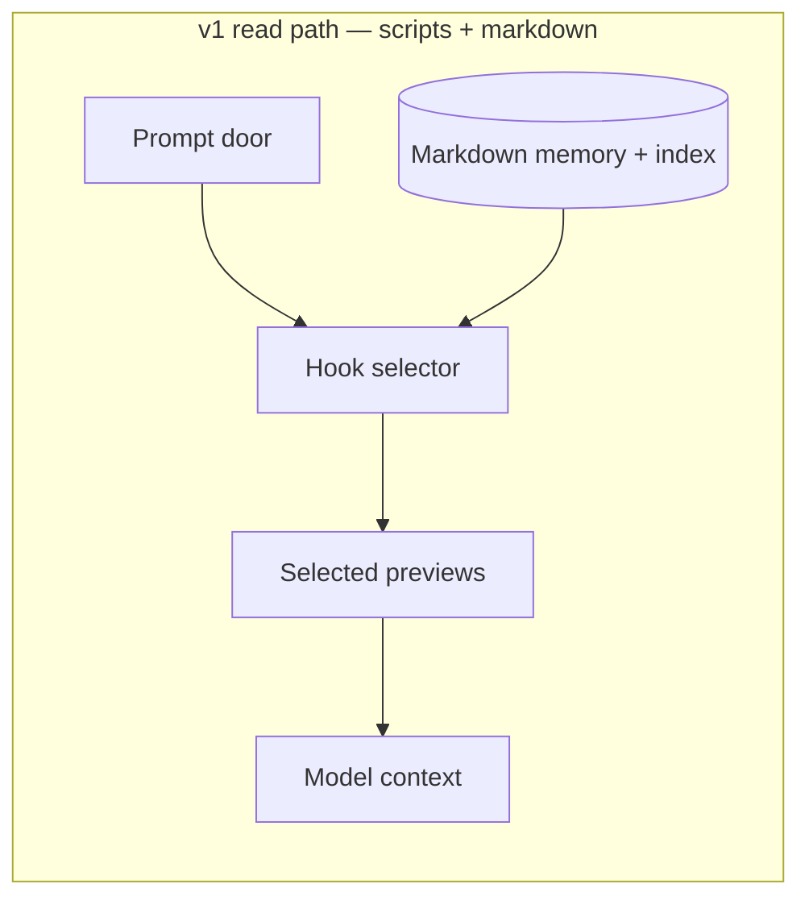
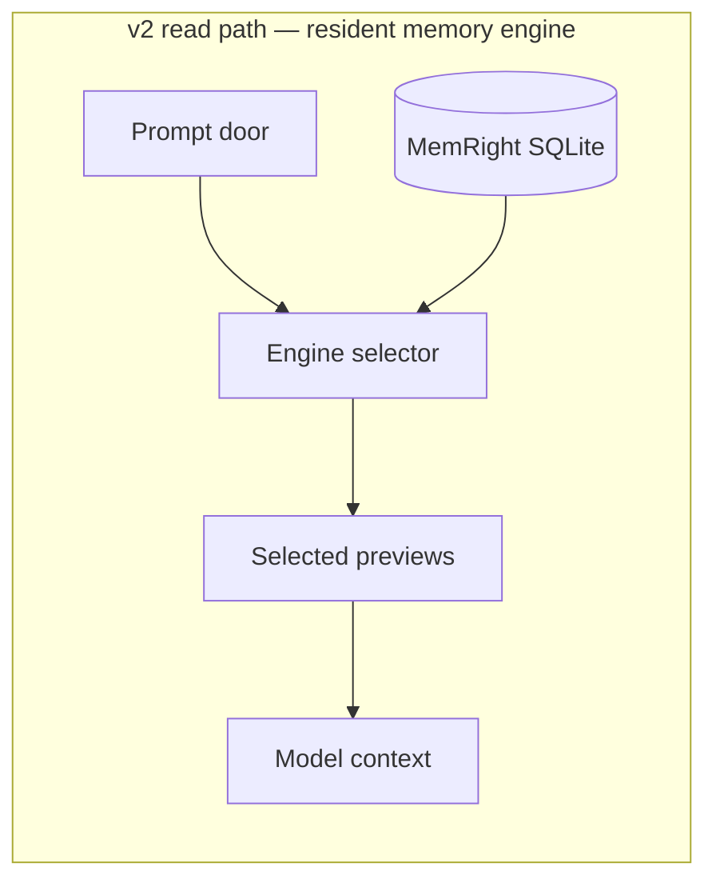
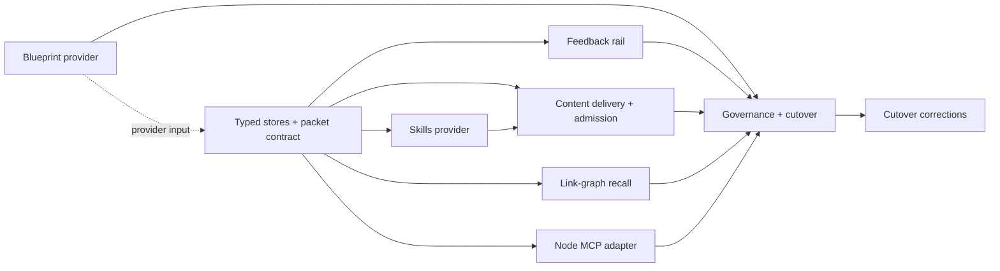
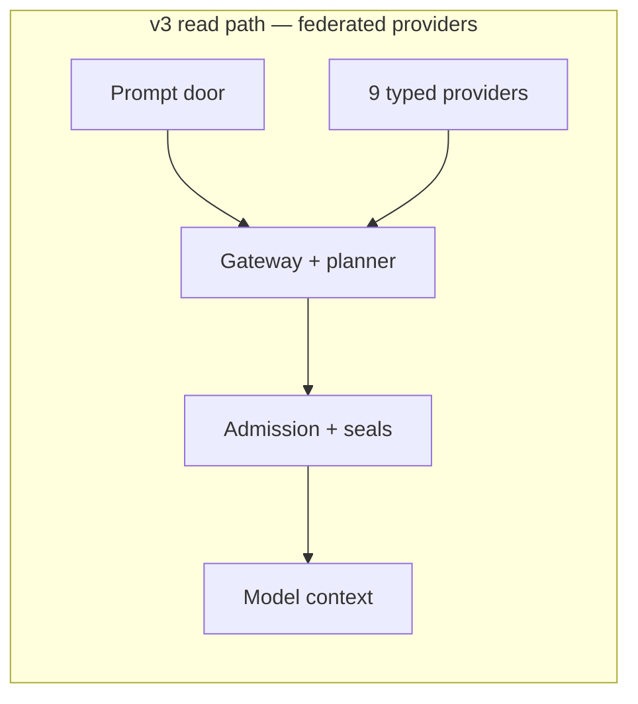
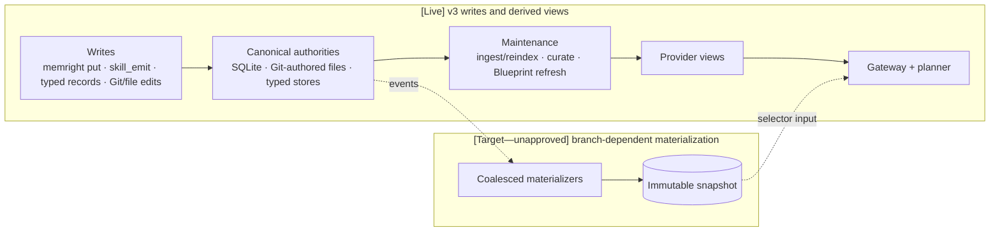
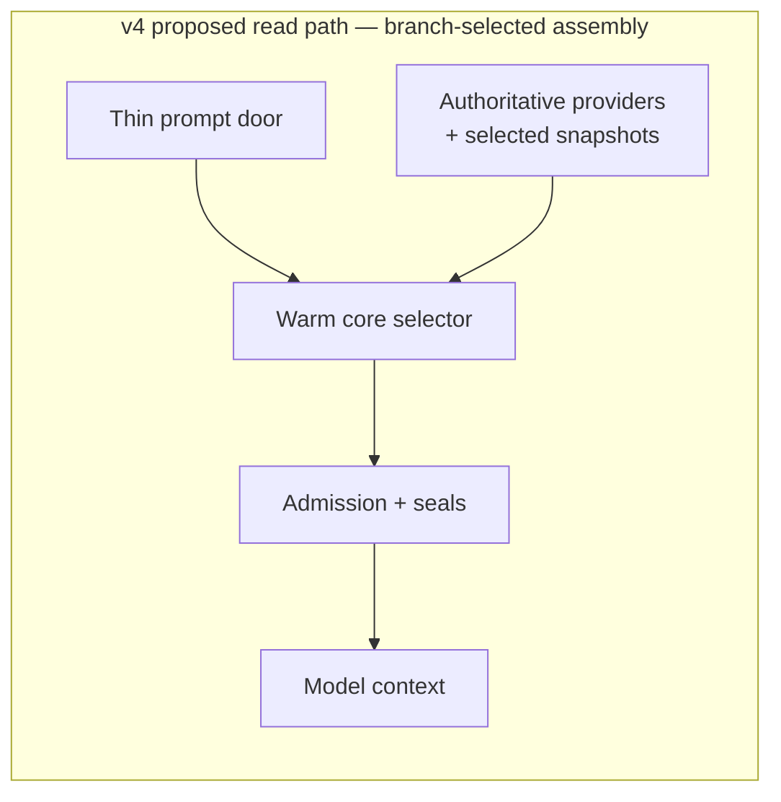
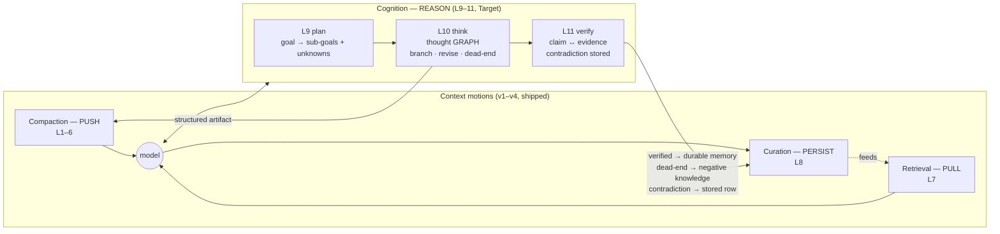

# Context Engineering — Evolution Snapshot (v1 → proposed v4)

**What this is:** the frozen 2026-07-16 evening snapshot of the workspace context system — the original three-family / eight-layer design, each generation of machinery built under it, what got folded in when (Blueprint, skills, federation), and the proposed v4 direction. For volatile/live values, use `RIGHTCONTEXT-STATE.md`.

**Canonical sources (this doc summarizes, they govern):** [tools/lib/CONTEXT-ENGINEERING.md](../../tools/lib/CONTEXT-ENGINEERING.md) (families, layers, engine), [docs/UNIFIED-CONTEXT-SYSTEM-ARCHITECTURE.md](UNIFIED-CONTEXT-SYSTEM-ARCHITECTURE.md) (responsibility boundaries), [docs/RIGHTCONTEXT-STATE.md](RIGHTCONTEXT-STATE.md) (live state and evidence), [docs/plans/2026-07-16-rightcontext-harness-protocol-adr.md](plans/2026-07-16-rightcontext-harness-protocol-adr.md) (proposed v4 commitments). On conflict, the state doc owns current operation and the ADR owns proposed sequencing.

**Provenance:** Git history begins at `dc863dea` on 2026-06-10; earlier dates are attested by workspace documentation rather than repository commits.

**Deliberate exclusions:** this snapshot does not track current hashes, row/event counts, Task Scheduler or launchd state, dashboard uptime, per-prompt metrics, test counts, or individual governance actions. Those belong to the state doc and `tools/.cache/metrics/`.

---

## 1. The constants — three families, eight layers

These have not changed since the design was named (CONTEXT-ENGINEERING.md, renamed from COMPACTION.md 2026-06-30 because compaction is only one of three families). Every version below is machinery *underneath* this frame.

**One goal: exactly the right tokens in attention.**

| Family | Motion | Layers | What it does |
|---|---|---|---|
| **Compaction** | PUSH — shrink what's in transit | 1–6 | squeeze each thing that flows |
| **Retrieval** | PULL — bring the right thing in | 7 | rank + inject from the durable store |
| **Curation** | PERSIST — keep the store lean + useful | 8 | lifecycle of the durable store |
| **Cognition** `[Target]` | REASON — structure the thinking over the context | 9–11 | decompose the goal, persist the reasoning graph, verify claims (§5a — named 2026-07-18, not built) |

| # | Family | What flows | Tool (today) |
|--:|---|---|---|
| 1 | compaction | my reply → Adrian | `brief` (always-on policy) |
| 2 | compaction | command output → context | `memright runc` (head+tail cap + cached pointer) |
| 3 | compaction | file → agent context (INPUT) | `memright prep` + `skel` (code→AST skeleton, prose→compress) |
| 4 | compaction | orchestrator → agent (A2A) | machine-minimal directive (auto-prepended by hook) |
| 5 | compaction | agent doc output → future agent input | `memright compress` + OKF emit (link-graph bundles) |
| 6 | compaction | my running context | harness `/compact` + context-budget planner |
| 7 | **retrieval** | durable store → context (RECALL) | `memright recall` (EmbeddingGemma-300M-Q4, scope-chain + hybrid ranking) |
| 8 | **curation** | durable store lifecycle | `memright curate` (dream: dedupe/normalize/prune, scheduled daily) |

Shared primitives across all three families: `skel` (code AST), `compress`/OKF (prose + link graph), `embed`/vector (recall). The entry shape evolved as:

```text
v1 {markdown body} → v2–v3 {content, keywords, embedding, embedding_q}
                   → [Target—unapproved] {full, skel, embedding, okf-links}
```

The target shape is a cross-era design direction, not a claim about the v4 branch or the shipped schema.

**Scoring truth:** `[Live]` candidate order is cosine similarity plus the `0.02` scope-chain soft bonus, with verified-contradiction veto and bounded graph augmentation around that ranking. Any richer decay/effectiveness/pinned/scope-depth blend remains `[Target—unapproved]` unless the canonical engine doc and frozen evaluation say otherwise.

### Era exit contract

| Era | Shipped context/store shape | Exit condition that forced the next era |
|---|---|---|
| v1 scripts | Markdown bodies plus a session index; layer-specific scripts | No durable counters or atomic curation, duplicated tooling, weak retrieval, and no consumption measurement → one engine |
| v2 engine | SQLite rows `{content, keywords, embedding, embedding_q}` plus engine verbs | Durable memory worked, but it was the only retrieval authority: no repository graph, typed findings/decisions, or provider-neutral packet → federation |
| v3 federation | The v2 memory schema plus typed provider candidates, packets, receipts, and seals | Per-prompt orchestration, provider-compute cost, under-delivered lanes, feedback starvation, and corpus/embedding-window governance → measured v4 branch |
| v4 proposal | Shipped stores remain authoritative; snapshot/materializer shape is branch-dependent | No exit is declared. Phase 0 selects the next implementation; unselected target machinery is not live. |

---

## 2. v1 — the script era (≤ 2026-06-29)

The layers existed as **separate per-layer scripts** and the durable store was **markdown files** (`~/.claude/projects/<scope>/memory/*.md` + a `MEMORY.md` index loaded each session). Recall was a Python hook injecting file previews. Compaction was Python/Node one-offs (`skel.py`, `compress.py`, `runc` copies). Predecessor lesson baked into everything after: **Graphify** (nightly repo graphs, retired 2026-05-17 — date attested by workspace memory, pre-dates this repo) was killed because it produced without a consumption path — every later mechanism ships with a consumption wire and a kill criterion first (the §10 "Graphify guard").



Weaknesses that drove v2: markdown as source of truth (no counters, no effectiveness, no atomic curation), duplicated per-layer tooling in three languages, keyword-ish recall, no measurement.

## 3. v2 — the engine era (2026-06-30 → 2026-07-11), in two steps

**Step 1 — engine built, markdown still source of truth (2026-06-30).** Both landed the same day: a Python SQL+vector engine with usage/benefit instrumentation (`9656fe00`), immediately replaced by the **Rust MemRight engine** retiring `mem.py` (`1394355c`). Markdown remained the store of record; the engine indexed it.

**Step 2 — DB-first cutover (2026-07-02, `9b4a8425`).** The SQLite DB became the source of truth, EmbeddingGemma-300M-Q4 (fastembed/onnxruntime, offline) became the embedder, sync v2 landed, and markdown was demoted to an engine-generated export. Per-prompt semantic recall runs through a resident service (`serve` on `127.0.0.1:47851`, bearer-token auth). The transform layers (2/3/5) merged into the same crate — `runc`/`prep`/`skel`/`compress` became engine verbs behind compatibility shims.

Curation became a scheduled engine verb (`curate` → `dream_now`, daily-sync, 2026-07-04). **Incident, recorded honestly:** the first scheduled run minted opaque, colliding generated `dream-` ids instead of curating in place; the same-day repair (`4811e8f5` + `35a12fae`) reshaped curation to operate under each primary's own id/scope/counters, tombstoned 96 legacy `dream-` mirror files, and restored the originals. Cross-machine sync became **replication v2** (2026-07-10): immutable events through git (`memory-mirror/`), each machine rebuilds/embeds its own DB. Measurement arrived as the anti-Graphify contract: every recall logged, effectiveness loop on `get`, kill criteria per mechanism (§10.2 fired for real — `/skel` + `/prep` serve routes were deleted 2026-07-05 as consumer-less). One more honesty correction from this era: the first architecture doc described the target `{full, skel, embedding, okf-links}` entry as if shipped; the 07-01 truthfulness pass introduced the explicit `[Live]`/`[Target]` status legend that CONTEXT-ENGINEERING.md still carries.



Folded in during this era: metrics dashboard (`spoares.com/memory`, content-free 3-family/8-layer snapshot), OKF Skill Output Contract (`skill_emit` — skills persist recallable knowledge), thread guard, brief enforcement hooks.

## 4. v3 — the RightContext federation cutover (2026-07-12 → 2026-07-16 snapshot)

**RightContext = the umbrella: memory is one provider among nine.** The unified-architecture dispatch (2026-07-12) added the repo-truth layer and typed knowledge stores, then five folds (2026-07-15) and the production cutover (2026-07-16) made it the live per-prompt path.

What got folded in, in order:

| Date | Fold | Logical prerequisite | What it added |
|---|---|---|---|
| 2026-07-12 | **Blueprint in** (successor to maprepo/graphify) | Repository source + portable generation contract | deterministic repo map + code graph + verified claims; `.blueprint/` portable contract; graph freshness gating; `blueprint brief/graph` consumption surfaces |
| 2026-07-12 | Typed stores + packet contract | Blueprint and MemRight remain distinct authorities | Audit findings store (G4), Architect decisions store (G5, lifecycle `proposed→accepted→implemented→superseded`), `ContextPacket`/`ContextReceipt` v2, ScopeGrant, federation gateway (Rust shell → Python gateway, 9 providers) |
| 2026-07-15 | Feedback rail | Stable candidate identity + packet/receipt contract | per-candidate self-learning: `get`→used, delete/supersede→contradicted, verified-contradicted = sha-aware veto |
| 2026-07-15 | **Skills in** (9th provider) | Provider contract + skill authoring catalog + engine serving | workspace skill catalog served cross-repo; INDEX previews in the packet + `memright skill-read` pull; provenance-sealed (bodyHash + Git) |
| 2026-07-15 | Memory-content delivery + admission lanes | Packet contract + memory/skill candidate schemas | real content previews (not stubs); two-pass admission (reserved lanes: memory 800 / skill 300 tokens, then global fill); DB-provenance seal |
| 2026-07-15 | Link-graph recall | MemRight schema + candidate provenance | `[[wikilink]]` edges (schema v8), bounded one-hop at a discounted tier |
| 2026-07-12 | Node MCP adapter (G5 Lane F) | Versioned packet contract | `tools/mcp/membrane_server.mjs` + client — stdio JSON-RPC cross-client door, 9 parity tests; the v4 Rust `memright mcp` verb is chartered to replace it |
| 2026-07-16 | Governance + cutover | All provider, packet, admission, seal, and fallback contracts above | reversible quarantine (schema v10); engine-served skills (schema v9, disk-first/engine-fallback); Codex parity (plugin 1.0.4); scheduler-owned hidden service binary; **`RIGHTCONTEXT_MODE=on` flipped** |
| 2026-07-16 | **Cutover incidents + corrections** (the lessons row) | Installed cutover path | the first `on` flip was **inert** — installed hooks still invoked legacy `recall_memory.py`; the real Claude cutover landed in `1e77ae8a`. Sol's same-day audit then caught **two shipped bugs** (`e1d0817f`): consumed stdin made every fallback emit 0 bytes instead of legacy's ~2.6 KB, and Windows timeouts killed only the direct child, orphaning the gateway process tree (30 s wedges). Later Rust hardening (`8e36cea1` — worker-permit lifetime, collision-safe schema-v10 backout) was source-only until the two-binary redeploy completed 2026-07-16 evening |

The dependency spine is `typed candidates/packets → feedback and delivery → admission/seals → governance/cutover`. Blueprint can be built in parallel, but it enters the live path only through that packet contract; skills additionally require the engine-served catalog. Solid edges below are prerequisites; the dotted edge is the Blueprint integration seam.





**Fixed during cutover/hardening:** scope normalization was repaired at the engine boundary; the 2026-07-17 Windows hardening then shipped the rendered/resolver-backed/`metadata_only` delivery contract and bounded dirty-overlay/lane-local degradation. Mac and calendar-bound evidence remain acceptance items, not implied closure.

**Open architectural gaps feeding v4:** the historical pre-hardening audit found low rich-packet availability and provider-compute-dominant latency; the live state doc owns all current values. The feedback rail is structurally starved because preview delivery removed most `get` calls while never-used governance still consumed that signal. One-corpus growth, plan-shaped rows, entries beyond the embedding window, and per-prompt process churn remain quality/performance work behind their named gates.

### Comparable v3 write path and invalidation path

The read diagrams use one level throughout: **door + authoritative sources → selector/assembler → admission/delivery → model**. The matching write path stays at that same system-boundary level:



`reindex` and `curate` apply to the MemRight authority; Blueprint refresh applies to repository structure; skill ingest and typed-record updates retain their own provenance. A write invalidates or regenerates only the affected provider view. Transport (HTTP, MCP, command, or hook) is orthogonal to this flow and does **not** add a ninth layer: Layer 4 remains compaction of orchestrator→agent directives.

### Provider heterogeneity and ownership

| v3 provider | Authority | Freshness / seal basis | Context role | Cost shape |
|---|---|---|---|---|
| anchors | Explicit caller anchors + resolved repository evidence | Request binding, path/symbol resolution, active-state provenance | Preserve exact user targets | Cheap exact lookup |
| live | Current bounded working-tree overlay | Base commit + overlay digest | Uncommitted active evidence | Bounded scan |
| git | Repository Git state | Commit/worktree identity | Current change and history metadata | Cheap subprocess/lookup |
| blueprint | Portable repository graph generation | Manifest generation + source commit | Structural paths, symbols, callers, dependencies | Structural query; refresh can be expensive |
| audit | Typed findings | Finding provenance, checked surfaces, lifecycle | Current diagnosis and risk | Cheap record lookup; evidence production is offline |
| architect | Typed decisions | Decision provenance + lifecycle | Accepted intent and constraints | Cheap record lookup; research is offline |
| rules | Git-authored workspace/repository rules | Path/content/Git provenance | Mandatory operating constraints | Cheap file lookup |
| skills | Git-authored catalog served by the engine | Catalog generation + body hash + Git provenance | Applicable procedure index, body pulled on demand | Cheap index; resolver-backed body |
| memright | Engine SQLite rows | Scope, row/content provenance, contradiction state | Durable facts, preferences, lessons, outcomes | Task-dependent semantic retrieval |

Assembly precedence is authority-first, not completion-time-first: explicit anchors and active files/changes precede structural evidence, documents, typed findings/decisions, semantic matches, durable memory, then broad orientation. The gateway declares a stable v3 provider merge order; IR-31 remains the evidence gate proving completion permutations cannot change packet or receipt output. Receipts must also prove omissions, degradation, and delivered form.

| Boundary | Owns | Must not own |
|---|---|---|
| Harness / prompt door | Capture the request, select mode, invoke fallback | Provider semantics or durable truth |
| Hook / client adapter | Normalize surface-specific input/output and enforce the final delivery contract | Ranking policy or provider freshness rules |
| Gateway + planner | Fan-out, declared merge precedence, dedupe, budget/admission, receipts | Provider-specific canonical data |
| Provider adapter | Candidate generation, provenance, validity/degradation signal | Global token budget or cross-provider authority |
| MemRight engine | Durable memory/skill serving, embedding, recall, curation, lifecycle | Repository graph or typed Audit/Architect truth |
| SQLite DB / canonical stores | MemRight row source of truth, Git-authored sources, typed records and manifests | Prompt assembly or transport policy |

## 5. v4 — proposed: measured assembly, thin doors (ADR 2026-07-16, 7 review rounds)

[The harness-protocol ADR](plans/2026-07-16-rightcontext-harness-protocol-adr.md) is **`proposed`** and governs the full commitments, measurements, deferred list, and review dispositions. Phase 0 plus the transport spike are conditionally approved; later phases execute only as the evidence branches them.

Why v4 exists:

- **Phase 0 is decision-bearing:** full-packet profiling per provider × stage × cold/warm × graph-state; exit is a four-way branch (spawn-dominant → port; provider-compute-dominant → snapshots/caps/adaptive first; idle-embed-dominant → warmth rails; dirty-prevalence-dominant → staleness-tolerant delivery becomes product work).
- **Success = availability × latency over ALL prompts** (≥80% delivered + p50 ≤1 s), not latency among the ~15% delivered today.
- **Thin-door direction:** only the branch selected by Phase 0 may move work into the resident service; static query embeddings can delete the warmth problem, and fallback correctness gates the door choice.



Explicitly deferred to a follow-up ADR (named, gated): retrieval-necessity gating, session working-set/packet-diff caches, SessionStart stable-lane delivery + prompt-cache economics, async-hook speculative prefetch, `memright think` traces, memory-tool door.

---

## 5a. The fourth family — Cognition (named 2026-07-18, `[Target]`)

v1–v4 are all machinery *underneath* three families that share one property: they move context
**around** the model (PUSH / PULL / PERSIST). None describes the reasoning that happens **over** that
context — so a session can receive a perfect packet and lose every conclusion it enabled the moment
it ends. Four independent architecture reviews (2026-07-16/17) each named "reasoning is not
first-class" without coordinating; that convergence is the evidence for the boundary.

**Cognition (REASON)** is defined in [CONTEXT-ENGINEERING.md §1a/§2a](../../tools/lib/CONTEXT-ENGINEERING.md)
as layers 9–11, all `[Target]` — named, **not built**:

| # | Flows | Tool `[Target]` | Status vs today |
|--:|---|---|---|
| 9 | goal → structured plan (sub-goals, unknowns, success criteria) | `memright plan` | gives CLAUDE.md §4 a mechanism instead of a prompt instruction; distinct from the planner's *context-budget* allocation |
| 10 | thought → thought **graph** (branch, revise, dead-end, assumptions) | `memright think` | **the actual gap** — a persisted, branching replacement for stateless sequential-thinking |
| 11 | claim → evidence, contradictions stored not overwritten | `memright verify` | generalizes the feedback rail's `contradicted` veto + typed decision supersession to reasoning-time claims; mechanizes the verify-before-propagate rule |



Three properties keep it a family rather than a bolt-on: it **reuses the primitives** (a thought node
is an entry `{content, embedding, links}` — no new store, embedder, or sync path); **delivery is a
transport decision** (hook / CLI / MCP door, exactly as memory is reached today — naming the family
does *not* commit to the model-initiated MCP surface the ADR rejected as a primary door); and the
**loop closes into curation** (cognition produces, layer 8 keeps), which is what stops it becoming a
parallel memory system.

Sequencing is unchanged and binding: cognition is `[Target]` behind the correctness → availability →
measurement gates, and each layer must ship its consumption path *before* its producer — a trace
nobody recalls is Graphify with extra steps.

## 6. One-line version history

| Version | Era | Store of truth | Repo knowledge | Skills | Per-prompt path | Status |
|---|---|---|---|---|---|---|
| v1 | ≤2026-06-29 | markdown files | graphify (dead) → none | disk only | python hook reads files | retired |
| v2a | 2026-06-30 | markdown (engine indexes it) | — | disk only | hook reads files; Rust engine behind CLI | superseded 07-02 |
| v2b | 2026-07-02 | **memright SQLite** | — | disk only | hook → HTTP → warm engine | superseded as the *primary* path; survives as legacy fallback |
| v3 | 2026-07-12→16 | memright SQLite | **Blueprint + typed stores** | **9th provider, engine-served** | hook → federate → python gateway → 9 providers | initial federation cutover |
| v3 hardening | 2026-07-17 | unchanged | bounded dirty overlay + centralized freshness | unchanged | same path with explicit delivery classes and lane-local degradation | Windows Gates 1–2 closed; Gate 3 active; Mac/cohort/calendar evidence open |
| v4 | proposed | memright SQLite | Blueprint via materialized snapshots when selected | unchanged (sealed, INDEX+pull) | branch-dependent thin door → service/snapshot selector | ADR **`proposed`**, revised through 7 review rounds; phase 0 + transport spike conditionally approved |

## 7. Where everything lives

- Engine: `tools/memright/crates/{memright,memright-core}/` · deployed `tools/bin/memright.exe` + `memright-service.exe` · DB `tools/.cache/memory/memright-engine.db` · service `127.0.0.1:47851`
- Federation gateway (v3, retires in v4 phase 6): `tools/memright/federation/gateway.py` + `providers/*.py`
- Hooks: `tools/hooks/recall_planner.py` (Claude) · `tools/codex-brief-plugin/recall_planner.js` (Codex)
- Blueprint: `.blueprint/` (portable) + `.agent/` (machine-local) per repo; typed stores `.audit/architect/decisions.jsonl`, audit findings store
- Skills catalog: `tools/skills/` (authoring) + engine `skills` table (serving) · `memright skill-read`
- Telemetry: `tools/.cache/metrics/rightcontext-*.jsonl` · dashboard `spoares.com/memory`
- Sync: `daily-sync.sh` on both machines (pull → sync → mirror push → analysis/dashboard); current scheduler state belongs to `RIGHTCONTEXT-STATE.md`.
