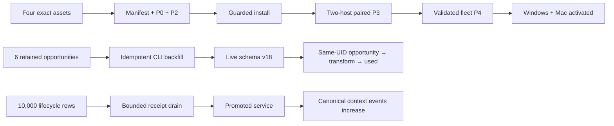
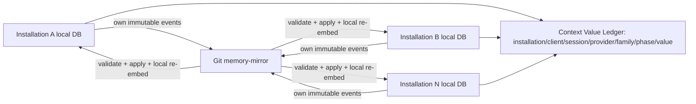
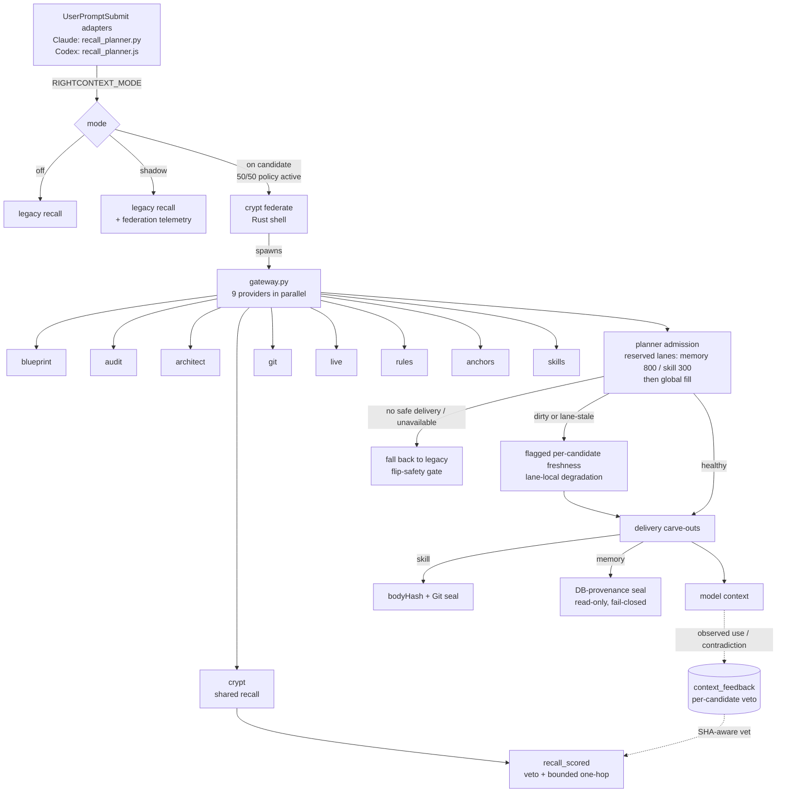

# Membrane — Windows + Mac current state and backlog (source of truth)

**What this is:** the single cross-platform current-state map of Membrane (the umbrella context system; historically called RightContext in older docs and internal aliases) and Crypt (its durable-memory engine; literal `crypt*` identifiers remain compatibility surfaces) for both Windows and Mac. Design rationale lives in `docs/UNIFIED-CONTEXT-SYSTEM-ARCHITECTURE.md` (2026-07-12, design-era) and `tools/lib/CONTEXT-ENGINEERING.md`; the operational telemetry/identity coverage contract and 2026-07-21 audit are in `docs/MEMBRANE-TELEMETRY-IDENTITY.md`; per-feature ADRs + measurements live in the `docs/plans/2026-07-*` files linked below. This doc is the index of *what is live now* and *what is next*. Last updated **2026-08-01**.

## Repository posture (honest)

This tree is an **internal mirror / workspace-coupled checkout**, not a self-contained public product. Live planner hooks, Crypt DB paths, federation providers, and install binding assume the Damned Designs studio workspace (`tools/`, shared hooks, launchd/Task Scheduler wiring). Public MCP surface names use Membrane; RightContext remains a compatibility alias in headers, telemetry tokens, and historical evidence. Capability truth is generated from `mcp/server.mjs`, `sentinel/hooks/membrane-capability-matrix.json`, and `docs/rightcontext/federation-freeze-v1.json` by `mcp/capability-inventory.mjs`; exercised path: `mcp/capability-inventory.test.mjs`.

## Cross-provider scores — lane policy (P1)

Raw `provider_score` values are **not** cross-provider-comparable. Admission uses reserved source-kind lanes (memory 800 / skill 300 tokens of the default 4096 budget) so incompatible scales (overlay recency prior vs memory cosine) do not starve each other. Full recalibration is deferred; lanes are the standing policy (see `crypt-core/planner.rs`).

## RMS + Markdown Doc Spine absorption — COMPLETE 2026-07-30

RMS A1–A5 & Doc Spine D1–D4 are implemented, promoted, installed, & certified on macOS and
Windows. Final runtime root/Membrane is `74b0ad52` / `944ea3ad`; engine tree is
`ac41729c4f8857756529a0832e0675e39dd52e9c740e28961fdb5ae358631a7f`.

- macOS: exact final CLI/service pair installed; launchd owns `tools/bin/crypt-service`;
  EmbeddingGemma Q4/768 health, exact fingerprint/release generation, writes, authenticated Q4,
  Doc Spine CLI, focused Rust, & MCP tests pass.
- Windows: Q1–Q5 preserved; exact pair installed; resident service healthy; immutable OWN-only
  evidence commit is `6cd71abb89da454c179e990f6fb429ba21ab32b5`; attestation SHA-256 is
  `9c4126d6dd5e2963b0846575da1bdd21cfc9788c740a4b95495790ec98e80af1`.
- Runtime behavior stayed at `944ea3ad`; qualification-only corrections are isolated in
  `de214878`. Windows made zero source edits & zero P0–P4 actions.
- CodeRight consumes exact Membrane revision `944ea3ad` for `crypt` & `crypt-core`; no
  duplicate engine source or retired root-repository dependency remains.

Older candidate, pending, paired-P3/P4, or install checkpoints below are historical evidence, not
current authority.

## Resident federation gateway — source-complete 2026-07-26

`POST /federate` hosts the federation gateway as a supervised resident
`gateway.py --serve-stdio` worker (plan + review disposition:
`docs/plans/2026-07-26-federation-resident-gateway.md`). The hook is
HTTP-first with automatic CLI fallback; `RIGHTCONTEXT_FEDERATE_TRANSPORT=cli`
pins the old path instantly and the CLI is never deleted. One deadline
end-to-end (`maxWaitMs` = the hook's remaining budget); one-slot admission
returns 503 `federate_busy`; circuit breaker opens 60 s after three failed
cycles; worker tree-killed and recycled after any unfinished lane.

Acceptance receipts (Mac, scratch serve, generation-matched): golden parity
`packet`+`receipts` identical CLI vs HTTP; warm `/federate` **p50 81.8 ms /
p95 108.8 ms** over 20 runs (`tools/.cache/metrics/federate-parity/`), vs
434–506 ms gateway stage + ~150 ms spawn on the CLI path. Against the
installed pre-route binary the hook observes an instant 404 and falls back —
zero behavior change until the next guarded install; the rollout receipt for
that install must be minted from a commit including this work.

## Live telemetry repair checkpoint — 2026-07-21

The `dc7780f2` four-asset promotion is installed and verified end to end. The resident Windows CLI
and service hashes are `c62efb6c…6fe83` and `c10617f1…b2867`; `/livez` reports release generation
`ccb9c362…c3489`, full capacity, and zero overload rejections. The promoted resident migrated the
canonical DB from schema v14 to v18; integrity remains `ok`, and the opportunity table and exact
transform join are live.



These are separate recovery planes. The lifecycle snapshot
`tools/.cache/memory/outbox-snapshots/outbox-20260721-prepromotion.db` passes integrity with SHA-256
`d9c4c63fe15c0b0ce1bc95db6e17122194bd64899927c59e95e9958eebd6db55`; it contains the same
10,000 lifecycle rows (sequence 1–10000) and zero transform-opportunity markers. The bounded drain
delivered and deleted exactly 9,976 current-installation rows after an exact-receipt probe. Canonical
`context_event_log` grew from 2,604 to 12,610 while pending depth fell to 24. Those 24 rows all
belong to legacy installation `7ae57caa…ff6a`; they and the intact snapshot remain preserved.

The importer replayed six retained opportunities through the promoted CLI, failed none, and found
all six already present on an idempotence replay. A fresh live Read recommendation then persisted
canonically and its recommended `skel --opportunity` execution resolved the exact same
`opportunity.skel.07166ac103f5f02968d2a3e9c059e8ec` to `used`, joined to
`transform.34d6c026-fa44-48b0-94fb-cb1f66f76617` with identical installation/client/session/turn/
trace identity. Adoption is computable across those dimensions and verb: seven opportunities, one
successful linked use, six unresolved recommendations, and zero errors.

Canonical proof is frozen in
`rightcontext-evidence/g2/final-dc7780f2/windows/installed-telemetry-repair.json`; paired assets,
manifest, P0, and P2 live beside it. `crypt-daily` remains intentionally disabled.

**Mac P2 and installation are complete (2026-07-22).** The earlier `p2-load-macos.json`,
`p2-load-macos-v2.json`, and `p2-load-macos-v3.json` receipts remain rejected historical evidence.
The immutable schema-2 `p2-load-macos-v4.json` receipt passed with a 1.416709 ms recall baseline,
1.891875 ms full candidate p99, and 0.406208 ms bounded ingress-producer overhead. Schema 2 uses
`min(10 ms, max(1 ms, 5% of baseline))`, while retaining recall-plus-ingress p99 separately as a
diagnostic. The manifest-bound guarded installer then installed the exact `dc7780f2` Mac CLI/service
pair. Installer verification passes; `/health` reports writes enabled and release generation
`ccb9c362…c3489`; the resident DB is schema v18 with clean integrity and foreign-key checks; live
recall succeeds; and `com.adrian.crypt-daily` remains disabled.

**Bidirectional convergence, paired P3, and fleet P4 are complete (2026-07-22).** Mac published its first
handback at `f72e1bad`; Windows consumed it and published the resident-service-backed return at
`883dac72`; Mac then acknowledged the Windows origin through sequence 176 at `7e15d3e8`. Both
replica cursors are current, and the Mac conformance report passes append-only, convergence,
identity, local-delta, peer-accounting, privacy, prompt-p99, replica-cursor, and scheduler checks.

The diagnostic Mac P3 packet under `rightcontext-evidence/g2/final-dc7780f2/macos/p3/` binds the
accepted generation-34 service instance `c5781940-92e7-473c-8427-55c71eb11bb9` from
`2026-07-22T07:54:08Z` through `2026-07-22T08:21:13.640Z`. Its 475 accepted current-window events
have zero lifecycle gaps, and `conformance.json` records `status=pass` with every check passing.
Pre-install history remains immutable and separately reports 28,864 events with 4,736 gaps; 9,411
post-start events from two other service instances plus five unbound transcript turns are explicitly
outside the accepted observation window. No event was synthesized or deleted. This older Mac packet is
not promotion-valid because its schema-5 inventory stored `observed_through` as
`2026-07-22T08:21:13Z`, truncating the reconciliation cutoff
`2026-07-22T08:21:13.640Z`; its older strict snapshot projection also omitted the redundant
`summary.rejected_input_event_count: 0`. The strict gate rejects that binding and will not be
weakened. Commit `719aa5ee` adds the corrected Mac before/after captures: each preserves the exact
`2026-07-22T08:21:13.640Z` cutoff, records 475 current-window events across four sessions with zero
gaps, passes all ten checks, and advances the strict snapshot from `12:39:24Z` to `12:45:13Z`.

Windows before/after P3 records 1,426 current-window events, zero gaps, ten passing checks, and
strict snapshots at `12:00:58Z` and `12:09:45Z`. The paired before and after P3 gates are
`ced36d8d…6fa2` and `a27d4f23…47f0`; all four host captures retain winner map
`f010ce89…0d83`. The derived no-new-events proof observes `1426→1426` on Windows and `475→475` on
Mac. The atomically assembled schema-v2 receipt at
`rightcontext-evidence/g2/final-dc7780f2/promotion/p4-final/promotion-receipt.json` validates at P4;
its SHA-256 is `0da160c2…6b75`, and the P4 gate SHA-256 is `e4eda80e…20e7`.

Windows is activated through the sole guarded setup door. Its machine-local candidate policy is
`on`, cohorts are enabled at 50% control, promotion receipt binding is `0da160c2…6b75`, cohort
preregistration binding is `72e18326…f89a`, and active-policy SHA-256 is `b44e73d0…f182`.
The resident CLI/service hashes still match the manifest, the live DB remains schema v18, service
health is green with zero capacity rejections, and `crypt-daily` remains disabled. Mac has now
passed the same P4 receipt gate from `/Volumes/D/claude`; its candidate policy is active at 50%,
receipt SHA-256 is `0da160c2…6b75`, Crypt health is green, and
`com.adrian.crypt-daily` remains unloaded.

The first post-fleet-activation replay successor was frozen after 5/60 cells when the resident
provider returned typed `crypt_embed_missing`; it is non-resumable and ineligible for
acceptance. A separate five-row diagnostic and the replacement run's exact five-row smoke passed
against unchanged service generation `ab96ce51…ede03`. Replacement
`gate3-fresh-20260723-a` is running the immutable serial 20 × {30s, 5m, 30m} protocol in a new
directory. Gate 3 remains open until all 60 cells freeze successfully and the separately required
current genuine-prompt/value analysis passes. Gate 2 remains calendar-bound to three eligible
post-activation production dates.

## Deployment boundary — 2026-07-20 (historical installed baseline + uninstalled source candidate)

Final successor `d891b27490beff78cc35f1ac55c2697736056d04`, tree/release generation
`a551336c2f413d9815cd6c217595665a99d27b248b512eab0c7ff79acd9f2a42`, is the installed Windows
release. Installed SHA-256 values are CLI `dfdab7b0…6911d` and service `22d03bd3…224224`.
The genuine Windows/macOS runtime and three-repeat v2 ranking captures validate; their final paired
comparison passes with zero jitter and held-out cross-host drift below the frozen limit. The
four-asset manifest, source-owner verifier, guarded two-binary installation, installed client
fail-closed/recovery smoke, and authenticated dirty-workspace freshness call all pass. Content-free
integration evidence is frozen at
`rightcontext-evidence/g2/final-d891b274/windows/installed-integration-v1.json`. The earlier
`815cd511` installed Gate-1/2 artifact remains the strict cap/budget, watchdog, isolation, and
RC-2.5 acceptance record; d891 changes only the compiled Crypt boundary it supersedes. Gate 2
retains only its calendar-bound three-production-date floor.

The machine-local `candidate` policy is active with mode `on`, cohorts enabled, 50% control, and
policy `rightcontext-planner-v2-balanced` (policy SHA-256 `5594fa09…bb712`).
`crypt-daily` stayed disabled before activation, throughout the prior failed runs, through the
d891 installation and runtime smokes, and at this update. Three `815cd511` replay runs remain frozen
failed/non-resumable after 7/60, 3/60, and 33/60 cells; their freshness defect was repaired at 5ea
and superseded by the compiled d891 boundary. The d891 four-asset installation and freshness proof
are complete, and CodeRight pins the exact source at pushed commit `dba695c4`. The first post-install
d891 replay is frozen non-resumable at 9/60 after operator contention. Its stable successor
`gate3-successor-d891b274-stable-20260720T0905Z` later stopped safely at 42/60 when the hook binding
changed during implementation; `frozen-failure.json` is verified with
`reason=hook_binding_changed`, results SHA-256
`137db22e00b9293596e570dc7f744cb9c1ecf322ad521678f30582243bf05507`, and
`acceptance_eligible=false` / `resume_allowed=false`. No frozen run is resumed or spliced.

At the 2026-07-20 checkpoint, the then-current source candidate replaced prompt-blocking freshness with resident stale-while-revalidate,
bounds every background Git child to two seconds with kill-and-reap, enforces a 900 ms production
hook ceiling, prevents candidate failure from starting sequential legacy recall, and adds the
content-free N-installation Context Value Ledger. That historical candidate was not yet installed at
this checkpoint. Its successor installation and P3/P4 state are recorded above. Gate 3 remains open,
and `crypt-daily` remains disabled.

**Current paired-release checkpoint — 2026-07-21:** Windows froze the release-owned source at
`5f83bb7558d0691876c80e61cf62af6440d3ed6f`, tree/release generation
`1e1f30d3a1d46f3cd1d2e6b395d703f13e0917efffc2e0673fbaa0cbeabbabe9`. The isolated Windows CLI
SHA-256 is `b7a2f205290a9b22b1a4a65afb7d177e0d2e025880f4c88bba1c4c9449f0799c`; service SHA-256 is
`66ac70d3e87fc6cf6631c208b5e125fe4cb3d7f1dbdde304fa633a0954470e7b`. Protocol-v2 capture and
validation pass with three repeats; evidence is committed at `505623d8` under
`rightcontext-evidence/g2/final-5f83bb75/windows/`. The authenticated `047e84c2` Mac pair is
superseded because `c73550c8` subsequently changed the release-owned tree. A genuine `5f83bb75`
Mac pair, paired comparison, four-asset manifest, P0, and both-host P2 remain mandatory before any
candidate installation. The installed d891 pair, policy, production DB, replay state, and disabled
daily scheduler are unchanged.

The promotion chronology is source-enforced and non-circular: P0 binds the four release assets and
canonical active-installation membership at a pre-install enrollment cutoff; P1 dual-write parity
and each P3 host report use their own later reconciliation cutoff and input count, bounded by P0 and
the receipt timestamp. Strict snapshots and conformance watermarks bind directly to those runtime
reconciliations. The promotion/reconciliation contract suite passes 103 tests. No diagnostic
frozen-journal count is promoted into P0 or substituted for installed P1 evidence.

That sentence is the current promotion boundary. The d891 installation, active historical policy,
and frozen replay records above remain genuine evidence for their own commits, but they are not P3
or P4 evidence for this newer source candidate. No current-candidate Mac/Windows installation
conformance, bidirectional convergence, strict aggregate snapshot, per-installation P3 reports, P4
aggregate receipt, activation, cohort exposure, or fresh replay result has been collected yet. Source-green is
not runtime-green.

## N-installation replication and value accounting — source candidate

Yes: the intended loop is one local SQLite/embedding index per installation plus a shared
append-only Git mirror. An installation pulls every peer's immutable events, validates the entire
history, deterministically applies winners/tombstones, embeds them locally, exports only its own new
origin events and monotonic cursor/health row, then pushes. SQLite files, embeddings, raw prompts,
paths, and local diagnostic logs never cross installations.



The candidate removes the old hostname/Windows/Mac identity assumption. Each install gets an opaque
UUIDv4, increments a startup generation, detects cloned identity claims, and rotates only through an
explicit lossless clone-recovery command. Five- and ten-installation fixtures prove cardinality is
data, not hardcoded topology. Append-only enforcement rejects event mutation/deletion, foreign-origin
writes, cursor rollback, causal-field mismatches, non-positive or non-contiguous per-origin
`origin_seq`, causal future-clock skew, and clone collisions before apply/push. New events carry the
paired `logical_clock` + `origin_seq`; winner and cursor progress use causal order instead of wall
clock. Timestamp-only legacy events/cursors remain readable. Active workspace claim/retirement
intervals, not a permanent machine list, determine which installations owe peer-apply evidence.

Replication is logically separate from daily maintenance. The lightweight plane only pulls,
validates, applies/re-embeds, exports local mutations/cursors, and pushes; Morph mining, curation,
derived exports, and hosted-metrics refresh belong to the maintenance plane. They are still bundled
by the legacy `daily-sync.sh` wrapper; the proposed generic `daily_sync.py` runner is not implemented
and is explicitly deferred until after paired P3/P4 acceptance. Recurring convergence therefore
remains intentionally off for this gate run.
After paired P3/P4 acceptance, a separately named, configurable replication schedule is the correct
freshness improvement; enabling it must not enable `crypt-daily` or hardcode any installation.

The Context Value Ledger records expected, started, terminal, admitted, delivered, and downstream
used/ignored/contradicted/unknown states for memory, Morph, Blueprint, skill output, rules,
transforms, replication, and namespaced future families. Reconciliation reports every missing hook,
missing terminal, failed read/write/sync, should-have-used-but-did-not opportunity, and value join by
installation, service instance, OS/arch metadata, client (Claude/Codex/other), provider, session,
turn, policy, and cohort. Production cubes exclude smoke/eval by default.

Prompt hooks do not open or migrate SQLite. Python and Node each append one bounded, content-free
lifecycle intent; the resident Crypt service expands the canonical events, validates exact
expected counts and activation attribution, and commits them transactionally under its startup
identity lease. Cursor-after-commit replay is idempotent, malformed records are represented by
bounded hashes without blocking a valid tail, and consumed journals rotate through a sealed quiet
period. Source-only 1,000-sample measurements reached p99 0.310 ms for a quiet Python producer and
0.644 ms for Node. These are producer measurements, not P2 promotion evidence: the fresh same-commit
binary must still prove recall plus durable ingress under the full 1/2/5/10 load gate.

The independent turn census reads uncapped local Claude, ClaudeMM, and Codex session sources outside
the hooks being audited. It reports discovered, parsed, unreadable, malformed, and skipped sources
per client; a missing or unparseable source is unknown/lost coverage, never a zero-turn success.
Snapshots are UUID-named, hash-enveloped, cutoff/watermark-bound, freshest-per-installation, and
`manual_unscheduled` while the daily job is disabled. Missing or partial fields remain null/red; they
are never converted to zero.

The hosted view keeps exact content-free lifecycle counts and latency/quantity distributions down to
opaque session, operation, phase, and status. Its replication matrix resolves each deterministic
origin hash back to an already-enrolled opaque installation UUID and shows observer, origin,
applied/available sequence, lag, current status, and prior failure reason. An unresolvable legacy
origin remains `unknown`; a successful peer with no causal events is explicitly `zero-event`, not
failed or silently omitted. Raw ledger rows and event/trace/artifact identifiers remain local.

For `N` active installations, fleet closure contains the complete `N × (N - 1)` directed
observer→remote-origin matrix. Each local diagonal is proved separately by that installation's P3
local delta, local reconciliation, and strict snapshot; self-sync rows are neither expected nor
synthesized.

Current-candidate source state: P0–P2 validators and deterministic fixtures are green. A
digest-pinned P0 release artifact and measured P2 simulated-N/load artifact do not yet exist for the
source candidate and are not claimed by those fixtures. Installed P3 evidence is not yet
collected on either platform, so this document makes no claim about the candidate identity,
schema-v14 DB, local cursor, or snapshot currently present on either machine. Genuine Mac and
Windows conformance must each publish a distinct identity/cursor/local delta, converge
bidirectionally, reconcile their loss-aware censuses, and emit strict snapshots. P3 then validates
both installation reports; P4 separately validates the combined fleet evidence and policy/cohort
preconditions. No host's proof substitutes for another's, and P3 never implies P4.

The only valid remaining order is: push source → Mac `git pull --ff-only` to that exact commit →
ordinary setup with the daily job disabled → explicit Mac Morph one-shot batches until
`no_new_sessions` → guarded same-commit install on Mac and Windows → bidirectional sync/convergence
→ per-installation census/reconciliation/snapshots → P3 on both + aggregate P4 → explicit
policy/cohort activation → wholly fresh replay. `crypt-daily` stays disabled at every boundary.

## 2026-07-18 gate-contract status (stable RC IDs)

- **RC-1.5-PACKET-BUDGET — INSTALLED SMOKE COMPLETE:** the versioned contract, Python and
  JavaScript finalizers, and Rust planner input/output now carry the configurable packet-character
  budget. The default is 30,000 Unicode code points; the finalizers enforce the exact sum of
  model-visible block `deliveredChars` against
  `min(configured_packet_budget, remaining_10k_door_capacity)`. A valid lower override downgrades
  whole low-priority blocks to `metadata_only` with `packet_budget_exceeded`, preserving selected
  tokens while zeroing rendered/delivered accounting; anchors, explicit protected rows, and dirty
  edit overlays are protected last. Gate 1.4 remains the independent 10,000-character returned
  `additionalContext` door, so the 30,000 default is inert and retains the existing
  `additional_context_char_cap` reason. Both clients accept only the same strict positive base-10
  safe-integer override grammar, and the loopback planner rejects a present invalid override with
  typed `400 invalid_packet_char_budget`. The two native CLI doors use the same safe-integer ceiling.
  Source evidence is green: 138 Python/schema/skill tests, 40 JavaScript delivery/skill tests,
  35 Rust planner tests, 2 Rust CLI boundary tests, and 19 Rust catalog/route tests. The schema
  freeze is intentionally rebound. The paired successor is installed. Both installed clients now
  prove a 700-code-point override binds with `packet_budget_exceeded`, while the independent
  rendered-door smoke stays at or below 10,000 Unicode code points and attributes its truncation
  only to the door cap. The strict artifact above validates both accounting paths. This complements,
  and does not alter, the existing 4,096-token lane budget.
- **RC-2.3-SMOKE-ISOLATION — COMPLETE:** commit `315f3faf`
  implements schema-v11 `recall_log_smoke`, a ledger-bound read-only dry run and exact-355
  transactional isolation/backout, fail-closed `/recall` smoke routing, exclusive Python/JavaScript
  heartbeat/delivery/shadow/fallback routing to
  `tools/.cache/metrics/rightcontext-heartbeat-smoke.jsonl`, daily-analysis contamination refusal,
  and a typed immutable `_events_smoke/` writer that canonical sync never reads. Source evidence is
  green: 155 Rust library tests, 12 Rust CLI tests and all integration suites, 162 Python tests plus
  10 subtests, and 32 Node tests. After the exact successor install, the guarded transaction matched
  and moved exactly 355 rows; `production_smoke_rows=0`, the target digest is
  `sha256:0b409d92…caabf`, and the 1,570 non-target rows retain digest `sha256:4f5d5483…30ffa`.
  Post-apply dry-run reports `matched_count=0` and `already_applied=true`. The sorted 1,733 durable
  `_events` path/SHA pairs are equivalent before/after (canonical map SHA-256 `4ce75d5a…56cc1`).
- **RC-2.5-SERVICE-RESILIENCE — INSTALLED CLIENT+WATCHDOG COMPLETE / THREE DATES OPEN:** Windows
  evidence `rightcontext-evidence/g2/final-76702914/windows/service-resilience-v1.json` is genuine
  isolated real-model burst evidence for candidate `767029147181196a79bd8d3ae9ce9420568cf4c3`:
  16 puts produced 8 accepted/persisted `200` rows and 8 `429` overload rejections; the accepted
  maximum was 56,888.62 ms (56.9 s). The load test passed, but independent review rejected and
  superseded the candidate: detailed health did not actively probe a failed/busy MemDb dependency,
  ambiguous timed-out mutations lacked server-enforced replay idempotency, diagnostics shared
  Tokio's global blocking pool, and saturation tests depended on scheduler sleeps. It was never
  installed (`installAllowed=false`). The reviewed successor repair
  is frozen and pushed at `815cd5112f822d306db69c8b4eafcbf54585036e` with Crypt tree SHA-256
  `a2a81039c606e1dbe5266d4698a79daddbcbc4dd13caf587a7c1a121402312c2`. It isolates liveness and
  dependency diagnostics from bounded workload/model admission, adds server replay idempotency,
  and gives CLI/dashboard writes privacy-safe durable retry keys that fail closed on ambiguity.
  Independent spec and quality reviews pass. Verification is green: `cargo test -p crypt`
  (188 library, 35 CLI plus one intentionally ignored helper explicitly exercised by its parent,
  and every integration/doc suite), strict all-target Clippy, Rustfmt, scoped diff/secret checks,
  and 18 Node dashboard-outbox tests. This is source proof, not deployment/capacity proof. Limits
  remain: no SQLite connection pool, serial model execution, a bounded FIFO query-embedding cache,
  process-local server replay state, operator recovery for retained confirmed CLI markers, and no
  sustained capacity SLO. A clean isolated Windows build of that exact source is valid and is now
  installed: CLI SHA-256 `0baa7975171cc305ffda3ca6581bb20285c1c272b2e58a7c95486dbfd96b1231`,
  service SHA-256 `1e04ce3bbe5b8f0bd524ae419b56fca77fc777a10d4a678463e3f3bc41f2e139`.
  `rightcontext-evidence/g2/final-815cd511/windows/vector-ranking-v2.json` validates with three
  repeats against the non-vacuous successor probe SHA-256
  `098b51307a44d05096889a92a5273be221d6c50d875e84e50d9d324a524a40be`, model
  `embeddinggemma-300m-q4`, fingerprint `pf:v1:4b7523b3…`, and dimension 768. The genuine same-source
  Mac CLI/service hashes are `6f1f154bd4fc7806138de5093fe451cee320045107259ce3f79fd3c72b41bd0c`
  and `71975e0a22fb5a989d497601134186c30f037ee2f6da64653c6d72e32ea48162`;
  its runtime-assets-v2 and vector-ranking-v2 artifacts validate under the same source, tree,
  generation, probe, model, dimension, and fingerprint. The final comparison artifact
  `rightcontext-evidence/g2/final-815cd511/paired-comparison-v2.json` passes and the four-asset
  `tools/lib/crypt-release.json` binding is complete. Windows installation is complete.
  The disposable service-resilience capture harness is **INSTALLED EVIDENCE COMPLETE** at
  `tools/pipelines/memory/membrane-service-resilience.py` with focused tests at
  `tools/pipelines/memory/test_membrane_service_resilience.py`. The original harness landed at
  `f5b2caec`; the predecessor-compatibility and listener-executable binding repair is committed and
  pushed at `aa5e2d64`, and the authenticated legacy-route boundary repair is pushed at
  `10375eab`. The bounded predecessor-health quorum repair is pushed at `4c935880`. A fresh
  Windows model-path repair is pushed at `8484f2fd`, and the isolated overload-counter window is
  pushed at `b94fc3f7`. Installed-runtime binding and evidence-semantics repairs are pushed at
  `0d054aa3`, `7ba2e716`, and `198e9e38`; a fresh 2026-07-19 check has 51/51 focused unit tests green and both files
  compile under Python 3.11; independent spec and quality reviews pass. The harness
  binds the exact `815cd511` identity, canonical run root, non-vacuous total-plus-model overload
  accounting, frozen `serve.rs` SHA-256, and full binary/source identity. It owns candidate
  processes only through retained `Popen` handles, proves final port refusal before production-after
  checks or atomic PASS publication, handles `BaseException` cleanup, surfaces cleanup failure,
  claims no child-tree cleanup, limits filesystem claims to declared writable paths, and limits
  production-safety evidence to typed stable health/identity plus zero harness-run-tag contamination
  through read-only HTTP/SQLite observation. It additionally binds the production listener PID,
  executable path, and executable SHA-256 before and after observation before any bearer token can be
  sent to a candidate process. The first genuine capture attempt is preserved under
  `tools/.cache/memory/service-resilience/815cd511/20260718T191921859321Z-dcb85391da854da394f74bb0ac4ff298/`.
  It failed closed at `production-before` because the harness required successor-only `/livez`
  semantics from the installed `148b41b2` predecessor; the candidate never started and no PASS
  artifact was published. A second immutable attempt is preserved under
  `tools/.cache/memory/service-resilience/815cd511/20260718T194708347189Z-308ca435e6314480b11df9e36f28ae7b/`.
  It also failed at `production-before`, after the executable binding but before candidate start,
  because the exact predecessor protects its nonexistent/publicly unavailable `/livez` route with
  a `401` auth boundary while leaving `/health` public. The repaired baseline now accepts legacy
  `/livez` `401` or `404` only alongside the exact manifest-, executable-, and healthy-public-health
  predecessor binding; it never reads or sends the production token, and the successor baseline
  remains strict. A third immutable attempt is preserved under
  `tools/.cache/memory/service-resilience/815cd511/20260718T195324631143Z-4789cdecedc44935a8e6a8687c55d693/`.
  It failed at `production-before` because one public `/health` request exceeded the original
  three-second one-shot timeout; an eight-probe follow-up measured the exact same bound listener at
  1–6,517 ms for successful health responses and one response beyond eight seconds. This is the
  installed predecessor's known worker-starvation defect, not successor evidence. The repair now
  requires two identical typed healthy predecessor projections within five read-only attempts, with
  a ten-second cap per attempt; it records content-free attempts/status/latency/error counts, unwraps
  direct and urllib-wrapped timeouts, and still rebinds PID/path/hash after the quorum. Persistent
  starvation, projection disagreement, or any listener change fails closed. A fourth immutable
  attempt is preserved under
  `tools/.cache/memory/service-resilience/815cd511/20260718T200444500881Z-26e49646f2cd4576b4b8b6f4127aaf4e/`.
  It passed production-before and topology checks, started only the disposable candidate, then
  failed closed at baseline because ONNX reported the copied model graph nonexistent and the service
  correctly fell back to `hash-256` with writes disabled. The files existed and matched the frozen
  runtime record; the graph path was exactly 260 characters and the external-data path 265, crossing
  the native Windows boundary. Future run IDs are shorter but remain timestamped and carry 48 random
  bits; atomic create-or-fail collision handling and the no-resume rule are unchanged. A topology
  preflight now caps the longest frozen model asset path at 240 characters before copying or starting
  a candidate; the canonical generated path is 239. A fifth immutable attempt is preserved under
  `tools/.cache/memory/service-resilience/815cd511/20260718T201324Z-e7d0403a7e0e/`. It loaded the
  exact frozen model, passed baseline and idempotency, then failed closed in saturation because the
  total overload-counter delta was three for two explicit probes. Its immutable scratch DB contains
  exactly nine memories and nine put/update events: the prior idempotency row plus all eight
  saturation writes, proving no admitted background model write was rejected. The extra total-lane
  increment came from the harness's setup/diagnostic interval because the old counter baseline was
  sampled before that interval. The repaired exact window snapshots counters only after model-queue
  rendezvous and immediately before the explicit probes; every probe must still be typed `429`
  `model_busy` with `Retry-After: 1`, and total and model deltas must both equal probe count exactly.
  Any late or other-lane increment still fails closed. All five failed runs are diagnostic evidence,
  not acceptance evidence, and remain immutable. The sixth fresh run
  `20260718T201920Z-d126c00f292a` passed every bound check and is tracked byte-for-byte at
  `rightcontext-evidence/g2/final-815cd511/windows/service-resilience-v1.json` (SHA-256
  `6e2ea8d4ae9c2ed400eb5478eca997a668b6ecda5374e98793e8f1b473b68c23`). It proves the exact
  `815cd511` Windows pair and EmbeddingGemma-768 runtime; byte-identical idempotent replay with one
  row/event and a conflicting replay rejected `409`; eight accepted/persisted saturation writes;
  two exact typed `429 model_busy` overloads; sub-two-second busy-health/liveness diagnostics;
  integrity and prior effects across a real PID-changing restart; one new post-restart keyed write;
  typed dependency failure; final candidate port refusal; and stable healthy predecessor identity
  with zero run-tag rows/events before and after. Independent artifact review passed, both candidate
  PIDs are absent, candidate port `61962` is refused, production PID `49300` remains the exact
  manifest-bound predecessor, and `crypt-daily` remains disabled. No production database,
  release manifest, cohort, or replay state changed during that pre-install capture. The exact
  same-source Mac handback, paired comparison, and four-asset manifest passed before installation.
  Failed-run directories are never resumed, appended, or spliced.
  The first post-install run `20260718T225003Z-850d878d02d1` is preserved failed/non-resumable: one
  read-only production preflight request timed out, no candidate started, and no PASS was published.
  A 30× `/livez` plus 30× `/health` follow-up had zero failures. Fresh run
  `20260718T225146Z-d895265591a9` then passed and is tracked byte-for-byte at the same evidence path
  (SHA-256 `13abb1d43398d33626e3870d728770adda0c39dc9c063c51dd6d08b13484ccb6`).
  It binds the installed CLI/service and manifest, exact release plus stable per-process boot identity,
  byte-identical `200/200` replay with one row/event and conflict `409`, eight accepted/persisted
  saturation writes plus two exact typed `429 model_busy` rejections, busy-health `503` with livez
  `200`, integrity/effect preservation across a PID- and boot-ID-changing restart, a new keyed write,
  typed dependency failure, and final port refusal. Both candidate PIDs are absent; resident PID
  `23600` remains healthy with zero run-tag rows/events before/after. Independent artifact review
  passes. Client down/hung/cold-restart fallback and disabled-scheduler watchdog observation now
  pass in `installed-gates-v1.json`; only three production dates remain open. None of the explicit
  capacity residuals is claimed solved.
- **RC-3.1-ROLLBACK — SOURCE COMPLETE / LIVE FAILURE EXERCISE OPEN:** commit `2319d942`
  adds a tracked `selectedProfile`, explicit atomic machine-local activation, fail-safe legacy
  loading in both planners, and an immutable create-or-identical failed-NI decision artifact.
  Ordinary setup is inert; orphan activation arguments fail before setup side effects; missing,
  invalid, hostile, or cross-language-skewed policy JSON collapses to legacy with cohorts off.
  A temporary-fixture drill proves the failing metric/CI/margin, `sampleSource`, policy version,
  Gate-1/2 reopening, Gate-3 halt, and byte-preservation contract. Source evidence is green:
  143 Python and 36 JavaScript tests plus independent spec and quality review. Tracked and active
  selection are now `candidate`; no genuine completed cohort has failed non-inferiority. Only that
  real failure would authorize a reviewed rollback-selection commit, state rejection record, and
  live exercise.
- **RC-3.2-PHASE0 — FRESH REPLAY FAILED / CURRENT REPAIR AWAITING MAC EVIDENCE:** commit
  `750a51ba13f74124ce792f69c24aaf33ac4abd63` made frozen-failure sentinels authoritative.
  Installed Gate-1/2 edges are closed and the candidate policy is active. Three fresh `815cd511`
  runs are frozen failed/non-resumable at 7/60, 3/60, and 33/60 cells; the exact content-free
  bindings live in `rightcontext-evidence/g3/activation-815cd511/windows/activation-replay-v1.json`.
  The 85,031 ms freshness terminal is repaired in source at `5ea40c08`; its genuine same-source Mac
  pair and final comparison pass. Later compiled Crypt hardening at `d891b274` supersedes 5ea as
  the installable release boundary. The genuine d891 pair, comparison, manifest, coordinated
  installation, and installed freshness proof are complete; a wholly fresh replay is running.
- **RC-MAC-BLOCK — COMPLETE FOR CURRENT `d891b274`:** commit `05c4057f` supplied the genuine
  clean-archive macOS CLI/service build, `runtime-assets-v2.json`, `vector-ranking-v2.json`, exact
  hashes, and scoped state note for final successor `815cd5112f822d306db69c8b4eafcbf54585036e`.
  Independent Windows validation found exactly the three authorized paths, valid direct-snapshot
  runtime binding, no Windows cross-labels, and a valid three-repeat v2 capture. The final paired
  comparison passes and `tools/lib/crypt-release.json` binds the four assets. Windows install and
  guarded telemetry migration remain complete for installed `815cd511`. Rust freshness changed at
  `5ea40c08`, so that earlier pair cannot authorize the repair install. Windows source/tree,
  build-info, runtime-assets-v2, and three-repeat vector-ranking-v2 evidence validate. The matching
  genuine Mac artifacts validate under the same source/tree/generation/probe/model/fingerprint, and
  the 5ea comparison passes. The source-owner gate correctly refuses its installation because
  `d891b274` later changed compiled Crypt source. Windows d891 build/runtime/ranking evidence is
  valid and CodeRight pins d891. Same-source d891 Mac evidence, comparison, manifest, coordinated
  installation, and focused installed checks now pass; the new replay is in progress.
- **RC-IDS — DONE (documentation/orchestration only):** backlog rows, commit subjects, and future
  state transitions use stable RC IDs. This naming change closes no correctness, availability,
  measurement, quality, or performance acceptance criterion.

**Cognition Layers 9–11 remain `[Target]`:** `crypt plan`, `crypt think`, and
`crypt verify` are not executable before genuine Gates 1–3 acceptance. Naming the family does
not authorize implementation, a second store/embedder/sync path, or a model-optional primary door.

**RC-T.1-CAPABILITY-PROBE remains `[Target]` / non-gating:** after genuine Gates 1–3 acceptance,
a tenth federation provider may probe session capabilities once at SessionStart, cache until the
environment changes, and surface content-free contradictions such as a standing rule mandating an
unavailable tool. It consumes no per-prompt packet budget and does not expand Gate 1, 2, or 3.
The governing specification is Part C of
[`2026-07-18-codex-handoff.md`](plans/2026-07-18-codex-handoff.md).



## Deployed feature baseline

| # | Feature | State | Key files | ADR + measurements |
|---|---|---|---|---|
| 1 | **Feedback rail** — per-candidate recall self-learning; `get`→used, delete/supersede→contradicted; verified `contradicted` = veto-until-superseded (sha-aware); shared `recall_scored` and live `/recall` both apply it; persisted `context_feedback` (schema v7); `metrics.feedback`. MCP `membrane_feedback` now persists through the engine/CLI feedback path with `LifecycleReceiptV1` readback; unavailable-engine paths remain explicit `accepted_advisory` + `durable:false`. | LIVE (engine + receipt-bound MCP path); fallback explicit | `crypt-core/effectiveness.rs`, `crypt/feedback.rs`, `store.rs`, `serve.rs` (`/feedback`), `main.rs` (`feedback` verb), `mcp/server.mjs` (`membrane_feedback`) | [plan](plans/2026-07-15-rightcontext-feedback-rail.md) |
| 2 | **Skills = 9th provider** — workspace skill catalog served cross-repo; discover from any repo; `crypt skill-read <name>` loads bodies; provenance-sealed delivery (bodyHash + Git) | LIVE | `federation/providers/skills.py`, `skills-catalog/{ingest,provider}.py`, `main.rs` (`skill-read`), `recall_planner.py` carve-out, `lib/skill_frontmatter.py` | [plan](plans/2026-07-15-skills-as-rightcontext-provider.md) |
| 3 | **Memory-content delivery** — federation memory provider fixed from stub → real `recall_scored` + content previews; UTF-8 subprocess; planner `structural` key | LIVE | `federation.rs` (`memory_candidates_payload`), `federation/providers/crypt.py`, `recall_planner.py` memory carve-out | [plan](plans/2026-07-15-rightcontext-memory-delivery.md) |
| 4 | **Admission reserved lanes + memory DB-provenance seal** — two-pass admission (memory 800 / skill 300 tok lanes, then global fill) fixes overlay-flood starvation; memory delivery verified against a real DB row (read-only, fail-closed) | LIVE | `crypt-core/planner.rs`, `recall_planner.py` (`_verify_memory_row`) | [plan](plans/2026-07-15-rightcontext-admission-lanes-memory-seal.md) |
| 5 | **Link-graph recall** — `links(src,dst)` table (schema v8) from `[[wikilinks]]`; extract-on-write + backfill; shared one-hop recall at a discounted tier, depth 1, at most 20%/8 hits. The old federation merge is removed. | LIVE (333 edges at validation) | `memdb.rs` (links table), `store.rs` (`linked_neighbors`, `backfill_links`, `recall_scored_detailed`) | [plan](plans/2026-07-15-rightcontext-link-graph-recall.md) |
| 6 | **Reversible governance** — low-effectiveness never-used rows move to schema-v10 quarantine with complete row preservation; transactional list/restore CLI and API; duplicate pruning remains permanent | LIVE | `memdb.rs`, `dream.rs`, `serve.rs`, `main.rs` | completion record in the cold-chat handoff |
| 7 | **Codex hook parity** — `brief@local-brief` 1.0.4, one prompt hook, active-repo resolution, sealed memory/skill delivery, fail-open legacy path, no duplicate brief-policy injection | LIVE | `tools/codex-brief-plugin/recall_planner.js`, source plugin `hooks.json` | completion record in the cold-chat handoff |
| 8 | **Membrane-owned observable event ledger** — frozen `ObservableEventV1` ingress, content-free host/tool receipts, append-only SQLite persistence, explicit ingress-unavailable status | PARTIAL / active source path; installed service readback pending | `engine/crates/crypt/src/context_telemetry.rs`, `mcp/server.mjs`, `sentinel/hooks/observable-ingress.js`, `sentinel/hooks/claude-code/tool-receipt.js` | Fable H2/L1 implementation |
| — | **`RIGHTCONTEXT_MODE=on` flip** + flip-safety gate (degraded packet → legacy fallback) | **HISTORICAL 2026-07-16 FLIP, SUPERSEDED** — current machine uses the atomically activated candidate/on/50% policy; fail-safe loading and candidate fallback remain intact | `recall_planner.py` | memory `rightcontext-mode-on-flipped-2026-07-16` |

**Operational note (P0 fix 2026-07-16, Sol audit):** between cutover and 2026-07-16 evening, the federation memory lane recalled from the **global corpus only** — clients send raw filesystem paths as scope and `/memory-candidates` did not normalize them, so project-scoped rows never matched (verified by live probe). Fixed via `canonical_scope_chain` (scope.rs) applied inside `memory_candidates_payload`; regression tests + redeploy same day. On-mode memory deliveries before the fix under-represented project memories.

At that historical checkpoint the P0 repair did not satisfy IR-02a's frozen path/slug × scope × clean/dirty matrix, per-scope metrics, or installed exclusion matrix. The current installed successor's exclusion matrix now passes; per-scope production evidence remains governed by Gates 2–3.

**Operational note:** the current Windows runtime uses the Gate-2 rule: a bounded dirty overlay is
delivered with commit/digest/freshness provenance while Blueprint may degrade independently.
Only the absence of safe deliverable context or provider unavailability invokes legacy fallback.

### Narrow post-audit reconciliation — 2026-07-17

- **N1 / IR-45:** the stale `/recall` veto-bypass documentation claim is corrected; this is a documentation closure only.
- **N2 / IR-41:** audit and architect provider reads now use the canonical repository identity; write/read boundary normalization, wikilinks, collisions, provenance, migration, and acceptance remain open.
- **N3 / IR-43:** the no-Opus shared-rule correction is complete in source scope; no runtime closure is implied.
- **N5 / IR-20:** plan-document auto-ingest is opt-in, stopping that inflow only; typed authority/lifecycle and existing-row treatment remain open.
- **N4 / IR-40:** source repair is complete: evaluation recall logs with `observe=false`, mutation remains disabled, and production aggregates exclude nonproduction traffic. The installed boundary and candidate activation are complete; fresh replay proof remains open behind the `5ea40c08` paired repair.

### External audit validation — Kimi K3 full-flow audit, disposed 2026-07-18

A third-party Kimi K3 audit of RightContext/Crypt was independently validated in-session
against live `crypt metrics`, service `/health` (port 47851), the delivery/heartbeat logs, and
source. Disposition (full table:
[`2026-07-18-kimi-audit-validation.md`](plans/2026-07-18-kimi-audit-validation.md)):

- **Confirmed exactly (live-reproduced):** the deployment boundary above; feedback rail all-zero
  (`verified_used`/`verified_contradicted`/`advisory`/`vetoes` = 0); curate 21 runs / 433 merged /
  282 pruned; effectiveness 36/1,114 = 0.032 over corpus 1,909 (already labeled advisory lower
  bound by the engine); links 347 edges, 332/1,000 recalls with links, multi-hop `not_promoted`;
  contextual enrichment `not_promoted` (runtime bound); catalog `activeGrants`/`receipts`/
  `retrievalEvents` = 0 and warm planner `samples` = 0 on live `/health`; transforms skel
  169/2.43M, runc 151/1.84M, skel-fallback-copy 63/926k/0 saved, `prep:missing` 33; client mix
  claude 905 / claudemm 338 / codex 256; the 2026-07-17 daily-lane silent success.
- **Refuted (do not re-ingest):** (1) "Codex door = 16k chars" — both clients enforce the same
  10,000-code-point cap (`recall_planner.js:58`; no 16k in history). (2) "~7.9k-token lane sum" —
  real lanes are memory 800 + skill 300 inside one 4,096-token budget. (3) "packets saturate
  4,090/4,096 with 53–58 memory blocks" — the delivery log shows one row ≥3,900 selected tokens
  (4,064, 22 memory blocks), max 28 memory blocks ever, and 397/449 deliveries carrying **zero**
  memory blocks; the observed skew is under-delivery, not budget-stuffing. (4) Citations to a
  "unified-doc §14 3–4 weeks" estimate and an "open question 15.2 (BLAKE3 vs Ed25519)" — neither
  exists in any RightContext doc. Mirror events ARE unsigned, so the signing recommendation
  survives with an invented citation.
- **Stale (superseded by `daily-analysis/2026-07-18.json`):** the "15–36.6% rich delivery"
  availability picture is the pre-policy window (25.7% on 07-16/17; 64/175 workplan-era). The
  `rightcontext-planner-v1` window (07-17/18) shows `useful_packet_availability` **0.9739**
  (224/230) with the SLO breaching on **latency** (delivered p50 5,719 ms vs 1,000 target; p95
  13,500 ms vs 2,000). Availability-first sequencing therefore inverts to latency-first; the
  built-but-gated warm in-service planner (`samples: 0`) is the relevant lever and stays behind
  the existing paired-release and Gates 1–3.
- **Surviving external suggestions (receipt-gated ideas only; nothing here admits scope):**
  outcome distillation to close the feedback loop (ReasoningBank/ACE-shaped, respects the
  rejected `rendered=Used`/transcript-label alternatives); retrieval-time recency/frequency decay,
  which would also make the `score<0.2 && access_count==0` quarantine trigger satisfiable
  (write-time score is a constant 0.6, `store.rs:1797`, so the trigger currently cannot fire —
  live `quarantined: 0`); binding code-linked memories to Blueprint generations for automatic
  staleness demotion; Ed25519 signing of mirror events; a dead-man's switch on the daily lane
  (aligned with the pending fail-loud release above); a state-doc lint recomputing this ledger's
  live values. Packet ordering policy, an Morph surprisingness gate, per-client cohort
  stratification, and promoting `prep:missing` into a staleness counter are additionally parked,
  receipt-gated, and not admitted.

## Historical production cutover closure — Claude + Codex (validated 2026-07-16)

The scheduler now owns `tools/bin/crypt-service.exe` directly (no console-hosted wrapper), with
working directory `D:\Claude`. The live service reports the 768-dimensional
`embeddinggemma-300m-q4` embedder and writes enabled. Final release hashes and the complete backlog
disposition are recorded in `docs/2026-07-16-rightcontext-cold-chat-handoff.md`.

The authenticated production path is slower than the early canary suggested: clean federation is
~5.3–5.6s on this CPU, while dirty/source-stale federation short-circuits in ~0.26s before legacy
recall. Claude uses a 7s federation budget. Codex caps federation at 6.25s inside its 9s internal
deadline, reserving the full 2.5s legacy semantic-recall budget before the plugin's 10s outer limit.
Repo-code discovery is capped at 64 candidates. The prior ~2.4s statement below is retained only as
historical cutover evidence and is superseded.

**Source/runtime boundary — CLOSED 2026-07-16 (evening):** both binaries were rebuilt from source
including the `8e36cea1` hardening (worker-permit lifetime, collision-safe schema-v10 backout,
bounded graph metrics) and replaced through the documented redeploy lane (stop `crypt-serve` →
backup → swap `crypt.exe` + `crypt-service.exe` → restart → `/health` verified, 768-dim
embedder, writes enabled; new sha256 prefixes `2adbcca04d61295f` / `3bd6d66372de89a6`, prior
binaries retained as `.bak-20260716`). The shared `/recall` feedback veto and the schema-v10
backout guard are now live in the deployed runtime. The Codex planner is JavaScript invoked
directly from this checkout, so it needed no redeploy. Same day: the Windows `crypt-daily`
task was found `Enabled=false` (07-16 10:00 run missed) — re-enabled, missed run executed.

**Historical predecessor source/runtime boundary — CLOSED 2026-07-17, superseded 2026-07-19:** source commit
`148b41b2635fab1673494e5525a39005f32bc363` is pushed. Its `tools/crypt` tree digest is
`8364556848b068306daf121ac10eafe551a4fa2bffc48d04cd86ae2c29d36f6c`. The installed CLI hash is
`bc16128d8705a741e54946b0d3d5c749b969d9f27e517d119cb599bef4070ce3`; the console-free service
hash is `aa799c13d236de02378eeb6969ae6e63f7df279ac12a3dbdab3b9d12c89c6938`.
Task Scheduler owns the service directly at `D:\Claude\tools\bin\crypt-service.exe`; it is
healthy on canonical port 47851. Authenticated `POST /freshness` returns schema v1 and the
installed federation path delivers a stable dirty overlay with `fallbackMode=none`.

**Mac v3 absorption — code preserved, acceptance still open:** commit `0cb88996` is an ancestor of
this Gate implementation. The recovered planner retains POSIX `start_new_session` so timeout
cleanup kills only the gateway process group, not the invoking shell. `setup-workspace.py` retains
the Python-3.9-safe `Path.open(..., newline="\n")` writer so setup reaches launchd registration on
the Mac system Python. These fixes are compatible with the Gate-3 replay runner's separate child
containment; they do not substitute for a green Mac conformance/runtime evidence artifact.

The local privacy-sensitive production gate exactly matched baseline (MRR 0.75, nDCG@5 0.77103,
Recall@5 0.86667). It is not committed. A 30-row content-audited fixture is committed with exact
hashes; the deployed `bc16128d…` CLI passes the current frozen smoke gate at 1.0/1.0/1.0 without
production memory bodies.
Contextual enrichment, DirectML, and multi-hop were deliberately not promoted. One-hop remains
bounded and shared because it is safe/deterministic, but it did not improve the production frozen
aggregate metrics; no multi-hop prerequisite was established.

## 🟡 Execution Gate 1 — genuine paired v1 evidence failed; correction + v2 open (2026-07-18)

The cross-client delivery contract now distinguishes planner selection from claimable rendered
delivery, finalizes every admitted block and receipt, and accounts for providers without exposing
raw candidate content. Python and JavaScript enforce the same 10,000-Unicode-code-point context
cap with whole-fragment admission, sealed memory/skill resolution, and seven exclusive delivery
states. One content-free delivery row reconciles planner/model-visible/metadata-only blocks,
selected tokens, delivered characters, and UTF-8 bytes; no duplicate truncation row is emitted.
Real `skill-read` resolution emits content-free events only
after successful body delivery; neither planner fabricates a successful skill-resolution event.

The frozen eight-case conformance matrix covers path/slug scope normalization, clean/dirty
freshness, delivered/degraded outcomes, both public planner entrypoints, complete seal tuples,
receipts, provider accounting, budget semantics, and truncation. Final root verification evidence:
331 focused/integrated Python tests, 31 JavaScript tests, the full 295-test Rust workspace, Rust
formatting, Python compilation, and shell syntax. Independent spec and quality reviews approved
the corrected source.

**Historical `32b05655` protocol-validation sequence (not the current release candidate):** that
source added a 10-case global/workspace/project path/slug visibility/exclusion matrix,
per-scope replay thresholds, deterministic merge-order evidence, real content-byte receipt hashes,
and release-generation fail safety with one bounded client retry. Native `build-info` now exposes a
parseable target; service health exposes the active embedder fingerprint. Manifest, installer,
source-owner verifier, doctor, and parity harness fail closed unless model metadata and
generation-bound CLI/service pairs exist for both Windows and macOS. For that historical
generation, the manifest was intentionally not successor-valid. Its genuine Mac pair and v1
captures existed, but v1 failed its frozen tolerance; the direct-`HF_HOME` runtime-assets amendment
and v2 captures/comparison were then still open. No first `32b05655` Mac artifact was missing, and
no Windows substitute was valid. None of those artifacts satisfies the current `815cd511` boundary.

Historical predecessor Windows smokes proved these delivery edges: `skill-read` emitted one allowlisted,
content-free `skill_resolved` row; metadata-only rows retained planner accounting but contributed
zero claimable/rendered tokens; an oversized resolver stayed under the 10,000-code-point cap and
emitted only hashed truncation data. The successor install, Mac direct-tree correction, v2 parity,
scope matrix, client fallback/recovery smokes, installed RC-1.4 rendered-cap smoke, and installed
RC-1.5 lower packet-budget smoke are now complete. **RC-1.3-CROSS-CLIENT v2 was SOURCE COMPLETE / EVIDENCE OPEN
(2026-07-18):** the frozen protocol, new normalized-hash-disjoint synthetic fixture, three cold
repeats, full six-candidate guards, calibration-only `D_cal`, held-out `D_eval`, legacy
`MIN_COS=0.40` decision binding, and normalized live-rehashed runtime-asset contract are specified
in [the v2 protocol](plans/2026-07-18-rightcontext-cross-platform-parity-v2.md). No cross-host pass
  was claimed at that checkpoint. The genuine Windows protocol-validation capture is committed at
  `6bc622b2` and validates locally with three cold repeats against release generation `a589851…`;
  the corrected Mac runtime record, genuine Mac v2 capture, and comparison were still absent at
  that Windows-only checkpoint.

**Historical `32b05655` Mac v2 capture complete; compare-v2 FAILED on a fixture defect
(2026-07-18, Mac).** The corrected
direct-snapshot Mac runtime record now proves the frozen snapshot on disk: all six asset hashes
match the frozen set, 491 of 514 initializers carry `data_location=EXTERNAL` (counted by parsing
the graph with `load_external_data=False`, every one bound to `model_q4.onnx_data`), and pre/post
read hashes bracket a full graph parse plus a complete external-data byte read
(`rightcontext-evidence/g2/macos/runtime-assets-v1.json`). The genuine Mac v2 capture
(`rightcontext-evidence/g2/macos/vector-ranking-v2.json`) validates with three cold repeats against
release generation `a589851…` and is bit-deterministic (`J = 0` exactly across repeats, both
hosts). Cross-host `compare-v2` then fails frozen check 6: probe
`evaluation-caldera-citrus-telescope` scores **all six candidates below 0.40 on both hosts**
(max cosine 0.38596 Windows / 0.38340 macOS), so the non-vacuous threshold-coverage requirement
cannot be satisfied by any capture of this fixture — a fixture design defect, not a cross-host
mismatch, and only observable once both genuine artifacts existed. Every other frozen check passes
with margin: `D_cal = 0.008402`, `D_eval = 0.007473`, evaluation top-3 membership/order identical
across all 3×3 repeat pairs, all rank-3/4 gaps ≥ 0.11797 against a required > 0.01680, all
evaluation threshold distances ≥ 0.00986 against a required > 0.00840, and threshold decisions
match by candidate ID everywhere they are defined. One observation for the fixture author: hosts
swap ranks 3/4 on `calibration-celestial-stone` (the K/K+1 boundary) — legal under the protocol,
which binds rank order cross-host only on evaluation probes, but worth knowing when redrawing the
probe set. Repair path: the v2 fixture is frozen, so a successor fixture must replace the caldera
evaluation probe with one whose query clears 0.40 for at least one candidate on both hosts
(both other evaluation probes achieve 1-above/5-below); recapture on both hosts under the same
protocol then remains. No cross-host pass is claimed.

## 🟡 Execution Gate 2 — Windows runtime accepted; observation dates open (2026-07-17)

Source now centralizes freshness in one authenticated, workspace-confined `POST /freshness`
verdict. The Rust evaluator sandwiches a bounded, fully digested overlay between two commit,
Blueprint-manifest, graph-body, and skills generations; retries at most three times; caps returned
overlay entries at 64; and types partial reindexes, concurrent updates, missing snapshots, and
limit failures. `serviceGeneration` and `firstAfterIdle` are emitted without content.

Dirty worktrees no longer force packet-wide legacy fallback. The gateway degrades Blueprint,
skills, and live-overlay lanes independently, preserves canonical per-candidate freshness in blocks
and receipts, and records all nine provider latencies. Blueprint and skills candidates must return
the exact generation sealed by the central verdict; skills ranking consumes one engine-owned DB
snapshot rather than rebuilding live filesystem data. The live lane emits a committed-HEAD
baseline plus a re-hashed working overlay, rejects traversal, control characters, and resolver
metacharacters, size-bounds historical blobs before streaming their hashes, closes verdict-to-read
TOCTOU changes, and keeps stale Blueprint provenance separate from the live baseline. Future clean
Blueprint builds persist their pre-scan commit only when HEAD and the filtered source status remain
unchanged; dirty/concurrent builds do not claim a committed snapshot. Legacy manifests without a
base commit are conservatively disabled while the verified live overlay remains available.

Current source for both clients emits one final heartbeat for every on-mode invocation with timestamp, real/replay/
test provenance, graph state, idle/service generation, and sanitized provider timing. Production
availability uses all real on-mode heartbeats, counts only final `delivered` outcomes, and is
  reported beside latency. Metadata-only packets do not count as available delivery. Existing
  analysis fails the date closed if any smoke/spotcheck row remains in production `recall_log`;
  it never reads `recall_log_smoke` into production metrics. **RC-2.3-SMOKE-ISOLATION is complete.**
  After the final paired install, the guarded exact-count transaction moved all 355 identified rows;
  production smoke count is zero, the target/non-target digests reconcile, and the canonical 1,733
  event path/SHA map is unchanged.
Prospective planner telemetry and actual replicated-memory smoke events now have separate typed
source sinks. Gateway warnings now carry an allowlisted lane-local failure kind; both clients
copy only typed content-free failures onto that same heartbeat, and daily analysis reconciles them
by kind/provider without creating a second failure log. Current daily-sync source reports aggregate `du -sh memory-mirror/` fail-open; 100,000
canonical events is an advisory compaction-review trigger, never pruning authorization.

The deployed dirty-tree smoke returned stable `dirty_overlay`, commit-bound Blueprint and overlay
digests, one resolver-backed `repo_code_overlay` block, and one admitted receipt; provider status
was advisory `degraded/blueprint_stale` while `fallbackMode` remained `none`. The single-source
freshness fixture suite is 10/10 green, and the current frozen 30-row recall gate passes every
threshold at 1.0.

The local raw corpus currently has 180 real rows across 2026-07-16 and 2026-07-17, but these rows
predate the current client inheritance boundary and still provide zero accepted idle,
service-generation, or provider-stage coverage. The 2026-07-17 scheduled daily run returned 0 and
reported `17M` for `memory-mirror/` plus 1,733 canonical events against the 100,000 advisory
threshold, completing item 2.4. Its downstream analysis exposed a stale measurement boundary;
  the historical boundary is pinned to release `148b41b2` from the earliest fully bound runtime
  heartbeat, and the committed-pair regression plus an isolated daily-analysis smoke are green.
  Gate 2 remains open only for the calendar-bound three-production-date floor; cross-machine
  evidence, install, migration, the disposable installed RC-2.5 exercise, installed-client recovery,
  watchdog propagation, and release-taxonomy reconciliation are complete. Gate 4/5 remain blocked.

## 🔴 Execution Gate 3 — open; fleet activation complete, replacement replay running (updated 2026-07-23)

**Historical installed execution record.** Installed d891 Gate-1/2 edges passed before activation. The atomic setup
door then activated profile `candidate`, mode `on`, cohorts enabled, 50% control, and
`rightcontext-planner-v2-balanced`; the active policy SHA-256 is
`5594fa092a930e10a186f9f6b2ca89f324b7e2d908de5d0521f3d19459fbb712`.
`crypt-daily` remained disabled. The exact frozen 20-prompt manifest
`fa0d2c13…34320` and 20 × {30s, 5m, 30m} serial actual-wait protocol then produced three fresh,
immutable failures:

- `gate3-successor-815cd511-fresh-20260719T065036Z`: 7/60 complete; frozen marker
  `e081d2de…5a21`; terminal `g30:p7` spent 2,203 ms in freshness and 12,016 ms in Crypt.
- `gate3-successor-815cd511-providerbound-20260719T070737Z`: 3/60 complete; frozen marker
  `f5d122b6…34c9`; terminal `g30:p3` spent 45,015 ms in freshness before provider fan-out.
- `gate3-successor-815cd511-serverbound-20260719T071957Z`: 33/60 complete; frozen marker
  `f09e216c…a17b`; terminal `g300:p13` spent 85,031 ms in freshness before provider fan-out.

All have `acceptance_eligible=false` and `resume_allowed=false`. The content-free activation,
scheduler, artifact, and per-run hashes are frozen in
`rightcontext-evidence/g3/activation-815cd511/windows/activation-replay-v1.json` (SHA-256
`5291e0a05390045762130a4dc12c558c7ae476f5d852d15df8e925fb209461a1`).
Direct timing probes and source isolation found the installed Rust freshness path could hash dirty
file bodies up to the cumulative 64 MiB limit before returning an indeterminate verdict. Source
commit `5ea40c08119f573696bc96e3e8ccad1da608dc0e`, tree SHA-256
`9e652c82d738c32cdb9eae8e4793180edd708d71774c2d4babeb8d2913526be4`, preflights cumulative
metadata before body hashing and binds replay provider plus timeout policy. Its genuine Windows and
Mac candidates validate. `rightcontext-evidence/g2/final-5ea40c08/paired-comparison-v2.json`
(SHA-256 `6c19aff8212b5fe1cbeb15add65965dccba70880edecb88a88c71ac47394fa90`) passes with zero jitter,
held-out drift `0.007472604513168335`, and frozen limit `0.008402415619922637`.

Compiled Crypt source later changed at `d891b27490beff78cc35f1ac55c2697736056d04` to apply the
accepted SQLite `temp_store=MEMORY` hardening. Current canonical tree/release generation is
`a551336c2f413d9815cd6c217595665a99d27b248b512eab0c7ff79acd9f2a42`. The genuine d891 Windows
and Mac runtime/ranking captures validate, and
`rightcontext-evidence/g2/final-d891b274/paired-comparison-v2.json` (SHA-256
`39919ea115bd8c7337166b297e7604515af3fb6d8c6e9c7b7c0ad05efb0aba77`) passes with zero jitter,
held-out drift `0.007472604513168335`, and frozen limit `0.008402415619922637`. The four-asset
manifest SHA-256 is `05dd2c3d46390c4f397ffbbddf331907a6a9c0b0c566938fecff07c409ac1c7a`.
Windows installed the exact CLI/service pair, passed source ownership and installed verification,
passed both-client stop/restart recovery, and returned authenticated freshness in 231.5 ms with one
attempt and the exact release generation. Post-install run
`gate3-successor-d891b274-fresh-20260720T0845Z` passed the unchanged frozen plan and two-row smoke,
then hit a 95-second child timeout while repository source-owner/Cargo and Git-diff checks were
running concurrently. The identical incomplete cell passed on one quiet resume in 3,000 ms
(`freshness=250 ms`, `git_status=159 ms`), proving operator contention rather than a d891 runtime
defect. Because two persisted cells were nevertheless measurement-distorted, the run was stopped
between child invocations and frozen at 9/60: `acceptance_eligible=false`, `resume_allowed=false`,
state SHA-256 `071061f2ef8903e4e4684906f51b149f091242bc4bec26215468eeb16bfcc0a9`, results SHA-256
`f5de99e3aebf6d8551a54cf4a6c4757ea54083e03a60790056843770831f02dd`. The stable successor
`gate3-successor-d891b274-stable-20260720T0905Z` then reached 42/60 before a deliberate hook-source
change invalidated its binding. It is now verified frozen-failed with
`reason=hook_binding_changed`, results SHA-256
`137db22e00b9293596e570dc7f744cb9c1ecf322ad521678f30582243bf05507`, and no resume/acceptance
permission. CodeRight commit `dba695c4` pins all canonical Crypt dependencies to d891.

The replacement source candidate keeps authenticated resident freshness off the prompt critical
path, carries `cacheAgeMs` and `refreshInFlight`, gives every Git child a two-second bounded
kill/reap path, caps production federation at 650 ms inside a 900 ms hook, and never chains failed
candidate retrieval into legacy. The same candidate adds schema-v14 Context Value Ledger events,
opaque schema-v2 installation identity, arbitrary-N mirror/accounting, truthful batched writes,
per-family/provider/client/session lifecycles, and omission/value reconciliation. Source verification
is green. The genuine same-commit Mac/Windows pair is installed, paired P3 and aggregate P4 pass,
and both hosts are P4-receipt activated. Replacement replay `gate3-fresh-20260723-a` is healthy at
31/60 cells, running the immutable serial protocol against service generation `ab96ce51…ede03`.

For this replacement candidate, “installation” means the guarded pair is installed and verified on
both real hosts, not merely built. P3 closes only after both hosts independently pass conformance and
bidirectional causal-mirror convergence. P4 is a separate aggregate promotion receipt over the two
strict snapshots, censuses, reconciliation reports, policy assignment/exposure completeness, and
subsecond prompt evidence. Do not activate or start replay between P3 and P4. That boundary is now
satisfied by the frozen `dc7780f2` P3/P4 evidence above; both machine-local activations now bind
that receipt and the replacement replay is in progress.

**Historical successor sequence below; none supersedes the current d891 installed integration.** CodeRight
commit `9b0f57db` removes its two duplicate local memory crates and pins all three
canonical Crypt dependencies to full successor revision `32b056553781c6ec763f527d347a6e2f93aef248`;
ownership and focused memory tests are green. A genuine, uninstalled Windows candidate pair was
built from the clean successor tree: release generation
`sha256:a589851134adff1bd978ed69d0fbd567ea38e60bab278c1a4bf695f6da5de470`, CLI SHA-256
`bae432a22ac420c585a578ba5b04f3719b231c703cb8d6314f270a1e201e8ce5`, and service SHA-256
`813fd7d16604b3a52cd063935a8259d6714165fa84713f24d8081f44ab7127e6`. Its isolated six-probe
capture validates native target `x86_64-pc-windows-msvc`, runtime model
`embeddinggemma-300m-q4`, fingerprint
`pf:v1:4b7523b3a6cad77840ea45bdb03f190e9575e80a638425cd9425597055f6740b`, and dimension 768.
These model fields were observed from genuine service health, not compile-time claims. The candidate
was not installed. The same-source `32b05655` Mac candidate and capture existed; its release manifest remained
blocked because v1 parity failed, the Mac direct-tree runtime-assets record requires amendment, and
prospective v2 parity has not run. No Windows host can manufacture that evidence.

The historical paired macOS candidate was built and captured (2026-07-17). From the same frozen source
commit `32b056553781c6ec763f527d347a6e2f93aef248` and tree/release generation
`sha256:a589851134adff1bd978ed69d0fbd567ea38e60bab278c1a4bf695f6da5de470`, a clean-archive build in
an isolated Cargo cache produced native target `aarch64-apple-darwin`, CLI SHA-256
`dab1a0e04c013b835b14902144ac6274fe66d17541aa6a6cb4c45e0676dbab1c`, and service SHA-256
`316d8e443e596b2b22284b9f899ced915d02807bfa2686ffa02bd8da43e1fa2f`. Its isolated six-probe capture
(`rightcontext-evidence/g2/macos/vector-ranking-v1.json`, captured `2026-07-17T18:29:01.481783Z`,
probe-set SHA-256 `3da0fe8b5257150ec86ca40e33c4ece7bde1ab4b8763bfb75f751589099982fa`) validates the
runtime model `embeddinggemma-300m-q4`, fingerprint
`pf:v1:4b7523b3a6cad77840ea45bdb03f190e9575e80a638425cd9425597055f6740b`, and dimension 768 — the
same source/tree/model identity as the Windows candidate. The Mac binaries are not installed and the
release manifest is not advanced. The genuine v1 comparison below has run and failed; Windows owns
the prospective v2 protocol/comparison and, only after it passes, the four-asset manifest and
coordinated paired install.

**Paired parity comparison — FAILED 2026-07-18:** the genuine Windows and macOS captures agree on all
18 top-k identifiers and their rank order, but `membrane-parity.py compare` fails the frozen
absolute cosine tolerance of `0.002` on 10/18 pairs; the maximum delta is `0.006234705448`. A second
Windows capture is numerically identical to the first across all 18 values. The shared configuration
fingerprint does not bind model-file bytes, ONNX Runtime identity, or CPU kernels, so the exact cause
was not yet proven at that comparison boundary. Preserve both captures as failed evidence. The Mac
repeat is now bit-identical and the runtime/model-asset isolation below supersedes the old
first-artifact request. Do not advance the four-asset manifest, install either candidate, activate
cohorts, or start a successor replay. Correct only the Mac runtime-assets record, then define a
prospective v2 protocol with separate calibration and held-out evaluation probes and recapture both
platforms; the observed failure must never widen v1 post hoc. That source protocol is now frozen,
but the `32b05655` pair is protocol-validation evidence only: it predates `022d7419`
RC-1.5 runtime changes and must never be installed as the final successor. A final same-source pair
is built and recaptured only after the remaining Gate-1/2 source repairs land.

**Superseded pre-RC-2.5 final-pair Windows candidate — VALID / UNINSTALLED 2026-07-18:** the then-accepted Gate-1/2/3 source
repairs are frozen at commit `2319d9428f2b9c8a9fe903e858a0ad49f31a527d`, canonical
`tools/crypt` tree SHA-256
`a721f680df27682b42d235ef730c266e33913fc0e6181513f40813bd1aacadce`, and release generation
`sha256:a721f680df27682b42d235ef730c266e33913fc0e6181513f40813bd1aacadce`.
A clean `git archive` build in the generation-bound isolated cache produced Windows CLI SHA-256
`f1c0002b1851043a20924d91e0e93e14b232521d77a4326bb6799b0528d73638` and service SHA-256
`1bcad4294be66eb426c49ff5841d91a748e2587d3572990d9b5b143b02b93155`; build-info binds the
frozen commit/tree/generation and native `x86_64-pc-windows-msvc` target. The genuine three-repeat
artifact `rightcontext-evidence/g2/final-2319d942/windows/vector-ranking-v2.json` validates with
probe-set SHA-256 `fa7371777c783b6c6176f916e1400f2210cbf42ebb861b54c292ad3559ee3988`.
Its runtime evidence binds the same six model hashes and ORT SHA-256
`bcce7ce85b962c5a1e354cd85165a6396ce7b2daedf15d272acc0de0963f1c9b`.
Nothing was installed or activated at that historical boundary; `tools/lib/crypt-release.json` remained on `148b41b2`.
The matching `2319d942` Mac build/capture and comparison were still absent. That candidate was
subsequently superseded by `815cd511`; it cannot authorize a manifest or install.

**Historical `32b05655` RC-MAC-BLOCK parity root-cause isolation — 2026-07-18 (closed):** both hosts were internally
bit-deterministic and all model/tokenizer bytes match. FastEmbed 5.17.2 passes `HF_HOME` directly to
its cache API; it does **not** append `/hub`. Static inspection proves `model_q4.onnx` contains 491
`EXTERNAL` initializers, all requiring `onnx/model_q4.onnx_data`. The successful genuine Mac
  capture therefore necessarily used the direct
`$HF_HOME/models--onnx-community--embeddinggemma-300m-ONNX/snapshots/5090578d.../onnx/` tree, not
  the incorrectly inspected `$HF_HOME/hub/...` tree. The operative instruction at that time was to
  preserve the genuine Mac binary hashes and bit-identical repeat evidence, but amend only
  `rightcontext-evidence/g2/macos/runtime-assets-v1.json` with direct-tree graph/external-data
  pre/post read hashes without rebuilding or recapturing that generation. This instruction is
  archival and must not be applied to `815cd511`; the active final handoff requires a new clean Mac
  build and both v2 captures.

A one-variable Windows calibration using official ONNX Runtime `1.24.2` produced scores identical
to Windows `1.25.1` (maximum within-Windows delta `0.0`) and did not reduce the maximum cross-host
delta of `0.006234705448` (10/18 over v1). ORT version is therefore ruled out; the stable remaining
boundary is x86_64-Windows versus arm64-macOS numerical kernels/build. V1 remains failed. The next
protocol must be prospective v2 with separate calibration and held-out evaluation captures.

Both planner entrypoints now support a shared, authenticated randomized policy assignment behind
`RIGHTCONTEXT_COHORTS=on` (default off). Control executes actual legacy recall; candidate executes
federation; assignment failures are marked `unassigned`; and candidate failures retain their
assigned cohort with a typed failed/degraded terminal but do not start sequential legacy recall, so
analysis remains intent-to-treat without violating the prompt SLA. Codex may still deliver its
static brief policy as `fallback_static`; that is not a memory/provider success. The experiment
telemetry is content-free and records only allowlisted cohort, policy version, and task class.
The Rust policy endpoint persists the same task class used at assignment. Provider usage is
session-scoped, so causal analysis deliberately aggregates by surface rather than assigning an
entire multi-task session to its first task class.

Daily analysis separates noncached context reduction from cached-token economics, reports a
deterministic bootstrap 95% confidence interval, and applies session-level bootstrap confidence
intervals to the five-point quality non-inferiority margin. Cached input is reported separately
and cannot inflate `measured_reduction_pct`. Hook telemetry now measures actual legacy and
federation delivery alike: selected/rendered tokens, delivered characters, context occupancy,
full hook wall, and delivery realization are joined to provider token/quality data by the real
provider session key. Candidate fallback stays in its assigned cohort. Raw session identifiers
remain local and are removed from the aggregate metrics snapshot. The 40% target cannot pass
unless every matched provider session has at least one hook invocation and exactly one delivery
event per invocation; missing operational telemetry leaves the result pending even when token and
quality confidence gates would otherwise pass.

A content-free phase-0 analyzer enforces at least 50 real prompts, at least 90% hierarchical
wall-time coverage, the 20-prompt × 30s/5m/30m replay grid, frozen thresholds/evidence,
freshness-fixture evidence, and exactly one of the ADR's four decision branches. Gateway-process
wall is treated as a parent envelope around freshness, parallel provider fanout, and merge,
preventing double-counted coverage; Rust parse/planner time remains sequential. The resident
memory lane now exposes nested request-parse, embed, recall, and rank timings through the gateway,
Rust envelope, and both client sanitizers. Central freshness now exposes its content-free
`git_status` child; Blueprint exposes non-overlapping `blueprint_node_spawn` and
`repo_code_scan` children. Nested children explain their parent envelopes but never add timing
coverage twice. Idle-gap replay thresholds require 20 measured samples at each 30s/5m/30m gap
and detect an adjacent bracket only when the upper gap's measured `embed_query` p05 exceeds the
lower gap's p95. The production embed timer includes any model-page reactivation after idle; a
future separately measured, non-overlapping `page_in` child may be added, but the analyzer never
requires or invents one. `first_after_idle` and cold flags remain diagnostic and cannot measure the threshold.
Unmeasured response serialization/network time remains residual rather than being invented as
coverage.

The repo-owned replay executor now binds a private evidence-corpus manifest to workspace, hook,
executor, threshold, and grid hashes; requires a successful isolated smoke; runs the exact serial
20 × {30s, 5m, 30m} grid with measured waits; validates resume state; and freezes only ordered,
hashed, content-free inputs plus the green freshness result. The analyzer rejects alternate or
unfrozen thresholds, duplicate/tampered inputs, incomplete cells, smoke contamination, missing
provider/stage lanes, and naked readiness flags.

The machine-local candidate policy now activates the explicitly versioned 50/50
`rightcontext-planner-v2-balanced` boundary, replacing the superseded 10% control boundary.
Assignment remains intent-to-treat and fail-safe. Analysis is still pending until genuine
production tasks populate both cohorts with complete hook/delivery joins and the governing minimum
of 20 fully observed successful sessions per arm (or a higher powered floor) is met; activation
alone creates no admissible reduction confidence interval or quality verdict.

The source analyzer now binds its eligibility, intent-to-treat, terminal-outcome, and SLO sections
to a canonical SHA-256 of the exact content-free real-event slice read from each RightContext log.
The fail-closed verifier and doctor recompute both the binding and those four sections from the
trusted local logs at the report's recorded timestamp; the scheduled lane also requires the current
invocation's lower-bound timestamp. An internally consistent altered denominator therefore fails
against those trusted inputs. This is deterministic binding, not signed-log authenticity: an actor
able to rewrite the logs and regenerate the report remains outside this control. The focused
daily-analysis and doctor suites are green. The successor-bound disabled-scheduler one-shot now
proves stale/fresh success propagation and fail-loud behavior while the recurring task stays
disabled; its content-free result is bound in `installed-gates-v1.json`.

The deployed 2026-07-17 10:00 `crypt-daily` task returned scheduler result `0`, but the local
daily-analysis directory still has no `2026-07-17.json`; that artifact is permanently absent.
Update 2026-07-18: the 2026-07-18 10:00 run produced `2026-07-18.json` (generated
2026-07-18T04:30:59Z) with the eligibility, terminal-outcome, SLO, and source-binding sections
populated, so the artifact-per-run record is one-for-one again. The installed-source
disabled-scheduler lane now proves that a missing artifact fails loudly and a successful one-shot
produces a fresh artifact. The recurring task remains deliberately disabled; no scheduler result
alone earns credit.

The private real-query manifest is frozen at 20 distinct rows (15 tune / 5 holdout), hash
`fa0d2c13512cdd6c3a105219ffbe97cf7ac8ea04ec3e8061a9b271e0b834c320`. The original resident-service
grid was correctly rejected after 31 cells when that service restarted and changed generation. As
part of **RC-3.2-PHASE0** commit `750a51ba`, it is now frozen with
`reason=service_generation_changed`, `completed_cells=31`, `planned_cells=60`,
`acceptance_eligible=false`, and `resume_allowed=false`. Its immutable hashes are state
`c190280ebd98a3301f15aaa4a98743faa515cc3ee2bbf1ca0527c75ed9b8d7c5`, results
`dedb18c1f1a4ec763aa4b50695e181e0c6dbcb94986351bc35395463afced1bc`, unchanged smoke
`bb4249285f4b995a79a3ba4d7ab5d2a2b10b232cda280ebbde60d568ce8c77aa`, and marker
`24ba2adc29f18db862b00daea28f671e16082232e87de6127d24f9cb44851e8c`. Its partial evidence is
retained but will not be spliced. A replacement exact two-row smoke passed on a
dedicated hidden replay service with generation
`sha256:68f403c9dfa7c43d2da927e6e9c9abe79e4bdacaa99513d8ae1f2eae4a8de048`, and the replacement
generation was deliberately frozen after 45/60 cells (20 × 30s, 20 × 5m, 5 × 30m) as failed,
non-resumable, non-acceptance evidence with `reason=crypt_embed_missing`.
`frozen-failure.json` remains verified and binds state
`3c147d58a4a92c4bcf5b35dc0b40708756aa68aca9a37e5ffbcea666d3f941ba`, results
`e15c95fedb603d90d1f632af5854f7945fd9409e80f6c5906faadff5f1c0a4d8`, marker
`58b5dcc5cdc39bedc99e6364b1fc54660c7e8b8cb9bc7579f2385c7663de170b`, and the seven missing-embed
cells; neither remaining cells nor retries may be appended. The
shared freshness fixture result remains green. Gate 3 remains open until the replay defects are
repaired, a fresh successor grid freezes, the ≥50-current-real-prompt analyzer has complete stage
coverage, cohort reduction/quality gates resolve, and exactly one decision branch is selected.

A read-only pre-finalization audit found that seven immutable completed cells lack the required
Crypt `embed` child timing: one 30-second cell and six 5-minute cells. Each resident request hit
the provider's hard five-second HTTP deadline, silently entered the CLI fallback, and still produced
a delivered gateway row with no nested stage envelope; the replay runner did not reject it before
persistence. The current combined real-prompt inputs contain 233 eligible / 172 measured prompts,
but hierarchical coverage is only `0.299457`; the exact missing matrix entries are graph class
`clean`, a positive `anchors` provider lane, and Blueprint stage `repo_code_scan`. Appending ordinary
rows to that historical aggregate cannot reach the frozen 0.90 threshold, so a new post-deployment
slice with at least 50 genuine measured prompts is mandatory. This generation is preserved as valid
failure evidence rather than closing Gate 3. Completed rows will not be edited, replaced, or
supplemented: the frozen contract requires exactly 20 measured embed samples per gap, so the
post-freeze source repair now makes missing nested embed timing a typed non-persistent failure,
disables replay legacy fallback, gives the observer a bounded replay-only deadline, and preserves
positive sub-millisecond/client-stage timing. IR-02a per-scope matrices/baselines, IR-28 delivery
reconciliation, IR-40 evaluation semantics, IR-42 receipt preimages, and release/model identity
checks are also source-green. The genuine paired `815cd511` generation is installed on Windows.
Its remaining installed Gate-1/2 edges and policy activation are complete. The historical 815/5ea
sequence is superseded by installed d891 and the current source candidate described above. The
verified 42/60 hook-binding failure is the final pre-candidate replay; the next run requires the
new same-commit Windows/Mac pair, advanced four-asset manifest, coordinated install, and installed
freshness/identity smoke.

Gate 3 is failed/open, not collecting toward acceptance. Gates 4 and 5 remain blocked.

## Historical #0 activation record (superseded measurements)

The Claude `UserPromptSubmit` hook now runs `recall_planner.py` (was legacy `recall_memory.py`) — `settings.json:114` → `py -3.11 D:/Claude/tools/hooks/recall_planner.py`. **Canary: 6/6 prompts delivered the full federation packet on a fresh graph, federate avg 2432ms (2.2–2.8s), heartbeat + delivery logs populate.** Fixes that got it there:
- **`memory-candidates` cold ONNX reload (3637ms) → warm serve `/memory-candidates` (118ms, 30×).** New serve route runs candidate-gen in-process; provider POSTs to it, cold-CLI fallback if serve down. Federate dropped 5.3s→~2.4s.
- **`/verify-memory` serve route** — client-agnostic DB-provenance seal (real→ok, forged→rejected, verified live).
- **Timeouts 0.8s→4.0s** (Claude + Codex); **budget 2048→4096** (Claude, matching Codex + lane sizing).
- **Heartbeat log** (`rightcontext-heartbeat.jsonl`, every invocation + outcome) + delivery/seal telemetry — an inert flip can no longer be silent.
- **`skill_frontmatter` path made `_WS`-based** so the hook works from any location.
- **Codex delivery-parity CODE done** (`recall_planner.js`: skill name/hash derivation fixed, sealed `formatMemoryDelivery` wired, degraded-fallback gate) — but see remaining.

**Key correction to the audits' assumption:** gateway startup is only **414ms**; the ~2s residual is **provider fan-out compute** (repo_code scanning 243 candidates, blueprint, git), NOT startup or memory-ONNX. So a resident gateway saves only ~0.4s — the real latency levers are provider-level (cap repo_code, etc.), not a resident process.

**Two shipped bugs found by Sol's audit + fixed (2026-07-16):**
- **Broken legacy fallback (severe):** `recall_planner.py` consumed stdin via `json.load(sys.stdin)`, so `recall_legacy`→`recall_memory` re-read EOF and every fallback (off/shadow/degraded/unavailable) emitted **0 bytes** vs legacy's 2663. Fix: read raw stdin once, restore `sys.stdin=StringIO(raw)` before each fallback.
- **Unbounded timeout on Windows:** `subprocess.run(timeout)` killed only the direct child, orphaning the gateway process tree (30s wedge observed). Fix: `Popen` + new process group + `taskkill /F /T` tree-kill on timeout (0.3s timeout now returns ~0.9s, no orphans).
- **Historical canary matrix (superseded):** FRESH→federation (3715B, `delivered`); STALE→legacy (2528B, `legacy_degraded:blueprint_stale`); OUTAGE→legacy (2514B, `legacy_fallback:federation_unavailable`). The current contract retires the two candidate→legacy cascades.

**Remaining for full #0:**
- **Codex live-cutover** — DONE in the repo-owned plugin: exactly one prompt hook calls `recall_planner.js`; setup/reinstall remains the machine-local wiring door.
- **`setup-workspace.py` portability** — DONE: registers `recall_planner.py` (+ installs `recall_legacy.py` for the fallback import) and a clobber-migration removes the stale `recall_memory.py` UserPromptSubmit command so a reinstall replaces rather than doubles. Other machines (Mac) cut over on next `python3 tools/setup-workspace.py`.
- **Latency** — the historical ~2.4s prompt path is rejected. The source candidate uses resident
  stale-while-revalidate, a 650 ms candidate budget inside a 900 ms hook, and no sequential fallback;
  the installed replay must prove subsecond production behavior before promotion.

---
### (historical) the INERT-flip diagnosis that led here — audits Fable session + Sol, 2026-07-16

Zero federation packets have ever been delivered in production. Root causes, outermost first:
1. **CUTOVER NEVER HAPPENED (Sol, P0 — supersedes everything below):** the installed Claude hook (`settings.json:114`) and the Codex plugin both invoke **`recall_memory.py`** (legacy), and `setup-workspace.py:261` only registers that. `recall_planner.py` — modes, flip-safety gate, all five features' delivery — is **dead code on the production hook path**. The `RIGHTCONTEXT_MODE=on` flip toggles a hook that never runs. (The fallback-log events were manual test invocations.)
2. **Timeout (Fable session; finding confirmed, original main remedy superseded):** even if wired, `ON_FEDERATE_TIMEOUT_S = 0.8` vs measured federate ~1.9s cold/1.4s warm → `payload=None` → legacy every prompt. The shipped 4.0s timeout and warm `/memory-candidates` route absorbed the immediate defect. Later measurement above showed a fully resident gateway would save only ~0.4s because provider fan-out dominates; provider-level latency work, not residency alone, is the current remedy.
3. **Graph freshness:** `blueprint_stale` degrades the packet most of a dirty-tree working day → safety fallback.

**Further Sol P0/P1s, all verified:**
- **Budget mismatch:** Claude hardcodes `max_tokens=2048` (`recall_planner.py:615`); Codex uses 4096; lanes (800+300) were sized at 4096 — at 2048 they consume ~54% of budget. Align budgets or make lanes budget-relative before the canary.
- **Codex delivery parity absent:** the Codex on-path returns only the brief policy; `formatSkillDelivery()` exists but is not called; no memory-seal parity.
- **Historical `/recall` veto bypass — fixed:** this diagnosis led to the shared veto promotion. The live `/recall` path now applies the veto through `recall_scored`; the completed disposition at lines 278–290 governs.
- **Curation-vs-measurement conflict:** `dream.rs:114` permanently prunes `score<0.2 && access_count==0`, while CONTEXT-ENGINEERING correctly holds fetch-after-inject to be a confounded lower bound — a preview-useful memory can die with `access_count==0`. Needs a quarantine/restore phase before destructive prune.
- **Doc fixes:** link-ADR 0.6×-vs-0.3 reconciled (0.3 shipped; ADR corrected). Feedback-rail ADR citations: actual papers are [Memory-R1](https://arxiv.org/abs/2508.19828) and [AgeMem](https://arxiv.org/abs/2601.01885), not the survey.

**Process lesson (both audits):** "live" was claimed at the feature layer (33/33 tests) without proving the production hook path end-to-end — the installed-hook registration and the missing delivery log were each one command away.

## ✅ Engine-served skills — the ORIGINAL divergent ask, restored (2026-07-16)

Adrian's original intent was skills that **travel as content, not a directory** — engine-served like memories, no disk/symlink dependence. The build diverged when a reviewer's "memories table is text-only" finding was accepted as blocking engine storage (it never did: SKILL.md bodies ARE text; only binary *resources* need files) and Task 7 was parked. Fixed:
- **`skills` table (schema v9)** in the engine DB: name, description, body, body_sha256, resource manifest. Git remains the AUTHORING source — `crypt reindex` ingests every git-tracked `tools/skills/*/SKILL.md` (tracked-only, frontmatter parsed with a Rust port of the shared YAML-free parser).
- **`skill-read` = disk-first, engine-fallback:** disk (always-current authoring source) where the checkout exists; the engine row everywhere else — a session/machine with ONLY the synced engine DB loads skills. Proven by `skill_read_serves_from_engine_without_skills_directory` (empty workspace root → body served `source=engine`).
- **Delivery seal portability:** `SkillResolver._audited` falls back to the engine row when no disk copy exists, so provenance-gated delivery works on DB-only machines.
- **Cross-machine sync: CLOSED** — `crypt ingest-skills` (cheap, no re-embed) runs in `daily-sync.sh` after pull on both machines: author → commit → pull → ingest → engine-served anywhere. No extra mirror mechanism needed (git carries authoring; the DB carries serving).
- **Resource materialization: OUT OF SCOPE BY DESIGN** — skill *scripts* reference workspace paths, node_modules, and repo context; materializing a lone script file onto a checkout-less machine would not make it runnable. Instruction portability (the skill's brain) is complete; script *execution* requires the repo by definition, not by this design's limitation.
- **Task 7 (retire the `~/.claude/skills` symlink): BLOCKED, external** — the harness's native `/slash` Skill loader reads disk; removing the symlink today breaks slash invocation. Unblocks when the harness gains non-disk skill loading OR skills are invoked purely via RC delivery. Adrian's call whether to accept the trade earlier.

## Cutover backlog disposition (final)

| Item | State |
|---|---|
| 0 activation | Complete for Claude and Codex; Codex source plugin 1.0.4 installed normally. |
| 1 paired canary | Complete across both clients, 2048/4096 budgets, and clean/dirty graphs. |
| 2 shared veto | Complete in `recall_scored` and live `/recall`, including restart/supersede coverage. |
| 3 frozen eval + one-hop | Complete; shared bounded one-hop and duplicate federation merge removed. The private production-corpus gate matched baseline; the committed content-audited corpus is wiring/integrity smoke evidence only. |
| 4 governance | Complete; schema-v10 quarantine/list/restore plus provenance and temporal regressions. |
| 5 contextual enrichment | Evaluated, rejected on the 10-minute reindex bound, and removed. |
| 6 scoring drift | Complete by correcting `SPEC.md` to the shipped formula; no unsupported recency/access/pin claim remains. |
| 7 feedback polish | Complete. The content-free snapshot feed and protected `spoares.com/memory` viewer expose hook/mode/outcome latency, fallback reasons, sealed delivery, feedback/veto, bounded graph-link inclusion, quarantine, and non-promotion states (`life` commit `b0f184b`). |
| 8 skills/Codex polish | Codex hook parity complete; the native slash-loader symlink remains operator-reserved by design. |
| 9 multi-hop | Not promoted: one-hop did not beat the frozen baseline. |
| 10 tuning/absorptions | Repo-code cap 64 shipped. DirectML rejected. Other parked ideas remain receipt-gated, not cutover blockers. |

## Historical backlog (retained for audit trail)

The numbered text below is the verbatim pre-cutover record. Present-tense claims such as “today”
or “currently” are archival and are superseded by the final disposition table above.

Re-ordered 2026-07-16 (second pass) after BOTH audits — Fable session + Sol's goal audit. Sol's corrected order adopted:

0. **Activate and prove the pipeline (the real cutover).** Wire `recall_planner.py` as the UserPromptSubmit hook via `setup-workspace.py` for BOTH clients (today it installs/registers only `recall_memory.py`); complete Codex memory/skill/seal delivery parity (`formatSkillDelivery` exists, uncalled); route federate through the resident serve (kills the 0.8s-vs-1.9s timeout death); align budgets (2048 vs 4096 — lanes sized at 4096 are 54% of the Claude budget) or make lanes budget-relative; planner heartbeat + delivery log.
1. **Legacy-vs-on canary with paired non-inferiority evidence.** Claude + Codex, both budgets, clean + dirty graphs; measure hook invocation, delivered sources, fallback rate, lane occupancy, latency, context precision, task success. "Never worse than legacy" is currently an emergency fallback, not evidence.
2. **Historical backlog item — complete: put the feedback veto into the shared recall path.** The former bypass claim is superseded by the completed cutover disposition above; restart/get/delete/supersede coverage now governs.
3. **Freeze the memory-recall eval, then evaluate one-hop BEFORE promoting.** Extend the locked holdout with useful links, dangling links, hubs, stale/conflicting memories, irrelevant neighbours; MRR/nDCG or Recall@k + task outcome + budget displacement. When promoting the merge into `recall_scored`, REMOVE the federation merge (avoid double augmentation).
4. **Governance now (raised above multi-hop).** Write-provenance/poisoning regression tests for `crypt put`/morph intake; temporal update/abstention cases; **quarantine/restore phase before destructive curation** — `dream.rs` permanently prunes `score<0.2 && access_count==0`, which conflicts with fetch-after-inject being a confounded lower bound. ([GhostWriter](https://arxiv.org/abs/2607.06595), [Sleeper Memory Poisoning](https://arxiv.org/abs/2605.15338) — preprints, figures cautious, risk credible.)
5. **Contextual enrichment at write time** — 1–2 sentence "what/when" header before embedding (Anthropic contextual retrieval); eval-gated on #3's frozen set.
6. **SPEC-vs-code scoring drift — decide deliberately** — SPEC claims `cos + 0.06·decay + 0.06·eff + 0.04·pin` DONE; no `decay` in the crates. Fix the SPEC row or deliberately add recency-decay (temporal blindness is a documented failure mode; staleness is the workspace's most-burned lesson). Eval-gated. Note [calibrated-similarity](https://arxiv.org/abs/2601.16907): raw cosine is a ranking signal, not a cross-provider relevance probability.
7. **Feedback-rail polish** — dashboard; **bandit caution:** get-based `used` is conservative for the veto, biased as bandit reward (preview-sufficient reads as noise) — needs correction before wiring.
8. **Skills polish** — `scope_grant skills:read`; `skill-read` → verified `Used`; Win/Mac parity; symlink retirement.
9. **Multi-hop** — moved DOWN (both audits + research agree): requires a demonstrated one-hop win, bounded depth, typed/directed edges, decay, cycle/hub caps, no-regression gate.
10. **Remaining parked absorptions + tuning** — `resolve(handle)` expansion; phase-aligned procedural memory; SubQ planner strategy + model-capability profile; Graphiti validity-windows (receipt-gated); lane/neighbour-score tuning from telemetry once #0–1 produce data.

**Convergent verdict of both audits + research:** no redesign, no new vector DB, no Graphiti migration, no learned-memory system. The architecture matches current practice (progressive disclosure, hybrid RRF at this scale, per-candidate telemetry ahead of practice, lanes = dual-channel admission, seals = poisoning-literature alignment). The gaps are **activation, evidence, and governance** — not architecture.

**Research verdict folded in (2026-07-16):** architecture is current with the field — hybrid RRF at this scale (no cross-encoder/ColBERT/HyDE/graph-PPR) matches published guidance; per-candidate use telemetry is ahead of practice; reserved lanes match MemArchitect dual-channel admission; delivery seals align with the memory-poisoning literature. The gaps are operational (the inert flip), evaluative (no frozen memory eval), and temporal (no recency signal) — not architectural.

## Reserved for the operator (Adrian)
- The `RIGHTCONTEXT_MODE` flip itself (done); revert = `setx RIGHTCONTEXT_MODE shadow`.
- Rotating any shared key; anything production-mutating in the release/licensing pipelines.

## Where the pieces physically live
- **Rust engine:** `membrane/engine/crates/{crypt,crypt-core,crypt-format}/` — store, planner, federation shell, feedback, memdb.
- **Federation gateway (Python):** `membrane/engine/federation/gateway.py` + `providers/*.py` (9 providers).
- **Delivery hook:** `tools/hooks/recall_planner.py` (Claude) + `tools/codex-brief-plugin/recall_planner.js` (Codex).
- **Skills catalog:** `tools/skills/skills-catalog/`.
- **Deployed binaries:** `tools/bin/crypt{,.exe}` + `tools/bin/crypt-service{,.exe}`; DB `tools/.cache/memory/crypt-engine.db`; serve on `127.0.0.1:47851` (launchd `com.adrian.crypt-serve` / Task Scheduler `crypt-serve`).

## RC-MAC-FINAL — Mac half of the frozen `815cd511` pair (2026-07-19)

- **MAC EVIDENCE COMPLETE / UNINSTALLED.** The genuine macOS half of the frozen successor pair was
  built on this Mac from a clean `git archive` of `815cd5112f822d306db69c8b4eafcbf54585036e` into an
  isolated cache target, never installed and never activated. The extracted `tools/crypt` tree
  digest recomputed to `a2a81039c606e1dbe5266d4698a79daddbcbc4dd13caf587a7c1a121402312c2`, matching
  the frozen binding, and `build-info` reported product version `0.1.1`, the exact source commit and
  tree, release generation
  `sha256:a2a81039c606e1dbe5266d4698a79daddbcbc4dd13caf587a7c1a121402312c2`, and target
  `aarch64-apple-darwin`.
- **Mac binary hashes.** CLI SHA-256
  `6f1f154bd4fc7806138de5093fe451cee320045107259ce3f79fd3c72b41bd0c`; service SHA-256
  `71975e0a22fb5a989d497601134186c30f037ee2f6da64653c6d72e32ea48162`.
- **Evidence written.** `rightcontext-evidence/g2/final-815cd511/macos/runtime-assets-v2.json`
  rebinds the frozen source and the new binary hashes onto the corrected direct-snapshot macOS
  runtime record, preserving its frozen six-file asset hashes, 491 external initializers all bound to
  `model_q4.onnx_data`, graph/external-data pre and post read hashes, and ONNX Runtime `1.24.2`
  (`libonnxruntime.dylib`, `dd681a94cb76232c010e16a1db5621286d478238cfa20c0fdd821d9773a41cd3`,
  aarch64, `CPUExecutionProvider`). No Mac runtime fact was invented and no Windows label was reused.
- **Validation result: valid.** `membrane-parity.py capture-v2` then `validate-v2`, both against
  the explicit successor fixture
  `tools/pipelines/memory/fixtures/membrane-vector-ranking-probes-v2-threshold-coverage-20260718.json`
  (SHA-256 `098b51307a44d05096889a92a5273be221d6c50d875e84e50d9d324a524a40be`), reported
  `status: valid` for `rightcontext-evidence/g2/final-815cd511/macos/vector-ranking-v2.json` with
  `machineOs: macos`, `aarch64-apple-darwin`, protocol version 2, three repeats, the exact frozen
  source/tree/generation, model `embeddinggemma-300m-q4`, dimension 768, and fingerprint
  `pf:v1:4b7523b3a6cad77840ea45bdb03f190e9575e80a638425cd9425597055f6740b`.
- **Scope held.** Neither binary was installed. `tools/lib/crypt-release.json`, cohorts, replay
  state, telemetry, and launchd were untouched, and the Windows evidence — including
  `rightcontext-evidence/g2/final-815cd511/windows/service-resilience-v1.json` — is unmodified.
  Windows still owns the paired comparison, four-asset manifest verification, coordinated
  installation, and the post-install gates.

## RC-MAC-BLOCK — exact `5ea40c08` freshness-repair handoff (historical; superseded by d891)

At that handoff, Windows had completed only its genuine half. The clean archive binds source
`5ea40c08119f573696bc96e3e8ccad1da608dc0e`, canonical `tools/crypt` tree SHA-256
`9e652c82d738c32cdb9eae8e4793180edd708d71774c2d4babeb8d2913526be4`, and release generation
`sha256:9e652c82d738c32cdb9eae8e4793180edd708d71774c2d4babeb8d2913526be4`. Windows CLI SHA-256 is
`2333f2c61981943a470abc92d8e74283e0a8835b2d7e7fbb33b6c03f15665911`; service SHA-256 is
`b4d1508cda698b8096dc013da02eca075a13ce546127aac01c6e34fa08a2e991`.
`rightcontext-evidence/g2/final-5ea40c08/windows/vector-ranking-v2.json` validates three cold
repeats against probe SHA-256
`098b51307a44d05096889a92a5273be221d6c50d875e84e50d9d324a524a40be`.

### Mac execution result — 2026-07-20

- The exact clean-archive lane completed on this Mac with canonical tree digest
  `9e652c82d738c32cdb9eae8e4793180edd708d71774c2d4babeb8d2913526be4` and target
  `aarch64-apple-darwin`. CLI SHA-256 is
  `4634ee6c45c749716720a4f281a5928e123a95a363c8f9c4eb43df898cf7ec87`; service SHA-256 is
  `a72d624cc23c2c69b357d01a88763993527f038219fb918107af2fdd2b6add32`.
- `rightcontext-evidence/g2/final-5ea40c08/macos/runtime-assets-v2.json` SHA-256 is
  `1061c76f82114d1d9a46f3bcee84a557b6575a28031cfdbb3e72aed349954278`. It preserves the genuine
  six-file direct snapshot, 491 external initializers, bit-identical pre/post model hashes, and the
  frozen macOS ORT binding while rebinding only the exact candidate identity/hashes.
- `rightcontext-evidence/g2/final-5ea40c08/macos/vector-ranking-v2.json` SHA-256 is
  `3baa1dfb17c59abe44afb9ce06d14eb9a0e60f9f9209afd553beee8b9a36f822`. `capture-v2` and
  `validate-v2` report `status: valid`, protocol 2, three repeats, model
  `embeddinggemma-300m-q4`, dimension 768, and fingerprint
  `pf:v1:4b7523b3a6cad77840ea45bdb03f190e9575e80a638425cd9425597055f6740b`.
- Scope held: the candidate stayed uninstalled, no candidate process remains, the policy/cohorts,
  release manifest, replay state, and production DB were not changed, and `crypt-daily` stayed
  unloaded. Windows now owns the paired comparison, four-asset manifest advance, coordinated
  install, installed freshness smoke, and wholly fresh replay.

The exact executed Mac build lane is retained below for audit. Do not rerun it into the existing
candidate/evidence paths:

```bash
set -euo pipefail
rc_repo=/Users/adrdsouza/claude
rc_commit=5ea40c08119f573696bc96e3e8ccad1da608dc0e
rc_tree=9e652c82d738c32cdb9eae8e4793180edd708d71774c2d4babeb8d2913526be4
rc_generation=sha256:$rc_tree

test "$(git -C "$rc_repo" branch --show-current)" = main
git -C "$rc_repo" pull --ff-only origin main
python3 "$rc_repo/tools/setup-workspace.py" --keep-crypt-daily-disabled
if launchctl print "gui/$(id -u)/com.adrian.crypt-daily" >/dev/null 2>&1; then
  echo "crypt-daily unexpectedly loaded" >&2
  exit 1
fi
test "$(git -C "$rc_repo" rev-parse "$rc_commit^{commit}")" = "$rc_commit"

rc_candidate="$rc_repo/tools/.cache/memory/rightcontext-release/5ea40c08/macos"
rc_source="$rc_candidate/source"
rc_target="$rc_candidate/target"
test ! -e "$rc_candidate"
mkdir -p "$rc_source" "$rc_target"
printf '%s %s\n' "$rc_commit" "$rc_tree" > "$rc_candidate/binding.txt"
git -C "$rc_repo" archive "$rc_commit" tools/crypt | tar -x -C "$rc_source"

python3 - "$rc_repo" "$rc_commit" "$rc_tree" <<'PY'
import hashlib, subprocess, sys
repo, commit, expected = sys.argv[1:]
result = subprocess.run(
    ["git", "-C", repo, "ls-tree", "-r", commit, "--", "tools/crypt"],
    check=True,
    capture_output=True,
    text=True,
)
rows = []
for line in result.stdout.splitlines():
    metadata, path = line.split("\t", 1)
    rows.append((path.replace("\\", "/"), metadata.split()[2]))
digest = hashlib.sha256()
for path, blob in sorted(rows):
    digest.update(path.encode("utf-8") + b"\0" + blob.encode("ascii") + b"\n")
actual = digest.hexdigest()
print(actual)
if actual != expected:
    raise SystemExit(f"tree digest mismatch: {actual} != {expected}")
PY

export CRYPT_SOURCE_COMMIT="$rc_commit"
export CRYPT_SOURCE_TREE_SHA256="$rc_tree"
export CARGO_TARGET_DIR="$rc_target"
unset RUSTFLAGS CARGO_ENCODED_RUSTFLAGS CARGO_BUILD_TARGET
cargo build --manifest-path "$rc_source/tools/crypt/Cargo.toml" \
  --locked --release -p crypt --features fastembed --bins

rc_cli="$rc_target/release/crypt"
rc_service="$rc_target/release/crypt-service"
test -x "$rc_cli" && test -x "$rc_service"
rc_info="$($rc_cli build-info)"
python3 - "$rc_info" "$rc_commit" "$rc_tree" <<'PY'
import json, sys
info, commit, tree = json.loads(sys.argv[1]), sys.argv[2], sys.argv[3]
assert info["product_version"] == "0.1.1"
assert info["crypt_source_commit"] == commit
assert info["source_tree_sha256"] == tree
assert info["release_generation"] == f"sha256:{tree}"
assert info["target"] == "aarch64-apple-darwin"
print(info["target"])
PY
rc_cli_sha="$(shasum -a 256 "$rc_cli" | awk '{print $1}')"
rc_service_sha="$(shasum -a 256 "$rc_service" | awk '{print $1}')"
printf 'mac_cli_sha256=%s\nmac_service_sha256=%s\n' "$rc_cli_sha" "$rc_service_sha"
```

Rebind the prior genuine Mac direct-snapshot record only after the candidate hashes exist. The v2
capture rehashes the live six-file snapshot, ORT library, and both binaries and rejects any mismatch:

```bash
rc_evidence="$rc_repo/rightcontext-evidence/g2/final-5ea40c08/macos"
rc_runtime_source="$rc_repo/rightcontext-evidence/g2/final-815cd511/macos/runtime-assets-v2.json"
rc_runtime="$rc_evidence/runtime-assets-v2.json"
rc_parity="$rc_evidence/vector-ranking-v2.json"
rc_probe="$rc_repo/tools/pipelines/memory/fixtures/membrane-vector-ranking-probes-v2-threshold-coverage-20260718.json"
rc_snapshot="$rc_repo/tools/.cache/fastembed/models--onnx-community--embeddinggemma-300m-ONNX/snapshots/5090578d9565bb06545b4552f76e6bc2c93e4a66"
rc_ort="$rc_repo/tools/bin/libonnxruntime.dylib"
mkdir -p "$rc_evidence"
test "$(shasum -a 256 "$rc_probe" | awk '{print $1}')" = \
  098b51307a44d05096889a92a5273be221d6c50d875e84e50d9d324a524a40be

python3 - "$rc_runtime_source" "$rc_runtime" "$rc_commit" "$rc_tree" \
  "$rc_cli_sha" "$rc_service_sha" <<'PY'
import json, sys
from datetime import datetime, timezone
from pathlib import Path
source, target, commit, tree, cli_sha, service_sha = sys.argv[1:]
doc = json.loads(Path(source).read_text(encoding="utf-8"))
resolution = doc["modelResolution"]
assert resolution["externalDataRequired"] is True
assert resolution["externalInitializerCount"] == 491
assert resolution["preReadSha256"] == resolution["postReadSha256"]
doc["capturedAt"] = datetime.now(timezone.utc).isoformat().replace("+00:00", "Z")
doc["purpose"] = (
    "Content-free genuine macOS runtime binding for the 5ea40c08 "
    "RightContext freshness-repair candidate; uninstalled."
)
doc["release"].update({
    "cryptSourceCommit": commit,
    "sourceTreeSha256": tree,
    "releaseGeneration": f"sha256:{tree}",
})
doc["binaries"].update({
    "cliSha256": cli_sha,
    "serviceSha256": service_sha,
    "rehashMatchesCommittedCapture": False,
    "rebuilt": True,
})
rendered = json.dumps(doc, indent=2) + "\n"
if "/Users/" in rendered:
    raise SystemExit("private absolute path leaked into evidence")
out = Path(target)
temp = out.with_suffix(out.suffix + ".tmp")
temp.write_text(rendered, encoding="utf-8")
temp.replace(out)
PY

python3 "$rc_repo/tools/pipelines/memory/membrane-parity.py" capture-v2 \
  --binary "$rc_cli" --service-binary "$rc_service" --runtime-assets "$rc_runtime" \
  --probe-set "$rc_probe" --model-cache "$rc_repo/tools/.cache/fastembed" \
  --model-snapshot "$rc_snapshot" --ort-library "$rc_ort" --out "$rc_parity"
python3 "$rc_repo/tools/pipelines/memory/membrane-parity.py" validate-v2 \
  --artifact "$rc_parity" --probe-set "$rc_probe"
if launchctl print "gui/$(id -u)/com.adrian.crypt-daily" >/dev/null 2>&1; then
  echo "crypt-daily unexpectedly loaded" >&2
  exit 1
fi
```

The historical Mac handback was limited to the two `final-5ea40c08/macos` evidence files and one
conflict-safe state note with the genuine hashes/result. It did not edit
`tools/lib/crypt-release.json`, install either binary, alter policy/cohorts, or start/resume
replay; Windows then owned the remaining integration. d891 superseded that install path.

## RC-MAC-BLOCK — exact `d891b274` successor integrated (Mac and Windows complete)

The passing 5ea comparison is preserved, but it cannot authorize installation after compiled
Crypt source changed at `d891b27490beff78cc35f1ac55c2697736056d04`. The current clean Windows
candidate binds canonical `tools/crypt` tree SHA-256
`a551336c2f413d9815cd6c217595665a99d27b248b512eab0c7ff79acd9f2a42` and has CLI SHA-256
`dfdab7b0da4f91ebcd6ea598b94f5d93eeffaae694cd856233e44553c446911d` plus service SHA-256
`22d03bd383fb883c2ec2fe76b84fe769b66b5dd2bba2d128c0ae6ec7eb724224`. Its runtime and v2
artifacts validate under `rightcontext-evidence/g2/final-d891b274/windows/`.

### Mac execution result — 2026-07-20

- The exact clean-archive lane completed on this Mac with canonical tree digest
  `a551336c2f413d9815cd6c217595665a99d27b248b512eab0c7ff79acd9f2a42` and target
  `aarch64-apple-darwin`. CLI SHA-256 is
  `692a840f74753685de44af49cb5447bf575744edb1a756a627bb521e8296a0b9`; service SHA-256 is
  `83878bd593ad3ba974bc18aafccebb3163bbc27907477fc4a8d5e6c08340c1fb`.
- `rightcontext-evidence/g2/final-d891b274/macos/runtime-assets-v2.json` SHA-256 is
  `682bdb7ab3ee0f55e203c36e228f79ed2ba96d20baf5dbcfe3faf03e730353e9`. It preserves the genuine
  six-file direct snapshot, 491 external initializers, bit-identical pre/post model hashes, and the
  frozen macOS ORT binding while rebinding only the exact candidate identity and binary hashes.
- `rightcontext-evidence/g2/final-d891b274/macos/vector-ranking-v2.json` SHA-256 is
  `7890cf38dcc880ccc7c553aae69ae820e143a8551d675b76f38e8cad7568a3ce`. `capture-v2` and
  `validate-v2` report `status: valid`, protocol 2, three repeats, model
  `embeddinggemma-300m-q4`, dimension 768, probe SHA-256
  `098b51307a44d05096889a92a5273be221d6c50d875e84e50d9d324a524a40be`, and release generation
  `sha256:a551336c2f413d9815cd6c217595665a99d27b248b512eab0c7ff79acd9f2a42`.
- Mac scope held: the candidate stayed uninstalled on Mac, no candidate process remained, and
  `crypt-daily` stayed unloaded. Windows subsequently validated the Mac artifacts, passed the
  paired comparison, advanced the four-asset manifest, installed the exact d891 pair, passed source
  ownership plus installed recovery/freshness checks, and started the wholly fresh replay while
  keeping the Windows `crypt-daily` task Disabled.

The exact executed build-and-capture-only lane is retained below for audit. Do not rerun it into the
existing candidate/evidence paths:

```bash
set -euo pipefail
rc_repo=/Users/adrdsouza/claude
rc_commit=d891b27490beff78cc35f1ac55c2697736056d04
rc_tree=a551336c2f413d9815cd6c217595665a99d27b248b512eab0c7ff79acd9f2a42
test "$(git -C "$rc_repo" branch --show-current)" = main
git -C "$rc_repo" pull --ff-only origin main
python3 "$rc_repo/tools/setup-workspace.py" --keep-crypt-daily-disabled
if launchctl print "gui/$(id -u)/com.adrian.crypt-daily" >/dev/null 2>&1; then
  echo "crypt-daily unexpectedly loaded" >&2; exit 1
fi
test "$(git -C "$rc_repo" rev-parse "$rc_commit^{commit}")" = "$rc_commit"

rc_candidate="$rc_repo/tools/.cache/memory/rightcontext-release/d891b274/macos"
rc_source="$rc_candidate/source"
rc_target="$rc_candidate/target"
test ! -e "$rc_candidate"
mkdir -p "$rc_source" "$rc_target"
printf '%s %s\n' "$rc_commit" "$rc_tree" > "$rc_candidate/binding.txt"
git -C "$rc_repo" archive "$rc_commit" tools/crypt | tar -x -C "$rc_source"
python3 - "$rc_repo" "$rc_commit" "$rc_tree" <<'PY'
import hashlib, subprocess, sys
repo, commit, expected = sys.argv[1:]
result = subprocess.run(
    ["git", "-C", repo, "ls-tree", "-r", commit, "--", "tools/crypt"],
    check=True, capture_output=True, text=True,
)
rows = []
for line in result.stdout.splitlines():
    metadata, path = line.split("\t", 1)
    rows.append((path.replace("\\", "/"), metadata.split()[2]))
digest = hashlib.sha256()
for path, blob in sorted(rows):
    digest.update(path.encode("utf-8") + b"\0" + blob.encode("ascii") + b"\n")
actual = digest.hexdigest()
print(actual)
if actual != expected:
    raise SystemExit(f"tree digest mismatch: {actual} != {expected}")
PY

export CRYPT_SOURCE_COMMIT="$rc_commit"
export CRYPT_SOURCE_TREE_SHA256="$rc_tree"
export CARGO_TARGET_DIR="$rc_target"
unset RUSTFLAGS CARGO_ENCODED_RUSTFLAGS CARGO_BUILD_TARGET
cargo build --manifest-path "$rc_source/tools/crypt/Cargo.toml" \
  --locked --release -p crypt --features fastembed --bins
rc_cli="$rc_target/release/crypt"
rc_service="$rc_target/release/crypt-service"
test -x "$rc_cli" && test -x "$rc_service"
rc_info="$($rc_cli build-info)"
python3 - "$rc_info" "$rc_commit" "$rc_tree" <<'PY'
import json, sys
doc = json.loads(sys.argv[1])
commit, tree = sys.argv[2:]
assert doc["product_version"] == "0.1.1"
assert doc["crypt_source_commit"] == commit
assert doc["source_tree_sha256"] == tree
assert doc["release_generation"] == f"sha256:{tree}"
assert doc["target"] == "aarch64-apple-darwin"
PY
rc_cli_sha="$(shasum -a 256 "$rc_cli" | awk '{print $1}')"
rc_service_sha="$(shasum -a 256 "$rc_service" | awk '{print $1}')"
printf 'CLI_SHA256=%s\nSERVICE_SHA256=%s\n' "$rc_cli_sha" "$rc_service_sha"

rc_evidence="$rc_repo/rightcontext-evidence/g2/final-d891b274/macos"
rc_runtime="$rc_evidence/runtime-assets-v2.json"
rc_parity="$rc_evidence/vector-ranking-v2.json"
rc_runtime_source="$rc_repo/rightcontext-evidence/g2/final-5ea40c08/macos/runtime-assets-v2.json"
test -f "$rc_runtime_source"
test ! -e "$rc_runtime" && test ! -e "$rc_parity"
mkdir -p "$rc_evidence"
python3 - "$rc_runtime_source" "$rc_runtime" "$rc_commit" "$rc_tree" \
  "$rc_cli_sha" "$rc_service_sha" <<'PY'
from datetime import datetime, timezone
import json, sys
from pathlib import Path
source, target, commit, tree, cli_sha, service_sha = sys.argv[1:]
doc = json.loads(Path(source).read_text(encoding="utf-8"))
resolution = doc["modelResolution"]
assert resolution["externalDataRequired"] is True
assert resolution["externalInitializerCount"] == 491
assert resolution["preReadSha256"] == resolution["postReadSha256"]
doc["capturedAt"] = datetime.now(timezone.utc).isoformat().replace("+00:00", "Z")
doc["purpose"] = "Content-free genuine macOS runtime binding for the d891b274 hardened freshness-repair candidate; uninstalled."
doc["release"].update({
    "cryptSourceCommit": commit,
    "sourceTreeSha256": tree,
    "releaseGeneration": f"sha256:{tree}",
})
doc["binaries"].update({
    "cliSha256": cli_sha,
    "serviceSha256": service_sha,
    "rehashMatchesCommittedCapture": False,
    "rebuilt": True,
})
rendered = json.dumps(doc, indent=2) + "\n"
if "/Users/" in rendered:
    raise SystemExit("private absolute path leaked into evidence")
out = Path(target)
tmp = out.with_suffix(out.suffix + ".tmp")
tmp.write_text(rendered, encoding="utf-8")
tmp.replace(out)
PY

rc_probe="$rc_repo/tools/pipelines/memory/fixtures/membrane-vector-ranking-probes-v2-threshold-coverage-20260718.json"
rc_snapshot="$rc_repo/tools/.cache/fastembed/models--onnx-community--embeddinggemma-300m-ONNX/snapshots/5090578d9565bb06545b4552f76e6bc2c93e4a66"
rc_ort="$rc_repo/tools/bin/libonnxruntime.dylib"
test -d "$rc_snapshot" && test -f "$rc_ort"
test "$(shasum -a 256 "$rc_probe" | awk '{print $1}')" = \
  098b51307a44d05096889a92a5273be221d6c50d875e84e50d9d324a524a40be
python3 "$rc_repo/tools/pipelines/memory/membrane-parity.py" capture-v2 \
  --binary "$rc_cli" --service-binary "$rc_service" --runtime-assets "$rc_runtime" \
  --probe-set "$rc_probe" --model-cache "$rc_repo/tools/.cache/fastembed" \
  --model-snapshot "$rc_snapshot" --ort-library "$rc_ort" --out "$rc_parity"
python3 "$rc_repo/tools/pipelines/memory/membrane-parity.py" validate-v2 \
  --artifact "$rc_parity" --probe-set "$rc_probe"
if launchctl print "gui/$(id -u)/com.adrian.crypt-daily" >/dev/null 2>&1; then
  echo "crypt-daily unexpectedly loaded" >&2; exit 1
fi
```

The d891 Mac handback was limited to the two `final-d891b274/macos` evidence files plus one
conflict-safe state note with the genuine hashes and validation result. It did not edit
`tools/lib/crypt-release.json`, install either binary, alter policy/cohorts, or start/resume
replay. Windows subsequently completed the paired comparison, four-asset manifest, coordinated
install, installed freshness smoke, and fresh replay start recorded above.
