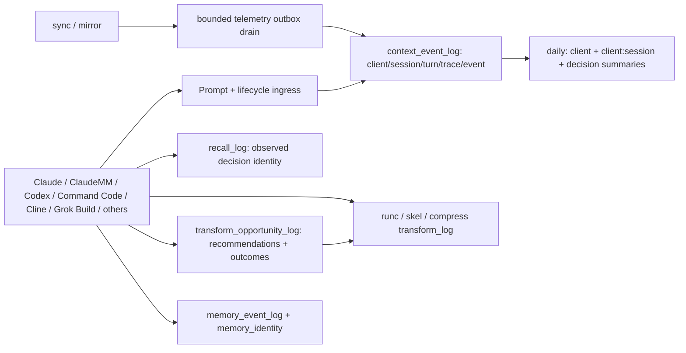

# Membrane telemetry and identity contract

**Status:** installed and verified, 2026-07-21. This document owns the operational answer to “what is
captured, at what granularity, and can it be joined end to end?” Deployment and release truth remain
in [MEMBRANE-STATE.md](MEMBRANE-STATE.md). Public provider token is `membrane`; `rightcontext` remains
a registered compatibility alias.

## Direct answer

Per-client, per-session, and per-decision telemetry was **partial before this repair**. Client and
session appeared in several ledgers, but not all; turn/decision identity was absent from memory,
recall, and transform records; daily analysis did not persist identity-qualified summaries; missing
inputs could reconcile as successful zeros; and the sync telemetry outbox was never drained by the
production sync path.

The installed repair now provides:

- one content-free identity spine for installation → service instance → client → session →
  turn/decision → trace → event → artifact;
- per-client, client-qualified per-session, and per-decision RightContext daily summaries;
- identity-complete memory lifecycle, canonical memory, recall, and transform records;
- same-installation queue acceptance across service restarts;
- bounded production outbox draining and explicit queue-full loss accounting; and
- `unavailable`, never successful zero, when trusted telemetry inputs are missing.

Historical memory, recall, and transform rows are retained and marked `legacy_unattributed`.
Deterministic opaque correlation IDs are added for queryability, but installation or client ownership
is never fabricated. New observed rows are marked `observed`.



## Identifier contract

| Identifier | Scope | Rule |
|---|---|---|
| `installation_id` | Installed MemRight origin | Stable UUID; never inferred from OS or hostname |
| `service_instance_id` | One resident process generation | Changes on restart; queued events from the same installation remain admissible |
| `client` | Claude, ClaudeMM, Codex, Command Code, Cline, Grok Build, Gemini, CLI, or extension token | Required normalized token; never assume transcript session IDs are globally unique |
| `session_id` | One client conversation | Opaque; joins are qualified by client and installation |
| `turn_id` | One user decision/prompt | Required for new memory, recall, transform, and lifecycle evidence; derived from the trace only when the caller cannot expose a turn |
| `trace_id` | One end-to-end operation | Opaque correlation ID across prompt, recall, memory, transform, and terminal evidence |
| `event_id` / `event_uid` | One immutable observation | Globally unique and indexed |
| `artifact_id` | One durable memory/context artifact | Stable content-free ID; memory origin event is separately retained |
| `identity_status` | Provenance quality | `observed` or `legacy_unattributed`; never silently backfill ownership |
| `traffic_class` | Evidence eligibility | Production, smoke, replay, or synthetic; non-production cannot satisfy production gates |

The logical session key is `(installation_id, client, session_id)`. The logical decision key adds
`turn_id`; `trace_id` disambiguates attempts within a decision. A bare `session_id` is never a
cross-client primary key.

## Coverage table

This is the complete operational inventory. The dc7780f2 Windows resident and PATH shims have been
promoted; installed evidence is kept separate from source-only claims for later work.

| Aspect | Before repair | Source candidate / remaining boundary |
|---|---|---|
| Client census: Claude, ClaudeMM, Codex, Command Code, Cline, Grok Build, Gemini, CLI/extensions | Captured across transcript census and memory events, but unevenly | All use the shared client-qualified identity contract; unknown extensions use validated tokens |
| Installation and resident process | Context events had both IDs | Same-installation queued producer events survive a resident restart; cross-installation batches remain atomically rejected |
| Prompt ingress | Separate append-only ingress with cursor | Invalid/non-UUID installation intents are rejected before ingress; rejection reasons are typed and content-free |
| Policy assignment and exposure | Client/session assignment ledger existed | Joinable to lifecycle decisions through client/session/turn/trace |
| Provider/federation lanes | Lifecycle schema supported lane phases | Per-decision summaries retain policy and terminal outcome; lane-local failures stay typed by provider |
| Candidate admission, delivery, omission, terminal outcome | Schema existed; live lifecycle population was sparse | Canonical lifecycle ledger remains the authoritative path; unavailable inputs cannot reconcile |
| Recall | Client/session/trace only; no event, install/service, or turn ID | Schema v17 adds all five; Store writes `observed`, historical/direct legacy rows are explicit |
| Memory write/get/inject/delete | Surface/session/trace only; canonical memories lacked origin identity | Schema v15 adds event UID, install, client, turn, artifact ID and `memory_identity`; all legacy memories receive non-fabricated deterministic provenance |
| Memory batch ingestion | Transcript/session identity collision risk | Batch items carry client/session/turn/trace; artifact and origin-event identity persist canonically |
| Cross-installation sync/mirror | Replication accounting existed; telemetry accumulated in a 10,000-row undrained outbox | Sync drains bounded batches at startup, on queue pressure, and after replication; failures remain loss-accounted |
| `runc`, `skel`, `compress`, `prep`, `curate` | Authoritative DB recorded executions, but transform rows had no client/session/decision identity and no opportunity denominator | Schema v16 adds execution identity. Schema v18 adds `transform_opportunity_log`, an exact `opportunity_uid` join into `transform_log`, and `--opportunity` on `runc`/`skel`/`compress`; unresolved recommendations remain measurable rather than disappearing as non-events. Legacy rows are labeled and legacy stores report the denominator unavailable. |
| Context budget | JSONL metrics existed | Accounted, but joins are only as strong as the emitting lifecycle trace; canonical ledger is the target authority |
| Pre/post compaction | Pre/post rows existed; malformed rows were possible | Content-free phase accounting remains; malformed rows are reported, not erased |
| Feedback/value/outcome | Context feedback table existed but was empty in the audit | Schema is present; zero feedback is reported as zero observed feedback, not proof of value |
| Adapt transcript mining | Per-client discovery/parse/skip census and accepted/rejected rules | Transcript identity is client-qualified; Mac handback completed separately through origin sequence 1760 |
| Daily reconciliation | Aggregates only; missing sources could appear as zero-success | Persists exact client, `client:session`, and decision maps; raw-log verifier recomputes all three; missing or synthetic-only sources are `unavailable` and non-reconciling |
| Release/installed-state proof | Source, candidate, and resident state could be conflated | Installed truth and guard-install evidence live in `RIGHTCONTEXT-STATE.md` and the dc7780f2 release evidence tree |
| PATH shims/setup | Live `runc` shim could drift from canonical setup | Canonical setup passes flags correctly, has a regression test, and the resident shims were refreshed through guarded promotion/setup |

## 2026-07-21 audit snapshot

The pre-repair Windows database/log audit found:

| Ledger | Observed evidence |
|---|---:|
| Lifecycle registry | 39 declared phases |
| `context_event_log` | 75 events, limited to write/validation phases |
| `recall_log` | 1,850 rows: Claude 1,182; ClaudeMM 350; Codex 260; CLI 44; remainder other |
| `memory_event_log` | 11,061 rows; included Claude, CLI, Codex, ClaudeMM, Command Code 7, Cline 6, Grok Build 2, Gemini 1 |
| Policy assignments | 273: Claude 153; ClaudeMM 74; Codex 40; smoke 6 |
| Feedback | 0 rows |
| Transform log | 714 rows: `skel` 180, `runc` 154, `compress` 2, remainder prep/curate |
| Compaction | 1,198 rows: pre 608, post 590; 2 malformed |
| Context budget | 2,282 rows |
| Heartbeat / delivery | 1,292 / 780 |
| Outbox | 10,000 pending, 0 attempts; queue-full counters 12,030 required and 11,011 terminal |
| Prompt ingress | 1,079 records / 952,731 bytes; cursor fully consumed |
| Rejection ledger | 1,070 rows: 1,020 synthetic fixed-ID expansion failures (10,200 events) and 50 real attribution mismatches (992 events) |

Therefore the earlier claim that the three transform tools had “never been used” was wrong. It read
retired cache layouts instead of the Rust engine’s authoritative `transform_log`. The real defect was
low/opaque execution telemetry—especially only two `compress` rows—plus live `runc` shim drift, no
per-client/session/decision transform identity, and no denominator for recommendations that were
ignored. The pre-repair counts cannot be converted into adoption rates retrospectively.

## Installed compatibility repair — 2026-07-21

The producer records canonical persistence outcome in both Rust and Python audit rows. A failed
v14 `transform-opportunity` call is explicit (`canonical_write_succeeded=false`) and the complete
content-free opportunity remains in the separate brief-read or brief-bash JSONL. The importer at
`tools/pipelines/memory/transform_opportunity_backfill.py` deduplicates by `opportunity_uid`, checks
the canonical table read-only, and replays only through the MemRight CLI. It replayed all six
eligible retained rows through the promoted CLI; a second run found all six already present.

Lifecycle telemetry uses a separate bounded recovery lane:
`sync.py --drain-telemetry-only --max-batches N --batch-size N`. It performs no pull, export,
embedding rebuild, or hosted-metrics refresh. It leases only current-installation rows, upgrades
legacy opaque prefixes in the outbound copy, and deletes a batch only after an exact service receipt.
The 10,000-row lifecycle outbox and its integrity-checked snapshot contain no `opportunity_uid` or
`transform_verb`; neither is an opportunity-denominator backup. The promoted service accepted exact
receipts for 9,976 current-installation rows. Pending depth fell from 10,000 to 24 while canonical
`context_event_log` grew from 2,604 to 12,610. The 24 legacy-installation rows and intact snapshot
remain preserved.

The genuine Mac and Windows pair, manifest, P0, and P2 passed. Guarded installation promoted the
exact Windows hashes and migrated the live DB from v14 to v18. A live recommendation, canonical
opportunity insert, exact-UID transform, and `used` outcome join passed. The adoption query below is
now computable by installation/client/session/turn/verb: seven opportunities, one successful linked
use, six unresolved recommendations, and zero errors.

## Failure causes and repairs

1. **Transcript identity collision.** A bare session ID was treated as globally unique. Identity is
   now client-qualified throughout extraction, batches, summaries, and durable memory provenance.
2. **Restart attribution mismatch.** Events queued before a service restart were rejected because
   the current process lease required its own service instance. Local ingestion now authenticates the
   installation while retaining the producer’s original service instance.
3. **Outbox starvation.** Sync enqueued lifecycle events but never drained them. The sync path now
   performs bounded draining and retries once on required/terminal queue pressure.
4. **False zero.** Daily analysis converted absent trusted inputs into successful zero counts. Missing
   and synthetic-only coverage is now `unavailable`, with reconciliation false.
5. **Incomplete durable identity.** Memory, recall, and transform tables could not join to a decision.
   Additive schemas v15–v17 provide the full identity spine and honest legacy labeling.
6. **Synthetic pollution.** Fixed invalid installation IDs reached production prompt ingress. The
   producer now validates a canonical lowercase UUID before append; rejection classes are specific.
7. **Shim deployment drift.** The live `runc` wrapper placed `--` before caller flags. Canonical
   `setup-workspace.py` already uses `runc --spill-dir ... "$@"` / `%*` and forbids the broken form in
   tests. Running guarded setup/promotion is the installed-state repair.
8. **Adoption denominator split across ledgers.** The brief hook recorded a recommendation in local
   JSONL while `transform_log` recorded only executions, with no shared key. Schema v18 preserves
   `transform_log` as the execution ledger and adds a content-free opportunity ledger. Hooks create a
   deterministic `opportunity_uid`, include it in the recommended command, and the eventual transform
   resolves that exact row as `used` or `error`. Large native survey reads route supported code to
   `skel` and supported prose to `compress`; broad command output routes to `runc`. Markdown and other
   reference-bearing formats are not blindly token-dropped. Bash recommendations use policy/source
   `brief-bash` and local ledger `brief-bash.jsonl`; native Read recommendations use `brief-read` and
   `brief-read.jsonl`, preventing one boundary from being reported as activity by the other.

## Operator queries

```sql
-- Per-client/session/decision lifecycle
SELECT installation_id, client, session_id, turn_id, COUNT(*) AS events
FROM context_event_log
GROUP BY installation_id, client, session_id, turn_id;

-- Durable memory provenance
SELECT identity_status, client, COUNT(*) AS memories
FROM memory_identity
GROUP BY identity_status, client;

-- Transform adoption by the decision that received the recommendation.
-- `recommended` is an unresolved opportunity, not proof of an intentional skip.
SELECT o.installation_id, o.client, o.session_id, o.turn_id, o.verb,
       COUNT(*) AS opportunities,
       SUM(CASE WHEN o.outcome IN ('used', 'error') THEN 1 ELSE 0 END) AS linked_runs,
       SUM(CASE WHEN o.outcome = 'used' THEN 1 ELSE 0 END) AS successful_uses,
       SUM(CASE WHEN o.outcome = 'error' THEN 1 ELSE 0 END) AS execution_errors,
       SUM(CASE WHEN o.outcome = 'recommended' THEN 1 ELSE 0 END) AS unresolved,
       ROUND(1.0 * SUM(CASE WHEN o.outcome IN ('used', 'error') THEN 1 ELSE 0 END)
             / NULLIF(COUNT(*), 0), 4) AS adoption_rate
FROM transform_opportunity_log o
GROUP BY o.installation_id, o.client, o.session_id, o.turn_id, o.verb;

-- Executions without a measured recommendation remain visible, but are not in the denominator.
SELECT client, verb, COUNT(*) AS unlinked_runs
FROM transform_log
WHERE opportunity_uid IS NULL
GROUP BY client, verb;

-- Recall coverage by decision
SELECT identity_status, client, session_id, turn_id, COUNT(*) AS recalls
FROM recall_log
GROUP BY identity_status, client, session_id, turn_id;
```

## Privacy and deployment boundary

Canonical identity and opportunity telemetry is content-free: it may contain opaque IDs, enums,
counts, durations, hashes, and reason codes, but never raw prompts, memory bodies, transcript text,
filesystem paths, command output, or secrets. The local hook-audit JSONL remains a diagnostic ledger
and may retain bounded command/path metadata; it is not the canonical adoption store and is not synced.
The four-asset promotion passed its manifest, P0, installation-set, P2, guard-install, resident
hash, schema migration, lifecycle drain, opportunity backfill, and live joined-outcome gates.
