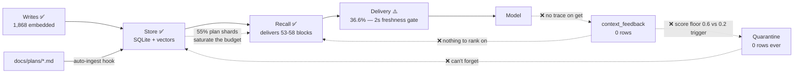
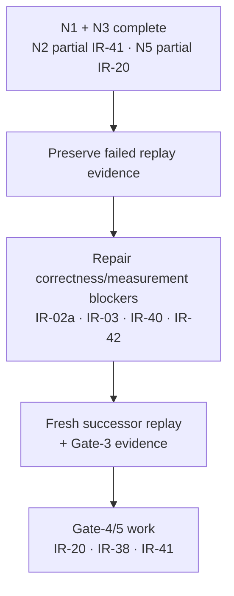

# RightContext — Situation and Work Plan

**Date:** 2026-07-17 · **Supersedes:** the eight 2026-07-17 E2E reviews and all consolidations of them (deleted; findings folded in here).
**Status of the dated snapshot and addenda:** verified against the engine DB (read-only), source at `file:line`, telemetry, and disk at their stated boundaries. `RIGHTCONTEXT-STATE.md` governs newer live state. Refuted claims are gone, not archived — if it isn't here, it didn't survive verification.

**Scope and precedence:** this workplan records narrow audit follow-up, not the overall gate ledger. `RIGHTCONTEXT-STATE.md` owns current runtime/evidence; the gates execution plan owns binding order and literal acceptance; the independent-review addendum owns IR disposition. N1 and N3 close their narrow corrections, N2 is partial IR-41, N5 is partial IR-20, and N4 remains active as IR-40.

---

## 2026-07-18 addendum — RC-2.5 resilience ledger

The 2026-07-17 snapshot below is frozen. Candidate `76702914` has genuine isolated real-model burst
evidence—16 puts, 8 accepted/persisted `200` rows, 8 `429` overload rejections, and a 56,888.62 ms
(56.9 s) accepted maximum—but independent review rejected and superseded it; it was never installed.
The independently reviewed follow-up repair is installed on Windows at
`815cd5112f822d306db69c8b4eafcbf54585036e`, tree SHA-256 `a2a81039c606e1dbe5266d4698a79daddbcbc4dd13caf587a7c1a121402312c2`;
full Rust/Node tests, strict Clippy, Rustfmt, scoped diff, and secret checks pass. Limits remain
explicit: no SQLite pool, serial model execution, a bounded FIFO
query-embedding cache, process-local server replay state, operator recovery for retained confirmed
CLI markers, and no sustained capacity SLO. The exact-source Windows pair and non-vacuous v2 capture
are valid and installed. The independently validated installed-runtime resilience artifact at
`rightcontext-evidence/g2/final-815cd511/windows/service-resilience-v1.json` closes the disposable
idempotency/saturation/diagnostics/restart/dependency-error exercise. The genuine same-source Mac
pair and v2 capture validate; the final paired comparison and four-asset manifest pass. The guarded
schema-v11 migration moved exactly 355 rows and preserved all 1,733 canonical event path/hash pairs.
The installed-runtime RC-2.5 repeat passes independently. Installed client recovery,
disabled-scheduler watchdog propagation, and Gate-1 cap/budget smokes now pass in strict
`installed-gates-v1.json`. Candidate policy/cohorts are active. Three fresh replay attempts froze
failed/non-resumable. The genuine 5ea repair pair and comparison now pass, but later compiled
Crypt hardening at `d891b274` supersedes that pair as an installable boundary. Clean d891 Windows
runtime/ranking evidence validates and CodeRight pins d891; genuine d891 Mac evidence remains before
paired install and a wholly new run. The three production dates remain open.
The binding RC-2.5 acceptance row is in the gates plan; the state ledger owns exact failed-run history
and successful artifacts.

---

## 1. The situation — frozen audit snapshot

**Crypt works.** This is the part that got lost in 200KB of review prose.

| Surface | State (verified 2026-07-17) |
|---|---|
| Service | **UP** on `127.0.0.1:47851` |
| Writes | 1,868 memories · 1,014 `put` events · last write `09:25Z` today |
| Embeddings | **1,868 / 1,868 populated** (`embedding_q`, `embeddinggemma-300m-q4`) |
| Recall | 1,663 `recall_log` rows · last inject `11:50Z` today |
| Delivery | Live packets carrying **53–58 memory blocks**, budget saturated at ~4090/4096 |
| Skills | 28 on disk = 28 in engine, 1:1, sealed delivery working |
| Sync | Event mirror + per-machine re-embed, sound within its contract |

> **Note on the `embedding` column:** it reads NULL on all 1,868 rows. That is not a defect — `store.rs:589` nulls it on write to trigger re-embed; the live vector lives in `embedding_q`. Do not "fix" it.

**The write → store → recall → deliver spine is genuinely working.** What is broken is everything the system would use to *see itself*, plus one thing actively making recall worse.

### What is actually broken

1. **It cannot learn.** `context_feedback` = 0 rows, and structurally cannot receive one. The CLI `get` takes only an id (`main.rs`, `Get { id: String }`); `record_observed_feedback` returns early without a `trace_id` (`store.rs:1505-1524`, comment: *"a bare CLI action has no recall trace"*). 4,083 injects vs 115 gets, none traced. Nothing can be ranked by usefulness.
2. **It cannot forget.** Quarantine triggers on `score < 0.2 && access_count == 0` (`dream.rs:117`). The live score floor is **0.6** and score is a write-time constant (`store.rs:589` `score=excluded.score`), so the condition is unsatisfiable. 0 rows quarantined, ever.
3. **It is drowning in its own exhaust.** **55% of the corpus (1,033/1,868) is design/plan shards**, manufactured by a hook: `ingest_memory.py::_knowledge_route` auto-emits every `docs/plans/*.md` write as a "design" memory. When the memory lane works, it spends the **entire** 4096-token budget on fragments of prior planning docs. *This is the finding that matters most and the one no amount of author discipline fixes.*
4. **Freshness intermittently empties the packet.** `gateway.py:91` gives `/freshness` a 2.0s budget; `gateway.py:222-233` returns an empty candidate set on timeout — killing **all nine lanes**, not just Blueprint. Observed: 40/40 degraded rows sat at ≥1.9s, median 2.016s, right on the boundary. Availability ≈ **36.6%** (64/175 on-mode real). It is intermittent, not constant.
5. **Two typed lanes are dark by identity bug.** `architect.py:25` and `audit.py:48-49` send `str(repo_root.resolve())` as `repositoryId`; the records carry `"D--Claude"` / `"repo:heardright"`; `decision_provider.py:271` filters by exact equality. They can never match. Both providers fan out on every prompt to deliver nothing.
6. **The measurement can't decide anything.** No `2026-07-17` analysis artifact exists (newest is `07-16`) though the scheduler reported success — `daily-sync.sh:196-229` exits on the metrics-push result only. Current policy version has 13 candidate / 0 control.

**One-line diagnosis:** *the system stores and delivers; it does not learn or forget; and what it delivers is increasingly its own exhaust.*



---

## 2. Narrow audit fixes — **N1/N3 complete; N2/N5 partial; N4 source-complete**

| # | Change | Status |
|---|---|---|
| **N1** | Delete the stale `/recall` veto-bypass claim (`docs/RIGHTCONTEXT-STATE.md`) | ✅ **Complete documentation correction; closes IR-45 only.** The line now reads *"Historical `/recall` veto bypass — fixed"*. |
| **N2** | Canonical `repositoryId` in the audit + architect providers | 🟡 **Provider-read repair complete; partial IR-41.** Write-boundary, wikilink, collision, provenance, and migration work remains. |
| **N3** | Remove the Opus juror instruction (`doctor/references/review.md:55`) | ✅ **Complete shared-rule correction; closes IR-43 source scope only.** Now reads *"no spawned subagent may use Opus"*. |
| **N4** | Decouple replay logging from `observe` | 🟡 **IR-40 source repair complete; deployment evidence pending.** Evaluation recall is logged with `observe=false`, mutation stays disabled, and production aggregates exclude nonproduction traffic. |
| **N5** | Gate the `docs/plans/` auto-ingest | 🟡 **Inflow gate complete; partial IR-20.** Typed lifecycle and existing-corpus treatment remain. |

### N2 — what shipped
`providers/__init__.py` gained `canonical_repository_id(repo_root)`, mirroring `scope.rs::canonical_scope_chain` (`D:\Claude` → `D--Claude`; `D:\Claude\heardright` → `D--Claude-heardright`; drive token uppercased so casing can't fork identity). `architect.py` and `audit.py` now use it instead of `str(repo_root.resolve())`.

**Proof — the architect lane was dark and is now live:**

```
OLD (absolute path)    repositoryId=D:\Claude    -> 0 candidates
NEW (scope slug)       repositoryId=D--Claude    -> 4 candidates
```

Guarded by `providers/test_repository_identity.py` (6 tests), including the "never a machine path" contract that `audit_store.derive_finding_id` depends on.

This normalizes two provider read paths only. IR-41 remains open for canonical identities across write/read boundaries, wikilinks, collisions, provenance retention, and reversible migration.

*Correction to the original N2 entry:* it said "pass the manifest identity". The manifest says `repo: "Claude"`, but the stored records use the scope slug `D--Claude` — and one legacy heardright row uses a third form, `repo:heardright`. The scope slug won because 1,868 memories already live in that identity space. The `repo:heardright` row remains unmatched; heardright's store has 2 rows, so normalise it whenever that lane matters.

*Still open in the same file:* `architect.py` sends `linkedGraphGeneration: ""`, and `""` is falsy at `decision_provider.py:403`, so the stale-generation gate is skipped entirely — stale decisions can be delivered. Plumbing the real generation through `produce(repo_root, task)` changes the gateway call signature. Tracked as **D6**.

### N5 — what shipped
`docs/plans/*.md` no longer auto-ingests. `ingest_memory.py::_declares_durable` requires an explicit `memory: true` frontmatter line; plan-document auto-ingest is now **opt-in**. Guarded by `tools/hooks/test_ingest_plan_gate.py` (8 tests), which also pins that the `.audit/` route still auto-emits.

This stops one source of new plan shards. It does not implement IR-20's typed authority, provenance, lifecycle, TTL/quarantine, migration, or existing-row treatment.

*Correction to the original N5 entry:* it said "reuse Adapt's existing `admission.py` gate". **That was wrong** — `admission.py` admits *mined preference rules* against a taxonomy (workflow, safety, tooling…); it has no bearing on document ingestion. The suggestion came from repeating a reviewer's permutation without checking its premise.

*Rationale for opt-in:* `docs/plans/` is where thinking happens — drafts, reviews, status, superseded plans. Durability is a property of a document, not of its folder, and only the author knows it. §10 applies: the mechanism was producing 1,033 rows at 98% zero-access, so the smaller mechanism wins. A genuinely durable ADR adds one frontmatter line; anything else can still be filed deliberately with `crypt put`.

### N4 / IR-40 — accepted semantic repair
The failed 45-cell replay was frozen before this repair. Source now records content-free evaluation recall with `observe=false`, leaves injection/access mutation disabled, and excludes nonproduction traffic from production aggregates. This closes the source defect only; successor installed behavior and a fresh 60-cell replay remain mandatory.

---

## 3. Open work — governed by the gates plan and IR addendum

| # | Question | Why it isn't an edit |
|---|---|---|
| **D1** | **Freshness: raise the budget, precompute async, or degrade per-provider instead of packet-wide?** | This is the dominant availability term and the fix is an architecture choice. Per-provider degradation is probably right — a Blueprint timeout should not suppress memory, rules, and skills — but that changes the gateway contract. Route through `/architect`. |
| **D2** | **How does a memory earn a `Used` label?** | The rail is dead because `get` is untraced *and* previews are good enough that nothing calls `get`. Do **not** promote "rendered" to "used" — that manufactures positive labels for context the model ignored, and corrupts the evaluation permanently. Options: add `--trace` to the CLI, or find another attributable action. This decision gates all ranking/quality work. |
| **D3** | **Static context: 27,129 tokens injected every prompt** (`CLAUDE.md` 33,087 B + `.claude/rules/*.md` 75,431 B) against a 4,096-token packet — and the rules provider re-delivers a slice of it with no suppression. | Worth doing, but measure with tokenizer-accurate accounting first, grouped by origin and duplicate class. Don't eyeball it. |
| **D4** | **Skill catalog: generate the index from disk?** | One generated manifest would kill four drift classes at once (`glass` unindexed but live-routed from `motion/fluid.md:111,119`; `jury`/`fable` declared at `SKILL-ARCHITECTURE.md:64,73,75` but retired 2026-07-14; `.codex/rules/skills.md` naming 7 dead skills; the runbook documenting `/swarm`). Mechanical, but it's a build step, not an edit. |
| **D5** | **Verify IR-40 on the paired successor release.** *(promoted from N4)* | Source is green. Installed replay logging, zero mutation, production exclusion, and the fresh successor grid are still evidence work—not another semantic edit. |
| **D6** | **Plumb the real graph generation into the typed providers** *(surfaced by N2)* | `architect.py` sends `linkedGraphGeneration: ""`; `""` is falsy at `decision_provider.py:403`, so the stale-generation gate never runs and stale decisions can be delivered. The gateway holds the generation from the `/freshness` verdict; passing it changes the `produce(repo_root, task)` signature across all nine providers. |
| **D7** | **Treat the existing plan corpus under IR-20.** | N5 stopped one inflow only. Existing-row treatment is deferred until Gate-4 promotion evidence exists and must use a reversible typed-authority migration with explicit approval; destructive cleanup is not the next step. |

---

## 4. Monitor — with the trigger that promotes it

Nothing here is actionable yet. Each has an explicit condition that turns it into work.

| Watch | Trigger to act |
|---|---|
| `SELECT COUNT(*) FROM context_feedback` | **> 0** → D2 landed; ranking, effectiveness-gating, and quarantine-by-usefulness all unblock. Until then they are unbuildable. |
| Availability (on-mode + real delivered) | Sustained **< 30%** → D1 is urgent. Currently 36.6%, intermittent. |
| Corpus size + plan-shard % | **> 60% plan-shaped** → N5 didn't hold; revisit the hook. |
| Daily analysis artifact date | No new file for **2 days** → the scheduler is green-lying again (`daily-sync.sh:196-229`). |
| Quarantine rows | **> 0** unexpectedly → the score floor moved; re-check `dream.rs:117` before it mass-quarantines the 98% of rows with `access_count=0`. |
| Control cohort on current policy | Still **0** after 2 weeks of traffic → cohort assignment is broken, not just sparse. |

**A standing hazard, not yet a task:** if recency-decay is ever added to scoring, live scores will cross the 0.2 line and `dream.rs:117` will quarantine the **most-delivered** memories first (the top-5 by inject all have `access_count=0`). Do not ship decay and quarantine in the same change.

---

## 5. Sequence

Ordered by dependency, not by date — durations for this kind of work are fiction, and the gates are real.



1. **Record the narrow completion status:** N1 and N3 are complete; N2 and N5 are partial precursors to IR-41 and IR-20.
2. **Preserve the failed replay generation.** Do not splice, replace, or supplement completed cells.
3. **Repair the accepted correctness and measurement blockers:** IR-02a, IR-03, IR-40, IR-42, and RC-3.1's tracked rollback path are source-complete; installed Gate-1/2 edges and candidate activation are complete. The replay-exposed freshness repair is source-complete at `5ea40c08`, and its genuine host pair/comparison pass. Later compiled hardening makes `d891b274` the current release boundary; Windows evidence is valid and genuine d891 Mac execution remains.
4. **After the paired repair installs, run a wholly fresh successor generation and close Gate-3 evidence literally.** Never resume the three frozen failed attempts.
5. **Only after Gate 3 holds:** promote Gate-4/5 lifecycle and identity work, including IR-20, IR-38, and IR-41.

**Ordering is evidence-bound.** Calendar, Mac, and three-production-date requirements still need elapsed or external evidence and cannot be closed by source edits.

**Hard ordering rule:** do not automate curation from feedback until verified use joins exposure. Curating on `access_count` today would prune on a confounded metric — 98% of the corpus reads `access_count=0` because previews suffice, not because the memories are useless.

---

## 6. Rejected — do not revisit without new evidence

Each was proposed by at least one review and each is false. Kept only so they don't get re-proposed.

| Claim | Evidence it's wrong |
|---|---|
| All `content_hash` values are NULL | 0 NULL / 1,868 populated. No backfill commit exists. |
| The `tier` column is JSON-broken | `store.rs:577` `serde_json::to_string` ↔ `:515` `from_str`. `"Semantic"` with quotes is the correct round-trip; the fallback literal is `"\"Episodic\""`. Not a bug. |
| Only 37 rows have `access_count = 0` | Inverted. 1,831/1,868 have zero access; 37 have any. |
| Curation is destructively pruning good memories | It quarantines (reversible, schema v10) and the trigger is unsatisfiable. 3 prune events total. |
| A 56k-char memory exhausts the 800-token lane | Previews cap at 200 chars — `federation.rs:326` `const CAP: usize = 200`, `recall_planner.py:441` `[:200]`. The embedding-window concern is real and separate. |
| `coder/hooks.json` still wires the retired hook | It is `[]`. `install.py` loops over an empty list. |
| `~/.claude/skills` is a plain directory of synced copies | It is a junction → `D:\Claude\tools\skills` (`os.path.islink` returns False for Windows junctions — that's the trap). `~/.codex/skills` too. |
| Live `/recall` bypasses the feedback veto | `serve.rs:807` calls `recall_scored_detailed`. **The state doc is what's wrong** — see N1. |
| Availability is 13.5% / 21.9% | Both divide by unfiltered denominators including shadow/off rows. On-mode + real = 36.6%. |
| The skills catalog has 29 rows with a duplicate `adapt` | 28, no duplicates. |
| `blueprint` hardcodes model tiers | It is the **compliant exemplar** — `blueprint/SKILL.md:192`: *"Never put client-specific model names into a tool call on a client that does not support them."* |
| Count a rendered preview as `Used` | Rendering is exposure. Labelling it use manufactures positive labels for ignored context and corrupts evaluation. |
| Mine transcripts to auto-generate `Used` labels | Same defect: presence proves exposure, not usefulness. |
| *(research)* "A poisoned memory entry can persist across an indefinite number of future sessions" | Not present in the cited survey. Paraphrase the risk; drop the quotation marks. |
| *(research)* ColBERT operates beyond 100K tokens | No primary support. Drop the number. |

---

## 7. Provenance

The eight independent reviews and their three consolidations were folded in here and removed from the tree, per "delete, don't archive". They were **untracked**, so they were committed first — the evidence is at **`03cfae0d`**, the removal at **`af2fd057`**. Adjudication ran across all eight: 37 confirmed, 17 refuted, 7 partial, 40 pending.

**Deliberately kept** (not review documents):
- `docs/plans/2026-07-17-rightcontext-independent-review-addendum.md` — the governing addendum carrying the accepted IR-01…27 decisions and the binding sequence. The reviews were written *against* it; it is not one of them.
- `docs/2026-07-17-context-stack-e2e-review-prompt.md` — the brief that produced the eight reviews.
- `docs/RIGHTCONTEXT-STATE.md` — the state doc, which **N1 corrects**. This workplan records narrow audit follow-up only. Accepted pending or deferred items remain authoritative in the independent-review addendum even when omitted here.

Accuracy for the record, since it should inform how much future reviews are trusted: **GPT Sol was 15/15** — every claim checked held, and it alone found the `repositoryId` mismatch (N2), the stale state-doc line (N1), and the missing analysis artifact. **MiniMax went 2 confirmed / 6 refuted**, including a fabricated headline P0. **Fable** found the plan-ingest mechanism (N5) and the Opus breach (N3), with 2 errors.
