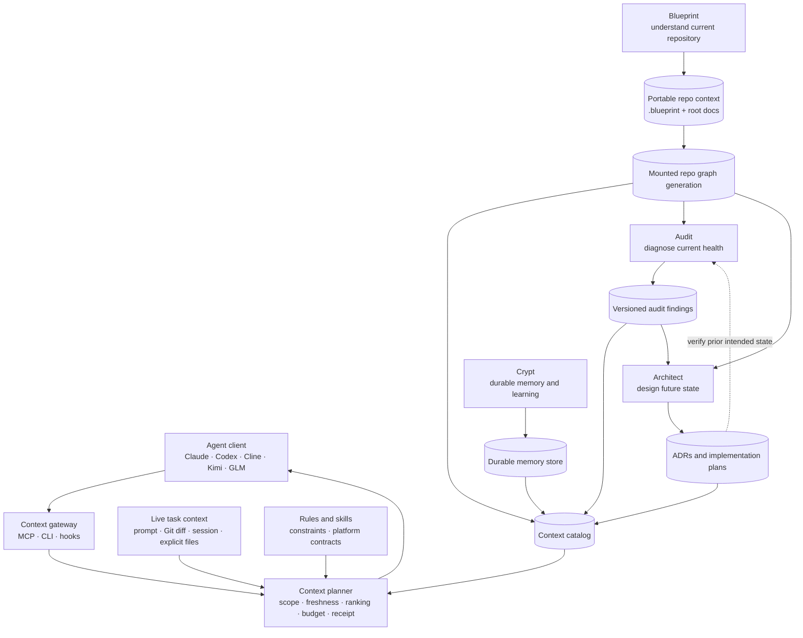

# Unified Context System Architecture

> **CURRENT STATE + BACKLOG → [docs/RIGHTCONTEXT-STATE.md](RIGHTCONTEXT-STATE.md).** This file is the design-era rationale (2026-07-12); for what is LIVE now (feedback rail, skills provider, memory delivery, admission lanes + seal, link-graph recall, the `RIGHTCONTEXT_MODE=on` flip) and the ordered backlog, read the state doc.

**Status:** Proposed product architecture; current implementation is partial
**Last architectural review:** 2026-07-12; validated synthesis of MiniMax, DeepSeek, Kimi, GLM, and GPT reviews
**Working label:** Unified Context Engine; product name deliberately unresolved
**Scope:** Workspace-wide context orchestration plus portable, repository-local intelligence
**Primary systems:** Blueprint, Audit, Architect, Crypt, context planner, client adapters

`tools/lib/CONTEXT-ENGINEERING.md` remains the source of truth for the three families, eight layers,
routing policy, and Crypt engine behavior. `RIGHTCONTEXT-STATE.md` owns deployed operational state
and evidence. This document owns the product boundary and design-era rationale that implementation
plans must satisfy.

## 1. Purpose

The system exists to give any coding agent the smallest sufficient, freshest, evidence-backed
context for the task it is performing. It must work when an agent opens the whole `D:\Claude`
workspace and when a root-confined client opens only an individual repository such as HeardRight.

Memory is one context source. It is not the product boundary.

The complete system must combine:

- current repository structure and relationships;
- verified product and architecture understanding;
- current Git and working-tree state;
- repository health, risks, and audit findings;
- durable decisions, preferences, lessons, and prior outcomes;
- applicable rules, skills, constraints, and platform contracts;
- current task, session, and explicit user anchors;
- a shared retrieval and token-admission policy.

Success means an agent can enter a repository, orient itself immediately, locate the shortest
evidence path to the requested behavior, and avoid repeatedly reconstructing knowledge already
computed on this or another machine.

## 2. Architectural decision

Build one logical context system with typed subsystems, not one undifferentiated memory database.

- **Blueprint** owns current repository comprehension and its portable graph.
- **Audit** owns evidence-backed diagnosis of the mapped repository's health.
- **Architect** owns researched future-state design and implementation planning.
- **Crypt** owns durable cross-session memory and learned knowledge.
- **Membrane** owns the single append-only SQLite `ObservableEventV1` ledger; host adapters produce
  content-free events and Morph consumes them for Insights/Taste review.
- **The Context Planner** federates every source, enforces freshness and scope, and admits a bounded
  packet into the model.
- **Client adapters** expose the same planner to Claude, Codex, Cline/Kilo-like clients, Kimi, GLM,
  and other MCP- or CLI-capable agents.

The umbrella system is agent-facing. Blueprint, Audit, Architect, and Crypt are not competing
products or disconnected pipelines; they are typed capabilities behind one interface.

The stable public contracts are typed manifests, candidates, packets, receipts, findings, and
emissions. A provider database filename, parser, vector store, or transport is never itself the
architecture.

## 3. System map



## 4. Responsibility boundaries

### 4.1 Blueprint: understand what exists

Blueprint maps the entire supported repository across code and documents. It is read-only with
respect to application code.

Blueprint must produce:

- files, modules, types, functions, methods, routes, schemas, tests, configuration, and infrastructure;
- typed relationships such as `contains`, `defines`, `imports`, `calls`, `implements`, `reads`,
  `writes`, `tests`, `handles`, and `configures`;
- document claims and their links to code evidence;
- verified, contradicted, stale, and unverifiable claims;
- complete and incomplete product/technical flows;
- source location, content hash, Git commit, provider, confidence, and evidence for every material
  node, edge, and conclusion;
- portable machine artifacts plus `START-HERE.md`, `PRODUCT.md`, and `ARCHITECTURE.md`.

Blueprint reports current reality and uncovered flows. It does not judge whether the implementation
is healthy, choose external solutions, or modify application code.

### 4.2 Audit: diagnose the mapped reality

Audit belongs inside the context system as both a consumer and a producer.

It consumes:

- the current Blueprint graph generation;
- Blueprint contradictions, coverage gaps, components, and interfaces;
- current files, builds, tests, scanners, runtime evidence, and rendered surfaces;
- prior findings only as claims that must be reverified.

It produces a commit-bound, rerunnable assessment containing:

- deterministic facts and scanner logs;
- correctness, security, maintainability, architecture, performance, accessibility, resilience,
  platform, and release findings;
- evidence strength, severity, workflow status, causality, and remediation tier;
- an explicit `CLEAN`, `NOT CLEAN`, `UNPROVEN`, or `INCOMPLETE` health state;
- architecture findings and uncovered flows handed to Architect.

Audit persists findings as typed records with stable finding ID, repository ID, graph generation,
checked commit and surfaces, evidence, cause, severity, status, first/last observation, and
supersession. A context-system audit may also inspect planner receipts to detect missing, stale, or
misranked context. An ordinary repository audit does not require Architect; it may read a prior
Architect plan only when verifying whether intended work was implemented.

Audit findings are typed repository context, not ordinary memories. They remain attached to the
repository and graph generation that was audited. A generalized lesson or stable accepted risk may
also be promoted into Crypt, but the original report remains the evidence source.

`audit-fix` may change code under its functionality-preservation contract. Read-only `audit` may not.

### 4.3 Architect: design what should exist next

Architect consumes:

- Blueprint's verified current-state graph and coverage gaps;
- Audit findings and constraints;
- product intent, durable decisions, applicable rules, and explicit user requirements;
- current external primary sources and competing technical approaches.

Architect produces:

- an ADR decision;
- alternatives and trade-offs;
- a prior-art decision matrix when external mechanisms are involved;
- a concrete implementation plan, file map, tests, rollback path, and critical-file handoff.

Architect does not remap the repository or declare it healthy. Blueprint answers “what exists?”;
Audit answers “what is wrong or unproven?”; Architect answers “what should we build or change?”

### 4.4 Crypt: preserve durable knowledge

Crypt is the durable-memory subsystem, not the umbrella context product.

It stores and retrieves:

- user preferences and stable operating rules;
- decisions and their rationale;
- durable project facts that remain valid across commits;
- verified lessons and successful/failed approaches;
- cross-session outcomes and curated knowledge.

Crypt retains its temporal, vector, effectiveness, curation, and cross-machine memory behavior.
It does not become the canonical store for every raw code symbol, graph edge, scanner log, Git diff,
or session event.

### 4.5 Context planner: assemble the working set

The planner is the core product behavior. For each task it:

1. identifies the exact repository and validates an explicit `ScopeGrant`;
2. validates the active Blueprint generation against the current Git state;
3. preserves explicit user files, symbols, and constraints;
4. classifies the task and chooses applicable retrieval layers;
5. queries exact live files, Blueprint, Audit, Architect, and Crypt concurrently within a measured
   deadline rather than serially blocking on every subsystem;
6. adds current Git diff, working-tree overlay, session state, rules, and skills;
7. normalizes every source into a `ContextCandidateSet`;
8. resolves duplicates and conflicts under the authority and freshness policy;
9. admits evidence under one model-specific token budget;
10. emits a `ContextPacket` and `ContextReceipt` showing what entered, what was omitted, what
    conflicted, and why.

No subsystem owns the final prompt budget independently.

The fast path always protects explicit anchors, exact active files, applicable rules, and the most
relevant Blueprint structure. Slower layers are queried only when task classification says they can
change the answer. Because many clients cannot inject context after a model call begins, late sources
are omitted with a receipt reason; streaming late context is an optional client capability, not a
correctness dependency. Latency objectives must come from representative measurements, not an
arbitrary universal millisecond target.

## 5. Blueprint graph construction

The graph is a typed semantic code-and-document graph. “Semantic” means its edges carry repository
meaning; it does not mean the graph is merely a vector database. Visualization is a view over a
focused subgraph, not the graph itself.

“Complete” means every intentionally included file inside the manifest's repository boundary has a
recorded disposition: structurally indexed, document-indexed, deliberately excluded with reason, or
unsupported/failed with an explicit coverage gap. Coverage is measured against that declared
denominator by file, language, capability, and material flow. A large-repository benchmark tests
scale; it does not by itself prove completeness.

### 5.1 Deterministic pipeline and internal contracts

1. **Discover:** enumerate tracked and intentionally included files while excluding vendor, build,
   cache, secret, and generated noise.
2. **Parse:** invoke parser/indexer adapters—AST, Tree-sitter, SCIP, LSP/compiler, or a labeled
   regex/skeleton fallback—to extract files, symbols, definitions, references, imports, calls,
   routes, schemas, tests, configuration, and infrastructure.
3. **Parse documents:** extract headings, claims, links, identifiers, versions, plans, and precedence.
4. **Normalize:** convert provider output into Blueprint's provider-neutral node/edge/evidence schema.
5. **Join:** connect documents, product concepts, tests, configuration, and code using exact evidence,
   including cross-language boundary joins per-language providers cannot see (Tauri command↔invoke,
   emit↔listen, HTTP route↔client call, configuration wiring) — added only where the provider
   demonstrably lacks them.
6. **Embed selectively:** vectorize useful code/document chunks and verified summaries for vocabulary
   mismatch; do not replace exact structural edges with similarity.
7. **Verify:** agents check important claims and ambiguous joins against full source.
8. **Synthesize:** produce verified architecture, interfaces, product understanding, risks, and gaps.
9. **Export:** write an immutable portable generation and the human navigation documents.

These are separately testable Blueprint modules with versioned input/output contracts:

```text
discovery -> parser adapters -> normalizer -> joiner -> verifier -> synthesizer -> exporter
```

Blueprint remains one product and one user-facing operation. Internal modularity prevents a parser,
graph backend, or synthesis implementation from becoming an irreversible system-wide dependency.

### 5.2 Provider strategy

Blueprint owns a provider-neutral minimum contract; an external provider may own parsing and
structural indexing. The normalized envelope preserves provider-specific payloads, versions,
provenance, confidence, and disagreements instead of flattening richer evidence away.

- Evaluate Codebase Memory as the initial broad structural backend. Its documented design uses
  Tree-sitter, a SQLite graph, incremental refresh, MCP queries, and a Git-portable compressed
  `graph.db.zst` artifact.
- Use Tree-sitter-capable broad structural indexing for initial coverage. Treat SCIP-capable language
  indexers as optional precision adapters only where a local bakeoff proves materially better
  definition/reference accuracy and acceptable build/setup cost.
- Retain `rg`/skeleton fallback for unsupported or failed capabilities, but label the result
  `PARTIAL / CODE-FELL-SHORT`; fallback must never be called a complete repository graph.
- Select providers through real-repository correctness, freshness, query-latency, memory, disk,
  license, and cross-platform gates. Provider claims are not local proof.
- Stop discovery at a nested `.git` directory or worktree boundary unless the manifest explicitly
  declares that repository as a dependency. Never absorb a sibling or nested product repository as
  ordinary files.
- Generate qualification-fixture answer keys from SCIP indexer output where a SCIP indexer covers the
  language (authoring-time verification oracle, never a runtime dependency).
- Mirror the selected provider's source at the pinned commit into a workspace-owned remote as
  dead-upstream insurance; forking or absorbing the source is a contingency, never the default.

The visual explorer is an experimental view over selected subgraphs. It is not required for graph
correctness, portability, planner integration, or the first production milestone.

Primary references:

- [Codebase Memory MCP](https://github.com/DeusData/codebase-memory-mcp)
- [SCIP Code Intelligence Protocol](https://github.com/sourcegraph/scip)
- [Tree-sitter](https://tree-sitter.github.io/tree-sitter/)

## 6. Repository-portable contract

Every mapped repository carries enough context to remain understandable without access to the
parent workspace or central context engine.

```text
<repo>/
├── README.md
├── START-HERE.md
├── PRODUCT.md
├── ARCHITECTURE.md
└── .blueprint/
    ├── manifest.json
    ├── artifacts/
    │   └── <content-hash>.<provider-format>
    ├── index.jsonl
    ├── coverage.json
    ├── contradictions.json
    └── schemas/
        ├── blueprint-artifact-manifest.schema.json
        ├── context-candidate-set.schema.json
        ├── context-packet.schema.json
        ├── context-receipt.schema.json
        ├── knowledge-emission.schema.json
        ├── scope-grant.schema.json
        └── audit-finding.schema.json
```

- `README.md` remains the public/human introduction and links the three context documents.
- `START-HERE.md` is the compact navigation and agent-orientation surface.
- `PRODUCT.md` defines users, problem, value, workflows, features, and shipped-versus-planned state.
- `ARCHITECTURE.md` defines the verified technical stack, components, interfaces, dependencies,
  data flows, state stores, trust boundaries, and platform behavior.
- `.blueprint/manifest.json` is the machine entry point and records stable repository ID, source
  commit, artifact descriptors and hashes, schema versions, provider versions, capabilities,
  coverage, transport, and freshness. `BlueprintArtifactManifest` is the stable contract.
- `.blueprint/artifacts/` contains one or more immutable, content-addressed provider payloads. A
  Codebase Memory `graph.db.zst`, SCIP index, or future format may occupy this role without becoming
  the public contract.
- `.blueprint/index.jsonl` is a text-searchable fallback for clients without a graph reader.

The manifest schema must define a deterministic byte serialization. Its generation digest is
computed over the canonical serialization with the digest/signature fields omitted, while each
artifact descriptor carries its own content digest. Importers must reject non-canonical,
self-inconsistent, or hash-mismatched manifests rather than attempting to repair them silently.

The portable contract is tracked by the individual repository; provider payloads follow the
manifest-declared transport below. Task runs, expanded databases, dirty working indexes, logs,
temporary layouts, and caches remain ignored.

Artifact transport is selected by measured compressed size, churn, clone impact, host support, and
offline requirements:

- root documents, manifest, schemas, coverage, and contradictions always use normal Git;
- the text fallback uses normal Git only when its measured size and churn stay inside the declared
  repository threshold; otherwise the manifest declares how it is regenerated or retrieved;
- a moderate compressed artifact may use normal Git;
- a large or rapidly changing payload may use Git LFS or a content-addressed release/object store,
  but its descriptor, checksum, source commit, and retrieval policy remain in the tracked manifest;
- a repository clone plus its declared setup/bootstrap path must be sufficient to regenerate or
  obtain the declared artifact; a machine-local central database is never the only source.

The implementation must benchmark representative repositories before setting transport thresholds.
“Always commit the binary” and “never commit the binary” are both rejected as universal policies.

Default posture until those measurements exist: rebuild the binary graph locally from the pinned
provider on each machine and track only the root documents, manifest, schemas, coverage,
contradictions, and (size-measured) text fallback. Binary artifact transport activates only when the
measured complete-generation cost — documents, claims, joins, verification, and synthesis, not
provider indexing alone — exceeds the declared budget on a real machine.

## 7. Central ingestion and dual residency

Repository intelligence has two legitimate residences.

### 7.1 Portable canonical generation

The repository's tracked manifest and declared artifact transport travel with that repository's own
history. Together they form the cross-machine bootstrap and clean-commit evidence generation. The
logical canonical object is the immutable `BlueprintArtifact`, not one provider database format.

### 7.2 Operational managed generation

The context engine imports and expands the artifact into a managed local path:

```text
<context-home>/repos/<repo-id>/<generation-id>/graph.db
```

The central catalog stores only identities, handles, state, and receipts:

```text
repositories
repository_paths
graph_generations
context_sources
audit_generations
audit_findings
architecture_artifacts
context_receipts
retrieval_events
provider_capabilities
scope_grants
```

Each repository graph remains a separately attachable database with typed tables such as:

```text
files
nodes
edges
symbols
chunks
embeddings
document_claims
evidence
coverage
contradictions
```

Each provider payload is mounted behind a normalized adapter. Rebuilding from source must remain
possible, and provider-switch tests must prove the portable minimum contract survives without
silently dropping provider-specific evidence.

This is one logical context system without one unbounded, merge-prone database. The engine owns
registration, import, querying, invalidation, ranking, and admission; Git owns portable transport.

### 7.3 Generation reconciliation

This subsection applies only once portable binary snapshots are enabled by the §6 measurement gate.
While local rebuild is the active policy, none of this machinery is built — implementing it early is
scaffolding without a user.

Residence never determines truth by itself. When a portable generation and an operational generation
both exist, the engine:

1. validates repository ID, canonical manifest digest, artifact digests, schema/provider compatibility,
   and source commit for both;
2. compares generation ancestry and relevance to the active `HEAD` plus working-tree overlay;
3. uses the portable generation for cold bootstrap only when no valid operational descendant exists;
4. uses a valid operational descendant after incremental refresh, then exports a new portable
   generation only through the normal validated export path;
5. quarantines divergent generations that are neither equal nor in a provable ancestor/descendant
   relationship and rebuilds or requires explicit reconciliation.

The context receipt records which generation won and why. Newer wall-clock time alone cannot defeat
commit lineage, integrity, or active-worktree relevance.

## 8. Machine and repository lifecycle

### 8.1 First Blueprint run

1. Build the complete supported code/document graph.
2. Verify important claims and end-to-end flows.
3. Generate the three root context documents.
4. Update README navigation without rewriting unrelated product copy.
5. Export and integrity-check the portable generation.
6. Register/import the generation into the context engine when available. Registration must require
   only the repository root and `.blueprint/manifest.json`, never knowledge of a parent workspace.

### 8.2 Repeat run on the same machine

1. Compare current Git/file hashes with the manifest.
2. Reparse changed, added, and deleted files only. V1 may conservatively represent a rename as
   delete-plus-add until an optimized rename path is proven.
3. Recompute affected relationships, claims, flows, and summaries.
4. Export a new immutable generation.
5. Atomically move the active pointer after validation succeeds.

Readers see either the previous complete generation or the new complete generation, never a partial
build.

### 8.3 Branches and working-tree overlays

- Complete generations are immutable and keyed by repository ID, source commit, schema, and provider
  set; switching branches reuses an existing compatible commit generation when available.
- Saved changed files form a working-tree overlay. They are parsed incrementally with debouncing, and
  affected relationships are marked current, stale, or unknown rather than borrowed silently from
  the clean snapshot.
- Unchanged files continue to use verified clean-generation evidence while recomputation runs.
- Unsaved editor buffers are invisible unless the client explicitly supplies them as live task context.
- A failed refresh leaves the last complete generation active and reports the overlay gap; it never
  exposes a half-written generation.

Conservative file/symbol invalidation is required and testable. The system does not require perfect
whole-program impact analysis before it can handle dirty files safely.

### 8.4 First run on another machine

1. Pull the repository and validate its manifest, provider pin, schema, source commit, and tracked
   context files.
2. Under the default local-build policy, regenerate the binary graph and any untracked text fallback,
   then verify the complete-generation budget and cross-machine result parity.
3. If §6 measurements have enabled portable binary transport, validate and import the snapshot instead,
   then incrementally catch up from its source commit to current `HEAD` and local changes.
4. Quarantine an invalid or incompatible transported snapshot and fall back to the measured local build.

The Mac does not repeat the human discovery/design process: tracked documents, claims, coverage,
contradictions, manifest, provider pin, and generation contract travel through Git. Whether its binary
graph is rebuilt or imported is an evidence-gated transport decision.

## 9. Root-confined clients

A client opened directly in `D:\Claude\heardright` should receive HeardRight context without being
able or required to enumerate `D:\Claude` or sibling repositories.

This section is a target client contract, not current behavior. Until the bootstrap, planner, and
Blueprint retrieval surfaces pass §16, current hooks provide Crypt recall only as stated in §15.

The repository carries a small client bootstrap that can start or connect to one loopback MCP
service. The service self-registers the repository solely from its root and tracked manifest. A CLI
shim or MCP stdio launcher owns health checking and process startup; the client never needs to locate
the parent `D:\Claude` workspace.

The request includes a `ScopeGrant` containing the current repository identity, explicitly allowed
additional repositories and edge types, task/session identity, issuer, and expiration. The service
validates it before retrieval and records it in the receipt. Repository detection alone does not
authorize cross-repository context. A declared dependency makes expansion eligible, but user or task
authorization must still grant it.

For MCP-capable clients, expose a small surface such as:

```text
context.prepare(repo, task, token_budget, scope_grant)
context.explain(receipt_id)
blueprint.search(repo, query, kinds)
blueprint.path(repo, from, to)
blueprint.impact(repo, diff)
audit.findings(repo, query, status)
```

For clients without MCP:

```text
<context-cli> prepare --repo . --task "<task>"
blueprint query --repo . --task "<task>"
```

If the central engine is absent, the agent reads the root documents, searches `index.jsonl`, and uses
the standalone Blueprint query path. Full graph traversal requires a compatible graph reader, but
basic repository orientation never depends on the parent workspace.

| Available capability | Root docs | `index.jsonl` | Blueprint reader | Context engine |
|---|---:|---:|---:|---:|
| Human/agent orientation | Yes | Yes | Yes | Yes |
| Exact textual lookup | Limited | Yes | Yes | Yes |
| Structural graph traversal | No | Limited | Yes | Yes |
| Crypt, Audit, and Architect federation | No | No | No | Yes |
| Cross-repository authorized retrieval | No | No | No | Yes |
| Unified ranking, budgeting, and receipts | No | No | No | Yes |

MCP is the preferred cross-client contract because tools and resources can be exposed through one
standard agent-facing protocol: [MCP tools specification](https://modelcontextprotocol.io/specification/2025-06-18/server/tools).

## 10. Retrieval and context packet

Repository work must not inject the full graph or all documents into the prompt. The planner queries
the complete graph and emits only the task-relevant evidence slice.

Every producer returns the canonical `ContextCandidateSet` envelope. Every admitted item records its
source artifact, repository, commit/generation, `observed_at`, `valid_from`, optional `valid_until`,
optional `supersedes`, confidence, provider provenance, token estimate, and selection reason. Provider
extensions remain namespaced payloads inside the envelope.

Ranking order:

1. explicit user anchors and active edit targets;
2. exact paths, symbols, contracts, and current Git changes;
3. structural graph neighbors, paths, callers, dependencies, tests, and impact;
4. relevant product/architecture documents and verified claims;
5. applicable open Audit findings and active Architect decisions;
6. semantic matches for vocabulary mismatch;
7. durable Crypt memories and learned lessons;
8. broader orientation material when budget remains.

Every omitted candidate is represented in the context receipt with an omission reason. A conflict
entry records the winning candidate, losing candidates, evidence and authority comparison,
resolution rule, and whether human or subsystem curation remains required. The receipt also records
queried, skipped, timed-out, unavailable, and capability-limited sources so absence is explainable.

## 11. Freshness and authority

Authority order applies only after integrity, scope, commit/worktree relevance, and temporal validity
are checked:

```text
fresh executable proof for the active state
  > current code and working-tree content
  > verified graph evidence for that state
  > current canonical docs
  > valid durable memory
  > historical evidence
```

- Executable proof records `observed_at`, checked commit, working-tree fingerprint when dirty,
  command/environment identity, checked surfaces, and an evidence-class freshness policy. It loses
  “proof of current behavior” authority when the active code or relevant environment has changed or
  its validity window has expired; it remains historical evidence.
- Dirty files invalidate affected clean-snapshot nodes until incrementally refreshed.
- Audit reports are valid only for their declared commit and checked surfaces.
- Architect plans describe intended future state and never override current code until implemented.
- Durable memories that conflict with current code are demoted and flagged for curation.
- A stale or corrupt graph is quarantined; the system falls back loudly instead of returning it as truth.
- Expired context is omitted unless explicitly requested as history. Superseded context remains
  traceable but cannot silently outrank its replacement.
- Provider disagreement is preserved as evidence until a deterministic rule or verification resolves it.

## 12. Synchronization

Different context types use different synchronization units:

- Blueprint graph and repository documents: the individual repository's Git history.
- Durable Crypt knowledge: the existing event-based memory mirror and per-machine database import.
- Central catalog and expanded graph indexes: machine-local, rebuilt/imported from canonical artifacts.
- Audit evidence: normally repository-local ignored run artifacts; selected reports/findings may be
  committed when they are intended project records.
- Architect ADRs and plans: repository Git when accepted as project architecture.

Generated binary artifacts are not semantically merged. Content-addressed generations coexist and
the manifest selects a validated generation. A provider-supplied `merge=ours` driver is acceptable
only when post-merge validation detects a mismatched source commit and regenerates or selects the
correct artifact; conflict suppression alone is not correctness.

The main `D:\Claude` repository must not accidentally absorb nested product repositories. Stable
repository identity comes from `.blueprint/manifest.json` plus repository origin, not the absolute
Dell or Mac path.

## 13. Failure and fallback behavior

| Failure | Required behavior |
|---|---|
| Context service unavailable | Use portable root docs and standalone Blueprint query |
| No Blueprint snapshot | Report unmapped; build Blueprint rather than pretending orientation is complete |
| Snapshot behind `HEAD` | Import, incrementally refresh, mark freshness in every result |
| Snapshot corrupt/incompatible | Quarantine and rebuild; never silently query it |
| Structural provider missing | Use explicit fallback and report `PARTIAL / CODE-FELL-SHORT` |
| Audit scanner skipped | Report `INCOMPLETE`/`UNPROVEN`, never clean |
| Audit conflicts with current code | Reverify; code and executable proof win |
| Architect plan not implemented | Keep it as intended state, never current truth |
| Memory conflicts with repository evidence | Prefer repository evidence and queue memory curation |
| Client is root-confined | Serve only the registered current repository unless explicitly broadened |
| Scope grant missing, invalid, or expired | Deny cross-repository retrieval and record the denial |
| Provider response misses planner deadline | Continue only when the fast path is sufficient; otherwise report incomplete preparation and record timeout |
| Branch or dirty overlay not fully refreshed | Serve unchanged verified evidence; mark affected edges stale/unknown |
| Portable payload exceeds Git policy | Use the manifest-declared large-artifact transport; never fall back to machine-local-only truth |
| Portable and operational generations disagree | Validate integrity and lineage, select the valid active-state descendant, or quarantine/rebuild when ancestry cannot be proven |

## 14. Naming decision

The umbrella name should describe preparing or grounding an agent, not one stored context type. The
architecture uses “Unified Context Engine” until the product name is chosen.

The name does not need to end in `Right`. `Right` may be a prefix, as in RightReleases, or the system
may use a standalone name when that produces a clearer, easier word.

| Candidate | Pattern | Meaning | Strength | Concern | Recommendation |
|---|---|---|---|---|---|
| **RightContext** | Right prefix | the Right Suite's context system; the right context for every task | explicit, natural, consistent with RightReleases | also a deprecated JavaScript `RegExp` property and an obscure utility name; formal clearance still needed | **Preferred working name** |
| **PrimeRight** | Right suffix | primes every agent with the right context | smooth, short, action-oriented | less literal without a descriptor | Strong alternative |
| **Situate** | standalone | places an agent inside the correct repository and task context | precise verb, vowel-rich, easy to say | used by unrelated products and AI research | Strong standalone concept |
| **Ground** | standalone | grounds agents in verified evidence | short and technically accurate | very generic; difficult to own or search | Viable internal name |
| **ContextOS** | standalone technical | context operating system | immediately clear | generic and slightly grandiose | Good neutral label |
| **ContextRight** | Right suffix | right context at the right time | exact meaning | consonant-heavy and awkward to say | Reject |
| **FrameRight** | Right suffix | frames each task correctly | good metaphor | active [software/AI name collisions](https://frameright.io/) | Reject |
| **DataRight** | Right suffix | makes repository and context data useful | simple and broad | active [AI data-quality platform](https://dataright.ai/), existing DataRight products, and implies data governance rather than agent context | Reject |
| **RightData** | Right prefix | the Right Suite's unified data system | natural construction | established [enterprise data-intelligence platform](https://www.getrightdata.com/) and narrows the product to data management | Reject |
| **Crypt** | Right suffix | memory done correctly | established subsystem name | repeatedly collapses the whole system into memory | Keep only for memory |

Recommended product phrasing:

> **RightContext — the local context engine that prepares every agent with the right repository,
> evidence, rules, history, and task state.**

This is a naming recommendation, not an architectural dependency. Contract definition, schema work,
and implementation proceed under neutral internal identifiers. Product naming is required only
before public naming, package/executable renames, migration aliases, or release-facing surfaces are
locked. The search above is a collision screen, not trademark or domain clearance.

## 15. Current implementation truth

The target architecture is not live yet.

- The deployed Crypt service persists durable memory and runs the current context-economy hooks,
  but the unified multi-source admission planner is not live.
- Its existing `MemoryGraph` models relationships between memory entries, not a repository graph.
- Current Blueprint Phase 1 maps documents, claims, code-path references, and the first
  deterministic `blueprint-static` code graph. The live graph includes file/symbol/import/call
  relationships for supported JS/TS extensions, doc-code truth joins, structural-semantic query
  primitives, bounded Mermaid output, flow inventory, typed doctor states, and `ContextCandidateSet`
  emission. It honestly reports unsupported language/capability coverage instead of claiming
  whole-repository semantic coverage.
- Current Audit already consumes Blueprint when available and produces structured evidence, but its
  durable output path currently enters the memory engine rather than a dedicated audit-context store.
- Current hooks perform memory recall; they do not automatically run the unified context planner or
  Blueprint retrieval for every repository task.
- Gate 0 contract prerequisites are now live in tracked source: deployed-v6/tracked-main Crypt
  lineage is proven, `tools/lib/context-contracts.schema.json` defines the v1 typed envelopes, and
  `tools/lib/skill_emit.py` accepts both Blueprint dimension shapes with typed failure codes.
- B0 selected the in-repo deterministic `blueprint-static` provider after Codebase Memory 0.9.0
  failed five of seven mandatory structural fixtures and interruption safety on Windows; Graphify was
  unavailable. The static provider is intentionally partial but live: it parses JS/TS-family source
  and treats unsupported text files as file nodes without symbol/call extraction. Evidence:
  `docs/baselines/2026-07-10-blueprint-graph/qualification.json` and
  `docs/baselines/2026-07-12-blueprint-static-baseline.json`.
- Repository ignore rules for `.agent/`/`.blueprint/` are inconsistent and must be migrated
  intentionally so portable outputs are tracked without committing local runs and caches.
- The portable `.blueprint/` contract, central repository catalog, mounted graph generations, and
  cross-client context MCP surface remain to be implemented.

No document or user-facing claim may describe the target architecture as deployed until acceptance
tests prove each path.

## 16. Acceptance criteria

The architecture is implemented only when all of the following are demonstrated:

- A supported repository produces code symbols, relationships, document claims, verified flows,
  contradictions, and evidence-backed coverage—not merely file/path counts—and its coverage report
  accounts for every intentionally included file against the declared denominator.
- `README.md`, `START-HERE.md`, `PRODUCT.md`, and `ARCHITECTURE.md` are tracked and point to the same
  graph generation.
- The other machine can bootstrap from the tracked portable contract, reproduce an equivalent
  complete generation within the declared budget, and update incrementally. If §6 measurements enable
  snapshot transport, clone/import integrity and no-full-rebuild catch-up are additionally proven.
- The central engine registers nested repositories independently of the parent workspace and does not
  leak sibling context into a root-confined task.
- The same task can be prepared through Claude, Codex, and one additional MCP/CLI client with equivalent
  repository candidates and receipts.
- Blueprint candidates, Audit findings, Architect decisions, Crypt knowledge, rules, Git state, and
  explicit user anchors are admitted through one bounded planner.
- Stale graph generations, audit reports, plans, and memories are detected and never silently presented
  as current truth.
- Executable evidence that predates a relevant commit, working-tree, environment, or validity-window
  change is demoted to historical evidence and cannot outrank current code.
- Portable/operational disagreement tests prove generation selection follows integrity, active-state
  relevance, and ancestry; unprovable divergence is quarantined rather than resolved by location or time.
- A frozen, versioned task suite compares the planner path with a fixed control condition representing
  current live behavior: Crypt-only recall plus ordinary agent-directed file/tool exploration
  without Blueprint or the unified planner. Both paths use the same repository commits, prompts,
  model/client configuration, token ceilings, and success rubric. Report correctness, blind file
  reads, total tool calls, input tokens, planner overhead, wall-clock/time-to-correct-answer, and
  failed/abstained tasks. The improvement claim—not the control condition—is testable and may fail:
  the planner passes only when correctness is non-inferior under a declared margin and at least one
  targeted efficiency metric improves without hiding failures.
- The context receipt proves exactly what was supplied to the agent and why.
- A repository can self-register from its tracked manifest without access to a parent workspace.
- Cross-repository retrieval fails closed without a valid `ScopeGrant`, and the grant is visible in
  the receipt.
- Dirty-file and branch-switch tests prove readers see a complete generation plus a labeled overlay,
  never false-current edges or a partial database.
- Provider contract tests prove at least one backend can be replaced or rebuilt without changing the
  planner/client contract or losing unreported evidence.
- Audit findings persist in their dedicated typed store with graph-generation linkage and enter the
  planner through their own adapter before broader federation is accepted.
- A representative large-repository stress suite (including at least one repository with 20,000+
  files) measures full/incremental build time, artifact size/churn, memory, query latency, and clone/bootstrap cost.

## 17. Delivery sequence

Implementation proceeds as a walking skeleton so portability and contracts are proven before the
umbrella system grows:

1. **Contract gate:** verify implementation starts from canonical `main` with tracked schema v6,
   prove that source can open a copied v6 database and matches the deployed release lineage, define
   the typed schemas, repair Blueprint emission, and establish tracked versus ignored paths. A stale
   branch that reports schema v5 is rejected as an implementation base; it is not repaired as though
   it were canonical source.
2. **Portable Blueprint gate:** produce one complete structural code-and-document artifact, root docs,
   manifest, coverage, and standalone query path in one real repository.
3. **Second-machine gate:** bootstrap on the other machine from the tracked portable contract, validate
   parity and the complete-generation budget, and catch up incrementally. If snapshot transport has
   passed §6, also prove validated import without a full rebuild.
4. **Planner gate:** self-register the repository; implement scoped parallel candidate retrieval,
   budgeting, conflicts, and receipts with Blueprint plus live task context. This gate is a thin
   walking skeleton whose exit criterion is consumption proof: telemetry must show Blueprint
   candidates entering real agent packets and improving the locked tasks. Gates 5–6 may not begin
   without that proof (anti-Graphify kill-gate).
5. **Audit context gate:** implement the dedicated typed Audit finding/evidence store, generation
   linkage, status lifecycle, planner candidate adapter, and receipt-based context-system audit. Prove
   Audit findings do not flatten into ordinary memories and ordinary Audit does not require Architect.
6. **Federation gate:** add typed Crypt, Architect, rules, and multi-client adapters one layer at a
   time with independent parity, omission, timeout, and failure tests for each layer.
7. **Scale gate:** test large repositories, branches, dirty overlays, provider switching, and artifact
   transport policy.
8. **Explorer gate:** build interactive visualization only after query telemetry proves which views aid
   navigation; it remains non-core.

V1 incremental support must cover edit, add, and delete. Rename optimization, submodule expansion,
and unusual worktree optimizations may ship later only if they are reported as explicit capability
gaps rather than silently treated as complete; a rename remains correct as delete-plus-add.

### 17.1 Decisions retained after adversarial review

- Blueprint still maps the whole supported repository. Sharding and on-demand loading may scale a
  complete generation; incomplete coverage must be labeled and may not redefine “complete.”
- Git remains the portable control plane. Binary payload transport is measured and configurable, not
  universally prohibited or universally required in normal Git history.
- Dirty-file handling uses conservative invalidation and overlays; it is not deferred as an
  intractable problem.
- SCIP remains an optional precision adapter after evidence, not a V1 dependency and not a permanent ban.
- Audit and Architect follow current-state diagnosis -> future-state design -> implementation ->
  verification. Reading prior plans for verification does not create a runtime cycle.
- Naming collisions unrelated to runtime interfaces do not determine architecture.

## 18. Non-goals

- Sending the full repository graph or all repository documents in every prompt.
- Replacing Git as the portable source for repository-versioned context.
- Treating embeddings as authoritative structural evidence.
- Treating a clean Audit as proof that the product is architecturally complete.
- Treating an Architect plan as already implemented.
- Allowing the central service to expose parent or sibling repositories merely because it can access them.
- Flattening every typed context artifact into ordinary durable memories.

## 19. Documentation ownership and consolidation boundary

These sources overlap only enough to orient a reader. Each claim has one governing owner:

| Document | Unique governed claims | Allowed overlap / redirect | Precedence when claims overlap |
|---|---|---|---|
| `tools/lib/CONTEXT-ENGINEERING.md` | Three families, eight layers, routing, Crypt schema/scoring, lifecycle, sync, and measurement guard | Other docs may summarize the frame and link here | Governs invariant context-economy and engine policy |
| `docs/RIGHTCONTEXT-STATE.md` | Installed/deployed state, current evidence, volatile measurements, open operational backlog | Architecture/evolution docs may state a non-quantified status and redirect here | Governs what is live now |
| `docs/CONTEXT-ENGINEERING-EVOLUTION.md` | Frozen chronology, era exits, entry-shape evolution, and fold dependencies | May summarize architecture without redefining it | Governs historical sequence only |
| This document | Product boundary, subsystem responsibilities, provider-neutral contracts, repository portability, root confinement, authority/failure policy, and non-goals | State and evolution docs may link to these boundaries | Governs durable RightContext design rationale |
| `docs/plans/2026-07-16-rightcontext-harness-protocol-adr.md` | Proposed v4 commitments, evidence branches, deferred scope, rollback, and decision status | Architecture docs may summarize the direction with `[Target]` labels | Governs proposed v4 decisions and sequencing |
| `docs/plans/2026-07-16-rightcontext-gates-execution.md` | Acceptance gates, evidence bindings, execution order, and closure conditions | State may report gate status without redefining acceptance | Governs execution and proof requirements |
| `docs/plans/2026-07-17-rightcontext-independent-review-addendum.md` | Dated independent-review registry, dispositions, and improvement IDs | Plans may reference IDs without copying review prose | Governs review provenance and disposition |

**Consolidation result:** retain every canonical source above. `tools/lib/CONTEXT-ENGINEERING.md` cannot
absorb this document without mixing engine policy with product boundaries; this document cannot absorb
the state or evolution documents without mixing durable design, volatile operation, and frozen history.
The ADR, execution plan, and review addendum remain separate because decision, execution, and review
provenance have different lifecycles. A document is eligible for archival only after every unique claim
has moved to its declared owner, all inbound references have been redirected, and the candidate has
zero remaining governed claims. No current canonical source meets that test.

Related subsystem sources remain implementation-specific rather than additional architecture owners:

- `tools/skills/blueprint/SKILL.md` — current Blueprint contract and implementation gap.
- `tools/skills/audit/SKILL.md` — Audit contract, evidence model, and fix loop.
- `tools/skills/architect/SKILL.md` — future-state design and implementation-plan contract.
- `docs/plans/2026-07-10-blueprint-code-graph-visual-explorer-impl.md` — graph implementation plan, amended to conform to this architecture.
