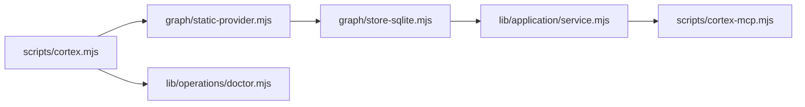

<!-- generated by cortex 0.2.0 gen:934bfdf5135ab061f6574ce9a8a874f0 — edit code/docs sources, not this file -->

# cortex — Architecture

Technical overview of components, interfaces, classified flow inventory, and capability coverage.
The deterministic Phase-1 graph supplies the evidence substrate; Phase-2 understanding supplies
the human component names and operational flow. Raw file and symbol nodes are intentionally omitted.

Cortex: local deterministic repository evidence map — scan -> SQLite generation -> read-only query/MCP surface -> doctor reconciliation.

## System workflow

_(source: .agent/understanding.json:architecture.dataFlow)_

## Components

- **tests** _(source: Undetermined — no evidence recorded)_
- **graph** _(source: Undetermined — no evidence recorded)_
- **lib** _(source: Undetermined — no evidence recorded)_
- **schemas** _(source: Undetermined — no evidence recorded)_
- **evals** _(source: Undetermined — no evidence recorded)_
- **scripts** _(source: Undetermined — no evidence recorded)_
- **docs** _(source: Undetermined — no evidence recorded)_
- **release** _(source: Undetermined — no evidence recorded)_
- **providers** _(source: Undetermined — no evidence recorded)_
- **.github** _(source: Undetermined — no evidence recorded)_
- **service** _(source: Undetermined — no evidence recorded)_
- **sources** _(source: Undetermined — no evidence recorded)_
- **sdk** _(source: Undetermined — no evidence recorded)_
- **fixtures** _(source: Undetermined — no evidence recorded)_
- **mcp** _(source: Undetermined — no evidence recorded)_
- **watchman** _(source: Undetermined — no evidence recorded)_
- **LICENSES** _(source: Undetermined — no evidence recorded)_
- **action** _(source: Undetermined — no evidence recorded)_
- **examples** _(source: Undetermined — no evidence recorded)_
- **grammars** _(source: Undetermined — no evidence recorded)_
- **references** _(source: Undetermined — no evidence recorded)_
- **.dockerignore** _(source: Undetermined — no evidence recorded)_
- **.gitattributes** _(source: Undetermined — no evidence recorded)_
- **.gitignore** _(source: Undetermined — no evidence recorded)_
- **.rightgit.json** _(source: Undetermined — no evidence recorded)_
- **AGENTS.md** _(source: Undetermined — no evidence recorded)_
- **CHANGELOG.md** _(source: Undetermined — no evidence recorded)_
- **CLAUDE.md** _(source: Undetermined — no evidence recorded)_
- **CONTRIBUTING.md** _(source: Undetermined — no evidence recorded)_
- **Dockerfile** _(source: Undetermined — no evidence recorded)_
- **LICENSE** _(source: Undetermined — no evidence recorded)_
- **README.md** _(source: Undetermined — no evidence recorded)_
- **SECURITY.md** _(source: Undetermined — no evidence recorded)_
- **SKILL.md** _(source: Undetermined — no evidence recorded)_
- **TRADEMARKS.md** _(source: Undetermined — no evidence recorded)_
- **assets** _(source: Undetermined — no evidence recorded)_
- **cortex.config.example.toml** _(source: Undetermined — no evidence recorded)_
- **cortex.languages.example.toml** _(source: Undetermined — no evidence recorded)_
- **deepseek.md** _(source: Undetermined — no evidence recorded)_
- **mcp.json** _(source: Undetermined — no evidence recorded)_
- **package.json** _(source: Undetermined — no evidence recorded)_
- **plugin.json** _(source: Undetermined — no evidence recorded)_
- **pnpm-lock.yaml** _(source: Undetermined — no evidence recorded)_
- **pnpm-workspace.yaml** _(source: Undetermined — no evidence recorded)_
- **requirements-test.txt** _(source: Undetermined — no evidence recorded)_
- **server.json** _(source: Undetermined — no evidence recorded)_
- **skills** _(source: Undetermined — no evidence recorded)_
- **sol.md** _(source: Undetermined — no evidence recorded)_
- **solimplement.md** _(source: Undetermined — no evidence recorded)_

## Flow inventory

_No classified product flows yet; run Cortex Phase 2 synthesis._

## Capability coverage

| Capability | Status | Evidence |
|---|---|---|
| document/ADR/plan claims | covered | _source: .agent/map.json:claims_ |
| code symbols and relationships | partial until Phase 2 classifies provider coverage | _source: .agent/graph/graph.db_ |
| contradiction/staleness arbitration | covered | _source: .agent/stale.json_ |

## Health & Security (loud-partial when graph is missing)

- Stale claims: **50** _(source: .agent/stale.json:staleClaims)_
- Missing references: **76** _(source: .agent/stale.json:missingReferences)_
- Detailed health and security findings live in `.agent/understanding.json`; every synthesized
  component and flow above retains its recorded evidence. _(source: .agent/understanding.json)_

## Status

Generated from index signature `934bfdf5135ab061f6574ce9a8a874f0`. Unchanged-repo rebuilds are byte-identical.
