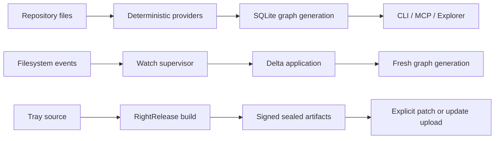

<!-- generated by cortex 0.2.0 gen:ee4e0ac0e6ae9bd832b5b42177e2cbb3 — edit code/docs sources, not this file -->

# cortex — Architecture

Technical overview of components, interfaces, classified flow inventory, and capability coverage.
The deterministic Phase-1 graph supplies the evidence substrate; Phase-2 understanding supplies
the human component names and operational flow. Raw file and symbol nodes are intentionally omitted.

Cortex is a local-first repository comprehension system with a Node.js CLI and MCP surface over a generation-transactional SQLite graph, plus a loopback Explorer and a native Tauri tray shell.

## System workflow

_(source: .agent/understanding.json:architecture.dataFlow)_

## Components

- **CLI** — Builds, queries, watches, repairs, and diagnoses repository graphs. _(source: scripts/cortex.mjs)_
- **Graph engine** — Extracts deterministic file, claim, symbol, relation, and flow evidence. _(source: graph/static-provider.mjs)_
- **SQLite store** — Publishes complete graph generations transactionally. _(source: graph/store-sqlite.mjs)_
- **Application service** — Shares query, admission, orientation, and graph operations across interfaces. _(source: lib/application/service.mjs)_
- **MCP server** — Exposes graph tools through the model context protocol. _(source: scripts/cortex-mcp.mjs)_
- **Explorer** — Serves a token-protected loopback UI over the canonical graph. _(source: lib/explorer/index.mjs)_
- **Watch service** — Applies filesystem deltas and exposes read-only status. _(source: watchman/supervisor.mjs)_
- **Desktop tray** — Controls repository enrollment, service lifecycle, and Explorer launch. _(source: apps/cortex-tray/src-tauri/src/main.rs)_
- **Release integration** — Delegates signing, sealing, and publication to RightRelease and CI to RightGit. _(source: apps/cortex-tray/right-release.config.mjs)_

## Flow inventory

| Flow | Status | Evidence | Impact |
|---|---|---|---|
| build and query | complete | tests/graph-cli.test.mjs | core comprehension path |
| watch and refresh | complete | tests/freshness-regressions.test.mjs | long-running freshness |
| Explorer access | complete | tests/explorer.test.mjs | human inspection |
| desktop release | implemented-unpublished | apps/cortex-tray/right-release.config.mjs | distribution |

## Capability coverage

| Capability | Status | Evidence | Provider |
|---|---|---|---|
| deterministic repository graph | covered | graph/static-provider.mjs | built-in |
| semantic reconciliation | partial | SKILL.md:251 | Phase 2 |
| desktop operation | implemented-unpublished | docs/product/tray.md | Tauri |

## Health & Security (loud-partial when graph is missing)

- Stale claims: **26** _(source: .agent/stale.json:staleClaims)_
- Missing references: **26** _(source: .agent/stale.json:missingReferences)_
- Detailed health and security findings live in `.agent/understanding.json`; every synthesized
  component and flow above retains its recorded evidence. _(source: .agent/understanding.json)_

## Status

Generated from index signature `ee4e0ac0e6ae9bd832b5b42177e2cbb3`. Unchanged-repo rebuilds are byte-identical.
