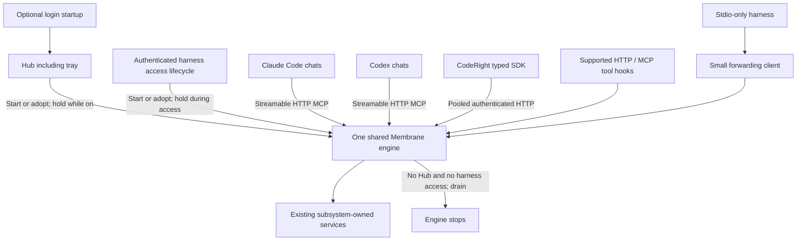

# Single-instance Membrane & harness connections

**Date:** 2026-09-13

**Status:** Selected target architecture; documentation only, not implemented or benchmark-qualified by this decision.

**Scope:** Membrane process ownership, startup, client transports, hooks, concurrency & migration. Subsystem semantics & existing public V1 payloads remain owned by their current contracts.

Membrane runs at most one shared engine per OS user & canonical installed state. Hub on or a harness accessing Membrane starts/adopts & holds that engine. Hub off with no harness accessing Membrane stops the engine/daemon after bounded drain. Warm Pull, Push, recall, graph queries & supported hooks reuse the owner; first authorized access may start it when absent.

**Lifetime correction, 2026-09-13:** [Decisions 21 & 24](adr/2026-09-12-context-system-decisions.md) supersede this plan's former independently supervised autostart policy. That policy was an assistant-authored error. Hub always starts/holds Membrane; harness access may also start/hold it. No independent engine autostart or periodic restart task is part of this target.

This decision replaces per-chat runtime ownership & ordinary direct-store fallback in the target architecture. It preserves Hub-off access, installed-only binding, subsystem ownership, request authorization & uncertain-write protection from [execution lifecycle](execution-lifecycle-boundary.md) & [CodeRight integration](integrations/coderight.md). Their existing execution paths describe the pre-cutover system until installed qualification establishes this target. This document does not mark capability atoms complete.

## Historical source findings at initial design inspection

This section preserves the initial inspection baseline, not current implementation status. Source inspection covered Membrane & CodeRight working trees, including pre-existing uncommitted changes. It is not installed CodeRight execution evidence. Its process snapshot found installed `membrane.exe` clients, with no running CodeRight or resident Membrane engine available to trace live. Recheck source & installed identities before implementing outstanding work.

Installed Blueprint `doctor --json` returned `degraded`; `graph architecture --json` returned `unsupported native Blueprint operation: graph`. Current-state evidence below therefore comes from bounded source inspection, with `blueprint-graph` degradation, not a verified graph projection.

### Membrane

| Finding | Source evidence |
|---|---|
| Current binaries distinguish `membrane-daemon.exe`, `membrane-tray.exe`, `membrane-hub.exe` & CLI `membrane.exe`. | [Installed executable resolution](../../apps/membrane-tray-windows/src/workspace.rs), `Workspace::{daemon_path,tray_path,dashboard_path}` |
| Resident startup installs its native executor & mounts authenticated `/mcp` on its existing listener. | [Resident startup](../../engine/crates/membrane-runtime/src/serve.rs), `install_native_mcp_executor_for_hub` & `build_mcp_http_router` call sites |
| HTTP module's comments still describe opt-in-only startup; actual resident call site supersedes that comment. | [HTTP adapter](../../engine/crates/membrane-runtime/src/mcp_http.rs) versus resident startup above |
| Stdio forwarding currently opens TCP per request, emits HTTP/1.0 with `Connection: close`, & probes active identity/health. | [MCP executor](../../engine/crates/membrane-runtime/src/mcp_executor.rs), `HubTransportExecutor::{active,post_json,execute}` |
| Ordinary explicit execution can instantiate request/session-local runtime when resident transport is unavailable; Blueprint & diagnostics have additional explicit paths. | Same file, `ExplicitOperationExecutor::execute`, `execute_explicit_with_owner` & `execute_blueprint` |
| MCP admission currently expects installation header, exact configured Origin & per-boot `x-membrane-session`, in addition to bearer authentication. Simply replacing a harness command with URL is insufficient. | [HTTP security](../../engine/crates/membrane-mcp/src/http_security.rs), `admit`; [header extraction](../../engine/crates/membrane-runtime/src/mcp_http.rs), `handle_mcp_request` |
| Native HTTP server already accepts connections concurrently; MCP adapter calls synchronous dispatcher inside its async handler. | [HTTP server](../../engine/crates/membrane-runtime/src/http_server.rs), `serve`; `handle_mcp_request` above |

### CodeRight

**Production memory & federation already use native authenticated loopback HTTP. They do not use MCP stdio or spawn an explicit CLI child per operation.** Existing native SDK is a client, not an embedded Membrane engine.

| Path | Current production behavior | Source evidence |
|---|---|---|
| ServiceHost startup | Calls `connect_from_environment_with_identity`; failure installs typed unavailable memory backend. This call site neither provisions Membrane nor acquires its background holder. | [ServiceHost composition](../../../coderight/engine/bins/coderight/src/main_runtime_server.rs), startup match at lines 327–359 |
| InlineHost startup | Calls same native binding; failure rejects inline agent startup. | [InlineHost composition](../../../coderight/engine/bins/coderight/src/main_runtime_session_host.rs), lines 272–295 |
| Discovery/handshake | Resolves installed candidate, reads `/livez` as untrusted bootstrap hint, verifies signed `/health`, then seals installation/store/release/startup/service identity. | [Native binding](../../../coderight/engine/crates/coderight-memory-backend/src/native.rs), `connect_from_environment_with_identity` |
| Memory & federation | Separate typed client values share transport credential & identity fence. Before each non-handshake operation, their closures issue another authenticated `/health` request. | Same file, client closures at lines 680–765 |
| Signed HTTP exchange | `canonical_http_exchange` manually frames HTTP/1.1, opens fresh `TcpStream`, bounds exchange & drops connection. A reusable reqwest object exists, but signed calls bypass its pool. `call_with_identity` creates & joins an OS thread per exchange. | Same file, `NativeHttpTransport::call_with_identity`, `call_blocking_with`, `canonical_http_exchange` |
| Mutation diagnostics | Both startup compositions can attach `LiveDiagnosticsClient<WindowsNamedPipeTransport>` using identity from same verified native binding. | [Mutation diagnostics](../../../coderight/engine/bins/coderight/src/api_mutation_diagnostics.rs), `NativeMutationDiagnostics::connect_from_native_binding` |
| Explicit subprocess SDK | `connect_explicit_from_environment` exists but no production caller was found in CodeRight engine. It is not current memory/federation route. | Native binding file above; [Membrane explicit client](../../engine/crates/membrane-client/src/explicit.rs) |
| Background residency | `ResidentMembraneBinding` wraps acquire/renew/release/loss & expects host-supplied `ResidentHolderTransport`; no production construction/transport implementation was found in inspected engine. | [Holder binding](../../../coderight/engine/crates/coderight-memory-backend/src/binding.rs), `ResidentMembraneBinding`; native `resident_binding` constructor |
| Desktop | Tauri shell adopts/starts CodeRight service. Renderer `/memright/*` requests go to CodeRight API, which owns backend binding; renderer does not own Membrane connection. | [Desktop shell](../../../coderight/apps/coderight-tauri/src-tauri/src/lib.rs), `start_daemon`; [renderer client](../../../coderight/apps/coderight-tauri/src/lib/daemon/memright.ts) |

Therefore CodeRight optimization is connection/thread reuse, removal of redundant health round-trips with equivalent identity fencing, & actual startup/holder wiring. It is not replacing an assumed per-call CLI architecture. Existing integration prose describing bounded SDK execution is an available/target path, not proof production selected it.

Windows diagnostics currently open one fresh pipe handle per framed request, with a health preflight before mutation. Membrane accepts one pipe instance at a time & dispatches into its persistent `DiagnosticsService`; there is no subprocess. See [CodeRight pipe transport](../../../coderight/engine/crates/coderight-memory-backend/src/diagnostics.rs), `windows::call` & `LiveDiagnosticsClient::mutation`; [resident pipe](../../engine/crates/membrane-runtime/src/native_diagnostics_pipe.rs), `create` & `dispatch`; [shared service construction](../../engine/crates/membrane-runtime/src/live_diagnostics_service.rs), `resident_diagnostics_routes`. Existing native transport is useful, but neither persistent client connection nor measured fastest path.

## Selected process shape

There is one planner, one installed engine identity & one shared set of subsystem services. Blueprint, Cortex, Ledger, Adapt, Pull & Push retain their semantic/storage boundaries. Physical co-location does not permit Membrane to bypass Blueprint's storage API or any other subsystem owner. No new subsystem daemon, generic protocol authority or parallel context backend is introduced.

For the literal single-`membrane.exe` target, that executable becomes engine-only. One separate lightweight `membrane-client.exe` supplies CLI, startup helper, command-hook & stdio-bridge modes where needed. Hub supplies UI & always holds engine while on; harness access also works with Hub off. Installer migrates old command registrations atomically; it must not keep launching `membrane.exe stdio-mcp` or `membrane.exe hook`. Binary renaming alone earns no optimization claim: tests count all runtime owners regardless of executable name.

While Hub or harness access is active, supported HTTP path has one engine & zero persistent forwarding clients. With neither active there is no engine. Stdio-only compatibility adds one small client per harness connection; manual commands & command-only hooks may create temporary clients. Those clients link transport/protocol code only, own no database, planner, embedder, watcher or subsystem runtime, & cannot execute direct-store fallback. Their costs remain visible in process accounting.

Engine uses bounded threads/tasks for native subsystem work. External providers or utilities may need explicitly bounded child processes; they never instantiate another Membrane engine or storage authority. Removing required process isolation solely to improve process count is outside this decision.

## Startup, singleton enforcement & shutdown

**Lifetime rule: Hub on ⇒ engine on. Harness accessing Membrane ⇒ engine on. Neither ⇒ no engine/daemon.** Hub always starts or adopts & holds Membrane. Its optional start-at-startup setting launches Hub at login; Hub then starts/holds Membrane. Login alone, without Hub or harness access, starts no engine.

Use existing installed activation & lifecycle capabilities. Hub/tray & harness integrations are engine lifetime owners. Do not register an independent engine service, login entry or periodic scheduled task that keeps it alive without either owner. Crash recovery is bounded & permitted only while an owner remains active. Hub exit releases its ownership; it cannot kill an engine still serving a harness. Closing a dashboard window is not Hub exit if Hub remains running in its tray.

Startup sequence:

1. Resolve verified installer-owned `current`, user identity, installation identity & canonical state root. Development or candidate roots cannot enter production discovery.
2. Serialize Hub/harness activation through installed lifecycle control. Acquire authenticated lifetime ownership before publishing attachment; bound startup cleanup if the initiating owner disappears. Engine acquires exclusive OS-backed owner lock before opening stores. Lock scope includes OS user & canonical state identity; resolving aliases cannot create a second owner.
3. Existing healthy owner is adopted. A contender exits before runtime initialization; it never selects another port/store to evade ownership.
4. Recover stale discovery only after exact-process liveness/start identity & lock ownership checks. Never kill a process based only on recycled PID or filename.
5. Publish endpoint, protocol/capabilities, installation/store identity, release generation & new boot epoch atomically after admission is ready. Report transport readiness separately from repository catch-up.
6. Bound restart attempts/backoff to surviving Hub/harness ownership, preserve crash diagnostics & expose terminal failure. Final owner release or loss stops admission, drains/cancels outstanding work within its deadline, closes stores, terminates governed children & exits. Recheck ownership during drain so concurrent authorized acquisition cannot be lost. No idle engine remains after drain. Stop/restart never falls back to starting runtime inside client.

Hub & supported harness startup/access integrations request installed activation if engine is absent. A generic MCP URL does not launch a stopped server: each supported HTTP harness needs a verified host startup/access integration that starts/adopts the owner, maintains its access lifetime & releases it afterward. Preserve direct HTTP for requests; do not solve startup by adding a persistent per-chat runtime. A failed startup yields actionable unavailable state.

Track engine lifetime ownership separately from background-work authority. An active harness access session holds engine availability across its requests; a chat that is merely open without Membrane access is not an owner. Ending access, release, process loss or lease expiry removes its ownership. No per-call runtime churn is required while that access session remains active.

| State | Required behavior |
|---|---|
| Hub on, harnesses active or inactive | Hub starts/adopts & holds one engine. |
| Hub off, at least one harness accessing Membrane | Harness starts/adopts & holds same engine; access alone does not authorize automatic observation. |
| Hub off, no harness accessing Membrane | Bounded drain completes; engine, daemon & governed workers stop. |
| Login, Hub startup disabled, no harness access | No Membrane engine/daemon starts. |
| Login, Hub startup enabled | Hub starts, then starts/adopts & holds Membrane. |
| Hub or CodeRight ServiceHost has background authority | Same engine activates authorized watchers/background services. Repository enrollment still requires authorization. |
| One lifetime owner exits, another remains | Same engine continues for remaining owner. |
| Final background-authorized owner exits, harness access remains | Drain automatic work; retain engine only for remaining harness access. |
| CodeRight InlineHost starts/ends Membrane access | Acquire/release harness lifetime without gaining ServiceHost background authority. |
| Logout, explicit stop or update | Stop admission, bound drain, reconcile dispatched effects, close stores, terminate governed children, withdraw discovery & release ownership. |

Lifetime leases bind authenticated Hub/harness identity, process start identity & expiry. Socket closure is not proof that harness access ended; pooled HTTP connections & protocol session IDs alone are not lifetime ownership. Host lifecycle integration must supply release plus bounded loss detection, through process liveness or renewable leases. Stale holders cannot leave an orphan engine. Recovery cannot depend solely on whichever client launched first or resurrect an engine with no surviving owner.

## Most effective connection per client

| Consumer | Final connection | What changes |
|---|---|---|
| Claude Code | Direct local Streamable HTTP `/mcp` | Installer writes HTTP registration instead of executable command. No per-chat Membrane adapter. |
| Codex local host | Direct local Streamable HTTP `/mcp` | Same engine URL & supported credential mechanism; no stdio process. |
| CodeRight InlineHost / ServiceHost | Existing typed `membrane-client` API over pooled authenticated HTTP | Reuse current signed native HTTP path; remove fresh-connection/per-exchange-thread churn & redundant health requests. Keep envelopes, identity fencing, absolute deadlines & receipts. |
| CodeRight Windows mutation diagnostics | Existing authenticated native pipe into same engine | Preserve already-wired native transport; consolidate owner identity/lifecycle, not every wire protocol. |
| CodeRight non-Windows diagnostics | Typed authenticated HTTP diagnostics adapter into same service | Existing Windows pipe client reports unavailable off Windows. Qualify this adapter through existing service routes; do not claim cross-platform pipe support. |
| Hub UI | Existing authenticated API on engine listener | UI attaches independently; keep its client connection pool where supported. |
| Claude supported hooks | HTTP hook endpoint or already-connected MCP tool | Same operation owners; no shell/curl process in normal event path. |
| Command-only hooks / manual CLI | `membrane-client.exe` forwards one bounded request | Compatibility process only; no runtime initialization or direct store. |
| Stdio-only harness | Persistent `membrane-client.exe stdio-mcp` forwarding session | Separate downstream session per client; zero subsystem ownership. |
| Remote/WSL/container client | Reachable authenticated endpoint or host-supported forwarding into same owner | `127.0.0.1` names client's network namespace. Qualify that deployment boundary separately; never expose all interfaces as implicit workaround. |

One HTTP listener serves MCP, typed native API & hook adapters. Existing native diagnostics pipe is another endpoint of that same engine. Routes normalize into existing application handlers, then call subsystem-owned APIs in-process. Engine never calls itself through HTTP/CLI to perform ordinary work. Distinct wire adapters do not create distinct planners or authorization rules.

CodeRight shares one bounded connection pool per execution host, not per operation or session. Keep-alive HTTP/1.1 is sufficient baseline; concurrent requests use bounded pooled connections. Negotiate HTTP/2 only where supported & useful. Remove `Connection: close` from reusable traffic. One pool does not mean one globally serialized socket. SDK keeps transport injection; CodeRight's network policy still governs actual connection effects.

Diagnostics retains existing framed pipe contract & exact request identity checks. Bound pipe wait/dispatch, remove global accept serialization where independent requests can safely progress, & retain required edit/store serialization inside service owner. Persistent multi-request pipe sessions require negotiated framing/lifecycle support; never assume current one-frame server can reuse a handle. Removing mutation health preflight requires the same before-effect identity fencing as HTTP.

Extending native pipes/Unix sockets to memory & federation is excluded from initial cutover: those APIs already provide direct typed HTTP, & expansion needs measured benefit. Preserve existing diagnostics pipe rather than replacing a working native path for naming uniformity. Shared memory, custom WebSockets, gRPC, remote hosting & gateway processes are also excluded from this local singleton cutover.

## MCP interoperability & authentication

Use standard Streamable HTTP initialization, version negotiation, tool discovery/calls, notification responses & required HTTP method/status behavior. Ordinary replies use JSON; SSE is used only for supported streaming/server notifications. Validate against actual Claude Code & Codex clients, not only hand-built POST requests.

Installer owns stable loopback endpoint & credential provisioning. Register supported bearer/header mechanisms through each harness's normal configuration. No per-call credential subprocess is needed in steady state. Keep credentials out of repository files, tool arguments, logs & model context; installer chooses user-private credential/config facilities supported by that harness.

Native binding retains signed identity/response verification, credential-rotation detection & canonical signed-header/body behavior. Remove per-call health preflight only once engine validates expected installation/store/release/boot identity before every operation's effects & client verifies signed response identity. Connection reuse alone is not identity proof. Generic MCP authenticates using its standard credential path; initialization binds server-side context to installation & current engine epoch. Clients must not manually configure per-boot `x-membrane-session` or discover boot identity through custom preflight scripts. Preserve boot fencing internally while making standard harness initialization sufficient.

Loopback, Host & Origin checks remain mandatory: reject invalid supplied Origin; absent Origin from native non-browser clients follows authenticated MCP admission instead of blanket rejection. Credentials & host authorization determine grants. MCP roots or model-supplied repository paths are scope requests, never self-authorizing grants. MCP session ID identifies protocol session; it is not bearer credential or authority proof.

Bind caller, repository, task/session, deadlines & cancellation per request. Keep transport session, chat/task identity, engine boot identity & background holder identity distinct. SDK receives verified owner replacement explicitly; MCP clients follow protocol reinitialization. Reconnection retains neither stale grants nor implied authority across an identity change.

## Hooks & failure semantics

HTTP hooks reach a small engine route that normalizes host event into existing hook handler. MCP tool hooks may reuse an already-connected MCP session. Retain event-specific JSON output, decision semantics, output limits, deadlines & receipts.

Claude startup is an exception: current docs exclude HTTP from `SessionStart`/`Setup`, & MCP tool hooks cannot run before MCP context exists. Essential first-turn startup work uses one lightweight command client. Do not misreport skipped startup hooks as successful. Codex hooks use only transports supported by its installed hook contract; MCP HTTP support alone does not establish HTTP-hook support.

HTTP/MCP hook errors can be non-blocking in a harness. Never replace a required enforcement hook with a transport whose failure permits an action previously blocked. Keep command compatibility for such events until equivalent host-bound failure behavior is proven. Explicit Membrane tools remain available even where automatic interception is unsupported.

Disconnect, timeout or cancellation after dispatch does not prove rollback. Preserve existing `CommitUnknown`/receipt reconciliation; never replay uncertain writes through another route, engine or direct store. Retry safe reads after verified rebind within remaining deadline. Mutations may be retried only with existing operation-specific durable deduplication/receipt semantics; this decision invents no new public V1 shape or blanket exactly-once claim.

Ordinary engine unavailability triggers bounded activation/reconnect or typed failure. Offline recovery is explicit maintenance: acquire same exclusive store/owner lock with resident engine stopped. It is never automatic per-chat fallback & never overlaps live engine ownership.

## Performance & observability requirements

Optimize total end-to-end behavior, not executable count alone. HTTP is selected for direct supported attachment & reuse, not asserted faster than pipes or shared memory.

- Reuse verified client binding, connection pools, subsystem service handles, prepared queries & shared eligible caches. Revalidate on boot/release change; avoid per-call health probes & startup work.
- Scope caches by all relevant authorization, repository/generation & representation inputs. Cache reuse cannot cross grants or return stale evidence as fresh.
- Keep request admission asynchronous; execute blocking database/CPU work on bounded workers. Shared runtime has per-client fairness, backpressure & cancellation, with separate foreground/background capacity.
- Keep writes short & owner-serialized where required; permit independent reads/work concurrently. Five chats cannot be forced through one coarse runtime mutex.
- Bound body/result sizes, active connections, workers, queued work & memory. Propagate one remaining deadline through queue, transport, execution & follow-up reads.
- Use event-driven idle waiting. Unload expensive idle resources without repeatedly tearing down engine or reconnecting chats.

Emit structured lifecycle/request events: activation requested, owner adopted/acquired, ready/degraded, holder acquired/expired/released, request queued/started/finished/cancelled/commit-unknown, reconnect, drain, crash & restart suppression. Include non-secret instance/request identity, stage durations, queue depth & reason. Preserve diagnostic output through crashes; never log bearer values or private payloads.

## Migration & acceptance

1. Implement Hub-or-harness lifetime ownership, serialized activation, final-owner shutdown & owner-bound crash recovery. Preserve installed identity & Hub-off harness access; remove independent engine autostart/periodic restart tasks only with replacement activation working.
2. Make existing listener expose interoperable MCP, native pooled API & compatible hook ingress through same owners. Remove ordinary runtime fallback & self-forwarding paths.
3. Pool CodeRight's existing native HTTP transport, replacing per-exchange threads with bounded execution compatible with its synchronous SDK seam. Preserve SDK methods, installed binding, signed wire behavior, diagnostics pipe, managed network policy & mutation receipts. Wire existing holder API/transport into ServiceHost startup/renewal/shutdown independently from InlineHost request binding. Full ServiceHost readiness requires verified background-holder acquisition; diagnostic-only unavailable startup must not masquerade as full readiness.
4. Installer updates binary roles, optional Hub login startup & harness activation/connection registrations transactionally. Login startup targets Hub, which starts/holds Membrane. Migrate away independent engine scheduled tasks/services; no ownerless restart remains. CodeRight wires canonical install/update selection at setup/activation: provision only genuine absence, repair incompatible installation through installer, & never treat known offline/denied/corrupt state as absence. Verify new connection before removing old registration; final configuration has exactly one Membrane registration per harness scope, without active duplicate tools/hooks.
5. Qualify actual installed clients on each supported native platform. Only then retire old runtime entrypoints & update generated runtime truth/canon closure through existing tooling. Update never runs old/new engines against same state concurrently.

Required acceptance evidence:

| Case | Pass condition |
|---|---|
| Five mixed HTTP chats accessing Membrane, Hub & CodeRight | Exactly one engine owner; first activation may start it, subsequent access creates no runtime; zero persistent forwarding clients for HTTP-capable harnesses. |
| Simultaneous cold activation | One store owner; contenders adopt/exit; no second port, store or engine initialization. |
| Hub on/off crossed with harness access active/inactive | Hub alone or harness access alone holds one engine; both share it; neither leaves no engine after bounded drain. |
| Final harness closes with Hub off; Hub closes with no harness | Engine/daemon & governed workers exit; no periodic task restarts them. |
| Hub closes while harness remains; harness ends while Hub remains | Engine identity remains unchanged & remaining owner continues working. |
| Login startup disabled/enabled | Disabled plus no harness means no engine; enabled starts Hub, which starts/holds engine. |
| Warm native & MCP calls | Reused connections/bindings; no per-call process, identity discovery, health probe or database initialization. |
| Long indexing plus interactive calls | Foreground requests progress with bounded queues; one repository cannot monopolize runtime. |
| Crash/restart/client reconnect | With surviving owner, bounded recovery verifies new epoch; with no owner, no restart. No duplicate writes or unauthorized reattachment. |
| Supported & unsupported hook events | Actual host observes equivalent outputs/enforcement; startup exception counted honestly. |
| Isolation & integrity | Cross-session grants denied; stale schema/generation fails closed; subsystem storage integrity, hash resolution & protected-content fidelity preserved. |
| Installation/update/rollback | Installed `current` only; no development binding, competing engine generation or orphaned registration. |

Freeze benchmark inputs & installed versions before cutover. Compare existing path with singleton direct HTTP at 1, 5 & 20 concurrent clients, both idle & indexing. Measure cold startup separately from warm transport-only & real Pull/Push/recall/graph/hook workloads: p50/p95/p99 latency, throughput, total CPU, total private memory, process launches, connection reuse, queue delay, timeouts & idle wakeups. Use identical stores, cache conditions, grants & outputs; include writes on disposable qualification state. Correctness equivalence, target process counts & no material real-workload regression are mandatory. Record measured deltas rather than importing the earlier 19 ms one-shot startup number as warm-call cost.

## External compatibility sources

Checked 2026-09-13; these establish host/protocol features, not installed Membrane qualification.

- [MCP transports](https://modelcontextprotocol.io/specification/2025-11-25/basic/transports): standard stdio & Streamable HTTP; multi-client server process; sessions, HTTP behavior & local admission requirements.
- [Codex MCP](https://learn.chatgpt.com/docs/extend/mcp?surface=cli): direct HTTP URL configuration & supported bearer/header authentication.
- [Claude Code MCP](https://code.claude.com/docs/en/mcp): HTTP registration & stdio compatibility.
- [Claude Code hooks](https://code.claude.com/docs/en/hooks): HTTP/MCP tool hooks, startup availability & event-specific failure behavior.

**Delivery target: one installed engine, direct reusable client connections, shared subsystem owners, isolated authority, & measured end-to-end improvement.**
