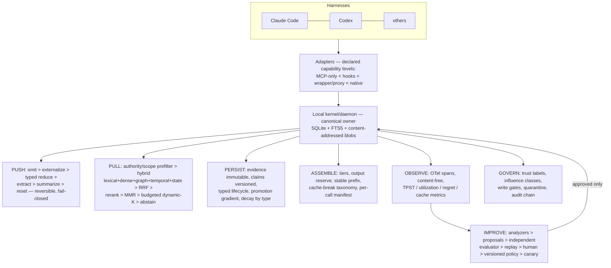

# Master Consolidation — The Context/Memory System Research (Four Agents)

**Date:** 2026-07-26
**Compiled by:** Claude Fable 5, from full reads of all four source documents plus ground verification of the cited research (method in §3).
**Sources:**

| Tag | File | Agent |
|---|---|---|
| **S** | `solCONTEXT_MEMORY_KERNEL_IMPLEMENTATION_PLAN_2026-07-24.md` | GPT (Sol) — "Context & Memory Kernel (CMK)" |
| **Q** | `qwencontex.md` | Qwen 3.8 Max — "Context Engine Full Guide" |
| **P** | `prplxcontext-memory-system.md` | Perplexity — "Agentic Context, Memory, and Telemetry System v2" |
| **M** | `m3CONTEXT-MANAGEMENT-SYSTEM.md` | MiniMax M3 — "Context-Management & Memory System — Source of Truth" |

---

## 1. Complete point inventory

Every point or implementation raised by any agent, grouped by theme. A ✓ marks each agent that raised it. Where agents disagree, the disagreement is stated in the row.

### 1.1 Objective and framing

| # | Point | S | Q | P | M |
|---|---|---|---|---|---|
| 1 | The three pillars — Compaction (PUSH), Retrieval (PULL), Curation (PERSIST) — are the correct core | ✓ | ✓ | ✓ | ✓ |
| 2 | The pillars alone are incomplete; cross-cutting planes must be added | ✓ | ✓ | ✓ | ✓ |
| 3 | **Assembly (PLACE/ASSEMBLE)** is a fourth first-class plane: budgeting, ordering, cache alignment, output reserve | ✓ | ✓ | – | (partial: §4.3–4.5 inside PUSH) |
| 4 | **Observe/Evaluate/Improve** is a mandatory plane (telemetry + eval + recommendations) | ✓ | ✓ | ✓ (TRACE+TELEMETRY+BENCH) | ✓ |
| 5 | **Govern/Protect** (trust, provenance, isolation, security) is a mandatory plane | ✓ | ✓ | ✓ (POLICY + identity) | ✓ (Trust & Security axis) |
| 6 | **Forgetting/decay** elevated to a first-class operation | (in PERSIST) | (in PERSIST) | (in PERSIST) | ✓ (explicit cross-cutting axis) |
| 7 | Optimization target is **quality-preserving tokens/cost/latency per successful task**, never raw compression % | ✓ (explicit formula) | ✓ ("Final Rule") | ✓ ("utility per token") | ✓ (implied; compounding curve) |
| 8 | Context window is a scarce budget, not memory — treat like RAM in an OS, page from disk | ✓ | ✓ | ✓ | ✓ |
| 9 | More context can *hurt* even with perfect retrieval; placement matters (lost-in-the-middle) | ✓ | ✓ | – | ✓ |
| 10 | A compressor that saves 70% but causes one extra failed cycle is worse than a 20% compressor preserving decisive evidence | ✓ | ✓ (implied) | – | ✓ (constraint-compression pitfall) |
| 11 | System must work harness-neutral (Claude Code + Codex first) with no product runtime dependency | ✓ (contextd standalone vs CodeRight-embedded) | ✓ | ✓ | ✓ |
| 12 | The kernel/daemon — not CLAUDE.md, MCP, a proxy, or a vector DB — is the canonical owner of context state | ✓ | – | – | – |
| 13 | Human-supervised learning only; no autonomous self-modification | ✓ | ✓ | ✓ | ✓ |

### 1.2 Data model and provenance

| # | Point | S | Q | P | M |
|---|---|---|---|---|---|
| 14 | One canonical typed context-item record for everything eligible for a model call (rules, tool results, memories, code, summaries…) | ✓ (`ContextItem` + `ContextKind` enum) | ✓ (Source/Chunk/Memory/ContextPack) | ✓ (Episode/Document/Profile/Skill/Scratchpad) | (implicit via schemas) |
| 15 | Two-level memory: **immutable evidence** records + **versioned derived claims**; never overwrite, close validity intervals and supersede | ✓ | ✓ (event-sourced memory) | (raw_ref + summaries) | (tombstones, weaker) |
| 16 | Memory typology: episodic / semantic / procedural / preference / constraint / negative / contradiction (+ code, policy, artifact) | ✓ (9 types incl. negative memory) | ✓ (6 types incl. contradiction) | ✓ (episode/profile/skill) | ✓ (5 cognitive types incl. sensory) |
| 17 | **Separate stores/indexes per memory type** — mixing episodic and semantic in one collection is the #1 mistake | (separate policies) | ✓ | 🟡 (distinct object types/stores per type, but physical index separation not required) | ✓ (explicit) |
| 18 | Provenance on every durable item: who observed, which tool/harness/model/device/session/revision, raw refs, verifier | ✓ | ✓ | ✓ | ✓ |
| 19 | **Authority ladder** (user instruction > repo truth/tests > deterministic tool obs > approved memory > agent-inferred > untrusted external); authority ≠ relevance | ✓ (A5–A0) | ✓ (resolution policy) | – | (trust seeds 0.95→0.40) |
| 20 | Contradiction objects: never silently delete/blend conflicting claims; surface both with status | ✓ | ✓ | ✓ (contradiction_flags) | (contradiction→tombstone old — *differs*: M deletes, S/Q preserve) |
| 21 | Content-addressed blob store for raw artifacts; store pointers (`path@rev`, `context://` URIs) not inlined bodies | ✓ | ✓ | ✓ | ✓ (CCR store) |
| 22 | Schema/embedding versioning on every row; reindex or dual-index on model change | ✓ | ✓ | ✓ | ✓ (§20.12 migration) |
| 23 | Per-call **context run manifest**: every included/omitted item with position, tokens, selection reason, hashes, cache key | ✓ (core artifact) | ✓ (context pack receipt) | 🟡 (package_hash + included memory IDs only; no omission receipt) | (span attrs, weaker) |
| 24 | Low-cardinality omission reasons recorded per call (out_of_scope, expired, budget_exhausted, …) | ✓ | ✓ | – | – |

### 1.3 Identity, scoping, and isolation

| # | Point | S | Q | P | M |
|---|---|---|---|---|---|
| 25 | Full scope lattice: user → org/team → workspace/repo → worktree → branch → goal/task → session → harness/agent → run/turn; device orthogonal | ✓ | ✓ (13 dimensions) | ✓ (7-field tuple) | ✓ (4-axis Mem0 scope) |
| 26 | Identity fields stamped on **every** event and memory; scope filters enforced in SQL/vector query, not post-hoc | ✓ | ✓ | ✓ | ✓ |
| 27 | Cross-scope reads only via explicit policy/bridge with audit; default deny | ✓ | ✓ | ✓ | ✓ |
| 28 | Branch/worktree memory isolated; promoted to repo memory only on merge or human approval | ✓ | ✓ | – | – |
| 29 | Environment facts (dev/staging/prod) never collapsed | – | ✓ | – | – |
| 30 | Harness-specific memories (Claude Code quirks, Codex conventions) stay harness-scoped unless promoted | ✓ | ✓ | ✓ | ✓ (adapters) |
| 31 | Repo identified by remote URL/hash, never by local path alone | ✓ | ✓ | – | – |
| 32 | Machine/device-local facts (paths, toolchains, ports) never sync unless normalized | ✓ | ✓ | ✓ | ✓ |
| 33 | CI/ephemeral/untrusted sessions get reduced write privileges; no permanent memory without review | – | ✓ | ✓ (`ephemeral` policy) | – |
| 34 | Sub-agent scoping: own scratch scope; parent never auto-reads it; child output is agent-derived evidence, not verified truth; explicit promotion | ✓ (trust escalation risk, verified) | ✓ (isolated scratchpads) | – | ✓ (§20.10 promote_to_parent) |
| 35 | Trust levels as an isolation dimension (trusted/sandbox/ci/ephemeral) | ✓ | ✓ | – | – |

### 1.4 PUSH — compaction, filtering, externalization

| # | Point | S | Q | P | M |
|---|---|---|---|---|---|
| 36 | **Ordered compression ladder**: omit → reference/externalize → deterministic typed reduction → extractive → structured state extraction → abstractive summary → context reset (lowest-loss level that meets budget) | ✓ (P0–P6) | ✓ (L0–L5 hierarchy + method table) | ✓ (structure-first, summarize last) | (content-type router, less explicit ordering) |
| 37 | **Content-type routing**: JSON, code, logs, diffs, search results, free text, images each get a dedicated compressor | ✓ | ✓ | ✓ (structure-first) | ✓ (Headroom's 6 compressors, with code) |
| 38 | Preserve exactly: signatures, types, APIs, error messages, stack roots, failing tests, config values, constraints, diffs, exact identifiers | ✓ | ✓ | ✓ | ✓ (0–15% compression on constraints) |
| 39 | Compress aggressively: boilerplate, lockfiles, vendored deps, repeated logs, passing-test noise, formatting noise | ✓ | ✓ | ✓ | ✓ |
| 40 | Tool-result deduplication (identical outputs → anchor/handle; most-recent kept) | ✓ (read_cache generalization) | ✓ (dedup first, cheapest) | ✓ | ✓ (ToolResultCache impl) |
| 41 | Error-purging: collapse resolved error traces to one line after a successful retry | – | – | – | ✓ (ErrorPurger impl) |
| 42 | Reversibility mandatory: every compacted byte recoverable via integrity-checked archive/CCR handle; model can request expansion | ✓ (fail-closed archive-first) | ✓ (lazy expansion pointers) | ✓ (raw_ref) | ✓ (CCR) |
| 43 | Structured compaction packet (schema-validated YAML: goal, constraints, decisions, plan, repo state, verification, dead ends, exact identifiers, lineage) instead of free-prose summaries | ✓ (full schema) | ✓ (session compaction schema) | ✓ (summary JSON schema) | – |
| 44 | Fail closed on any compaction failure (archive, parse, validation) — never mutate the transcript | ✓ | – | – | – |
| 45 | **Live-zone rule**: compress only the mutable tail; never rewrite the frozen prefix (cache) | ✓ | (via stable prefix) | – | (static-first layout) |
| 46 | Milestone/phase-aware compaction triggers (plan phase done, test checkpoint, branch switch, redundancy), not just occupancy thresholds | ✓ | – | – | (deliberate `/compact` at milestones) |
| 47 | Multi-resolution summaries: micro → meso → macro (or hierarchical summaries with lazy expansion) | – | ✓ (RAPTOR-style hierarchy) | ✓ (64/256/64-token budgets) | – |
| 48 | Typed reducers with concrete recipes for JSON rows, logs (template clustering, keep failures), grep results (collapse by symbol), test/build output (exact failures verbatim), docs/web (claim cards) | ✓ (per-type policy specs) | ✓ | ✓ (structured fields not prose) | ✓ (impl code) |
| 49 | LLMLingua-class token-level compression: useful but benchmark-gated; for agents prefer structural/generative over blind token pruning | ✓ (benchmark before adopt) | ✓ (`enabled: false` default) | ✓ (bench-gated) | ✓ (LLMLingua-2 default for free text only) |
| 50 | Trajectory-level reduction for agent histories (AgentDiet-style) | – | – | – | ✓ |
| 51 | Prompt/conversation compaction validated by three test classes: fidelity probes, next-action preservation, end-task outcome | ✓ | ✓ (accuracy delta) | ✓ | (A/B on ratio) |
| 52 | Compaction-regret metric: raw refetches, repeated reads, "lost context" corrections, failures attributable to omitted evidence | ✓ | ✓ (lazy_expansion_rate) | – | – |
| 53 | Tool schemas are their own context tier: stable core bundle, session-latched role bundles, progressive disclosure, deterministic order; changing tool list breaks caches | ✓ (A–D strategies) | ✓ | – | ✓ (MCP-tool trap) |
| 54 | Image/screenshot routing: skip, caption, or low-res preview | – | (multimodal flagged as separate) | – | ✓ |
| 55 | Budget governor: per-section caps (system/rules/rag/history/tools/reserve); compress overflowing section in place, never starve others | (tier budgets) | ✓ (budget yaml) | ✓ (per-class caps) | ✓ (impl) |

### 1.5 PULL — retrieval

| # | Point | S | Q | P | M |
|---|---|---|---|---|---|
| 56 | Retrieval is hybrid: lexical/BM25-FTS + dense + symbol + graph + temporal + metadata; vector-only retrieval is an anti-pattern (misses exact identifiers) | ✓ | ✓ | ✓ | ✓ |
| 57 | **Lexical/FTS5 is the mandatory baseline; dense vectors are optional/second-stage** | ✓ (explicit) | (both) | (both) | (both) |
| 58 | Reciprocal Rank Fusion (RRF) as the first-stage combiner | ✓ | ✓ | – | ✓ (k=60) |
| 59 | Cross-encoder reranking (retrieve ~50 broad → rerank → 4–12 final); called the highest-leverage retrieval upgrade | ✓ (optional 2nd stage) | ✓ | – | ✓ ("single highest-leverage") |
| 60 | MMR/diversification and redundancy removal; don't return five paraphrases | ✓ | ✓ | ✓ | (implied top-k) |
| 61 | **Coalition/synergy selection for code** (active symbol + interface + caller + failing test + recent change beats five similar chunks); snippets can have negative marginal utility | ✓ (RepoShapley-grounded) | – | – | – |
| 62 | Query understanding first: classify information need / task type; per-need retrieval bias and weights | ✓ (14 need classes) | ✓ (8 query types) | ✓ (task types) | – |
| 63 | State-aware retrieval: current goal, plan step, open failures, edited symbols, branch/revision as retrieval features — not just semantic similarity | ✓ | (task-aware) | – | – |
| 64 | Negative-memory retrieval (past dead ends, rejected approaches, incompatibilities) | ✓ | – | – | – |
| 65 | Hierarchical/anchor-first retrieval: summaries first, exact episodes/turns expanded only after an anchor wins ("evidence-nucleus expansion") | ✓ | ✓ (parent-document) | – | – |
| 66 | Composite scoring formula: weighted lexical+semantic+graph+temporal+recency+importance+utility − staleness/conflict/redundancy/token penalties; hard authority/scope gate multiplies to zero | ✓ | ✓ (with starting weights) | ✓ (policy-scoped weights) | ✓ (trust_weighted_rank) |
| 67 | Weights are explicit, versioned, tuned **offline** from replay data — never learned online at first | ✓ | ✓ | ✓ | – |
| 68 | Dynamic K under token budget (greedy marginal-utility knapsack), never fixed top-k | ✓ | ✓ | ✓ (knapsack/beam) | – |
| 69 | Retrieval **abstention**: return `insufficient_confidence` + suggested action; bad memory is worse than no memory | ✓ | ✓ (low-confidence fallback) | – | – |
| 70 | Query-time conflict resolution: prefer valid-at-time, higher authority, verified; surface unresolved conflict | ✓ | ✓ | ✓ | (UPDATE-phase resolution) |
| 71 | "Why retrieved" explanation on every result (reasons, scores, authority, raw ref) visible to user and recorded | ✓ | ✓ (citations) | ✓ (structured decisions log) | – |
| 72 | Security/scope/trust/validity prefilter **before** search and ranking; reranker may reject but never restore filtered items | ✓ | ✓ | ✓ (identity filters) | (retrieval-time trust demotion — *differs*: M demotes, S/Q hard-gate first) |
| 73 | Position-aware final assembly of retrieved evidence (head/tail anchoring, U-curve exploitation) | ✓ (ordering policy) | ✓ (in PLACE) | – | ✓ (u_curve_aware_assemble impl) |
| 74 | Graph retrieval optional; skip unless multi-hop/entity disambiguation/compliance genuinely needed; light variants (LightRAG/LazyGraphRAG/HippoRAG) over full GraphRAG | (graph as one generator) | ✓ (graph: false default) | ✓ (optional 1–2 hop) | ✓ (explicit "skip the graph" default) |
| 75 | Retrieval caching (query→ids) and debouncing for iterative loops/voice partials | – | – | ✓ | ✓ (~30% savings claim) |
| 76 | Retrieval operating targets: Recall@10 ≥ .85 pre-rerank, nDCG@10 ≥ .7 post, p95 ≤ 200 ms | – | – | – | ✓ |
| 77 | HyDE / query expansion / decomposition as optional query-side techniques | – | ✓ | – | – |

### 1.6 Code intelligence

| # | Point | S | Q | P | M |
|---|---|---|---|---|---|
| 78 | Code is not prose: AST-aware chunking mandatory (Tree-sitter, cAST split-then-merge); text-window chunking of code is malpractice | ✓ | ✓ | ✓ (tree-sitter/symbols) | ✓ (full cAST impl) |
| 79 | **Tree-sitter is necessary but not sufficient**: layer LSP/SCIP/compiler indexes for definitions/references/types/calls | ✓ (4-layer graph) | ✓ | – | – |
| 80 | Four-layer code graph: syntax (TS) + semantic (LSP/SCIP) + change (git/co-change) + verification (tests/diagnostics/runtime) | ✓ | (3 of 4) | – | – |
| 81 | Verification edges outrank similarity for debugging (failing test linked to edited symbol > prose-similar memory) | ✓ | – | – | – |
| 82 | Signature/skeleton/body separation; start with signature, expand body on selection | ✓ | ✓ (structural pruning) | ✓ (symbol tables + pointers) | ✓ (collapse bodies) |
| 83 | Revision-scoped code facts: invalidate on content-hash/revision change; dirty worktree is a distinct graph version | ✓ | – | – | – |
| 84 | Incremental indexing on file change; never block a model call on reindex; report index freshness, fall back to direct search | ✓ | – | – | – |
| 85 | Semantic code tools exposed to agents (search_code, find_symbol, read_symbol, find_references/callers, impact, repository_map, test_evidence) instead of bulk file dumps | ✓ | ✓ (MCP tools) | – | – |
| 86 | Repo map (Aider-style) for structural overview | – | ✓ | – | – |
| 87 | Code-specific embeddings differ from text embeddings; dual indexes an option; pick by benchmark, not leaderboard | ✓ (benchmark protocol) | ✓ (code-focused list) | – | ✓ (Voyage-code-3 etc.) |
| 88 | Exact search (ripgrep/Zoekt) as a first-class retriever for identifiers/error codes | ✓ | ✓ | ✓ (BM25 for identifiers) | – |

### 1.7 PERSIST — curation lifecycle

| # | Point | S | Q | P | M |
|---|---|---|---|---|---|
| 89 | Two-phase write pipeline: cheap extraction of atomic candidate facts → LLM update step choosing ADD/UPDATE/DELETE/NOOP against top-k similar existing memories (Mem0 pattern) | (candidate → promotion pipeline) | ✓ (curation pipeline) | (compaction→write) | ✓ (full 200-line impl) |
| 90 | Promotion gradient: raw event → ephemeral candidate → episodic → semantic/procedural → approved rule/skill; each step needs evidence (recurrence ≥3, stability, verification, consent) | ✓ (with utility formula) | ✓ (promotion rules) | ✓ (write classes) | (extraction thresholds) |
| 91 | Session end ≠ automatic durable memory; a session may be fully retained for audit while contributing zero claims | ✓ | ✓ | ✓ | – |
| 92 | Deduplication at multiple levels: exact hash, MinHash/SimHash, embedding cosine, structural, temporal | ✓ | ✓ | ✓ | ✓ (decay-merge at cos>0.95) |
| 93 | Consolidation: merge evidence without erasing versions; extract procedures from repeated successful sequences; keep exceptions and negative evidence | ✓ | ✓ | ✓ | ✓ (dreaming) |
| 94 | Never recursively summarize summaries without lineage + drift tests against raw archives | ✓ | ✓ | – | – |
| 95 | Type-specific decay/TTL, not one time function: constraints never auto-delete; episodic decays fastest; code facts invalidate on revision; preferences decay slowly, reinforced by use | ✓ (invalidation trigger table) | ✓ (decay yaml) | ✓ (GC policies) | ✓ (TTL_BY_CLASS) |
| 96 | Separate **validity** (is it believed true) from **retention** (should evidence remain stored); invalid claims stay for audit but never served as current | ✓ | – | – | – |
| 97 | Access/utility history per memory (times included, in-success, in-failure, utility EMA, last-useful); retrieval and GC must read it — not just cosine | ✓ | ✓ (memory metrics) | ✓ (per-memory aggregates) | ✓ (last_used, reinforcement) |
| 98 | Inactive demotion to cold tier (e.g. 180 d untouched) rather than deletion | (retention classes) | ✓ (archive) | ✓ (cold-store) | ✓ |
| 99 | User memory controls: view/correct/revoke/pin/rescope/export/delete/exclude-from-sync; see why stored and which sessions retrieved it | ✓ (Memory Explorer spec) | ✓ | ✓ (export/delete APIs) | – |
| 100 | Curation jobs are bounded and scheduled (session close, daily, on repo revision, on model/harness change); never on the user-visible critical path | ✓ | ✓ | ✓ | ✓ (nightly dreamer) |
| 101 | Extraction cadence layered: per-turn (cheap) → per-session (batch) → periodic background "dreaming" re-derivation | – | – | – | ✓ (OpenAI Dreaming pattern) |
| 102 | Zettelkasten-style memory evolution (new notes trigger updates to related notes) as the mental model | – | – | – | ✓ (A-MEM) |

### 1.8 ASSEMBLE — budgeting, ordering, caching

| # | Point | S | Q | P | M |
|---|---|---|---|---|---|
| 103 | Explicit context tiers with stability ordering: stable system/tools → approved instructions → active goal/state → retrieved evidence → recent history → task ledger + current request | ✓ (tiers A–F) | ✓ (prompt skeleton) | ✓ (canonical layout) | ✓ (placement discipline) |
| 104 | Budget calculation reserves output + reasoning + safety margin **before** filling tiers; percentage allocations per tier, adapted by task type | ✓ | ✓ (two budget profiles) | ✓ (budget after system+tools) | ✓ (Budget dataclass) |
| 105 | Stable-prefix discipline for provider prompt caching: canonical serialization, deterministic tool order, no timestamps/random IDs/cwd/branch in prefix; volatile content appended last | ✓ | ✓ | – | ✓ (byte-stability asserts) |
| 106 | Cache-break taxonomy logged per call (model/provider/tool-schema/tool-order/permission/serializer change…) | ✓ | ✓ (prefix_churn) | – | (cache-miss causes in self-analysis) |
| 107 | Cache economics known and measured: reads ≈10% of base input, writes +25%/5m and +100%/1h, minimum cacheable thresholds, workspace isolation; cache hit ratio target 60–90% | (provider profile abstraction) | ✓ (metrics) | – | ✓ (exact numbers; *partially stale — see §3*) |
| 108 | Don't bury: non-negotiable constraints, current failing test, requested output format, branch/revision, security warnings, unresolved contradictions | ✓ | – | – | ✓ (constraint mid-context ≈30% less followed) |
| 109 | Context reset + structured handoff artifact preferable to repeated compaction at phase boundaries / persistent context rot; reset policy is model-specific and re-evaluated on model change | ✓ (handoff schema, signed) | – | – | – |
| 110 | Per-item marginal utility ÷ token cost as the admission objective; mandatory pins; identifier preservation | ✓ | ✓ | ✓ | (importance ranking) |
| 111 | Model/provider context profiles (window, max output, reasoning reserve, tokenizer, cache semantics, role rules) | ✓ | ✓ (tokenizer per model) | (budget by model) | – |
| 112 | Local token estimates recorded separately from provider-measured counts; never present estimates as measured | ✓ (measurement taxonomy) | – | – | – |

### 1.9 Telemetry and measurement

| # | Point | S | Q | P | M |
|---|---|---|---|---|---|
| 113 | OpenTelemetry (GenAI semantic conventions) as the tracing foundation; spans for every pillar operation | ✓ | ✓ | ✓ | ✓ (OpenLLMetry) |
| 114 | Full span hierarchy: assemble → retrieve (per strategy) → compress → serialize → llm.call → tool.call → ingest → grade → recommend | ✓ | ✓ (16 trace layers) | ✓ | ✓ (pillar_span) |
| 115 | Join keys everywhere: trace/session/task/user/machine/harness/repo/branch/policy/context-pack/cache-key/model-call IDs — "if you can't attribute it, you can't tune it" | ✓ | ✓ | ✓ (design principle #4) | ✓ |
| 116 | **Content-free telemetry by default**; prompts/paths/code/memory bodies never exported; opt-in bounded local capture for debugging | ✓ (allowlist) | ✓ (redaction + max logged tokens) | (redaction events) | – |
| 117 | Metrics catalog: tokens/cost per task and per success, cache hit ratio, prefix churn, budget variance, latencies, task pass/acceptance/edit/revert rates, faithfulness/hallucination, retrieval precision/recall/nDCG/zero-result/reranker-lift, memory precision/staleness/duplication/contradiction/usage, compression ratio + preservation + accuracy delta, utilization, governance (leaks, scope violations, review backlog) | ✓ | ✓ (6 full metric tables) | ✓ | ✓ |
| 118 | **Evidence-utilization tracking**: was each included item cited/expanded/referenced; context_utilization_rate; unused-token waste | ✓ (explore-to-use ratio) | ✓ (utilization events) | ✓ (attribution) | (waste in self-analysis) |
| 119 | Tokens-per-successful-task (TPST) as the primary efficiency KPI; quality-adjusted token cost; context-utility-density via matched replay | ✓ | ✓ (tokens_per_success) | ✓ (cost signals) | ✓ (cost-per-task attributor) |
| 120 | Compaction-regret and stale-memory-recall-rate as first-class derived metrics | ✓ | ✓ (stale_memory_rate) | – | – |
| 121 | Context waterfall view per call (candidate → filtered → deduped → externalized → compressed → final; cache read vs new billed) | ✓ | – | – | – |
| 122 | Measurement classes labeled: measured / calculated / estimated / counterfactual / vendor-reported; "saved" reserved for matched comparisons | ✓ | – | – | – |
| 123 | Statistical baselines + drift detection (EWMA/CUSUM) per (pillar, op, scope); alert on shift | – | – | – | ✓ (full impl) |
| 124 | Behavioral fingerprints / anomaly alarms (agent belief shifts, top-tool-use deviation) | – | – | (retrieval anomaly) | ✓ |
| 125 | Cost attribution per task class ($/task-type, not $/day) | – | – | – | ✓ |
| 126 | Per-workflow and per-harness dashboards; memory-health views (never-retrieved %, contradictions, GC reclaim) | ✓ (10 dashboard views) | ✓ | ✓ | ✓ (Streamlit impl) |
| 127 | Retrieval-trace, compaction-inspector, and cache-inspector UIs ("why did the agent remember this and not that?") | ✓ | – | – | – |
| 128 | Cost ceiling/budget guard: daily and per-session $ caps with warn/throttle | – | ✓ (cost quotas) | – | ✓ (BudgetGuard impl) |
| 129 | Compounding-curve validation: same task class must get cheaper at stable/rising quality across sessions; if not, the loop is broken | – | – | – | ✓ (MIA-style curve) |

### 1.10 Evaluation

| # | Point | S | Q | P | M |
|---|---|---|---|---|---|
| 130 | Golden/regression task sets built from your own real work (bug fix, refactor, memory recall, stale-fact traps, injection traps…); every production failure becomes a regression task | ✓ (16 task types) | ✓ (evals tree) | ✓ (internal suites) | ✓ (100-query eval set) |
| 131 | Module on/off ablations vs "stuff last-k turns" baseline; policy comparison matrix ablating one component at a time | (A–J matrix) | ✓ (shadow compare) | ✓ (explicit baseline rule) | ✓ (A/B ratio sweeps) |
| 132 | **Matched replay**: same repo snapshot, task, model, settings; vary only context policy; multiple trials; paired statistics (bootstrap/t-test) | ✓ (full protocol) | ✓ (replay evals) | ✓ (scenario A/B) | ✓ (paired shadow A/B impl) |
| 133 | Non-inferiority quality gate **before** any efficiency comparison; predeclared primary metric; per-stratum reporting | ✓ (1 pp @ 95% margin) | ✓ (regression gates) | ✓ (no promote w/o bench delta) | ✓ (p<.05 + effect floor) |
| 134 | Deterministic graders first (tests/build/lint/patch-applies); LLM-judge only where needed, calibrated against human labels, allowed to answer `unknown` | ✓ | ✓ | (hard vs soft signals) | – |
| 135 | Reliability metrics: pass@1 primary, pass@k, pass^k, confidence intervals, failure taxonomy | ✓ | – | – | – |
| 136 | External benchmark anchors: LongMemEval, LoCoMo(+Plus), ContextBench, SWE-bench(-Context), MemGym, MemEvoBench, PerMemSafe, CUB, RULER/HELMET/LongBench; MemBench/MemoryAgentBench (P) | ✓ (13 benches) | ✓ | ✓ | ✓ (LoCoMo, LongMemEval, security bench) |
| 137 | Continuous-eval triggers: any policy/embedder/reranker/compactor/tool-schema/model/harness/schema change | ✓ | ✓ (run_on_change) | ✓ | – |
| 138 | Re-test and strip stale scaffolding whenever the model improves; don't attribute harness effects to models | ✓ (scaffolding-evolution grounded) | – | – | – |
| 139 | Shadow deployment/canary before promotion; post-change measurement; rollback retained | ✓ | ✓ | ✓ (A/B or bandit) | ✓ (shadow trials) |
| 140 | Eval theater warning: public leaderboard scores (MTEB) don't predict your retrieval; build local eval | (benchmark artifact names default) | ✓ | ✓ | ✓ (explicit pitfall) |

### 1.11 Human-in-the-loop self-improvement

| # | Point | S | Q | P | M |
|---|---|---|---|---|---|
| 141 | System **proposes, human disposes** — no auto-apply of behavior-changing recommendations, ever | ✓ | ✓ | ✓ | ✓ |
| 142 | Structured recommendation/proposal object: problem, evidence traces, current vs proposed config diff, expected metric impact, risk, blast radius, eval plan, replay results, rollback plan | ✓ (Rust schema) | ✓ (yaml schema) | ✓ (diffable YAML) | ✓ (Recommendation dataclass) |
| 143 | Recommendation categories: retrieval weights/thresholds, budgets, reranker, compaction rules, prompt ordering, cache fixes, memory promote/demote/merge/expiry, missing indexes, missing eval cases, tool policy, model routing, security rules, new skills/pre-embeds | ✓ (20 kinds) | ✓ (14 kinds) | ✓ | ✓ (8 kinds incl. pre-embed files, add skill) |
| 144 | Detection analytics: failure clustering, token-waste analysis, retrieval-gap analysis (user adds missing file; agent fetches obvious file late), memory-staleness analysis, cache-instability analysis, regression detection | ✓ | ✓ (6 named analyses) | ✓ (auditor detects) | ✓ (7 analyzers implemented) |
| 145 | **Generator/evaluator separation**: an independent evaluator (different model/no hidden rationale) judges proposals before the human | ✓ | – | – | – |
| 146 | Review workflow states (proposed → under_review → shadow → promoted/rolled back/rejected/deferred); risk-tiered approval requirements | ✓ | ✓ (full table) | ✓ | (accept/reject CLI) |
| 147 | Human decisions feed back into proposal ranking/calibration ("taste model") — but never bypass review | ✓ (decision taxonomy) | ✓ (learn from decisions) | – | ✓ (TasteModel impl) |
| 148 | Approved changes become versioned policy with rollback; applied via elevated-trust write path | ✓ (policy_versions) | ✓ | ✓ (policy_id) | ✓ (user_explicit provenance) |
| 149 | Safe automatic actions whitelist (index, dedupe-flag, metrics, replay jobs, expiry of ephemeral state, quarantine) — logged and reversible | ✓ | – | (light online dedupe) | – |
| 150 | Offline optimizers (DSPy/Optuna-style, ACON-style failure-derived rules) allowed only behind replay + approval | – | ✓ | – | – |

### 1.12 Security, trust, and memory poisoning

| # | Point | S | Q | P | M |
|---|---|---|---|---|---|
| 151 | Persistent memory is a confirmed attack surface (OWASP ASI06 "Memory & Context Poisoning"; Lakera OpenClaw; MINJA-class attacks); design for it from day one | ✓ | ✓ | (poisoned-memory risk row) | ✓ (dedicated axis) |
| 152 | Trust labels from **origin**, immutable (user-current / approved-policy / verified-repo / deterministic-tool / agent-generated / third-party / network / imported / quarantined); trust ≠ model confidence | ✓ | ✓ | (payload classes) | ✓ (SEED_TRUST) |
| 153 | **Instruction/data separation**: influence classes (instruction/constraint/evidence/reference/untrusted_data); retrieved text can never become an instruction without approved authority; "remember this as a system rule" stays evidence | ✓ | ✓ (untrusted_evidence marking) | – | ✓ (instruction-strip classifier) |
| 154 | Write gate on every durable write: injection scan, secret/PII scan, trust threshold, high-impact tags require human confirmation | ✓ | ✓ | ✓ (redact before embed) | ✓ (WriteGate impl) |
| 155 | Memory quarantine for inferred/suspect content: retrievable as evidence only, promotion requires human approval | ✓ | ✓ | – | (write-ahead validation) |
| 156 | Trust-aware retrieval ranking with temporal decay; low-trust demoted (M) or hard-gated pre-search (S/Q) | ✓ | ✓ | ✓ (provenance in rank) | ✓ |
| 157 | Tool-output inspection at use time (injection patterns, boundary markers, authority cap); tool output poisoning ≈ memory poisoning | ✓ | ✓ (threat model incl. MCP) | – | ✓ (tool_gate impl) |
| 158 | Sub-agent trust escalation is a named risk: child output must not be treated as higher-trust than raw content | ✓ (Anthropic-grounded) | – | – | – |
| 159 | Secrets/PII: scan (gitleaks/trufflehog/detect-secrets/Presidio) and redact **before** indexing, embedding, telemetry, sync; embeddings are derived sensitive data | ✓ | ✓ | ✓ | (encryption at rest) |
| 160 | Project trust gating: no hooks, project config, project MCP servers, or project memory loaded before the trust dialog | ✓ | – | – | – |
| 161 | Never auto-write CLAUDE.md/AGENTS.md/hooks/permissions — export proposals only | ✓ | ✓ (small stable instruction files) | – | (apply only via approved recs) |
| 162 | Hash-chained/append-only audit log of every write, promotion, config change, approval, deletion; forensic snapshots and rollback to known-good state | ✓ | ✓ | (audited allowlists) | ✓ (AuditLog impl + SHA-256 snapshots) |
| 163 | Security eval suites: cross-scope leakage, injection in README/MCP results, poisoned imports, sub-agent escalation, sync replay/forged ops, deletion resurrection, secret-before-scanner | ✓ (14 suites) | ✓ | (eval risk table) | ✓ (ASI06 smoke test) |
| 164 | Blast-radius policy: what memory classes may trigger which tools; poisoned memory scoped to one app/agent | – | – | – | ✓ (policy.json boundary) |
| 165 | Replay-attack defense (nonce + created_at; old memories re-submitted have lower weight); machine spoofing → signed sync tokens/device certs | ✓ (device signatures) | – | – | ✓ (HMAC tokens) |

### 1.13 Harness adapters and integration

| # | Point | S | Q | P | M |
|---|---|---|---|---|---|
| 166 | Harness adapter layer normalizing events, capabilities, prompt files, permissions across Claude Code/Codex/Cursor/Aider/Copilot/custom | ✓ | ✓ (capability matrix) | ✓ (integration checklist) | ✓ (5 adapter impls + tool aliases) |
| 167 | **Integration capability levels are explicit and honest**: MCP-only = retrieval-only; hooks = ingestion; wrapper/proxy/SDK = enforceable pre-send assembly; native = full. Never advertise MCP-only as "automatic context optimization" | ✓ (capability bitflags + table) | – | – | (proxy/MCP/library wiring options) |
| 168 | MCP tool surface: search/retrieve, repo map, symbol read, compact file, write/propose memory, assemble context, curate session, resolve refs, handoff import/export | ✓ (16 tools) | ✓ (7 tools) | (service API) | (headroom_* tools) |
| 169 | Instruction files stay small and stable; deep content in generated `.context/` packs (project_pack stable/cache-friendly; task_pack volatile) | – | ✓ | – | ✓ (CLAUDE.md ≤200 lines, path-scoped rules) |
| 170 | Write tools from external harnesses create *proposals*, not direct memory writes | ✓ | – | – | – |
| 171 | Session lifecycle state machine (new/active/ended/archived; fork; resume; snapshots for replay) | ✓ (12.2) | ✓ (session types + rules) | (session_id scoping) | ✓ (impl + fork_depth) |
| 172 | Boot sequence specified and fast (<800 ms cold: config → identity → telemetry → adapter → rules/skills → lazy stores → memory excerpt → session → WAL drain/sync) | – | – | – | ✓ |
| 173 | One daemon per user profile; harnesses connect with distinct harness_id/session_id sharing workspace identity; cross-harness retrieval without merging transcripts | ✓ | – | – | – |

### 1.14 Multi-machine sync and operations

| # | Point | S | Q | P | M |
|---|---|---|---|---|---|
| 174 | **Never sync SQLite/WAL files**; sync signed, append-only, immutable operations + content-addressed blobs; indexes are local derivatives rebuilt per machine | ✓ | ✓ (event sourcing) | – | (git-as-DB syncs JSONL, rebuilds vectors — compatible) |
| 175 | Sync transport options compared (LWW / git-as-DB / CRDT / vector clocks / cloud / 2PC) with explicit trade-offs; deterministic merge; tombstones win; deletion-resurrection tests | ✓ (ops + HLC) | ✓ (sync model table) | – | ✓ (full table + git & Automerge impls) |
| 176 | Encrypted relay that cannot read content; per-scope derived keys; OS keychain; revocable device certificates | ✓ | ✓ (age/KMS) | – | (encrypted at rest) |
| 177 | Offline-first: local writes commit immediately; WAL/store-and-forward; sync failure never blocks the agent | ✓ | ✓ | (local-first default) | ✓ (WAL impl) |
| 178 | Hybrid Logical Clocks / Lamport ordering; NTP skew detection; wall-clock only for display and decay (and only when unskewed) | ✓ (HLC) | – | – | ✓ (Clock + LamportClock) |
| 179 | Degraded-mode matrix per subsystem failure (embedder down → BM25-only; reranker down → fused scores; store down → session-only; telemetry down → buffer; disk full → read-only) | (index-stale fallbacks) | ✓ (10-row table) | – | ✓ (Resilience chain impl) |
| 180 | Health checks inventory (DB, indexes, embedder, reranker, provider, telemetry lag, disk, backup freshness, migrations) | – | ✓ | – | – |
| 181 | Backup/restore: event logs and approvals are the unrebuildable crown jewels; daily snapshots, point-in-time restore, dry-run restore, integrity verification; portable JSONL export/import | ✓ (portable bundle) | ✓ | (export/delete APIs) | ✓ (impl, 30-day retention) |
| 182 | Versioned forward-only migrations with upcasters, rebuild plans, rollback | ✓ | ✓ | ✓ (migrations job) | – |
| 183 | Storage quantization for embeddings (fp16/int8/binary/Matryoshka; ~4–10× reduction ≈1% loss; MRL truncated first pass, full-d rerank) | – | – | – | ✓ |
| 184 | Data residency/compliance: local-only or regional policies; retention/consent/deletion | – | ✓ | ✓ | – |
| 185 | Model routing by privacy/cost/capability | – | ✓ | – | – |

### 1.15 Recommended stacks and defaults

| # | Point | S | Q | P | M |
|---|---|---|---|---|---|
| 186 | Local-first default store: **SQLite + FTS5** (+ sqlite-vec/LanceDB optional vectors); Postgres/pgvector + OpenSearch when multi-user | ✓ | ✓ | ✓ | (Qdrant/LanceDB preference — *differs slightly*) |
| 187 | Embedding defaults: BGE-M3 local default; Qwen3-Embedding top open; OpenAI small for cheap; EmbeddingGemma/nomic for edge — but S insists benchmark-first, no reputation defaults | (benchmark artifact decides) | ✓ (options table) | (interchangeable adapters) | ✓ (named defaults) |
| 188 | Reranker defaults: BGE-Reranker-v2-m3 default; Qwen3-Reranker top; jina-v3 latency; Cohere managed | – | ✓ | – | ✓ |
| 189 | Memory frameworks: don't adopt wholesale — borrow patterns (MemGPT paging, Mem0 extraction, Zep/Graphiti temporal, Generative-Agents scoring, Voyager skills) | ✓ (decision matrix, 12 projects) | ✓ (explicit rule) | ✓ (Headroom-class patterns) | ✓ (tool cheat sheet) |
| 190 | Headroom: absorb typed routing/live-zone/reversibility/prefix patterns; treat savings as vendor-reported; never make a proxy the source of truth | ✓ | ✓ (context budgeting row) | (Headroom-class episodic tools) | ✓ (recommended install) — *S and M disagree on adopt-vs-absorb* |
| 191 | Build natively: canonical item/manifest, scope/authority, lifecycle, assembler, policy versioning, attribution, sync semantics; adopt mature infra (SQLite, Tree-sitter, LSP/SCIP, OTel, ONNX, git) | ✓ | ✓ (28. MVS list) | – | – |
| 192 | Do not make foundational dependencies: hosted memory SaaS, external mutable MCP server, vendor proxy, single embedding model, provider-opaque compaction, instruction-files-as-database | ✓ | – | – | (Supermemory API offered as option — *differs*) |
| 193 | Minimum viable system enumerated (SQLite+vec+FTS5, TS chunking, hybrid+rerank, cards, stable/volatile packs, extractor, dedupe+decay, telemetry, eval suite, scopes, human review) | (Phase 0–1) | ✓ (13-item MVS) | (Phase 0–2) | ✓ (80/20 weekend list) |
| 194 | Phased roadmap with acceptance gates and rollback per phase; instrument baseline **first**, learned/adaptive policies **last** | ✓ (Phases 0–9, gates) | ✓ (Phases 0–9) | ✓ (Phases 0–5) | ✓ (Day 0–Week 2) |
| 195 | Launch gates quantified: quality non-inferiority (≤1 pp @95%), ≥20% median billed-input reduction on long sessions, ≤5% tool-call/wall-time increase, zero cross-scope retrievals, all compaction reversible, manifest on every call | ✓ | – | – | (Phase-1 expectations: 50–70% input drop, 60–80% cache hit) |

### 1.16 Anti-patterns (union of all four)

| # | Anti-pattern | Raised by |
|---|---|---|
| A1 | Vector-only retrieval | S, Q, M |
| A2 | Dumping the repo / raw top-k without budget or authority gate | S, Q |
| A3 | Treating Tree-sitter as a full semantic graph | S |
| A4 | Auto-writing AGENTS.md/CLAUDE.md/hooks/permissions/skills | S, Q |
| A5 | Destructive overwrite of memories or raw evidence | S, Q, P |
| A6 | Syncing SQLite/WAL across machines | S |
| A7 | One namespace for all users/repos/branches/harnesses/devices | S, Q, P, M |
| A8 | Measuring by compression ratio alone | S, Q, P, M |
| A9 | Claiming output-token savings without matched replay | S |
| A10 | Exporting prompts/code/paths in telemetry by default | S, Q |
| A11 | Trusting MCP/tool/sub-agent output because the connector is trusted | S, M |
| A12 | External proxy or MCP server as canonical state owner | S |
| A13 | Waiting for the hard context limit before managing context | S, M |
| A14 | Provider-agnostic token estimates when real tokenizer/counts exist | S |
| A15 | Recursive summary-of-summary without lineage/drift tests | S, Q |
| A16 | Reranker restoring items rejected by scope/authority/privacy | S |
| A17 | Learned/adaptive policy before manifests and evals exist | S, Q |
| A18 | Assuming a stronger model keeps the old harness optimal | S |
| A19 | One big vector DB mixing episodic/semantic/code | M, Q |
| A20 | Compressing constraints/rules (keep at ~0–15%) | M |
| A21 | Timestamps or re-ordered JSON keys busting the prompt cache | M, Q, S |
| A22 | Skills-index bloat (list ≤~20 active skills) | M |
| A23 | Forgetting nothing (no decay worker → junk drawer) | M, Q, P |
| A24 | "Dreaming"/background synthesis without provenance = poisoning vector | M |
| A25 | Evaluation theater (leaderboard scores, no local eval) | M, Q, P |
| A26 | Fixed top-k (wastes tokens) | Q, S |
| A27 | No-citation delivery (unverifiable evidence) | Q |
| A28 | CI writing permanent memory | Q, P |
| A29 | Context stuffing / stale facts winning / harness bleed / chunk soup / retrieval thrash | P (failure-mode table) |
| A30 | Hidden online policy mutation (no rollback) | S, Q, P, M |

### 1.17 Points unique to a single agent (not repeated above)

| Agent | Unique contributions |
|---|---|
| **S (Sol)** | Six-plane model with ASSEMBLE split out; ContextItem/manifest schemas in Rust + SQL DDL v2; authority ladder A0–A5 as hard pre-search gate; validity-vs-retention split; negative-memory retrieval; coalition/synergy code selection; four-layer code graph with verification edges; context waterfall; measurement-class taxonomy; generator/evaluator separation; capability-honest adapter contract; handoff artifact schema; HLC-signed sync ops; per-phase acceptance gates with quantified launch criteria; evidence-policy discipline (peer-reviewed vs vendor-reported labeling); ~70 verifiable citations incl. 25+ ACL/EACL 2026 papers |
| **Q (Qwen)** | Fullest metrics catalog (60+ named metrics in 6 tables); recommendation-object YAML with offline-eval block; shadow testing; failure-clustering recipe; degraded-modes and health-check tables; ops chapter (backup/restore/migration/deletion/portability); 44-row missing-pieces checklist; environment-scope facts; LLM-judge calibration protocol; alert severity map; `.context/` pack convention |
| **P (Perplexity)** | Codename discipline (PUSH/PULL/PERSIST/TRACE/POLICY/TELEMETRY/BENCH); hot/warm/cold latency tiers with SLO targets; named policies (`conservative_context`, `on_device_tight`, `ephemeral`…) with contextual-bandit routing under human gate; micro/meso/macro token budgets; leave-one-out credit assignment honesty; pack-utilization metric; voice/on-device considerations; 5-principle summary ("utility per token", "identity is a security boundary") |
| **M (M3)** | Only agent with runnable reference code for nearly every component (~2,000 lines Python); Mem0 two-phase pattern reproduced; error-purging; EWMA+CUSUM drift detection; paired-shadow A/B with scipy; cost-per-task-class attribution; taste model; compounding-curve validation; Streamlit dashboard; harness adapters ×5 with tool-alias map; git-as-DB + Automerge CRDT sync code; WAL offline queue; boot sequence <800 ms; sub-agent scratch promotion; embedding-migration parallel indexing; quantization (MRL); clock-skew handling; budget guard; hash-chained audit log; cache-trap enumeration; 80/20 weekend plan |

### 1.18 Frontier / deferred research questions (M3 §17 — explicitly deferred, not near-term build items)

Raised only by M as open 2026 research, preserved here so the inventory stays complete: policy-learned memory management (RL-trained store/retrieve/forget, AgeMem-class); causally grounded retrieval (retrieve what would have changed the decision, beyond similarity); multimodal procedural memory (recipes with screenshots/diagrams/tool flows); memory-efficient native long-context architectures (removing the need for compression); standardized multi-session agentic evals (current benchmarks single-axis); sleep-style consolidation (hippocampal-replay-like re-derivation — the production form is "dreaming", covered at point 101). None is promoted into §4; all remain evidence-gated. |

---

## 2. Where the agents disagree (and the resolution)

| Topic | Positions | Resolution (evidence-based) |
|---|---|---|
| Contradictions | M: tombstone the older entry. S/Q/P: keep both, close validity, add supersession edge | **Keep + supersede.** APEX-MEM (ACL 2026, verified) shows append-only temporal claims with query-time resolution handle evolution more safely; deletion loses audit and rollback. |
| Trust at retrieval | M: retrieve all, demote low-trust. S/Q: hard authority/scope gate **before** ranking | **Hard gate first.** Once unsafe content is ranked it has already entered the candidate stream; Anthropic containment guidance (verified) and Sol's "the unsafe content has already entered context" argument both support pre-filtering. Demotion is acceptable only *within* the authorized set. |
| Vector store | M: Qdrant/LanceDB default. S/Q/P: SQLite(+FTS5, optional sqlite-vec) local-first | **SQLite+FTS5 baseline, vectors optional.** For a single-operator local system, exact identifiers dominate coding work; FTS5 is mandatory, dense is a benchmarked add-on (S's position). Qdrant is justified only at scale. |
| Headroom | M: install it (library mode) as the PUSH layer. S: absorb its patterns, reproduce savings on own traces, never let a proxy own truth | **Absorb patterns; adopt components only behind own benchmarks.** Headroom's numbers are vendor-reported (verified: README claims 60–95% JSON / ~20% coding); its own docs say code/RAG often pass through. The typed-router + reversible-CCR patterns are sound and worth porting. |
| Graph memory | M: skip by default. Q: enable later (Phase 9). S: graph edges as one candidate generator over SQLite tables from day 3 | **Cheap metadata-graph edges (SQLite tables) early; no graph platform.** Sol's edges (supersedes/contradicts/verified_by/calls) are bookkeeping, not GraphRAG; full graph-RAG stays optional (LightRAG-class if ever needed). |
| Compression aggressiveness | M leads with compressors (biggest win); S orders omit/externalize/reduce **before** any summarization | **S's ladder wins.** Deterministic omission and externalization are cheaper to validate and fully reversible; verified research (CoACT, ACON, structured-eviction) all operate on structured/selective reduction rather than blind token pruning; LLMLingua-class pruning stays benchmark-gated (all four agree on the gate). |
| Where the kernel lives | S: local daemon (`contextd`) owns state; M: library/proxy wrappers; Q/P: service APIs | **Daemon/service with adapters** (S), because enforcement capability, single canonical store, and cross-harness identity all require a resident owner; libraries/proxies become adapters at their honest capability level. |

Convergence is otherwise near-total: all four independently arrive at the same seven-part system — typed compaction with reversibility, hybrid budgeted retrieval, lifecycle-managed scoped memory, cache-aware assembly, content-free full-funnel telemetry, replay-gated evaluation, and human-approved improvement, wrapped in trust/provenance enforcement.

---

## 3. Citation validation ledger

Method: the citations carrying load-bearing claims, plus the 2026-dated citations (highest fabrication risk, post training-cutoff), were fetched directly — ~76 fetches; Sol's 2026-07-26 review found one 2026 omission (Mnemis), now fetched and added, so treat the ledger as near-complete rather than exhaustive (arXiv abstract pages, ACL Anthology pages, GitHub/GitLab repos, vendor docs, official blogs) on 2026-07-26. Canonical pre-2025 papers that carry no contested numbers (Lewis RAG '20, DPR, BM25/Robertson-Zaragoza, Sentence-BERT, ColBERT v1/v2, HyDE, Self-RAG, CRAG, RRF/Cormack '09, MMR/Carbonell '98, LLMLingua 1/2, LongLLMLingua, Selective Context, RECOMP, Chain-of-Density, RAPTOR, Reflexion, Voyager, CoALA, Generative Agents, DSPy, Anthropic Contextual Retrieval, HippoRAG, LazyGraphRAG, Zep/Graphiti, MemBench, MemoryAgentBench) are established literature verified from model knowledge and are marked *canonical* rather than re-fetched.

### 3.1 Verified exactly as cited (fetch-confirmed)

| Citation | Cited by | Verified detail |
|---|---|---|
| Lost in the Middle — arXiv:2307.03172 (Liu et al., TACL) | S,Q,M | U-shaped position effect confirmed |
| Found in the Middle — arXiv:2406.16008 (ACL Findings 2024) | M | "up to 15 pp" on RAG confirmed |
| Lost in the Middle as Emergent Property — arXiv:2510.10276 | M | Exists; thesis confirmed (see 3.2 for attribution error) |
| Mem0 — arXiv:2504.19413 | M,Q,P | 26% / 91% lower p95 / >90% token savings — all exact |
| MemGPT — arXiv:2310.08560 | M,Q,S | OS-style tiered memory confirmed |
| A-MEM — arXiv:2502.12110 (NeurIPS 2025) | M,Q | Zettelkasten memory evolution confirmed |
| cAST — arXiv:2506.15655 | M | +4.3 Recall@5 RepoEval, +2.67 Pass@1 SWE-bench — exact |
| GraphRAG — arXiv:2404.16130 | M,Q | Entity graph + community summaries confirmed |
| LightRAG — arXiv:2410.05779 (HKUDS) | M | Dual-level retrieval confirmed (see 3.3 for the 6000× claim) |
| AgentDiet — arXiv:2509.23586 | M | Actual: 39.9–59.7% input / 21.1–35.9% cost; M's "40-60/21-36" is fair rounding |
| ACON — arXiv:2510.00615 (Microsoft, ICML 2026) | S,M | Exists; 26–54% peak-token reduction |
| Memori — arXiv:2603.19935 | M | 81.95% LoCoMo, ~5% tokens (1,294/query), 67% fewer, 20× — all exact |
| Memory-poisoning attack/defense — arXiv:2601.05504 | M | Exists; composite-trust moderation + trust-aware retrieval w/ temporal decay confirmed (see 3.2) |
| Memory survey — arXiv:2603.07670 (Du) | M,P | Five mechanism families + write–manage–read loop confirmed (this is Perplexity's framing source) |
| Context-engineering survey — arXiv:2507.13334 | M | Confirmed, 1,411 citations |
| LongMemEval — arXiv:2410.10813 | S,Q,M | Five abilities incl. abstention confirmed |
| LoCoMo — ACL 2024 (2024.acl-long.747) | S,Q,M | Confirmed |
| MIA (Memory Intelligence Agent) — arXiv:2604.04503, ECNU-SII | M | Exists; 7B+MIA beats 32B baseline by 18% |
| LRAT — arXiv:2604.04949, SIGIR 2026 | M | Exists; retrievers improve 15–19% even from failed runs |
| OWASP Top 10 for Agentic Applications 2026 — ASI06 | M | Real; ASI06 = "Memory & Context Poisoning" |
| OWASP Agent Memory Guard | M | Real OWASP project; layered detectors, SHA-256 baselines, snapshots (92.5% recall @59 µs reported) |
| Lakera OpenClaw hackathon findings | M | Real blog: Discord memory poisoning + instruction drift → reverse shell, controlled lab |
| OpenAI "Dreaming" — blog 2026-06-04 | M | Real; dreaming = background memory curation since Apr 2025, V3 rebuild; scaled to Free/Plus/Pro |
| Anthropic prompt-caching facts | M | 5-min default TTL, reads 0.1×, writes 1.25×/2×, workspace isolation — confirmed on platform.claude.com (see 3.2 for two stale details) |
| Headroom repo | M,S | Real (`headroomlabs-ai/headroom`, Apache-2.0, ~62.4k★); README: 60–95% JSON, ~20% coding agents |
| SuperCompress — gitlab.com/arjunkshah/supercompress | S | Real; created 2026-06-30, active |
| Hindsight — vectorize-io/hindsight | S | Real (~18.8k★); retain/recall/reflect + 4-way parallel retrieval + RRF + cross-encoder — exactly as S describes |
| Remnic — joshuaswarren/remnic | S | Real; markdown-file local-first memory, hybrid retrieval, MIT |
| OTel GenAI semantic conventions repo | S,Q,M | Real (`open-telemetry/semantic-conventions-genai`) |
| sqlite-vec | S,Q | Real (asg017/sqlite-vec, pre-v1, Mozilla-sponsored) |
| Codebase-Memory — arXiv:2603.27277 | S | 83% vs 92% quality at 10× fewer tokens, 2.1× fewer tool calls — exact |
| ContextBench — arXiv:2602.05892 | S | 1,136 tasks, 66 repos, 8 languages, human gold contexts, explored-vs-utilized gap — exact |
| SWE Context Bench — arXiv:2602.08316 | S | Right context helps, wrong/unfiltered context harms — confirmed (title slightly differs; see 3.2) |
| Agentic Context Management — arXiv:2607.21503 (Dadhich, 2026-07-23) | S | Confirmed incl. date |
| CoACT — arXiv:2607.02911 | S | 33.0% token reduction, action-preserving — exact |
| Tool-schema compression — arXiv:2605.26165 | S | +20.5 pp EM lift at 8K budgets; 44–50% schema savings — exact |
| Memory in the Loop — arXiv:2607.05690 | S | Confirmed |
| Experience Compression Spectrum — arXiv:2604.15877 | S | Confirmed (5–20× episodic, 50–500× skills, >1000× rules) |
| SALT — arXiv:2607.17486 | S | Confirmed |
| Parallel Context Compaction — arXiv:2605.23296 | S | Confirmed |
| Structured Context Eviction — arXiv:2606.11213 | S | Confirmed |
| Mem2ActBench — arXiv:2601.19935 | S | Confirmed |
| MemGym — arXiv:2605.20833 | S | Confirmed (five tracks, four regimes) |
| MemEvoBench — arXiv:2604.15774 | S | Confirmed ("Memory Misevolution" safety benchmark) |
| Context Length Alone Hurts — Findings EMNLP 2025.1264 | S | Confirmed |
| Attention Basin — ACL 2026 long.1198 | S | Confirmed (title: "…in Large Language Models") |
| CUB — ACL 2026 long.1151 | S | Confirmed |
| Context as a Tool (Cat) — Findings ACL 2026.1032 | S | Confirmed |
| ARC — Findings ACL 2026.930 | S | Confirmed |
| Memory as Action (MemAct) — Findings ACL 2026.956 | S | Confirmed |
| MemPO — Findings ACL 2026.1166 | S | Confirmed |
| InfiAgent — Findings ACL 2026.1787 | S | Confirmed (file-based external state, bounded context) |
| MemoBrain — Findings ACL 2026.127 | S | Confirmed |
| SAMem — Findings ACL 2026.722 | S | Confirmed |
| STITCH — Findings ACL 2026.584 | S | Confirmed (Structured Intent Tracking in Contextual History) |
| PACE — ACL 2026 long.1252 | S | Confirmed |
| APEX-MEM — ACL 2026 long.749 | S | Confirmed (append-only temporal property graph; 88.88% LoCoMo) |
| TiMem — Findings ACL 2026.1091 | S | Confirmed |
| HiGMem — Findings ACL 2026.1690 | S | Confirmed (anchor-first retrieval) |
| MemORAI — Findings ACL 2026.1408 | S | Confirmed |
| H-Mem — EACL 2026 long.363 | S | Confirmed |
| CodeMEM — Findings ACL 2026.834 | S | Confirmed |
| CODESTRUCT — ACL 2026 long.607 | S | Confirmed (+1.2–5.0% Pass@1, −12–38% tokens on SWE-bench Verified) |
| RepoShapley — Findings ACL 2026.505 | S | Confirmed |
| RepoDistill — Findings ACL 2026.217 | S | Confirmed |
| CodePromptZip — Findings ACL 2026.1384 | S | Confirmed |
| BRIEF-Pro — Findings ACL 2026.696 | S | Confirmed |
| LoCoMo-Plus — ACL 2026 long.1150 | S | Confirmed |
| PerMemSafe — Findings ACL 2026.320 | S | Confirmed |
| Mnemis — ACL 2026 long.1096 | S | Confirmed (dual-route: System-1 similarity + System-2 hierarchical "Global Selection" traversal). *Added 2026-07-26 after Sol's review flagged its omission from the first ledger revision.* |
| Codex agent loop — openai.com (M. Bolin, 2026-01-23) | S | Confirmed via search (direct fetch 403); MCP tool-order cache-miss bug + prefix caching confirmed |
| Anthropic harness design (2026-03-24) | S | Confirmed: context reset + handoff; generator/evaluator; stripping stale scaffolding on model upgrade |
| Anthropic evals (2026-01-09) | S | Confirmed: deterministic graders, multiple trials, transcript review, outcome-over-path |
| Anthropic containment (2026-05-25) | S | Confirmed: persistent memory/CLAUDE.md as persistence surfaces, sub-agent trust escalation, pre-trust config loading |
| Anthropic MCP code execution (2025-11-04) | S | Confirmed: tool defs/results consume context; progressive disclosure; 150k→2k example |
| Anthropic managed agents (2026-04-08) | S | Confirmed: durable event log, stateless harness, ~60% TTFT reduction (Anthropic-reported) |
| Agent-harness evolution — arXiv:2607.03691 | S | Confirmed (title uses "Agent Harness Evolution"; controlled longitudinal harness study) |

### 3.2 Discrepancies found (keep the idea, correct the record)

| # | Claim as written | Reality (verified) | Severity |
|---|---|---|---|
| D1 | M: "Stanford/MIT, 2025" for arXiv:2510.10276 | Authors are Salvatore, Wang, Zhang — not a Stanford/MIT paper | Minor (attribution) |
| D2 | M: memory-poisoning study shows "over 90% of tested agents vulnerable, 100% relapse rate" | 2601.05504's abstract cites prior MINJA work at ">95% injection success" but stresses that realistic pre-existing memories *reduce* attack effectiveness; the 90%/100% figures are not in the abstract | Moderate — M overstates; the qualitative conclusion (real attack surface, layered defense) stands |
| D3 | M attributes "a 7B model … beats a 32B baseline by 18%" to **Memori** | That result belongs to **MIA** (arXiv:2604.04503); Memori's verified numbers are 81.95% LoCoMo / ~5% tokens / 67% / 20× | Moderate (conflation of two systems) |
| D4 | M: Headroom "~43k stars", `chopratejas/headroom` | Repo now lives at `headroomlabs-ai/headroom`, ~62.4k★ (old URL redirects). Savings figures are the project's own benchmarks | Minor (stale), and treat savings as vendor-reported (S is right) |
| D5 | M: "Default TTL is 5 min (changed from 1-hour in March 2026)"; min cache 1,024 (Haiku/Sonnet) / 2,048–4,096 (Opus) | Current docs: 5-min default confirmed, but no evidence of a from-1-hour change; current minimums: 512 (Opus 5/Fable 5), 1,024 (Sonnet-class/Opus 4.8), 2,048–4,096 (older Opus, Haiku 4.5 = 4,096) | Minor (partially stale); read/write multipliers and workspace isolation confirmed exact |
| D6 | M: GraphRAG "~$33K to index a million-token corpus" | Not in the GraphRAG paper; community-derived estimate. Unverified — do not cite as fact | Minor |
| D7 | M: LightRAG "~6,000× cheaper indexing than GraphRAG" | Not in the LightRAG abstract; derived/vendor claim. Direction (much cheaper) is right; the multiplier is unverified | Minor |
| D8 | M: "ACON … finds LLMLingua is fast but generative summarization wins" | ACON's abstract doesn't frame it as an LLMLingua comparison; specific framing unverifiable at abstract level | Minor |
| D9 | M: "Pi dynamic context pruning" Claude Code extension | Not independently verified; treat as unconfirmed tooling reference | Minor |
| D10 | S: minor title variances — "Attention Basin …Long-Context LMs" (actual: "Large Language Models"), "SWE-ContextBench" (actual: "SWE Context Bench: A Benchmark for Context Learning in Coding"), "Scaffolding Evolution" (actual: "Agent Harness Evolution") | Papers real; titles slightly off | Trivial |
| D11 | M cites "MIA, 2026" and "LRAT, 2026" without identifiers | Both real (2604.04503; 2604.04949/SIGIR 2026) — resolved here | Resolved |
| D12 | P cites "MemBench, MemoryAgentBench" without identifiers | Both are real 2025 benchmarks (canonical); P carries no numbers from them | OK |

### 3.3 Verdict on source reliability

- **Sol (S):** ~70 citations, every one checked resolved to a real, correctly characterized source; the only defects are trivial title paraphrases. Sol also *labels* vendor-reported vs peer-reviewed claims — the only agent that does. **Highest evidentiary reliability.** Its ACL 2026 corpus is the strongest new evidence in the whole set.
- **Qwen (Q):** cites established literature without links; everything named is real and correctly characterized. No fabricated numbers found (it rarely quotes numbers). **Reliable, breadth-oriented.**
- **Perplexity (P):** near-citation-free by design; framing traceable to the real Du survey (write–manage–read) and MemBench-class benchmarks. **Reliable but shallow on evidence.**
- **M3 (M):** all major citations real — none fabricated — but it is the only doc with **misquoted numbers/attributions** (D1–D8). Use its implementation code and structure; re-check any specific number against §3.1/3.2 before relying on it.

---

## 4. Synthesis — what the perfect context system looks like

This synthesis takes only what survives validation, resolves the disagreements per §2, and orders the parts by measured leverage.

### 4.0 The objective function

> Minimize **billed tokens, latency, and repeated work per successful task**, subject to a non-inferiority quality gate, with every byte reversible, every decision attributable, and every behavior change human-approved.

Compression ratio, memory size, and window occupancy are never targets. (S §0, Q §31, P §18, M §8.11; grounded in Context-Length-Alone-Hurts, CUB, SWE Context Bench — all verified.)

### 4.1 Architecture (six planes, one owner)

Key structural decisions, all four-way convergent unless noted:

1. **A resident local kernel owns state** (S); harnesses attach through adapters that declare their honest capability level. MCP-only integration is retrieval-only and must never be advertised as context optimization.
2. **One semantic model, many namespaces.** Full scope lattice (user/org/workspace/repo/worktree/branch/goal/session/harness/device) stamped on every record; enforced in queries; cross-scope movement only by policy or human promotion.
3. **Two-layer memory:** immutable evidence + versioned claims with validity intervals, supersession/contradiction edges, and authority levels A0–A5 set by origin, never by model confidence.
4. **Every model call gets a manifest** (included + omitted with reasons, tokens, hashes, cache key). This is the foundation everything else stands on — without it, no attribution, no replay, no honest savings claims.

### 4.2 The leverage ordering (what to build first, by expected payback)

1. **Measure before optimizing (Phase 0, unanimous).** Manifests, provider-usage capture (input/output/cache-read/cache-write per call), TPST by task class, cache-break taxonomy, baseline eval set from real work. *You cannot claim or even see savings without this.*
2. **PUSH on tool results and transcripts** — the dominant token sink in coding agents. Order: dedup identical tool outputs → externalize large outputs behind references → typed reduction (JSON/log/grep/test recipes) → error-purge resolved failures → structured compaction packets at milestones. Expected magnitude: verified literature puts trajectory-level reduction at ~33–60% input tokens with maintained quality (AgentDiet 39.9–59.7%, CoACT 33%, CODESTRUCT −12–38%). Reversibility (CCR/archive-first, fail closed) is non-negotiable.
3. **Cache discipline.** Stable prefix canonicalization, deterministic tool order, no volatile bytes early, session-latched tool bundles; measure cache-hit ratio (healthy: 60–90% of input as cache reads) and log every break with a reason. Cache reads are 0.1× price — this is a direct multiplicative lever on every remaining token.
4. **Budgeted assembly.** Tiers with output/reasoning reserve; head/tail placement of constraints and the current request (Lost-in-the-Middle + Attention Basin, both verified); never bury failing tests or non-negotiables.
5. **Hybrid retrieval with hard gates.** FTS5/exact-identifier first; dense optional and benchmark-gated; RRF; rerank; MMR; dynamic-K knapsack; abstention. Scope/authority/trust filtering strictly before ranking. For code: AST entities + semantic index + change/verification links; coalition selection.
6. **Lifecycle curation.** Two-phase extraction/update; promotion gradient with recurrence+verification thresholds; type-specific decay and revision-bound invalidation; access/utility history driving both retrieval and GC; user-facing memory explorer with correct/revoke/pin/rescope.
7. **The improvement loop.** Nightly/weekly analyzers (recurring reads → pre-embed/skill proposals; waste; retrieval gaps; staleness; cache instability; drift) → structured proposals with evidence and rollback → independent evaluator → replay → human accept/reject (decisions calibrate future proposals) → versioned policy → canary. Compounding curve (cost falling, quality holding, per task class) is the health signal of the whole system.
8. **Security throughout, not after:** origin-immutable trust labels; influence classes so retrieved text can never become instruction; write gates with injection/secret scans; quarantine; sub-agent output stays agent-derived until verified; hash-chained audit; content-free telemetry; project-trust gating; the 14-suite security eval battery.

### 4.3 Proposed operating targets

These are **design targets proposed by the agents, not empirical facts** — the external results that motivate them are labeled separately. (Reframed 2026-07-26 per Sol's review: the original "validated set" title conflated evidence with product choices. Note also: membrane's already-preregistered cohort experiment uses a different contract — 40% reduction goal with a five-point quality margin — and one contract must be picked per experiment before results arrive, never blended after.)

| Target | Value | Class |
|---|---|---|
| Quality gate | non-inferiority ≤1 pp @95% before any efficiency claim | design target (S) |
| Billed-input reduction on long sessions | ≥20% median (full-control integrations) | design target (S); the 33–60% literature range is external result, not expected local effect |
| Tool-call / wall-time increase | ≤5% median | design target (S) |
| Cross-scope retrievals in security tests | 0 | design target (S,Q) |
| Cache-hit ratio (input tokens as cache reads) | 60–90%; investigate <50% | design target (M); 0.1× read pricing is external fact |
| Retrieval | Recall@10 ≥0.85 pre-rerank; nDCG@10 ≥0.7 post; p95 ≤200 ms interactive | design target (M,P) |
| Stale-memory recall on hard-invalidated facts | 0 | design target (S) |
| Compaction | 100% reversible; identifier-preservation suite green; regret tracked | design target (S,Q) |
| Eval set | ≥100 queries/tasks from own work; grow 1–2/session | design target (M) |
| Every model call | has a manifest; every number labeled measured/calculated/estimated | design target (S) |

### 4.4 Reference stack (single-operator, local-first, two-machine)

- **Store:** SQLite + FTS5 + content-addressed blob dir; append-only event log. Vectors: sqlite-vec *after* a lexical-vs-dense benchmark on own traces.
- **Code:** Tree-sitter entities + skeletons; ripgrep exact; LSP/SCIP where available; git/test edges in plain SQLite edge tables.
- **Embedder/reranker:** pluggable; pick by local benchmark (candidates: BGE-M3 / EmbeddingGemma-class local; BGE-reranker-v2-m3), never by leaderboard.
- **Sync:** signed append-only operations + blobs through a git remote (already the proven pattern here); HLC ordering; tombstones; never DB files.
- **Telemetry:** OTel GenAI conventions, metadata-only export, local encrypted deep traces opt-in; Streamlit/static dashboard is sufficient.
- **Improvement:** proposal files + review queue; DSPy/ACON-style offline optimization only after manifests + replay exist.
- **Borrow patterns from** Headroom (typed router, CCR, live-zone), Hindsight (parallel generators + fusion), Mem0 (two-phase update), Letta (paging), APEX-MEM (append-only temporal claims), Voyager (skills); **adopt none wholesale**; no hosted memory SaaS on the critical path.

---

*Companion document: [`01-MEMBRANE-GAP-ANALYSIS.md`](01-MEMBRANE-GAP-ANALYSIS.md) — where membrane/RightContext stands against this synthesis and the ordered path to close the distance, including the token-burn visibility problem.*
