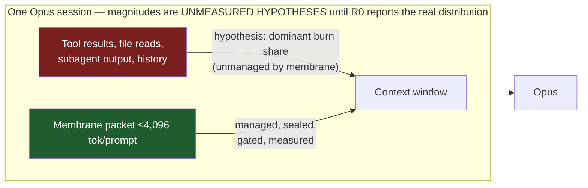
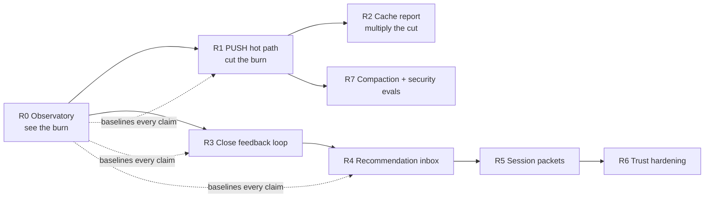

# Membrane Gap Analysis — Current System vs. the Synthesized Target

**Date:** 2026-07-26
**Baseline for "target":** [`00-MASTER-SYNTHESIS.md`](00-MASTER-SYNTHESIS.md) §4 (the validated, four-agent-consolidated design).
**Baseline for "current":** ground reads of `docs/MEMBRANE-STATE.md` (2026-07-23), `docs/MEMBRANE-TELEMETRY-IDENTITY.md` (2026-07-21), `docs/CONTEXT-VALUE-LEDGER-ANALYTICS.md`, `docs/UNIFIED-CONTEXT-SYSTEM-ARCHITECTURE.md`, and the engine source tree (`engine/crates/cortex/*`, `engine/federation/*`). Every number below is quoted from those documents' own recorded evidence, not from memory.

---

## 1. The headline finding

Membrane is a **PULL system with world-class accounting, pointed at the wrong denominator.**

The four research documents converge on one leverage ordering: (1) measure the whole token funnel, (2) compress what enters the model (PUSH), (3) protect the prompt cache, (4) only then optimize retrieval. Membrane has invested almost entirely in stage 4 — a nine-provider federated retrieval lane that *adds* up to 10,000 characters (≤4,096 tokens) per prompt — plus an exceptional evidence/promotion discipline around it. Meanwhile:

- **Nothing in membrane reduces what Claude Code itself accumulates** — tool results, file re-reads, subagent transcripts, long histories. That is where a 200K-window Opus session actually spends money. The injected packet lane is bounded at ≤4,096 tokens per prompt; the session transcript it rides on is structurally far larger (the exact ratio is an unmeasured hypothesis until R0 reports it — labeled per the measurement-class rule). Optimizing the packet alone is unlikely to move the weekly-quota needle.
- **Provider usage is captured in source but not operationalized.** *(Corrected 2026-07-26 per Sol's review — the first revision said "never sees provider usage," which is wrong at source level.)* The cohort analyzer joins hook telemetry to provider token/quality data by provider session key and separates cached from non-cached input (`MEMBRANE-STATE.md` daily-analysis section), and the dashboard reads `provider_tokens` from `/analysis` (`dashboard.html:310`). What is missing is operational: nothing runs on a recurring schedule, coverage is gated on pending cohort minimums, and there is no tokens-per-successful-task, $/task-class attribution, cache-break log, per-session burn report, or live alerting. The practical blindness stands: 40% of a weekly Opus allowance in ~11 hours with no local artifact saying where it went.
- **The compression tools exist but are advisory.** `runc`, `skel`, `compress` are real, instrumented, and reversible — and the telemetry repair proved adoption is ~nothing: **7 recorded opportunities, 1 linked use, 6 unresolved** (MEMBRANE-TELEMETRY-IDENTITY §Installed repair). Recommendations do not compress tokens; execution does.

The 2026-07-16 audit verdict ("the gaps are activation, evidence, and governance — not architecture") was correct for the retrieval lane. The research corpus adds a second verdict this repo has not yet absorbed: **the retrieval lane is not where the tokens are.**

*(Labeling corrected 2026-07-26: the first revision asserted "~10⁵–10⁶ billed tokens" and "~90%+ of burn" in this diagram — those were inferences, not membrane measurements, and violated the measurement-class rule this very document endorses. The transcript-vs-packet size disparity is structural and real; its exact ratio is R0's first job to measure.)*

---

## 2. Scorecard — target system vs. membrane today

Verdicts: ✅ meets/exceeds target · 🟡 partial · 🔴 absent.

### 2.1 Where membrane already meets or beats the target

| Target capability (synthesis §) | Membrane state | Verdict |
|---|---|---|
| Identity spine on every record (4.1.2) | `installation → service_instance → client → session → turn → trace → event → artifact`, schemas v15–v18; legacy rows honestly labeled `legacy_unattributed`, never backfilled | ✅ ahead of all four research docs in rigor |
| Content-free telemetry (4.2.1) | Forbidden-field schema rejection, path/URL/email/hostname canaries, opaque IDs only; privacy derived by scanning, not self-reported | ✅ |
| Typed gap accounting (Q's reconciliation ideas) | Context Value Ledger: `should_have_used_but_didnt`, `missing_expected_terminal`, `delivery_missing_value_terminal`… each with deterministic `gap_id`, owner, remediation | ✅ — richer than any of the four proposals |
| Multi-machine sync (4.4/S §13) | Append-only git-mirror ops, opaque UUIDv4 installations, `logical_clock`+`origin_seq` causal order, clone detection, tombstones, N×(N−1) replication matrix, never syncs SQLite | ✅ matches Sol's design almost exactly (gap: unsigned ops — see G8) |
| Evidence/promotion discipline (4.2 eval) | Frozen fixtures, immutable failed runs (never resumed/spliced), paired cross-platform parity, P0–P4 receipts, cohort A/B 50/50 intent-to-treat with bootstrap CIs, non-inferiority margins | ✅ — stronger replay hygiene than the research demands |
| Provenance-sealed delivery (4.2.8 partial) | Skill delivery: bodyHash + Git seal; memory delivery: read-only DB-provenance seal, fail-closed; per-candidate veto (`contradicted` = veto-until-superseded, SHA-aware) | ✅ for the delivery lane |
| Hybrid retrieval at this scale (4.2.5) | FTS + 768-d EmbeddingGemma vectors, reserved lanes (memory 800/skill 300 in 4,096), scope-chain canonicalization, bounded one-hop link graph (347 edges), quarantine/restore governance | 🟡→✅ appropriate; prior research verdict "matches published guidance at this scale" stands |
| Reversible curation (4.2.6 partial) | Schema-v10 quarantine with complete row preservation before destructive prune; curate: 21 runs, 433 merged, 282 pruned | ✅ pattern; 🟡 triggers (see G4) |

### 2.2 The gaps

#### G1 🔴 — No PUSH plane in the hot path (highest-leverage gap)

**Target:** dedup identical tool outputs → externalize large outputs behind reversible references → typed reduction (JSON/log/grep/test recipes) → error-purge → structured milestone compaction. Verified literature: 33–60% input-token reduction at held quality (AgentDiet 39.9–59.7%, CoACT 33.0%, CODESTRUCT −12–38% — all fetch-verified).

**Current:** transforms are opt-in CLI verbs behind *recommendations* (`brief-read`/`brief-bash` hooks emit an `opportunity_uid` and hope the agent runs `runc/skel/compress --opportunity`). Measured adoption: 7 opportunities, 1 used. Historical execution totals (`transform_log`: skel 180, runc 154, compress 2) are manual/uninstrumented-era usage. There is no PostToolUse compaction, no tool-result dedup cache, no error-purging, no session compaction packet. Membrane only ever *adds* context.

**Close by:** making the transforms *the default path, not a suggestion* — a PostToolUse hook that (a) hashes tool results and replaces exact repeats with an anchor + `runc` spill reference, (b) auto-routes oversized outputs through the existing typed engines (code→`skel`, prose→`compress`, command output→`runc`) with the CCR-style spill dir as the reversibility store, (c) collapses superseded error traces. The engines, spill mechanism, opportunity ledger, and identity spine already exist — this is wiring plus a non-inferiority gate, not new architecture. (Respect Gate discipline: ship behind the same cohort/receipt machinery as the planner.)

#### G2 🟢 — Burn attribution SHIPPED 2026-07-26; scheduling and $/task-class remain

*(Verdict 🔴 → 🟡 on Sol's review, then → 🟢 on delivery of the Token Observatory. Confirmed against source: `dashboard.html:310` reads `provider_tokens`; the cohort analyzer joins provider tokens to hook delivery with cached/non-cached separation.)*

**Shipped:** `context-pulse burn` (`tools/pipelines/memory/context_burn.py`, parent workspace) reports per-day and per-model input/output/cache-read/cache-write tokens, cache-hit ratio, calculated cost, and the most expensive sessions, across every local Claude and Codex transcript. First live run: **$2,064 calculated over two days, 97% cache hit, top session $290** — the blindness this document opened with is closed.

Two counting defects surfaced on that first run and are now pinned by contract tests, because both made the naive number unusable: a Claude transcript rewrites each assistant message, so summing raw `usage` records counted one session's 688 billed requests as 1,790 (a 2.6x cache-read inflation), and a Codex rollout writes cumulative running totals, so summing them produced 23.18B input tokens for one session. Claude rows now dedupe on `requestId`; Codex takes the final cumulative object and nets out cached input (its `input_tokens` is inclusive where Anthropic's is exclusive). Cost is labelled **calculated**, never measured, per the measurement-class rule.

**Still open:** the report is on-demand only (scheduling is G7), and TPST/$-per-task-class attribution needs a task-class join that does not exist yet. The experiment-contract conflict below is unresolved and blocks the G1/P5 cohort, not this lane.

**Target:** per-call provider usage capture; TPST by task class; $/task; cache-hit ratio with 60–90% target; cache-break taxonomy; context waterfall; per-session and daily burn reports; budget guard.

**Current:** the provider-token join exists in the analyzer/dashboard source, but it serves the cohort experiment (measured_reduction_pct), not operator burn visibility, and it is not scheduled — `cortex-daily` is disabled, so no report is ever fresh without manual invocation. There is still no TPST by task class, no $/task attribution, no cache-break taxonomy, no per-session burn report, no alerting. `context_budget` (2,282 rows) remains hook-side packet accounting. The only always-on burn instrument is the crude cumulative `claude_thread_guard.py` (10M/25M/50M transcript-token warnings). Result: 40%-of-weekly-quota-in-11-hours is discoverable only from Anthropic's own usage page.

**Close by — operationalize what exists, then extend (not a greenfield build):** finish and schedule the existing provider-token analyzer (report age, matched/unmatched session coverage, cached vs non-cached economics kept separate), and reconcile the experiment contract first — the preregistered cohort gate is 40% reduction with a five-point quality margin while the synthesis proposes ≥20% with ≤1 pp; one contract must be chosen per experiment before results arrive. Then extend for burn attribution: Claude Code and Codex transcripts already sit on local disk, and the ledger's **turn census already discovers and parses them** (`context-value-daily.py` schema-v3 inventory reads "uncapped local Claude, ClaudeMM, and Codex session sources"). Claude Code JSONL records per-call `usage` including cache read/creation tokens. Extend the census to aggregate, per session/model/day/client: input, output, cache-read, cache-creation tokens; computed $ at known prices; cache-hit ratio; top-N largest tool results by tokens; files read ≥N times; subagent spend share; longest sessions. Emit a daily operator report (markdown + the existing hosted content-free dashboard) with thresholds (e.g., cache-hit <50%, single tool result >25K tokens, same file read 5×). This is read-only, gate-neutral, and directly ends the blindness. It also supplies the denominator that turns G1's compaction into a *measured* saving instead of a vendor claim — the synthesis's measurement-class rule (measured vs estimated) applies.

#### G3 🟡 — No per-call context manifest (bounded by harness capability)

**Target:** every model call carries a manifest of included/omitted items, tokens, reasons, prefix hash, cache-break reason.
**Current:** membrane manifests only its own packet (blocks, receipts, seven delivery states — good), because a `UserPromptSubmit` hook cannot see the assembled prompt. That is Sol's "hooks = medium capability" row, and it is an honest boundary, not a defect.
**Close by:** (a) declaring the capability level explicitly in docs/telemetry (Sol's adapter-capability contract) so packet metrics are never mistaken for whole-prompt metrics; (b) reconstructing *post-hoc* per-call composition from transcripts in the Token Observatory (system+tools vs tool results vs history vs injected packet — approximate but attributable); (c) revisiting wrapper/proxy-level integration only if a measured case emerges.

#### G4 🔴 — The learning loop has never fired

**Target:** access/utility history drives retrieval and GC; outcome distillation; recency decay; utility-weighted ranking; compounding curve as the health metric.
**Current (all from membrane's own audits):** `context_feedback` = **0 production rows**; effectiveness 36/1,114 = 0.032 (advisory lower bound); write-time score is a constant 0.6 (`store.rs:1797`) so the `score<0.2 && access_count==0` quarantine trigger **cannot fire** (live `quarantined: 0`); no retrieval-time recency/frequency decay (parked); 397/449 deliveries carried **zero memory blocks** (under-delivery skew); `delivery_missing_value_terminal` is typed but value terminals never close.
**Close by (already on the parked list — promote it):** retrieval-time recency/frequency decay; outcome distillation to close delivered→used/ignored/contradicted; make write-time score variable or remove the dead trigger; then the compounding curve (M's cost-falling/quality-holding per task class) becomes computable from the Observatory + ledger join.

#### G5 🔴 — No evidence-utilization measurement

**Target:** per delivered block: cited/expanded/ignored; `context_utilization_rate`; unused-token waste feeding the improvement loop.
**Current:** delivery is fully accounted to the block level, then observation stops (G4's empty value terminals). Membrane knows exactly what it delivered and nothing about what mattered.
**Close by:** cheap first pass — post-turn transcript scan for references to delivered identifiers (paths/symbols/memory keys) writing the existing `used/ignored/unknown` terminals; LLM-judge sampling later, calibrated per Q's protocol.

#### G6 🟡 — Analysis exists; *recommendations* don't

**Target:** analyzer → structured proposals (pre-embed hot files, extract skill, fix cache-buster, demote dead memory, add eval case) → independent evaluator → human inbox → taste calibration.
**Current:** daily-analysis computes SLO/eligibility/cohort stats; the ledger computes typed gaps **with remediation owners** — but nothing turns telemetry into ranked, actionable proposals for Adrian, and there is no accept/reject record calibrating anything. The Kimi-audit disposition shows external audits are currently doing this job by hand.
**Close by:** a proposal generator over (Observatory + ledger + gap reports) emitting M's `Recommendation` shape with S's evidence/rollback fields, a markdown inbox, and decision logging. Proposal-only; no auto-apply — which membrane's governance culture already guarantees.

#### G7 🟡 — No recurring maintenance/analysis schedule

*(Wording corrected 2026-07-26: runtime services and hooks do run; it is the recurring analysis/curation/replication lane that is off.)*

**Current:** `cortex-daily` is deliberately disabled at every gate boundary, so census, analysis, sync, and any future Observatory run only when invoked by hand. Gate discipline is legitimate; total operational blindness between manual runs is the cost.
**Close by:** the planned separately-named replication schedule after P3/P4 acceptance, plus scheduling the *read-only* Observatory/census lane independently now — it touches no DB writes, no sync, no `cortex-daily`, so it does not violate the gate contract as documented ("read-only … does not enable or invoke cortex-daily").

#### G8 🟡 — Trust model is provenance-strong, authority-weak

**Target:** origin-immutable trust labels + A0–A5 authority ladder; instruction/data influence classes (retrieved text can never become an instruction); write gates with injection/secret scans; quarantine-by-provenance; signed sync ops; abstention.
**Current:** delivery seals, read-only provenance verification, veto rail, append-only mirror, content-free exports — but: no authority levels; no influence-class separation on delivered blocks; no injection scan at `cortex put`/Morph intake (provenance regressions exist, scanning doesn't); mirror events **unsigned** (Ed25519 already on the surviving-suggestions list); quarantine is effectiveness-based, not provenance-based; recall has veto but no abstention state.
**Close by:** additive columns (authority, influence_class) + a write-gate scan pass + Ed25519 signing of mirror ops + `insufficient_confidence` recall result. All fit the existing schema-migration discipline.

#### G9 🟡 — Episodic tier exists; session-packet capture and handoffs do not

*(Verdict corrected from 🔴 2026-07-26 per Sol's review, confirmed against source: `cortex-core/src/types.rs` implements `MemoryTier::Working → Episodic → Semantic` with promotion ranks. The tier is real; nothing automatically fills it at session end.)*

**Target:** structured session-end compaction packets (goal/decisions/dead-ends/verification/exact identifiers, schema-validated, lineage-bound); episodic store distinct from semantic; handoff artifacts for reset/cross-machine continuation.
**Current:** the tier hierarchy is implemented in the engine, and Morph mines durable *preferences/rules* from transcripts; but "what happened in that session, what failed, what's open" is never captured into the episodic tier — each cold session reconstructs it, which is itself a token cost. No handoff artifact exists.
**Close by:** SessionEnd hook → structured packet (S's schema) written as a typed memory family through the existing lifecycle ledger; retrieval already knows how to deliver it. Fail-closed and archive-first per S §7.4.

#### G10 🟡 — Code intelligence is syntax + graph-lite

**Current:** Blueprint graph, `skel` skeletonization, repo_code overlay (capped 64), dirty-overlay freshness with digests — solid Layer-1/Layer-3 coverage. No LSP/SCIP semantic layer, no test↔symbol verification edges, no coalition selection.

**Contract break — CLOSED 2026-07-26 (verified against source, superseding the "rebaseline required" entry).** Blueprint migrated its store to a single SQLite `graph/graph.db` holding nodes, edges, docTruth, and the manifest envelope, with no `graph.json` fallback. Both membrane readers now bind to that store first: the federation provider reads the `generation.manifest` envelope out of `graph.db` and only falls back to the JSON manifests for pre-migration repositories (`engine/federation/providers/blueprint.py:100-141`), and the Rust freshness evaluator reads `graph.db` metadata ahead of `.blueprint/manifest.json` (`engine/crates/cortex/src/freshness.rs:536-556`, which documents why graph.db must win precedence). Federation suite green (63 passed, 3 skipped).

**Residual operational cause of `blueprint_stale` (this is what actually degrades the lane):** the sealed generation binds to the commit the graph was built at, so every new commit leaves `graph.db` behind HEAD until `blueprint build` runs — observed 2026-07-26 with the store sealed at `da817c8d` while HEAD was `4601af84`, degrading the lane on every prompt. This is a *scheduling* gap, not a contract gap, and it belongs to G7: the rebuild must run on a repo-revision trigger rather than by hand.
**Close by (receipt-gated, later):** verification edges first (failing test ↔ edited symbol outranks similarity for debugging — S's highest-value code idea), LSP/SCIP only if a measured retrieval-gap analysis demands it.

#### G11 🟡 — Retrieval refinements not yet warranted

Cross-encoder rerank, dynamic-K knapsack over the fixed lanes, HyDE, multi-hop: all absent, and correctly so at 1,909 memories — the prior research verdict and the frozen-eval discipline both say promote only on a measured win. Keep parked; revisit when the eval set (G12) grows.

#### G12 🟡 — Eval breadth

**Current:** frozen 30-row recall gate, replay grids, parity protocol — deep but narrow (retrieval + latency only).
**Target adds:** compaction fidelity/next-action/regret suites (needed the moment G1 ships), stale-memory traps, injection/poisoning suites (S's 14 security evals; the OWASP ASI06 smoke test is ~20 lines), and growth of the golden set from real failures (target ≥100).

#### G13 🟡 — Advisory thresholds shipped; enforced ceilings still absent

**Current:** the Observatory carries one advisory — cache-hit ratio under 50% on a session large enough for the ratio to mean anything — alongside the thread guard's transcript-token warnings. Both are read-out-when-asked, not enforcement.
**Target:** daily/session $ and token ceilings with warn thresholds, per model, surfacing "you are at 40% of weekly quota" *while it is happening*. The denominator now exists (`context_burn.collect` returns per-day cost and totals), so the remaining work is a threshold policy plus a place to fire it from — which is the same scheduling gap as G7.

---

## 3. What NOT to change (explicit, per the research)

- **Do not add a vector DB, Graphiti, or a memory SaaS.** All four docs and the 2026-07-16 audit agree; SQLite+FTS+local embeddings is the right substrate at this scale.
- **Do not weaken gate/receipt discipline to move faster.** It is the strongest implementation of the research's own replay/non-inferiority demands anywhere in the four documents.
- **Do not chase rerankers/multi-hop/graph platforms** before the utilization and eval gaps (G5, G12) can prove a win.
- **Do not let any new lane auto-apply behavior changes.** Proposal-only is already membrane law; keep it.
- **Do not sync SQLite/WAL or hostname-derived identity** — already correctly avoided.

---

## 4. Ordered close-the-gap roadmap

Sequenced by leverage-per-effort, gate-compatible; each step is measurable by the step before it.

| Step | Builds | Closes | Effort | Expected effect |
|---|---|---|---|---|
| **R0. Token Observatory** (read-only transcript ledger + daily burn report + thresholds) | census extension, report, dashboard tile | G2, G13, half of G3 | Small — parser + aggregation over existing census | Ends the blindness; baselines every later claim; immediate answers to "where did 40% go" (cache-hit ratio, top sinks, re-reads, subagent share) |
| **R1. PUSH hot path** (PostToolUse dedup → anchor/spill; auto-routed `runc`/`skel`/`compress`; error-purge) behind cohort + non-inferiority gate | hook + wiring to existing engines | G1 | Medium — engines/spill/opportunity ledger exist | The 33–60% class of input-token reduction the literature verifies; measured by R0 |
| **R2. Cache discipline report** (cache-read ratio per session from R0; break-cause classification: model switches, MCP tool-list churn, skills-index size) + operator advisories | analytics only | G2 remainder | Small | Multiplies R1 — cached tokens are 0.1× price |
| **R3. Close the loop** (recency/frequency decay at retrieval; value terminals via transcript-reference scan; variable write scores) | engine + hook | G4, G5 | Medium | Feedback rail finally fires; compounding curve computable |
| **R4. Recommendation engine + inbox** (proposals over R0+ledger+gaps; decision log; taste weighting) | analyzer + report | G6 | Medium | The "system that tells me the failures" ask, in Adrian-readable form |
| **R5. Session packets + handoffs** (SessionEnd structured compaction packet as typed memory family) | hook + schema family | G9 | Medium | Kills cold-start re-derivation cost; enables cross-machine handoff |
| **R6. Trust hardening** (authority + influence-class columns, write-gate scans, Ed25519 mirror signing, recall abstention) | additive migrations | G8 | Medium | Poisoning surface closed before memory volume grows |
| **R7. Eval broadening** (compaction fidelity/regret suites for R1; injection suite; stale traps; grow golden set) | fixtures | G12 | Ongoing | Keeps every later tuning honest |
| **R8. Scheduling** (read-only Observatory lane now; replication schedule after P3/P4 per existing plan) | launchd/Task Scheduler entries | G7 | Small | Reports arrive without being asked for |

Deferred (parked, evidence-gated): cross-encoder rerank, dynamic-K, LSP/SCIP semantic code layer, verification edges (first of the deferred set to revisit), multi-hop, learned compressors.

## 5. Closing statement

Membrane's retrieval lane, identity spine, ledger, sync, and promotion discipline are genuinely at or beyond the frontier the four research documents describe — several of their "target" artifacts (typed gap accounting, causal N-installation replication, immutable failure evidence) already exist here in stronger form. What is missing is the half of the system the research ranks first: **seeing the token funnel end to end, and compressing the hot path that actually consumes the budget.** The engines for both are already in the repo; R0 and R1 are wiring and measurement, not invention. Until they land, weekly-quota burn will remain invisible locally and untouched by everything membrane does per prompt.
