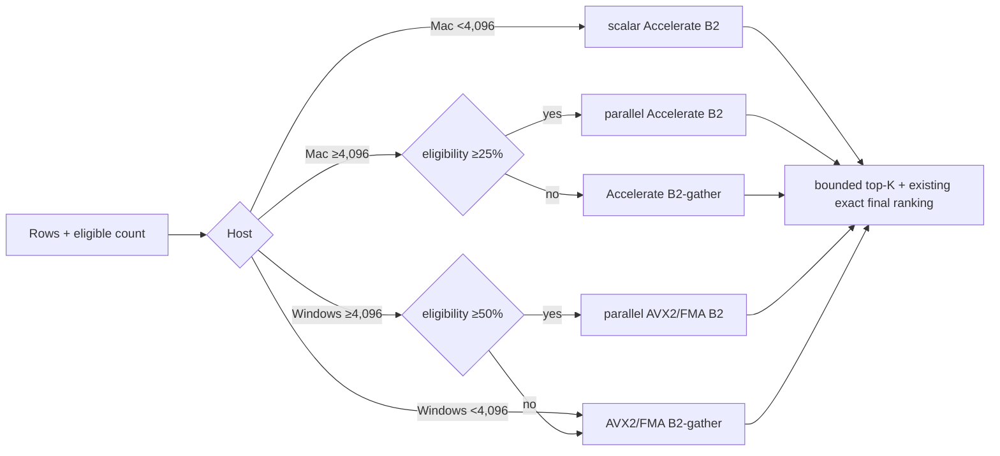

# Rust vector optimization bakeoff 2 — final cross-host report

**Date:** 2026-08-02
**Decision:** keep vectors inside Crypt/Membrane; implement resident in-process f32 dispatch.
**Evidence:** Windows `f20f5ab`; Mac unified rerun from same source; 38 bundles,
25,410 measurements across both hosts.

## Answer

No measured external vector database justifies migration through 100,000 rows.
Same-store Rust now beats current A in every crossover cell on both hosts while
preserving retrieval gates. This is evidence through measured scale, not proof
for every future corpus or workload.

Fable's direction is right, with corrections:

- Mac does **not** use parallel quantized scan for all large corpora. Unified
  exact-rerank results select parallel-B2 at N12 ≥25%, gather below 25%, & B3
  only at 100K ≥25%.
- N0 does **not** stay on current A: scalar Accelerate B2 wins both spots.
- GPU/ANE was deferred & **not measured**, so it was not rejected by measurement.
- “Vector DBs only won one cell” applies to stable/adoptable backends. Research-only
  pre-release DiskANN also won Mac N12×100% in Round 1.

## Result

This v1 uses one contiguous f32 projection per registry. It excludes B3's
second resident i8 projection until production telemetry shows 100K-scale
corpora where its 1.7–2.7 ms additional gain matters.

## Unified crossover winners

p95 milliseconds; reduction compares winner with same-cell A.

| Scale | Eligible | Mac winner | Mac p95 | Reduction | Windows winner | Windows p95 | Reduction |
|---|---:|---|---:|---:|---|---:|---:|
| N12 | 100% | parallel-B2 | 3.982 | 74.5% | parallel-B2 | 3.489 | 71.7% |
| N12 | 50% | parallel-B2 | 3.007 | 62.0% | parallel-B2 | 2.916 | 69.6% |
| N12 | 25% | parallel-B2 | 2.745 | 32.6% | B2-gather | 1.413 | 65.1% |
| N12 | 10% | B2-gather | 1.311 | 24.4% | B2-gather | 0.516 | 62.6% |
| N12 | 5% | B2-gather | 0.648 | 30.2% | B2-gather | 0.591 | 46.4% |
| N12 | 1% | B2-gather | 0.182 | 32.2% | B2-gather | 0.222 | 20.2% |
| 100K | 100% | B3 | 9.037 | 82.7% | parallel-B2 | 10.532 | 73.9% |
| 100K | 50% | parallel-B3 | 7.801 | 70.6% | parallel-B2 | 8.942 | 68.4% |
| 100K | 25% | parallel-B3 | 5.879 | 56.8% | B2-gather | 6.675 | 54.5% |
| 100K | 10% | B2-gather | 5.104 | 18.3% | B2-gather | 2.836 | 49.8% |
| 100K | 5% | B2-gather | 2.942 | 10.6% | B2-gather | 1.433 | 62.2% |
| 100K | 1% | B2-gather | 0.818 | 29.4% | B2-gather | 0.467 | 68.0% |

N0/real corpus (2,361 rows): Mac B2 is 0.157 ms full & 0.071 ms at
10%, versus A 1.189 & 0.133 ms. Windows B2-gather is 0.210 & 0.032 ms,
versus A 0.792 & 0.148 ms.

## Gates

- 19/19 bundles per host; 12,705 measurements per host.
- Every target present.
- B3, parallel-B3 & B3-SIMD: exact ordered A candidate parity.
- B2, parallel-B2 & B2-gather: overlap gate ≥127/128; observed 128/128.
- Shared fixture hashes match 12/12 crossover & 6/6 Round-1 cells.
- Current unified runner: fmt, Clippy `-D warnings`, 4 Mac Rust tests & 7
  Python harness tests passed. Windows handoff: 7 Rust tests, 7 harness tests &
  Clippy passed.
- Processes were serialized for timing integrity.

## Why f32 v1

| Rows | resident f32 | optional resident i8 | both |
|---:|---:|---:|---:|
| 2,361 | 6.92 MiB | 1.73 MiB | 8.65 MiB |
| 30,549 | 89.50 MiB | 22.37 MiB | 111.87 MiB |
| 100,000 | 292.97 MiB | 73.24 MiB | 366.21 MiB |

At forecast N12, f32 paths win every Mac cell & all Windows winners already
share f32. One projection minimizes implementation risk, lifecycle bugs & memory.
At 100K, Mac f32 v1 remains materially faster than A at ≥25%; B3 is a later
measured upgrade rather than v1 requirement.

## Production implementation

1. Add resident `VectorIndex` owned by registry: stable row IDs, scope IDs,
   contiguous f32 values, inverse norms & generation.
2. Update projection atomically on load/insert/update/delete; never rebuild or
   quantize all rows per query.
3. Filter eligibility first. Dispatch by host, row count & eligible ratio using
   measured 25% Mac / 50% Windows switches, with Windows gather below 4,096.
4. Use Accelerate on macOS; runtime-gated AVX2/FMA with scalar fallback on
   Windows; bounded top-K selection on both.
5. Wire through live `MemoryRetriever::retrieve_hybrid` path. Current
   `retrieve_hybrid_quantized` is not live production routing.
6. Remove scoped per-query temporary `MemoryRegistry` copies; pass eligible row
   masks/IDs into resident index instead.
7. Place behind `vector_dispatch_v2`; telemetry records backend, rows, eligible
   count, generation, elapsed time & fallback reason. A remains instant fallback.

### Build status

Core dispatcher & live recall wiring are default-on. `CRYPT_VECTOR_DISPATCH_V2`
set to `0`/`false`/`off`/`legacy` is an immediate fallback that restores scalar-A
`retrieve_hybrid` routing on next store open; unset or any other value keeps v2
active and builds the resident projection at store startup. Mixed dimensions,
absent projection or query mismatch fail closed to scalar A.

Mac validation: 175 `crypt-core` tests, 269 `membrane-runtime` tests, core
Clippy `-D warnings`, plus flag-on scoped & unscoped acceptance passed. Production
source commit is `4bd2f9d9af5817d496925b8b36b6488e417d8d4a`; default-on integration
is `4089a8f29ce098f162ede83c96c12ec5305e0c93`; both are ancestors of the
Book 1 seal `787568c98e50efcd1a92b473c64849380bb723e9`. This binds source lineage,
not a packaged release: no installed Mac/Windows receipt in this report binds
that exact integration commit or a release generation.

## Acceptance before default-on

- Lifecycle tests: load/insert/update/delete/reload preserve row mapping & generation.
- Kernel parity: dimensions 1, 8, 13, 16, 37 & 768, including scalar tails.
- Dispatch boundaries: rows 4095/4096, Mac 24/25%, Windows 49/50%.
- B2 target present & overlap ≥127/128; observed target is 128/128.
- Full 12-cell matrix on both hosts from one source/config.
- Concurrent-query test prevents Rayon oversubscription.
- No per-query matrix rebuild or quantization; only score/candidate buffers are query-local.
- Shadow sample A before default-on; zero target/parity failures.

## Rejected & deferred

- External vector backend/ANN migration: no measured value through 100K after same-store optimization.
- B3-SIMD/VNNI/NEON: parity passed; no production win.
- B3 resident index: defer until observed 100K corpus; retain benchmark implementation.
- sgemm batching: not measured; changes single-query latency semantics.
- GPU/ANE: not measured; separate hardware/transfer lane.
- i8-GEMM dependency: not measured; dependency/layout cost not justified.

## Durable evidence

- Mac: `docs/benchmarks/vector-backend/round1/lane-simd-mac/`.
- Windows: `engine/vector-bakeoff/lane-simd-windows/` from pushed `f20f5ab`.
- Paired runtime ranking receipts: previously `evidence/g2/final-d891b274/macos/vector-ranking-v2.json`
  and `evidence/g2/final-d891b274/windows/vector-ranking-v2.json`. These proved
  measured runtime behavior for their bound release only; they did not certify
  later source commits as installed. These receipts were historical CI output
  with no code path reading them, and have since been removed from the repo
  (see `docs/evidence/README.md`); the claim above is retained for record but is no
  longer independently verifiable from the tree.
- Canonical config: `engine/vector-bakeoff/config/crossover-v1.json`, SHA-256
  `0abb7ef1ef52617c9b839a0f49b9a58b0ec74c3ef548d81d21a8e4bb25831205`.
