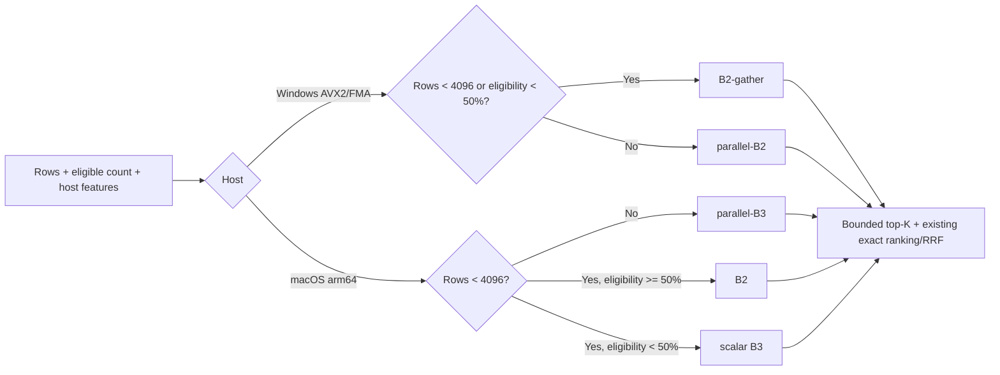

# Rust vector optimization bakeoff 2 — cross-host decision report

**Date:** 2026-08-02
**Decision:** implement host-specific in-process vector kernels; do not adopt an external vector backend.
**Mac evidence:** `bench/vector-backend-bakeoff@ca62694`
**Windows evidence:** local/unpushed `bench/vector-backend-bakeoff@f20f5ab`, based on `0b81870`

## Executive finding

Second bakeoff found a material same-store optimization on every N12 + 100K cell on both hosts. Winner differs by host:

- **Mac:** `parallel-B3` wins 10/12 crossover cells. `B2-gather` wins N12×1%; B2 wins 100K×100%.
- **Windows:** `parallel-B2` wins all ≥50% cells; `B2-gather` wins all ≤25% cells.
- Every winning cell beats A. Improvement ranges from 20.2% to 85.0% p95.
- B3-SIMD is not a production winner on either host. Mac parallel-B2 is also rejected.

Recommended first implementation ships fewer arms than benchmark maximum:

A remains fallback for unsupported CPU features, index-build failure, dimension mismatch, or kill-switch activation.

## Evidence & comparability

Mac ran 13 measurement cells: N0×100% plus selectivity {100, 50, 25, 10, 5, 1}% at N12 + 100K. Windows ran the shared 12-cell N12/100K grid.

Windows canonical crossover config is `config/crossover-v1.json`, SHA-256 `0abb7ef1…`. Mac config `d234bb6b…` contains the same 12 cells plus smoke + N0. Shared cell definitions are byte-equivalent after removing those two extras. Direct bundle validation confirmed fixture SHA equality 12/12 across hosts.

Directly checked from transferred crossover bundles:

- 12 Windows bundles; seven arms; 8,400 measurements.
- Every target present.
- B3, parallel-B3 + B3-SIMD have exact ordered A candidate parity.
- B2, parallel-B2 + B2-gather have overlap ≥127/128; observed metadata reports 128/128.
- Mac shared bundles passed the same gates; full Mac lane contains 9,100 measurements across 13 cells.

Windows f20 handoff additionally reports 19/19 bundle assertions, seven Rust tests, seven Python tests + Clippy `-D warnings`. Mounted transfer contains current crossover bundles but six older three-arm Round 1 bundles plus stale NOTES/receipt; f20 Round 1 figures below are therefore handoff-attested, while crossover figures are independently recomputed from current JSON.

## Crossover winner matrix

p95 milliseconds; “vs A” is reduction in same-cell p95.

| Scale | Eligibility | Mac winner | Mac p95 | vs A | Windows winner | Windows p95 | vs A |
|---|---:|---|---:|---:|---|---:|---:|
| N12 | 100% | parallel-B3 | 3.965 | 76.3% | parallel-B2 | 3.489 | 71.7% |
| N12 | 50% | parallel-B3 | 2.521 | 70.2% | parallel-B2 | 2.916 | 69.6% |
| N12 | 25% | parallel-B3 | 1.205 | 73.4% | B2-gather | 1.413 | 65.1% |
| N12 | 10% | parallel-B3 | 0.565 | 72.3% | B2-gather | 0.516 | 62.6% |
| N12 | 5% | parallel-B3 | 0.419 | 60.5% | B2-gather | 0.591 | 46.4% |
| N12 | 1% | B2-gather | 0.149 | 41.1% | B2-gather | 0.222 | 20.2% |
| 100K | 100% | B2 | 15.347 | 85.0% | parallel-B2 | 10.532 | 73.9% |
| 100K | 50% | parallel-B3 | 7.661 | 73.9% | parallel-B2 | 8.942 | 68.4% |
| 100K | 25% | parallel-B3 | 4.755 | 72.8% | B2-gather | 6.675 | 54.5% |
| 100K | 10% | parallel-B3 | 2.616 | 55.2% | B2-gather | 2.836 | 49.8% |
| 100K | 5% | parallel-B3 | 1.231 | 61.8% | B2-gather | 1.433 | 62.2% |
| 100K | 1% | parallel-B3 | 0.428 | 54.0% | B2-gather | 0.467 | 68.0% |

Winner identity is stable across both scales on Windows: crossover lies between 25% + 50%, supporting a conservative 50% switch. Mac is dominated by parallel-B3, with two isolated exceptions.

## N0 + Round 1 confirmation

Mac N0×100% spot: A 1.372, B2 0.211, B2-gather 0.504, parallel-B2 0.372, B3 1.113, B3-SIMD 2.268 + parallel-B3 0.471 ms. Pool overhead stayed below 1 ms. Existing Mac N0×10% corrected lane had B3 0.144 vs A 0.210 ms.

Windows f20 handoff confirms selected-arm gains outside crossover bundles:

| Cell | A p95 | Winning arm | Winner p95 | Reduction |
|---|---:|---|---:|---:|
| N0×100% | 0.79 | B2-gather | 0.21 | 73% |
| N0×10% | 0.15 | B2-gather | 0.03 | 80% |
| N12×100% | 17.67 | parallel-B2 | 3.02 | 83% |
| N12×10% | 1.31 | B2-gather | 1.00 | 24% |
| 100K×100% | 50.76 | parallel-B2 | 9.50 | 81% |
| 100K×10% | 5.21 | B2-gather | 2.19 | 58% |

## Arm disposition

| Arm | Mac | Windows | Decision |
|---|---|---|---|
| A | fallback | fallback | Keep as reference + kill-switch path. |
| B2 | best at N0×100% + 100K×100% | improved but superseded by parallel-B2/gather | Ship only for small Mac high-eligibility scans. |
| parallel-B2 | never wins crossover | wins all ≥50% grid cells | Ship Windows only. |
| B2-gather | wins only N12×1%; absolute gain over parallel-B3 is 0.097 ms | wins all ≤25% cells + N0 endpoints | Ship Windows; defer Mac. |
| B3 | useful small-corpus Mac path | not a dispatch winner | Ship scalar Mac small-corpus path + common fallback. |
| parallel-B3 | wins 10/12 Mac cells | never wins | Ship Mac only. |
| B3-SIMD | slower than scalar/parallel B3 | never wins despite VNNI/AVX2 parity | Reject from production; retain benchmark/tests. |

Mac’s performance-max policy would add B2 at 100K×~90%+ + B2-gather around N12×1%. Recommended v1 omits both large-corpus exceptions: parallel-B3 is only 2.454 ms slower than B2 at 100K×100%, while avoiding a second large resident matrix; N12×1% exception saves only 0.097 ms.

## Resident-memory consequence

Approximate contiguous scoring-buffer size at 768 dimensions, excluding existing entry/object overhead:

| Rows | f32 matrix | i8 matrix | Both |
|---:|---:|---:|---:|
| 2,361 | 6.92 MiB | 1.73 MiB | 8.65 MiB |
| 30,549 | 89.50 MiB | 22.37 MiB | 111.87 MiB |
| 100,000 | 292.97 MiB | 73.24 MiB | 366.21 MiB |

This is why Mac v1 should keep one large i8 index rather than chase two isolated f32 wins. Windows winners share one f32 layout, so its two-arm dispatch adds no second matrix. Production index ownership should eventually replace per-entry vector duplication rather than permanently add another full copy.

## Implementation contract

Implement after benchmark lineages converge; do not copy benchmark `main.rs` wholesale.

1. **Converge evidence source.** Make f20 visible to Mac/Fable through push or Git bundle. Reconcile f20 + ca62694 on current primary branch. Keep `0abb7ef1…` as canonical 12-cell crossover config; keep smoke/N0 in a separate config.
2. **Unify exact B3 semantics.** Windows evolved B3-family arms to 32× prefilter (`4096` at topK 128) + exact dequantized rerank after direct integer ranking missed 1/128 candidates. Port this common finalizer first, then rerun selected Mac cells because ca62694’s parallel-B3 predates that exact-rerank shape.
3. **Add a resident index projection.** Create a focused `vector_index` module under post-migration `crypt-core` with stable row IDs, scope IDs, inverse norms, generation/version + either contiguous f32 or resident i8 storage. Quantize/build once on load or mutation, never per query.
4. **Extract selected kernels only.** Use native Accelerate on Mac B2, scalar/parallel i8 on Mac B3, runtime-gated AVX2/FMA on Windows B2, scalar fallback everywhere. Use a dedicated bounded Rayon pool; default to available host parallelism, expose a diagnostic override, never hardcode Dell’s 20 threads.
5. **Dispatch from measured inputs.** Compute `eligible_count` before scoring. Windows: gather when rows <4096; otherwise parallel-B2 at eligibility ≥50% + gather below. Mac: below 4096 rows use B2 at ≥50% + scalar B3 below; at/above 4096 use parallel-B3.
6. **Integrate behind current retrieval API.** Replace per-query `QuantizedVector::quantize(emb)` inside `MemoryRetriever::retrieve_hybrid_quantized`; preserve lexical ranking, RRF constant, stored-score nudge, stable tie break + returned entry semantics.
7. **Feature flag + telemetry.** Add `vector_dispatch_v2` with backend, rows, eligible count, build generation, candidate count, kernel + elapsed time. Keep A selectable instantly. Shadow-sample A parity before default-on.

## Required tests + acceptance gates

- Unit parity for scalar tails + dimensions 1, 8, 13, 16, 37 + 768.
- Registry insert/update/delete/reload tests proving resident-index generation + row mapping.
- Dispatch boundary tests at rows 4095/4096 + eligibility 49%/50%.
- B3-family exact ordered A parity after common 32× rerank.
- B2-family target present + overlap ≥127/128; expected observed result remains 128/128.
- Full 12-cell run on both hosts from one merged source/config; fixture SHA parity 12/12.
- N0 spot + concurrent-query test to expose Rayon oversubscription.
- Material gate: ≥25% p95 reduction against A at N12 for selected production cells, no >10% p95 regression in any dispatch cell, 100% target presence.
- Memory gate: measured resident bytes within table-derived budget; no per-query matrix/quantization allocation proportional to all rows.

## Rollout order

1. Merge benchmark lineages + run four-cell Mac confirmation: N12×{100,10,1}% + 100K×100% with unified exact rerank.
2. Implement resident index + scalar reference finalizer; verify lifecycle tests.
3. Land Windows parallel-B2/gather dispatch; run full Windows matrix.
4. Land Mac B2/B3/parallel-B3 dispatch; run full Mac matrix.
5. Enable shadow parity at 1% of local queries, then default-on after zero parity/target failures.
6. Retain A kill switch; remove rejected production rungs, not benchmark evidence.

## Deferred

- GPU/ANE, sgemm batching + i8-GEMM dependency: workload semantics or dependency cost changed; no winning evidence.
- B3-SIMD/VNNI/NEON production path: parity passed, performance did not.
- External vector DB/ANN migration: same-store kernels now clear material gate without storage/ranking migration.
- Threshold auto-tuning: two stable host rules are sufficient; revisit only after real-corpus telemetry contradicts them.

## Decision requested from Fable

Approve minimal production set + sequence:

- Windows: B2-gather + parallel-B2 at 50% switch.
- Mac: B2/B3 below 4,096 rows; parallel-B3 above.
- Common 32× exact-rerank finalizer before production integration.
- One merged-source cross-host rerun as implementation gate, followed by feature-flagged rollout.
