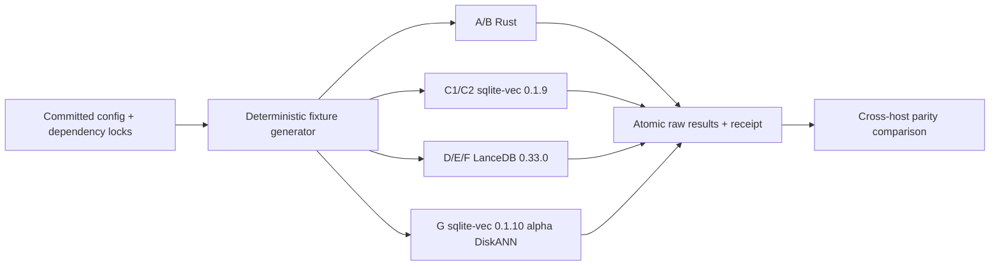

# Vector Backend Bake-off Harness

Goal: Make macOS and Windows execute the same sealed MemRight vector-backend workload from one commit, with drift detected before timings are accepted.

Architecture: A standalone benchmark suite under `engine/vector-bakeoff/` owns deterministic fixture generation, backend runners, orchestration, receipts, and result validation. Production MemRight remains untouched; each runner generates identical canonical rows from committed config, verifies fixture hashes, times only backend work, and writes atomic per-cell JSONL plus a host receipt.

Visual Plan:

Tech Stack: Rust 1.91+; Python 3.9+ stdlib orchestration; pinned `sqlite-vec` 0.1.9 and official 0.1.10-alpha.4 tag commit `04d28bd`; pinned LanceDB 0.33.0; pinned cross-platform vendored `protoc`; SHA-256 receipts; JSON artifacts.

GoalRoute artifact: `docs/plans/2026-08-01-vector-backend-bakeoff-harness.route.json`

GoalRoute receipt: `docs/plans/2026-08-01-vector-backend-bakeoff-harness.route.receipt.json`

Selected route: `R_ISOLATED_RUNNERS`

Expected time to verified B: 9,270,000 ms

Route revision: 3

## Current map

- Production recall hydrates quantized vectors into full `Vec<f32>` values and clones per-scope registries in `engine/crates/memright/src/store.rs`.
- MemRight already validates immutable synthetic fixture hashes in `engine/crates/memright/tests/p2_frozen_corpus.rs`.
- No vector-backend benchmark package or backend abstraction exists.
- Primary Membrane checkout contains unrelated user changes; new benchmark paths and clean Cargo files are isolated for exact staging.
- Blueprint generation `xxh128:7368c5cfa5f988a0783b2b12e43267d0` is fresh on the observed overlay; doctor is degraded by missing document references, not graph freshness.
- Canonical aggregate snapshot on 2026-08-01: N0=2,361; July ingestion=2,349 rows/month; N6=16,455; N12=30,549; N24=58,737.

## ADR

Product outcome: One Mac command and one Windows command run byte-identical workload definitions and reject config, fixture, dependency, or harness drift before publishing results.

Non-goals: Production backend adoption, production prompt-path changes, committing private memory content or embeddings, Stage 3 live A/B, and claiming benchmark conclusions from smoke data.

Context: Stable and alpha sqlite-vec releases export the same native extension symbol and must not share one linked binary. Lance index training can be nondeterministic, so cross-host equality applies to committed inputs and exact-ground-truth quality, while each host records its derived index identity.

Decision: Use one shared deterministic Rust fixture/contract crate, four isolated runner packages with independent committed locks, and one Python stdlib orchestrator that validates all hashes and serializes arms per host.

Alternatives:

1. Add all dependencies to production workspace: rejected because benchmark dependencies and native symbol collisions would affect normal builds.
2. One binary with all arms: rejected because sqlite-vec stable and alpha cannot safely coexist in one native link graph.
3. Python implementations for every backend: rejected because Arm A/B must measure Rust behavior and language-binding overhead would distort comparison.

Riskiest assumption: Deterministic fixture generation produces identical canonical byte streams on x86-64 Windows and Apple Silicon macOS.

Smallest test: Generate the committed smoke fixture independently through every runner and require the same SHA-256 before any timed query.

Blast radius: New standalone benchmark directory, committed benchmark locks, benchmark documentation, and no production workspace member or runtime code.

Reversibility: Delete `engine/vector-bakeoff/` and this plan; production behavior and dependency graph remain unchanged.

Hidden coupling:

- Every runner must decode the same canonical row bytes and use cosine distance consistently.
- Arm C uses stable sqlite-vec 0.1.9; Arm G uses alpha 0.1.10-alpha.4 and is never production-eligible.
- Timing excludes fixture generation, JSON serialization, process startup, and result writes unless the metric explicitly names build/open/startup.
- Full Round 1 is serialized within each host; Windows and macOS may execute simultaneously.
- The crates.io 0.1.10-alpha.4 package omits `sqlite-vec-diskann.c` and its official tag is not Cargo-rooted; Arm G build script fetches exact commit `04d28bd`, verifies HEAD and required files, then compiles official C sources in Cargo `OUT_DIR` without patching or vendoring third-party code.
- Lance 0.33 requires `protoc`; a standalone locked resolver selects `protoc-bin-vendored` 3.2.0 for each host and passes its path only to Lance builds.

## Minimize decision

Selected rung: `MIN_CUSTOM`.

- Reuse: existing fixture hash pattern and MemRight quantization semantics.
- Standard library: Python orchestration, atomic writes, process timeouts, host fingerprinting, and SHA validation.
- Installed/native: Cargo locks and Rust toolchain.
- Custom code: only backend contract, deterministic generator, isolated runners, and result validator required by approved experiment.

Allowed new dependencies: exact benchmark-only pins listed above plus their locked transitive graphs.

## File map

| Path | Responsibility |
|---|---|
| `engine/vector-bakeoff/README.md` | Exact Mac/Windows setup, smoke, Round 1, resume, and compare commands |
| `engine/vector-bakeoff/.gitattributes` | LF-normalized checkout bytes across both hosts |
| `engine/vector-bakeoff/config/round1-v1.json` | Frozen matrix, thresholds, seed, measured forecast, dependency identities |
| `engine/vector-bakeoff/fixtures/smoke-v1.manifest.json` | Expected canonical smoke hashes |
| `engine/vector-bakeoff/harness.py` | Preflight, sequential runner dispatch, resume ledger, atomic receipts, cross-host comparison |
| `engine/vector-bakeoff/run.sh` | Hidden/noninteractive Mac entrypoint |
| `engine/vector-bakeoff/run.ps1` | Hidden/noninteractive Windows entrypoint |
| `engine/vector-bakeoff/protoc/*` | Cross-platform pinned `protoc` resolver used by Lance builds |
| `engine/vector-bakeoff/common/*` | Shared data contract, deterministic generator, exact scoring, metrics, result schema, tests |
| `engine/vector-bakeoff/control/*` | Arms A/B runner |
| `engine/vector-bakeoff/sqlite-stable/*` | Arms C1/C2 runner pinned to sqlite-vec 0.1.9 |
| `engine/vector-bakeoff/lance/*` | Arms D/E/F runner pinned to LanceDB 0.33.0 |
| `engine/vector-bakeoff/sqlite-alpha/*` | Arm G isolated runner pinned to sqlite-vec 0.1.10-alpha.4 |
| `docs/plans/2026-08-01-vector-backend-bakeoff-harness.*` | Accepted design, minimize authority, and GoalRoute receipts |

## TDD tasks

### 1. RED/GREEN: deterministic fixture contract

- Add shared tests for repeatability, shape/selectivity coverage, canonical byte encoding, known-target construction, and expected smoke SHA.
- Run `cargo test --manifest-path engine/vector-bakeoff/common/Cargo.toml --locked`.
- Expected: all fixture contract tests pass on Mac and Windows.

### 2. RED/GREEN: control semantics

- Add parity tests for A vs B candidate IDs, cosine tolerance, filtering, bounded top-N, and safety-zero exclusions.
- Run `cargo test --manifest-path engine/vector-bakeoff/control/Cargo.toml --locked`.
- Expected: A/B exact parity for every smoke query.

### 3. RED/GREEN: stable sqlite-vec semantics

- Register pinned extension on every connection, build metadata-filtered and scope-partitioned projections, and verify candidate parity against exact ground truth.
- Run `cargo test --manifest-path engine/vector-bakeoff/sqlite-stable/Cargo.toml --locked`.
- Expected: C1/C2 pass fixture/hash/filter/parity tests.

### 4. RED/GREEN: LanceDB semantics

- Build exact flat, IVF_HNSW_FLAT, and IVF_PQ projections; require cosine distance and prefiltering; emit index configuration and derived identity.
- Run `cargo test --manifest-path engine/vector-bakeoff/lance/Cargo.toml --locked`.
- Expected: D exact parity; E/F report measured Recall@128 and never bypass revalidation.

### 5. RED/GREEN: isolated DiskANN semantics

- Build G only in alpha package; label every receipt research-only and production-ineligible.
- Run `cargo test --manifest-path engine/vector-bakeoff/sqlite-alpha/Cargo.toml --locked`.
- Expected: alpha identity and disposition ceiling are enforced.

### 6. RED/GREEN: orchestration and receipts

- Test preflight drift rejection, timeout, resume, atomic output, failed-cell preservation, and cross-host comparison with fake runners.
- Run `python3 -m unittest engine/vector-bakeoff/tests/test_harness.py`.
- Expected: deterministic failure classes and idempotent resume.

### 7. Mac smoke and delivery

- Run `engine/vector-bakeoff/run.sh smoke` on 256 rows and five queries across all arms.
- Assert one fixture hash across runners, all exact arms match ground truth, ANN metrics are present, result files parse, and no production files/database changed.
- Commit exact benchmark paths in Membrane; push Membrane main; commit only Membrane gitlink plus this workspace task’s plan movement in root; push root main; verify both remote SHAs.

### Critical Files for Implementation

- `engine/vector-bakeoff/common/src/lib.rs`
- `engine/vector-bakeoff/harness.py`
- `engine/vector-bakeoff/config/round1-v1.json`
- `engine/vector-bakeoff/lance/src/main.rs`
- `engine/vector-bakeoff/sqlite-stable/src/main.rs`
