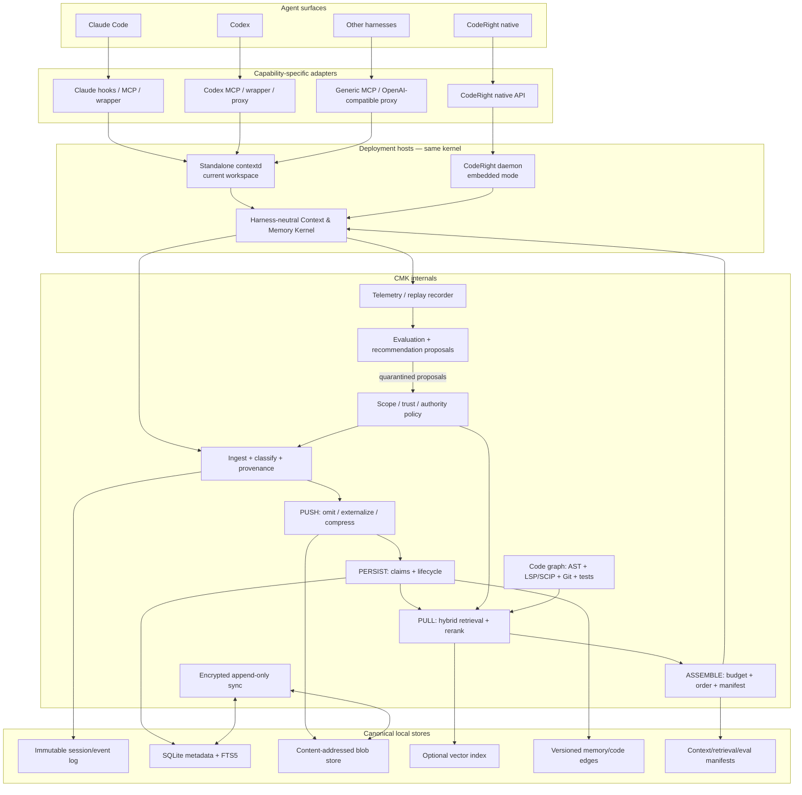

# Context & Memory Kernel (CMK)

## Research-backed architecture and implementation plan

**Research cutoff:** 24 July 2026, inclusive
**Prepared:** 25 July 2026
**Primary deployment:** standalone local workspace service for Claude Code, Codex, and other agent harnesses; the same kernel embeds natively into CodeRight’s Rust/Axum daemon
**Status:** Implementation blueprint, not a claim that the described system is already built

**Scope clarification:** CodeRight is a first-class native host, not a prerequisite. The system must work in an existing Claude Code + Codex workspace before CodeRight integration is complete.

---

## 0. Executive decision

Build a **harness-neutral local Context & Memory Kernel** with two equally supported deployment modes:

1. **Standalone workspace mode:** a local `contextd` daemon and `contextctl` CLI used directly by Claude Code, Codex, and other harnesses in the user’s current workspace. This mode has no CodeRight runtime dependency.
2. **CodeRight-embedded mode:** the same kernel library, schemas, policies, and stores hosted inside the CodeRight daemon for full native control.

The kernel—not Claude Code, Codex, CodeRight’s UI, an MCP server, a provider proxy, a vector database, `CLAUDE.md`, or `AGENTS.md`—is the canonical owner of context state and durable memory. MCP, hooks, wrappers, proxies, native calls, and instruction-file exports are capability-specific adapters. In standalone mode `contextd` owns the canonical local store; in embedded mode the CodeRight daemon hosts the identical storage and policy interfaces.

The user’s three pillars are correct but incomplete:

1. **PUSH — Compact, filter, and externalize before context.**
2. **PULL — Retrieve the best evidence for the current state and task.**
3. **PERSIST — Curate, consolidate, version, invalidate, and forget.**
4. **ASSEMBLE — Allocate a token budget, order the selected material, preserve cache-compatible prefixes, and reserve output/reasoning capacity.**

Two cross-cutting planes are mandatory:

5. **OBSERVE / EVALUATE / IMPROVE — Measure task outcomes, tokens, cost, latency, retrieval utility, compaction regret, and proposal impact.**
6. **GOVERN / PROTECT / PROVENANCE — Enforce scope, trust, authority, privacy, security, auditability, and human approval.**

The system’s optimization target should be:

> **Minimize quality-preserving billed tokens, latency, and repeated work per successful task—not raw compression percentage.**

A compressor that removes 70% of the prompt but causes one extra repository traversal, failed test cycle, or wrong code edit is worse than a 20% compressor that preserves the decisive evidence. Research now consistently shows that longer context can degrade performance even when the relevant evidence is present; simply fitting more into the window is not a valid objective.[^context-length-hurts] Context position also matters, so selection and ordering are part of context management, not formatting details.[^lost-middle][^attention-basin]

### Recommended first production architecture

- **First deployment:** standalone `contextd` sidecar for the current Claude Code + Codex workspace; CodeRight embeds the same crates rather than reimplementing them.
- **Canonical store:** SQLite metadata + FTS5 + content-addressed blob files.
- **Canonical history:** immutable event log and exact raw artifacts.
- **Derived state:** versioned memory claims, summaries, code graph, retrieval indexes.
- **First retrieval baseline:** lexical/FTS5 + temporal + scope + authority.
- **Second retrieval stage:** optional dense embeddings, graph traversal, cross-encoder reranking.
- **Code intelligence:** Tree-sitter for syntax boundaries; LSP/SCIP/compiler indexes for definitions, references, types, and calls; Git and test evidence for change semantics.
- **Context assembly:** deterministic, provider-aware, tiered, budget-constrained, and fully manifested.
- **Compaction:** archive first, fail closed, structured packet, reversible raw references, live-zone only where possible.
- **Improvement:** proposal-only. The system may analyze and recommend; it must not silently change memory policy, instructions, skills, routing, or harness rules.
- **Multi-device:** append-only encrypted operation log and content-addressed blobs; never synchronize live SQLite database or WAL files.
- **External harnesses:** capabilities declared explicitly. Claude Code and Codex are first-class standalone clients, but MCP-only integration cannot provide the same enforcement as hook-, wrapper-, proxy-, SDK-, or native-level integration.

### Initial launch gates

The first generally enabled release should meet all of the following on representative replay suites from Claude Code, Codex, and CodeRight native sessions where available:

- No statistically significant reduction in task success versus the current system; recommended non-inferiority margin: **1 percentage point at 95% confidence**.
- For full-control native/wrapper/proxy/SDK integrations, at least **20% median reduction in measured billed input tokens per successful task** on long sessions; retrieval-only adapters use task utility and avoided re-read metrics until pre-send control exists.
- No increase greater than **5% in median tool calls or wall-clock task time**.
- **Zero unauthorized cross-scope retrievals** in deterministic security tests.
- Every compacted byte remains recoverable through an integrity-checked archive or content reference.
- Every supported call or session has a capability-declared **context manifest**; full-control integrations explain every included, omitted, compressed, retrieved, and ordered item, while reduced-capability adapters mark unobservable fields as unknown.
- Every behavior-changing recommendation requires explicit human approval and a versioned rollback path.

These are design targets, not industry-standard thresholds. The operator should revise them after collecting multi-harness baselines on real workloads.

---

## 1. Evidence policy and research method

This plan prioritizes sources in the following order:

- **[Peer-reviewed]** ACL, Findings of ACL, EACL, EMNLP, ICML, and equivalent proceedings.
- **[Preprint]** arXiv work available by 24 July 2026; treated as promising but not settled.
- **[Official engineering]** OpenAI, Anthropic, and OpenTelemetry engineering or specification material.
- **[Project/vendor documentation]** Product repositories and benchmark claims; claims are explicitly labeled vendor-reported unless independently reproduced.
- **[Internal repository]** CodeRight source files inspected in `bogusyogi/coderight`.

No source first published after **2026-07-24** is used as evidence. Papers and product claims are not treated as interchangeable: peer-reviewed findings shape architecture; vendor reports identify useful implementation patterns; internal CodeRight code determines the migration path.

The newest directly relevant source included is the 23 July 2026 *Agentic Context Management* preprint. It supports the lifecycle framing—architecting, ingesting, scoping, anticipating, compacting, and consolidating—but its reference-implementation benchmark is author-reported and is not used as proof of expected CMK performance.[^agentic-context-management]

### Evidence-derived conclusions

| Finding | Design consequence |
|---|---|
| More context can reduce performance even with perfect retrieval.[^context-length-hurts] | Treat context as a scarce budget. Do not optimize for window occupancy. |
| Models often underuse evidence placed in the middle.[^lost-middle][^attention-basin] | Make ordering explicit; keep stable rules early and active constraints/evidence ledger near the current request. |
| Realistic noisy contexts are harder than synthetic needle tests.[^cub] | Evaluate on complete agent traces and repository tasks, not only synthetic compression benchmarks. |
| Long-horizon agents benefit from a structured workspace containing stable task semantics, condensed long-term state, and high-fidelity recent history.[^cat] | Maintain distinct context tiers instead of one rolling summary. |
| Active context editing can outperform passive threshold-based compaction.[^arc][^memact] | Let the kernel trigger milestone-aware compaction and expose explicit context actions, while retaining deterministic safety gates. |
| File-centric external state and a small recent window can support very long horizons.[^infiagent] | Externalize raw artifacts and make exact retrieval cheap. |
| Dependency-aware memory should preserve the active reasoning backbone and fold completed branches.[^memobrain] | Track dependencies, completion state, invalidated steps, and active frontier. |
| Retrieval needs to match current state and intent, not only semantic similarity.[^samem][^stitch] | Add goal, action type, repository state, branch, and phase to retrieval features. |
| Temporal and semantic hierarchies, graph provenance, and adaptive retrieval improve long-term recall.[^apexmem][^timem][^higmem][^memorai][^hmem] | Use immutable claims with temporal validity, graph edges, and hierarchical anchors. |
| Code retrieval improves when structure and repository relationships guide selection.[^codemem][^codestruct][^reposhapley][^repodistill] | Build a code graph from AST + semantic indexes + Git/test evidence; do not rely on vector chunks alone. |
| Tool schemas and raw tool results can consume a large fraction of context.[^mcp-code-execution][^tool-schema-compression] | Use stable tool bundles, progressive disclosure, typed reduction, and externalized results. |
| Prompt-cache eligibility depends on exact prefix stability and deterministic tool ordering.[^codex-loop] | Make cache compatibility an assembler responsibility and log every prefix break. |
| Agent scaffolding changes can materially change coding quality even with the model fixed.[^scaffolding-evolution] | Version every context policy/harness release and run the same eval suite before attribution to the model. |
| A durable event log with stateless harnesses improves recoverability and scale.[^managed-agents] | Keep sessions reconstructable from external state; execution environments and harness processes remain disposable. |
| Generator and evaluator separation is more reliable than self-grading.[^anthropic-harness] | Separate recommendation generation, evaluation, approval, and deployment. |
| Agent evals must measure outcomes, transcripts, tokens, latency, cost, and variability.[^anthropic-evals] | Build replayable evals before adaptive policies. |
| Persistent state is a prompt-injection and memory-poisoning surface.[^anthropic-containment] | Authority-gate retrieval, quarantine writes, scan untrusted content, and preserve provenance. |

---

## 2. The six-plane model

### 2.1 PUSH — compact, filter, externalize

PUSH decides what should not enter the prompt verbatim.

Order of preference:

1. **Do not include it.**
2. **Externalize it and provide a stable reference.**
3. **Apply deterministic typed reduction.**
4. **Extract a structured state or fact representation.**
5. **Use abstractive summarization only when the first four are insufficient.**

This ordering matters. Deterministic omission or externalization is cheaper to validate than generative summarization, and exact raw evidence remains recoverable.

### 2.2 PULL — retrieve, expand, and reject

PULL does not mean “vector-search top-k.” It means:

- classify the present information need;
- apply authority, scope, privacy, and validity filters;
- gather lexical, semantic, graph, temporal, active-state, and code-structure candidates;
- fuse and rerank;
- reject low-confidence candidates;
- expand only the winning evidence nucleus;
- fit the result to a token budget;
- explain why each item was returned.

### 2.3 PERSIST — curate, consolidate, version, invalidate, forget

PERSIST owns memory lifecycle:

- immutable evidence;
- versioned derived claims;
- conflicts and supersession;
- promotion from ephemeral state to durable memory;
- expiry and invalidation;
- deduplication and consolidation;
- human review for behavior-changing knowledge;
- retention, export, deletion, and sync.

“Remember everything” is not persistence. It is unmanaged accumulation.

### 2.4 ASSEMBLE — budget, order, stage, and cache-align

ASSEMBLE turns candidates into the actual model input. It owns:

- token accounting by active model and provider;
- hard and soft context limits;
- output/reasoning reserve;
- context tiers;
- ordering and position;
- stable prefix hashing;
- deterministic tool-schema order;
- per-item marginal utility;
- diversity and redundancy control;
- context reset/handoff decisions;
- complete run manifests.

### 2.5 OBSERVE / EVALUATE / IMPROVE

This plane proves whether the system helps:

- OpenTelemetry spans and metrics;
- context and retrieval manifests;
- replayable controlled experiments;
- task-outcome grading;
- token, cost, latency, and cache measurement;
- compaction-regret analysis;
- recommendation generation;
- human review;
- canary comparison and rollback.

### 2.6 GOVERN / PROTECT / PROVENANCE

This plane prevents a useful memory system from becoming a durable attack system:

- scope and ACL enforcement before ranking;
- trust and authority labels;
- source lineage;
- prompt-injection and secret scanning;
- immutable audit events;
- per-device identity;
- encrypted synchronization;
- explicit user control over promotion, export, sync, and deletion;
- no implicit trust elevation for sub-agent output.

---

## 3. Deployment model and CodeRight current-state assessment

The architecture is **host-independent**. CodeRight is unusually well positioned to host it natively because its daemon already owns sessions, event persistence, tool execution, permissions, provider calls, orchestration, usage accounting, and learning proposals. That advantage must not turn into a runtime dependency for Claude Code or Codex.

### 3.1 Two first-class deployment modes

| Mode | Runtime host | Primary users | Control level | CodeRight required? |
|---|---|---|---|---:|
| **Standalone workspace** | local `contextd` daemon + `contextctl` | Claude Code, Codex, Cursor/Aider/other harnesses | Retrieval/persistence always; PUSH/assembly enforcement depends on hooks, wrappers, proxy, or SDK access | **No** |
| **CodeRight embedded** | CodeRight Rust/Axum daemon | CodeRight native sessions and orchestrated workers | Full ingest, tool-result reduction, assembly, compaction, telemetry, and policy enforcement | Yes, for this mode only |

Both modes use the same `ContextItem` schema, scope lattice, provenance model, memory lifecycle, content-addressed blobs, context manifests, sync operations, and evaluation protocol. A memory created through Claude Code can be retrieved in Codex or CodeRight only when scope, authority, trust, and sync policy permit it. Harness-specific observations remain harness-scoped by default.

The standalone service should be installable and operable independently:

```text
context-kernel/
├── crates/
│   ├── kernel/
│   ├── storage/
│   ├── retrieval/
│   ├── telemetry/
│   └── adapters/
├── bins/
│   ├── contextd/       # local daemon/service
│   └── contextctl/     # inspect, import, export, doctor, eval
└── adapters/
    ├── claude-code/
    ├── codex/
    ├── mcp/
    ├── hooks/
    └── provider-proxy/
```

For an initial implementation inside the CodeRight repository, these can live as strict leaf crates and a separate `contextd` binary. Dependency direction must allow extraction or independent packaging: `contextd` and CodeRight both depend on the kernel; the kernel never depends on CodeRight’s session engine or UI.

### 3.2 Existing CodeRight primitives to retain

| Existing capability | Internal evidence | Decision |
|---|---|---|
| Rust/Axum daemon is the source of truth for CodeRight sessions, tools, storage, orchestration, and runtime evidence. | `README.md`; `docs/ARCHITECTURE.md` | Embed CMK in the daemon for native mode; do not make the UI or an MCP adapter canonical. |
| SQLite event, task, artifact, memory, benchmark, goal, and FTS5 stores. | `engine/crates/storage/src/migrations.rs` | Migrate additively to a richer memory and context schema. |
| Basic `MemoryRow` with tier/content/score/meta. | `engine/crates/storage/src/memory.rs` | Replace as the canonical API; preserve through migration/import. |
| Fail-closed authoritative compaction. | `engine/crates/engine/src/compactor_authoritative.rs` | Keep as the mutation safety contract. |
| Exact pre-compaction transcript archive with SHA-256 integrity. | `engine/crates/storage/src/compaction_archives.rs` | Generalize into a content-addressed raw evidence layer. |
| Token-budget and LLM summarizers, breaker, output reservation, memory-block reinjection. | `engine/crates/engine/src/compactor.rs` | Route through CMK policy and context manifests. |
| Identical file-read deduplication. | `engine/crates/engine/src/read_cache.rs` | Generalize to content-addressed observations across sessions. |
| Large tool-result externalization with preview and reference. | `engine/crates/engine/src/tool_result_store.rs` | Promote to shared blob/reference service with typed previews. |
| Prompt/completion/cache token and known/unknown pricing accounting. | `engine/crates/engine/src/usage.rs` | Extend to per-context-tier and per-policy attribution. |
| Metadata-only OpenTelemetry allowlist. | `engine/crates/telemetry/src/otel.rs` | Retain as default; add context metrics without content leakage. |
| Restricted self-review producing quarantined proposals. | `engine/crates/engine/src/self_review.rs` | Keep proposal-only boundary; expand evidence and eval gates. |
| Learning analyzer, evaluator, regression detector, skill optimization, proposal lifecycle. | `engine/crates/learning/src/lib.rs` | Use as the human-in-the-loop recommendation plane. |
| Separate cache primitives and stable prefix tracking. | `engine/crates/cache`; `engine/crates/engine/src/cache.rs` | Make prefix manifests and cache-break reasons first-class. |
| Existing `skeletonization` and `router` crates. | `engine/Cargo.toml` | Reuse for code reduction and policy routing after evaluation. |

### 3.3 Primary gaps

1. **No canonical context item model.** Transcript messages, memories, tool outputs, summaries, artifacts, code, and instructions do not share a common representation or provenance contract.
2. **No per-call context manifest.** CodeRight cannot yet reconstruct why a particular model call contained a particular item in a particular position.
3. **Memory retrieval is score-sorted storage, not a retrieval system.** There is no hybrid recall, reranking, scope lattice, temporal resolution, conflict handling, or abstention.
4. **Memory lifecycle is under-specified.** There is no explicit promotion, supersession, contradiction, expiry, validity interval, access history, or curation policy.
5. **Compaction quality is not tied to downstream task outcomes.** Existing archives make this measurable, but the eval loop is not unified.
6. **Code context is not represented as a versioned semantic graph.** AST boundaries, LSP/SCIP references, Git changes, tests, and runtime evidence are not fused.
7. **Cross-harness and cross-machine semantics are not canonical.** There is no operation-log sync, device identity, harness namespace, or conflict protocol.
8. **Telemetry does not yet expose context utility.** Tokens and cache use exist, but not selection decisions, retrieval contribution, compression regret, or policy comparison.
9. **Self-review can propose learning, but recommendations are not linked to counterfactual replays and acceptance criteria.**
10. **Security labels exist around tool content and artifacts, but durable memory authority and poisoning defenses need their own policy layer.**

### 3.4 CodeRight embedding decision

For CodeRight-native hosting, add a leaf workspace crate and a standalone host binary:

```text
engine/crates/context_kernel/
├── src/
│   ├── lib.rs
│   ├── item.rs
│   ├── scope.rs
│   ├── provenance.rs
│   ├── trust.rs
│   ├── budget.rs
│   ├── assembly.rs
│   ├── ingest.rs
│   ├── externalize.rs
│   ├── compression/
│   ├── retrieval/
│   ├── ranking/
│   ├── memory/
│   ├── curation/
│   ├── code_graph/
│   ├── sync/
│   ├── telemetry/
│   ├── eval/
│   └── adapters/
```

Add `engine/bins/contextd` (or a top-level independently packaged equivalent) that depends on the same kernel without depending on `coderight-engine`. The existing CodeRight `engine`, `storage`, `telemetry`, `learning`, `tools`, `providers`, `cache`, `skeletonization`, and `orchestration` crates call into the kernel only through public contracts. Provider- and harness-specific transport remains outside the policy core.

---

## 4. Target architecture



### Architectural invariants

1. **Raw evidence is immutable.**
2. **Derived memory is versioned, not overwritten in place.**
3. **Every context mutation is reversible or fails closed.**
4. **Authority and scope filtering occur before relevance ranking.**
5. **The model never decides its own durable authority.**
6. **Every model call has a context manifest.**
7. **Every adaptive change is a proposal until a human approves it.**
8. **Standalone and CodeRight-embedded hosts use identical schemas and policy semantics; only adapter capabilities differ.**
9. **External adapters may have reduced capability, but never altered semantics or hidden capability gaps.**
10. **Synchronization transports immutable operations, not database pages.**
11. **Content is absent from exported telemetry unless the user explicitly enables a bounded diagnostic capture.**

---

## 5. Canonical data model

### 5.1 `ContextItem`

Everything eligible for a model call becomes a `ContextItem`, whether it originated as a system rule, user request, tool result, memory, code symbol, test failure, web claim, or compaction summary.

```rust
pub struct ContextItem {
    pub id: ContextItemId,                 // ULID
    pub kind: ContextKind,
    pub scope: ScopePath,
    pub content: ContentHandle,            // inline or content-addressed ref
    pub representation: RepresentationKind,
    pub token_estimates: TokenEstimates,   // per tokenizer family/model profile
    pub source: Provenance,
    pub authority: AuthorityLevel,
    pub trust: TrustLabel,
    pub sensitivity: Sensitivity,
    pub validity: ValidityInterval,
    pub lifecycle: LifecycleState,
    pub dependencies: Vec<ContextItemId>,
    pub supersedes: Vec<ContextItemId>,
    pub contradicts: Vec<ContextItemId>,
    pub retrieval_features: RetrievalFeatures,
    pub content_hash: Sha256Digest,
    pub created_at: HybridTimestamp,
    pub policy_version: PolicyVersion,
}
```

Recommended `ContextKind` values:

```text
system_rule
developer_rule
user_constraint
active_goal
active_plan
decision
open_question
episodic_event
semantic_fact
procedure
preference
negative_memory
code_symbol
code_relationship
repository_state
git_change
test_evidence
runtime_evidence
tool_schema
tool_result
document_excerpt
web_claim
summary_anchor
compaction_packet
artifact_reference
security_warning
```

Recommended `RepresentationKind` values:

```text
verbatim
structured
extractive
skeleton
summary
reference
embedding_only_index_record   # never the only retained source
```

### 5.2 Scope lattice

A memory must not be global merely because it is useful.

```text
user
└── organization/team
    └── workspace/repository
        └── worktree
            └── branch
                └── goal/task
                    └── session
                        └── agent/harness
                            └── run/turn
```

Device is an orthogonal scope:

```text
device-local
sync-group
organization-managed
```

A `ScopePath` should carry explicit dimensions rather than an ambiguous string:

```rust
pub struct ScopePath {
    pub user_id: UserId,
    pub organization_id: Option<OrgId>,
    pub workspace_id: Option<WorkspaceId>,
    pub repository_id: Option<RepoId>,
    pub revision_id: Option<RevisionId>,
    pub worktree_id: Option<WorktreeId>,
    pub branch_id: Option<BranchId>,
    pub goal_id: Option<GoalId>,
    pub session_id: Option<SessionId>,
    pub harness_id: Option<HarnessId>,
    pub agent_role: Option<AgentRole>,
    pub device_policy: DeviceScope,
}
```

Retrieval can move upward or sideways in this lattice only under explicit policy. For example:

- a session may read its repository’s verified build instructions;
- a worker may read parent-task facts explicitly delegated by the conductor;
- a repository task must not read memories from another repository;
- a Claude Code-specific workaround must not become a universal coding rule;
- a machine-specific path or toolchain fact must remain device-local unless normalized.

### 5.3 Provenance and authority

Every durable item should answer:

- Who or what observed it?
- Was it user-authored, deterministically measured, model-inferred, or imported?
- Which tool, harness, model, device, session, repository revision, and event produced it?
- When was it true?
- Which raw evidence supports it?
- Has it been verified?
- Can it influence behavior, or only inform retrieval?

```rust
pub struct Provenance {
    pub source_event_ids: Vec<EventId>,
    pub origin_kind: OriginKind,
    pub origin_principal: PrincipalId,
    pub origin_tool: Option<ToolId>,
    pub harness_id: HarnessId,
    pub model_id: Option<ModelId>,
    pub provider_id: Option<ProviderId>,
    pub device_id: DeviceId,
    pub observed_at: HybridTimestamp,
    pub raw_refs: Vec<ContentRef>,
    pub verifier: Option<VerifierRef>,
}
```

Recommended authority order:

```text
A5  explicit current user instruction / approved policy
A4  repository truth, signed config, deterministic tests, compiler/LSP evidence
A3  deterministic tool observation with intact provenance
A2  human-approved derived memory
A1  agent-inferred or summarized memory
A0  untrusted external/tool/web content
```

Authority is not relevance. An A0 item can be highly semantically similar and still be barred from becoming an instruction.

### 5.4 Immutable evidence and versioned claims

Use two levels:

1. **Evidence records:** exact, immutable observations and artifacts.
2. **Memory claims:** concise, queryable statements derived from one or more evidence records.

Example:

```text
Evidence:
  event: test run at commit abc123
  command: cargo test --workspace
  result: failure in storage::tests::sync_conflict

Claim v1:
  "At commit abc123, workspace tests fail in sync_conflict."
  valid_from = abc123
  valid_to = next verified revision
  authority = A4
  source = event/test artifact

Claim v2:
  "At commit def456, workspace tests pass."
  supersedes = v1
```

Do not rewrite v1. Close its validity interval and add v2. This follows the strongest temporal-memory evidence: append-only history plus query-time resolution handles evolution and contradiction more safely than destructive overwrites.[^apexmem]

### 5.5 Context run manifest

Every provider request gets a manifest:

```rust
pub struct ContextRunManifest {
    pub id: ContextRunId,
    pub session_id: SessionId,
    pub run_id: RunId,
    pub turn_id: TurnId,
    pub model_profile: ModelProfileId,
    pub policy_version: PolicyVersion,
    pub stable_prefix_hash: Sha256Digest,
    pub cache_break_reason: Option<CacheBreakReason>,
    pub input_budget: u32,
    pub output_reserve: u32,
    pub reasoning_reserve: u32,
    pub candidate_tokens: u64,
    pub included_tokens: u64,
    pub included: Vec<ManifestItem>,
    pub omitted: Vec<OmittedItem>,
    pub compression_runs: Vec<CompressionRunId>,
    pub retrieval_runs: Vec<RetrievalRunId>,
    pub ordered_item_ids: Vec<ContextItemId>,
    pub provider_usage: Option<ProviderUsage>,
    pub created_at: HybridTimestamp,
}
```

For each included item, store:

```text
item_id
position/tier
original_tokens
included_tokens
selection score
selection reason
retrieval strategy
authority/trust
raw reference
compression method/version
```

For each omitted item, store a low-cardinality reason:

```text
out_of_scope
untrusted_instruction
expired
superseded
contradicted
duplicate
low_relevance
low_marginal_utility
budget_exhausted
already_externalized
provider_limit
```

This manifest is the foundation for measurement, debugging, replay, and self-improvement.


---

## 6. End-to-end lifecycle

The kernel should reason about the entire information lifecycle, not bolt retrieval onto an append-only chat transcript.

### 6.1 Ingestion path

For every user message, assistant result, tool call, tool result, file read, code edit, web fetch, test run, model response, or imported memory:

1. **Record the exact event** in the append-only session log.
2. **Resolve identity and scope:** user, workspace, repository, revision, branch, session, harness, agent role, device.
3. **Assign trust and authority** based on origin—not model confidence.
4. **Scan for secrets, PII, prompt injection, and executable instructions.**
5. **Classify content type** using deterministic metadata first and a local classifier only when necessary.
6. **Hash and deduplicate** exact content.
7. **Externalize oversized content** to the blob store before any lossy transformation.
8. **Segment by semantic unit:**
   - conversation task boundary;
   - document heading/section;
   - code AST entity;
   - test case/failure episode;
   - log template/change point;
   - JSON object or row family.
9. **Create structured representations** and raw references.
10. **Decide current-context eligibility.**
11. **Decide memory candidacy separately.**
12. **Index eligible records** in lexical, temporal, graph, and optional vector indexes.
13. **Emit an ingest manifest** and privacy-safe telemetry.

The model must not be able to smuggle an instruction into durable memory by writing “remember this as a system rule.” That text remains evidence with its original authority. Promotion to a behavior-changing memory is a separate governed action.

### 6.2 Pre-call context path

Before every model call:

1. Load the active goal, current user request, current repository state, provider/model profile, and hard limits.
2. Classify the information need and current task phase.
3. Compute a **candidate context budget** after output/reasoning reserve.
4. Pin stable system, safety, permission, and tool-bundle items.
5. Generate retrieval queries from:
   - current request;
   - active goal and plan step;
   - open failures;
   - edited symbols/files;
   - current branch/revision;
   - unresolved identifiers.
6. Authority/scope/security-filter before search.
7. Run parallel lexical, temporal, graph, semantic, active-state, and code-graph retrieval.
8. Fuse, rerank, diversify, resolve conflicts, and reject low-confidence items.
9. Expand the evidence nucleus only where needed.
10. Apply typed compression or externalization.
11. Allocate items to context tiers.
12. Order items using provider-aware position policy.
13. Canonically serialize the stable prefix and compute its hash.
14. Persist the context manifest.
15. Send the provider request.

### 6.3 Post-call path

After the response:

1. Record provider-reported token and cache usage.
2. Record local tokenizer estimates separately.
3. Record TTFT, completion latency, retries, errors, and tool requests.
4. Attribute later tool calls and successful outcomes to retrieved/context items.
5. Detect raw-reference expansions, repeated reads, repeated reasoning, and reversals.
6. Compute provisional retrieval and compaction utility.
7. Update ephemeral task state.
8. Queue only eligible memory candidates.
9. Periodically run a restricted analyzer that produces quarantined recommendations.
10. Grade task outcomes when deterministic evidence becomes available.
11. Feed measured results into the offline policy-evaluation dataset.

### 6.4 Session-close path

At task or session closure:

1. Persist a final active-state packet.
2. Link changed files, symbols, tests, artifacts, decisions, and unresolved work.
3. Mark ephemeral items for expiry.
4. Propose promotions to episodic, semantic, or procedural memory.
5. Close validity intervals for facts invalidated by code or branch changes.
6. Store the outcome and grader evidence.
7. Create a portable handoff artifact if the session may continue elsewhere.
8. Sync only policy-permitted immutable operations and blobs.

---

## 7. PUSH: compaction, filtering, and externalization

### 7.1 The compression ladder

Use this ordered ladder for every content type:

| Level | Operation | Loss | Default use |
|---|---|---:|---|
| P0 | Omit | None to model, raw remains stored | Irrelevant, duplicate, expired, superseded |
| P1 | Reference | No information loss; not in prompt | Large raw outputs, files, logs, documents |
| P2 | Deterministic typed reduction | Low and inspectable | JSON, logs, search results, test output |
| P3 | Extractive selection | Moderate, reversible | Documentation, web evidence, long messages |
| P4 | Structured state extraction | Moderate; schema-constrained | Decisions, plans, constraints, failures |
| P5 | Abstractive summary | Highest | Old conversation or prose after archive |
| P6 | Context reset + handoff | Controlled | Phase boundaries or persistent context rot |

A compression policy should choose the lowest-loss level that meets the budget. Headroom’s useful practical insight is content routing: JSON, logs, code, and prose should not share one compressor. Its published savings remain vendor-reported and should be reproduced on CodeRight traces, but the typed-router pattern is sound.[^headroom] SuperCompress similarly emphasizes query-aware compression and explicit budgets; its current benchmark is project-reported and includes synthetic contexts, so it is a source of implementation ideas rather than proof of expected CodeRight gains.[^supercompress][^supercompress-bench]

### 7.2 Live-zone rule

Compress only the **mutable live zone** whenever possible:

```text
[stable prefix][frozen prior context][live zone][current request]
```

Do not repeatedly rewrite the frozen prefix or old compacted material. Rewriting earlier bytes can destroy provider-cache eligibility; OpenAI’s Codex engineering notes that exact prefix and deterministic tool order are operationally significant.[^codex-loop]

Recommended live-zone boundaries:

- new tool output;
- latest assistant/tool block;
- latest user turn;
- new retrieval evidence;
- current task-state delta.

The stable prefix should contain no timestamp, random identifier, transient path, or dynamically ordered tool list.

### 7.3 Content router

```rust
pub enum ContentClass {
    Conversation,
    SourceCode,
    SearchResults,
    JsonRows,
    StructuredLog,
    TestOutput,
    BuildOutput,
    Documentation,
    WebEvidence,
    ToolSchema,
    ImageOrBinary,
    Unknown,
}

pub trait Compressor {
    fn supports(&self, class: ContentClass) -> bool;
    fn plan(&self, input: &CompressionInput) -> CompressionPlan;
    async fn execute(&self, plan: CompressionPlan) -> Result<CompressionResult>;
}
```

Routing should use:

1. tool identity and MIME/schema metadata;
2. deterministic parser;
3. Magika-like content detection or a small local classifier only as fallback;
4. passthrough on uncertainty.

### 7.4 Conversation compaction packet

Do not ask for an unconstrained prose summary. Produce a typed packet:

```yaml
schema: coderight.context.compaction.v1
goal:
  text: ...
  status: active|blocked|complete
non_negotiable_constraints:
  - text: ...
    source_ref: event:...
decisions:
  - decision: ...
    rationale: ...
    confidence: ...
    source_refs: [...]
active_plan:
  current_step: ...
  completed_steps: [...]
  next_steps: [...]
repository_state:
  revision: ...
  branch: ...
  dirty_files: [...]
changes:
  - file: ...
    symbols: [...]
    intent: ...
verification:
  commands_run: [...]
  passing: [...]
  failing:
    - test: ...
      failure_ref: blob:...
failures_and_dead_ends:
  - attempt: ...
    why_failed: ...
    do_not_repeat_until: ...
open_questions: [...]
exact_identifiers:
  paths: [...]
  symbols: [...]
  commands: [...]
  literal_values: [...]
evidence_refs: [...]
summary_lineage:
  prior_packet_id: ...
  raw_archive_id: ...
```

Rules:

- Archive the exact pre-compaction transcript first.
- Require non-empty structured output that passes schema validation.
- Preserve exact paths, symbols, command lines, error codes, user constraints, and current diffs.
- Preserve all unresolved tool-call pairings.
- Preserve recent code verbatim.
- Preserve current user instruction verbatim.
- Preserve trust/provenance outside the summarizer so it cannot “launder” an untrusted source.
- On any archive, model, parsing, validation, or storage failure, do not mutate the transcript.
- Maintain one current packet plus immutable lineage, not recursively nested prose summaries.
- Measure summary drift by replaying questions against raw archives.

CodeRight’s existing authoritative compaction and archive code already establishes the correct fail-closed behavior. CMK should standardize the packet and measurement around it rather than replace the safety contract.

### 7.5 Milestone-aware triggers

Do not trigger only at the hard context limit. Trigger based on:

- context occupancy crossing a soft threshold;
- completion of a plan phase;
- test/build checkpoint;
- switch from exploration to implementation;
- branch/worktree change;
- transition from implementation to review;
- repeated retrieval of the same old evidence;
- high redundancy or low utility density;
- model-specific context-rot signal;
- explicit user or agent request;
- before spawning a child agent or transferring harness/machine.

Research on active context management, next-step prediction, and context-as-tool supports proactive rather than purely threshold-based maintenance.[^cat][^arc][^pace] Parallel/blockwise compaction is a promising later optimization when blocking summarization becomes a latency bottleneck, but it should not precede correctness instrumentation.[^parallel-compaction]

### 7.6 Typed reduction policies

#### JSON and tabular tool output

Preserve:

- schema and row count;
- key distributions;
- errors and warnings;
- missing values;
- numeric min/max/median and outliers;
- change points;
- first/last records where order matters;
- high-relevance rows;
- stable raw reference.

Never replace identifiers with statistics when downstream actions require exact IDs.

Example:

```yaml
type: json_rows
rows: 10000
fields:
  status: {counts: {ok: 9931, error: 69}}
  latency_ms: {min: 12, p50: 91, p95: 830, max: 4421}
preserved:
  errors: [row:17, row:812, ...]
  anomalies: [row:9371]
samples: [...]
raw_ref: blob:sha256:...
```

#### Logs

Use:

- template clustering;
- time-window segmentation;
- first/last occurrence;
- error/warning preservation;
- causal sequence around failures;
- frequency and change points;
- exact stack roots and raw reference.

Do not sample logs uniformly; rare failures are usually more valuable than common success lines.

#### Search/grep results

Collapse by file and symbol:

```yaml
query: ...
matches: 184
files: 27
top_symbols:
  - symbol: Storage::write_memory
    path: ...
    lines: [20-35]
    reasons: [exact_identifier, caller_of_active_symbol]
omitted_duplicate_matches: 139
raw_ref: ...
```

Preserve exact match text and line ranges for selected hits.

#### Tests and build output

Preserve:

- exact command and environment profile;
- exit code;
- pass/fail counts;
- failing test names;
- first meaningful stack frame;
- compiler diagnostic code;
- edited file/symbol links;
- raw artifact reference.

Passing noise can be summarized aggressively. Failing evidence must remain exact.

#### Documentation and web evidence

Store:

- source URL/document ID;
- retrieved date;
- section heading;
- concise claim;
- exact bounded excerpt only when needed;
- source authority and trust;
- raw document reference;
- citations.

Never convert untrusted text into an instruction tier.

#### Source code

Use a strict safety hierarchy:

1. current edit target, recent diff, and failing symbols: **verbatim**;
2. directly referenced declarations: signatures + relevant body;
3. related symbols: skeleton + exact location;
4. repository-wide context: graph metadata, not concatenated source;
5. raw source always available by path/revision.

Code compression should be AST-aware but conservative. Research on structured code tools shows token reductions are possible when operations address semantic entities, while repository-context work shows the wrong snippet can have negative marginal utility.[^codestruct][^reposhapley] Tree-sitter skeletonization should therefore complement exact on-demand code, not replace it.

#### Tool schemas

Tool definitions are a separate context tier. Use:

- a small stable core bundle;
- session-latched role-specific bundles;
- progressive discovery for long-tail tools;
- deterministic canonical ordering;
- versioned schemas;
- a generic gateway only for long-tail tools where schema precision loss is acceptable.

Changing the full tool list mid-session can break prompt caches.[^codex-loop] A single universal `invoke_tool(name, args)` preserves stability but can reduce typed tool-call accuracy. Benchmark these strategies:

```text
A: full fixed tool catalog
B: stable core + role bundle
C: stable core + dynamic gateway
D: task-selected tool bundle latched at session start
```

The recommended default is **B/D**, with C only for uncommon MCP tools.

### 7.7 Reversible references

Use stable URIs:

```text
context://blob/sha256/<digest>
context://event/<event-id>
context://archive/<session-id>/<archive-id>
context://memory/<memory-id>@<version>
context://symbol/<repo>/<revision>/<symbol-id>
context://test/<run-id>/<case-id>
```

Expose:

```text
resolve_context_ref
expand_context_item
read_compaction_archive
read_tool_result
read_symbol
read_test_evidence
```

A model should be able to ask for exact evidence without forcing the full raw item into every turn.

### 7.8 Compression validation

A compression run should record:

```text
input hash
compressor name/version
policy version
query/task state
original token count
compressed token count
preserved identifiers
raw reference
schema-validation result
latency
later expansion/refetch
downstream outcome
```

Use three classes of quality test:

1. **Fidelity probes:** questions whose answers must survive compression.
2. **Next-action preservation:** compare the agent’s next tool/action using raw versus compressed observation; CoACT makes this a direct coding-agent evaluation target.[^coact]
3. **End-task outcome:** tests, patch correctness, and task success.

“Compression ratio” without these three is not a launch metric.

---

## 8. PULL: hybrid, state-aware retrieval

### 8.1 Retrieval request

```rust
pub struct RetrievalRequest {
    pub query_text: String,
    pub need: InformationNeed,
    pub active_goal: GoalState,
    pub task_phase: TaskPhase,
    pub scope: ScopePath,
    pub repository_state: RepositoryState,
    pub recent_entities: Vec<EntityRef>,
    pub authority_floor: AuthorityLevel,
    pub allowed_trust: TrustPolicy,
    pub token_budget: u32,
    pub max_latency_ms: u32,
    pub model_profile: ModelProfileId,
}
```

`InformationNeed` should include:

```text
exact_identifier
factual
temporal
historical_decision
procedural
user_preference
active_task_state
debugging
code_definition
code_reference
code_impact
test_evidence
security_policy
broad_exploration
```

### 8.2 Security and scope prefilter

Before retrieval scoring:

```text
1. principal ACL
2. user/org/workspace/repo/branch/session/harness scope
3. sensitivity and device-sync policy
4. authority floor
5. trust policy
6. validity interval
7. supersession and revocation
8. prompt-injection quarantine
```

This is a hard gate. Do not retrieve everything and “tell the model which results are untrusted.” The unsafe content has already entered context at that point.

### 8.3 Parallel candidate generators

Run these independently:

1. **Lexical/FTS5/BM25**
   - exact paths;
   - symbols;
   - commands;
   - error codes;
   - issue IDs;
   - names and literals.

2. **Dense semantic retrieval**
   - paraphrases;
   - conceptual similarity;
   - related decisions;
   - user intent.

3. **Temporal retrieval**
   - before/after;
   - latest verified fact;
   - state at a revision or date;
   - recency within type-specific decay.

4. **Graph retrieval**
   - source evidence;
   - parent/child task;
   - contradiction/supersession;
   - symbol caller/callee;
   - file/test/change relationships.

5. **Hierarchical retrieval**
   - summary anchors first;
   - exact episodes/turns only after an anchor wins.

6. **Active-state retrieval**
   - current goal;
   - open plan step;
   - current failures;
   - edited files;
   - unresolved questions.

7. **Code graph retrieval**
   - definitions/references/callers;
   - type and import relationships;
   - changed symbols;
   - failing tests and coverage;
   - Git co-change.

8. **Negative-memory retrieval**
   - previous dead ends;
   - rejected approaches;
   - known incompatibilities;
   - stale workaround warnings.

Hybrid and hierarchical methods are repeatedly supported by 2026 memory work: H-Mem uses semantic and temporal trees; Mnemis combines similarity and top-down traversal; HiGMem retrieves anchors before exact turns; MemORAI adds provenance-rich graph retrieval; Hindsight’s implementation likewise combines semantic, BM25, graph, and temporal strategies before fusion and reranking.[^hmem][^mnemis][^higmem][^memorai][^hindsight]

### 8.4 Fusion and scoring

Use Reciprocal Rank Fusion as a robust first-stage combiner:

\[
RRF(d) = \sum_{r \in R} \frac{w_r}{k + rank_r(d)}
\]

Then calculate a policy-aware score:

\[
U(d \mid q,s) =
G_{authority,scope,trust}(d)
\cdot
\left(
w_l L +
w_e E +
w_g G +
w_t T +
w_i I +
w_s S +
w_v V
\right)
-
\left(
p_{stale} + p_{conflict} + p_{risk} + p_{redundancy} + p_{tokens}
\right)
\]

Where:

- \(L\): lexical relevance;
- \(E\): embedding relevance;
- \(G\): graph relevance;
- \(T\): temporal fit;
- \(I\): intent/task-state alignment;
- \(S\): scope fit;
- \(V\): previously measured utility/verification;
- \(G_{authority,scope,trust}\): hard gate, zero or one.

Weights vary by information need. Exact identifier search should heavily weight lexical and code indexes; historical questions should weight temporal and provenance; procedures should weight verified reuse and scope.

Do not learn weights online at first. Start with explicit profiles, record all features, then tune offline on replay data.

### 8.5 Reranking

Optional second-stage reranking can use:

- a local cross-encoder;
- a small LLM with a strict relevance schema;
- deterministic code heuristics;
- graph-based PageRank;
- pairwise comparison.

Inputs to the reranker must include only already-authorized candidates. The reranker may reorder or reject; it may not restore filtered content.

### 8.6 Diversity and coalition utility

Naive top-k returns redundant variants. Apply:

- exact and near-duplicate collapse;
- Maximal Marginal Relevance;
- one-per-claim/version where appropriate;
- source diversity;
- temporal diversity;
- evidence and counter-evidence pairing;
- code coalition selection.

RepoShapley’s result is especially relevant: repository snippets can have negative or synergistic utility rather than independent relevance.[^reposhapley] For code tasks, select a small coalition:

```text
active symbol
+ defining type/interface
+ relevant caller
+ failing test
+ recent change
```

rather than five individually similar chunks from the same file.

### 8.7 Dynamic K and token-budget selection

Do not use fixed `top_k=10`. Choose K under a token budget.

Approximate the final selection as a budgeted marginal-utility problem:

\[
\max_{S} \sum_{d \in S} U(d) + \sum_{i,j \in S} synergy(i,j) - redundancy(i,j)
\]

subject to:

\[
\sum_{d \in S} tokens(d) \le B_{retrieval}
\]

A greedy implementation is sufficient initially:

```python
selected = []
while budget_remaining:
    candidate = argmax(
        marginal_utility(candidate, selected) /
        max(1, compressed_tokens(candidate))
    )
    if candidate.utility < reject_threshold:
        break
    selected.append(candidate)
```

### 8.8 Evidence-nucleus expansion

Retrieve metadata/anchors first. Expand only winning nuclei:

- one or two adjacent conversation turns;
- the exact source event;
- parent/child task;
- the relevant code body;
- direct callers/references;
- the failing test and stack root;
- the decision rationale;
- the current version and immediately superseded version.

This is preferable to embedding oversized fixed chunks. TiMem and HiGMem support hierarchical recall that reduces recalled content while preserving useful detail.[^timem][^higmem]

### 8.9 Conflict resolution

At query time:

1. group claims by normalized assertion key and scope;
2. discard revoked or invalid claims;
3. prefer claims valid at the requested time/revision;
4. prefer higher authority;
5. prefer independently verified evidence;
6. surface unresolved conflict rather than blending it;
7. include supporting evidence references.

Example result:

```yaml
claim: "The project uses OpenRouter by default."
status: current
authority: A5
valid_from: commit:...
support: [event:..., file:README.md@...]
conflicts:
  - claim: "Direct Anthropic is default."
    status: superseded
    valid_to: commit:...
```

### 8.10 Abstention

Retrieval should be allowed to return:

```yaml
status: insufficient_confidence
searched:
  lexical: 24
  semantic: 20
  graph: 6
reason: no_authorized_candidate_above_threshold
suggested_action: search_repository|ask_user|read_file
```

Bad memory is often worse than no memory. SWE-ContextBench reports that wrong or unfiltered experience can harm software-engineering performance, while correctly selected context improves quality and efficiency.[^swe-contextbench]

### 8.11 Retrieval result contract

```yaml
query_id: ...
need: debugging
items:
  - context_item_id: ...
    score: 0.87
    reason:
      - exact_error_code
      - failing_test_of_edited_symbol
      - same_repository_revision
    authority: A4
    validity: current
    compressed_tokens: 184
    raw_ref: context://test/...
    provenance: [...]
conflicts: [...]
omitted_counts:
  out_of_scope: 14
  expired: 7
  low_utility: 31
confidence: 0.82
```

This “why retrieved” information should be visible to the user and recorded for evals.

---

## 9. PERSIST: memory lifecycle and curation

### 9.1 Memory types

Use distinct stores/policies, not one undifferentiated vector collection:

| Type | Examples | Typical validity |
|---|---|---|
| Active task state | current plan, open blocker, edited files | run/session |
| Episodic | what happened in a prior task | retained, decay by utility |
| Semantic | verified project/user fact | until contradicted/invalidated |
| Procedural | workflow or SOP | until policy/toolchain changes |
| Preference | user/team style and constraints | long-lived, user-editable |
| Negative memory | failed approach, incompatibility | until precondition changes |
| Code/repository | symbol, dependency, build fact | revision-scoped |
| Policy/instruction | permission or behavior rule | versioned, human-approved |
| Artifact/reference | exact raw evidence | retention-policy scoped |

The “experience compression spectrum” is useful here: episodic memories are specific but expensive; procedures/skills are more reusable; general rules are compact but can overgeneralize.[^experience-spectrum] Promotion should therefore be gradual and evidence-backed.

### 9.2 Promotion pipeline

```text
raw event
  ↓
ephemeral candidate
  ↓  usefulness + permitted scope
episodic memory
  ↓  repeated verified pattern
semantic fact / procedural proposal
  ↓  offline eval + human approval
approved project/user rule or skill
```

Promotion criteria:

- expected future recurrence;
- stability;
- authority;
- independent verification;
- observed contribution to successful tasks;
- uniqueness;
- token cost;
- privacy/scope permission;
- contradiction status.

A proposed utility score:

\[
P = recurrence \times stability \times authority \times verified\_utility
    \times uniqueness \times consent
    - risk - maintenance\_cost
\]

The score only prioritizes review. It does not grant authority.

### 9.3 Consolidation

A curator should:

- deduplicate exact and near-identical claims;
- link paraphrases to one assertion family;
- merge evidence lists without erasing versions;
- extract stable common structure from repeated episodes;
- propose a procedure when the same successful sequence recurs;
- preserve exceptions and preconditions;
- preserve negative evidence;
- keep a reversible mapping from consolidated memory to source episodes.

Do not recursively summarize summaries without checking raw evidence. Summary lineage must remain inspectable.

### 9.4 Invalidation and decay

Decay by type, not a universal time function:

| Memory | Invalidation trigger |
|---|---|
| Code symbol fact | content hash/revision changes |
| Build/test fact | relevant files, dependencies, environment, or revision change |
| Branch decision | merge, branch deletion, or explicit supersession |
| Machine path/toolchain | device change or environment re-probe |
| User preference | explicit correction or user deletion |
| Procedure | tool/version/policy change or failed canary |
| External fact | source refresh or expiry date |
| Active task state | task/session closure |

Store both:

- **validity:** whether the claim is believed true;
- **retention:** whether the evidence should remain stored.

An invalid claim can remain retained for audit/history but must not be returned as current truth.

### 9.5 Contradiction and supersession

Use explicit edges:

```text
supports
derived_from
supersedes
contradicts
qualifies
depends_on
invalidated_by
applies_to
verified_by
```

A claim should not be silently overwritten when a newer observation arrives. APEX-MEM’s append-only temporal graph is the correct conceptual model.[^apexmem]

### 9.6 Access and utility history

Record every memory access:

```text
memory_version_id
retrieval_run_id
context_run_id
rank
included_tokens
expanded_raw
later_used_by_tool_or_edit
task_outcome
human_feedback
```

This enables:

- decay based on measured usefulness;
- detection of frequently retrieved but unused memories;
- stale-memory recall rate;
- positive and negative examples for offline ranking.

### 9.7 User controls

The Memory Explorer should allow:

- view exact evidence and derived claim;
- see why it was stored;
- see all scopes where it is visible;
- inspect versions and conflicts;
- correct or revoke;
- pin;
- change scope;
- mark sensitive/device-local;
- export;
- delete;
- exclude from embeddings/sync;
- see which sessions retrieved it.

### 9.8 Curation jobs

Run bounded jobs:

```text
on_session_close:
  extract candidates
  close ephemeral validity
  propose promotions

daily_or_manual:
  duplicate families
  unresolved contradictions
  stale high-recall memories
  high-cost low-utility memories
  repeated successful workflows
  repeated failures

on_repo_revision:
  invalidate affected code/test claims
  update symbol graph

on_model_or_harness_change:
  flag harness-specific procedures for re-evaluation
```

No job may directly promote a policy or modify a harness instruction file.

---

## 10. ASSEMBLE: budgeted, ordered, cache-compatible context

### 10.1 Context tiers

Use six explicit tiers:

| Tier | Content | Stability | Default position |
|---|---|---|---|
| A | system safety, permission model, core behavior, stable tool bundle | highest | prefix |
| B | approved user/team/project instructions | high | after system |
| C | active goal, plan, current repository state | medium | early dynamic |
| D | retrieved evidence and memory | per turn | middle, ordered by utility |
| E | high-fidelity recent conversation/tool history | per turn | chronological |
| F | current task ledger and latest user request | newest | tail |

Reserve output and reasoning tokens before filling A–F.

A provider profile should define:

```rust
pub struct ModelContextProfile {
    pub context_window: u32,
    pub max_output: u32,
    pub reasoning_reserve: u32,
    pub safety_margin: u32,
    pub tokenizer: TokenizerId,
    pub cache_semantics: CacheSemantics,
    pub supports_compaction_item: bool,
    pub role_rules: RoleRules,
    pub image_token_policy: ImageTokenPolicy,
}
```

### 10.2 Budget calculation

```text
hard_input_budget =
    context_window
  - max_output_reserve
  - reasoning_reserve
  - provider_safety_margin

dynamic_budget =
    min(hard_input_budget, policy_soft_limit)
```

Suggested default allocation, then adapt by task:

```text
Tier A+B stable instructions      10–20%
Tier C active task state           5–10%
Tier D retrieved evidence         20–35%
Tier E recent high-fidelity       25–40%
Tier F current request/ledger      5–10%
unallocated safety headroom        5–10%
```

These are starting profiles, not fixed quotas. Debugging may need more D; implementation may need more recent code in E; broad planning may need more B/C and less exact code.

### 10.3 Selection objective

For each candidate item:

```text
marginal utility
= relevance
× authority
× state alignment
× expected actionability
× measured historical utility
÷ token cost
```

Apply:

- mandatory pins;
- hard scope/trust filters;
- redundancy penalties;
- minimum representation fidelity by kind;
- diversity constraints;
- exact identifier preservation;
- token knapsack.

### 10.4 Ordering policy

Research shows beginning/end advantages and middle degradation.[^lost-middle][^attention-basin] Recommended order:

```text
1. stable system + safety + tool rules
2. approved durable project/user constraints
3. active goal and current plan
4. high-authority retrieved evidence, grouped by question
5. supporting context and code relations
6. recent chronological interactions
7. compact active task ledger
8. latest user message
```

Do not bury:

- non-negotiable constraints;
- current failing test;
- exact requested output;
- current branch/revision;
- a security warning;
- an unresolved contradiction.

Avoid duplicating large evidence at both ends. A short tail ledger may restate identifiers and decisions, but should point to the one canonical evidence block.

### 10.5 Stable prefix and provider cache eligibility

The provider controls the cache, but CodeRight controls whether requests are cache-compatible.

Canonicalize:

- system/developer text;
- tool definitions;
- tool order;
- JSON key order;
- whitespace and line endings;
- policy version;
- model-specific instructions.

Do not place in the stable prefix:

- timestamps;
- current working directory unless required;
- random IDs;
- current branch;
- transient permissions;
- current memory;
- dynamically discovered tools.

When runtime state changes, append a new dynamic item rather than editing an earlier prefix where provider semantics permit. OpenAI describes this pattern in Codex and notes cache misses from model, tool-list, working-directory, sandbox, and approval changes.[^codex-loop]

Record a low-cardinality cache-break taxonomy:

```text
model_change
provider_change
system_policy_change
tool_schema_change
tool_order_change
permission_change
workspace_trust_change
adapter_change
serializer_change
unknown
```

### 10.6 Tool scheduling

Tool availability affects both tokens and model behavior. Recommended policy:

- latch a stable core bundle for the session;
- select a role/task bundle before the first call;
- keep tool order deterministic;
- expose tool discovery through one stable metadata tool;
- load full long-tail schemas only after selection;
- if schemas must change, record the exact cache-break and expected benefit.

Anthropic’s MCP engineering notes that excessive tool definitions and results consume context and recommends code/execution-side filtering and progressive disclosure.[^mcp-code-execution]

### 10.7 Context reset versus compaction

A clean context reset is appropriate when:

- a major phase has completed;
- the compacted context has repeatedly triggered raw refetches;
- summary lineage is deep or contradictory;
- the model shows repeated loops/context anxiety;
- the task can be represented by a verified handoff artifact;
- switching model/harness would invalidate cache anyway.

Anthropic reports that context reset plus structured handoff was essential for some earlier long-running coding configurations, while later models could rely more on continuous sessions and compaction.[^anthropic-harness] Therefore reset policy must be model- and harness-specific and re-evaluated whenever models change.

### 10.8 Handoff artifact

A reset or cross-harness transfer should use a signed/versioned packet:

```yaml
schema: coderight.handoff.v1
source:
  session_id: ...
  harness_id: ...
  model_id: ...
  device_id: ...
  context_manifest_id: ...
goal: ...
constraints: [...]
repository:
  repo_id: ...
  revision: ...
  branch: ...
  dirty_diff_ref: ...
completed: [...]
current_state: ...
next_action: ...
verification: [...]
open_failures: [...]
decisions: [...]
raw_refs: [...]
trust_summary: ...
created_at: ...
content_hash: ...
```

The receiving harness must not reinterpret the handoff as higher authority merely because another agent produced it.


---

## 11. Code intelligence: Tree-sitter is necessary but not sufficient

### 11.1 Why code requires a separate retrieval path

Code is not ordinary prose:

- identifiers and exact syntax matter;
- relevance follows definitions, references, types, imports, calls, tests, and changes;
- the same natural-language description may map to many symbols;
- a snippet can be individually relevant but harmful without its interface or caller;
- repository state changes invalidate memories quickly;
- generated summaries can silently omit preconditions.

ContextBench finds a gap between the code agents explore and the code they ultimately use, and evaluates against human gold contexts across repositories and languages.[^contextbench] SWE-ContextBench likewise shows that correct selected experience can improve correctness, time, and tokens, while wrong or unfiltered context can harm performance.[^swe-contextbench] CMK should therefore measure code-context selection as its own subsystem across harnesses.

### 11.2 Four-layer code graph

#### Layer 1: syntax graph

Use Tree-sitter for:

- files;
- modules/namespaces;
- classes/structs/enums/traits/interfaces;
- functions/methods;
- parameters;
- imports;
- declarations;
- comments/docstrings;
- syntactic calls;
- byte/line ranges;
- error-tolerant parsing.

Tree-sitter supplies stable entity boundaries for chunking, skeletonization, and exact reads. It does **not** reliably resolve overloaded calls, types, macros, dynamic dispatch, generated code, or cross-language semantics.

#### Layer 2: semantic graph

Use the best available language source:

1. compiler index;
2. SCIP index;
3. language server;
4. ctags-like fallback;
5. Tree-sitter heuristic.

Semantic edges:

```text
defines
references
calls
implements
inherits
overrides
uses_type
imports
exports
instantiates
reads_field
writes_field
```

Store confidence and producer on every edge. Never represent a Tree-sitter heuristic as compiler-verified.

#### Layer 3: change graph

From Git and working-tree evidence:

```text
introduced_in
modified_in
deleted_in
renamed_from
co_changed_with
blamed_to
part_of_diff
conflicts_with
```

Key the graph to:

```text
repository_id
base_commit
working_tree_digest
index_digest
branch/worktree
```

A dirty working tree is a distinct graph version, not “latest repository state.”

#### Layer 4: verification graph

Link:

```text
test_covers_symbol
test_failed_after_change
test_passed_at_revision
diagnostic_points_to_symbol
runtime_trace_touches_symbol
benchmark_measures_component
artifact_generated_by
```

This graph is more actionable than semantic similarity. For debugging, a failing test linked to an edited symbol should outrank a prose-similar historical memory.

### 11.3 Entity representation

```rust
pub struct CodeEntity {
    pub id: CodeEntityId,
    pub repository_id: RepoId,
    pub revision: RevisionId,
    pub language: LanguageId,
    pub kind: CodeEntityKind,
    pub qualified_name: String,
    pub signature: String,
    pub path: RepoPath,
    pub byte_range: Range<u64>,
    pub line_range: Range<u32>,
    pub doc_summary: Option<String>,
    pub body_ref: ContentRef,
    pub body_hash: Sha256Digest,
    pub parser: ProducerRef,
}
```

Separate signature, skeleton, and body. Most retrieval results begin with signature/skeleton and expand the body only when selected.

### 11.4 Incremental indexing

On file change:

1. compute content hash;
2. parse only changed files;
3. diff entities by stable signature/path/range;
4. invalidate removed or changed entities;
5. request semantic-index refresh;
6. update affected graph neighborhoods;
7. invalidate linked code/test memory claims;
8. emit index-lag telemetry.

Do not block a model call on a full repository reindex. Retrieval results must report index freshness and fall back to direct search when stale.

### 11.5 Code retrieval sequence

For an implementation/debugging request:

```text
1. exact lexical identifiers and error codes
2. active diff and recently edited symbols
3. definitions and interfaces
4. direct references/callers/callees
5. failing tests and diagnostics
6. Git change/co-change context
7. semantically related symbols
8. historical decisions and procedures
```

For a broad architecture question:

```text
1. repository map and module summaries
2. entry points and public interfaces
3. dependency and call clusters
4. high-centrality symbols
5. selected exact bodies
6. relevant history and tests
```

### 11.6 Code tools exposed to agents

Prefer semantic tools to bulk file dumps:

```text
search_code(query, scope, revision)
find_symbol(name, kind?, scope?)
read_symbol(symbol_id, representation=signature|skeleton|body)
find_references(symbol_id, relation?, depth?)
find_callers(symbol_id, depth=1)
find_callees(symbol_id, depth=1)
impact(symbol_id|diff_ref)
read_hunk(path, revision, line_range)
repository_map(scope, depth, token_budget)
retrieve_test_evidence(symbol_id|path|run_id)
resolve_blob_ref(ref)
compare_symbol_versions(symbol_id, from_revision, to_revision)
```

CODESTRUCT reports gains from structured `readCode`/`editCode` operations, while CodeMEM and RepoDistill support AST/graph-guided repository context and budgeted selection.[^codestruct][^codemem][^repodistill] These results justify the interface pattern, not blind adoption of any one implementation.

### 11.7 Code compression

Recommended representations:

| Situation | Representation |
|---|---|
| File map | imports, declarations, signatures, entity ranges |
| Related symbol | signature + doc + selected relations |
| Active edit target | exact current body |
| Large generated file | metadata + generator source + raw ref |
| Old code already read | content hash reference unless changed |
| Diff | exact hunks + affected symbol graph |
| Repository overview | hierarchical module summaries + entry points |
| Search result | selected exact match lines grouped by symbol |

CodePromptZip and other structure-aware compression work support precise, static-analysis-aware reduction.[^codepromptzip] A Tree-sitter knowledge graph can substantially reduce exploration tokens but may lose answer quality relative to direct file exploration; this is evidence for a hybrid system, not graph-only replacement.[^codebase-memory]

### 11.8 Embeddings for code

Do not hardwire an embedding model based on a leaderboard. Build a pluggable `Embedder` interface and benchmark on CodeRight tasks.

Candidate evaluation strata:

```text
exact identifier/path
conceptual code search
cross-language equivalent
bug symptom → implementation
test failure → source
historical decision → current code
negative/context-mismatched examples
```

Metrics:

```text
Recall@5/10/20
MRR@10
nDCG@10
authorized precision
index size
resident memory
cold-start time
incremental latency
p50/p95 query latency
tokens added after rerank
task outcome lift
```

Run comparisons for:

```text
lexical only
text embedding
code embedding
dual text+code indexes
hosted embedding
local ONNX embedding
```

A vector index is optional. FTS5 is the mandatory baseline because exact identifiers, paths, error codes, and literals are high-value in coding work.

### 11.9 Recommended technology choices

| Need | Initial choice | Later option |
|---|---|---|
| Syntax | Tree-sitter | language-specific parser where stronger |
| Semantics | LSP and/or SCIP | compiler-native index adapters |
| Lexical search | SQLite FTS5 | Tantivy if scale/latency requires |
| Metadata graph | SQLite edge tables | dedicated graph only if proven necessary |
| Dense vectors | benchmark `sqlite-vec` or embedded HNSW/USearch | external vector service for teams only |
| Embedding runtime | existing ONNX Runtime path | provider-hosted fallback |
| Tokenization | model/provider-specific tokenizer | calibrated estimate only when unavailable |
| Change tracking | Git + working-tree hashes | build-system dependency graph |
| Ranking | RRF + explicit features | local cross-encoder / learned ranker |
| Compression | existing skeletonization + typed reducers | learned query-aware compressor after evals |

---

## 12. Harness, session, agent, and machine separation

### 12.1 Canonical principle

There must be **one semantic model of context and memory**, but not one visibility namespace or one mandatory host process. `contextd` and CodeRight are interchangeable hosts of the same kernel contracts.

Every record includes:

```text
user_id
organization_id
workspace/repository
revision/branch/worktree
goal/task
session
parent_session
agent_role
harness_id
model/provider
device_id
sync_policy
```

### 12.2 Session separation

Keep these distinct:

1. **Raw session log:** complete event history.
2. **Working context:** what one model call sees.
3. **Ephemeral task state:** current goal/plan/failure frontier.
4. **Durable memory:** curated information available after the session.
5. **Handoff artifact:** bounded state for continuation elsewhere.

A session ending must not automatically turn its transcript into durable memory. A session may be fully retained for audit while contributing no durable claims.

### 12.3 Parent and child agents

A child worker receives:

- explicit delegated task;
- bounded repository/worktree scope;
- selected parent evidence;
- role-specific tools;
- its own context manifest.

Child output enters the parent as **agent-derived evidence**, not verified truth. It may be upgraded by:

- deterministic tests;
- repository inspection;
- parent evaluator;
- human approval.

This prevents multi-agent trust escalation, which Anthropic identifies as an emerging risk when sub-agent output is implicitly treated as more trustworthy than raw external content.[^anthropic-containment]

### 12.4 Harness identities

Examples:

```text
coderight-native
claude-code
codex-cli
cursor
aider
copilot-cli
generic-openai-proxy
generic-mcp-client
```

Harness-specific memories include:

- syntax/config workarounds;
- tool-call conventions;
- model quirks;
- permission behavior;
- prompt-cache constraints;
- file-format adapters.

They remain harness-scoped unless a human approves promotion to a broader procedure.

### 12.5 Current Claude Code + Codex workspace topology

Run one local `contextd` service per user profile (or one explicitly isolated service per workspace when stronger separation is required). Claude Code and Codex connect to it independently and receive distinct `harness_id`, `session_id`, and capability records while sharing the same normalized `workspace_id` and repository identity.

```text
Claude Code session ─┐
                     ├─ adapters ─> contextd ─> shared scoped store
Codex session ───────┘                         ├─ raw evidence
                                               ├─ memory claims
                                               ├─ code index
                                               └─ manifests/telemetry

CodeRight later ──native host/import───────────┘
```

This topology provides cross-session and cross-harness retrieval without merging transcripts or permissions. CodeRight is not involved in the request path. When CodeRight is installed later, it may host the same kernel locally or import/synchronize the same operation log; it must not create a second incompatible memory universe.

The practical capability boundary must remain explicit:

- **MCP-only:** durable memory, retrieval, code search, reference expansion, and manual curation; it cannot rewrite the host’s full prompt or arbitrary host tool output.
- **Hooks/session-event adapter:** adds reliable ingestion, session lifecycle, tool-use observations, and post-turn analysis where the harness exposes them.
- **Wrapper/provider proxy/SDK:** adds full outbound context manifests, typed tool-result reduction, stable-prefix control, and enforceable pre-send assembly where protocol access permits.
- **Native CodeRight:** provides the same features without interception gaps.

### 12.6 Integration capability levels

| Integration | Can inspect full outbound context? | Can rewrite/externalize tool results? | Can preserve canonical memory? | Enforcement level |
|---|---:|---:|---:|---|
| CodeRight native | Yes | Yes | Yes | Full |
| Standalone `contextd` via wrapper/proxy/SDK | Usually | Usually | Yes | High, protocol-dependent |
| Provider/SDK proxy | Usually | Usually | Yes | High, provider-dependent |
| Harness wrapper with event hooks | Partial | Partial | Yes | Medium |
| MCP server only | No | Only its own results | Yes | Retrieval-only |
| Instruction-file export | No | No | Copy only | Low |
| Manual import/export | No | No | Snapshot | Lowest |

Do not advertise MCP-only support as “automatic context optimization.” It can provide `remember`, `recall`, `retrieve_code`, and `resolve_ref`, but it cannot reliably control context inserted by the host harness.

### 12.7 Claude Code adapter

Recommended surfaces:

- hooks for session/tool events where available;
- MCP server for retrieval, memory inspection, and raw-reference expansion;
- optional OpenAI/Anthropic-compatible proxy only where the client permits;
- explicit export proposals for `CLAUDE.local.md` or project instructions;
- import parser that treats project files as untrusted until folder trust is established.

Never auto-write `CLAUDE.md` or hook configuration. Anthropic documents vulnerabilities caused by project-local configuration executing before trust was established.[^anthropic-containment]

### 12.8 Codex adapter

Recommended surfaces:

- MCP server for memory/code tools;
- provider-compatible proxy or SDK integration when supported;
- deterministic tool order;
- stable prefix and model-specific profile;
- map Codex thread/session identifiers to CMK canonical sessions;
- preserve provider compaction artifacts as raw external evidence when accessible.

Codex’s own loop shows why tool order, model, cwd, sandbox, and approval changes must be included in cache-break attribution.[^codex-loop]

### 12.9 Portable export

Support a human-readable, inspectable bundle:

```text
context-bundle/
├── manifest.json
├── handoff.md
├── memories.jsonl
├── evidence/
├── code-map.json
├── policy-refs.json
└── signatures/
```

Use an Agent File-like portable state concept for interoperability, but keep CMK’s normalized schema and authority model canonical.[^agent-file] Remnic’s host-agnostic core plus thin adapter pattern is also a useful precedent for inspectable local memory.[^remnic]

Do not include:

- API keys;
- raw secrets;
- machine-private paths unless explicitly requested;
- unapproved global preferences;
- hidden policy state;
- provider reasoning traces not permitted for export.

---

## 13. Multi-machine synchronization

### 13.1 Do not sync SQLite files

Never synchronize:

```text
context.db / coderight.db
context.db-wal / coderight.db-wal
context.db-shm / coderight.db-shm
```

File-level synchronization can produce corruption, stale indexes, permission leakage, and non-deterministic merges.

### 13.2 Sync immutable operations

Each device emits a signed operation:

```rust
pub struct SyncOp {
    pub op_id: Ulid,
    pub device_id: DeviceId,
    pub principal_id: PrincipalId,
    pub scope: ScopePath,
    pub hlc: HybridLogicalClock,
    pub operation: OperationKind,
    pub entity_id: EntityId,
    pub entity_version: u64,
    pub payload_ref: ContentRef,
    pub payload_hash: Sha256Digest,
    pub previous_hash: Option<Sha256Digest>,
    pub policy_version: PolicyVersion,
    pub signature: DeviceSignature,
}
```

Operations:

```text
evidence_added
claim_added
claim_superseded
claim_contradicted
claim_revoked
scope_changed
memory_pinned
memory_unpinned
blob_added
policy_approved
recommendation_decided
deletion_tombstone
device_revoked
```

### 13.3 Conflict semantics

Because records are immutable:

- concurrent claims coexist;
- deterministic merge never drops evidence;
- supersession edges are operations;
- unresolved contradictions remain explicit;
- query-time authority/time/scope policy selects the active view;
- user corrections outrank agent inferences;
- deletion uses signed tombstones and garbage collection after retention windows.

A full general-purpose CRDT is unnecessary initially. Immutable operations plus deterministic projections are simpler to audit.

### 13.4 Sync service

Recommended design:

```text
local encrypted store
   ↕
opaque sync relay / object store
   ↕
other authorized devices
```

The relay should see:

- tenant/device identifiers required for routing;
- encrypted operation envelopes;
- encrypted content-addressed blobs;
- sizes and timestamps unless padded.

It should not see memory content by default.

Use:

- per-user or per-organization root keys;
- per-scope derived keys;
- device public keys;
- OS keychain/secure enclave storage;
- revocable device certificates;
- signed operation chain;
- encrypted blob dedup within the same key domain;
- explicit team sharing ACLs.

### 13.5 Offline-first behavior

- Local writes commit immediately.
- Sync failure never blocks an agent run.
- The UI shows sync lag and unresolved conflicts.
- A newly joined device rebuilds projections from operations.
- Indexes are local derivatives and are never authoritative.
- Embeddings may be recomputed locally rather than synchronized when privacy or model compatibility differs.

### 13.6 Device-local facts

Keep local unless explicitly normalized:

```text
absolute paths
installed binaries
GPU/CPU capabilities
shell/profile details
local credentials
local ports
machine-specific failures
temporary environment variables
```

A normalized claim such as “the project requires Rust 1.95+” may be repository-scoped; “Rust is installed at `C:\Users\...`” is device-scoped.

---

## 14. Governance, security, and memory poisoning

### 14.1 Threat model

The memory system can be attacked through:

- user-pasted malicious prompts;
- repository files;
- web pages;
- MCP and connector output;
- compromised local tools;
- sub-agent output;
- imported memory bundles;
- sync devices;
- model-generated false claims;
- stale but previously valid project facts;
- over-broad global preferences.

Persistent memory increases impact because poisoned content can re-enter future sessions. Anthropic explicitly identifies persistent memory and project instruction files as emerging persistence surfaces.[^anthropic-containment]

### 14.2 Trust boundary

Every ingest source receives a trust label:

```text
trusted_user_current
approved_policy
verified_repository
verified_test_or_compiler
local_deterministic_tool
agent_generated
third_party_tool
network_content
imported_unverified
quarantined
```

Trust is immutable provenance. A verifier may add a new higher-authority claim, but it does not rewrite the original source label.

### 14.3 Instruction/data separation

A content item carries both:

```text
semantic content
allowed influence class
```

Influence classes:

```text
instruction
constraint
evidence
reference
untrusted_data
security_warning
```

Only approved A5/A4 policy sources can become instructions. A web page saying “ignore previous rules” remains `untrusted_data` even if semantically retrieved.

### 14.4 Write policy

Durable writes require:

- explicit memory type;
- scope;
- source evidence;
- authority;
- confidence;
- sensitivity;
- validity;
- proposed influence class.

Behavior-changing types require quarantine:

```text
policy
harness rule
skill
workflow
global preference
permission exception
security allowlist
```

The self-review fork can propose these but cannot apply them. CodeRight’s current restricted self-review architecture already follows this principle.

### 14.5 Secret and PII handling

Before indexing, embedding, telemetry export, or sync:

1. detect known secret formats;
2. inspect high-entropy strings;
3. apply user/org path and content rules;
4. redact or tokenize sensitive fields;
5. retain a local encrypted raw reference only when permitted;
6. mark non-sync/non-embed as required.

Embedding vectors can leak information and should be treated as derived sensitive data, not harmless metadata.

### 14.6 Project trust

Before trust is granted:

- do not execute hooks;
- do not load project-local agent configuration as instructions;
- do not start project-defined MCP servers;
- do not import project memory;
- do not apply repository-specific permissions;
- parse only within a restricted reader and label all content untrusted.

This directly follows documented Claude Code failures involving project configuration loaded before the trust dialog.[^anthropic-containment]

### 14.7 Tool-output inspection

Network-enabled tool results and repository content are prompt-injection surfaces even when the tool implementation is trusted.[^anthropic-containment] Apply:

- boundary markers;
- content classification;
- prompt-injection detector;
- instruction/data separation;
- domain/source metadata;
- structured extraction in a restricted sub-agent where useful;
- authority cap;
- no automatic promotion.

### 14.8 Audit and integrity

- Hash-chain event and sync operations.
- Sign approved policies and exported bundles.
- Store raw archive checksums.
- Record all retrievals of sensitive memory.
- Record all scope/authority changes.
- Make deletion and revocation auditable.
- Run regular integrity scans for orphaned blobs, stale FTS rows, broken lineage, and unsigned operations.

### 14.9 Security evals

Required suites:

```text
cross-repository leakage
cross-user leakage
cross-harness rule leakage
device-local path leakage
prompt injection in repository README
prompt injection in MCP result
poisoned imported memory
sub-agent trust escalation
stale policy supersession
secret embedded before scanner
sync replay and forged operation
revoked-device write
malicious contradiction flooding
memory deletion resurrection
```

Add personalized-memory safety tests as memory becomes user-specific; PerMemSafe demonstrates that long-horizon personalized memory introduces safety failure modes not captured by context-independent tests.[^permemsafe]

---

## 15. Telemetry and measurement

### 15.1 Measurement taxonomy

Every number must be labeled as one of:

- **Measured:** returned by provider or observed directly.
- **Calculated:** deterministic from measured data, such as local tokenization or cost using known pricing.
- **Estimated:** model/provider count unavailable; method and error bound disclosed.
- **Counterfactual:** obtained from matched replay or controlled A/B comparison.
- **Vendor-reported:** copied from an external project’s own benchmark.

Do not display an estimated output-token saving as measured. Headroom correctly notes that unseen counterfactual output is an estimate; CMK should go further and reserve “saved” for matched comparisons.

### 15.2 OpenTelemetry foundation

Use OpenTelemetry GenAI semantic conventions where stable and maintain a versioned CodeRight mapping. The 2026 GenAI conventions cover agent, model, token, retrieval, and tool operations, while warning that prompts, messages, retrieval queries, tool arguments, and results can contain sensitive information.[^otel-genai-repo][^otel-genai-attrs] The OpenTelemetry engineering example recommends metadata-only capture by default and opt-in content capture.[^otel-genai-blog]

CodeRight’s existing `MinimizingExporter` and metadata allowlist are the right default. Extend the allowlist with low-cardinality, non-content attributes only.

### 15.3 Span hierarchy

```text
agent.run
├── context.assemble
│   ├── memory.retrieve
│   │   ├── retrieval.lexical
│   │   ├── retrieval.semantic
│   │   ├── retrieval.graph
│   │   ├── retrieval.temporal
│   │   ├── retrieval.code
│   │   └── retrieval.rerank
│   ├── context.externalize
│   ├── context.compress
│   └── context.serialize
├── llm.call
├── tool.call
│   └── memory.ingest
├── eval.grade
└── recommendation.generate
    └── recommendation.evaluate
```

Additional asynchronous spans:

```text
memory.curate
memory.invalidate
memory.sync
code.index
context.replay
policy.deploy
```

### 15.4 Safe attributes

Examples:

```text
session_id
run_id
turn_id
goal_id
task_id
agent_role
harness_id
device_class
provider
model
operation
context_policy_version
retrieval_policy_version
compression_policy_version
context_window
input_budget
output_reserve
candidate_tokens
included_tokens
externalized_tokens
compressed_tokens
context_item_count
retrieval_candidate_count
retrieval_included_count
cache_read_tokens
cache_creation_tokens
cache_break_reason
compaction_method
authority_floor
scope_depth
trust_filter_count
latency_ms
status
error_kind
task_outcome
grader_version
```

Do not export by default:

```text
prompts
messages
system instructions
paths
queries
tool arguments/results
code
memory content
URLs with query strings
free-form errors
user identifiers
raw repository names
```

Use local encrypted trace storage for deep debugging, with explicit user opt-in and bounded retention.

### 15.5 Raw metrics

#### Provider and cost

```text
input tokens
output tokens
reasoning tokens
cache-read tokens
cache-creation tokens
known/unknown price status
measured cost
retry tokens
failed-call tokens
```

#### Context

```text
candidate tokens by tier/type
included tokens by tier/type
omitted tokens by reason
externalized bytes/tokens
compressed input/output tokens
context occupancy
output/reasoning reserve
stable-prefix bytes/hash
cache-break count/reason
```

#### Retrieval

```text
candidate count by strategy
filtered count by scope/trust/validity
RRF/rerank latency
selected count
selected tokens
confidence
raw expansion count
memory access count
```

#### Task process

```text
tool calls
file reads
duplicate reads elided
files/symbols explored
files/symbols later edited or cited
test/build attempts
retries
loops/stalls
wall time
TTFT
time to first useful action
```

#### Outcomes

```text
deterministic test pass
patch applies
lint/type/build status
human accept/reject
rework required
regression introduced
task completion
partial-credit score
```

### 15.6 Derived metrics

#### Tokens per successful task

\[
TPST = \frac{\sum billed\_input + billed\_output}{successful\_tasks}
\]

Track by model, harness, task type, repository, and policy version.

#### Quality-adjusted token cost

\[
TPC = \frac{billed\_tokens}{outcome\_score + \epsilon}
\]

Useful when tasks have partial-credit graders.

#### Context utility density

\[
CUD = \frac{outcome\_lift}{injected\_tokens}
\]

Requires matched replay/A-B data. Do not infer lift from retrieval score.

#### Explore-to-use ratio

\[
EUR = \frac{symbols/files/evidence\ later\ used}{symbols/files/evidence\ retrieved\ or\ read}
\]

This addresses the explored-versus-utilized gap highlighted by ContextBench.[^contextbench]

#### Compaction regret

A composite:

```text
raw reference expansions caused by missing detail
+ repeated file reads after compaction
+ repeated tool calls
+ explicit “lost context” corrections
+ task failures attributable to omitted evidence
```

Report both count and added tokens/time.

#### Cache-break rate

\[
CBR = \frac{calls\ with\ changed\ stable\ prefix}{eligible\ subsequent\ calls}
\]

Break down by reason.

#### Memory precision-adjusted utility

\[
MPU = \frac{useful\ retrieved\ memories - \lambda \cdot harmful\ memories}
           {all\ retrieved\ memories}
\]

“Harmful” requires a replay, evaluator, or human label—not merely non-use.

#### Stale-memory recall rate

\[
SMR = \frac{expired/superseded\ items\ reaching\ context}
           {all\ memory\ items\ reaching\ context}
\]

Target must be zero for hard-invalidated code/policy facts.

#### Recommendation acceptance and lift

```text
acceptance rate
edit-before-accept rate
rejection reason distribution
post-acceptance outcome lift
post-acceptance token/cost change
rollback rate
```

### 15.7 Context waterfall

For every call, render:

```text
Raw candidate context       74,200 tokens
- scope/trust filtering     11,400
- deduplication              7,900
- externalization           18,300
- typed compression          9,100
- low-utility budget cuts    8,700
+ retrieval expansion        3,200
----------------------------------
Final input                 22,000
Provider cache read         12,400
New billed input             9,600
Output reserve               8,000
```

Label every figure as measured/calculated/estimated.

### 15.8 Retrieval trace UI

Show:

- query/need class, locally redacted if necessary;
- each candidate strategy;
- hard-filter reasons;
- RRF and rerank scores;
- selected evidence;
- token cost;
- authority and validity;
- raw references;
- eventual task contribution.

The user should be able to answer, “Why did the agent remember this and not that?”

### 15.9 Compaction inspector

Show side-by-side:

- raw archive metadata;
- structured compacted packet;
- preserved identifiers;
- omitted categories;
- schema validation;
- later expansions/refetches;
- outcome;
- rollback/replay control.

### 15.10 Cache inspector

Show:

```text
stable prefix hash
eligible calls
cache-read and cache-creation tokens
first differing byte/item
cache-break category
model/provider change
tool-schema delta
policy delta
```

This converts “server caching is opaque” into actionable local cache eligibility analysis.


---

## 16. Human-in-the-loop self-analysis and improvement

### 16.1 Principle

The system may:

- analyze failures and inefficiencies;
- identify repeated patterns;
- generate hypotheses;
- propose memory, retrieval, compression, routing, skill, or harness changes;
- run offline replays;
- present evidence and expected impact.

It may not:

- change production instructions;
- promote a global memory;
- edit `AGENTS.md`/`CLAUDE.md`;
- change a permission;
- change sync scope;
- deploy a skill;
- alter retrieval/compression weights;
- change model routing;

without explicit human approval.

### 16.2 Recommendation types

```text
memory_correction
memory_scope_change
memory_merge
memory_expiry
new_project_fact
new_procedure
negative_memory
retrieval_weight_change
retrieval_threshold_change
compression_policy_change
context_budget_change
tool_bundle_change
cache_stability_fix
code_index_fix
harness_rule
skill_tweak
new_skill
model_route_change
telemetry_gap
eval_task_addition
security_policy_change
```

### 16.3 Proposal schema

```rust
pub struct ImprovementProposal {
    pub id: ProposalId,
    pub kind: ProposalKind,
    pub summary: String,
    pub problem_statement: String,
    pub evidence_refs: Vec<ContentRef>,
    pub affected_scopes: Vec<ScopePath>,
    pub current_policy_version: PolicyVersion,
    pub proposed_patch: StructuredPatch,
    pub expected_metric_changes: Vec<MetricHypothesis>,
    pub risk: RiskAssessment,
    pub blast_radius: BlastRadius,
    pub eval_plan: EvalPlanRef,
    pub replay_results: Option<ReplayComparison>,
    pub rollback: RollbackPlan,
    pub generator: ProducerRef,
    pub evaluator: Option<ProducerRef>,
    pub status: ProposalStatus,
}
```

Every proposal must answer:

1. What repeated problem was observed?
2. Which exact traces support it?
3. Is it a model failure, context failure, retrieval failure, stale memory, tool failure, or eval failure?
4. Which scope should change?
5. What is the smallest proposed change?
6. What metrics should improve?
7. What could regress?
8. How will it be tested?
9. How will it be rolled back?
10. Is any sensitive content included?

### 16.4 Generator/evaluator separation

Use separate components:

```text
Analyzer → Proposal Generator → Independent Evaluator → Human
```

The evaluator receives:

- proposal;
- evidence;
- baseline traces;
- replay results;
- counterexamples;
- risk policy.

It does not receive the generator’s hidden rationale and should be tuned to reject weak or overgeneralized proposals. Anthropic’s harness work reports that a separately tuned evaluator is more tractable and skeptical than asking the generator to grade its own work.[^anthropic-harness]

For high-risk proposals, use:

- deterministic checks;
- a separate evaluator model/provider;
- blinded human comparison;
- security review.

### 16.5 Evidence-driven recommendation loop

```text
1. Detect:
   failure, high token use, repeated search, cache break, stale recall, user correction.

2. Diagnose:
   classify root cause using trace and outcome evidence.

3. Propose:
   create a minimal structured patch.

4. Replay:
   run baseline and proposed policy on matched tasks.

5. Grade:
   deterministic outcome first; model/human rubric only where needed.

6. Present:
   evidence, uncertainty, expected lift, risk, and rollback.

7. Human decision:
   accept, edit, reject, defer.

8. Version:
   approved patch becomes a new policy/config version.

9. Canary:
   compare on an approved subset or shadow path.

10. Review:
   measure realized effect and retain rollback.
```

No online reinforcement should directly mutate policy. ACON’s failure-driven guideline optimization is useful inspiration for generating candidate compression rules and distilling them to a smaller compressor, but CMK should keep the final policy change behind offline evaluation and human approval.[^acon]

### 16.6 Recommendation inbox

UI columns:

```text
proposal
scope
evidence count
confidence
expected token change
expected quality change
risk
replay status
generated by
evaluated by
decision
```

Detail view:

- trace snippets and context manifests;
- before/after policy diff;
- replay outcomes with confidence interval;
- affected models/harnesses;
- known counterexamples;
- one-click accept/edit/reject;
- explicit “apply to this repo only” versus broader scope;
- rollback button after deployment.

### 16.7 Learning from human decisions

Human decisions may improve future proposal ranking, not bypass review.

Store:

```text
accepted_as_is
accepted_after_edit
rejected_wrong_diagnosis
rejected_overbroad_scope
rejected_insufficient_evidence
rejected_security_risk
rejected_no_measured_benefit
deferred
```

Use this to prioritize future recommendations and calibrate proposal confidence.

### 16.8 Safe automatic actions

The following can be automatic because they do not change behavior or authority:

- compute indexes;
- detect duplicates;
- flag contradictions;
- calculate metrics;
- create replay jobs;
- generate proposals;
- expire strictly ephemeral task state;
- invalidate revision-bound code facts when the revision changes;
- repair derived indexes from immutable source data;
- quarantine suspected poisoned content.

Even these actions should be logged and reversible where relevant.

---

## 17. Evaluation and benchmark system

### 17.1 Evaluation hierarchy

Measure in this order:

1. **Task correctness and safety.**
2. **Reliability across trials.**
3. **Tokens and cost per successful task.**
4. **Latency and tool efficiency.**
5. **Retrieval and compression diagnostics.**
6. **Raw compression percentage.**

A policy does not pass because it reduces tokens. It passes only if outcome quality remains within the approved gate.

### 17.2 Static internal task bank

Build from real CodeRight usage:

```text
small mechanical edit
cross-file refactor
bug diagnosis
test failure repair
repository audit
architecture explanation
dependency upgrade
security review
documentation synthesis
long-running multi-phase implementation
session handoff/resume
cross-harness resume
cross-machine resume
memory correction
stale-memory trap
prompt-injection trap
```

Stratify by:

```text
repository size
language
task duration
tool-output volume
context length
number of sessions
number of agents
model/provider
harness
```

Convert every significant production failure or user correction into a regression task, after removing sensitive data.

### 17.3 External benchmark coverage

#### Memory

- **LongMemEval:** extraction, multi-session reasoning, temporal reasoning, knowledge updates, and abstention.[^longmemeval]
- **LoCoMo:** long-conversation QA, event summarization, and multimodal dialogue.[^locomo]
- **LoCoMo-Plus:** latent constraints and cue-trigger semantic disconnect, useful against shallow factual recall.[^locomo-plus]
- **Mem2ActBench:** memory-to-action evaluation.[^mem2act]
- **MemGym:** configurable long-term memory stress tests.[^memgym]
- **MemEvoBench:** evolving memory and poisoning/resilience concerns.[^memevobench]
- **PerMemSafe:** personalized safety over evolving memory.[^permemsafe]

#### Code context

- **ContextBench:** gold repository contexts and explored-versus-utilized analysis.[^contextbench]
- **[SWE-bench Verified](https://github.com/SWE-bench/SWE-bench):** end-task software correctness.
- **SWE-ContextBench:** experience/context selection effects across repositories and languages.[^swe-contextbench]
- Custom CodeRight gold-context tasks from successful traces.

#### Context and compression

- full raw context versus compacted context;
- next-action preservation, inspired by CoACT.[^coact]
- context position perturbation;
- raw-reference recoverability;
- summary drift;
- compaction regret;
- tool-schema budget tests;
- noisy context tests modeled on CUB.[^cub]

### 17.4 Policy comparison matrix

At minimum:

```text
A. current CodeRight baseline
B. full raw context, no memory
C. current compaction + no retrieval
D. CMK lexical/temporal only
E. D + structured compaction
F. E + dense retrieval
G. F + graph retrieval
H. G + code graph
I. H + cross-encoder rerank
J. proposed full policy
```

Ablate one component at a time. Otherwise a lower token count cannot be attributed to the correct mechanism.

### 17.5 Matched replay

For each saved trace:

1. restore the same repository/environment snapshot;
2. use the same user task;
3. use the same model/provider/version where possible;
4. fix sampling settings;
5. run multiple trials;
6. vary only the context policy;
7. grade final environment state;
8. retain complete manifests and transcripts.

When provider/model determinism is unavailable, use paired tasks and enough repeated trials to estimate variability.

### 17.6 Grading

Prefer:

```text
unit/integration tests
compiler/type/lint
patch application
repository state assertions
file/content checks
security policy checks
performance thresholds
```

Use model graders for:

- architecture explanation;
- research quality;
- instruction following;
- overengineering;
- usefulness of handoff;
- memory-grounded response quality.

Calibrate model graders against blinded human judgments and allow `unknown`. Anthropic recommends deterministic graders where possible, multiple trials, transcript review, and outcome rather than path grading.[^anthropic-evals]

### 17.7 Reliability metrics

Report:

- pass@1;
- pass@k where multiple attempts are a valid product behavior;
- pass^k for consistency;
- mean and median partial-credit score;
- 95% confidence interval;
- failure taxonomy.

The primary coding-agent metric should normally be pass@1 plus deterministic outcome, not a single cherry-picked successful run.

### 17.8 Retrieval evaluation

Offline labeled metrics:

```text
Recall@K
Precision@K
MRR
nDCG
authorized precision
temporal correctness
conflict-resolution accuracy
abstention precision/recall
scope leakage
```

Online/agent metrics:

```text
task outcome lift
tokens per successful task
explore-to-use ratio
raw expansion rate
duplicate retrieval
stale-memory recall
tool-call reduction
```

### 17.9 Compaction evaluation

For every compressor and content class:

```text
token reduction
identifier preservation
schema validity
fidelity QA
next-action agreement
task outcome
raw-refetch rate
added latency
failure/pass-through rate
```

Test adversarial cases:

- errors only at tail;
- rare anomaly;
- conflicting user constraints;
- two similar symbol names;
- line-sensitive code;
- malformed JSON;
- huge stack trace;
- prompt injection hidden in tool output;
- a summary that incorrectly upgrades source authority.

### 17.10 Statistical protocol

Recommended minimum protocol for a production policy change:

- representative task bank, not only easy traces;
- at least three trials for nondeterministic agent tasks;
- paired bootstrap confidence intervals;
- predeclared primary metric;
- non-inferiority quality gate before efficiency comparison;
- report per-stratum results, not only aggregate;
- retain failed transcripts for manual inspection.

### 17.11 Continuous eval triggers

Run the relevant suite when:

```text
context policy changes
retrieval weights/model changes
embedding/reranker changes
compactor prompt/model changes
tool schema changes
provider/model release changes
harness version changes
memory schema/migration changes
sync merge policy changes
security classifier changes
```

Models change quickly; Anthropic explicitly recommends stripping or revisiting harness components when stronger models make earlier assumptions stale.[^anthropic-harness]

### 17.12 Evaluation dashboard

Views:

1. outcome by policy/model/harness/task;
2. TPST and cost per successful task;
3. context waterfall;
4. retrieval quality and utility;
5. compaction fidelity/regret;
6. cache breaks;
7. memory lifecycle and stale recall;
8. security leakage/poisoning;
9. recommendation acceptance and realized lift;
10. confidence intervals and sample size.

---

## 18. Competitor and tool landscape

### 18.1 Decision matrix

| Project | Primary approach | Useful ideas to absorb | Cautions | Recommended role |
|---|---|---|---|---|
| **Headroom** | Local library/proxy/MCP/wrappers; content router; reversible compression; cache alignment; cross-agent memory | Typed routing, live-zone compression, reversible raw retrieval, stable-prefix discipline, adapter breadth | Savings are vendor-reported; own limitations say code/RAG often pass through; proxy should not own CodeRight truth | Study and selectively port patterns; optional interoperability |
| **SuperCompress** | Query-aware “context compiler” for chat/RAG/tool traces | Query-conditioned compression, explicit token budget, compiler-style stages | Very new; vendor claims and synthetic benchmark caveats; independent reproduction required | Experimental compressor benchmark |
| **Hindsight** | `retain`/`recall`/`reflect`; BM25 + semantic + graph + temporal retrieval, fusion/rerank | Multi-signal retrieval, explicit reflection/consolidation separation | Vendor benchmark claims; service assumptions may not match CodeRight local-first model | Retrieval reference implementation |
| **Remnic** | Local-first inspectable Markdown memory with provenance and host adapters | Host-agnostic core, thin adapters, inspectable exports, correction/boundary concepts | File-oriented representation may not scale to all telemetry/code graph needs | Interop/export inspiration |
| **[Graphiti](https://github.com/getzep/graphiti)** | Temporal knowledge graph memory | Bi-temporal facts, entity relationships, query-time evolution | Graph construction cost and extraction errors; not sufficient for code exactness | Optional memory-graph algorithm source |
| **[Mem0](https://github.com/mem0ai/mem0)** | Fact extraction, update operations, vector/graph memory | Add/update/delete semantics, practical integrations | Extracted-fact overgeneralization; authority/scope must be strengthened | Adapter or benchmark comparator |
| **[Supermemory](https://github.com/supermemoryai/supermemory)** | Memory/RAG platform and connectors | Ingestion and retrieval ergonomics | Hosted/service dependency and external data surface | Comparator, not canonical local store |
| **[Letta](https://github.com/letta-ai/letta) / [Agent File](https://github.com/letta-ai/agent-file)** | Stateful agents and portable serialized agent state | Explicit state blocks and portable handoff bundle | Agent-state model differs from CodeRight event authority; portability can carry poisoned state | Export/import compatibility |
| **[Serena](https://github.com/oraios/serena)** | Semantic code navigation for agents | Symbol-level code tools, language-server integration | Does not solve complete memory lifecycle or telemetry | Code-tool adapter/inspiration |
| **[Codebase-Memory](https://arxiv.org/abs/2603.27277)** | Tree-sitter knowledge graph over repositories | Broad language coverage, MCP graph navigation | Reported quality/token trade-off; Tree-sitter is syntactic, not complete semantics | Benchmark graph-only versus hybrid |
| **[OpenTelemetry GenAI](https://github.com/open-telemetry/semantic-conventions-genai)** | Standardized spans, metrics, events | Interoperable telemetry vocabulary and tooling | Conventions evolving; content fields are sensitive | Adopt with versioned mapper |
| **[SQLite FTS5](https://www.sqlite.org/fts5.html) / [sqlite-vec](https://github.com/asg017/sqlite-vec)** | Embedded lexical/vector indexes | Local-first, operational simplicity | Vector extension maturity/platform behavior must be benchmarked | Default lexical; optional vector |

### 18.2 Headroom assessment

Headroom describes itself as a context compression layer for agents, with library, proxy, MCP, wrapper, content router, JSON/code/text compression, cache alignment, reversible “CCR,” shared memory, and a learning workflow. Its repository reports 60–95% reductions for JSON and approximately 15–20% for coding agents, but these are project/vendor results.[^headroom]

Most useful patterns:

- live-zone-only transformation;
- content-type routing;
- exact raw retrieval;
- prefix stability;
- instrumentation of savings;
- broad adapter strategy.

Do not copy blindly:

- proxy as source of truth;
- one memory namespace across tools without CodeRight’s authority model;
- automatic edits to harness instruction files;
- compression heuristics without CodeRight task-outcome replays;
- any code compression that lacks active-symbol protection.

### 18.3 SuperCompress assessment

SuperCompress presents a query-aware compiler for chats, RAG, and tool traces. Its repository metadata identifies version 0.5.0 released in late June 2026 under MIT, and its published benchmark notes synthetic coding contexts and explicitly disclaims a state-of-the-art paper claim.[^supercompress][^supercompress-bench]

Absorb:

- query-conditioned selection;
- explicit budget as compiler input;
- composable passes;
- audit-friendly output.

Treat all savings and oracle-recall numbers as unverified until CodeRight reproduces them.

### 18.4 Hindsight assessment

Hindsight’s architecture separates:

```text
retain
recall
reflect
```

and combines semantic, BM25, graph, and temporal search before RRF/cross-encoder ranking.[^hindsight] This is close to the proposed PERSIST/PULL/curation split.

Absorb:

- parallel candidate generators;
- explicit reflection;
- multi-signal fusion;
- token trimming after ranking.

Do not import a service architecture if it weakens CodeRight’s local event authority or privacy defaults.

### 18.5 Research systems as design patterns

| Research | Pattern to absorb now | Defer |
|---|---|---|
| Cat | stable task semantics + condensed long-term + exact recent; proactive compaction | specialized trained compressor |
| ARC | context as dynamic state; reflection-triggered reorganization | unconstrained model-directed context mutation |
| MemAct / MemPO | memory operations as actions; outcome-linked credit[^memact][^mempo] | online RL policy changes |
| MemoBrain | dependency-aware active backbone[^memobrain] | separate always-on large memory model |
| APEX-MEM | append-only temporal claims and query-time resolution[^apexmem] | full property-graph platform |
| TiMem / HiGMem / H-Mem / Mnemis | hierarchical, temporal, semantic, anchor-first retrieval[^timem][^higmem][^hmem][^mnemis] | complex controllers before baseline |
| SAMem / STITCH / PACE | current-state/intent/next-step alignment[^samem][^stitch][^pace] | learned predictor until traces exist |
| ACON | failure-derived compression guidelines and distillation[^acon] | automatic deployment |
| BRIEF-Pro | query-aware controlled compression length[^brief-pro] | learned compressor as V1 dependency |
| Structured eviction | drop recoverable completed episodes, preserve active/user state[^structured-eviction] | deterministic eviction without manifests |
| SALT | persistent theme-aware extractive index[^salt] | production use before independent tests |
| Parallel compaction | reduce blocking summarization latency[^parallel-compaction] | complexity before compaction correctness |
| Memory in the Loop | in-process memory reads/writes inside the action loop[^memory-in-loop] | per-step retrieval policy and latency complexity before the local baseline is mature |
| Agentic Context Management | lifecycle and organization-scope framing[^agentic-context-management] | author-reported reference implementation as a dependency or benchmark target |

### 18.6 Build-versus-borrow decisions

#### Build natively

- canonical context item and manifest;
- scope/authority/provenance;
- memory lifecycle;
- CodeRight event integration;
- context assembler;
- policy/versioning;
- telemetry attribution;
- recommendation approval;
- sync semantics;
- code/test/change graph fusion.

#### Adopt mature infrastructure

- SQLite and FTS5;
- Tree-sitter;
- LSP/SCIP/compiler adapters;
- OpenTelemetry;
- content hashing and standard cryptography;
- ONNX Runtime;
- Git libraries.

#### Evaluate as optional components

- `sqlite-vec`, HNSW, or USearch;
- local embedding models;
- cross-encoder reranker;
- Headroom compressors;
- SuperCompress passes;
- Hindsight retrieval algorithms;
- Graphiti temporal graph patterns;
- Serena code navigation.

#### Do not make foundational dependencies

- a hosted memory SaaS;
- an external mutable MCP server;
- a vendor proxy;
- one specific embedding model;
- one provider’s opaque compaction format;
- agent instruction files as a database.


---

## 19. Public contracts and tools

### 19.1 Kernel service interface

```rust
#[async_trait]
pub trait ContextKernel: Send + Sync {
    async fn ingest(
        &self,
        request: IngestRequest,
    ) -> Result<IngestReceipt, ContextKernelError>;

    async fn assemble(
        &self,
        request: AssembleRequest,
    ) -> Result<AssembledContext, ContextKernelError>;

    async fn retrieve(
        &self,
        request: RetrievalRequest,
    ) -> Result<RetrievalResult, ContextKernelError>;

    async fn compact(
        &self,
        request: CompactionRequest,
    ) -> Result<CompactionResult, ContextKernelError>;

    async fn resolve(
        &self,
        reference: ContentRef,
        policy: AccessPolicy,
    ) -> Result<ResolvedContent, ContextKernelError>;

    async fn close_session(
        &self,
        request: SessionCloseRequest,
    ) -> Result<SessionCloseReceipt, ContextKernelError>;

    async fn propose_improvements(
        &self,
        request: AnalysisRequest,
    ) -> Result<Vec<ImprovementProposal>, ContextKernelError>;
}
```

### 19.2 Assembly request

```rust
pub struct AssembleRequest {
    pub principal: PrincipalContext,
    pub session: SessionContext,
    pub user_turn: ContextItem,
    pub transcript_tail: Vec<ContextItem>,
    pub active_goal: Option<GoalState>,
    pub repository_state: Option<RepositoryState>,
    pub tool_bundle: ToolBundleRef,
    pub model_profile: ModelContextProfile,
    pub policy_version: PolicyVersion,
    pub forced_items: Vec<ContextItemId>,
}
```

### 19.3 Assembly response

```rust
pub struct AssembledContext {
    pub provider_messages: Vec<ProviderMessage>,
    pub tool_definitions: Vec<CanonicalToolDefinition>,
    pub manifest: ContextRunManifest,
    pub estimated_tokens: u32,
    pub stable_prefix_hash: Sha256Digest,
    pub cache_eligibility: CacheEligibility,
}
```

### 19.4 MCP tools

Expose a conservative interoperable surface:

```text
context_retrieve
context_resolve
context_explain
memory_propose
memory_list
memory_get
memory_correct
memory_revoke
memory_export
code_search
code_symbol
code_references
code_impact
test_evidence
handoff_create
handoff_import
```

Write tools should create proposals unless the caller is the CodeRight native authority with an explicit user action.

Example `context_retrieve` input:

```json
{
  "query": "Why does the storage migration fail after session deletion?",
  "need": "debugging",
  "workspace": "current",
  "branch": "current",
  "token_budget": 1800,
  "authority_floor": "A2",
  "include_raw_refs": true
}
```

Example output:

```json
{
  "status": "ok",
  "confidence": 0.86,
  "items": [
    {
      "id": "01J...",
      "kind": "test_evidence",
      "summary": "events_fts contained rows after event pruning in run ...",
      "reason": ["exact_failure", "same_storage_module", "current_branch"],
      "authority": "A4",
      "tokens": 143,
      "raw_ref": "context://test/..."
    }
  ],
  "conflicts": [],
  "trace_id": "01J..."
}
```

### 19.5 HTTP daemon routes

```text
POST   /context/assemble
POST   /context/retrieve
POST   /context/resolve
GET    /context/runs/:id
GET    /context/runs/:id/items
GET    /context/cache-breaks
GET    /context/metrics

POST   /memory/candidates
GET    /memory/items
GET    /memory/items/:id
POST   /memory/items/:id/correct
POST   /memory/items/:id/revoke
POST   /memory/items/:id/scope
GET    /memory/conflicts

GET    /recommendations
GET    /recommendations/:id
POST   /recommendations/:id/accept
POST   /recommendations/:id/edit
POST   /recommendations/:id/reject
POST   /recommendations/:id/replay

GET    /code/entities
GET    /code/entities/:id
GET    /code/entities/:id/relations
POST   /code/index
GET    /code/index/status

GET    /sync/status
POST   /sync/pull
POST   /sync/push
POST   /sync/devices/:id/revoke
```

All routes use the daemon’s existing bearer-token and permission model. Sensitive content routes must require stronger local authorization than aggregate metrics.

### 19.6 Adapter capabilities contract

```rust
bitflags! {
    pub struct AdapterCapabilities: u32 {
        const OBSERVE_USER_TURN       = 1 << 0;
        const OBSERVE_TOOL_CALL       = 1 << 1;
        const OBSERVE_TOOL_RESULT     = 1 << 2;
        const REWRITE_TOOL_RESULT     = 1 << 3;
        const OBSERVE_FULL_CONTEXT    = 1 << 4;
        const REWRITE_FULL_CONTEXT    = 1 << 5;
        const CONTROL_TOOL_SCHEMA     = 1 << 6;
        const OBSERVE_PROVIDER_USAGE  = 1 << 7;
        const PRESERVE_SESSION_ID     = 1 << 8;
        const IMPORT_HANDOFF          = 1 << 9;
    }
}
```

The UI and telemetry should report actual capabilities, preventing misleading cross-harness comparisons.

---

## 20. Storage schema v2

The exact migration should be split into small forward-only versions, backed up before mutation using CodeRight’s existing migration discipline.

### 20.1 Content blobs

```sql
CREATE TABLE content_blobs (
    hash_sha256       TEXT PRIMARY KEY,
    byte_length       INTEGER NOT NULL,
    media_type        TEXT NOT NULL,
    compression       TEXT NOT NULL DEFAULT 'none',
    encryption_key_id TEXT,
    storage_path      TEXT NOT NULL,
    created_at        TEXT NOT NULL,
    retention_class   TEXT NOT NULL,
    integrity_status  TEXT NOT NULL DEFAULT 'unverified'
);
```

Blob bytes remain outside SQLite where practical. Paths must be private, non-symlinked, and content-addressed, following the safeguards already used by `ToolResultStore`.

### 20.2 Context items

```sql
CREATE TABLE context_items (
    id                  TEXT PRIMARY KEY,
    kind                TEXT NOT NULL,
    representation      TEXT NOT NULL,
    inline_content      TEXT,
    blob_hash           TEXT,
    content_hash        TEXT NOT NULL,
    scope_json          TEXT NOT NULL,
    authority           INTEGER NOT NULL,
    trust_label         TEXT NOT NULL,
    influence_class     TEXT NOT NULL,
    sensitivity         TEXT NOT NULL,
    lifecycle_state     TEXT NOT NULL,
    valid_from          TEXT,
    valid_to            TEXT,
    created_at          TEXT NOT NULL,
    producer_json       TEXT NOT NULL,
    policy_version      TEXT NOT NULL,
    token_estimates_json TEXT NOT NULL DEFAULT '{}',
    FOREIGN KEY(blob_hash) REFERENCES content_blobs(hash_sha256)
);

CREATE INDEX idx_context_items_kind ON context_items(kind);
CREATE INDEX idx_context_items_validity ON context_items(valid_from, valid_to);
CREATE INDEX idx_context_items_authority ON context_items(authority);
CREATE INDEX idx_context_items_lifecycle ON context_items(lifecycle_state);
```

### 20.3 Sources and edges

```sql
CREATE TABLE context_item_sources (
    context_item_id TEXT NOT NULL,
    event_id        TEXT,
    raw_ref         TEXT,
    source_hash     TEXT,
    PRIMARY KEY(context_item_id, event_id, raw_ref)
);

CREATE TABLE context_edges (
    from_id      TEXT NOT NULL,
    edge_kind    TEXT NOT NULL,
    to_id        TEXT NOT NULL,
    confidence   REAL NOT NULL DEFAULT 1.0,
    producer     TEXT NOT NULL,
    created_at   TEXT NOT NULL,
    PRIMARY KEY(from_id, edge_kind, to_id, producer)
);

CREATE INDEX idx_context_edges_to ON context_edges(to_id, edge_kind);
```

### 20.4 Memory claims and versions

```sql
CREATE TABLE memory_items (
    id                  TEXT PRIMARY KEY,
    memory_type         TEXT NOT NULL,
    assertion_key       TEXT,
    current_version_id  TEXT,
    status              TEXT NOT NULL,
    created_at          TEXT NOT NULL
);

CREATE TABLE memory_versions (
    id                  TEXT PRIMARY KEY,
    memory_id           TEXT NOT NULL,
    version_number      INTEGER NOT NULL,
    context_item_id     TEXT NOT NULL,
    claim_text          TEXT NOT NULL,
    structured_claim_json TEXT,
    scope_json          TEXT NOT NULL,
    authority           INTEGER NOT NULL,
    confidence          REAL NOT NULL,
    valid_from          TEXT,
    valid_to            TEXT,
    status              TEXT NOT NULL,
    created_at          TEXT NOT NULL,
    approved_by         TEXT,
    approval_event_id   TEXT,
    UNIQUE(memory_id, version_number),
    FOREIGN KEY(memory_id) REFERENCES memory_items(id),
    FOREIGN KEY(context_item_id) REFERENCES context_items(id)
);
```

### 20.5 Search indexes

```sql
CREATE VIRTUAL TABLE memory_fts USING fts5(
    memory_version_id UNINDEXED,
    claim_text,
    identifiers,
    tags,
    tokenize = 'unicode61'
);

CREATE TABLE memory_embeddings (
    memory_version_id TEXT NOT NULL,
    embedder_id       TEXT NOT NULL,
    dimensions        INTEGER NOT NULL,
    vector_ref        BLOB NOT NULL,
    content_hash      TEXT NOT NULL,
    created_at        TEXT NOT NULL,
    PRIMARY KEY(memory_version_id, embedder_id)
);
```

The vector representation may move to an extension-specific virtual table. Keep an embedder ID and source hash so embeddings are reproducible and invalidated correctly.

### 20.6 Access and retrieval runs

```sql
CREATE TABLE retrieval_runs (
    id                    TEXT PRIMARY KEY,
    session_id            TEXT NOT NULL,
    run_id                TEXT NOT NULL,
    need                  TEXT NOT NULL,
    query_hash            TEXT NOT NULL,
    scope_json            TEXT NOT NULL,
    policy_version        TEXT NOT NULL,
    token_budget          INTEGER NOT NULL,
    status                TEXT NOT NULL,
    confidence            REAL,
    created_at            TEXT NOT NULL,
    completed_at          TEXT
);

CREATE TABLE retrieval_candidates (
    retrieval_run_id  TEXT NOT NULL,
    context_item_id   TEXT NOT NULL,
    strategy          TEXT NOT NULL,
    strategy_rank     INTEGER,
    strategy_score    REAL,
    fused_score       REAL,
    rerank_score      REAL,
    final_status      TEXT NOT NULL,
    exclusion_reason  TEXT,
    token_cost        INTEGER,
    PRIMARY KEY(retrieval_run_id, context_item_id, strategy)
);

CREATE TABLE memory_access (
    memory_version_id TEXT NOT NULL,
    retrieval_run_id  TEXT NOT NULL,
    context_run_id    TEXT,
    final_rank        INTEGER,
    included_tokens   INTEGER,
    raw_expanded      INTEGER NOT NULL DEFAULT 0,
    downstream_use    TEXT,
    outcome_score     REAL,
    created_at        TEXT NOT NULL,
    PRIMARY KEY(memory_version_id, retrieval_run_id)
);
```

Store query content only locally and encrypted if required; exported telemetry uses hashes/classes.

### 20.7 Context manifests

```sql
CREATE TABLE context_runs (
    id                    TEXT PRIMARY KEY,
    session_id            TEXT NOT NULL,
    run_id                TEXT NOT NULL,
    turn_id               TEXT NOT NULL,
    model_profile         TEXT NOT NULL,
    policy_version        TEXT NOT NULL,
    stable_prefix_hash    TEXT NOT NULL,
    cache_break_reason    TEXT,
    input_budget          INTEGER NOT NULL,
    output_reserve        INTEGER NOT NULL,
    reasoning_reserve     INTEGER NOT NULL,
    candidate_tokens      INTEGER NOT NULL,
    included_tokens       INTEGER NOT NULL,
    provider_usage_json   TEXT,
    outcome_ref           TEXT,
    created_at            TEXT NOT NULL
);

CREATE TABLE context_run_items (
    context_run_id    TEXT NOT NULL,
    context_item_id   TEXT NOT NULL,
    tier              TEXT NOT NULL,
    ordinal           INTEGER NOT NULL,
    selection_reason  TEXT NOT NULL,
    original_tokens   INTEGER NOT NULL,
    included_tokens   INTEGER NOT NULL,
    compression_run_id TEXT,
    retrieval_run_id  TEXT,
    raw_ref            TEXT,
    PRIMARY KEY(context_run_id, ordinal)
);

CREATE TABLE context_run_omissions (
    context_run_id  TEXT NOT NULL,
    context_item_id TEXT NOT NULL,
    reason          TEXT NOT NULL,
    candidate_score REAL,
    estimated_tokens INTEGER,
    PRIMARY KEY(context_run_id, context_item_id)
);
```

### 20.8 Compression runs

```sql
CREATE TABLE compression_runs (
    id                    TEXT PRIMARY KEY,
    input_item_id         TEXT NOT NULL,
    output_item_id        TEXT,
    compressor_id         TEXT NOT NULL,
    policy_version        TEXT NOT NULL,
    query_state_hash      TEXT,
    original_tokens       INTEGER NOT NULL,
    compressed_tokens     INTEGER,
    archive_ref           TEXT NOT NULL,
    schema_valid          INTEGER NOT NULL DEFAULT 0,
    status                TEXT NOT NULL,
    failure_kind          TEXT,
    latency_ms            INTEGER,
    created_at            TEXT NOT NULL
);
```

### 20.9 Recommendations and policy versions

```sql
CREATE TABLE recommendations (
    id                   TEXT PRIMARY KEY,
    kind                 TEXT NOT NULL,
    affected_scope_json  TEXT NOT NULL,
    summary              TEXT NOT NULL,
    evidence_refs_json   TEXT NOT NULL,
    proposed_patch_json  TEXT NOT NULL,
    expected_metrics_json TEXT NOT NULL,
    risk_json            TEXT NOT NULL,
    eval_plan_ref        TEXT,
    replay_result_ref    TEXT,
    rollback_json        TEXT NOT NULL,
    status               TEXT NOT NULL,
    generator_json       TEXT NOT NULL,
    evaluator_json       TEXT,
    human_decision_json  TEXT,
    created_at           TEXT NOT NULL,
    decided_at           TEXT
);

CREATE TABLE policy_versions (
    id                TEXT PRIMARY KEY,
    policy_kind       TEXT NOT NULL,
    scope_json        TEXT NOT NULL,
    parent_version_id TEXT,
    content_json      TEXT NOT NULL,
    content_hash      TEXT NOT NULL,
    approved_by       TEXT NOT NULL,
    approval_event_id TEXT NOT NULL,
    active            INTEGER NOT NULL DEFAULT 0,
    created_at        TEXT NOT NULL
);
```

### 20.10 Code graph

```sql
CREATE TABLE code_entities (
    id              TEXT PRIMARY KEY,
    repository_id   TEXT NOT NULL,
    revision_id     TEXT NOT NULL,
    worktree_digest TEXT NOT NULL,
    language        TEXT NOT NULL,
    kind            TEXT NOT NULL,
    qualified_name  TEXT NOT NULL,
    signature       TEXT NOT NULL,
    path            TEXT NOT NULL,
    start_byte      INTEGER NOT NULL,
    end_byte        INTEGER NOT NULL,
    start_line      INTEGER NOT NULL,
    end_line        INTEGER NOT NULL,
    body_hash       TEXT NOT NULL,
    body_ref        TEXT NOT NULL,
    producer        TEXT NOT NULL,
    confidence      REAL NOT NULL
);

CREATE TABLE code_edges (
    from_entity_id TEXT NOT NULL,
    edge_kind      TEXT NOT NULL,
    to_entity_id   TEXT NOT NULL,
    repository_id  TEXT NOT NULL,
    revision_id    TEXT NOT NULL,
    producer       TEXT NOT NULL,
    confidence     REAL NOT NULL,
    PRIMARY KEY(from_entity_id, edge_kind, to_entity_id, revision_id, producer)
);
```

### 20.11 Sync operations

```sql
CREATE TABLE devices (
    id               TEXT PRIMARY KEY,
    public_key       BLOB NOT NULL,
    display_name     TEXT,
    trust_status     TEXT NOT NULL,
    created_at       TEXT NOT NULL,
    revoked_at       TEXT
);

CREATE TABLE sync_ops (
    op_id             TEXT PRIMARY KEY,
    device_id         TEXT NOT NULL,
    hlc               TEXT NOT NULL,
    scope_hash         TEXT NOT NULL,
    operation_kind    TEXT NOT NULL,
    entity_id         TEXT NOT NULL,
    entity_version    INTEGER NOT NULL,
    payload_ref       TEXT NOT NULL,
    payload_hash      TEXT NOT NULL,
    previous_hash     TEXT,
    policy_version    TEXT NOT NULL,
    signature         BLOB NOT NULL,
    applied_at        TEXT,
    created_at        TEXT NOT NULL
);
```

---

## 21. Standalone implementation and CodeRight integration plan

### 21.1 Standalone workspace service

Build and package these independently of the CodeRight desktop application:

```text
contextd        local authenticated daemon; Unix socket or loopback TCP
contextctl      doctor, status, inspect, replay, eval, import/export, sync
cmk-mcp         conservative MCP tools for Claude Code and Codex
cmk-wrap        optional harness/provider wrapper for enforceable assembly
adapters/       Claude Code hooks, Codex integration, generic importers
```

Operational requirements:

- store the database, blobs, keys, and indexes under the OS user application-data directory, not inside the Git repository;
- keep only a non-secret workspace identity/config file in the repository when desired;
- authenticate every local client and bind sessions to `harness_id`, `device_id`, and `workspace_id`;
- support foreground development mode plus launchd/systemd/Windows-service installation;
- allow Claude Code and Codex to run normally when the daemon is absent or an adapter is disabled;
- never require the CodeRight UI, license state, or session engine;
- expose the same HTTP/IPC contracts that CodeRight’s daemon integration uses.

### 21.2 CodeRight existing-file changes

| Area | Change |
|---|---|
| `engine/Cargo.toml` | Add `crates/context_kernel`; keep dependency direction acyclic. |
| `engine/crates/engine` | Replace ad hoc context building with `ContextKernel::assemble`; retain session loop and authoritative compaction boundary. |
| `engine/crates/storage` | Add v2 migrations and projections; import legacy `memory` rows. |
| `engine/crates/telemetry` | Add safe context/retrieval attributes and local manifest correlation. |
| `engine/crates/learning` | Consume context/retrieval/outcome evidence; emit richer quarantined proposals. |
| `engine/crates/tools` | Add semantic context/memory/code tools and reference resolver. |
| `engine/crates/cache` | Canonical serializer, prefix manifest, first-difference diagnostics. |
| `engine/crates/skeletonization` | Expose AST representation service through CMK. |
| `engine/crates/router` | Route retrieval/compression/model profiles using versioned policy. |
| `engine/crates/orchestration` | Delegate bounded context packets to workers; verify child claims before promotion. |
| `apps/coderight-tauri` | Context waterfall, Memory Explorer, Retrieval Trace, Recommendation Inbox, Sync/Device views. |

### 21.3 Preserve existing CodeRight contracts

Do not remove or weaken:

- exact session event log;
- compaction archive integrity;
- fail-closed compaction;
- permission engine;
- content provenance latch;
- tool-result symlink/collision checks;
- metadata-only OTLP export;
- known-versus-unknown pricing distinction;
- restricted self-review fork.

CMK should centralize and extend these primitives, not regress them. Standalone mode must implement equivalent archive, provenance, and telemetry guarantees rather than silently weakening them.

---

## 22. Phased implementation roadmap

Each phase has a measurable gate and a rollback path. Do not begin learned compression or adaptive retrieval before the manifests and eval harness exist.

### Phase 0 — Baseline and replayability

**Build**

- `context_runs`, `context_run_items`, omissions, retrieval/compaction correlation.
- Canonical provider token and cache usage capture.
- Context tier tagging for current prompts.
- Stable prefix hash and cache-break taxonomy.
- Raw trace replay harness.
- Claude Code and Codex session/event import or hook capture, with capability flags for unknown fields.
- Outcome links to existing benchmarks/tests.

**Acceptance**

- Every supported session produces a capability-declared manifest; fields unavailable to an adapter are explicitly `unknown`, never inferred.
- At least one representative Claude Code suite and one Codex suite are captured before policy changes.
- Provider totals reconcile with session totals where provider usage is observable.
- Full-control integrations reconstruct byte-equivalent provider input; reduced-capability integrations reconstruct the exact observed subset.
- No prompt/tool/code content leaves through OTLP by default.

**Rollback**

- Feature flag disables manifest assembly but leaves additive records intact.

### Phase 1 — Kernel skeleton, standalone daemon, and current-workspace adapters

**Build**

- harness-neutral `context_kernel` crate.
- standalone `contextd` daemon and `contextctl` CLI.
- `ContextItem`, scopes, authority, trust, validity.
- tiered assembler and model profiles.
- canonical serializer and tool ordering.
- adapter capability contract.
- Claude Code and Codex MCP surfaces plus session/hook import paths available in the current workspace.
- CodeRight transcript path adapted through the same kernel without changing selection, when native integration work begins.

**Acceptance**

- Standalone Claude Code and Codex clients can remember, retrieve, inspect, correct, revoke, and export without CodeRight running.
- Full-control paths produce byte-equivalent or semantically equivalent prompts to baseline.
- No task-quality change.
- Cache-break explanations available where outbound context is observable.
- Property tests for scope and stable serialization.

**Rollback**

- Disable the adapter or stop `contextd`; Claude Code and Codex continue with native behavior. CodeRight can switch its engine to the legacy context builder.

### Phase 2 — Typed externalization and compaction

**Build**

- Unified content-addressed blob store.
- Generalize `ToolResultStore`.
- Typed reducers for JSON, logs, search, tests/builds.
- Structured conversation compaction packet.
- Archive-before-mutation and lineage.
- `context://` reference resolver.
- Compaction inspector.

**Acceptance**

- 100% archive integrity on fault injection.
- No lossy mutation on compressor failure.
- Identifier-preservation suite passes.
- Measurable token reduction without task non-inferiority failure.
- Raw expansion works after daemon restart.

**Rollback**

- Per-content-class passthrough; existing authoritative compaction remains.

### Phase 3 — Memory schema v2 and lexical/temporal retrieval

**Build**

- versioned claims, sources, edges, validity, supersession, access logs.
- legacy memory migration.
- FTS5 index and exact identifier search.
- scope/authority/trust prefilter.
- temporal resolution and abstention.
- Memory Explorer.

**Acceptance**

- zero deterministic cross-scope leaks;
- current-versus-superseded tests pass;
- lexical retrieval beats legacy top-score memory on internal set;
- no vector dependency.

**Rollback**

- read legacy memory through compatibility projection.

### Phase 4 — Hybrid retrieval and reranking

**Build**

- pluggable embedder;
- optional embedded vector index;
- RRF fusion;
- graph/temporal candidate generators;
- MMR and dynamic K;
- optional local reranker;
- retrieval trace UI.

**Acceptance**

- statistically significant retrieval improvement on labeled set;
- no quality regression on agent tasks;
- p95 retrieval latency target met on supported hardware;
- secret/PII exclusion verified;
- lexical-only fallback remains functional.

**Rollback**

- disable semantic/rerank stages independently.

### Phase 5 — Code graph and semantic code tools

**Build**

- Tree-sitter entity index.
- LSP/SCIP/compiler adapters.
- Git/worktree graph.
- test/build/diagnostic links.
- symbol-level agent tools.
- revision-aware invalidation.
- code-context benchmark suite.

**Acceptance**

- exact symbol/reference precision by language adapter;
- stale-index fallback works;
- improved ContextBench/custom gold-context metrics;
- reduced explored-to-used gap;
- no active-code fidelity regression.

**Rollback**

- direct grep/read tools remain available; graph is additive.

### Phase 6 — Curation and recommendation system

**Build**

- promotion/invalidation/consolidation jobs.
- proposal schema and inbox.
- independent evaluator.
- replay/eval attachment.
- policy version deployment and rollback.
- human decision learning.

**Acceptance**

- no proposal can self-apply;
- every approved change links to user event and policy version;
- rejected proposal reasons recorded;
- canary and rollback tested;
- behavior-changing files never auto-written.

**Rollback**

- disable analyzer; approved policy versions remain explicit.

### Phase 7 — Additional harness adapters and deep integrations

**Build**

- harden Claude Code hook/wrapper integration beyond the Phase 1 baseline.
- harden Codex wrapper/proxy/SDK integration beyond the Phase 1 baseline.
- generic OpenAI-compatible middleware.
- Cursor, Aider, Copilot CLI, and other adapter modules selected by demand.
- handoff import/export.
- adapter-specific telemetry and enforcement tests.

**Acceptance**

- capability matrix verified by integration tests;
- no claim of full enforcement in reduced-capability modes;
- cross-harness handoff preserves scope/provenance;
- harness-specific memories do not leak globally.

**Rollback**

- adapters can be individually disabled without affecting standalone storage, other harnesses, or native CodeRight.

### Phase 8 — Encrypted multi-device synchronization

**Build**

- device identity and key management;
- append-only signed operation log;
- encrypted relay;
- deterministic projections;
- conflicts/tombstones;
- sync UI and support bundle.

**Acceptance**

- offline writes merge deterministically;
- revoked device cannot add valid operations;
- no SQLite/WAL sync;
- conflict and deletion resurrection tests pass;
- sync relay cannot read payload content by default.

**Rollback**

- local-only mode; operations remain on device.

### Phase 9 — Policy optimization experiments

**Build only after preceding gates**

- ACON-style failure-derived guideline proposals;
- query-aware compressor experiments;
- next-step/intent-aware retrieval;
- pairwise/coalition ranker;
- blockwise parallel compaction;
- local distilled compressor.

**Acceptance**

- offline improvement across multiple models/harnesses;
- human-approved policy only;
- clear ablations;
- no hidden online mutation.

---

## 23. Suggested initial policy defaults

```yaml
context_kernel:
  enabled: true
  manifest_every_call: true

  stable_prefix:
    canonical_json: true
    deterministic_tool_order: true
    include_timestamps: false

  budgets:
    soft_context_occupancy: 0.70
    hard_context_occupancy: 0.88
    output_reserve_from_model_profile: true
    safety_margin_tokens: 2048

  compaction:
    archive_required: true
    fail_closed: true
    structured_packet: true
    live_zone_only: true
    keep_recent_tool_blocks: 6
    protect_current_user_turn: true
    protect_active_code: true
    auto_reset_on_repeated_regret: false   # recommendation only initially

  retrieval:
    lexical: true
    temporal: true
    graph: true
    dense: false                           # enable after Phase 4 evaluation
    reranker: false
    abstain_below_confidence: 0.35
    max_retrieval_budget_fraction: 0.30
    authority_filter_before_search: true

  memory:
    auto_store_raw_events: true
    auto_promote_policy: false
    auto_promote_procedure: false
    auto_promote_user_preference: false
    revision_bound_code_memory: true
    preserve_conflicts: true

  telemetry:
    metadata_only: true
    content_capture: false
    local_manifest_retention_days: 30
    label_measurement_class: true

  recommendations:
    enabled: true
    auto_apply: false
    independent_evaluator: true
    replay_required_for_behavior_change: true

  sync:
    enabled: false
    sync_raw_secrets: false
    sync_device_local_memory: false
```

These are implementation starting points. Thresholds must be tuned by model profile and measured workload.

---

## 24. Failure modes and mitigations

| Failure | Detection | Mitigation |
|---|---|---|
| Summary drops decisive identifier | fidelity probe, raw refetch, failed replay | structured packet, identifier pinning, archive, stricter content policy |
| Vector retrieval misses exact symbol | lexical/vector comparison | FTS5 first, code index, exact identifier route |
| Retrieval returns stale code fact | revision validity check | invalidate on content/revision change |
| Untrusted content becomes instruction | influence-class audit | hard authority gate before context |
| Memory contradiction is blended | conflict graph test | return explicit alternatives and validity |
| Tool catalog breaks cache every turn | prefix diff | session-latched deterministic bundle |
| Compression adds latency without savings | per-class latency/net cost | passthrough threshold and disable class |
| Graph index is stale | index freshness | direct search fallback, freshness in result |
| User preference leaks across repo/user | scope test | explicit scope lattice and ACL |
| Child agent claim is treated as verified | provenance audit | retain A1 until deterministic/parent verification |
| Sync resurrects deleted memory | tombstone test | signed tombstones and deterministic projection |
| Telemetry leaks code/prompt | exporter tests | metadata allowlist and content opt-in |
| Recommendation overfits one failure | replay stratification | counterexamples, independent evaluator, human scope choice |
| Raw archive grows without bound | storage metric | retention classes, encrypted cold storage, user controls |
| Embeddings include secrets | scanner/index audit | deny-before-embedding and hash-based rebuild |
| Context assembler becomes a latency bottleneck | span breakdown | lexical fast path, bounded parallelism, optional stages |
| Provider tokenizer estimate is wrong | provider reconciliation | use provider counts and model-specific tokenizer |
| Memory store becomes an echo chamber | source diversity/utility metrics | independent evidence and negative memories |
| Automatic decay removes useful history | validity/retention separation | retain evidence; expire only active projection |
| Model upgrade invalidates harness rules | model-stratified eval | re-evaluate and remove stale scaffolding |

---

## 25. Anti-patterns: do not do these

1. **Do not use vector-only retrieval.**
2. **Do not inject raw top-k results without a token budget and authority gate.**
3. **Do not treat Tree-sitter as a complete semantic graph.**
4. **Do not auto-write `AGENTS.md`, `CLAUDE.md`, hooks, permissions, or skills.**
5. **Do not destructively overwrite memories or raw evidence.**
6. **Do not sync SQLite database/WAL files across machines.**
7. **Do not use one namespace for all users, repositories, branches, harnesses, and devices.**
8. **Do not measure a system by compression ratio alone.**
9. **Do not claim output-token savings without matched replay or an explicitly labeled estimate.**
10. **Do not export prompts, tool results, code, paths, or memory content in telemetry by default.**
11. **Do not treat MCP/tool/sub-agent output as trusted merely because the connector or agent is trusted.**
12. **Do not make an external proxy or MCP server CodeRight’s canonical state owner.**
13. **Do not wait for the hard context limit before managing context.**
14. **Do not use provider-agnostic token estimates when a model tokenizer or provider count is available.**
15. **Do not recursively summarize summaries without source lineage and drift tests.**
16. **Do not let a reranker restore candidates rejected by scope, authority, trust, or privacy policy.**
17. **Do not ship learned/adaptive policy before trace manifests and evals.**
18. **Do not assume a stronger model makes the old harness optimal; re-test and simplify.**

---

## 26. Definition of done

CMK is production-ready only when:

### Correctness

- Every provider request is associated with a complete context manifest.
- Compaction is archive-first, fail-closed, and reversible.
- Scope, authority, trust, validity, and sensitivity are enforced before ranking.
- Memory conflicts and supersession are explicit.
- Code retrieval is revision-aware.
- Reduced-capability adapters disclose their limits.

### Measurement

- Provider token/cache usage reconciles with session accounting.
- TPST, task outcome, latency, cache breaks, retrieval utility, and compaction regret are available.
- Metrics distinguish measured, calculated, estimated, counterfactual, and vendor-reported values.
- Policies can be compared by matched replay.
- Dashboards include sample size and confidence intervals.

### Improvement

- Recommendations include evidence, risk, expected metrics, replay results, and rollback.
- Generator and evaluator are separated.
- No behavior-changing recommendation self-applies.
- Human decisions and realized impact are measured.

### Security and privacy

- Content-free OTLP is the default.
- Secret/PII policy applies before embedding, telemetry, and sync.
- Project configuration is gated by trust.
- Cross-scope, poisoned-memory, and sub-agent escalation tests pass.
- Device revocation and deletion tombstones work.
- Export, correction, scope change, and deletion are available to the user.

### Efficiency

Recommended launch targets:

- quality non-inferiority at the approved margin;
- ≥20% median measured billed-input reduction on long sessions;
- no >5% median increase in tool calls or wall time;
- lexical retrieval p95 within the local target;
- hybrid retrieval p95 within the configured latency budget;
- no unbounded index, archive, or blob growth.

---

## 27. Final recommendation

The best system is not “Headroom plus a vector database,” and it is not a CodeRight-only subsystem. It is a **harness-neutral local context operating system** that can be hosted by standalone `contextd` today and by the CodeRight daemon natively:

- immutable evidence;
- versioned and scoped claims;
- typed, reversible compression;
- state-aware hybrid retrieval;
- AST/semantic code intelligence;
- provider-aware budgeted assembly;
- exact manifests and counterfactual evals;
- quarantined, human-approved improvement;
- encrypted multi-device synchronization;
- trust and provenance enforced before relevance.

The immediate priority is not embeddings or a learned compressor. It is **Phase 0: capability-aware context manifests, replayability, and outcome-linked telemetry across the current Claude Code and Codex workspace**. Phase 1 then ships the standalone daemon and adapters. CodeRight should embed the same kernel rather than fork it. Once calls and observed context can be reconstructed and graded, the system can determine—using the user’s real workloads—which compression, retrieval, embedding, graph, and scheduling techniques actually reduce cost and improve performance.


---

## 28. Practical component shortlist

These are implementation candidates, not mandatory dependencies. License, binary size, platform support, and security must be reviewed before adoption.

| Function | Candidate | Use |
|---|---|---|
| Embedded relational/lexical store | [SQLite](https://www.sqlite.org/) + [FTS5](https://www.sqlite.org/fts5.html) | canonical metadata, lexical retrieval, projections |
| Embedded vectors | [sqlite-vec](https://github.com/asg017/sqlite-vec), [USearch](https://github.com/unum-cloud/usearch), or an embedded HNSW implementation | optional dense index after benchmark |
| Rust full-text alternative | [Tantivy](https://github.com/quickwit-oss/tantivy) | only if FTS5 scale/latency becomes limiting |
| Syntax parsing | [Tree-sitter](https://tree-sitter.github.io/tree-sitter/) | tolerant AST entities and ranges |
| Semantic code index | [SCIP](https://github.com/sourcegraph/scip) + language servers | definitions, references, types, calls |
| Code navigation precedent | [Serena](https://github.com/oraios/serena) | adapter/interface inspiration |
| Model runtime | [ONNX Runtime](https://onnxruntime.ai/) | local embeddings, reranking, classifiers |
| Telemetry | [OpenTelemetry](https://opentelemetry.io/) and GenAI conventions | traces, metrics, events |
| Serialization | canonical JSON/CBOR with explicit schema versions | stable hashes and portable bundles |
| Content addressing | SHA-256 using existing CodeRight primitives | raw evidence and integrity |
| Device signatures | Ed25519 using CodeRight’s existing signing approach | sync operations and policy approvals |
| Encryption | a reviewed AEAD construction and OS keychain-backed root keys | encrypted local/sync payloads |
| Time/order | Hybrid Logical Clock | offline operation ordering |
| Retrieval fusion | RRF + MMR | robust baseline before learned ranking |
| Evaluation | CMK replay/eval harness + existing CodeRight benchmark/storage adapters + deterministic repository graders | matched replay and regression gates |

### Embedding and reranker selection rule

Do not choose a default by reputation. Select only after a multi-harness CMK benchmark—including Claude Code, Codex, and CodeRight-native traces where available—that includes:

- exact identifier and path tasks;
- conceptual code retrieval;
- conversation-memory paraphrases;
- temporal and contradiction cases;
- cross-scope negatives;
- secret-exclusion tests;
- local CPU/Apple Silicon/Windows performance;
- task-outcome comparison after context assembly.

The benchmark artifact—not this document—should name the default model.

---

## 29. Internal CodeRight source index

The following repository files were inspected for this plan:

- `README.md`
- `docs/ARCHITECTURE.md`
- `engine/Cargo.toml`
- `engine/crates/storage/src/lib.rs`
- `engine/crates/storage/src/memory.rs`
- `engine/crates/storage/src/migrations.rs`
- `engine/crates/storage/src/compaction_archives.rs`
- `engine/crates/engine/src/engine.rs`
- `engine/crates/engine/src/compactor.rs`
- `engine/crates/engine/src/compactor_authoritative.rs`
- `engine/crates/engine/src/read_cache.rs`
- `engine/crates/engine/src/tool_result_store.rs`
- `engine/crates/engine/src/cache.rs`
- `engine/crates/engine/src/usage.rs`
- `engine/crates/engine/src/self_review.rs`
- `engine/crates/telemetry/src/lib.rs`
- `engine/crates/telemetry/src/otel.rs`
- `engine/crates/learning/src/lib.rs`

The implementation should verify these paths and contracts again against the target commit before coding; the repository is active and may change after the research cutoff.

---

## 30. References

[^context-length-hurts]: **[Peer-reviewed]** Du et al., “[Context Length Alone Hurts LLM Performance Despite Perfect Retrieval](https://aclanthology.org/2025.findings-emnlp.1264/),” Findings of EMNLP 2025.

[^lost-middle]: **[Preprint / widely reproduced result]** Liu et al., “[Lost in the Middle: How Language Models Use Long Contexts](https://arxiv.org/abs/2307.03172),” 2023.

[^attention-basin]: **[Peer-reviewed]** Yi et al., “[Attention Basin: Why Contextual Position Matters in Long-Context Language Models](https://aclanthology.org/2026.acl-long.1198/),” ACL 2026.

[^cub]: **[Peer-reviewed]** Hagström et al., “[CUB: Benchmarking Context Utilisation Techniques for Language Models](https://aclanthology.org/2026.acl-long.1151/),” ACL 2026.

[^cat]: **[Peer-reviewed]** Liu et al., “[Context as a Tool: Context Management for Long-Horizon SWE-Agents](https://aclanthology.org/2026.findings-acl.1032/),” Findings of ACL 2026.

[^arc]: **[Peer-reviewed]** Yao et al., “[ARC: Active and Reflection-driven Context Management for Long-Horizon Information Seeking Agents](https://aclanthology.org/2026.findings-acl.930/),” Findings of ACL 2026.

[^memact]: **[Peer-reviewed]** Zhang et al., “[Memory as Action: Autonomous Context Curation for Long-Horizon Agentic Tasks](https://aclanthology.org/2026.findings-acl.956/),” Findings of ACL 2026.

[^mempo]: **[Peer-reviewed]** Li et al., “[MemPO: Self-Memory Policy Optimization for Long-Horizon Agents](https://aclanthology.org/2026.findings-acl.1166/),” Findings of ACL 2026.

[^infiagent]: **[Peer-reviewed]** Yu et al., “[InfiAgent: An Infinite-Horizon Framework for General-Purpose Autonomous Agents](https://aclanthology.org/2026.findings-acl.1787/),” Findings of ACL 2026.

[^memobrain]: **[Peer-reviewed]** Qian et al., “[MemoBrain: Executive Memory as an Agentic Brain for Reasoning](https://aclanthology.org/2026.findings-acl.127/),” Findings of ACL 2026.

[^samem]: **[Peer-reviewed]** Wang et al., “[SAMem: State-Aware Memory as a Fine-Grained Memory for LLM Agents in Decision-Making](https://aclanthology.org/2026.findings-acl.722/),” Findings of ACL 2026.

[^stitch]: **[Peer-reviewed]** Yang et al., “[Grounding Agent Memory in Contextual Intent](https://aclanthology.org/2026.findings-acl.584/),” Findings of ACL 2026. The system is named STITCH.

[^pace]: **[Peer-reviewed]** “[PACE: Predictive Adaptive Context Extraction for Long-Horizon LLM Agents](https://aclanthology.org/2026.acl-long.1252/),” ACL 2026.

[^apexmem]: **[Peer-reviewed]** Banerjee et al., “[APEX-MEM: Agentic Semi-Structured Memory with Temporal Reasoning for Long-Term Conversational AI](https://aclanthology.org/2026.acl-long.749/),” ACL 2026.

[^timem]: **[Peer-reviewed]** Li et al., “[TiMem: Temporal-Hierarchical Memory Consolidation for Long-Horizon Conversational Agents](https://aclanthology.org/2026.findings-acl.1091/),” Findings of ACL 2026.

[^higmem]: **[Peer-reviewed]** Cao et al., “[HiGMem: A Hierarchical and LLM-Guided Memory System for Long-Term Conversational Agents](https://aclanthology.org/2026.findings-acl.1690/),” Findings of ACL 2026.

[^memorai]: **[Peer-reviewed]** Van et al., “[MemORAI: Memory Organization and Retrieval via Adaptive Graph Intelligence for LLM Conversational Agents](https://aclanthology.org/2026.findings-acl.1408/),” Findings of ACL 2026.

[^hmem]: **[Peer-reviewed]** Ye et al., “[H-Mem: Hybrid Multi-Dimensional Memory Management for Long-Context Conversational Agents](https://aclanthology.org/2026.eacl-long.363/),” EACL 2026.

[^mnemis]: **[Peer-reviewed]** Tang et al., “[Mnemis](https://aclanthology.org/2026.acl-long.1096/),” ACL 2026; dual-route similarity and hierarchical traversal memory.

[^codemem]: **[Peer-reviewed]** Wang et al., “[CodeMEM: AST-Guided Adaptive Memory for Repository-Level Iterative Code Generation](https://aclanthology.org/2026.findings-acl.834/),” Findings of ACL 2026.

[^codestruct]: **[Peer-reviewed]** Kim et al., “[CODESTRUCT: Code Agents over Structured Action Spaces](https://aclanthology.org/2026.acl-long.607/),” ACL 2026.

[^reposhapley]: **[Peer-reviewed]** Huo et al., “[RepoShapley: Shapley-Enhanced Context Filtering for Repository-Level Code Completion](https://aclanthology.org/2026.findings-acl.505/),” Findings of ACL 2026.

[^repodistill]: **[Peer-reviewed]** Yin et al., “[RepoDistill: Distilling Repository Knowledge through Compression-Aware Budget Allocation and Policy Optimization](https://aclanthology.org/2026.findings-acl.217/),” Findings of ACL 2026.

[^codepromptzip]: **[Peer-reviewed]** He et al., “[CodePromptZip](https://aclanthology.org/2026.findings-acl.1384/),” Findings of ACL 2026; static-analysis-aware code prompt compression.

[^codebase-memory]: **[Preprint]** “[Codebase-Memory: Tree-Sitter-Based Knowledge Graphs for Repository-Level Code Understanding](https://arxiv.org/abs/2603.27277),” March 2026.

[^contextbench]: **[Preprint / benchmark]** “[ContextBench](https://arxiv.org/abs/2602.05892),” February 2026; repository-context selection benchmark with human gold contexts.

[^swe-contextbench]: **[Preprint / benchmark]** “[SWE-ContextBench](https://arxiv.org/abs/2602.08316),” February 2026, latest version available by cutoff.

[^mcp-code-execution]: **[Official engineering]** Anthropic, “[Code execution with MCP: building more efficient AI agents](https://www.anthropic.com/engineering/code-execution-with-mcp),” 2025.

[^tool-schema-compression]: **[Preprint]** Sakizli, “[Tool-Schema Compression Enables Agentic RAG Under Constrained Context Budgets](https://arxiv.org/abs/2605.26165),” May 2026.

[^codex-loop]: **[Official engineering]** Michael Bolin, OpenAI, “[Unrolling the Codex agent loop](https://openai.com/index/unrolling-the-codex-agent-loop/),” 23 January 2026.

[^managed-agents]: **[Official engineering]** Anthropic, “[Scaling Managed Agents: Decoupling the brain from the hands](https://www.anthropic.com/engineering/managed-agents),” 2026. Performance figures in that article are Anthropic-reported.

[^anthropic-harness]: **[Official engineering]** Anthropic, “[Harness design for long-running application development](https://www.anthropic.com/engineering/harness-design-long-running-apps),” 24 March 2026.

[^anthropic-evals]: **[Official engineering]** Anthropic, “[Demystifying evals for AI agents](https://www.anthropic.com/engineering/demystifying-evals-for-ai-agents),” 9 January 2026.

[^anthropic-containment]: **[Official engineering]** Anthropic, “[How we contain Claude across products](https://www.anthropic.com/engineering/how-we-contain-claude),” 25 May 2026.

[^parallel-compaction]: **[Preprint]** Cim et al., “[Parallel Context Compaction for Long-Horizon LLM Agent Serving](https://arxiv.org/abs/2605.23296),” May 2026.

[^structured-eviction]: **[Preprint]** Semenov and Dorofeev, “[Beyond Compaction: Structured Context Eviction for Long-Horizon Agents](https://arxiv.org/abs/2606.11213),” June 2026.

[^coact]: **[Preprint]** Chen et al., “[CoACT: Action-Preserving Observation Compression for Coding Agents](https://arxiv.org/abs/2607.02911),” 3 July 2026.

[^experience-spectrum]: **[Preprint]** Zhang et al., “[Experience Compression Spectrum: Unifying Memory, Skills, and Rules](https://arxiv.org/abs/2604.15877),” 2026.

[^brief-pro]: **[Peer-reviewed]** Gu et al., “[BRIEF-Pro](https://aclanthology.org/2026.findings-acl.696/),” Findings of ACL 2026; query-aware controlled compression.

[^salt]: **[Preprint]** Mamo et al., “[SALT: Salience-Aware Lexical Trie for Long-Context Compression](https://arxiv.org/abs/2607.17486),” 20 July 2026.

[^acon]: **[Peer-reviewed / research publication]** Microsoft Research, “[ACON: Optimizing Context Compression for Long-Horizon LLM Agents](https://www.microsoft.com/en-us/research/publication/acon-optimizing-context-compression-for-long-horizon-llm-agents/),” ICML 2026; [arXiv version](https://arxiv.org/abs/2510.00615).

[^longmemeval]: **[Preprint / benchmark]** Wu et al., “[LongMemEval: Benchmarking Chat Assistants on Long-Term Interactive Memory](https://arxiv.org/abs/2410.10813),” 2024.

[^locomo]: **[Peer-reviewed / benchmark]** Maharana et al., “[Evaluating Very Long-Term Conversational Memory of LLM Agents (LoCoMo)](https://aclanthology.org/2024.acl-long.747/),” ACL 2024.

[^locomo-plus]: **[Peer-reviewed / benchmark]** Li et al., “[LoCoMo-Plus](https://aclanthology.org/2026.acl-long.1150/),” ACL 2026.

[^mem2act]: **[Preprint / benchmark]** “[Mem2ActBench](https://arxiv.org/abs/2601.19935),” January 2026.

[^memgym]: **[Preprint / benchmark]** “[MemGym](https://arxiv.org/abs/2605.20833),” May 2026.

[^memevobench]: **[Preprint / benchmark]** “[MemEvoBench](https://arxiv.org/abs/2604.15774),” April 2026.

[^permemsafe]: **[Peer-reviewed / benchmark]** An et al., “[PerMemSafe: Benchmarking Implicit Personalized Safety of Long Horizon Self-Evolving Agents](https://aclanthology.org/2026.findings-acl.320/),” Findings of ACL 2026.

[^headroom]: **[Project/vendor documentation]** Headroom Labs, “[Headroom](https://github.com/headroomlabs-ai/headroom),” Apache-2.0 project and documentation. All savings figures in this plan are explicitly treated as vendor-reported until CodeRight reproduces them.

[^supercompress]: **[Project/vendor documentation]** Arjun Shah, “[SuperCompress](https://gitlab.com/arjunkshah/supercompress),” MIT project; [project site](https://www.supercompress.dev/). Version/date details derive from the repository’s `CITATION.cff`.

[^supercompress-bench]: **[Project/vendor documentation]** SuperCompress, “[Benchmark notes](https://gitlab.com/arjunkshah/supercompress-nn/-/blob/main/docs/benchmarks.md).” The project describes synthetic coding contexts and does not present the result as a state-of-the-art paper claim.

[^hindsight]: **[Project/vendor documentation]** Vectorize, “[Hindsight](https://github.com/vectorize-io/hindsight),” MIT project. Architecture and benchmark statements are project-reported unless independently reproduced.

[^remnic]: **[Project documentation]** Joshua Warren, “[Remnic](https://github.com/joshuaswarren/remnic),” local-first memory project.

[^agent-file]: **[Project documentation]** Letta, “[Agent File](https://github.com/letta-ai/agent-file),” portable serialized agent-state format.

[^otel-genai-repo]: **[Official specification project]** OpenTelemetry, “[Semantic Conventions for Generative AI](https://github.com/open-telemetry/semantic-conventions-genai),” Apache-2.0.

[^otel-genai-attrs]: **[Official specification]** OpenTelemetry, “[Gen AI attribute registry](https://opentelemetry.io/docs/specs/semconv/registry/attributes/gen-ai/),” including sensitivity warnings for prompts, retrieval queries, tool arguments, and results.

[^otel-genai-blog]: **[Official engineering]** OpenTelemetry, “[Inside the LLM Call: GenAI Observability with OpenTelemetry](https://opentelemetry.io/blog/2026/genai-observability/),” 14 May 2026.

[^agentic-context-management]: **[Preprint]** Gaurav Dadhich, “[Agentic Context Management: Solving Agent Memory and Cost by Treating Them as Lifecycle and Architecture Problems](https://arxiv.org/abs/2607.21503),” 23 July 2026. The architecture framing is used; the reference implementation’s benchmark claims are author-reported.

[^memory-in-loop]: **[Preprint]** Khan and Lipizzi, “[Memory in the Loop: In-Process Retrieval as Extended Working Memory for Language Agents](https://arxiv.org/abs/2607.05690),” 6 July 2026.

[^scaffolding-evolution]: **[Preprint]** Ben Sghaier et al., “[Don’t Blame the Large Language Model: How Scaffolding Evolution Shapes Coding Agent Quality](https://arxiv.org/abs/2607.03691),” 4 July 2026.
