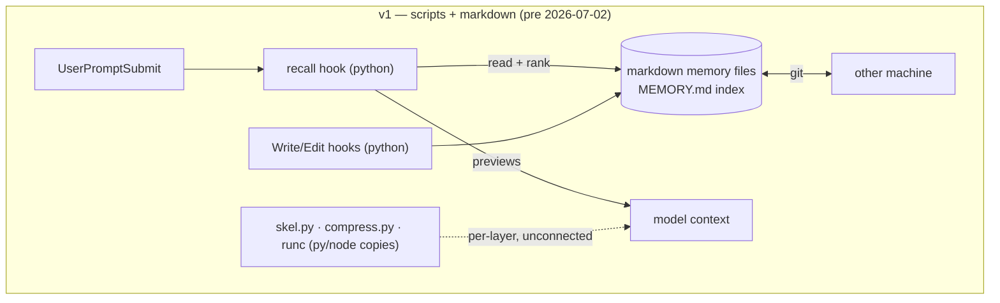
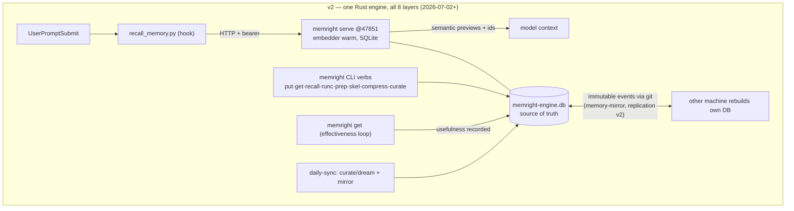
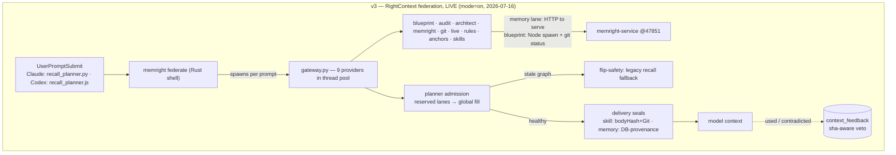
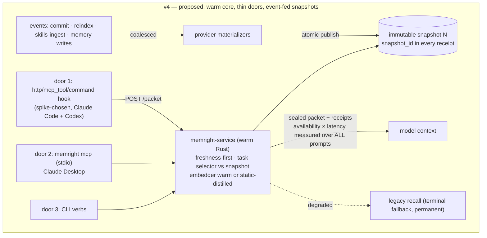

# Context Engineering — Evolution Snapshot (v1 → current proposal)

**What this is:** the one-place snapshot of the workspace context system — the original three-family / eight-layer design, each generation of machinery built under it, what got folded in when (Blueprint, skills, federation), and the currently proposed round. Written 2026-07-16.

**Canonical sources (this doc summarizes, they govern):** [tools/lib/CONTEXT-ENGINEERING.md](../tools/lib/CONTEXT-ENGINEERING.md) (families, layers, engine), [docs/UNIFIED-CONTEXT-SYSTEM-ARCHITECTURE.md](UNIFIED-CONTEXT-SYSTEM-ARCHITECTURE.md) (RightContext design), [docs/RIGHTCONTEXT-STATE.md](RIGHTCONTEXT-STATE.md) (live state), [docs/plans/2026-07-16-rightcontext-harness-protocol-adr.md](plans/2026-07-16-rightcontext-harness-protocol-adr.md) (current proposal, 5 review rounds).

---

## 1. The constants — three families, eight layers

These have not changed since the design was named (CONTEXT-ENGINEERING.md, renamed from COMPACTION.md 2026-06-30 because compaction is only one of three families). Every version below is machinery *underneath* this frame.

**One goal: exactly the right tokens in attention.**

| Family | Motion | Layers | What it does |
|---|---|---|---|
| **Compaction** | PUSH — shrink what's in transit | 1–6 | squeeze each thing that flows |
| **Retrieval** | PULL — bring the right thing in | 7 | rank + inject from the durable store |
| **Curation** | PERSIST — keep the store lean + useful | 8 | lifecycle of the durable store |

| # | Family | What flows | Tool (today) |
|--:|---|---|---|
| 1 | compaction | my reply → Adrian | `brief` (always-on policy) |
| 2 | compaction | command output → context | `memright runc` (head+tail cap + cached pointer) |
| 3 | compaction | file → agent context (INPUT) | `memright prep` + `skel` (code→AST skeleton, prose→compress) |
| 4 | compaction | orchestrator → agent (A2A) | machine-minimal directive (auto-prepended by hook) |
| 5 | compaction | agent doc output → future agent input | `memright compress` + OKF emit (link-graph bundles) |
| 6 | compaction | my running context | harness `/compact` + context-budget planner |
| 7 | **retrieval** | durable store → context (RECALL) | `memright recall` (EmbeddingGemma-300M-Q4, scope-chain + hybrid ranking) |
| 8 | **curation** | durable store lifecycle | `memright curate` (dream: dedupe/normalize/prune, scheduled daily) |

Shared primitives across all three families: `skel` (code AST), `compress`/OKF (prose + link graph), `embed`/vector (recall). Target entry shape `{full, skel, embedding, okf-links}`; the shipped schema stores `{content, keywords, embedding, embedding_q}`.

---

## 2. v1 — the script era (≤ 2026-07-01)

The layers existed as **separate per-layer scripts** and the durable store was **markdown files** (`~/.claude/projects/<scope>/memory/*.md` + a `MEMORY.md` index loaded each session). Recall was a Python hook injecting file previews. Compaction was Python/Node one-offs (`skel.py`, `compress.py`, `runc` copies). Predecessor lesson baked into everything after: **Graphify** (nightly repo graphs, deprecated 2026-05-17) was retired because it produced without a consumption path — every later mechanism ships with a consumption wire and a kill criterion first (the §10 "Graphify guard").

Weaknesses that drove v2: markdown as source of truth (no counters, no effectiveness, no atomic curation), duplicated per-layer tooling in three languages, keyword-ish recall, no measurement.

## 3. v2 — the engine era (2026-07-02 → 2026-07-11)

**The memright Rust engine became the source of truth** (live 2026-07-02): SQLite DB + real embedder (EmbeddingGemma-300M-Q4 via fastembed/onnxruntime, offline), per-prompt semantic recall through a resident service (`serve` on `127.0.0.1:47851`, bearer-token auth), markdown demoted to an engine-generated export. The transform layers (2/3/5) merged into the same crate the same day — `runc`/`prep`/`skel`/`compress` became engine verbs behind compatibility shims. Curation became a scheduled engine verb (`curate` → `dream_now`, daily-sync, 2026-07-04, reshaped in-place after the first run minted colliding ids). Cross-machine sync became **replication v2** (2026-07-10): immutable events through git (`memory-mirror/`), each machine rebuilds/embeds its own DB. Measurement arrived as the anti-Graphify contract: every recall logged, effectiveness loop on `get`, kill criteria per mechanism (§10.2 fired for real — `/skel` + `/prep` serve routes were deleted 2026-07-05 as consumer-less).

Folded in during this era: metrics dashboard (`spoares.com/memory`, content-free 3-family/8-layer snapshot), OKF Skill Output Contract (`skill_emit` — skills persist recallable knowledge), thread guard, brief enforcement hooks.

## 4. v3 — the RightContext federation era (2026-07-12 → 2026-07-16, LIVE today)

**RightContext = the umbrella: memory is one provider among nine.** The unified-architecture dispatch (2026-07-12) added the repo-truth layer and typed knowledge stores, then five folds (2026-07-15) and the production cutover (2026-07-16) made it the live per-prompt path.

What got folded in, in order:

| Date | Fold | What it added |
|---|---|---|
| 2026-07-12 | **Blueprint in** (successor to maprepo/graphify) | deterministic repo map + code graph + verified claims; `.blueprint/` portable contract; graph freshness gating; `blueprint brief/graph` consumption surfaces |
| 2026-07-12 | Typed stores + packet contract | Audit findings store (G4), Architect decisions store (G5, lifecycle `proposed→accepted→implemented→superseded`), `ContextPacket`/`ContextReceipt` v2, ScopeGrant, federation gateway (Rust shell → Python gateway, 9 providers) |
| 2026-07-15 | Feedback rail | per-candidate self-learning: `get`→used, delete/supersede→contradicted, verified-contradicted = sha-aware veto |
| 2026-07-15 | **Skills in** (9th provider) | workspace skill catalog served cross-repo; INDEX previews in the packet + `memright skill-read` pull; provenance-sealed (bodyHash + Git) |
| 2026-07-15 | Memory-content delivery + admission lanes | real content previews (not stubs); two-pass admission (reserved lanes: memory 800 / skill 300 tokens, then global fill); DB-provenance seal |
| 2026-07-15 | Link-graph recall | `[[wikilink]]` edges (schema v8), bounded one-hop at a discounted tier |
| 2026-07-16 | Governance + cutover | reversible quarantine (schema v10); engine-served skills (schema v9, disk-first/engine-fallback); Codex parity (plugin 1.0.4); scheduler-owned hidden service binary; **`RIGHTCONTEXT_MODE=on` flipped** |

Known v3 defects (measured, they motivate v4): clean delivery ~5.3 s against a 7 s budget; **rich-packet availability ~15%** (39/67 on-mode prompts fall back on `blueprint_stale`); per-prompt process churn — Python hook + Rust shell + Python gateway + Node blueprint spawn + git-status subprocess; gateway startup itself is only 414 ms — provider compute dominates.

## 5. v4 — proposed: warm-service inversion, thin doors (ADR 2026-07-16, 5 review rounds)

[The harness-protocol ADR](plans/2026-07-16-rightcontext-harness-protocol-adr.md) — jury-gated, then hardened by four external reviews (MiniMax-M3, muse-spark-1.1, a second Fable, GPT Sol). Direction: fan-out moves *inside* the always-warm resident service; every harness becomes a thin door; packet semantics, seals, admission, and memory quality unchanged.

Key commitments as revised:

- **Phase 0 is decision-bearing:** full-packet profiling per provider × stage × cold/warm × graph-state; exit is a four-way branch (spawn-dominant → port; provider-compute-dominant → snapshots/caps/adaptive first; idle-embed-dominant → warmth rails; dirty-prevalence-dominant → staleness-tolerant delivery becomes product work).
- **Success = availability × latency over ALL prompts** (≥80% delivered + p50 ≤1 s), not latency among the ~15% delivered today.
- **Phase 0.5 quick wins, no inversion needed:** real-inference self-warm ping on the existing service; static-query-embeddings experiment (Model2Vec-style, frozen-eval gated — if it passes, the warmth problem is deleted, not managed); Claude-door transport spike (`type: http` hook vs `type: mcp_tool` hook vs native command shim — the harness can call the service itself, zero spawn).
- **Tier-0 as a versioned materialized context view:** provider materializers consume events (commit/reindex/ingest, coalesced), publish immutable snapshots atomically; receipts carry `snapshot_id` + generation ids; per-prompt work reduces to a task-dependent selector.
- **Ports are incremental** behind per-provider contracts with shadow parity; Blueprint (a real scoring-algorithm port) last; crash containment (`catch_unwind`, deadlines, late-result discard) so in-process fan-out can't kill every door.
- Python gateway retires only after measured parity; legacy recall stays the permanent terminal fallback.

Explicitly deferred to a follow-up ADR (named, gated): retrieval-necessity gating, session working-set/packet-diff caches, SessionStart stable-lane delivery + prompt-cache economics, async-hook speculative prefetch, `memright think` traces, memory-tool door.

---

## 6. One-line version history

| Version | Era | Store of truth | Repo knowledge | Skills | Per-prompt path | Status |
|---|---|---|---|---|---|---|
| v1 | ≤2026-07-01 | markdown files | graphify (dead) → none | disk only | python hook reads files | retired |
| v2 | 2026-07-02 | **memright SQLite** | — | disk only | hook → HTTP → warm engine | superseded as the *primary* path; survives as legacy fallback |
| v3 | 2026-07-12→16 | memright SQLite | **Blueprint + typed stores** | **9th provider, engine-served** | hook → federate → python gateway → 9 providers | **LIVE (mode=on)** |
| v4 | proposed | memright SQLite | Blueprint via materialized snapshots | unchanged (sealed, INDEX+pull) | thin door → warm service → snapshot selector | ADR approved through 5 review rounds; phase 0 next |

## 7. Where everything lives

- Engine: `tools/memright/crates/{memright,memright-core}/` · deployed `tools/bin/memright.exe` + `memright-service.exe` · DB `tools/.cache/memory/memright-engine.db` · service `127.0.0.1:47851`
- Federation gateway (v3, retires in v4 phase 6): `tools/memright/federation/gateway.py` + `providers/*.py`
- Hooks: `tools/hooks/recall_planner.py` (Claude) · `tools/codex-brief-plugin/recall_planner.js` (Codex)
- Blueprint: `.blueprint/` (portable) + `.agent/` (machine-local) per repo; typed stores `.audit/architect/decisions.jsonl`, audit findings store
- Skills catalog: `tools/skills/` (authoring) + engine `skills` table (serving) · `memright skill-read`
- Telemetry: `tools/.cache/metrics/rightcontext-*.jsonl` · dashboard `spoares.com/memory`
- Sync: `daily-sync.sh` 10:00 both machines (pull → sync → mirror push → dashboard)
