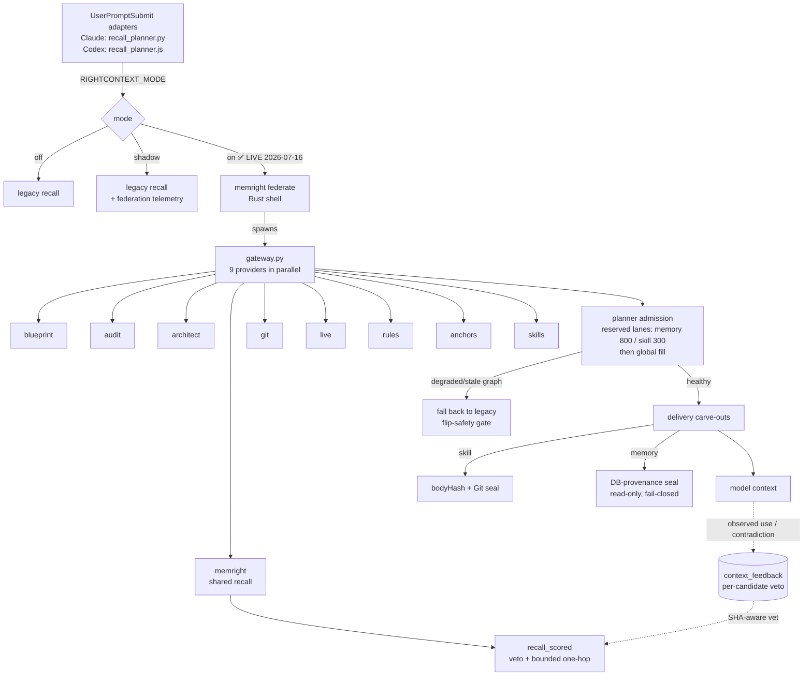

# RightContext — current state + backlog (source of truth)

**What this is:** the single current-state map of RightContext (the umbrella context system) and MemRight (its durable-memory engine). Design rationale lives in `docs/UNIFIED-CONTEXT-SYSTEM-ARCHITECTURE.md` (2026-07-12, design-era) and `tools/lib/CONTEXT-ENGINEERING.md`; per-feature ADRs + measurements live in the `docs/plans/2026-07-*` files linked below. This doc is the index of *what is live now* and *what is next*. Last updated **2026-07-16**.

## Live pipeline (as shipped)

## Shipped (all live, each through design → council 2-loops → TDD → measure → jury)

| # | Feature | State | Key files | ADR + measurements |
|---|---|---|---|---|
| 1 | **Feedback rail** — per-candidate recall self-learning; `get`→used, delete/supersede→contradicted; verified `contradicted` = veto-until-superseded (sha-aware); shared `recall_scored` and live `/recall` both apply it; persisted `context_feedback` (schema v7); `metrics.feedback` | LIVE | `memright-core/effectiveness.rs`, `memright/feedback.rs`, `store.rs`, `serve.rs` (`/feedback`), `main.rs` (`feedback` verb) | [plan](plans/2026-07-15-rightcontext-feedback-rail.md) |
| 2 | **Skills = 9th provider** — workspace skill catalog served cross-repo; discover from any repo; `memright skill-read <name>` loads bodies; provenance-sealed delivery (bodyHash + Git) | LIVE | `federation/providers/skills.py`, `skills-catalog/{ingest,provider}.py`, `main.rs` (`skill-read`), `recall_planner.py` carve-out, `lib/skill_frontmatter.py` | [plan](plans/2026-07-15-skills-as-rightcontext-provider.md) |
| 3 | **Memory-content delivery** — federation memory provider fixed from stub → real `recall_scored` + content previews; UTF-8 subprocess; planner `structural` key | LIVE | `federation.rs` (`memory_candidates_payload`), `federation/providers/memright.py`, `recall_planner.py` memory carve-out | [plan](plans/2026-07-15-rightcontext-memory-delivery.md) |
| 4 | **Admission reserved lanes + memory DB-provenance seal** — two-pass admission (memory 800 / skill 300 tok lanes, then global fill) fixes overlay-flood starvation; memory delivery verified against a real DB row (read-only, fail-closed) | LIVE | `memright-core/planner.rs`, `recall_planner.py` (`_verify_memory_row`) | [plan](plans/2026-07-15-rightcontext-admission-lanes-memory-seal.md) |
| 5 | **Link-graph recall** — `links(src,dst)` table (schema v8) from `[[wikilinks]]`; extract-on-write + backfill; shared one-hop recall at a discounted tier, depth 1, at most 20%/8 hits. The old federation merge is removed. | LIVE (333 edges at validation) | `memdb.rs` (links table), `store.rs` (`linked_neighbors`, `backfill_links`, `recall_scored_detailed`) | [plan](plans/2026-07-15-rightcontext-link-graph-recall.md) |
| 6 | **Reversible governance** — low-effectiveness never-used rows move to schema-v10 quarantine with complete row preservation; transactional list/restore CLI and API; duplicate pruning remains permanent | LIVE | `memdb.rs`, `dream.rs`, `serve.rs`, `main.rs` | completion record in the cold-chat handoff |
| 7 | **Codex hook parity** — `brief@local-brief` 1.0.4, one prompt hook, active-repo resolution, sealed memory/skill delivery, fail-open legacy path, no duplicate brief-policy injection | LIVE | `tools/codex-brief-plugin/recall_planner.js`, source plugin `hooks.json` | completion record in the cold-chat handoff |
| — | **`RIGHTCONTEXT_MODE=on` flip** + flip-safety gate (degraded packet → legacy fallback) | **FLIPPED 2026-07-16** (new sessions; graph-freshness gated) | `recall_planner.py` | memory `rightcontext-mode-on-flipped-2026-07-16` |

**Operational note:** on-mode delivers the rich federation packet only when the Blueprint graph is fresh. A declared-stale manifest or uncommitted source tree short-circuits in the gateway before provider fan-out and falls back to legacy recall. The reconcile git hook keeps the graph fresh on commit.

## ✅ Production cutover closed — Claude + Codex delivering (validated 2026-07-16)

The scheduler now owns `tools/bin/memright-service.exe` directly (no console-hosted wrapper), with
working directory `D:\Claude`. The live service reports the 768-dimensional
`embeddinggemma-300m-q4` embedder and writes enabled. Final release hashes and the complete backlog
disposition are recorded in `docs/2026-07-16-rightcontext-cold-chat-handoff.md`.

The authenticated production path is slower than the early canary suggested: clean federation is
~5.3–5.6s on this CPU, while dirty/source-stale federation short-circuits in ~0.26s before legacy
recall. Claude uses a 7s federation budget. Codex caps federation at 6.25s inside its 9s internal
deadline, reserving the full 2.5s legacy semantic-recall budget before the plugin's 10s outer limit.
Repo-code discovery is capped at 64 candidates. The prior ~2.4s statement below is retained only as
historical cutover evidence and is superseded.

**Source/runtime boundary (current at commit `8e36cea1`):** the running `memright.exe` and
`memright-service.exe` are still the validated binaries whose hashes are recorded in the cold-chat
handoff. Commit `8e36cea1` landed additional Rust hardening after those artifacts were built
(worker-permit lifetime, collision-safe schema-v10 backout, bounded graph metrics, and related
regressions). Those source changes are committed and tested but are **not deployed** until both
binaries are rebuilt and replaced through the documented redeploy lane. The Codex planner is
JavaScript invoked directly from this checkout, so its 6.25s/2.5s timeout correction is current
without a binary redeploy.

The local privacy-sensitive production gate exactly matched baseline (MRR 0.75, nDCG@5 0.77103,
Recall@5 0.86667). It is not committed. A 30-row content-audited fixture is committed with exact
hashes and passes the fresh-clone smoke gate at 1.0/1.0/1.0 without production memory bodies.
Contextual enrichment, DirectML, and multi-hop were deliberately not promoted. One-hop remains
bounded and shared because it is safe/deterministic, but it did not improve the production frozen
aggregate metrics; no multi-hop prerequisite was established.

## Historical #0 activation record (superseded measurements)

The Claude `UserPromptSubmit` hook now runs `recall_planner.py` (was legacy `recall_memory.py`) — `settings.json:114` → `py -3.11 D:/Claude/tools/hooks/recall_planner.py`. **Canary: 6/6 prompts delivered the full federation packet on a fresh graph, federate avg 2432ms (2.2–2.8s), heartbeat + delivery logs populate.** Fixes that got it there:
- **`memory-candidates` cold ONNX reload (3637ms) → warm serve `/memory-candidates` (118ms, 30×).** New serve route runs candidate-gen in-process; provider POSTs to it, cold-CLI fallback if serve down. Federate dropped 5.3s→~2.4s.
- **`/verify-memory` serve route** — client-agnostic DB-provenance seal (real→ok, forged→rejected, verified live).
- **Timeouts 0.8s→4.0s** (Claude + Codex); **budget 2048→4096** (Claude, matching Codex + lane sizing).
- **Heartbeat log** (`rightcontext-heartbeat.jsonl`, every invocation + outcome) + delivery/seal telemetry — an inert flip can no longer be silent.
- **`skill_frontmatter` path made `_WS`-based** so the hook works from any location.
- **Codex delivery-parity CODE done** (`recall_planner.js`: skill name/hash derivation fixed, sealed `formatMemoryDelivery` wired, degraded-fallback gate) — but see remaining.

**Key correction to the audits' assumption:** gateway startup is only **414ms**; the ~2s residual is **provider fan-out compute** (repo_code scanning 243 candidates, blueprint, git), NOT startup or memory-ONNX. So a resident gateway saves only ~0.4s — the real latency levers are provider-level (cap repo_code, etc.), not a resident process.

**Two shipped bugs found by Sol's audit + fixed (2026-07-16):**
- **Broken legacy fallback (severe):** `recall_planner.py` consumed stdin via `json.load(sys.stdin)`, so `recall_legacy`→`recall_memory` re-read EOF and every fallback (off/shadow/degraded/unavailable) emitted **0 bytes** vs legacy's 2663. Fix: read raw stdin once, restore `sys.stdin=StringIO(raw)` before each fallback.
- **Unbounded timeout on Windows:** `subprocess.run(timeout)` killed only the direct child, orphaning the gateway process tree (30s wedge observed). Fix: `Popen` + new process group + `taskkill /F /T` tree-kill on timeout (0.3s timeout now returns ~0.9s, no orphans).
- **Canary matrix (post-fix, all deliver content):** FRESH→federation (3715B, `delivered`); STALE→legacy (2528B, `legacy_degraded:blueprint_stale`); OUTAGE→legacy (2514B, `legacy_fallback:federation_unavailable`). Real subprocess tests in `test_recall_planner_fallback.py`.

**Remaining for full #0:**
- **Codex live-cutover** — the JS delivery code is done, but the plugin lives in a regenerated cache (`.codex/plugins/cache/.../hooks.json` calls legacy `recall_memory.py`); wiring it needs a plugin source repackage + version bump + reinstall (double-brief-policy to reconcile). Distinct op.
- **`setup-workspace.py` portability** — DONE: registers `recall_planner.py` (+ installs `recall_legacy.py` for the fallback import) and a clobber-migration removes the stale `recall_memory.py` UserPromptSubmit command so a reinstall replaces rather than doubles. Other machines (Mac) cut over on next `python3 tools/setup-workspace.py`.
- **Latency** — ~2.4s/prompt on a fresh graph is the honest cost; acceptable with fail-open, but provider-level trimming (repo_code cap) is the follow-up if it's too slow. On a **stale graph (active editing) on-mode falls back to legacy** by the safety gate, so the rich packet appears mainly right after commits (reconcile keeps the graph fresh).

---
### (historical) the INERT-flip diagnosis that led here — audits Fable session + Sol, 2026-07-16

Zero federation packets have ever been delivered in production. Root causes, outermost first:
1. **CUTOVER NEVER HAPPENED (Sol, P0 — supersedes everything below):** the installed Claude hook (`settings.json:114`) and the Codex plugin both invoke **`recall_memory.py`** (legacy), and `setup-workspace.py:261` only registers that. `recall_planner.py` — modes, flip-safety gate, all five features' delivery — is **dead code on the production hook path**. The `RIGHTCONTEXT_MODE=on` flip toggles a hook that never runs. (The fallback-log events were manual test invocations.)
2. **Timeout (Fable session):** even if wired, `ON_FEDERATE_TIMEOUT_S = 0.8` vs measured federate ~1.9s cold/1.4s warm → `payload=None` → legacy every prompt. Fix: route federate through the resident serve (the memory-delivery ADR's deferred option) rather than a 3s cold-spawn budget.
3. **Graph freshness:** `blueprint_stale` degrades the packet most of a dirty-tree working day → safety fallback.

**Further Sol P0/P1s, all verified:**
- **Budget mismatch:** Claude hardcodes `max_tokens=2048` (`recall_planner.py:615`); Codex uses 4096; lanes (800+300) were sized at 4096 — at 2048 they consume ~54% of budget. Align budgets or make lanes budget-relative before the canary.
- **Codex delivery parity absent:** the Codex on-path returns only the brief policy; `formatSkillDelivery()` exists but is not called; no memory-seal parity.
- **`/recall` veto bypass:** `serve.rs` `/recall` calls `recall_scored()` directly — the feedback veto lives only in federation + `context_for`, so **live production recall never applies vetoes** (and has recorded zero feedback). Promote the gate into the shared recall path.
- **Curation-vs-measurement conflict:** `dream.rs:114` permanently prunes `score<0.2 && access_count==0`, while CONTEXT-ENGINEERING correctly holds fetch-after-inject to be a confounded lower bound — a preview-useful memory can die with `access_count==0`. Needs a quarantine/restore phase before destructive prune.
- **Doc fixes:** link-ADR 0.6×-vs-0.3 reconciled (0.3 shipped; ADR corrected). Feedback-rail ADR citations: actual papers are [Memory-R1](https://arxiv.org/abs/2508.19828) and [AgeMem](https://arxiv.org/abs/2601.01885), not the survey.

**Process lesson (both audits):** "live" was claimed at the feature layer (33/33 tests) without proving the production hook path end-to-end — the installed-hook registration and the missing delivery log were each one command away.

## ✅ Engine-served skills — the ORIGINAL divergent ask, restored (2026-07-16)

Adrian's original intent was skills that **travel as content, not a directory** — engine-served like memories, no disk/symlink dependence. The build diverged when a reviewer's "memories table is text-only" finding was accepted as blocking engine storage (it never did: SKILL.md bodies ARE text; only binary *resources* need files) and Task 7 was parked. Fixed:
- **`skills` table (schema v9)** in the engine DB: name, description, body, body_sha256, resource manifest. Git remains the AUTHORING source — `memright reindex` ingests every git-tracked `tools/skills/*/SKILL.md` (tracked-only, frontmatter parsed with a Rust port of the shared YAML-free parser).
- **`skill-read` = disk-first, engine-fallback:** disk (always-current authoring source) where the checkout exists; the engine row everywhere else — a session/machine with ONLY the synced engine DB loads skills. Proven by `skill_read_serves_from_engine_without_skills_directory` (empty workspace root → body served `source=engine`).
- **Delivery seal portability:** `SkillResolver._audited` falls back to the engine row when no disk copy exists, so provenance-gated delivery works on DB-only machines.
- **Cross-machine sync: CLOSED** — `memright ingest-skills` (cheap, no re-embed) runs in `daily-sync.sh` after pull on both machines: author → commit → pull → ingest → engine-served anywhere. No extra mirror mechanism needed (git carries authoring; the DB carries serving).
- **Resource materialization: OUT OF SCOPE BY DESIGN** — skill *scripts* reference workspace paths, node_modules, and repo context; materializing a lone script file onto a checkout-less machine would not make it runnable. Instruction portability (the skill's brain) is complete; script *execution* requires the repo by definition, not by this design's limitation.
- **Task 7 (retire the `~/.claude/skills` symlink): BLOCKED, external** — the harness's native `/slash` Skill loader reads disk; removing the symlink today breaks slash invocation. Unblocks when the harness gains non-disk skill loading OR skills are invoked purely via RC delivery. Adrian's call whether to accept the trade earlier.

## Cutover backlog disposition (final)

| Item | State |
|---|---|
| 0 activation | Complete for Claude and Codex; Codex source plugin 1.0.4 installed normally. |
| 1 paired canary | Complete across both clients, 2048/4096 budgets, and clean/dirty graphs. |
| 2 shared veto | Complete in `recall_scored` and live `/recall`, including restart/supersede coverage. |
| 3 frozen eval + one-hop | Complete; shared bounded one-hop and duplicate federation merge removed. The private production-corpus gate matched baseline; the committed content-audited corpus is wiring/integrity smoke evidence only. |
| 4 governance | Complete; schema-v10 quarantine/list/restore plus provenance and temporal regressions. |
| 5 contextual enrichment | Evaluated, rejected on the 10-minute reindex bound, and removed. |
| 6 scoring drift | Complete by correcting `SPEC.md` to the shipped formula; no unsupported recency/access/pin claim remains. |
| 7 feedback polish | Complete. The content-free snapshot feed and protected `spoares.com/memory` viewer expose hook/mode/outcome latency, fallback reasons, sealed delivery, feedback/veto, bounded graph-link inclusion, quarantine, and non-promotion states (`life` commit `b0f184b`). |
| 8 skills/Codex polish | Codex hook parity complete; the native slash-loader symlink remains operator-reserved by design. |
| 9 multi-hop | Not promoted: one-hop did not beat the frozen baseline. |
| 10 tuning/absorptions | Repo-code cap 64 shipped. DirectML rejected. Other parked ideas remain receipt-gated, not cutover blockers. |

## Historical backlog (retained for audit trail)

The numbered text below is the verbatim pre-cutover record. Present-tense claims such as “today”
or “currently” are archival and are superseded by the final disposition table above.

Re-ordered 2026-07-16 (second pass) after BOTH audits — Fable session + Sol's goal audit. Sol's corrected order adopted:

0. **Activate and prove the pipeline (the real cutover).** Wire `recall_planner.py` as the UserPromptSubmit hook via `setup-workspace.py` for BOTH clients (today it installs/registers only `recall_memory.py`); complete Codex memory/skill/seal delivery parity (`formatSkillDelivery` exists, uncalled); route federate through the resident serve (kills the 0.8s-vs-1.9s timeout death); align budgets (2048 vs 4096 — lanes sized at 4096 are 54% of the Claude budget) or make lanes budget-relative; planner heartbeat + delivery log.
1. **Legacy-vs-on canary with paired non-inferiority evidence.** Claude + Codex, both budgets, clean + dirty graphs; measure hook invocation, delivered sources, fallback rate, lane occupancy, latency, context precision, task success. "Never worse than legacy" is currently an emergency fallback, not evidence.
2. **Put the feedback veto into the shared recall path.** `serve.rs /recall` → `recall_scored` bypasses it today, so live recall never applies vetoes (zero feedback recorded). Prove a recall→get/delete/supersede sequence survives restart in the LIVE path.
3. **Freeze the memory-recall eval, then evaluate one-hop BEFORE promoting.** Extend the locked holdout with useful links, dangling links, hubs, stale/conflicting memories, irrelevant neighbours; MRR/nDCG or Recall@k + task outcome + budget displacement. When promoting the merge into `recall_scored`, REMOVE the federation merge (avoid double augmentation).
4. **Governance now (raised above multi-hop).** Write-provenance/poisoning regression tests for `memright put`/adapt intake; temporal update/abstention cases; **quarantine/restore phase before destructive curation** — `dream.rs` permanently prunes `score<0.2 && access_count==0`, which conflicts with fetch-after-inject being a confounded lower bound. ([GhostWriter](https://arxiv.org/abs/2607.06595), [Sleeper Memory Poisoning](https://arxiv.org/abs/2605.15338) — preprints, figures cautious, risk credible.)
5. **Contextual enrichment at write time** — 1–2 sentence "what/when" header before embedding (Anthropic contextual retrieval); eval-gated on #3's frozen set.
6. **SPEC-vs-code scoring drift — decide deliberately** — SPEC claims `cos + 0.06·decay + 0.06·eff + 0.04·pin` DONE; no `decay` in the crates. Fix the SPEC row or deliberately add recency-decay (temporal blindness is a documented failure mode; staleness is the workspace's most-burned lesson). Eval-gated. Note [calibrated-similarity](https://arxiv.org/abs/2601.16907): raw cosine is a ranking signal, not a cross-provider relevance probability.
7. **Feedback-rail polish** — dashboard; **bandit caution:** get-based `used` is conservative for the veto, biased as bandit reward (preview-sufficient reads as noise) — needs correction before wiring.
8. **Skills polish** — `scope_grant skills:read`; `skill-read` → verified `Used`; Win/Mac parity; symlink retirement.
9. **Multi-hop** — moved DOWN (both audits + research agree): requires a demonstrated one-hop win, bounded depth, typed/directed edges, decay, cycle/hub caps, no-regression gate.
10. **Remaining parked absorptions + tuning** — `resolve(handle)` expansion; phase-aligned procedural memory; SubQ planner strategy + model-capability profile; Graphiti validity-windows (receipt-gated); lane/neighbour-score tuning from telemetry once #0–1 produce data.

**Convergent verdict of both audits + research:** no redesign, no new vector DB, no Graphiti migration, no learned-memory system. The architecture matches current practice (progressive disclosure, hybrid RRF at this scale, per-candidate telemetry ahead of practice, lanes = dual-channel admission, seals = poisoning-literature alignment). The gaps are **activation, evidence, and governance** — not architecture.

**Research verdict folded in (2026-07-16):** architecture is current with the field — hybrid RRF at this scale (no cross-encoder/ColBERT/HyDE/graph-PPR) matches published guidance; per-candidate use telemetry is ahead of practice; reserved lanes match MemArchitect dual-channel admission; delivery seals align with the memory-poisoning literature. The gaps are operational (the inert flip), evaluative (no frozen memory eval), and temporal (no recency signal) — not architectural.

## Reserved for the operator (Adrian)
- The `RIGHTCONTEXT_MODE` flip itself (done); revert = `setx RIGHTCONTEXT_MODE shadow`.
- Rotating any shared key; anything production-mutating in the release/licensing pipelines.

## Where the pieces physically live
- **Rust engine:** `tools/memright/crates/{memright,memright-core}/` — store, planner, federation shell, feedback, memdb.
- **Federation gateway (Python):** `tools/memright/federation/gateway.py` + `providers/*.py` (9 providers).
- **Delivery hook:** `tools/hooks/recall_planner.py` (Claude) + `tools/codex-brief-plugin/recall_planner.js` (Codex).
- **Skills catalog:** `tools/skills/skills-catalog/`.
- **Deployed binary:** `tools/bin/memright.exe` (shim `~/bin/memright`); DB `tools/.cache/memory/memright-engine.db`; serve on `127.0.0.1:47851` (Task Scheduler `memright-serve`).
