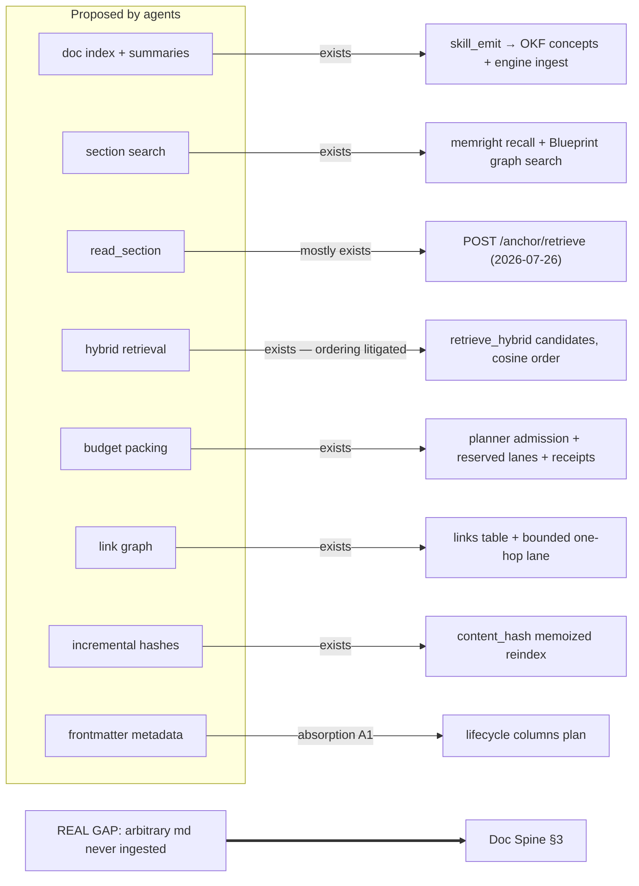

# Markdown consumption — three-agent synthesis and the Doc Spine decision

> **SUPERSEDED 2026-07-27 by [`2026-07-27-membrane-absorption-implementation-guide.md`](2026-07-27-membrane-absorption-implementation-guide.md)** for all implementation decisions — D1 became revision-bound source registration (never eager `put`), D2/D3 became the typed `DocOutlineV1`/`DocReadV1` pair. Retained as synthesis/verdict history.

**Date:** 2026-07-26 · **Status:** SUPERSEDED (was: proposal)
**Inputs:** proposals from Qwen, MiniMax, and GPT Sol on "index-first markdown for agents";
verified against `tools/lib/CONTEXT-ENGINEERING.md`, `membrane/docs/MEMBRANE-STATE.md`,
`tools/hooks/ingest_memory.py`, and the companion absorption doc
`2026-07-26-rms-memory-mcp-absorption.md`.

---

## 0. Verdict up front

**Best proposal: GPT Sol**, by a clear margin — it is the only one at the right architectural
altitude. It independently reinvented Membrane's actual design (typed adapters feeding one
budget-packed context substrate, summaries-as-routing-never-evidence, hierarchy with ancestry
context, disk as source of truth with offsets + hashes, links as a graph) and even said so:
"that is probably the core of the system you were trying to name Pulse, Tether, or Membrane."
Its principles map 1:1 onto shipped Membrane contracts.

**Ranking:**

| Rank | Agent | Strength | Fatal weakness |
|---|---|---|---|
| 1 | **GPT Sol** | Architecture-grade; correct principles (routing summaries, budget packing, expansion levels, FTS-first, incremental hashes, link graph); frames md as one adapter in the substrate — which is exactly what Membrane is | Doesn't know the substrate exists, so proposes rebuilding planner/budgeter/telemetry that are live; its blended hybrid *ordering* collides with the measured RRF revert |
| 2 | **Qwen** | Most complete implementation cookbook: schemas, FTS5 DDL, phased plan, honest Option A/B/C tradeoffs, glossary-vs-TOC disambiguation | Entirely generic — a parallel `docs_index.sqlite` + sidecar `.meta.json` + `INDEX.md` would create a second source of truth that drifts against the engine (the exact class DB-first killed) |
| 3 | **MiniMax** | Best external landscape with citations (Karpathy index.md, md2idx, llms.txt, PageIndex, RAPTOR, MCP-Markdown-RAG); useful corpus-size thresholds; verified context-reduction stats | Wrong altitude: recommends a root `INDEX.md` + per-file TOC tooling — beneath the existing stack; in-file generated TOCs are the staleness class Blueprint exists to catch |

**What to adopt: not a new system.** All three agents, blind to your internals, proposed building
~85% of what Membrane/MemRight/Blueprint already ship. The synthesis reduces to **one real gap plus
three thin extensions** — the **Doc Spine** (§3): close the ingestion coverage hole so *every*
authored markdown write becomes recallable automatically, and add a deterministic outline/section
door for targeted reads.

---

## 1. What already exists (why most of all three proposals is redundant here)

Checked against live sources, so nobody re-proposes these:

| Proposed by agents | Already shipped | Evidence |
|---|---|---|
| Central doc index in SQLite | Engine DB is the one index; Blueprint's doc↔claim↔code graph covers repo docs with line-level claims | `CONTEXT-ENGINEERING.md` §4; `blueprint/SKILL.md` Phase 1 |
| Section-level concepts with summaries | `skill_emit report` splits a markdown report at every `##` into OKF concepts (preamble+H1 = overview), each ingested and recallable | §5.2 `report_concepts` |
| Auto-index on write ("file watcher") | PostToolUse hook `ingest_memory.py` fires on every Write/Edit — the *hook is the watcher*; no resident process needed | §6 hook table |
| Semantic + keyword hybrid retrieval | `retrieve_hybrid` candidate generation (lexical + vector), cosine ordering, scope chains, MIN_COS floor | §4.6 |
| Budget-packed context with receipts | Planner admission, reserved lanes (memory 800 / skills 300 tok), ContextPacket + ContextReceipt | `MEMBRANE-STATE.md:481` |
| "Summaries route, don't replace evidence" | Source-first guardrail; full files required for verify/edit work; previews inject with a `get` fetch command | blueprint SKILL.md:41-44; §4.6 closure |
| Link graph between docs | `links(src_id, dst_slug)` from `[[wikilinks]]` + bounded depth-1 link lane in recall | schema v8; §4.6 |
| Incremental reindex via content hash | `(content_hash, embed_model)` memoization — full reindex 25 min → 4 s | §10 |
| Targeted section read | `POST /anchor/retrieve {repo, anchor, maxBytes}` — repo-confined, 64 KiB default / 256 KiB cap (landed 2026-07-26) | serve.rs surface, §4.8 |
| Frontmatter lifecycle (`status`, `supersedes`) | Planned as absorption item A1 (lifecycle columns) | `2026-07-26-rms-memory-mcp-absorption.md` §3-A1 |

**Two measured results the proposals collide with — do not relitigate without new replay evidence:**

1. **Chunking.** Qwen and Sol both center on section-chunk indexing. The 2026-07-11 four-arm
   tournament (whole-document vs contextual-768 vs fixed-512 vs sentence-boundary, real queries,
   locked holdout) — **whole-document won; no chunk table was promoted** (§10). Caveat that keeps
   section-splitting alive for one class only: EmbeddingGemma has a **2K-token context**, so a long
   doc embeds truncated. Conclusion: whole-doc rows for normal files, H2-split concepts (the
   existing `report_concepts` path) for long files. That is a routing rule, not a chunk table.
2. **Hybrid score blending.** Sol's `final score = lexical + semantic + …` and Qwen's weighted
   hybrid are the fused-ordering shape that shipped 2026-07-05 and was **reverted same day** (mean
   rank 2.37 → 6.07 on the frozen gate). Hybrid stays where it is: candidate generation. Ordering
   stays cosine (+ scope bonus). Any retry must first win on a `recall_log.query_preview` replay.

---

## 2. The one real gap

`tools/hooks/ingest_memory.py:341-357` (`_knowledge_route`) auto-ingests exactly:
durable-declared `docs/plans/`, `.agents/*product-marketing*`, `*full-audit-report.md`,
`.audit/`/`*-audit-report.md`, plus `/memory/` files and `.agent/okf/` bundles. **Everything else
falls through** (`main()` line ~378: `if not (is_mem or is_bp): return 0`).

So `docs/rules/*.md`, runbooks (`docs/MAC_DEVELOPER_ID_SIGNING.md`, `docs/APP-DISTRIBUTION-RUNBOOK.md`),
brand docs, per-repo READMEs, HR planning docs — the majority of authored markdown — are **never
recallable semantically**. They are consumed only when CLAUDE.md points at them or an agent greps.
That is precisely the "write an md and hope it's consumed" failure this synthesis exists to close.

---

## 3. The decision: adopt the **Doc Spine** (four thin extensions, zero new systems)

Design constraints honored: DB-first (no sidecar indexes, no in-file generated TOCs), minimum
mechanism, hook-as-watcher, measured results respected, repository text is data never instruction
(trust gate already runs in the hook — keep it on the new path).

### D1 — Universal write-through (the user's core ask)

Extend `ingest_memory.py` with a **fallback route**: any tracked `*.md` write that misses the
knowledge routes and is not excluded gets ingested automatically.

- **Exclusions (keep tight):** `runs/`, `node_modules/`, `.cache/`, `memory-mirror/` (already a DB
  export), generated docs (`docs/product.md`, `docs/architecture.md` carry generation metadata —
  Blueprint's self-referential-loop rule applies), `MEMORY.md` pointers, content deliverables
  (bucket B — blog posts/copy are venture content, not knowledge; route by path prefix per
  `SKILL-OUTPUT-CONTRACT.md`).
- **Size routing (encodes the tournament + the 2K embed window):**
  - `< ~6 KB` (≈ fits the embedder): `memright put --file` whole-doc — one row, the measured winner.
  - `≥ ~6 KB`: `skill_emit report --type doc` — existing H2 split into concepts, each carrying the
    doc title + heading breadcrumb in its OKF frontmatter (this *is* Sol's "ancestry capsule",
    already implemented as concept metadata).
- **Idempotence:** the engine's `content_hash` memoization makes re-writes cheap; a re-saved
  unchanged file re-embeds nothing.
- **Trust:** the existing `inspect_memory_text` quarantine gate runs on this path too — a doc that
  reads as instruction is quarantined, not ingested.
- **Backfill:** one-shot `memright ingest-docs --root <ws>` walk applying the same routing to the
  existing corpus (mirror of what `migrate-blueprint` did for OKF). Run once per machine, then the
  hook keeps it current with no migration lag.

### D2 — Deterministic outline verb (progressive disclosure door)

`memright doc-outline <path> [--json]`: headings, line ranges, byte offsets, per-section token
estimate. Pure parse — no LLM, no storage, milliseconds (Qwen's Layer-1/MiniMax's TOC, done
Membrane-style: computed on demand, never written into the file, so it can never go stale). The
recall hook injects it as the suggested next step when a doc-derived concept hits:
`preview → doc-outline → anchor/retrieve <section>` — index → locate → fetch, at the smallest
useful granularity.

**Framing (Adrian, 2026-07-26): this is database indexing for md.** The outline is the index
structure (scan it cheaply to decide what to fetch); `anchor/retrieve` is the indexed row lookup.
Truncation/compression decides *for* the agent what survives, blind to the question; the index
keeps that choice with the agent. Consequence for **layer 3 routing**: today `memright prep`
routes prose → `compress` (~62% keep — lossy). Add a third route: **prose above the size
threshold → `outline`** — the fan-out worker receives the index plus fetch instructions instead
of compressed full text, and pulls only the sections its task needs. Small prose keeps the
existing compress path (an index over 40 lines is overhead, not help). SURVEY/SYNTHESIS reads
only; verification and edit-intent reads still take full files, unchanged.

### D3 — Section fetch = the existing anchor door

No new read primitive. `POST /anchor/retrieve` (repo-confined, bounded) plus `doc-outline`'s line
ranges already give `read_section`-equivalent behavior. If ergonomics demand it later, a
`memright doc-read <path> --heading <slug>` CLI wrapper over the same route is a one-day add.

### D4 — Frontmatter convention (feeds A1, deterministic only)

Authored docs *may* carry `title / summary / keywords / status / supersedes` frontmatter; the
ingest path maps `status: superseded` and `supersedes:` onto the A1 lifecycle columns when they
land. Optional, never required — ordinary markdown must keep indexing correctly (Sol's rule).
No LLM-generated per-section summaries at index time: emit-time distilled concepts already carry
summaries, and recurring per-write LLM cost is exactly the class §10.2 kills.

### Measurement (Graphify guard applies from day one)

New `artifact_family='doc'` on D1 rows makes the question queryable: injections, fetch-after-inject
rate, and relevance spot-check inclusion for doc rows, reviewed at `/context-metrics`. **Kill
criterion:** if after 30 days doc-family rows show ~0 fetch-after-inject and the spot-check judges
them noise, narrow the fallback route's include list — do not keep indexing what recall proves
nobody uses.

### Explicitly rejected from the three proposals

| Idea | From | Why rejected |
|---|---|---|
| Parallel `docs_index.sqlite` / FTS5 sidecar | Qwen, Sol | Second index = second truth = drift; engine already has lexical+vector candidates over one DB |
| Sidecar `.meta.json` per file / root `INDEX.md` | Qwen, MiniMax | Hand-or-generated files that rot; DB-first flip exists because of this class |
| In-file generated TOC/glossary blocks | Qwen, MiniMax | Generated content inside authored files = staleness Blueprint flags; outline is computed on demand instead |
| Per-section LLM summaries at index time | all three | Recurring cost, no measured need; emit-time concepts already summarize |
| Blended hybrid *ordering* | Qwen, Sol | Measured revert 2026-07-05; replay win required first |
| Fixed-size chunk store | implicit in all | Tournament winner is whole-doc; H2 concepts cover the long-doc case |
| Vector DB adoption (LanceDB/Milvus/Chroma) | MiniMax option | ~1K-row corpus, 1.4 ms recall baseline — no measured problem |
| Standalone glossary/term extraction | Qwen, MiniMax | Semantic recall already bridges term→section; build only if spot-checks show term-lookup misses |
| File watcher daemon | Qwen | The PostToolUse hook *is* the watcher; a resident watcher is new failure surface |

---

## 4. Sequencing

1. **D2 + D3 now** — read-only, no schema, no gate conflicts (`doc-outline` verb + recall-hook
   pointer wiring; anchor route already live).
2. **D1 next** — hook edit + `ingest-docs` backfill; Python-side, independently deployable,
   fail-open like every hook. Ship with the `artifact_family='doc'` attribution so measurement
   starts on day one.
3. **D4 with A1** — frontmatter→lifecycle mapping rides the schema-v19 step already planned in the
   RMS absorption doc (post-Gate-3).
4. Review doc-family effectiveness at the first `/context-metrics` after 30 days; apply the kill
   criterion.

## 5. Sources

- Ingestion gap: `tools/hooks/ingest_memory.py:341-357, 371-385`.
- Chunking tournament + RRF revert + kill criteria: `tools/lib/CONTEXT-ENGINEERING.md` §4.6, §10.
- Federation/admission/receipts: `membrane/docs/MEMBRANE-STATE.md` (gateway :477-481).
- Anchor route: engine serve surface (`POST /anchor/retrieve`, 2026-07-26).
- Lifecycle columns: `docs/plans/2026-07-26-rms-memory-mcp-absorption.md` §3-A1.
- Agent proposals: Qwen (layered SQLite cookbook), MiniMax (tool landscape + citations), GPT Sol
  (structure-aware hierarchical retrieval as substrate adapter) — conversation transcript 2026-07-26.
