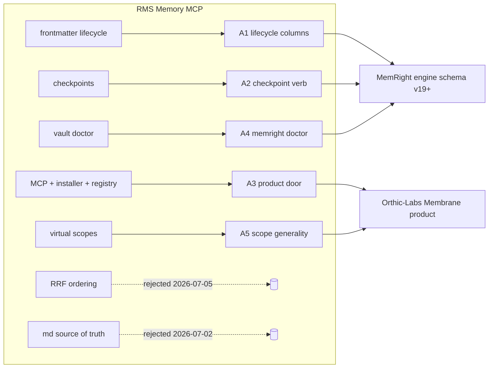
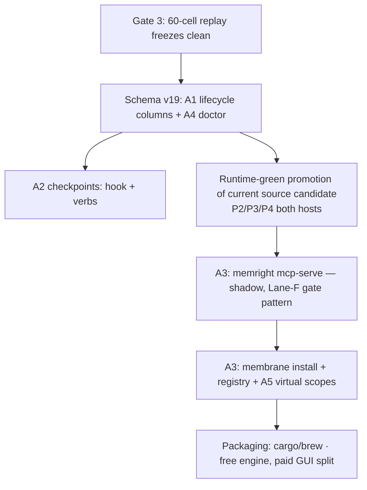

# RMS Memory MCP → Membrane/MemRight — absorption analysis and plan

> **SUPERSEDED 2026-07-27 by [`2026-07-27-membrane-absorption-implementation-guide.md`](2026-07-27-membrane-absorption-implementation-guide.md)** for all implementation decisions. Notably corrected there: A1 is schema **v20** (source is already v19); pins never bypass eligibility gates; the 0.3–0.7 confidence ranges and RMS "production/fsync" claims are README-derived, not verified. Retained as comparison/analysis history.

**Date:** 2026-07-26 · **Status:** SUPERSEDED (was: proposal)
**Compared against:** `Orthic-Labs/Membrane` @ `8b0fd822`, `Orthic-Labs/blueprint` @ `aaaa1828`,
`Orthic-Labs/adapt` @ `a9775241`, workspace `tools/lib/CONTEXT-ENGINEERING.md`,
`membrane/docs/MEMBRANE-STATE.md` (2026-07-23 + 2026-07-26 federation update).
**Subject:** `github.com/max-ramas/rms-memory-mcp` (Rust MCP memory server; README reviewed 2026-07-26).

---

## 0. TL;DR

RMS Memory MCP is a competent **single-vault memory tool**: per-project markdown vaults, LanceDB
vectors + Tantivy full-text with RRF fusion, tree-sitter code chunk indexing, frontmatter-driven
lifecycle, session checkpoints, and an MCP-first multi-IDE install story. Architecturally it covers
roughly **one slice of Membrane's layers 7–8 plus a thin slice of layer 3**. It has no federation, no
cross-provider budget/admission, no receipts, no freshness-vs-authority model, no verification loop,
no measurement/telemetry economy, and its "code memory" is chunk retrieval — not Blueprint-class
claim verification.

Membrane is a category ahead on architecture. RMS is ahead on **two engineering conveniences and one
go-to-market lane**, all absorbable:

| # | Absorb | What it accelerates | When |
|---|---|---|---|
| A1 | Declarative lifecycle metadata (`pinned`, `valid_from/valid_until`, `superseded_by`, `confidence`) | The exact §4.2 `[Target]` columns MemRight already planned — RMS proves the shape works in production | First schema step after Gate 3 closes |
| A2 | Session checkpoints (goal/pending/links saved before compaction, durable notes on close) | A real content bridge across `/compact`; smallest useful piece of cognition layer 9 | With A1 (same migration) or immediately after |
| A3 | MCP server door + multi-IDE auto-install + zero-config global registry + rules-file patching | Orthic-Labs Membrane distribution: works in Cursor/Zed/any MCP client with one command | Product phase — after runtime-green on the current source candidate |
| A4 | Corpus doctor (7-point vault health → `memright doctor`) | A curation-family lint: stale/expired/orphaned/unembedded rows as a content-free report | Low cost; bundle with A1 |
| A5 | Virtual scope identifiers (non-filesystem scopes: threads, product IDs) | Scope model generality for the productized engine | Product phase, with A3 |

Explicitly **not** absorbed: RRF-fused result ordering (already tried and measured-reverted),
markdown-as-source-of-truth (DB-first is locked), its tree-sitter code memory (Blueprint is
strictly deeper), per-note `.bak` durability (WAL + quarantine + outbox already cover it).



---

## 1. What RMS Memory MCP actually is

From its README (fetched 2026-07-26):

- **Purpose:** "persistent, local-first memory for your AI coding agents" — one memory vault usable
  from any MCP-compatible IDE (Cursor, Zed, Claude Code, …), so context survives closing a tool.
- **Isolation model:** a global registry `~/.rms-memory/registry.toml` maps project paths (or
  virtual identifiers) to isolated vaults keyed by path hash. Zero per-repo config files; one global
  MCP entry serves every workspace.
- **Storage:** markdown is the human-readable source of truth, organized as
  `rules/ decisions/ architecture/ artifacts/ docs/ api/`; LanceDB (embedded vectors via
  `fastembed-rs` + `multilingual-e5-small`) and Tantivy (full-text) hold derived indexes under
  `~/.rms-memory/dbs/`. Separate tables for human markdown vs derived code corpus.
- **Code memory (optional):** tree-sitter chunk indexing for ~11 languages, opt-in watch mode that
  reindexes dirty paths, AST-aware markdown chunker that keeps code blocks/lists bound to parent
  headings.
- **Retrieval:** hybrid vector + full-text; corpus selector `vault|code|all` with Reciprocal Rank
  Fusion when mixed. `rms_search` returns a bounded **inject/abstain envelope** with `max_chars`,
  optional `min_score`, `retrieval_mode`, and fail-closed errors.
- **Lifecycle:** frontmatter `status`, `supersedes`, `valid_from`, `valid_until` gate whether a note
  appears in recall; `pinned` bypasses temporal/confidence gates; records carry `confidence` and
  `last_modified_by` audit metadata (suggested 0.3–0.5 exploratory, 0.7+ canonical). `rms_write`
  supports soft supersede (old note marked replaced, never deleted). "Doctor" runs 7-point vault
  health checks including stale-record identification.
- **Session continuity:** `rms_checkpoint_*` tools save goal/pending/links before context
  compaction and write durable session notes on closure; `rms_overview` gives structured project
  orientation (counts, recent notes, checkpoints).
- **Distribution:** `rms-memory install` scans for installed IDEs and wires the MCP entry into each;
  non-destructive AST patching of `.cursorrules`, `.zed/assistant.md`, etc.; Homebrew/Cargo
  packaging; optional paid Tauri GUI (server fully standalone).
- **Hygiene:** generated `wiki/` namespace excluded from all indexing/search/graph; linked-document
  stubs (`link: <path>`) redirect reads/writes while staying indexed; rolling `.bak` + atomic
  replacement after fsync; safe project deletion requires exact key match.

---

## 2. Head-to-head against the Orthic-Labs stack

### 2.1 vs Membrane (context system)

| Capability | RMS | Membrane | Verdict |
|---|---|---|---|
| Federation | none — one vault, one search | 9 providers in parallel (blueprint, audit, architect, memright recall, git, live overlay, rules, anchors, skills) behind one gateway (`MEMBRANE-STATE.md:479`) | **HAVE, superior** |
| Budgeting/admission | per-query `max_chars` | one model-specific token budget, two-pass admission with reserved lanes (memory 800 / skills 300 tok), dedupe + conflict resolution | **HAVE, superior** |
| Receipts | none | `ContextReceipt` — admitted, omitted, stale, timed-out, denied, budget-dropped, per-lane latencies | **HAVE, superior** |
| Freshness vs authority | frontmatter validity windows | central authenticated `/freshness` verdict; executable proof > current code > docs > memory; dirty-overlay invalidation; generation quarantine | **HAVE, superior** |
| Abstain semantics | inject/abstain envelope, `min_score`, fail-closed | `MIN_COS 0.40` injection floor, bounded packets, DB-provenance delivery seal, fail-closed scope grants | **HAVE, equivalent-or-better** |
| Measurement | none visible | recall_log/transform_log/opportunity joins, relevance spot-checks, cohort holdouts, kill criteria (§10) | **HAVE, superior** |
| MCP door | first-class server, any IDE | thin Lane-F client only (`membrane/mcp/client.mjs`, shadow mode, transport-only) | **RMS ahead → A3** |
| Multi-IDE onboarding | `install` auto-wires discovered IDEs | workspace-specific `setup-workspace.py` hooks | **RMS ahead → A3** |
| Session checkpoints | save/done/load/query as content | PreCompact/PostCompact telemetry only (content-free by design); post-compaction recall re-arm | **RMS ahead → A2** |

### 2.2 vs MemRight (durable memory engine)

| Capability | RMS | MemRight | Verdict |
|---|---|---|---|
| Source of truth | markdown files | SQLite DB (locked 2026-07-02); markdown is generated export | **Keep DB-first** — RMS's model reintroduces the drift class the flip eliminated |
| Embeddings | multilingual-e5-small via fastembed-rs | EmbeddingGemma-300M-Q4 via fastembed/onnxruntime, asymmetric query prompts, memoized reindex | **HAVE** |
| Hybrid retrieval | vector + FTS, RRF-ordered | hybrid candidates, **cosine-ordered** — fused RRF ordering was shipped and reverted same day (mean rank 2.37 → 6.07 on the frozen gate, §4.6) | **REJECT RRF ordering** — already litigated with data |
| Supersession | `supersedes` frontmatter, soft replace | `[Target]` — `superseded_by` column not in schema; only the feedback rail's `contradicted` veto exists | **ABSORB → A1** |
| Temporal validity | `valid_from`/`valid_until` | none | **ABSORB → A1** |
| Pinning | `pinned` bypasses gates | `[Target]` (§4.6 scoring blend, `+0.04 * pinned` not wired) | **ABSORB → A1** |
| Confidence | per-record float, ranged guidance | `[Target]` column; adapt has admission-side corroboration but no stored per-row confidence read at recall | **ABSORB → A1** |
| Curation | doctor stale-lint | `curate`/dream_now dedupe+prune, reversible quarantine, scheduled daily | **HAVE mechanism; ABSORB the lint report → A4** |
| Scope model | path hash **or virtual identifier** | path-slug chain (self → ancestors → global), sibling isolation, cross-scope opt-in | **HAVE chain (superior); ABSORB virtual ids → A5** |
| Durability | `.bak` + atomic replace | WAL, transactional versioned migrations, fail-closed unknown schema, durable outbox, full-row quarantine | **HAVE, superior** |
| Multi-machine | none (single machine) | immutable Git mirror events, per-installation re-embed, conformance receipts, P3/P4 promotion gates | **HAVE, superior** |

### 2.3 vs Blueprint

RMS's "Semantic Code Memory" is tree-sitter chunking for similarity search. Blueprint builds a
provenance-carrying doc↔claim↔code graph, classifies claim types, runs deterministic checks before
agent judgment, verifies claims with multi-verifier adjudication, synthesizes six understanding
dimensions, inventories product flows, and turns doc↔code divergence into `CODE-IS-BETTER /
CODE-FELL-SHORT / SUPERSEDED-BY` reconciliation decisions. There is nothing to absorb here; the
comparison is a positioning asset for the Blueprint README ("chunk search is not understanding").

One idea worth noting, not building: RMS's **watch mode** (reindex only dirty paths). Blueprint
already covers the same need with `post-commit`/`post-merge`/`post-checkout` reconcile hooks plus
the dirty-file live overlay — event-driven beats a resident watcher for this workload; revisit only
if overlay latency ever becomes measured pain.

---

## 3. Absorption items — full detail

### A1 — Declarative lifecycle metadata (the §4.2 `[Target]` columns, validated externally)

**What.** Add to `memories` (schema v19, versioned transactional migration per existing discipline
in `membrane/engine/crates/memright/src/memdb.rs`):

```
pinned         INTEGER DEFAULT 0
valid_from     TEXT NULL      -- ISO-8601; NULL = always valid
valid_until    TEXT NULL      -- ISO-8601; NULL = never expires
superseded_by  TEXT NULL      -- id of the replacing row; row is retained, never deleted
confidence     REAL NULL      -- 0..1; NULL = unscored (legacy rows)
```

**Why RMS matters here.** These are already MemRight `[Target]`s (CONTEXT-ENGINEERING.md §4.2/§4.6),
so this is not new scope — RMS is external evidence that the *declarative-metadata* shape (author
states validity; recall gates on it) works in a shipped product, versus deriving everything
behaviorally. The two approaches compose: declarative gates decide *eligibility*, the behavioral
effectiveness loop decides *rank*.

**How.**

1. **Write path:** `memright put` gains `--pinned`, `--valid-until <ts>`, `--supersedes <id>`,
   `--confidence <f>`; `POST /put` accepts the same optional fields. `--supersedes` sets
   `superseded_by` on the *old* row in the same transaction (soft supersede, RMS-style: nothing
   deleted, provenance preserved). The dashboard edit form exposes all four.
2. **Recall gating (`recall_scored` in `store.rs`):** before candidate generation, filter out rows
   where `superseded_by IS NOT NULL` or `valid_until < now`, **unless `pinned=1`** (RMS's rule:
   pinned bypasses temporal/confidence gates — keep it, it is the correct escape hatch for locked
   decisions like the wake-word or pricing locks). `valid_from > now` rows are excluded always.
3. **Scoring:** wire the already-specified `+0.04 * pinned` term (§4.6). Do **not** add a
   confidence multiplier to the sort yet — confidence participates only as an optional recall
   filter (`min_confidence` request field, mirroring RMS's `min_score`) until §10 data shows the
   sort needs it. This respects the reranker-gate lesson: ranking changes must win on a real-query
   replay first.
4. **Curation integration:** `curate`/dream_now treats `valid_until`-expired rows as quarantine
   candidates (reversible, existing `memory_quarantine` path) instead of hard prunes; superseded
   rows are excluded from consolidation sources.
5. **Adapt integration:** `locked_decision` records get `pinned=1` at apply time (they are exactly
   the class RMS pins); adjudication corroboration count maps to initial `confidence`
   (single-source ≈ 0.4, corroborated ≈ 0.7 — adopt RMS's ranges as starting calibration, then
   recalibrate against the relevance spot-check corpus).
6. **Mirror/replication:** new fields ride the existing immutable event schema as optional keys;
   absent = NULL, so old events replay unchanged and peers on older binaries fail closed on the
   schema version exactly as today.
7. **Supersession vs the feedback rail:** the existing `context_feedback` `contradicted` veto stays
   the *behavioral* signal; `superseded_by` becomes the *declarative* resolution. Curation's queued
   contradiction-merge (`[Target]` in layer 8) gets its output column: resolving a contradiction =
   writing `superseded_by` on the loser.

**Acceptance.** Migration up/down tested per existing v-migration suite; a pinned expired row still
recalls; a superseded row never recalls but `memright get <id>` still returns it (audit access);
mirror round-trip on both machines; relevance spot-check (`recall-relevance-spotcheck.py`) shows no
regression; `metrics` gains counts of gated-out rows (content-free).

**When.** First engine schema step **after Gate 3 closes** (the 60-cell replay must freeze
successfully first — the promotion pipeline is single-file and a schema bump mid-gate would
invalidate the run). It rides the normal four-asset guarded install; `memright-daily` stays
disabled per current policy.

**Risk / minimum-mechanism check.** Five nullable columns + one filter + one flag term. No new
store, no new service, no new hook. Kill criterion: if after 30 days <1% of rows carry any
lifecycle field and the gated-out count is ~0, the columns stay (they're inert) but the CLI flags
get removed from docs as unadopted.

---

### A2 — Session checkpoints (content bridge across compaction)

**What.** RMS saves `{goal, pending, links}` before context compaction and durable session notes on
close, then restores orientation next session (`rms_checkpoint_save/done/load/query`,
`rms_overview`). Membrane currently records **content-free** PreCompact/PostCompact telemetry and
re-arms recall after compaction (`recall_rearm.py`) — the summary itself is harness-owned and the
*task state* is simply lost.

**How.**

1. **Engine:** no new table. A checkpoint is a normal memory row:
   `id = <scope>/checkpoint-<session_id>`, `record_type='checkpoint'`,
   `artifact_family='session'`, `tier='Working'`, body = small structured markdown
   (`## Goal / ## Pending / ## Links / ## Decisions-this-session`). `record_type` and
   `artifact_family` already exist in schema v14+ — this is pure convention plus two CLI
   affordances: `memright checkpoint save --scope S --session <id> [--file -]` and
   `memright checkpoint load --scope S [--session <id>|--latest]`.
2. **Write trigger:** the existing **PreCompact hook** (already registered for Claude and Codex,
   §2.1) additionally instructs the agent to emit a ≤600-token checkpoint via `checkpoint save`
   before the harness compacts. Fail-open like every other hook; a missed checkpoint costs nothing.
3. **Read trigger:** SessionStart (same event `recall_rearm.py` uses) injects the latest
   non-expired checkpoint for the cwd scope, tagged as *orientation, not instruction* (repository
   text is data — trust rules unchanged). `valid_until = now + 7d` via A1 so stale checkpoints
   age out of recall automatically without curation work.
4. **Lifecycle:** on a `checkpoint save` marked `--done`, the row is rewritten as a durable session
   note (`record_type='episodic_fact'`) if and only if it contains a decision worth keeping;
   otherwise `valid_until` lets it expire. Curation prunes expired checkpoints on the normal
   schedule.
5. **Relationship to cognition layer 9 (`memright plan`, `[Target]`).** A checkpoint is the
   *degenerate, shippable* form of the plan layer: goal + pending, no decomposition graph. Ship it
   as convention-over-schema now; if layer 9 lands later, `plan` output supersedes the checkpoint
   body format and the verbs merge. This ordering satisfies the anti-scaffolding rule — the
   consumption path (SessionStart injection) ships with the producer.

**Acceptance.** A compaction on a real long session produces a checkpoint row; the next session's
first prompt shows the injected orientation block; expiry removes it after 7 days; `metrics` shows
checkpoint injections separately (content-free count). Kill criterion (§10.2 pattern): if
fetched-or-acted-on rate over 30 days is ~0, remove the SessionStart injection and keep only the
manual `checkpoint load`.

**When.** Same migration window as A1 (it wants `valid_until`), or immediately after. The hook edit
is Python-side and independently deployable.

---

### A3 — MCP door + multi-IDE install + zero-config registry (Membrane productization)

**What.** RMS's real advantage is distribution, not architecture:

- a **standalone MCP server** any MCP client can use (Cursor, Zed, Claude Code, Windsurf, Desktop);
- `rms-memory install` that **scans for installed IDEs and wires each one** (global MCP entry, no
  per-repo `.mcp.json` pollution);
- a **global registry** (`registry.toml`) mapping workspace → vault by path hash, so a brand-new
  repo needs zero setup;
- **rules-as-code patching**: non-destructive AST edits of `.cursorrules`, `.zed/assistant.md`,
  etc., to teach each IDE's agent the memory protocol (RMS also exposes
  `rms_system_instructions` — the server self-describes its usage protocol as a tool call);
- Homebrew/Cargo packaging; optional paid GUI with the server free/standalone (a pricing shape
  worth noting for Orthic-Labs: free engine, paid Tauri companion — the same split HeardRight uses
  for Free/Pro).

Membrane today has only the Lane-F **thin client** (`membrane/mcp/client.mjs` — transport-only,
shadow-gated) and workspace-specific setup (`setup-workspace.py`). That is correct for the
workspace but is not a product door.

**How (product phase, Orthic-Labs Membrane repo):**

1. **`memright mcp-serve`** — a stdio MCP server binary target in the engine workspace exposing the
   *existing* loopback surface as MCP tools, planner-first per the harness-protocol ADR (MCP is a
   transport door, never a second ranking authority — exactly what `client.mjs` already enforces):
   `membrane_context` (→ `/plan_context`, the flagship: returns packet + receipt),
   `membrane_recall` (→ `/recall`), `membrane_put` (→ `/put`), `membrane_get` (→ `/get`),
   `membrane_checkpoint_*` (A2), `membrane_feedback` (→ `/feedback`),
   `membrane_system_instructions` (RMS-style self-bootstrap — serves the memory protocol so a
   fresh client needs no manual prompt engineering). Auth: the server owns the bearer token
   locally; MCP clients never see it.
2. **`membrane install`** — detect IDE configs (Claude Code `~/.claude.json` mcpServers, Cursor
   `~/.cursor/mcp.json`, Zed settings, Codex `config.toml` mcp_servers), append the one global
   entry idempotently, patch rules files non-destructively where the client has no MCP-native
   instruction path. Print a receipt of every file touched (Membrane's receipts culture applied to
   its own installer).
3. **Registry:** generalize `runtime.json` + `MEMRIGHT_DB` into a small per-user registry mapping
   scope roots → DB paths, defaulting to today's single-DB layout so the workspace behavior is
   unchanged. This is what makes "clone any repo, agent has memory" true for outside users, which
   RMS gets from its path-hash vaults.
4. **Scope grants stay fail-closed.** RMS auto-creates a vault per path; Membrane must keep
   `ScopeGrant` semantics — `install` registers roots explicitly, and an MCP call outside a
   registered root is a typed denial, not an implicit new vault. This is the deliberate divergence
   from RMS: convenience must not erode the root-confinement moat.

**When.** After the current source candidate reaches runtime-green (P3/P4 on both hosts) — the
product door must wrap a promoted engine, not a candidate. Sequence: A1/A4 schema step → runtime
promotion → `mcp-serve` (shadow → on, reusing the Lane-F gate pattern) → `install` → packaging.

**Why bother when hooks exist:** hooks cover Claude Code and Codex on machines you administer. MCP
covers *every other agent client* with zero hook surface — that is the entire outside-user funnel
for the Orthic-Labs product.

---

### A4 — `memright doctor` (corpus health lint, curation family)

**What.** RMS's 7-point vault doctor is a *report*, distinct from its mutation path. MemRight has
strong mutation-side curation (`curate`, quarantine, dedupe) and service health (`/health`,
`/livez`, `metrics`) but no single corpus-health *lint*.

**How.** Read-only `memright doctor --json` emitting content-free counts + offending ids:

1. expired (`valid_until < now`, unpinned) — A1 dependency;
2. superseded rows still receiving injections (should be 0 once A1 gating lands — a nonzero count
   is a gating bug detector);
3. embedding health: rows whose `embed_model` ≠ current default (reindex candidates), NULL/short
   embeddings;
4. dangling `[[wikilinks]]` (links table dst has no row);
5. scope anomalies: rows whose `scope_id` matches no known root; lowercase-drive-style near-dupes;
6. staleness: rows with `inject_count > N` and `access_count = 0` over the window (the
   effectiveness loop's decay candidates, surfaced instead of silently decayed);
7. checkpoint hygiene: expired checkpoints not yet pruned (A2).

Wire it into `daily-sync.sh` after curate; nonzero critical findings mark the run degraded (same
policy as existing binary/replication failures). The dashboard gets a doctor chip.

**When.** Bundle with A1 (items 1–2 depend on it); items 3–5 could ship standalone earlier if a
window opens before Gate 3 closes, since they're read-only.

---

### A5 — Virtual scope identifiers

**What.** RMS scopes are "filesystem paths **or virtual identifiers** (threads, product IDs)".
MemRight scopes are path-derived slugs with a chain. For the product (and for non-repo uses like a
support-thread memory or a per-brand memory in this studio), allow a registered non-path scope.

**How.** Small: `normalize_scope()` already accepts arbitrary slugs; the change is (1) the registry
(A3.3) may declare `virtual: true` roots with an explicit parent chain (e.g.
`brand-DD → brands → global`), and (2) the recall hook resolves cwd → scope via the registry before
falling back to path slugging. No schema change. Sibling isolation and cross-scope opt-in semantics
apply unchanged.

**When.** Product phase, with A3 (it needs the registry). Workspace gains it for free (brand-scoped
memories would slot into `/brand` workflows, but do not build that speculatively — minimum
mechanism; let a real need pull it).

---

## 4. Explicitly rejected — with reasons on record

| RMS feature | Why not |
|---|---|
| **RRF-fused result ordering** | Shipped 2026-07-05, gate-measured, **reverted same day**: mean rank 2.37 → 6.07, 21/30 targets worse — lexical channel floods keyword-popular rows. Pinned by `recall_scored_sorts_by_cosine_over_fused_candidates`. Any retry must first win a real-query replay (`recall_log.query_preview`). RRF stays for *candidate generation* only, which MemRight already does. |
| **Markdown as source of truth** | DB-first locked 2026-07-02 (Adrian's directive). RMS's model reintroduces hand-edited-file drift, partial-write corruption, and the two-headed-truth problem the flip killed. Markdown remains an engine-generated export. |
| **Tree-sitter code memory** | Blueprint's verified claim graph + flow inventory + reconciliation is strictly deeper; RMS-style chunk search adds a second, weaker code corpus that would compete with the Blueprint provider inside admission. Positioning material, not a gap. |
| **LanceDB/Tantivy storage swap** | SQLite + fastembed already meets latency (warm `/federate` p50 81.8 ms; recall baseline 1.4 ms) at current corpus size (~1k rows). A vector-DB migration is weight without a measured problem. Revisit only if corpus growth degrades measured recall latency. |
| **Per-note `.bak` rolling backups** | WAL + transactional migrations + reversible quarantine + durable outbox + Git mirror + DB snapshots already cover every failure class `.bak` addresses. |
| **Watch-mode file watcher** | Event-driven git hooks + dirty overlay already serve freshness; a resident watcher is a new failure surface (and a §10.2 kill-criteria candidate on day one). |
| **Wiki namespace** | The concept (generated output excluded from indexing) already exists with stronger teeth: Blueprint excludes its own generated docs from claim extraction; `ingest_memory.py` refuses `runs/` and working files. |
| **Linked-document stubs** (`link:` redirect) | Solves a markdown-vault problem (files living outside the vault). DB-first ingestion via `put --file` + the ingest hook covers the need without a redirect layer. |

---

## 5. Sequencing summary



Constraints honored: no schema bump mid-Gate-3; `memright-daily` stays disabled; every binary change
rides the four-asset guarded install; every new surface ships its consumption path with its producer
and carries a §10.2 kill criterion; ranking changes require replay wins; MCP remains a transport
door under the planner's sole ranking authority.

## 6. Sources

- RMS: `github.com/max-ramas/rms-memory-mcp` README (fetched 2026-07-26).
- Membrane state: `membrane/docs/MEMBRANE-STATE.md` (9-provider gateway :479; skills provider :498;
  engine-served skills :1053–1061; resident `/federate` :5–23; Gate/promotion status :100–179).
- Engine policy: `tools/lib/CONTEXT-ENGINEERING.md` (§4.2 `[Target]` columns; §4.6 scoring + RRF
  revert; §10 measurement + kill criteria; §2.1 PreCompact hooks).
- MCP thin client: `membrane/mcp/client.mjs`.
- Adapt admission/lifecycle: `tools/skills/adapt/SKILL.md`, `adapt/authority.py`.
