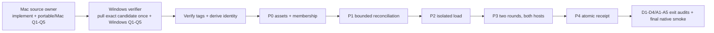
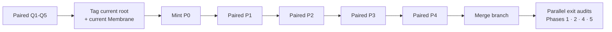

# Membrane absorption + Doc Spine — unified implementation guide

**Date:** 2026-07-27 · **Status:** SOLE CANONICAL implementation + execution guide.
**Consolidated 2026-07-29:** all RMS A1–A5, Doc Spine D1–D4, implementation-route, Windows
qualification, and paired-promotion requirements live here. Superseded plans, route JSON files,
and route receipts were removed from the active tree; Git history retains them. **No companion
plan or receipt is build authority.**
**Validated workspace:** `bogusyogi/claude` @ `e42505a` lineage + `Orthic-Labs/Membrane` @
`8b0fd822` (pre-rogue-commit baseline). Trust-gate probe executed live in-session 2026-07-26.
**Review provenance:** 4 rounds folded — Qwen/MiniMax proposals → Sol R1 (source≠memory, mirror
exclusion) → MiniMax+Qwen adversarial R3 (A1 split, admission replay gates, kill-that-kills) →
**Sol R4 adversarial (2026-07-27, governing where it conflicts with anything earlier):** v20 not
v19; exact-source promotion; pin never bypasses eligibility; four lifecycle concepts; PreCompact
mechanics; `/federate` not `/plan_context`; no raw put/recall on the public MCP surface;
registry maps roots→identities not →DBs; A5 scope-parser incompatibilities.

## Current closure authority — 2026-07-29

Implementation phases 1, 2, 4, 5, plus Phase 6 shadow surface now live on `main`; retained phase
sections are acceptance contracts. D4, the complete A1 authoring boundary, A3 native enablement,
A5 typed virtual scopes, production-boundary qualification, and fail-closed promotion
orchestration remain. Active sequence is:



**Single source owner.** Mac owns every shared root/Membrane source change for this run. Windows
does not independently implement shared behavior: it pulls one exact proposed source pair, runs
Windows-only qualification, and publishes one immutable host bundle. A Windows-only defect is
reported with its failing oracle; Mac applies shared fixes, reruns full source-owner
qualification, and issues one replacement candidate. Evidence may fan out/fan in, but source
never relays between machines.

No source pair is frozen before both hosts pass Q1–Q5. Q1 proves both release binaries identify
one Membrane commit/tree plus SHA-256; Q2 has durable Rust-suite exit plus Node parity; Q3 proves a
disposable clone migrates v19 → v20 → v19 with preserved logical rows; Q4 proves bounded
`close-unknown` through the **exact release-built CLI → authenticated resident service → real HTTP
router**, including exact links, idempotence, plus max+1 refusal; Q5 proves tools/hooks settle.
Only then tag both repositories, verify those tags resolve, mint P0, then run fail-closed
P1 → P2 → P3 → P4.

### Supersession coverage ledger

| Legacy item | Canonical home | Completion contract |
|---|---|---|
| D1 authored Markdown registration | Phase 5 | Revision/hash-bound `DocArtifactV1`, reconciled, machine-local, never eager durable memory |
| D2 deterministic outline | Phase 1 | Typed `DocOutlineV1`, CommonMark/GFM, stable anchors + continuation |
| D3 exact section read | Phase 1 | Hash-bound `DocReadV1`, typed stale/missing/deny outcomes |
| D4 frontmatter | Phase 5 | Namespaced deterministic metadata + source lifecycle; no implicit durable-memory mutation |
| A1 lifecycle | Phase 2 | v20 schema/gating **plus one transactional authoring boundary** used by single/batch/CLI/HTTP/dashboard/Adapt |
| A2 checkpoints | Phase 4 | Lineage-bound A0 session lane, door injection, no self-promotion |
| A3 MCP + installer | Phase 6 | Six safe tools, protocol resource, identity registry, native install/dry-run/uninstall receipts on both hosts |
| A4 doctor | Phases 1–2 | Versioned read-only checks, stable severities, lifecycle/source integrity |
| A5 virtual scopes | Phase 7 | Typed opaque IDs, explicit parents/grants/tenant boundary; no path or hyphen inference |

All nine rows must be green. “Implemented” means its public consumption path and real boundary
test pass; internal helpers or shadow code alone do not complete a row.

### Production-boundary qualification

`HTTP_ROUTE_SPECS` and the handler chain are currently separate authorities. That allowed
`/context/close-unknown` handler tests to pass while the resident server rejected the route
before dispatch. The repaired contract is:

1. Every external endpoint has one typed declaration containing method, path, work class,
   authorization policy, and handler. Generated dispatch and route tests consume that declaration.
   If conversion cannot land atomically, an exhaustive parity test must fail whenever a handler
   and the public route registry diverge.
2. Q4 launches the exact release-built service on an isolated port with disposable DB, identity,
   bearer token, and bounded fixture. It invokes the exact release-built CLI through resident
   HTTP; direct `route_for_tests*` calls are supporting unit tests only.
3. First closure must return `closed:1`; repeat must return `closed:0`; max+1 must fail with no
   partial writes. A direct DB fallback, missing resident service, 404, auth bypass, or different
   binary invalidates Q4.
4. Before P0, every public CLI/MCP operation used by P1–P4 gets one release-built reachability
   smoke through its production transport. Provenance parity never substitutes for behavior.

### Executable promotion state machine

Documentation order is insufficient. Add typed `PhaseReceiptV1`:

```text
phase, host, installation_id, root_commit, membrane_commit, engine_tree,
release_manifest_sha256, prior_phase_receipt_sha256, started_at, completed_at,
evidence_sha256[], status
```

- P1 consumes validated P0 and emits P1 receipt.
- P2 refuses to start without matching P1 receipt and emits P2 receipt.
- P3 refuses to start without matching P2 receipt; each round chains its prior receipt.
- P4 requires both hosts' final P3 receipts and validates the complete hash chain.
- Every producer checks prerequisites **before** DB clone, service call, traffic generation, or
  evidence write. Candidate/host/installation/manifest mismatch is fatal.
- Until these producer preconditions and standalone receipt validators exist, P2/P3 output cannot
  count as promotion evidence.

### Historical-retired identifiers

The prior `316a7fe1` root, `e7d5514` Membrane pair, `final-316a7fe1` evidence tree, and their
asset hashes are historical-retired evidence only. They certify no active Q or promotion gate.

## Promotion operator runbook — executable authority

### Pre-freeze constants

| Field | Required value |
|---|---|
| Root / Membrane tag | `UNFROZEN — forbidden before paired Q1–Q5` |
| Root commit | `UNFROZEN — latest scoped root commit at freeze` |
| Membrane commit | `d273a3859b6f0b0c83023e5bdcf1448a37699cd1` until source changes |
| Schema | `20` |
| Engine tree / release generation | `b3fb1c5c9b5d454890803b37100d5332421c12f1312d5ced3c9404cbe6309925` |
| Policy | `rightcontext-planner-v2-balanced` |
| Shared workspace | `ws.89bc60b4b54358fa6704907077f42670` |

### Post-tag preflight — run before every P0–P4 command

This fails closed unless each repository has exactly one v20 candidate tag at its checked-out
commit. It derives every active path; never paste an asset hash or evidence directory name.

```powershell
$ErrorActionPreference = 'Stop'
$ROOT_TAG = @(git tag --points-at HEAD 'candidate/v20-*'); if ($ROOT_TAG.Count -ne 1) { throw 'expected one root v20 candidate tag' }; $ROOT_TAG = $ROOT_TAG[0]
$MEMBRANE_TAG = @(git -C membrane tag --points-at HEAD 'candidate/v20-*'); if ($MEMBRANE_TAG.Count -ne 1) { throw 'expected one Membrane v20 candidate tag' }; $MEMBRANE_TAG = $MEMBRANE_TAG[0]
$ROOT_COMMIT = (git rev-parse "$ROOT_TAG^{commit}").Trim()
$MEMBRANE_COMMIT = (git -C membrane rev-parse "$MEMBRANE_TAG^{commit}").Trim()
if ($ROOT_COMMIT -ne (git rev-parse HEAD).Trim()) { throw 'root tag does not resolve to HEAD' }
if ($MEMBRANE_COMMIT -ne (git -C membrane rev-parse HEAD).Trim()) { throw 'Membrane tag does not resolve to HEAD' }
$ROOT_SHORT = $ROOT_COMMIT.Substring(0,8)
$EVIDENCE_ROOT = "membrane/evidence/g2/final-$ROOT_SHORT/promotion"
$P0 = "$EVIDENCE_ROOT/p0-release.json"; $INSTALLATION_SET = "$EVIDENCE_ROOT/installation-set.json"; $RELEASE_ASSETS = "$EVIDENCE_ROOT/release-assets"
$MANIFEST = @(Get-ChildItem -LiteralPath $RELEASE_ASSETS -File -Filter 'manifest-v20-*.json'); if ($MANIFEST.Count -ne 1) { throw 'expected one P0 release manifest' }; $MANIFEST = $MANIFEST[0].FullName
function Resolve-ManifestAsset([string]$Pattern) { $found = @(Get-ChildItem -LiteralPath $RELEASE_ASSETS -File | Where-Object Name -match $Pattern); if ($found.Count -ne 1) { throw "expected one manifest asset matching $Pattern" }; return $found[0].FullName }
$WINDOWS_CLI = Resolve-ManifestAsset '^windows-x86_64-cli-.*-memright\.exe$'; $WINDOWS_SERVICE = Resolve-ManifestAsset '^windows-x86_64-service-.*-memright-service\.exe$'
$MACOS_CLI = Resolve-ManifestAsset '^macos-aarch64-cli-.*-memright$'; $MACOS_SERVICE = Resolve-ManifestAsset '^macos-aarch64-service-.*-memright-service$'
```

macOS uses equivalent shell variables: `ROOT_TAG`, `MEMBRANE_TAG`, `ROOT_COMMIT`,
`MEMBRANE_COMMIT`, `ROOT_SHORT`, `EVIDENCE_ROOT`, `P0`, `INSTALLATION_SET`, `RELEASE_ASSETS`, and
the four manifest-discovered asset paths. This is the exact macOS preflight; it must print the two
commits, set each path, and fail before a P command if a tag, manifest, or asset is absent:

```bash
set -euo pipefail
cd /Volumes/D/claude
ROOT_TAGS="$(git tag --points-at HEAD 'candidate/v20-*')"; test "$(printf '%s\n' "$ROOT_TAGS" | sed '/^$/d' | wc -l | tr -d ' ')" = 1; ROOT_TAG="$ROOT_TAGS"
MEMBRANE_TAGS="$(git -C membrane tag --points-at HEAD 'candidate/v20-*')"; test "$(printf '%s\n' "$MEMBRANE_TAGS" | sed '/^$/d' | wc -l | tr -d ' ')" = 1; MEMBRANE_TAG="$MEMBRANE_TAGS"
ROOT_COMMIT="$(git rev-parse "$ROOT_TAG^{commit}")"; MEMBRANE_COMMIT="$(git -C membrane rev-parse "$MEMBRANE_TAG^{commit}")"
test "$ROOT_COMMIT" = "$(git rev-parse HEAD)"; test "$MEMBRANE_COMMIT" = "$(git -C membrane rev-parse HEAD)"
ROOT_SHORT="${ROOT_COMMIT:0:8}"; EVIDENCE_ROOT="membrane/evidence/g2/final-$ROOT_SHORT/promotion"
P0="$EVIDENCE_ROOT/p0-release.json"; INSTALLATION_SET="$EVIDENCE_ROOT/installation-set.json"; RELEASE_ASSETS="$EVIDENCE_ROOT/release-assets"
shopt -s nullglob
manifest_matches=("$RELEASE_ASSETS"/manifest-v20-*.json); test "${#manifest_matches[@]}" = 1; MANIFEST="${manifest_matches[0]}"
resolve_asset() { local matches=("$RELEASE_ASSETS"/$1); test "${#matches[@]}" = 1; printf '%s' "${matches[0]}"; }
WINDOWS_CLI="$(resolve_asset 'windows-x86_64-cli-*-memright.exe')"; WINDOWS_SERVICE="$(resolve_asset 'windows-x86_64-service-*-memright-service.exe')"
MACOS_CLI="$(resolve_asset 'macos-aarch64-cli-*-memright')"; MACOS_SERVICE="$(resolve_asset 'macos-aarch64-service-*-memright-service')"
printf 'root=%s\nmembrane=%s\nmanifest=%s\n' "$ROOT_COMMIT" "$MEMBRANE_COMMIT" "$MANIFEST"
```

### Gate contracts

| Gate | Required result |
|---|---|
| P0 | Four manifest-discovered assets identify both verified tags/commits/tree; hashes, membership cutoff, `installation-set.json`, `p0-release.json` bind together. |
| P1 | Validated P0 is consumed; a non-empty bounded production window has zero current lifecycle/value gaps; legacy gaps stay separate; matching P1 receipt is emitted. |
| P2 | Matching P1 receipt is mandatory before work; each host runs N=`1,2,5,10`, 30 samples, 33 persisted, 0 failed, RPO 0 using its manifest-discovered CLI; matching P2 receipt is emitted. |
| P3 | Matching P2 receipt is mandatory before work; each host has two chained full-precision rounds: genuine installed UserPromptSubmit traffic, bounded closure, clone-backed evidence, conformance pass, host bundle, then no-new-events proof. |
| P4 | Both hosts' final P3 receipts, aggregates, P0/P1/P2 inputs, preregistration, and no-new-events proof assemble to one canonical receipt validated on both hosts. |

### Variable-only P0–P4 commands

P0 mints only after paired Q1–Q5. Q1 has already exchanged four rehashed artifacts into the
preflight-derived `$RELEASE_ASSETS` and written its one `manifest-v20-*.json`; never copy a prior
candidate manifest, filename, hash, cutoff, or path. Immediately after preflight, run this exact
producer on Windows; `$WINDOWS_*` and `$MACOS_*` are the four manifest-discovered paths:

```powershell
$P0Cutoff = [DateTimeOffset]::UtcNow.ToString('o')
py -3.11 tools/pipelines/memory/context_promotion_build.py build-membership --mirror-root memory-mirror --cutoff $P0Cutoff --output $INSTALLATION_SET
py -3.11 tools/pipelines/memory/context_promotion_build.py build-p0 --release-manifest $MANIFEST --release-asset $WINDOWS_CLI --release-asset $WINDOWS_SERVICE --release-asset $MACOS_CLI --release-asset $MACOS_SERVICE --installation-set $INSTALLATION_SET --cutoff $P0Cutoff --policy-version rightcontext-planner-v2-balanced --output $P0
py -3.11 tools/pipelines/memory/context_promotion_gate.py $P0 --policy-version rightcontext-planner-v2-balanced
```

The macOS P0 producer is identical after the macOS preflight, preserving full timestamp precision:

```bash
P0_CUTOFF="$(python3 -c 'from datetime import datetime,timezone; print(datetime.now(timezone.utc).isoformat(timespec="microseconds").replace("+00:00","Z"))')"
python3 tools/pipelines/memory/context_promotion_build.py build-membership --mirror-root memory-mirror --cutoff "$P0_CUTOFF" --output "$INSTALLATION_SET"
python3 tools/pipelines/memory/context_promotion_build.py build-p0 --release-manifest "$MANIFEST" --release-asset "$WINDOWS_CLI" --release-asset "$WINDOWS_SERVICE" --release-asset "$MACOS_CLI" --release-asset "$MACOS_SERVICE" --installation-set "$INSTALLATION_SET" --cutoff "$P0_CUTOFF" --policy-version rightcontext-planner-v2-balanced --output "$P0"
python3 tools/pipelines/memory/context_promotion_gate.py "$P0" --policy-version rightcontext-planner-v2-balanced
```

```powershell
# P1 Windows. P0 is checked before resident HTTP or DB clone, then checked again before scan.
$P1Dir = "$EVIDENCE_ROOT/windows/p1"; $P1Scratch = "tools/.cache/memory/promotion/$ROOT_SHORT/windows-p1.db"
$P1Receipt = "$P1Dir/phase-receipt.json"; $P2Receipt = "$EVIDENCE_ROOT/windows/p2-phase-receipt.json"
$LiveDb = if ($env:MEMRIGHT_DB) { $env:MEMRIGHT_DB } else { 'tools/.cache/memory/memright-engine.db' }
$Policy = Join-Path $env:USERPROFILE '.config/rightcontext/active-policy.json'
$Identity = Get-Content -Raw tools/.cache/memory/installation.json | ConvertFrom-Json
$InstallationId = $Identity.installation_id; $Start = $Identity.current_claimed_at
py -3.11 tools/pipelines/memory/phase_receipt.py validate-p0 --p0 $P0 --host windows --installation-file tools/.cache/memory/installation.json
$TrafficThrough = [DateTimeOffset]::UtcNow.ToString('o')
& $WINDOWS_CLI close-unknown --observed-since $Start --observed-through $TrafficThrough --max-deliveries 1000
if ($LASTEXITCODE -ne 0) { throw "bounded P1 value closure failed: $LASTEXITCODE" }
$Cutoff = [DateTimeOffset]::UtcNow.ToString('o')
py -3.11 docs/runs/context-promotion-p3-evidence.py prepare --round p1 --p0 $P0 --host windows --live-db $LiveDb --scratch-db $P1Scratch --installation-file tools/.cache/memory/installation.json --output-dir $P1Dir --max-db-pages 500000 --cutoff $Cutoff
py -3.11 tools/pipelines/memory/context_session_inventory.py --installation-file tools/.cache/memory/installation.json --policy $Policy --observation-claim "$P1Dir/observation-claim.json" --observed-since $Start --observed-through $Cutoff --output "$P1Dir/turn-inventory.json" --pretty
py -3.11 tools/pipelines/memory/context_value_reconcile.py --db $P1Scratch --max-events 250000 --turn-inventory "$P1Dir/turn-inventory.json" --observation-claim "$P1Dir/observation-claim.json" --mirror-root memory-mirror --output "$P1Dir/reconciliation.json" --traffic-class production --pretty --fail-on-gap --promotion-p0 $P0 --promotion-host windows --promotion-installation-file tools/.cache/memory/installation.json --phase-receipt-output $P1Receipt

# P2 Windows; P1 receipt is mandatory before any probe.
py -3.11 tools/pipelines/memory/context_p2_load.py --p0 $P0 --prior-receipt $P1Receipt --receipt-output $P2Receipt --memright-bin $WINDOWS_CLI --samples 30 --output "$EVIDENCE_ROOT/windows/p2-load-windows.json"

# P3, run once per round after genuine installed UserPromptSubmit traffic has stopped.
$Round = 'p3-round-1'; $HostDir = "$EVIDENCE_ROOT/windows/$Round"; $Scratch = "tools/.cache/memory/promotion/$ROOT_SHORT/windows-$Round.db"
$PriorReceipt = if ($Round -eq 'p3-round-1') { $P2Receipt } else { "$EVIDENCE_ROOT/windows/p3-round-1/phase-receipt.json" }
$LiveDb = if ($env:MEMRIGHT_DB) { $env:MEMRIGHT_DB } else { 'tools/.cache/memory/memright-engine.db' }
$Policy = Join-Path $env:USERPROFILE '.config/rightcontext/active-policy.json'
New-Item -ItemType Directory -Force -Path $HostDir | Out-Null
Start-Transcript -LiteralPath "$HostDir/commands.txt" -Append
$Identity = Get-Content -Raw tools/.cache/memory/installation.json | ConvertFrom-Json
$InstallationId = $Identity.installation_id; $Start = $Identity.current_claimed_at
# Generate at least ten genuine installed UserPromptSubmit samples here, then stop producer traffic.
$TrafficThrough = [DateTimeOffset]::UtcNow.ToString('o')
& $WINDOWS_CLI close-unknown --observed-since $Start --observed-through $TrafficThrough --max-deliveries 1000
if ($LASTEXITCODE -ne 0) { throw "bounded P3 value closure failed: $LASTEXITCODE" }
$Cutoff = [DateTimeOffset]::UtcNow.ToString('o')
py -3.11 docs/runs/context-promotion-p3-evidence.py prepare --round $Round --p0 $P0 --prior-receipt $PriorReceipt --host windows --live-db $LiveDb --scratch-db $Scratch --installation-file tools/.cache/memory/installation.json --output-dir $HostDir --max-db-pages 500000 --cutoff $Cutoff
py -3.11 tools/pipelines/memory/context_session_inventory.py --installation-file tools/.cache/memory/installation.json --policy $Policy --observation-claim "$HostDir/observation-claim.json" --observed-since $Start --observed-through $Cutoff --output "$HostDir/turn-inventory.json" --pretty
py -3.11 tools/pipelines/memory/context_value_reconcile.py --db $Scratch --max-events 250000 --turn-inventory "$HostDir/turn-inventory.json" --observation-claim "$HostDir/observation-claim.json" --mirror-root memory-mirror --output "$HostDir/reconciliation.json" --traffic-class production --pretty --fail-on-gap
& py -3.11 tools/pipelines/memory/mirror_append_only.py --repo . --mirror memory-mirror --installation-file tools/.cache/memory/installation.json *> "$HostDir/append-only-audit.txt"
if ($LASTEXITCODE -ne 0) { throw "append-only audit failed: $LASTEXITCODE" }
$OldDb = $env:MEMRIGHT_DB; $OldReport = $env:MEMRIGHT_CONTEXT_VALUE_REPORT; $OldIdentity = $env:MEMRIGHT_INSTALLATION_IDENTITY
$env:MEMRIGHT_DB = $Scratch; $env:MEMRIGHT_CONTEXT_VALUE_REPORT = "$HostDir/reconciliation.json"; $env:MEMRIGHT_INSTALLATION_IDENTITY = 'tools/.cache/memory/installation.json'
$SnapshotName = py -3.11 tools/pipelines/memory/metrics-snapshot.py --print-basename
if ($LASTEXITCODE -ne 0) { throw "strict snapshot failed: $LASTEXITCODE" }
$Snapshot = "$HostDir/snapshot-$InstallationId.json"; Copy-Item -LiteralPath "tools/.cache/metrics/$SnapshotName" -Destination $Snapshot
$env:MEMRIGHT_DB = $OldDb; $env:MEMRIGHT_CONTEXT_VALUE_REPORT = $OldReport; $env:MEMRIGHT_INSTALLATION_IDENTITY = $OldIdentity
py -3.11 docs/runs/context-promotion-p3-evidence.py runtime --p0 $P0 --installation-set $INSTALLATION_SET --installation-file tools/.cache/memory/installation.json --mirror-root memory-mirror --reconciliation "$HostDir/reconciliation.json" --append-only-audit "$HostDir/append-only-audit.txt" --heartbeat tools/.cache/metrics/rightcontext-heartbeat.jsonl --heartbeat tools/.cache/metrics/rightcontext-codex.jsonl --workspace-id ws.89bc60b4b54358fa6704907077f42670 --minimum-prompt-samples 10 --max-mirror-events 100000 --max-heartbeat-lines 250000 --max-heartbeat-bytes 67108864 --output "$HostDir/runtime-evidence.json"
py -3.11 docs/runs/context-promotion-p3-evidence.py binding --release-manifest $MANIFEST --host windows --round $Round --output "$HostDir/candidate-binding.json"
py -3.11 tools/pipelines/memory/context_conformance.py --installation-file tools/.cache/memory/installation.json --mirror-root memory-mirror --runtime-evidence "$HostDir/runtime-evidence.json" --reconciliation-report "$HostDir/reconciliation.json" --policy $Policy --ledger $Scratch --snapshot $Snapshot --output "$HostDir/conformance.json" --markdown-output "$HostDir/conformance.md" --pretty
$Conformance = Get-Content -LiteralPath "$HostDir/conformance.json" -Raw | ConvertFrom-Json; if ($Conformance.status -ne 'pass') { throw "P3 conformance is $($Conformance.status)" }
py -3.11 docs/runs/context-promotion-p3-evidence.py host --installation-id $InstallationId --p0 $P0 --prior-receipt $PriorReceipt --phase-state "$HostDir/phase-receipt-state.json" --host windows --receipt-output "$HostDir/phase-receipt.json" --turn-inventory "$HostDir/turn-inventory.json" --reconciliation "$HostDir/reconciliation.json" --conformance "$HostDir/conformance.json" --snapshot $Snapshot --output "$HostDir/windows-host.json"
Stop-Transcript
py -3.11 docs/runs/context-promotion-p3-evidence.py hashes --directory $HostDir
py -3.11 docs/runs/context-promotion-p3-evidence.py verify --manifest "$HostDir/sha256.json"
git -C membrane check-attr text eol -- "evidence/g2/final-$ROOT_SHORT/promotion/windows/$Round/reconciliation.json"

# macOS P3 producer; run after the macOS preflight and after at least ten genuine installed
# UserPromptSubmit samples have stopped. Change ROUND only to p3-round-2 for the later fresh round.
```

```bash
set -euo pipefail
cd /Volumes/D/claude
P1_DIR="$EVIDENCE_ROOT/macos/p1"; P1_SCRATCH="tools/.cache/memory/promotion/$ROOT_SHORT/macos-p1.db"
P1_RECEIPT="$P1_DIR/phase-receipt.json"; P2_RECEIPT="$EVIDENCE_ROOT/macos/p2-phase-receipt.json"
LIVE_DB="${MEMRIGHT_DB:-tools/.cache/memory/memright-engine.db}"; POLICY="$HOME/.config/rightcontext/active-policy.json"
INSTALLATION_ID="$(python3 -c 'import json; print(json.load(open("tools/.cache/memory/installation.json"))["installation_id"])')"
START="$(python3 -c 'import json; print(json.load(open("tools/.cache/memory/installation.json"))["current_claimed_at"])')"
python3 tools/pipelines/memory/phase_receipt.py validate-p0 --p0 "$P0" --host macos --installation-file tools/.cache/memory/installation.json
TRAFFIC_THROUGH="$(python3 -c 'from datetime import datetime,timezone; print(datetime.now(timezone.utc).isoformat(timespec="microseconds").replace("+00:00","Z"))')"
"$MACOS_CLI" close-unknown --observed-since "$START" --observed-through "$TRAFFIC_THROUGH" --max-deliveries 1000
CUTOFF="$(python3 -c 'from datetime import datetime,timezone; print(datetime.now(timezone.utc).isoformat(timespec="microseconds").replace("+00:00","Z"))')"
python3 docs/runs/context-promotion-p3-evidence.py prepare --round p1 --p0 "$P0" --host macos --live-db "$LIVE_DB" --scratch-db "$P1_SCRATCH" --installation-file tools/.cache/memory/installation.json --output-dir "$P1_DIR" --max-db-pages 500000 --cutoff "$CUTOFF"
python3 tools/pipelines/memory/context_session_inventory.py --installation-file tools/.cache/memory/installation.json --policy "$POLICY" --observation-claim "$P1_DIR/observation-claim.json" --observed-since "$START" --observed-through "$CUTOFF" --output "$P1_DIR/turn-inventory.json" --pretty
python3 tools/pipelines/memory/context_value_reconcile.py --db "$P1_SCRATCH" --max-events 250000 --turn-inventory "$P1_DIR/turn-inventory.json" --observation-claim "$P1_DIR/observation-claim.json" --mirror-root memory-mirror --output "$P1_DIR/reconciliation.json" --traffic-class production --pretty --fail-on-gap --promotion-p0 "$P0" --promotion-host macos --promotion-installation-file tools/.cache/memory/installation.json --phase-receipt-output "$P1_RECEIPT"
python3 tools/pipelines/memory/context_p2_load.py --p0 "$P0" --prior-receipt "$P1_RECEIPT" --receipt-output "$P2_RECEIPT" --memright-bin "$MACOS_CLI" --samples 30 --output "$EVIDENCE_ROOT/macos/p2-load-macos.json"

ROUND=p3-round-1; HOST_DIR="$EVIDENCE_ROOT/macos/$ROUND"; SCRATCH="tools/.cache/memory/promotion/$ROOT_SHORT/macos-$ROUND.db"
PRIOR_RECEIPT="$P2_RECEIPT"; if [ "$ROUND" = p3-round-2 ]; then PRIOR_RECEIPT="$EVIDENCE_ROOT/macos/p3-round-1/phase-receipt.json"; fi
mkdir -p "$HOST_DIR"; exec > >(tee -a "$HOST_DIR/commands.txt") 2>&1
# Generate genuine installed UserPromptSubmit traffic here, then stop it before TRAFFIC_THROUGH.
TRAFFIC_THROUGH="$(python3 -c 'from datetime import datetime,timezone; print(datetime.now(timezone.utc).isoformat(timespec="microseconds").replace("+00:00","Z"))')"
"$MACOS_CLI" close-unknown --observed-since "$START" --observed-through "$TRAFFIC_THROUGH" --max-deliveries 1000
CUTOFF="$(python3 -c 'from datetime import datetime,timezone; print(datetime.now(timezone.utc).isoformat(timespec="microseconds").replace("+00:00","Z"))')"
python3 docs/runs/context-promotion-p3-evidence.py prepare --round "$ROUND" --p0 "$P0" --prior-receipt "$PRIOR_RECEIPT" --host macos --live-db "$LIVE_DB" --scratch-db "$SCRATCH" --installation-file tools/.cache/memory/installation.json --output-dir "$HOST_DIR" --max-db-pages 500000 --cutoff "$CUTOFF"
python3 tools/pipelines/memory/context_session_inventory.py --installation-file tools/.cache/memory/installation.json --policy "$POLICY" --observation-claim "$HOST_DIR/observation-claim.json" --observed-since "$START" --observed-through "$CUTOFF" --output "$HOST_DIR/turn-inventory.json" --pretty
python3 tools/pipelines/memory/context_value_reconcile.py --db "$SCRATCH" --max-events 250000 --turn-inventory "$HOST_DIR/turn-inventory.json" --observation-claim "$HOST_DIR/observation-claim.json" --mirror-root memory-mirror --output "$HOST_DIR/reconciliation.json" --traffic-class production --pretty --fail-on-gap
python3 tools/pipelines/memory/mirror_append_only.py --repo . --mirror memory-mirror --installation-file tools/.cache/memory/installation.json > "$HOST_DIR/append-only-audit.txt" 2>&1
SNAPSHOT_NAME="$(MEMRIGHT_DB="$SCRATCH" MEMRIGHT_CONTEXT_VALUE_REPORT="$HOST_DIR/reconciliation.json" MEMRIGHT_INSTALLATION_IDENTITY=tools/.cache/memory/installation.json python3 tools/pipelines/memory/metrics-snapshot.py --print-basename)"
SNAPSHOT="$HOST_DIR/snapshot-$INSTALLATION_ID.json"; cp "tools/.cache/metrics/$SNAPSHOT_NAME" "$SNAPSHOT"
python3 docs/runs/context-promotion-p3-evidence.py runtime --p0 "$P0" --installation-set "$INSTALLATION_SET" --installation-file tools/.cache/memory/installation.json --mirror-root memory-mirror --reconciliation "$HOST_DIR/reconciliation.json" --append-only-audit "$HOST_DIR/append-only-audit.txt" --heartbeat tools/.cache/metrics/rightcontext-heartbeat.jsonl --heartbeat tools/.cache/metrics/rightcontext-codex.jsonl --workspace-id ws.89bc60b4b54358fa6704907077f42670 --minimum-prompt-samples 10 --max-mirror-events 100000 --max-heartbeat-lines 250000 --max-heartbeat-bytes 67108864 --output "$HOST_DIR/runtime-evidence.json"
python3 docs/runs/context-promotion-p3-evidence.py binding --release-manifest "$MANIFEST" --host macos --round "$ROUND" --output "$HOST_DIR/candidate-binding.json"
python3 tools/pipelines/memory/context_conformance.py --installation-file tools/.cache/memory/installation.json --mirror-root memory-mirror --runtime-evidence "$HOST_DIR/runtime-evidence.json" --reconciliation-report "$HOST_DIR/reconciliation.json" --policy "$POLICY" --ledger "$SCRATCH" --snapshot "$SNAPSHOT" --output "$HOST_DIR/conformance.json" --markdown-output "$HOST_DIR/conformance.md" --pretty
python3 -c 'import json,sys; assert json.load(open(sys.argv[1]))["status"] == "pass"' "$HOST_DIR/conformance.json"
python3 docs/runs/context-promotion-p3-evidence.py host --installation-id "$INSTALLATION_ID" --p0 "$P0" --prior-receipt "$PRIOR_RECEIPT" --phase-state "$HOST_DIR/phase-receipt-state.json" --host macos --receipt-output "$HOST_DIR/phase-receipt.json" --turn-inventory "$HOST_DIR/turn-inventory.json" --reconciliation "$HOST_DIR/reconciliation.json" --conformance "$HOST_DIR/conformance.json" --snapshot "$SNAPSHOT" --output "$HOST_DIR/macos-host.json"
python3 docs/runs/context-promotion-p3-evidence.py hashes --directory "$HOST_DIR"
python3 docs/runs/context-promotion-p3-evidence.py verify --manifest "$HOST_DIR/sha256.json"
git -C membrane check-attr text eol -- "evidence/g2/final-$ROOT_SHORT/promotion/macos/$ROUND/reconciliation.json"
```

```powershell
# P4; assets are variables discovered from manifest, not hardcoded hashes.
$IssuedAt = [DateTimeOffset]::UtcNow.ToString('o')
py -3.11 tools/pipelines/memory/context_promotion_build.py assemble --release-manifest $MANIFEST --release-asset $WINDOWS_CLI --release-asset $WINDOWS_SERVICE --release-asset $MACOS_CLI --release-asset $MACOS_SERVICE --installation-set $INSTALLATION_SET --cutoff $Cutoff --policy-version rightcontext-planner-v2-balanced --p1 "$EVIDENCE_ROOT/windows/p3-round-1/reconciliation.json" --p2 "$EVIDENCE_ROOT/windows/p2-load-windows.json" --host-bundle "$EVIDENCE_ROOT/windows/p3-round-2/windows-host.json" --host-bundle "$EVIDENCE_ROOT/macos/p3-round-2/macos-host.json" --preregistration "$EVIDENCE_ROOT/cohort-preregistration.json" --no-new-events-proof "$EVIDENCE_ROOT/no-new-events.json" --issued-at $IssuedAt --output-dir "$EVIDENCE_ROOT/p4-final"
py -3.11 tools/pipelines/memory/context_promotion_gate.py "$EVIDENCE_ROOT/p4-final/promotion-receipt.json" --policy-version rightcontext-planner-v2-balanced --minimum-phase P4
```

Both P3 rounds require all normal inventory,
reconciliation, append-only audit, strict snapshot, conformance, host, hash, and verification
steps; round 2 uses a later cutoff and fresh clone. `close-unknown` is legal only after genuine
adapter traffic; it emits `candidate.unknown` with exact `outcome_for`, reads at most cap+1 rows,
refuses saturated cap without writes, and is idempotent. Direct `design`, `get`, `inject`, or raw
telemetry insertion never qualifies as P3 traffic.

### Current cursor

Candidate `f056a6c` and its P0/P2 evidence are retired: release-built P1 returned HTTP 404 for
`/context/close-unknown`. No valid P1/P2/P3/P4 chain exists. Mac now owns the replacement shared
source candidate. Do not tag, mint P0, or begin promotion until the production-boundary Q4,
standalone phase receipts, D4, complete A1 authoring, A3 native lifecycle, and A5 typed scopes are
green on Mac; Windows then pulls that exact candidate once for platform qualification.

Phase 3's pin-ranking experiment remains removed. Phase 6 native client enablement and Phase 7
typed virtual scopes are completion requirements because this run now promises full A1–A5, not
only shadow infrastructure.

---

# PART 0 — ✅ COMPLETE 2026-07-27 — revert + carve-up of `c99d8689` / `9b7958c0`

> **DO NOT RE-RUN THIS PART.** The revert is done and verified: root `main` carries revert
> `c50d8cd5`, Membrane `main` carries `892ab6e`, schema is back to v19, all rogue files are gone,
> the trust gate is fail-closed again, and the rogue commits are preserved on
> `rogue/absorption-eager-impl`. Deployment was source-only (DB stayed v18, zero doc rows, no
> rogue binary installed), and Gate 3 completed 60/60. **Start at PART 0.5, then PART 0.6.**
> This part is retained only as the salvage reference — §0.3's table still tells you which
> reverted code to re-land under which phase.

Commits `c99d8689` (root `claude`) and `9b7958c0` (nested `Membrane`) implemented the RETRACTED
pre-review design and violated binding plan constraints. They must be reverted on `main` and
selectively re-landed per this guide. **Do the checks in 0.1 BEFORE any git action** — the
severity depends on deployment state, not on the commits alone.

## 0.1 Deployment-state checks (run first, report results)

```bash
# 1. Is the installed binary the rogue build? Compare hashes against tools/lib/memright-release.json
(Get-FileHash D:/Claude/tools/bin/memright.exe).Hash        # Windows
shasum -a 256 /Volumes/D/claude/tools/bin/memright*         # Mac

# 2. Did the canonical DB migrate? MUST still be 18 (installed) — 20 means the rogue build ran against it.
sqlite3 D:/Claude/tools/.cache/memory/memright-engine.db "PRAGMA user_version;"

# 3. Gate-3 run state: is gate3-fresh-20260723-a still running/frozen-clean, or did it abort
#    after the source/hook change? Check its run directory + frozen-failure.json presence.

# 4. Are the rogue hook changes LIVE? (installed copies under ~/.claude/hooks vs repo)
#    If setup-workspace ran after the pull, ingest_memory.py now passes --pinned/--valid-from
#    flags; against a pre-v20 installed binary every doc put FAILS into the outbox.
ls tools/.cache/memory/outbox* 2>/dev/null; # inspect outbox depth for put failures

# 5. Did the backfill or daily-sync doc-ingestion run? Count doc-family rows:
sqlite3 <db> "SELECT count(*) FROM memories WHERE artifact_family='doc';"
```

**If the DB is at v20 or doc rows exist:** stop, snapshot the DB
(`outbox-snapshots/` convention), and report before proceeding — recovery may need the
snapshot-restore path, and Gate-3 evidence must be declared compromised for that candidate.
**If binary uninstalled + DB at 18 + zero doc rows:** this is a source-only violation; proceed.

## 0.2 Preserve, then revert

```bash
# Preserve the work (nothing is lost; we re-land the good parts):
git branch rogue/absorption-eager-impl c99d8689
git -C membrane branch rogue/absorption-eager-impl 9b7958c0

# Revert on main (root revert restores the membrane pointer to 8b0fd822 as part of the diff):
git checkout main && git pull --ff-only
git revert c99d8689       # reverts hook/lib/pipeline changes AND the submodule pointer
git push origin main
# Membrane repo main: revert 9b7958c0 there too so Membrane main is not left on retracted code:
git -C membrane checkout main && git -C membrane revert 9b7958c0 && git -C membrane push origin main
```

If unrelated commits landed on top, revert-with-conflict-resolution rather than reset; never
force-push either main.

## 0.3 Salvage table (what to re-land, and under which phase of this guide)

| File / area (rogue commit) | Verdict | Where it re-lands |
|---|---|---|
| `engine/.../outline.rs` (206 L) | **Salvage with rework** — upgrade to the `DocOutlineV1` typed contract (stable `anchorId`, parser identity, pseudo-sections, continuation) | Phase 1 |
| `engine/.../prep.rs` outline routing | **Salvage with rework** — threshold becomes tokenizer-aware; manifest `kind:"outline"` | Phase 1 |
| `engine/.../doctor.rs` (110 L) | **Salvage with rework** — typed versioned output, severity codes, `effectiveness_unverified` label, no lifecycle-as-quarantine | Phase 1 |
| checkpoint CLI verbs in `main.rs` | **Salvage with rework** — orientation lane fields (authority=A0, influence=orientation, `expires_at`), lineage keys, no auto-promotion | Phase 4 |
| `memdb.rs` schema v20 columns | **Discard.** Right version number, wrong columns/semantics (bare `valid_from TEXT DEFAULT ''`, inconsistent confidence defaults 0.5/0.0, no lifecycle_state, ISO strings not ms-integers, pin-bypass gating) | Phase 2 rebuilds per §P2 |
| `store.rs` lifecycle recall gating | **Discard** — un-replayed admission change with pin-bypass semantics | Phase 2/3 |
| `doc_routing.py` + hook fallback + backfill | **Discard** — eager put/emit (retracted); missing `Health/` exclusion; 6 KB bytes; mirror-polluting memory rows | Phase 5 rebuilds as registration |
| `scope_registry.py` (roots→DB paths) | **Discard** — registry must map roots→identities, never →DB files (§P6) | Phase 6 |
| `mcp/server.mjs` + `mcp/install.mjs` | **Discard** — raw `put`/`get` doors, no threat model, wrong flagship endpoint | Phase 6 |
| trust-gate read-failure flip (quarantine→accept) | **Discard** — undiscussed fail-closed→fail-open change |  — |
| daily-sync doctor wiring | **Salvage** once doctor v0 lands (read-only, critical-only degradation) | Phase 1 |

## 0.4 Report

Post results of 0.1 + confirmation of reverts. Then implementation follows this guide's phases —
**nothing ships outside them.**

---

# PART 0.5 — AUTONOMOUS EXECUTION CONTRACT (read before starting; governs the whole run)

**Default posture: finish the current closure sequence without asking.** Detailed phase text is
an acceptance reference, not permission to rebuild completed work. Do not stop between closure
units, ask "shall I continue", or reopen optional/deferred scope.

## What "done" means for this run

Done means the current closure authority above is complete: one candidate identity, paired
P0–P4 evidence, all D1–D4/A1–A5 coverage-ledger rows green, native MCP proven on both hosts,
ordered merges, and a clean exit audit. Phase 3 alone remains removed.

## The five standing rules

1. **Build ONLY from this guide.** If a change is not named in a phase, do not build it. The
   previous run's failure (`c99d8689`) was scope creep against a superseded design. No new
   columns, verbs, routes, tools, or files beyond what a phase specifies. If something looks
   missing, note it in the run log and keep going — do not improvise it into existence.
2. **Promotion order is binding.** Never insert a source change between candidate tag and P4
   (§1.3). P0 → P1 → P2 → P3 → P4 is sequential; completed implementation phases are not.
3. **Verify by running, never by assuming.** Each phase's exit criteria are objective: run the
   tests, run the binary, open the artifact, query the DB. Never report success from "the code
   looks right" or a subagent's say-so. Re-run the verifying command in the same step you claim
   success.
4. **Every gate has a pre-decided fallback** (below). A failing gate is a branch in the plan, not
   a reason to stop and ask.
5. **Log as you go.** Append to `docs/runs/2026-07-27-absorption-run.md`: phase, what changed,
   commands run, evidence (test counts, hashes, replay numbers), decisions taken, and anything
   deferred. That log is what Adrian reads on return — it replaces asking him questions.
6. **Never run a blind unbounded operation. Bound it, or replace it with narrower evidence.**
   Before running anything that could take more than a few minutes, check that it reports
   progress and has a bounded end. If it does not, you are **authorized and expected** to fix
   that rather than wait: add a progress counter, add `--limit`/`--since`/resume support, or —
   preferred — compute only the evidence the acceptance rule actually requires. A validator that
   rescans 540k historical rows to check eight new events is a defective validator, not a long
   job. Killing it and producing bounded evidence for the same requirement is correct behavior,
   not a deviation. Log the substitution and what it proves. **An unbounded or unobservable tool
   is a defect to repair, never a reason to idle and never a hard stop.**

## Landing policy — main-only source ownership

Phase 0's promotion needs **both hosts paired** (P3/P4), so it cannot fully complete on one
machine. Shared implementation lives on **`main`** in both repositories and is owned by Mac for
this run. Windows may publish evidence/status/assets only; it never patches shared source. Until
P4 closes, every shared source change invalidates any frozen candidate but does not require a
feature branch.

- Audit and test existing implementation in place. Mac writes source for incomplete coverage rows
  or demonstrated safety/correctness defects directly on `main`. If that happens after tagging,
  retire the tags and restart qualification before P0.
- Commit and push `main` as each coherent unit passes. Windows pulls one exact proposed source pair
  only after Mac qualification and returns one immutable qualification bundle.
- Release binaries remain outside source history. Commit manifests, hashes, receipts, and bounded
  evidence only; never commit generated CLI/service binaries to either `main`.
- Historical feature-branch evidence was deliberately excluded because it belonged to retired
  candidates. Corrected source fixture hashes were retained on Membrane `main`.
- Keep the manifest's asset **hashes** (which prove release identity); write binaries only to
  ignored/external evidence storage and never materialize them in a source commit.
- Run both host halves against the same tags. Push evidence immediately; never leave receipts or
  binaries local-only.

## Pre-decided fallbacks (do not ask — take the branch and log it)

| Gate | If it fails | Action |
|---|---|---|
| H2-split replay (Phase 5) | H2-split loses to whole-doc / stub | Ship stub + `anchor/retrieve` for long docs; no splitting fork. Log the numbers. |
| v20 lifecycle replay (Phase 2) | recall regresses vs frozen targets | Keep gating behind the flag OFF; retain schema + writes only; Phase 3 remains removed. |
| Doc Spine shadow replay (Phase 5) | doc candidates displace known-good hits | Stay in shadow; narrow to `class=runbook\|decision` and re-replay once; if still worse, registration-only (no candidate admission). |
| Trust-gate regex fix | fix would weaken secret detection | Keep fail-closed, ship stub-tier fallback only, log it. |
| Any test suite | red | Fix it. A red suite is never an acceptable exit state for a phase. |
| Cross-platform build | breaks on the other OS | Fix or `#[cfg]`-gate it; never ship a one-OS regression. |

## Hard stops (the ONLY reasons to stop and wait for Adrian)

1. A **destructive or irreversible** action would be required that this guide does not already
   authorize: force-push to a shared branch, history rewrite, deleting/replacing the canonical DB,
   or uninstalling a promoted binary without a verified rollback path.
2. **Gate-3 or promotion evidence turns out invalid** (a frozen run shows a failure, or installed
   hashes do not match the manifest) — that is an evidence-integrity problem, not an
   implementation choice.
3. **Secrets or credentials** are needed that are not already on the box.
4. **Two consecutive fixes fail** on the same root cause and the next fix would be speculative or
   broad. Log the two attempts and what you would try third.
5. Phase 6's **threat-model deliverable** is written and needs Adrian's sign-off before the MCP
   server accepts its first external client — write it, land it, keep building; sign-off blocks
   only the client-facing enablement.

Everything else — ambiguity, an ugly refactor, a missing helper, a design micro-choice — is yours
to decide. Choose the smallest reversible option, follow existing repo conventions, log the call.

## Phase exit criteria (objective — use these to self-certify and move on)

| Phase | Exit when |
|---|---|
| 0 · active | One source pair tagged; four assets identity-bound; P0–P4 paired receipts pass on both hosts |
| 1 · implemented | Exit audit only: parser/golden fixtures, live + broken-fixture doctor, trust fail-closed proof |
| 2 · incomplete | v19↔v20 both OSes, lifecycle replay, deterministic `as_of`, flag state logged, and single/batch/CLI/HTTP/dashboard/Adapt authoring share one transaction boundary |
| 3 · removed | Not part of this run; no pin-ranking measurement or shipping dependency |
| 4 · implemented | Exit audit only: lineage-exact checkpoint, DocRead resume, no durable-memory promotion path |
| 5 · incomplete | Reconciliation, shadow receipt, H2 fallback, `Health/` exclusion, local product proof, and D4 namespaced metadata/supersession pass |
| 6 · incomplete | Threat model + six tools + protocol + registry pass; native install/dry-run/uninstall and live context prove both hosts |
| 7 · incomplete | Typed virtual IDs, explicit parents/grants/tenant isolation, registry migration, and end-to-end scope transport pass |

---

# PART 0.6 — CRITICAL PATH (read this before scheduling anything)

The phase numbers are a **dependency order, not a queue**. Most phases do not block each other,
and the original linear reading caused agents to idle behind promotion plumbing. Schedule from
this section.

## The product outcome, and the shortest path to it

Adrian's actual requirement: **authored markdown gets indexed and consumed — index first, fetch
the exact section, no truncated dumps.** That is delivered by:

```
Phase 1 (DocOutlineV1 + DocReadV1)  →  Phase 5 (Doc Spine registration)
```

**Nothing else is on that path.** Doc registration produces *source artifacts* — machine-local,
revision-bound, mirror-excluded — which are a different storage class from durable memory
(§1.4). It therefore does **not** depend on Phase 2's v20 lifecycle columns, on Phase 0's
promotion, or on Phases 3/4/6.

## What each phase actually blocks

| Phase | Blocks | Does NOT block |
|---|---|---|
| 0 · promote v20 | release declaration and paired activation | bounded audits, tests, commits, and evidence pushes on `main` |
| 1 · outline + read + doctor | Phase 5's fetch path | everything else |
| 2 · v20 lifecycle | A1 completion and promotion | Phase 5 registration and Phase 4 checkpoints |
| 3 · pin rank bonus | nothing | **REMOVED from this run.** |
| 4 · checkpoints | nothing | independent of 5 and 6 |
| 5 · Doc Spine registration + D4 | authored-Markdown product outcome | independent of 2/4/6 |
| 6 · MCP adapter + installer | A3 outside-client distribution | read-only source verification |
| 7 · virtual scopes | A5 completion | starts after Phase 6 registry/grants |

## Current schedule

- **Source-owner qualification:** Mac completes D1–D4/A1–A5 implementation, full portable/Mac
  suites, native MCP, and release-built production-boundary Q1–Q5.
- **Windows qualification:** Windows pulls that exact source pair once, builds Windows assets,
  runs Windows Q1–Q5, and publishes one immutable bundle without shared-source edits.
- **Freeze:** tag exactly those checked-out commits; run post-tag preflight to derive every active
  path and asset from the manifest.
- **Promotion:** mint P0, then enforce receipt-bound P1 → P2 → P3 → P4. Host halves may run in
  parallel only after each matching prerequisite receipt exists.
- **Closeout:** after P4, run D1–D4/A1–A5 exit audits and final native smoke on exact `main`.

**Scheduling rule:** never let a blocked phase stall an unblocked one. If a phase stalls, record
the remaining steps in the run log and move to the next unblocked item on this table
immediately.

## "Blocked on external gates" is almost always WRONG — check this list first

Promotion receipts, cross-host pairing, and sign-offs gate shipping, not local proof. Most local
work is now complete: product outcome, H2 fallback, full suites, migration clone, and bounded
validator preflight are recorded in the run/status files. Before reporting blocked, check only:

1. Is the four-asset identity pair coherent and published?
2. Can the next P-gate acceptance rule be proven with a bounded command?
3. Is any Phase 1/2/4/5 exit criterion still unsupported by recorded executed evidence?
4. Is a red test or genuine safety/correctness defect open?

Do not reopen completed implementation merely because its specification remains below.

---

# PART 0.7 — SINGLE SOURCE OWNER + LIVE PROGRESS

Silent runs are defects. Shared-source parallelism is optional and must never create multiple
implementation owners. This section is binding.

## 0.7.1 · Live status file — update it or you are not following the plan

Maintain **`docs/runs/2026-07-27-absorption-status.md`** as a *rewritten* (not appended) live
checklist. It must be accurate at any moment Adrian opens it, and it is the first thing you
create — before any implementation work.

Required shape (keep it under one screen):

```markdown
# Absorption — live status   (updated: <ISO ts> · host: <win|mac>)

## In flight now
- [~] A1 lifecycle authoring boundary — mac-source-owner — started <ts>
- [~] D4 frontmatter tests — mac-source-owner — started <ts>

## Done
- [x] W1-01 outline.rs audit — DocOutlineV1 gaps: anchorId missing, no continuation — <ts>

## Blocked
- [!] P0-P3 promotion evidence — unbounded validator, bounded replacement in progress — <ts>

## Next up
- [ ] W1-03 trust-gate regex fix
- [ ] W5-02 reconciliation paths

Last command: <the actual last command run>
Tests: <suite> <pass>/<total> @ <ts>
```

Rules:
- Rewrite it **at every unit start and every unit completion** — not batched, not at the end.
- Every in-flight line names the owner and its start time, so a stalled unit is visible.
- Never claim a unit done without the evidence line (what was verified, and how).
- The append-only detail log (`2026-07-27-absorption-run.md`) stays as well — the status file is
  the dashboard, the run log is the transcript.

## 0.7.2 · Current closure units

Mac completes these shared-source units before Windows handoff:

| Unit | Scope |
|---|---|
| S0 | One typed HTTP route declaration/parity test + release-built CLI/service Q4 |
| S1 | `PhaseReceiptV1` producers/validators and fail-closed P1→P2→P3 prerequisites |
| S2 | A1 typed lifecycle authoring across single/batch/CLI/HTTP/dashboard/Adapt |
| S3 | D4 namespaced frontmatter + source-lifecycle transaction |
| S4 | A3 native install/dry-run/uninstall/live-context lifecycle on Mac |
| S5 | A5 typed scope descriptor, registry migration, end-to-end isolation |

After P4, run disjoint exit audits:

| Unit | Scope |
|---|---|
| C1 | Phase 1 parser/read/doctor/trust exit audit |
| C2 | Phase 2 migration/lifecycle/`as_of` exit audit |
| C4 | Phase 4 checkpoint lineage/resume/non-promotion exit audit |
| C5 | Phase 5 registration/reconciliation/shadow/H2/product-proof exit audit |
| C6 | Phase 6 native MCP install/uninstall/live-context exit audit |
| C7 | Phase 7 typed-scope isolation/registry/transport exit audit |

Candidate builds, tags, manifest creation, P0–P4, installs, and merges remain serialized. Host
halves of the same promotion gate may run concurrently against identical tags.

## 0.7.3 · What must NOT be parallelized

**Builds, installs, and promotion steps serialize — one at a time, always.** `cargo build`/
`cargo test` for the same target dir must never run concurrently (workspace §13A build-guard:
concurrent cargo runs collided and melted the machine on 2026-07-18; exit 144 is that collision).
Mac remains sole shared-source owner. Disjoint read-only analysis may overlap only when explicitly
assigned; source edits, builds, tests, installs, and promotion funnel through one serialized
runner. Never redirect a blocked build into an alternate target dir.

## 0.7.4 · Anti-stall rule

If a unit produces no observable progress across two consecutive status updates, stop it, record
why in the status file, and restart once or complete it inline. A run with no status update is
indistinguishable from a hung run — treat it as hung.

---

# PART 1 — Governing principles and locked evidence

The moat, in one line: **one governed context economy · exact source boundaries · freshness over
similarity · durable memory only after qualified admission.** Every decision below serves it.

## 1.1 Locked empirical decisions (do not relitigate without a frozen-replay win)

| Decision | Evidence path |
|---|---|
| Fused RRF **ordering** rejected (candidates stay hybrid; order stays cosine + scope bonus) | `docs/plans/2026-07-05-memright-context-engineering-next.md`; test `recall_scored_sorts_by_cosine_over_fused_candidates` |
| Whole-document retrieval beat chunking (memory corpus) | §10 CONTEXT-ENGINEERING.md, 2026-07-11 four-arm tournament, locked holdout |
| DB-first; markdown is export | `coderight/docs/plans/2026-07-02-db-first-memory.md` |
| Trust-gate probe: 2/5 runbooks false-positive quarantine (`SECRET` regex on placeholders/type names) | run live 2026-07-26; recorded in the superseded plan; regex fix filed, non-blocking |
| H2-split replay: **CLOSED — loses** | local replay selected the pre-decided document-level fallback; H2 stays disabled; exact section fetch remains available through DocRead |

## 1.2 Schema facts (Sol R4 correction — factual, not editorial)

- **Candidate source schema is v20.** Lifecycle columns, backout, Doc Spine registration, and
  checkpoint support are implemented on the branch.
- **Installed resident runtime remains the prior promoted generation** until current P0–P4
  completes; never infer installed state from source version.
- Receipts must continue to distinguish source commit/tree, schema version, and installed
  generation.

## 1.3 Exact-source promotion (Sol R4 — sequencing invariant)

A candidate is promoted **exactly as tagged**. Inserting a source change after the tag creates a
new candidate and invalidates in-flight evidence. Current order is: qualify v20 → tag root and
Membrane source pair → bind four assets → P0 → paired P1/P2/P3/P4 → merge. Evidence-only branch
commits do not change the candidate tags.

## 1.4 Vocabulary (four lifecycle concepts — never share one column)

| Concept | Column(s) | Meaning |
|---|---|---|
| Factual validity | `effective_from_ms` / `effective_until_ms` | period the fact/decision is current (half-open: `from <= now < until`) |
| Ephemeral TTL | `expires_at_ms` | object may be removed from its delivery lane (checkpoints) |
| Review trigger | `review_after_ms` | needs reverification; NOT automatically false |
| Lifecycle state | `lifecycle_state` | `active · retired · superseded · invalidated · draft` |

All timestamps: **integer UTC milliseconds**, validated at the write boundary. Never ISO strings
compared lexically (RMS's mistake — offsets and precision break ordering).

Two storage classes, never conflated:
- **Durable memory** — curated knowledge; replicates via mirror events; enters ONLY through
  qualified admission (`KnowledgeEmission`) or the existing put path for genuine memories.
- **Source artifacts** (docs, checkpoints-as-session-state) — revision-bound, machine-local,
  **excluded from mirror export**, regenerable/expirable; produce context CANDIDATES, never
  automatic durable rows.

**Quarantine keeps its trust meaning** (malformed/injection/secret/schema violations). Expired
and superseded rows are *archived* lifecycle states in the canonical store — excluded from
default recall, auditable, never moved to `memory_quarantine`.

## 1.5 Pin semantics (Sol R4 — reverses R3; governing)

A pin does exactly two things, **after** all eligibility gates pass:
1. retention protection (curation may not prune/consolidate it);
2. a small bounded rank bonus.

A pin NEVER bypasses: scope, grant, trust, secret policy, lifecycle state, supersession,
effective time, source conflict, authority, generation validity. Acceptance tests are the
inverse of the RMS behavior: *a pinned expired row does NOT appear in ordinary recall; a pinned
superseded row does NOT appear; both remain reachable via explicit audit/history retrieval.*
Schema uses `priority_class TEXT DEFAULT 'normal'` (`'protected'`) — clearer than a boolean with
hidden bypass semantics. `locked_decision` ≠ auto-pin: protection is granted only through the
authority-approved Adapt apply path or human action, and every pin event records
`{actor, authority, reason, source manifest/receipt, timestamp, previous value}`.

---

# PART 2 — Target architecture and contracts

Typed contracts (versioned; provider internals never leak to clients):
`ScopeGrant` · `ContextCandidateSet v1` · `ContextPacket v1` · `ContextReceipt v1` ·
`KnowledgeEmission v1` (the ONLY durable-admission door) · **new:** `DocArtifactV1`
(registration), `DocOutlineV1` (index), `DocReadV1` (hash-bound section read),
`MemoryLifecycleEventV1` (supersession/lifecycle replication), `ScopeDescriptorV1` (Phase 7,
required).

Public MCP surface (Phase 6; nothing else is public):

```
membrane_context(task, repository, budget, intent)  → /federate → planner → packet + receipt
membrane_source_read                                → DocReadV1 (hash-bound)
membrane_knowledge_propose                          → typed KnowledgeEmission → admission receipt
membrane_checkpoint_save / membrane_checkpoint_load → session-continuity lane
membrane_feedback                                   → receipt-bound outcome
```

Raw `recall` / `get` / `put` / `doctor` are diagnostic/admin surfaces behind an explicit
capability — a raw recall tool is a second prompt-admission door outside the budget/dedup/receipt
economy, and a raw put tool is agent-prose-to-durable-memory, the exact generic-memory-product
mistake Membrane exists to not make. Protocol guidance ships via **MCP initialization
`instructions`** (+ versioned `membrane://protocol/v1` resource), not a tool.

---

# PART 3 — Contracts + current closure sequence



The phase specifications below remain binding acceptance contracts. They are not a queue of new
implementation work.

## Phase 0 — Promote the v20 candidate (REVISED 2026-07-28 — supersedes "promote v19 first")

> **What changed and why.** This phase originally required promoting the frozen Gate-3 **v19**
> snapshot before anything else, on the reasoning that a certified rollback baseline should be
> installed first. That was correct when written — before v20 existed. It is now obsolete:
> v20 is built and green (Windows 165+3+264+164; Mac 270), the authored-doc product path is
> proven end to end, and **the Mac verified `v19→v20→v19` migration on a real 2,360-row clone with
> the logical hash unchanged** — which is the rollback safety the v19 promotion was meant to buy,
> demonstrated empirically instead of ceremonially. Promoting v19 now would mean a full extra
> promotion cycle to install code nobody intends to run.
>
> **Decision: promote v20 directly. Gate-3's v19 evidence is retired unused and is not
> reinterpreted as v20 evidence.** Work already done against the v20 branch is valid — it was
> only mislabelled by this document.

- **Declare the candidate explicitly in every receipt.** After paired Q1–Q5, derive both commits
  from verified candidate tags with the post-tag preflight in current operator runbook. Record
  both commits, both tags, engine tree digest, and `LATEST_SCHEMA_VERSION = 20` in P0 and in each
  subsequent receipt, so no receipt can be ambiguous about what it certifies. A receipt that does
  not name its candidate is invalid.
- Run the v20 candidate through **P0 → P1 → P2 → P3 → P4 on both hosts**, paired, with the
  observation-window discipline below. This is the candidate's own gate run — v20 does not
  inherit Gate-3's v19 result.
- The **migration gate is part of this**: `v19→v20` forward and `backout-schema-v20` reverse must
  both be exercised on a clone, on each host, with integrity and logical-hash evidence recorded
  (Mac has already produced this; Windows must match it).
- **QUALIFY BEFORE FREEZING — mandatory pre-freeze pass (added 2026-07-28 after three retags).**
  Freezing first and discovering defects afterwards is a doom loop: every gate finding requires a
  source fix, every source fix invalidates the candidate, every invalidation forces both hosts to
  rebuild. Candidates `24d2d14b → 5a8cb114 → 89f8423e` were burned exactly this way. Run the
  complete checklist below on the **unfrozen** branch head, fix everything it surfaces, and only
  then tag:
  1. Every binary that will enter the manifest reports runtime identity (`build-info` with
     candidate commit + tree digest) — CLI *and* service, both platforms.
  2. Each binary is either reproducible (two clean builds from a clean tree → identical hash) or
     self-identifying per (1). Test this **before** the freeze, not after.
  3. Full test suite green on both hosts, including Node parity.
  4. Migration round-trip (`v19→v20`, `backout-schema-v20`) exercised on a clone, both hosts.
  5. All validators the gates will invoke are bounded and observable (standing rule 6) — confirm
     this by running each once, not by reading it.
  5a. Run bounded `memright close-unknown` against a disposable production-lifecycle fixture;
      prove one exact `outcome_for` closure, idempotent rerun, and saturated-cap refusal before
      tagging either host's candidate.
  6. Both repos' candidates agreed between hosts, with hooks/tools settled and no pending merges.

  **Requirement freeze applies to the plan author too.** Once the tag is cut, NO new acceptance
  requirement may be added to the in-flight promotion — by any agent or by Adrian's planning
  session. Anything discovered after the freeze goes to a backlog for the NEXT promotion cycle
  unless it is an actual safety or correctness defect in the candidate itself. A requirement
  added mid-freeze costs a full two-host rebuild and is almost never worth it.

- **Freeze SOURCE, not the branch (corrected 2026-07-28).** An earlier wording said "nobody pushes
  to the branch," which deadlocks cross-host promotion: hosts exchange release binaries and
  receipts through the remote, so forbidding all pushes makes pairing impossible. The correct rule:
  - **Tag the frozen candidate immediately** — `candidate/v20-<short-sha>` in both repos, pushed.
    The tag is the immutable reference every receipt and every build cites; it cannot drift when
    the branch tip moves.
  - Build from the exact tagged commit, never from a moving branch head. A qualified pre-tag
    asset may be reused only when the new tag resolves byte-for-byte to its embedded commit and
    tree digest; record that resolution in the asset receipt. This avoids a redundant rebuild
    without weakening provenance. A binary embedding any other commit is rejected and rebuilt;
    **never assemble a manifest from mismatched assets.**
  - **Evidence commits ARE allowed and required** on the branch after the tag: release assets,
    manifests, receipts, packets, status. They are artifacts *about* the frozen source, not
    changes *to* it, and pushing them is the only way the second host obtains the first host's
    binaries.
  - **Source commits are forbidden** until P0–P4 complete. Any change under `engine/`, `mcp/`,
    `tools/`, or hooks creates a new candidate and invalidates in-flight receipts — retag and
    restart the gates if one lands. **Both repos' candidates are part of one identity:** root
    carries the hooks that drive the telemetry P1–P4 measure, so both hosts must run every gate
    against the *same* root tag AND the same Membrane tag. Record both in every receipt.
  - **Every asset must prove its own provenance before P0 mints.** A matching hash is not proof of
    origin. For each of the four binaries, confirm it either (a) embeds the candidate commit +
    tree digest retrievable at runtime (`build-info`), or (b) is demonstrably reproducible — build
    it twice from the tag on a clean tree and get an identical hash. An asset that can do neither
    is **not manifest-eligible**; fix the build to embed identity rather than asserting provenance
    from a filename. Note that a byte-identical binary across two candidates is expected and fine
    when that component's source is unchanged — but it must be *demonstrated*, not assumed.
- **Gate on EVIDENCE, not on a script.** Each P-step's requirement is the acceptance rule stated
  in `MEMBRANE-STATE.md` — read that rule and satisfy exactly it. The existing validators
  (notably `context_value_reconcile.py`) are pre-existing convenience tooling, **not** the
  contract: where one performs an unbounded full-history rescan to verify a small current-window
  claim, replace it with a bounded, resumable query proving the same rule, and record which rule
  was proven and how. Do not run a validator with no progress counter and no bounded end
  (standing rule 6). Repairing or bypassing such a validator is in scope for Phase 0.
- **Legacy history gaps do NOT fail a P-gate — bind an accepted observation window.** This is the
  established, documented pattern, not a weakening: `MEMBRANE-STATE.md` records Mac P3 **passing**
  while pre-install history separately reported **28,864 events with 4,736 gaps**, plus 9,411
  post-start events from other service instances, all "explicitly outside the accepted observation
  window. No event was synthesized or deleted." A P-gate proves the **current service instance** is
  healthy; it does not retroactively repair history that predates the telemetry. So: bind the
  window to the current service instance, validate zero gaps **within** it, and report pre-window
  history immutably and separately. Gaps inside the accepted window are a real failure; gaps
  outside it are not.
  - **If the bounded window is EMPTY, that is not a blocker either** — it means the service has not
    yet produced events on this host. Start the resident service, generate genuine traffic (real
    recalls), then validate the populated window.
  - **Preserve exact sub-second timestamps.** A prior Mac packet was rejected solely because
    `observed_through` truncated `…08:21:13.640Z` to `…08:21:13Z`. The strict gate will not be
    weakened for that; carry full precision through every capture and receipt.
- **Phase 0 never idles the other work.** If the second host is unavailable, a P-step's tooling
  is broken, or promotion stalls for any reason, record the exact remaining steps and
  **immediately continue on `main`**. Phase 0 blocks release declaration and paired activation —
  it does not block building, testing, committing, or pushing incomplete coverage fixes.
- Exit: selected v20 candidate runtime-green on Windows + Mac; paired P0–P4 receipts recorded
  with both tags, schema 20, exact tree digest, and full-precision observation windows.

## Phase 1 — Navigation pair + doctor v0 (IMPLEMENTED; exit audit only)

**D2 — `DocOutlineV1`.** CommonMark/GFM AST (not line regex — ATX/Setext/fence/HTML-block
precedence is not regex-safe). Envelope: `sourceRef` (`doc://repo/worktree/path`),
`contentHash`, `outlineHash`, parser `{name, version}` (part of projection identity). Sections:
stable `anchorId` (`sec:<slug>:<ordinal>` — slugs alone collide), `parentAnchorId`, `level`,
`breadcrumb[]`, span `{startByte,endByte,startLine,endLine,spanHash}`, per-model
`tokenEstimates`, explicit `_frontmatter`/preamble pseudo-sections, `truncated` +
continuation cursor. CLI: `memright doc outline --repo <r> --path <p> --json`.

**D3 — `DocReadV1`.** `memright doc read --source-ref <ref> --anchor <id> --expected-hash <h>`.
Returns content + breadcrumb + span + `neighborAnchors{parent,previous,next}`; on hash mismatch
returns typed `source_changed` (never silent stale offsets); `source_missing`, `relocated`,
`outside grant → deny`; oversized sections return a continuation cursor, never pretend-complete.
**`/anchor/retrieve` is a primitive, not DocReadV1** — current impl reads from file start under a
byte cap with no section identity; keep it internal, build DocReadV1 properly on top.

**A4a — doctor v0.** Read-only; versioned output
`{schemaVersion, status, checks:[{code:"MRD-…", severity:info|warning|critical, count,
sampleIds, repair}]}`; stable finding codes + suppression list. Checks (existing schema only):
embed-model drift, NULL/short embeddings, dangling wikilinks (external-ref allowlist),
scope anomalies (platform-aware), and `effectiveness_unverified` (inject>0 ∧ access=0 — that
label, NEVER "stale": it proves unobserved access, not uselessness; the feedback rail is live
but unexercised). Local `--json` may show IDs; telemetry/daily emit counts/classes/hashes only.
Consumers: manual CLI + dashboard + promotion validation (do NOT couple solely to the disabled
daily scheduler). When later paired with curation: doctor-before → curate → doctor-after.

**Trust-gate regex fix** (from the probe): exclude fenced-code content from `SECRET` scan or
require credential-shaped values (no `<placeholder>` brackets, not bare type names). Read-failure
stays **fail-closed** (the rogue commit's accept-on-read-failure flip is rejected).

## Phase 2 — v20 lifecycle + A1 authoring (INCOMPLETE)

Migration v19→v20, transactional, fail-closed on unknown-newer, `backout-schema-v20` provided,
`memory_quarantine` gains identical columns (full-row restore invariant):

```sql
lifecycle_state     TEXT NOT NULL DEFAULT 'active',   -- active|retired|superseded|invalidated|draft
effective_from_ms   INTEGER,        -- half-open: from <= now < until
effective_until_ms  INTEGER,
expires_at_ms       INTEGER,        -- ephemeral TTL (checkpoints), NOT factual validity
review_after_ms     INTEGER,        -- reverify trigger, not falsity
superseded_by       TEXT,           -- verified 1:1 replacement ONLY
priority_class      TEXT NOT NULL DEFAULT 'normal',   -- 'protected' = retention + post-gate bonus
confidence          REAL,           -- NULL = unscored; advisory only
confidence_basis    TEXT            -- provenance: source/corroboration/authority/updated_at
```

- **Supersession ≠ contradiction resolution.** Adjudication dispositions are typed
  (`superseded · retired · invalidated · narrowed · merged · unresolved_conflict`); only a
  verified one-to-one replacement writes `superseded_by`. Graph rules: no self, no cycles,
  target must exist; doctor detects dangling/cyclic chains.
- **Replication:** supersession mutates the old row AND inserts the new — one transaction
  emitting an idempotent `MemoryLifecycleEventV1`
  `{eventId, kind, subjectId, replacementId, scopeId, effectiveAtMs, actor, authority,
  reasonRef, originEventUid}`. Replay handles: successor-before-row, duplicates, missing
  predecessor, cross-scope attempts, cycles, competing successors, older-schema peers.
- **Recall gating is an admission change** → ships behind the frozen-replay gate (known-good
  targets + gated-out receipts) with **`as_of` recall** and effective-time recorded in receipts
  (wall-clock-dependent recall must stay replayable). Eligibility:
  `scope ∧ trust ∧ lifecycle_state='active' ∧ superseded_by IS NULL ∧ effective window` — with
  `include_expired`/`as_of` flags for audit/history. **No ranking change in this phase.**
- Confidence: seed values (0.4/0.7) are README-derived placeholders; no `min_confidence`
  control until calibrated against the relevance spot-check corpus. Confidence never creates
  authority.
- Retention workstream lands here as policy: soft-delete default, hard-delete/cryptographic
  shredding path for sensitive rows, purge receipts, tombstones for provenance — before "never
  deleted" hardens into doctrine.
- Doctor gains lifecycle integrity checks (dangling/cyclic supersession, future-dated windows,
  protected-expired anomalies).
- v20 is a new candidate: migration + retrieval + replication + promotion gates, both hosts.

**A1 authoring completion.** Schema and recall gating are not enough. Add one typed
`MemoryLifecycleInputV1` used by single put, atomic batch, CLI, resident HTTP, dashboard, and
Adapt persistence:

```text
effective_from_ms, effective_until_ms, expires_at_ms, review_after_ms,
priority_class(normal|protected), confidence, confidence_basis, supersedes
```

- Validate interval order, confidence range, bounded basis, priority enum, same-scope target,
  no self/cycle/dangling/cross-scope supersession, and idempotency before mutation.
- New/updated row, predecessor transition, and `MemoryLifecycleEventV1` commit in one
  transaction; registry/cache state changes only after commit. Batch applies all or none.
- Omitted fields preserve existing values on update. Protected never bypasses eligibility.
- `/put` and CLI direct fallback call the same typed store boundary. Dashboard controls round-trip
  current values and never send hidden defaults that clear metadata.
- Adapt maps accepted `locked_decision` to `priority_class=protected` and carries calibrated
  confidence/basis; contradiction alone never implies supersession.
- Raw lifecycle mutation remains absent from public MCP.

## Phase 3 — Priority/pin experiment (REMOVED FROM THIS RUN)

No rank-bonus experiment or release dependency remains. Existing eligibility invariants and
retention protection stay tested; bonus remains off.

## Phase 4 — Session checkpoints (IMPLEMENTED; exit audit only)

PreCompact cannot ask the agent to act (no intervening turn). **Option C:**
- **PreCompact (deterministic machine snapshot, no agent cooperation):** session identity, cwd/
  repository, git rev/branch, task IDs, changed files, open SourceRefs, last explicit user goal.
- **PostCompact (semantic):** capture the harness `compact_summary` after redaction + trust
  classification.

Checkpoint rows: same physical table, separate logical lane —
`record_type='checkpoint', artifact_family='session', authority='A0',
influence_class='orientation', expires_at_ms = now + TTL`; **excluded from ordinary semantic
recall**, never standing-preference-compilable, never verified knowledge, mirror-excluded
(machine-local session state). Lineage key: `installation_id + client + session_id +
repository_id + worktree/rev` — "latest in scope" only as an explicitly-marked fallback.
Links stored as typed hash-bound SourceRefs
(`{sourceRef, expectedContentHash, anchorId, label}`) resolved through DocReadV1 on resume
(`source_changed`/`missing`/`relocated`/`deny` — never silent raw-path loads).
SessionStart injects a **door** (one-line goal, age, branch-match state, load command), not the
body. **No self-promotion:** `--done` closes the checkpoint; durable decisions exit ONLY as
separately-emitted `KnowledgeEmission` through normal admission. Manual verbs
(`save/load/list/promote→propose`) ship first; auto-door after acceptance data.

## Phase 5 — Doc Spine registration + D4 metadata (INCOMPLETE)

Every eligible md becomes a **`DocArtifactV1` registration**: searchable/retrievable, NOT memory.
Fields (the load-bearing subset): repository/worktree identity, revision, path, content_hash,
parser_version, document_class
(`knowledge|decision|runbook|policy|content|generated|historical|unknown`), lifecycle, trust
label + influence class, sensitivity, generated flag. **Machine-local, excluded from mirror
export** (regenerable from each machine's own checkout — the same argument that keeps Blueprint
graphs out). Content deliverables are indexed under `class=content` with venture scope, not
discarded ("not memory" ≠ "not indexed"); **`Health/` is a hard exclusion** (never indexed —
adapt precedent; the rogue commit missed this).

Projections (regenerable, never a second truth): full-doc lexical always; whole-doc embedding
when it fits the **tokenizer-measured** budget (`embedder_max − prefix − ancestry − margin`,
model-profile setting ≈1,500–1,700 for a 2,048-token model); section projections with
`parent_doc_id` via the structural cascade (heading subtree → child → paragraph/table/fence
boundary → bounded subdivision; never split inside a fence) **only after the H2-split replay
gate closes** — collapse to document level at result time.

**Trust:** all eligible text is catalogued; influence class governs behavior (approved repo
policy may influence within scope; runbooks are procedure/evidence, never authority; suspicious
instructions are untrusted data; secrets deny/redact before any embedding/context/export).

**Freshness:** write hooks are the fast path only. Session-start manifest reconciliation +
`post-checkout`/`post-merge` reconcile + explicit `docs sync` guarantee eventual correctness:
enumerate tracked + nonignored-untracked md, compare `(path, content_hash, revision)`, register
adds/changes, **tombstone deletes, alias renames**, drop stale projections atomically.
Invariant: *no result reports fresh unless source hash, repo revision, and index generation
agree.*

**Rollout:** registration + projections run in **shadow** (no live candidate admission) →
frozen-query replay (old vs +docs; mean rank, correct-doc/section rate, displacement,
superseded/duplicate leakage) → `DocCandidateProvider` live for conservative task classes
(doc lookup, orientation, runbooks) through the existing planner boundary (memory-lane budget,
2-doc cap) → ordinary coding tasks after further replay. Backfill uses the same reconciler.
Layer-3 routing follows task intent, not size alone (exact-fact → direct section fetch;
ambiguous-in-large-doc → outline + planner-prefetched top section — never map-only with
correctness depending on a voluntary follow-up; verify/edit → exact full source).

**D4 — deterministic namespaced frontmatter.** Parse only a leading frontmatter block and only
the `membrane:` namespace:

```yaml
membrane:
  title: ...
  summary: ...
  keywords: [...]
  status: active|draft|retired|superseded
  supersedes: path/to/older.md
```

- Ordinary Markdown without frontmatter keeps identical registration behavior. Unknown
  non-Membrane keys belong to the document framework and are ignored.
- Bound frontmatter to 32 KiB and each scalar to 4 KiB; reject duplicate declared keys, invalid
  lifecycle values, controls, malformed blocks, self/cycle/dangling/cross-repository targets,
  and partial projection writes.
- Title/summary/keywords are routing metadata, never authority or replacement evidence.
- Status and supersedes mutate **DocArtifactV1 source lifecycle only**, in the same repository and
  registration transaction. They never mutate durable `memories`; that requires a separately
  admitted `KnowledgeEmission`.
- Supersession is source-hash/revision bound. Conflict with archive paths or another lifecycle
  declaration emits typed diagnostic instead of choosing silently.
- Tests cover absent metadata, valid metadata, malformed/oversized input, same-repository
  supersession, cycle/dangling/cross-root rejection, no memory-row creation, and atomic rollback.

## Phase 6 — MCP adapter + installer + identity registry (A3 REQUIRED)

**Phase 6.0 threat model (landed at `membrane/docs/THREAT-MODEL-MCP-V1.md`):** caller identity + trust levels
(read-only/write-proposed/write-trusted/admin); malicious-local-client analysis; scope-grant
enrollment (explicit confirmation — zero-config and fail-closed are in tension; own it); token
storage/rotation/leak recovery; tampered/partial registry handling; write quarantine +
provenance + rate limits + audit receipts.

**Adapter:** the public surface from PART 2. `membrane_context → /federate` (or a composite
`/context` façade doing federation + admission) — **never `/plan_context`**, which accepts an
already-built candidate set and stays provider-facing. `membrane_knowledge_propose` takes a
typed KnowledgeEmission and returns
`accepted|quarantined|rejected|needs_review|duplicate`. Instructions ride MCP initialization +
`membrane://protocol/v1`.

**Installer precedence:** native client mechanisms first (`claude mcp` CLI, config scopes,
`CLAUDE_PROJECT_DIR`, roots/list) → structured config adapter → managed marker-block edit →
manual instructions. Never call marker edits "AST patching" without a real round-trip parser.
Rules-file mutation is a separate, opt-in, dry-run-first, reversible, receipt-producing product —
not bundled with MCP install. Ship `--dry-run` and `uninstall` from day one. Read-only tools
first; project-scoped registration (`membrane init` per project — RMS's actual model; "zero
config" was overstated even for RMS) before any global auto-wiring; explicit project key when
roots are ambiguous.

**Identity registry:** maps `canonical root → {repository_id, scope_id, provider config, grant
policy}` — **never root → DB file**. Per-vault DB topology would break scope chains, cross-scope
planning, replication cursors, one resident service, and receipts spanning scopes. Separate
tenant/profile isolation can select databases later as its own feature. No mutable "active
project" process state — every call carries or derives an exact binding.

**Native lifecycle acceptance on each host:** use installed client mechanisms (`codex mcp` and
`claude mcp`) with injected command runners in tests. Cover absent/already-correct/conflicting
entries, dry-run, partial failure, rollback, uninstall, exact prior-entry restoration, and
redacted receipts. Real enablement runs only after tests:

1. dry-run exact project binding;
2. install Codex + Claude entries;
3. verify native `get`;
4. send MCP initialize, tools/list, `membrane://protocol/v1`, and bounded
   `membrane_context`;
5. prove six-tool allowlist, `/federate`, exact caller binding, receipt, no raw CRUD, and no
   cross-root leakage;
6. test-owned uninstall/reinstall proves recovery without touching unrelated entries.

## Phase 7 — Typed virtual scopes (A5 REQUIRED)

Not a slug generalization: today `canonical_scope_chain` treats any `:`-bearing string as a
path, and hyphen-splitting invents accidental ancestors for `thread-abc-123`. Requires the
typed `ScopeDescriptor` contract (opaque IDs, explicit parents, cycle rejection, bounded depth,
no implicit global inheritance, grants naming exact IDs, tenant boundaries, deterministic
replication). Implement after Phase 6 registry + grants:

```text
filesystem { path }
virtual { id, tenant_id, parents[], inherit_global=false }
```

- Virtual IDs remain opaque; never path-normalize or hyphen-split them.
- Parents are explicit, ordered, exact-grant checked, tenant-bound, cycle-free, duplicate-free,
  and depth ≤8. No implicit global parent.
- Registry v1 reads migrate deterministically to filesystem descriptors; next successful write
  persists registry v2 atomically.
- Carry descriptor unchanged through MCP → `/federate` → gateway → MemRight provider; resolve it
  once at engine boundary. Legacy strings remain filesystem-only compatibility.
- Tests prove filesystem parity, virtual isolation, exact parents, tenant mismatch rejection,
  unknown parent/cycle/depth refusal, registry migration, and no cross-scope candidate delivery.

---

# PART 4 — Measurement + kill ledger (criteria that kill)

| Item | Gate to go live | Standing measurement | Kill action (not hiding) |
|---|---|---|---|
| DocOutline/Read | parser fixtures + golden outlines | transform_log adoption | consumer-less after cutover → remove verbs |
| doctor v0 | fixture DB trips each code | findings by severity in daily log | unused → remove from all consumers |
| v20 gating | frozen replay, both hosts; `as_of` determinism | gated-out receipts; spot-check no-regression | <1% lifecycle adoption at 30d AND ≥100 tasks → v21 drops columns + flags |
| checkpoints | lineage-exact resume demo | door shown / loaded / acted-on; branch-mismatch rate | ~0 acted-on at gate → remove door + auto-write; keep manual verbs only if manually used |
| Doc Spine | shadow replay non-regression; H2 gate closed | doc candidates: admit/fetch/displacement vs pre-D1 cohort; false-fresh = 0; safety zeros (cross-repo, secrets, authority escapes, superseded-as-current) | worse than control → demote family → narrow classes → registration-only |
| MCP | threat model signed off; parity with thin client | per-tool receipts; denial rates | shadow shows no external consumers → hold at shadow |

Kill gates evaluate at **30 days AND minimum task volume**, and diagnose before narrowing
(irrelevant candidates vs ranking vs preview-sufficiency vs missing affordance vs genuinely
unused).

# PART 5 — Consolidated rejections (final wording)

| Rejected | Reason + retained lesson |
|---|---|
| RRF-fused ordering | measured revert (+3.70 mean rank); candidates stay hybrid; **exception candidate:** deterministic exact-match lane (path/heading/identifier = address lookup) allowed only through the replay gate |
| Markdown as source of truth | DB-first locked; **retain the trust-UX lesson**: quality `export-md`, readable audit views |
| RMS code memory as a provider | Blueprint owns generation-bound mapping/claims/reconciliation; RMS has chunks + a shallow syntactic graph (not "only chunks") — still a weaker duplicate evidence class; revisit only on a measured Blueprint recall gap |
| Pin-gate bypass (RMS semantics) | violates freshness-over-similarity; pins = retention + post-gate bonus |
| Raw agent `put` via MCP | discards the durable-admission boundary — the central difference from generic memory MCPs |
| Per-vault DB topology / root→DB registry | breaks chains, replication, receipts; registry maps identities |
| `.bak` per note | WAL/quarantine/outbox/mirror cover it; RMS's own fsync claim didn't match its reviewed write path — do not cite it as verified; **retain** snapshot-before-migration discipline |
| Resident file watcher | hooks + git-event reconciliation; revisit only for non-git sources |
| In-file TOCs / sidecar JSON / INDEX.md | drift machines; outline is computed, registration is DB-side |
| Linked-doc redirect stubs | external references become typed ContentRefs in the Doc Spine, not mutable redirect files |
| LanceDB/Tantivy migration | no measured problem at ~1k rows; revisit triggers: >10k rows, recall p95 regression, reindex-time growth |

# PART 6 — Provenance

Review rounds: Qwen + MiniMax + Sol proposals (2026-07-26) → Sol R1 → MiniMax/Qwen adversarial
(R3) → Sol R4 adversarial (2026-07-27, governing). Prior docs listed in the header carry the
full disposition trail. Rogue implementation `c99d8689`/`9b7958c0` reverted per PART 0; salvage
branches `rogue/absorption-eager-impl` in both repos.
