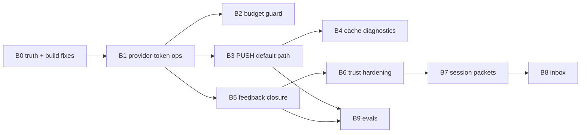

# Membrane Build Plan — The Execution Document

**Date:** 2026-07-26 · **Status:** ready to execute
**This is the doc a building agent opens.** Rationale lives elsewhere and is referenced, not repeated:
[`00-MASTER-SYNTHESIS.md`](00-MASTER-SYNTHESIS.md) = what the research says (validated) · [`01-MEMBRANE-GAP-ANALYSIS.md`](01-MEMBRANE-GAP-ANALYSIS.md) = where membrane stands (corrected 2026-07-26) · [`02-MEMBRANE-IMPROVEMENTS.md`](02-MEMBRANE-IMPROVEMENTS.md) = Sol's validated priority register, whose §5 order this plan adopts.

## Standing constraints (apply to every item)

- Gate discipline is law: cohort/receipt machinery for anything behavior-changing; frozen runs never resumed; `crypt-daily` stays disabled until its own gate closes. Read-only lanes may schedule independently.
- One preregistered experiment contract per experiment. The live cohort contract is **40% reduction / five-point quality margin** (`docs/MEMBRANE-STATE.md` daily-analysis section); the synthesis's 20%/1 pp is a *different* contract. Never blend after results arrive.
- Every published number labeled: measured / calculated / estimated / counterfactual / vendor-reported.
- Content-free telemetry contract unchanged (no prompts, paths, bodies in canonical ledgers).
- Proposal-only learning: nothing auto-applies; no auto-writes to CLAUDE.md/AGENTS.md/hooks.
- Do NOT add: vector platforms, hosted memory, Graphiti, rerankers, multi-hop, learned compressors (all evidence-gated, deferred — 02 §6).

## Repo boundary — read this before reporting anything "missing" (settled 2026-07-26)

Membrane is **the engine half of a two-repo system, not a standalone product**. Commit `e715898` extracted engine + docs + evidence + mcp into `Orthic-Labs/Membrane`; `tools/` was *never* in membrane's git history (`git log --all -- tools` → empty). The Python runtime lives in the parent workspace `/Volumes/D/claude` (itself a git repo) and is fully present there:

| Component believed "missing" | Actual location | Status |
|---|---|---|
| `context-value-daily.py` | `/Volumes/D/claude/tools/pipelines/memory/` (65 `.py` files in that dir) | present |
| hooks (`recall_planner.py` etc.) | `/Volumes/D/claude/tools/hooks/` (44 `.py` files) | present |
| `tools/crypt/` + `tools.crypt.*` package | **retired** — those crates are now `membrane/engine/crates/crypt*` | do not restore; a stale pre-migration path |
| `lib/context-telemetry-registry.json` | canonical at `/Volumes/D/claude/tools/lib/` (9,730 B) | membrane's untracked copy is a **3,754 B stub** — see B0.2 |
| `pytest` | not installed | `python3 -m pip install pytest` — a dependency, not a blocker |

**Contract:** run Python work from the parent workspace (`/Volumes/D/claude`), where hooks already live at the paths the harness invokes. Do **not** vendor the hook/pipeline tree into membrane — two copies of a live production hook is precisely the drift class that already caused an incident (`MEMBRANE-TELEMETRY-IDENTITY.md` failure cause 7, "shim deployment drift"). Membrane vendors exactly one thing: the telemetry registry the Rust crate `include_str!`s.

## Artifact creation map

The plan items create concrete artifacts through these commands and hooks; they are not manual checklist items.

| Item | Creation path | Primary output |
|---|---|---|
| B0 | `cargo test --manifest-path engine/Cargo.toml -p crypt --test context_telemetry --test freshness_test` | registry/graph adapters and state manifest |
| B1 | `cd /Volumes/D/claude && uv run --with pytest --with jsonschema python tools/pipelines/memory/context-value-daily.py --db "$CRYPT_DB" --output tools/.cache/metrics/context-value-daily/$(date -u +%F).json` | content-free token census JSON; `daily-sync.sh`/`context-observatory.sh` schedule it read-only |
| B2/B4 | `cd /Volumes/D/claude && uv run --with pytest --with jsonschema python tools/pipelines/memory/daily-analysis.py --db "$CRYPT_DB" --output-dir tools/.cache/metrics/daily-analysis --days 1` | advisory budget crossings and cache-break diagnostics in JSON + Markdown |
| B3 | enable `CRYPT_PUSH_MODE=shadow` or `on` for an approved cohort, then let `tools/hooks/post_tool_push.py` receive PostToolUse JSON | reversible spill files, audit JSONL, and opportunity-ledger receipts |
| B5 | `crypt feedback ...` / existing post-turn terminal scan | `context_feedback` rows and utility-adjusted recall |
| B6 | `crypt put ...`, `tools/hooks/ingest_memory.py`, and signed `sync.py` mirror events | accepted memories, content-free A0 quarantine records, and signature-verified mirror receipts |
| B7 | SessionEnd JSON into `tools/hooks/session_end_packet.py`, then `session-packet-policy.sh` | review-required Episodic packet, archive, and expiry tombstone under `tools/.cache/memory/session-packets/` |
| B8 | daily report `operator_proposals`, then `recommendation_inbox.append_decision(...)` | proposal-only inbox and append-only human decisions |
| B9 | `uv run --with pytest python tools/pipelines/memory/gap_evals.py`, `context-evals.sh`, and `context-observatory.sh` | deterministic eval results plus separately locked read-only and mutating receipts |

All write paths are fail-open only for observability failures; memory admission, trust rejection, and cohort gates remain fail-closed where stated below. See the parent workspace files named in the table for the exact input schema.

## Work items in execution order

### B0 — Truth boundary + fix the broken build (P0)

1. **Current-state contract:** one dated manifest separating installed/live vs source-only vs historical vs planned claims; binds source commit, installed generation, analyzer version, coverage, the chosen experiment contract, rollback. (02 §4 row 1.)
2. **Telemetry-registry build boundary:** `engine/crates/crypt/src/context_telemetry.rs:130` `include_str!`s `lib/context-telemetry-registry.json`. An untracked **stub** (3,754 B) now sits there and will compile, but it is not the canonical registry (`/Volumes/D/claude/tools/lib/…`, 9,730 B) — a narrowed registry silently weakens the allowlist that rejects unregistered providers/families/phases, so telemetry validation would be laxer than production. **Replace the stub with the canonical file, commit it, and add a test asserting byte-equality (or a recorded SHA-256) against `tools/lib/` so drift fails loudly.** *Task chip filed: "Fix membrane telemetry-registry build boundary."*
3. **Blueprint graph.db adapter — contract now DELIVERED and verified (2026-07-26).** Blueprint shipped the envelope surface membrane requested; measured here at **85–94 ms warm** (3 runs, membrane's own store), inside the 900 ms hook. Fix both readers — `engine/federation/providers/blueprint.py:86-87` and `engine/crates/crypt/src/freshness.rs:538/634` + fixtures `tests/freshness_test.rs:313-323` — against this pinned contract; keep legacy `manifest.json`/`graph.json` paths as fallback for older repos; preserve the sealed-generation rule. *Task chip filed: "Morph membrane to Blueprint's graph.db store."*

   **Pinned envelope** (`blueprint graph manifest`, store `.agent/graph/graph.db`, `storeSchemaVersion: 3`) — verified keys: `schemaVersion`, `storePath`, `storeSchemaVersion`, `generationId`, `provider{id,version,license,precisionTier}`, `lexicalProvider`, `providerComposition{selected,layers[]}`, `complete`, `counts{nodes,edges,joins,supersedes}`, `repo`, `repoRoot`, `fileLimit`, `sourceObservation{head,dirty,statusDigest}`.

   **Read path per consumer:** `freshness.rs` should read the manifest row **directly from SQLite read-only** — the envelope row is ~1 KB / ~1 ms versus ~85 ms for a Node process spawn, and Rust already owns a SQLite stack. Reserve the CLI for the Python provider and as the reference implementation. **Never read `docTruth`** on the prompt path: 8.5 MB / ~205 ms, and it is the sole reason the first envelope reader cost 317 ms.

   **Freshness mapping:** `generationId` → the sealed generation (replaces `graph_body_generation`); `sourceObservation.head` + `.dirty` + `.statusDigest` → committed-snapshot vs dirty-overlay classification, so membrane no longer shells to git for it; `complete` → guard against partial generations; `counts` → now asserted equal to stored rows upstream (they were undercounted 47% before Blueprint's fix — do not pin against pre-fix numbers). WAL is confirmed, so a mid-build read returns the last committed generation, never a torn envelope.

   Verify: freshness suite + dirty-tree federation smoke on a graph.db repo. *(Sandbox note: opening the workspace store from a sandboxed shell fails with `unable to open database file` because SQLite WAL needs to create `-shm`/`-wal`; run against a writable store path or disable the sandbox for that check.)*

**Done when:** focused analysis tests compile from a supported checkout; blueprint lane seals a generation on a graph.db repo; the state manifest exists.

### B1 — Operationalize provider-token analysis + burn attribution (P0, read-only, gate-neutral)

Not a greenfield "observatory" — finish what exists (01 §G2, corrected): the cohort analyzer already joins provider tokens to hook delivery with cached/non-cached separation; `dashboard.html:310` reads `provider_tokens`.

1. Schedule the read-only analysis/census lane independently of `crypt-daily` (02 §4 "separate schedules by risk").
2. Extend the schema-v3 turn census (`tools/pipelines/memory/context-value-daily.py`) to aggregate per session/model/day/client from local Claude/ClaudeMM/Codex transcripts: input, output, cache-read, cache-creation tokens; $ at known prices; cache-hit ratio; top-N tool-result sinks; files read ≥N×; subagent share. Missing sources stay `unavailable`, never zero.
3. Daily operator report (markdown + existing hosted dashboard tile), every ratio with denominator + coverage rate.

**Done when:** a fresh report arrives unprompted; the packet-vs-transcript burn ratio hypothesis in 01 §1 is replaced by a measured number; content-free export tests pass.

### B2 — Advisory budget guard (P0)

Warn/critical ceilings (per-session and daily, token + $) over the B1 ledger. Advisory only; throttling needs separate approval. Verify: deterministic replay of threshold crossings, reset windows, unknown-usage → no false zero. (01 §G13, 02 §4 row 3.)

### B3 — Default-path reversible PUSH (P1, behind cohort gate)

Make compression the default path, not advice (01 §G1: 7 opportunities → 1 use). PostToolUse hook, lowest-loss ladder in order: exact dedup (hash → anchor) → externalize/spill (reuse `runc` spill dir as the CCR store) → typed reduction (code→`skel`, prose→`compress`, command output→`runc`) → error-purge superseded traces. No learned free-text compression. Wire through the existing opportunity ledger (`--opportunity`), identity spine, and cohort machinery; preregister ONE contract before enabling.

**Done when:** raw recovery succeeds for every transformed item; identifier/error/failing-test preservation suite green; matched cohorts meet the preregistered quality margin; non-cached input falls (measured by B1) without worse cache reuse, tool calls, or wall time.

### B4 — Cache-break diagnostics (P1)

Classify cache-ratio drops from B1 data: model change, tool-list/order churn (MCP), permission/cwd/serializer changes, skills-index size. Diagnosis only — no assumed savings, no prompt mutation. **Done when:** every material cache-ratio drop has a bounded reason or `unknown`.

### B5 — Close delivered→used/ignored/contradicted (P2)

Deterministic first: post-turn transcript scan for delivered IDs/paths/symbols writes the existing value terminals; ambiguous → `unknown`. Fix the dead trigger (write-time score constant 0.6, `store.rs:1797`); add retrieval-time recency/frequency decay. Sampled calibrated LLM-judging only after human labels exist. **Done when:** `context_feedback` > 0 production rows; precision measured on a labeled sample; compounding curve computable from B1 + ledger. (01 §G4–G5.)

### B6 — Trust hardening BEFORE session ingestion (P2 — Sol's reorder, adopted)

Additive migrations: `authority` (A0–A5) + `influence_class` columns; injection/secret scan at `crypt put`/Morph intake; provenance-based quarantine; Ed25519 signing of mirror ops; recall `insufficient_confidence` abstention. **Done when:** instruction-escalation and cross-scope suites return zero unauthorized influence; forged/replayed sync ops fail; quarantined data cannot become instruction. (01 §G8, 02 §4 row 7.)

### B7 — Session packets into the existing episodic tier (P3)

`MemoryTier::Episodic` exists (`crypt-core/src/types.rs`) — fill it. SessionEnd hook → archive-first, schema-validated packet (goal, decisions, open work, dead ends, verification, exact identifiers, repo revision, lineage, raw refs) as a typed memory family; promotion to semantic/procedural stays a separate reviewed action; packets expire/demote by policy. **Done when:** packet generation fails closed; a cold session resumes a held-out task with fewer re-reads at non-inferior quality. (01 §G9 corrected, 02 §4 row 8.)

### B8 — Recommendation inbox (P3)

Proposals over B1+B5+ledger evidence: each with traces, current/proposed diff, expected metric, risk, eval, rollback; human accept/edit/reject/defer logged immutably; decisions calibrate ranking. No auto-apply. (01 §G6, 02 §4 row 9.)

### B9 — Eval expansion + risk-separated schedules (P4, ongoing)

Compaction fidelity / next-action / identifier-retention / regret suites (needed the moment B3 ships); stale-memory traps; poisoning/abstention suites (OWASP ASI06 smoke is ~20 lines); session-resume; grow the golden set from every real failure. Read-only vs mutating schedules keep separate names, locks, receipts. (01 §G12/R8, 02 §4 rows 10–11.)

### Deferred (evidence-gated — do not start)

Verification edges (test↔symbol; first to revisit, before LSP/SCIP) · LSP/SCIP · cross-encoder rerank · dynamic-K · multi-hop · learned compressors · new stores.

