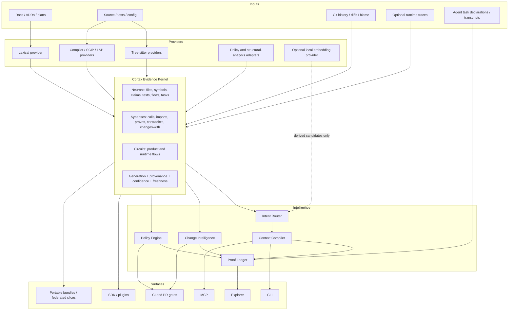

# Cortex Competitor Feature Absorption Guide

**Prepared:** 12 August 2026

**Product:** `Orthic-Labs/Cortex`

**Purpose:** turn the strongest ideas found across 30 competing and adjacent code-intelligence products into one coherent Cortex product architecture and implementation sequence.

> **Reading rule**
>
> This guide separates three things:
>
> 1. **Observed Cortex state** — from the current public repository and the supplied Cortex-specific matrices.
> 2. **Competitor-derived patterns** — from `ds.md`, `k3.md`, `m3.md`, and `sol.md`.
> 3. **Recommendations** — the architecture and backlog proposed here. These are not claims that Cortex already implements them.

### Canonical closure index

`sol.md` is normative. Each requirement atom closes only in its named executable `CX-F` row. This table groups rows for navigation; ranges abbreviate independently atomic rows & never substitute for them. Stale remote-provider recommendations are corrected here to Cortex's local-only constitution.

| Obligation family | Exact atomic `sol.md` closure rows |
|---|---|
| Read-only repository evidence boundary, external writes, compact operations | CX-F01, CX-F13, CX-F60, CX-F71 |
| Evidence/provenance/freshness fields & semantic non-authority | CX-F02–F04 |
| Complete-universe resolution, no-op/store ordering, cancellation/recovery, one publication | CX-F54–F56, CX-F72 |
| Loud failure enum & typed recovery cases | CX-F43 |
| Local-only semantic/data constitution | CX-F36, CX-F47, CX-F67 |
| Feature modes, weighted admission formula, milestone sequence | CX-F69–F70 |
| Intent enum & role-complete context | CX-F28, CX-F38 |
| Repo-scoped `ContextPacketV1` candidate fields & stable digest | CX-F37 |
| Exact/structural/lexical/change/doc-truth/semantic/policy lanes & score components | CX-F33, CX-F39 |
| `ChangePacketV1` fields, classifications, limits, impact/risk components | CX-F40–F41 |
| Dynamic registration & cross-stack route cases | CX-F66 |
| `ProofPacketV1` entities/fields, hash chain, drift, DLP, federation | CX-F29, CX-F42 |
| Policy schema/classes/baselines/suppressions/caps | CX-F30, CX-F51 |
| Temporal Git identity, queries, guardrails | CX-F31, CX-F58 |
| Provider manifest/classes/lifecycle & structural/SAST adapters | CX-F35, CX-F45–F46, CX-F59, CX-F61 |
| LSIF/SCIP import/export/staleness | CX-F63 |
| Bundle manifest, federation, branch/cross-repo/air-gap review | CX-F24, CX-F48, CX-F64 |
| Explorer views, communities, wiki, health, dogfood | CX-F21–F23, CX-F25, CX-F32, CX-F49–F50 |
| Same-machine contract/holdout/multi-model review | CX-F62, CX-F68 |
| Eight CLI/MCP operations & progressive discovery | CX-F44, CX-F71 |
| Correctness, negative, interruption, & recovery fixtures | CX-F43, CX-F54–F55, CX-F73 |
| Retrieval metrics, answer keys, roles, omissions, round trips | CX-F38 |
| Full performance metric/receipt set | CX-F65 |
| Safety suite & prohibited egress | CX-F36, CX-F52 |
| Determinism suite | CX-F03, CX-F32, CX-F50, CX-F74 |
| Sole canonical SQLite authority & derived/export boundary | CX-F75 |
| Resolver-stage profiler fields & native-layout sequencing | CX-F76–F77 |
| Every competitor ledger aspect & deliberate rejection | CX-F01–F35, CX-F53–F62 |
| Clean-room/license/origin discipline | CX-F53 |

---

## 1. Executive decision

Cortex should not try to become the largest code-search server, the most general RAG framework, another terminal code editor, or a generic multi-agent runtime.

Its strongest and most defensible destination is:

> **The local repository truth and change-assurance substrate used by every coding agent.**

The product equation should be:

```text
Cortex
= Evidence Kernel
+ Context Compiler
+ Change Intelligence
+ Proof Ledger
```

That means Cortex should own four questions better than anyone else:

1. **Truth:** What does this repository actually contain, what do its documents claim, and where do they disagree?
2. **Context:** What is Cortex's smallest role-complete repo-scoped candidate packet for this exact task, before Membrane issues final context?
3. **Consequence:** What will a proposed or observed change affect?
4. **Proof:** Why was the work allowed, what evidence was used, what changed, and what verified it?

This direction preserves Cortex’s existing moat—document/code truth, explicit uncertainty, generation-bound evidence, and provenance—while absorbing the best retrieval, graph, change-safety, policy, provenance, and user-experience ideas from the competitor set.

### The key product-boundary decision

**Cortex should remain primarily read-oriented and evidence-producing.** Agents and outer products may write code. Cortex should:

- orient them;
- grant bounded access;
- provide context;
- predict impact;
- enforce policies;
- verify results;
- issue reproducible receipts.

It should not own the coding conversation, edit format, model orchestration, or general-purpose workflow engine. Those features are better exposed through integrations.

---

## 2. How the four research files were reconciled

The supplied analyses are broad and valuable, but they are not equally reliable for every question.

| Source | Best use | Treatment in this guide |
|---|---|---|
| `k3.md` | Most complete Cortex-plus-competitor feature matrix; strong on product boundaries, storage, graph, hooks, signature capabilities | Primary product/feature source |
| `ds.md` | Deep function-by-function comparison of all 30 repositories | Primary competitor implementation source |
| `sol.md` | Cortex-specific architecture, performance evidence, invariants, and optimization ordering | Primary source for Cortex sequencing and non-negotiable correctness constraints |
| `m3.md` | Dense corroborating matrix and cross-repo patterns | Secondary corroboration; exact counts or conflicting shorthand are not treated as canonical |

Where the matrices disagreed, this guide prefers:

1. direct current Cortex code/document evidence;
2. the more specific, path-backed statement;
3. agreement between `k3.md` and `ds.md`;
4. conservative wording when evidence remains ambiguous.

A concrete example is storage: the stronger analysis establishes that `code-review-graph` is SQLite-based, not PostgreSQL. More generally, shorthand counts in the quick-stat sections should not drive architecture decisions without checking the underlying row-level evidence.

---

## 3. Cortex’s current strategic advantage

The current product already has a combination most competitors do not:

- one graph spanning **documents, claims, files, symbols, and relationships**;
- deterministic Phase 1 mapping and receipt-bearing Phase 2 judgment;
- document lifecycle and `supersedes` provenance;
- contradictions surfaced rather than blended away;
- explicit precision and confidence ladders;
- generation-bound SQLite transactions;
- path grants, bounded neighborhoods, a resident watcher, and scoped federation;
- a threat model in which repository content is untrusted data rather than instruction.

That is not merely “code search.” It is a repository epistemology layer: Cortex records what is known, why it is believed, how fresh it is, and what remains unknown.

### Current gaps that matter most

The strongest opportunities are not random missing features. They form a clear sequence:

1. **Make the truth engine faster without weakening soundness.**
2. **Compile task-ready context from the graph.**
3. **Turn diffs into evidence-backed impact and risk.**
4. **Join grants, reads, changes, checks, and verdicts into one proof packet.**
5. **Add optional semantic retrieval as a derived candidate generator—not a new truth source.**
6. **Productize the evidence through policy, bundles, Explorer views, and integrations.**

### Two useful dogfood findings

At the time of review, the public README and the generated architecture document displayed different self-health counts. The README reported one stale/missing-reference pair while the generated architecture page reported another. This is exactly the class of drift Cortex exists to expose.

The current parse-cache source also describes parsing as the expensive part of graph construction, while the supplied measured 550-file baseline attributes most cold-build time to lexical resolution, not Tree-sitter parsing. The comment may have been correct earlier, but the measured fixture now indicates a different bottleneck.

**Immediate product lesson:** Cortex’s release process should use Cortex to reject stale self-claims and stale architectural assumptions.

---

## 4. Non-negotiable invariants

Every absorbed feature must preserve these invariants.

### 4.1 Evidence remains canonical

A vector match, LLM summary, cluster label, generated wiki page, risk score, or review recommendation is derived output. It can nominate, rank, or explain evidence; it cannot silently become canonical truth.

Every promoted fact must retain:

- repository identity;
- generation;
- source path and span;
- content fingerprint;
- provider and provider version;
- precision tier;
- confidence tier;
- freshness domain;
- derivation reason.

### 4.2 Global re-resolution remains global

Cortex’s per-file parse cache is safe because only parse facts are reused. Relationships are re-resolved against the complete current symbol universe. This removes edges to symbols that have been renamed or deleted.

The existing two-hop/500-dependent-file bounds are appropriate for **impact propagation**. They must not be reused as a shortcut for truth resolution.

A future optimization may pre-index the global resolver, but it must produce the same complete result. Typed truncation plus deterministic full fallback is mandatory anywhere completeness can be lost.

### 4.3 Readers see complete generations only

All new tables and derived artifacts must remain generation-pinned. No context packet, policy finding, impact result, vector result, or proof packet may combine rows from different generations without saying so explicitly.

### 4.4 Failure is loud and typed

Unsupported languages, missing compiler evidence, stale indexes, result truncation, event gaps, unavailable semantic providers, cancelled builds, policy timeouts, and incomplete federation must be represented in output—not converted into confident empty results.

### 4.5 Local-only is constitutional

No cloud vector database, hosted graph database, remote model, remote embedding, or repository-derived egress may sit on any Cortex data path. Remote-provider configuration is rejected; repository content, chunks, symbols, claims, embeddings, prompts, & derived payloads never leave machine.

### 4.6 Cortex does not become a tool-count contest

Some competitors expose dozens or hundreds of MCP tools. Cortex should keep a compact default surface and reveal advanced capabilities progressively. The agent should choose among a small number of intent-level operations, not learn the internal object model through trial and error.

### 4.7 Performance claims require benchmark receipts

Every benchmark must identify:

- Cortex commit;
- fixture commit or digest;
- host and runtime;
- warm/cold state;
- sample count;
- raw report location;
- whether the number is locally verified, reproduced upstream, or merely an upstream claim.

---

## 5. Target product architecture



### Architectural layers

#### A. Evidence Kernel

Keep the current SQLite graph as the only canonical local store. Extend the logical model carefully to include:

- change sets;
- git commit/file-change facts;
- stable symbol identity and rename chains;
- policy rules and findings;
- task declarations and observed actions;
- verification runs;
- proof packets;
- optional runtime trace facts.

#### B. Retrieval Plane

Add an intent router, multiple retrieval lanes, graph-aware ranking, and a deterministic repository-candidate assembler honoring caller-supplied grants/budgets. Membrane alone re-resolves policy/freshness, fuses sources, & issues final context.

#### C. Change Plane

Map a git diff or proposed symbol set to affected symbols, flows, tests, documents, policies, and repositories. Produce transparent risk components rather than one opaque score.

#### D. Assurance Plane

Connect a task, grants, evidence reads, observed modifications, verification commands/results, policy findings, and Phase 2 judgments into one hash-addressed proof packet.

#### E. Adapter Plane

Use external engines where they are already excellent:

- ast-grep/GritQL for structural patterns and codemods;
- Semgrep/OpenGrep for SAST and taint;
- dependency-cruiser for JavaScript architecture rules;
- Oxc for optional high-speed JavaScript/TypeScript diagnostics;
- SCIP/LSP/compiler providers for exact resolution;
- a local network-disabled embedding provider as an optional derived index.

#### F. Delivery Plane

Expose compact intent-level CLI/MCP operations, a useful Explorer, CI gates, and same-machine signed bundles.

---

## 6. Absorption decision model

Each competitor feature should enter Cortex through one of five modes.

| Mode | Meaning | Examples |
|---|---|---|
| **Core** | Fundamental to Cortex’s moat and correctness | Context packets, global resolver indexes, change impact, proof ledger |
| **Native optional** | Fits the architecture but may add resources or providers | Local embeddings, git-history enrichment, runtime traces |
| **Adapter** | Best delegated to a mature external engine | Semgrep, OpenGrep, ast-grep, GritQL, dependency-cruiser |
| **UX/workflow pattern** | Recreate the interaction, not the implementation | Aider’s compact repo map, React Doctor’s diff score, Code Review Graph’s wiki |
| **Reject/defer** | Dilutes the product or attacks the wrong bottleneck | Generic agent framework, any cloud RAG, editor ownership, premature native rewrite |

### Proposed scoring formula

Use this before accepting any new feature:

```text
Absorption score
= 30% moat fit
+ 25% user value
+ 20% correctness compatibility
+ 15% local-only/security fit
+ 10% implementation leverage
```

A feature should enter the core only when it scores highly on moat fit and correctness compatibility. High-value but weakly aligned features belong behind adapters.

---

## 7. Prioritized feature program

## P0 — Indexed global resolver and one canonical build path

**Borrow from:** the Cortex performance analysis, Code-Index-MCP’s intent fast paths, Oxc’s measurement discipline, and repo-graph’s compact indexing mindset.

### Why first

The supplied baseline for a 550-file fixture records approximately:

- 23.4 seconds cold build;
- 899 MB peak RSS;
- 21.2 seconds in lexical resolution;
- 2.2 seconds in Tree-sitter parsing;
- 77.9 ms one-file delta;
- 2.7 ms no-op barrier.

For that fixture, resolution—not parsing—is the immediate bottleneck.

### Cortex-native design

1. Build generation-local indexes for:
   - exact qualified name;
   - exact local name;
   - normalized module/import specifier;
   - file and directory scope;
   - provider/precision tier;
   - exported/public symbol;
   - route/config/schema identifiers.
2. Use indexes only to narrow candidates; run the same complete resolution semantics.
3. Remove duplicate generation-hash work and publish each generation once.
4. Route CLI builds through the resident daemon so a repository has:
   - singleflight builds;
   - one per-root queue;
   - existing cancellation;
   - existing deadline and capacity controls.
5. Compact write paths and use prepared/batched statements before adding worker concurrency.
6. Add bounded workers only after measuring peak memory and byte reuse.
7. Consider native arenas or mmap only after the resolver ceases to dominate.

### Required gates

- byte-identical no-op rebuild;
- identical ordered nodes and edges before/after optimization;
- rename/delete ghost-edge fixture;
- cancellation during parse, resolution, and publication;
- crash recovery with the previous complete generation readable;
- benchmark receipt checked into the performance corpus;
- no peak-RSS regression beyond an explicitly approved envelope.

### Explicit rejection

Do not cache resolved edges behind the two-hop/500-file dependent closure. That closure is for impact, not complete truth.

---

## P1 — Task Intent Router and Repository Context Candidate Compiler

**Borrow from:** Roam’s Task Compiler, CodeCompress’s `assemble_context`, Aider’s PageRank repo map, repo-graph’s PPR/activation ranking, Code Review Graph’s minimal context, and treesitter-chunker’s token-aware packing.

### Product outcome

One request should return Cortex's smallest role-complete repo-scoped candidate packet for Membrane/agents, instead of forcing five to ten search/traversal/read calls. It is never a final cross-source or authorization-bearing context packet.

### Proposed intent taxonomy

- `orient`
- `understand`
- `change`
- `debug`
- `review`
- `security`
- `architecture`
- `doc_truth`
- `migration`
- `test`

Intent classification should be deterministic first: syntax, known symbols, paths, stack traces, diff input, and command context. An optional model may refine an ambiguous intent, but the route and confidence must be recorded.

### Retrieval lanes

1. **Exact lane:** symbol IDs, qualified names, paths, line anchors.
2. **Structural lane:** definitions, references, callers, callees, tests, flows.
3. **Lexical lane:** FTS5/BM25, camel-case and identifier tokenization.
4. **Change lane:** proximity to current diff, touched flows, recent commits.
5. **Document-truth lane:** current authoritative claims, contradictions, superseded material.
6. **Semantic lane:** optional candidate generation only.
7. **Policy lane:** relevant rules, exceptions, and required evidence.

### Ranking model

Use an explainable score composed of:

- exactness;
- relationship distance;
- edge precision and confidence;
- task-intent fit;
- graph centrality;
- change proximity;
- document authority/lifecycle;
- test and runtime relevance;
- diversity/novelty;
- recency only after authority;
- semantic similarity, when enabled.

Every included item needs `whyIncluded`. Every excluded high-scoring item should be debuggable.

### Context packing

A repo-scoped candidate packet should guarantee role coverage where applicable:

- task anchors;
- definition/API;
- key callers and callees;
- affected flow;
- tests;
- config/schema;
- authoritative documentation;
- contradictions/stale claims;
- security/policy findings;
- unresolved or truncated evidence.

Use AST/symbol boundaries first, line windows second, and text chunks only as fallback. Deduplicate overlapping snippets and preserve stable item order.

### Suggested contract

```json
{
  "schemaVersion": "cortex.context.v1",
  "packetId": "sha256:...",
  "task": {
    "text": "add rate limiting",
    "intent": "change",
    "intentConfidence": 0.93
  },
  "generation": {
    "repoId": "...",
    "generationId": "...",
    "sourceClock": 412,
    "barrierReceiptId": "..."
  },
  "anchors": [],
  "evidence": [
    {
      "nodeId": "...",
      "path": "src/api/rate-limit.ts",
      "span": {"startLine": 1, "endLine": 82},
      "role": "definition",
      "precisionTier": "AST",
      "confidenceTier": "EXACT_RESOLUTION",
      "whyIncluded": ["exact_symbol", "flow_member", "changed_neighbor"],
      "contentHash": "..."
    }
  ],
  "relationships": [],
  "contradictions": [],
  "coverage": {
    "requiredRoles": [],
    "coveredRoles": [],
    "partial": false
  },
  "omissions": [],
  "tokenEstimate": 2810
}
```

### Required gates

- retrieval corpus with answer-key evidence IDs;
- Recall@K, MRR, role coverage, and contradiction coverage;
- token count versus multi-call baseline;
- packet determinism for an unchanged generation;
- no evidence from outside grants;
- typed truncation and missing-role reporting;
- optional semantic lane must never reduce deterministic answer recall.

---

## P1 — Diff-to-impact Change Intelligence

**Borrow from:** Code Review Graph’s `detect_changes`, Roam’s preflight/verify flow, codebase-memory’s affected-symbol analysis, dependency-cruiser’s `--affected`, React Doctor’s PR-baseline mode, and Brain0’s two-dimensional risk.

### Product outcome

Given a staged diff, branch range, uncommitted worktree, or proposed symbol set, Cortex should answer:

- what changed structurally;
- what calls or depends on it;
- which product/runtime flows are affected;
- which tests and documents should change;
- which policies are triggered;
- where evidence is incomplete;
- how risky the change is and why.

### Change mapping pipeline

1. Parse diff hunks and renames.
2. Map lines to current and prior symbol identities.
3. Classify changes:
   - body-only;
   - signature/API;
   - type/schema;
   - dependency;
   - route/config;
   - test;
   - documentation;
   - deletion/rename.
4. Traverse impact with the existing bounded closure.
5. Join flows, tests, docs, policies, git history, and optional traces.
6. Produce a transparent risk breakdown.

### Risk dimensions

Avoid a single unexplained ML score. Emit components:

- blast radius;
- edge confidence;
- public API exposure;
- centrality/hub/bridge role;
- flow criticality;
- unresolved relationships;
- test coverage gap;
- document contradiction;
- security-sensitive path;
- churn and prior revert/fix history;
- co-change coupling;
- cross-repo impact;
- grant/policy mismatch.

A composite level can be provided, but the components remain canonical.

### Suggested contract

```json
{
  "schemaVersion": "cortex.change.v1",
  "changeSetId": "sha256:...",
  "base": "...",
  "head": "...",
  "changedSymbols": [],
  "affectedSymbols": [],
  "affectedFlows": [],
  "recommendedTests": [],
  "documentsToReview": [],
  "policyFindings": [],
  "risk": {
    "level": "high",
    "score": 78,
    "components": {
      "blastRadius": 20,
      "publicApi": 15,
      "testGap": 18,
      "contradiction": 10,
      "history": 15
    }
  },
  "limits": {
    "maxHops": 2,
    "maxDependentFiles": 500,
    "truncated": false
  }
}
```

### Required gates

- seeded diff corpus with expected affected symbols/flows/tests;
- rename, deletion, overload, dynamic registration, and cross-stack route cases;
- precision/recall reported separately;
- bounded closure emits an explicit truncation boundary;
- unchanged files cannot retain ghost edges;
- score changes are attributable to named evidence.

---

## P1 — Proof Ledger and ChangeEvidence packets

**Borrow from:** Roam’s ChangeEvidence packets, Brain0’s passive provenance/drift/DLP model, Signum’s proofpack, and Cortex’s existing grants, freshness receipts, and sealed verdicts.

### Product outcome

A single packet should answer:

- who or what initiated the task;
- what was declared;
- what authority and path grants applied;
- what evidence was read;
- what context packet was issued;
- what files/symbols actually changed;
- what checks ran and with what result;
- what policies passed or failed;
- where declared intent drifted from observed work;
- what model/provider participated;
- proof that repository-derived outbound payload count remained zero;
- which exact repository generation the conclusion applies to.

### Logical entities

- `task_declaration`
- `grant_receipt`
- `context_packet`
- `observed_read`
- `change_set`
- `verification_run`
- `policy_finding`
- `phase2_verdict`
- `proof_packet`

The physical schema can remain compact; the contract matters first.

### Integrity

Use a local append-only hash chain for packet events. Offer optional Ed25519 signing and same-machine in-toto/SLSA-format export for local CI/audit; remote sinks are rejected.

### DLP and privacy

Record sensitive-read **categories and paths**, never secret values. Provider records identify only local provider/model/config digests; repository-derived outbound payload count is always zero.

### Drift

Compare declared task scope with:

- files read;
- files changed;
- symbols changed;
- commands/checks invoked;
- policies triggered.

Drift is evidence for review, not automatic guilt.

### Required gates

- stable packet digest for identical events;
- tamper detection;
- secret corpus never appears in packet output;
- partial instrumentation is explicitly marked;
- every verdict links to its exact generation and evidence packet;
- federation retains one receipt per repository rather than merging provenance.

---

## P2 — Declarative architecture and change policy engine

**Borrow from:** dependency-cruiser’s forbidden/required rule DSL and baselines, Semgrep’s rule tests, React Doctor’s deterministic diagnostics and PR baseline, Roam’s symbol-keyed suppressions, and Signum’s mechanical gates.

### Product outcome

Teams should encode repository-specific rules without writing Cortex internals.

### Example policy classes

- forbidden dependency or layer crossing;
- required relationship;
- public API change requires test and doc updates;
- database/schema change requires migration evidence;
- route change requires contract/integration test;
- high-risk path requires explicit grant;
- generated output may not be hand-edited;
- current doc must not reference missing symbol;
- unresolved edge not allowed above a confidence threshold;
- repository-derived data may not cross any outbound boundary;
- cross-repo impact must receive all federation receipts.

### Proposed rule shape

```yaml
id: architecture.domain-does-not-import-ui
severity: error
scope: changed
from:
  path: "src/domain/**"
to:
  path: "src/ui/**"
edgeKinds: [IMPORTS, CALLS]
minimumConfidence: SAME_FILE_LEXICAL
message: "Domain code must not depend on UI."
baseline: ".cortex/policy-baseline.json"
```

### Baselines and suppressions

Allow teams to grandfather known findings while blocking new ones. Suppressions should attach to stable symbol IDs or policy-finding fingerprints—not line numbers—so they survive harmless shifts.

### Required gates

- schema validation;
- fixture-based rule tests;
- deterministic output;
- changed-only mode;
- baseline expiry and ownership;
- policy evaluation bounded by time/result caps;
- no policy can silently lower graph confidence.

---

## P2 — Optional local-only hybrid retrieval

**Borrow from:** Code-Index-MCP and Code Review Graph’s hybrid RRF, codebase-memory’s bundled local vectors, Brain0’s offline feature-hash fallback, Claude Context’s Merkle delta indexing, and Context8’s dense+sparse retrieval.

### Design principle

Semantic retrieval should improve discovery, especially for conceptual tasks, but it must remain a derived index.

A semantic hit means “consider this evidence,” not “this claim is true.”

### Three operating tiers

#### Tier 0 — no model, always available

- FTS5/BM25;
- identifier-aware tokenization;
- TF-IDF;
- MinHash/near-clone signals;
- AST/signature features;
- graph diffusion from exact anchors.

This tier preserves Cortex’s constitutional zero egress and may solve much of the semantic gap without an embedding model.

#### Tier 1 — local embeddings

Optional local provider through a capability manifest:

- ONNX or WASM model;
- fixed model digest;
- bounded batch size;
- no network;
- explicit CPU/RAM envelope.

Vectors remain generation- and model-pinned. The existing vectors storage capability can be activated rather than creating another canonical store.

#### Tier 2 — remote embeddings are rejected

No task grant, provider declaration, redaction, or receipt can authorize Cortex repository/model egress. Configuration, environment, manifest, or API input naming a remote embedding/model endpoint fails before payload construction; outbound repository-derived bytes remain zero.

### Retrieval fusion

Use reciprocal-rank fusion first because it is deterministic and robust across incomparable score scales. Add an optional local reranker only after the retrieval corpus proves value.

### Incremental behavior

Key embedding reuse by:

- content hash;
- normalized chunk contract version;
- model digest;
- preprocessing version.

A Merkle/file-digest change set should re-embed only changed evidence. Failed or cancelled jobs must not publish partial vector generations.

### Required gates

- network-disabled zero-egress test for Tier 0/1 plus remote-configuration refusal;
- semantic index can be deleted and rebuilt without losing truth;
- exact symbol queries still take the exact fast path;
- poisoned/zero-vector snapshot recovery;
- hybrid quality improves answer-key recall;
- semantic mode cannot hide low-confidence or unsupported evidence.

---

## P2 — Temporal git intelligence and stable identity

**Borrow from:** Brain0’s artifact/task version graph, Roam’s git co-change and reviewer history, contextplus’s decayed links, and code-review-graph’s graph snapshots.

### Capabilities

- stable symbol identity across rename/move using structural fingerprints;
- commit/file/symbol change facts;
- co-change edges;
- blame/reviewer metadata;
- revert/fix-after-change evidence;
- architecture evolution;
- “when did this become false?” document-truth query;
- “what usually changes with this?” context query;
- “which agent intent led to this change?” provenance query.

### Guardrails

Git-derived signals are historical evidence, not current semantics. Co-change should influence ranking and risk, never assert a call/dependency edge.

Retain compact summaries and pointers rather than duplicating full repository history in the canonical graph.

---

## P2 — Structural analysis and SAST provider adapters

**Borrow from:** ast-grep, GritQL, Semgrep, OpenGrep, Oxc, and dependency-cruiser.

Do not rebuild all of these engines inside Cortex. Define a strict provider contract.

### Provider manifest

A provider should declare:

- capability: parse, resolve, lint, taint, architecture, rewrite, trace;
- languages;
- precision tier;
- process/network permissions;
- input scope;
- output schema;
- timeout and result caps;
- provider version and digest;
- whether it can mutate source.

### Adapter priorities

1. **Semgrep/OpenGrep:** findings, taint paths, supply-chain/security evidence, SARIF.
2. **ast-grep:** deterministic structural search, custom project rules, snapshot-tested matches.
3. **GritQL:** large-scale structural query and optional codemod planning.
4. **dependency-cruiser:** JS/TS module policy and architecture reports.
5. **Oxc:** optional high-throughput JS/TS diagnostics and semantic facts.
6. **SCIP/LSP/compiler providers:** exact symbol resolution and type-aware relationships.

Mutation-capable adapters should default to preview/diff mode. Cortex records proposed and actual changes but does not silently execute them.

---

## P3 — Same-machine evidence bundles and safe federation

**Borrow from:** CodeGraphContext bundles, codebase-memory’s compressed graph artifact, Code-Index-MCP’s GitHub Artifacts sharing, and repo-graph’s compact snapshots.

### Proposed `.cortex-bundle` contract

- repository identity;
- source commit and dirty-state fingerprint;
- generation manifest;
- schema/provider versions;
- canonical evidence rows;
- optional derived FTS/vector material;
- capability coverage;
- benchmark/build receipt;
- redaction manifest;
- signature;
- secret-bearing raw content is always absent; explicit inclusion is rejected.

Bundles are process-portable on one machine only. They never authorize cross-machine or network transfer; repository-derived outbound payload count remains zero.

### Uses

- one local build serves local clients;
- offline local code review;
- air-gapped local operation;
- local reproducible bug replay;
- locally pre-indexed public libraries;
- local federated multi-repo queries.

Federation must continue to keep each repository’s generation and receipt independent.

---

## P3 — Explorer, architecture views, and explainable health

**Borrow from:** codebase-memory’s graph UI, Brain0’s time travel, Code Review Graph’s wiki/community views, dependency-cruiser’s interactive explorer, Context8’s project dashboard, and React Doctor’s score.

### Explorer should prioritize utility over spectacle

Recommended views:

1. **Truth:** claims, verdicts, contradictions, supersession.
2. **Task context:** why every item entered a context packet.
3. **Change impact:** changed nodes, closure, tests, docs, risk components.
4. **Architecture:** communities, hubs, bridges, flows, boundaries.
5. **Timeline:** renames, co-change, reversions, document drift.
6. **Proof:** grants, reads, changes, checks, receipts.
7. **Coverage:** languages/providers/precision/unsupported zones.
8. **Retrieval debugger:** lane scores, fusion, omitted candidates.
9. **Policies:** baseline, new findings, suppressions.
10. **Performance:** build stages, cache reuse, memory, cancellation.

A single health score may be useful, but it must decompose into freshness, coverage, contradictions, unresolved edges, test gaps, policy findings, and store health.

### Dogfood release gate

The README’s “Cortex on Cortex” facts and generated product/architecture documents should be generated or verified in the same release pipeline. Hard-coded counts should fail CI when they no longer match the sealed generation.

---

## P3 — Plugin and capability ecosystem

**Borrow from:** LlamaIndex’s abstractions, PraisonAI’s lifecycle hooks, tree-sitter’s grammar ecosystem, Code-Index-MCP’s plugin sandboxing, and Cortex’s existing SDK/admission surfaces.

### Keep the core contract small

Recommended capability classes:

- `EvidenceProvider`
- `ResolverProvider`
- `RetrievalProvider`
- `DiagnosticProvider`
- `VerificationProvider`
- `TraceProvider`
- `EmbeddingProvider`
- `Exporter`
- `PolicyPack`

Every plugin must be independently versioned, permission-declared, and testable against conformance fixtures.

### Progressive discovery

Expose a small default MCP surface. Advanced providers register capabilities and resources; agents can request expansion only when the task needs it.

---

## P4 — Optional contract and multi-model review

**Borrow from:** Signum’s contract/holdout/proofpack model, AI Code Audit’s five-perspective fan-out/fan-in, Aider’s architect/editor split, Mentat’s Revisor, and PraisonAI’s provider routing.

### Correct placement

This should be an optional same-machine, network-disabled assurance workflow above the evidence kernel, not Cortex’s canonical analyzer. Remote reviewers/providers are rejected.

A high-risk task may request:

1. deterministic mechanic checks;
2. holdout tests not revealed to the implementing agent;
3. security/performance/architecture reviewers;
4. synthesis of disagreements;
5. re-verification;
6. human review when reviewers conflict or evidence is incomplete.

Every model output remains a judgment tied to evidence and fingerprints.

### Why deferred

Multi-model review is valuable but expensive and nondeterministic. It should come after Cortex can deliver excellent deterministic context, impact, policy, and proof packets.

---

## 8. All-competitor absorption ledger

The point is not to copy every product. It is to take each product’s strongest idea and put it in the right Cortex layer.

| Competitor | Best feature to absorb | Cortex-native form | Mode | Priority / guardrail |
|---|---|---|---|---|
| **tree-sitter** | Incremental, error-tolerant parsing and query captures | Preserve Tree-sitter provider; add changed-range parsing where editor/daemon events provide old trees; use query packs as provider plugins | Core/provider | High; never confuse CST edges with semantic truth |
| **ast-grep** | Code-shaped structural queries, metavariables, YAML rule tests | Structural query/policy adapter with fixture snapshots and evidence spans | Adapter | High; do not build another AST DSL first |
| **Oxc** | Extremely fast JS/TS parser, semantic tables, CFG, diagnostics | Optional JS/TS precision/performance provider | Adapter/native optional | Later; current measured bottleneck is not parser speed |
| **Semgrep** | Mature pattern/taint rules, rule tests, agent post-write scans, SARIF | Security/quality provider plus post-change verification pack | Adapter | High; findings are evidence, not canonical graph edges unless mapped |
| **OpenGrep** | Strong intrafile taint, self-contained execution, resource limits | Alternate SAST provider; adopt timeout/max-match/typed-limit discipline | Adapter/pattern | Medium; keep engine choice user-controlled |
| **GritQL** | Any snippet as query, first-class rewrites, reusable pattern modules, no-match cache | Structural query/codemod-plan provider; borrow negative-result cache keys for expensive policy packs | Adapter | Medium; Cortex records/validates changes rather than owning rewrite execution |
| **CodeGraphContext** | Cypher-like graph access, compiler/SCIP precision, portable bundles | Stable graph-query abstraction, SCIP provider, same-machine signed Cortex bundles | Core + adapter | High; do not add a second graph database or transfer repository-derived payloads |
| **repo-graph** | PPR/activation ranking, cross-stack HTTP edges, compact mmap graph, token-aware rendering | Graph-aware context ranking; route/handler providers; compact same-machine bundle/export experiments | Core/provider | High ranking; native/mmap later only after measurement |
| **repo-lens** | Very simple analyzer registry and fast stack inventory | Lightweight manifest/stack evidence providers and clone-analyze-cleanup utility | Provider/UX pattern | Medium; useful onboarding fast path |
| **code-review-graph** | Git-diff impact, communities, hubs/bridges, risk, wiki, cross-repo registry | Change Intelligence, architecture communities, review packets, federated registry | Core | Very high |
| **Code-Index-MCP (Consiliency)** | Query-intent routing, fail-closed readiness, hybrid RRF, index artifact sharing | Intent router, exact fast path, readiness contract, optional hybrid retrieval, same-machine artifact reuse | Core/native optional | Very high |
| **code-index-mcp (johnhuang316)** | Shallow/deep tiers, best-native-search auto-detection, schema mismatch refusal | Fast shallow orientation; deep evidence on demand; external grep selection; fail-closed index compatibility | Core/pattern | High |
| **codebase-memory-mcp** | Broad language coverage, local vectors, openCypher, exact architecture tools, coverage hooks, portable compressed graph | Expand provider ecosystem; local semantic tier; graph query; coverage receipts; bundle format | Core/provider | High; avoid importing its huge surface or RAM profile wholesale |
| **Claude Context** | Merkle changed-file embedding sync, abort-aware indexing, snapshot recovery | Semantic-index delta pipeline with cancellation and poisoned-snapshot rejection | Native optional | High when embeddings arrive; no cloud or network path |
| **Context8** | Hybrid dense+sparse search, generated wiki/snippets, project dashboard | Optional hybrid lane and evidence-grounded architecture/wiki UI | Native optional/UX | Medium; do not require PostgreSQL/Qdrant/Redis for local Cortex |
| **Context+** | Shadow restore points, spectral clustering, wikilink feature hubs, decayed links | Optional agent-write restore receipt; architecture clusters; docs-to-code feature hubs; temporal ranking | Core/adapter pattern | Medium-high; restore remains outer-agent integration |
| **Roam Code** | Task Compiler, preflight/verify gates, ChangeEvidence, symbol-keyed suppressions | Context Compiler, change gates, Proof Ledger, stable policy suppressions | Core | Very high |
| **CodeCompress** | One-shot context assembly, hot-path extraction, snapshots/deltas, root confinement | `cortex context`, focused snippets, change packets, retain strict path boundary | Core | Very high |
| **Signum** | Contract-first execution, holdouts, proofpacks, multi-model audit loop | Optional task contract and high-assurance review profile over Cortex evidence | Native optional/integration | Medium-high after deterministic layers |
| **RepoDoctor** | Versioned prompt templates, safe-by-default output, useful generated reports | Versioned review prompt packs and report generators consuming proof/context packets | UX/integration | Medium; never make LLM prompts the sole analyzer |
| **AI Code Audit** | Parallel specialist reviews and post-audit Q&A | Optional architecture/security/quality/performance review fan-out over the same sealed evidence | Integration | Medium; expensive and nondeterministic |
| **React Doctor** | Deterministic no-LLM diagnostics, changed-only baseline, explainable score, updated fix playbooks | Policy packs, PR delta score, rule guidance resources, UI/design provider | Adapter/UX pattern | High for deterministic CI pattern |
| **Aider** | Token-budgeted PageRank repo map and architect/editor separation | Graph-centrality ranking and compact orientation map; keep edit agent separate | Core pattern | High for ranking; reject editor ownership |
| **Mentat** | Revisor second pass and token-budgeted line-interval context | Optional review pass and interval fallback in context packing | Integration/pattern | Low-medium; do not adopt comment-triggered autonomous writes |
| **PraisonAI** | Lifecycle event bus, allow/deny/ask hooks, model routing, shadow checkpoints, workflow compiler | Plugin lifecycle events and external orchestration adapter | SDK/integration | Medium; reject becoming a general agent framework |
| **Brain0** | Passive provenance, intent-vs-commit drift, DLP read audit, two-dimensional risk, signed attestations, time travel | Proof Ledger, drift, sensitive-read categories, history risk, signed same-machine packet export, timeline UI | Core | Very high |
| **Cognee** | Temporal/provenance-aware graph memory, ontology resolution, OTEL, memory migration | Optional memory/trace adapter and observability conventions | Adapter | Medium; do not let LLM-extracted generic KG replace code evidence |
| **LlamaIndex** | Pluggable retrievers/stores, fusion, callbacks, workflows, broad connectors | Borrow interfaces and instrumentation patterns; expose Cortex as a retriever/tool | SDK/integration | Medium; do not import the framework wholesale |
| **dependency-cruiser** | Declarative architecture rule DSL, baselines, affected mode, many reporters | Cortex policy DSL, grandfathered baseline, changed-only CI, same-machine Mermaid/D2/HTML exporters | Core + adapter | Very high |
| **treesitter-chunker** | Stable boundary IR, deterministic IDs, token-aware packing, graph-cut context, streaming | Context boundary contract, packer, deterministic chunk IDs, large-file streaming | Core/library pattern | Very high |

## 9. Feature combinations only Cortex can make especially valuable

The strongest outcome is not parity. It is combining competitor ideas with Cortex’s evidence model in ways competitors generally cannot.

### 9.1 Truth-aware Context Compiler

A typical context tool retrieves relevant code. Cortex can retrieve:

- the code;
- the authoritative document claim;
- the superseded plan that should not be followed;
- the contradiction between them;
- the confidence and source fingerprint for each item.

### 9.2 Contradiction-aware impact analysis

A normal blast-radius tool finds callers. Cortex can also say:

- which current documents become stale if the change lands;
- which already-stale documents will become more misleading;
- which tests are the executable proof for the claim being changed.

### 9.3 Proof-sealed retrieval

A normal RAG response is difficult to reproduce. Cortex can seal its exact repo-scoped candidate packet to:

- repository generation;
- freshness barrier;
- retrieval algorithm version;
- token budget;
- provider set;
- evidence hashes.

### 9.4 Evidence-grounded agent drift

Brain0-style declared-versus-done analysis becomes stronger when “done” is not just a git diff. Cortex can compare the task with structural impact, document truth, policies, grants, and verification evidence.

### 9.5 Federated proof without graph contamination

Cortex can answer a cross-repo task while retaining independent generations, confidence, omissions, and receipts for each repository. This is stronger than raw-merging graphs into an apparently unified but freshness-ambiguous store.

### 9.6 Semantic discovery without semantic authority

Cortex can use vectors to find candidates while requiring deterministic graph/doc evidence before making a truth claim. This preserves trust while gaining conceptual search.

---

## 10. Recommended compact CLI and MCP surface

Keep intent-level operations small and consistent.

| Operation | Purpose |
|---|---|
| `cortex orient [task]` | Decide whether Cortex has sufficient fresh evidence and return anchors |
| `cortex context <task>` | Compile sealed repo-scoped context candidates under caller grant/budget; never issue Membrane’s final packet |
| `cortex search <query>` | Auto-route exact, structural, lexical, graph, and optional semantic retrieval |
| `cortex impact [diff|node|path]` | Produce ChangePacket and transparent risk |
| `cortex verify [diff|packet]` | Run policy/check providers and produce verification evidence |
| `cortex truth [scope]` | Claims, contradictions, lifecycle, and current proof |
| `cortex proof <task-or-packet>` | Inspect or same-machine export the ProofPacket |
| `cortex status` | Freshness, coverage, providers, limits, and readiness |

Advanced graph, policy, provider, bundle, and debugging tools can remain available through a discover/expand mechanism rather than occupying the default agent surface.

---

## 11. Evaluation and qualification program

Cortex already contains evaluation and performance directories. Extend them into a release-defining qualification system.

### 11.1 Correctness suite

- symbol rename/delete ghost edges;
- import aliasing and ambiguous references;
- provider precedence;
- document supersession and invalid lifecycle markers;
- stale generation rejection;
- dirty overlay/commit transitions;
- cross-repo receipt independence;
- unsupported-language loud partial;
- cancelled build/publish recovery.

### 11.2 Retrieval suite

For each task:

- expected anchor nodes;
- expected evidence roles;
- must-include contradiction;
- must-not-include paths;
- minimum precision tier;
- token budget;
- semantic-off answer;
- semantic-on answer.

Report:

- Recall@1/5/10;
- MRR;
- role coverage;
- contradiction coverage;
- unsupported/partial rate;
- tokens and evidence density;
- number of tool round trips avoided.

### 11.3 Change suite

Seed commits that represent:

- body-only change;
- public signature change;
- rename/move;
- route/schema/config change;
- test deletion;
- cross-repo API change;
- security-sensitive change;
- dynamic registration.

Measure affected-symbol, flow, test, and doc precision/recall independently.

### 11.4 Performance suite

Track:

- cold build stage times;
- warm/no-op build;
- one-file delta;
- exact query through daemon;
- context compilation;
- impact query;
- peak RSS;
- store size;
- cache hit/reuse count;
- cancellation latency;
- recovery result.

Use relative gates against the same fixture and host class. Do not compare unlike hardware as though the numbers were equivalent.

### 11.5 Safety suite

- secret corpus on every egress surface;
- path traversal, symlink, junction, archive escape;
- malicious repo instructions;
- poisoned provider/grammar/update manifests;
- provider permission escalation;
- remote embedding/model configuration refusal and outbound repository-derived bytes `0`;
- policy/result/time caps;
- malformed/partial bundle handling.

### 11.6 Determinism suite

- byte-identical generated artifacts on no-op;
- stable ContextPacket/ChangePacket/ProofPacket hashes;
- stable ranking ties;
- stable community seed;
- stable rule findings;
- identical output after semantic index deletion when semantic mode is off.

---

## 12. Sequenced implementation milestones

No milestone should start by importing a large new framework. Each stage should leave Cortex more useful and preserve the previous stage’s contracts.

### Milestone A — Truth-engine performance and dogfood consistency

Deliver:

- indexed global resolver;
- one generation publication path;
- daemon singleflight for builds;
- build cancellation/recovery gates;
- benchmark receipts;
- README/generated-doc consistency gate;
- updated architecture comments and docs reflecting measured behavior.

Exit only when correctness outputs are frozen and the measured resolver cost falls materially without a memory or soundness regression.

### Milestone B — Context Compiler

Deliver:

- intent taxonomy and deterministic router;
- repo-scoped ContextPacket candidate schema & Membrane-authority boundary;
- exact/structural/lexical/document lanes;
- graph-aware ranking;
- token packer and role coverage;
- `cortex context` and MCP equivalent;
- retrieval corpus and debugger.

### Milestone C — Change Intelligence

Deliver:

- diff/rename-to-symbol mapping;
- affected flows/tests/docs;
- transparent risk components;
- ChangePacket schema;
- preflight and review commands;
- changed-only CI output.

### Milestone D — Policy and Proof

Deliver:

- policy DSL and baseline;
- symbol-keyed suppressions;
- verification provider contract;
- ProofPacket and local hash chain;
- drift and sensitive-read categories;
- signed same-machine export option; remote sink refusal.

### Milestone E — Optional semantic and temporal enrichment

Deliver:

- deterministic Tier 0 semantic signals;
- local embedding provider;
- RRF fusion;
- Merkle/digest reuse and cancellation;
- git co-change, rename identity, and history risk;
- remote provider configuration refusal with network-disabled zero-egress proof.

### Milestone F — Ecosystem and productization

Deliver:

- Semgrep/OpenGrep/ast-grep/dependency-cruiser adapters;
- same-machine bundles and local artifact reuse;
- Explorer truth/context/impact/proof views;
- architecture communities/wiki;
- progressive MCP capability discovery;
- optional same-machine network-disabled contract/holdout/multi-model review integration.

---

## 13. Immediate engineering backlog

This is the recommended first implementation slice.

1. **Freeze the golden graph and retrieval order.** Add explicit fixtures for ghost edges, provider precedence, no-op byte identity, and cancellation.
2. **Create a resolver-stage profiler.** Emit candidate count, lookup type, time, and allocation by edge class.
3. **Implement global symbol-universe indexes.** Preserve exact current resolution semantics.
4. **Remove duplicate generation hashing/publication.** One authoritative generation identity and one transactional publication.
5. **Route all builds through daemon singleflight.** Reuse current queue, deadlines, abort signals, and per-root identity.
6. **Define `cortex.context.v1`.** Contract first, then implement exact/graph/lexical lanes.
7. **Build the retrieval answer-key corpus.** Include conceptual tasks, exact symbols, stack traces, docs, contradictions, and negative paths.
8. **Define `cortex.change.v1`.** Map diff hunks and renames to symbols, then reuse the existing impact bounds.
9. **Define `cortex.proof.v1`.** Start with grants, context packet, changed paths, checks, policies, and generation receipts.
10. **Add a minimal policy DSL.** First rules: forbidden dependency, public API without test/doc, generated-file edit, unresolved edge, any repository-data egress.
11. **Dogfood every release.** Run Cortex on Cortex and fail mismatched README/generated health facts.
12. **Only then run the optional embedding experiment.** Compare Tier 0 versus local embeddings on the fixed retrieval corpus before choosing a model or runtime.

---

## 14. What Cortex should deliberately not absorb

### 14.1 A networked vector-service stack

PostgreSQL + Qdrant + Redis may be appropriate for another hosted product, but Cortex must not configure or depend on that stack. Its semantic lane remains optional, local, network-disabled, derived, & non-authoritative.

### 14.2 A generic multi-agent framework

Agent teams, handoffs, bot gateways, and workflow orchestration are valuable integrations. They are not Cortex’s core.

### 14.3 Code-editor ownership

Aider and Mentat are strong editors. Cortex should make editors and agents safer rather than compete with them.

### 14.4 Hundreds of default MCP tools

A huge surface increases agent selection errors and maintenance. Prefer eight intent tools plus progressive capability discovery.

### 14.5 LLM-extracted generic graph facts as canonical code truth

LLM extraction is useful for labels, summaries, hypotheses, and Phase 2 judgments. Structural code claims still require deterministic or compiler evidence.

### 14.6 A second truth store

Do not add Neo4j, Postgres, or a vector database as another canonical graph. Export to them if users need analytics; keep SQLite authoritative.

### 14.7 Bounded relationship resolution

Do not trade away ghost-edge prevention for incremental speed. Index the full resolver instead.

### 14.8 Premature native rewrite

The supplied baseline says the current fixture spends under ten percent of cold-build time in Tree-sitter. A Rust/C rewrite before fixing resolution would optimize the smaller stage and multiply maintenance.

### 14.9 A flashy graph UI before task utility

The Explorer should answer truth, context, impact, and proof questions first. A 3D view can be optional, not the product’s primary interaction.

### 14.10 Opaque scores

A health or risk score without evidence components would contradict Cortex’s philosophy. Every score must be decomposable and reproducible.

---

## 15. Clean-room and licensing rule

“Absorb” should mean one of:

1. implement the behavioral pattern independently from public descriptions;
2. invoke an installed competitor through a documented adapter;
3. depend on a library only after license and distribution review;
4. use an interoperable output format such as SARIF, SCIP, GraphML, or MCP.

Do not copy source, schemas, prompts, tests, or branding merely because a feature is attractive. Record origin and implementation mode in each feature ADR.

---

## 16. Final recommendation

The path to the “absolute best” Cortex is not to accumulate every competitor’s surface area.

It is to combine their strongest mechanisms under Cortex’s stricter truth model:

- Tree-sitter’s incremental structure;
- Code-Index-MCP’s intent fast path;
- Aider/repo-graph ranking;
- CodeCompress/Roam context compilation;
- Code Review Graph’s diff impact;
- dependency-cruiser/React Doctor policy discipline;
- Semgrep/OpenGrep diagnostics;
- Brain0/Roam/Signum provenance and proof;
- Claude Context’s delta semantic indexing;
- codebase-memory’s local breadth;
- Context8/Code Review Graph architecture UX;
- LlamaIndex/PraisonAI plugin patterns.

The product should emerge as:

> **Cortex: the evidence-backed context, consequence, and proof layer between a repository and every agent that changes it.**

That is a larger opportunity than code search, and it is far more defensible than attempting to out-feature generic RAG or agent platforms.

---

## Source map used for this guide

### Supplied research

- `k3.md`: Cortex baseline and complete function matrix; purpose and category (lines 45–79), storage through graph/search/hooks (lines 117–403), and signature capabilities (lines 657–692).
- `ds.md`: 30-repository function comparison; storage through graph/parsing (lines 39–183), indexing through agent integration (lines 224–368), and distinctive features (lines 446–479).
- `sol.md`: Cortex performance/resource analysis and correctness-preserving optimization order (lines 58–93), plus freshness, search, security, and output comparisons (lines 95–117).
- `m3.md`: corroborating distinguishing features (lines 185–197) and cross-repo patterns (lines 201–214).

### Live Cortex repository check

Reviewed current public README, generated architecture and implementation-status documents, security policy, graph/store structure, parse-cache behavior, daemon cancellation/build path, and evaluation directory on 12 August 2026.
