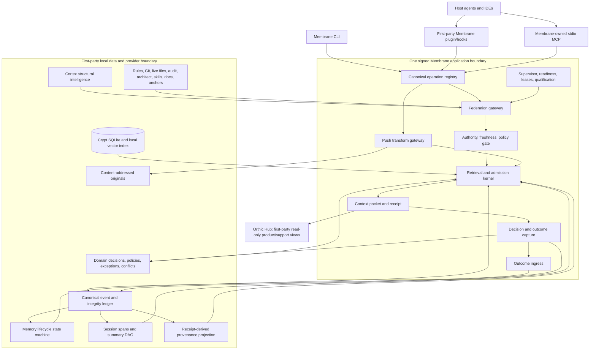

# Membrane Competitive Feature Absorption Guide

**Canonical first-party-only edition — original comparison set + Semantica research + alternate-guide reconciliation**
**Date:** 12 August 2026
**Target:** `Orthic-Labs/Membrane`
**Runtime policy:** No third-party MCP servers, hosted services, sidecars, databases, models, plugins, or competitor packages are required or consumed at runtime.
**Surface policy:** Membrane exposes its **own MCP server**, its **own CLI**, and thin **first-party host plugins/hooks**, all backed by one canonical operation registry.
**Sibling policy:** Orthic-owned components such as Crypt, Cortex, and Orthic Hub may participate through versioned first-party contracts; they must be bundled or installed as a signed, compatible Orthic release set rather than fetched from third parties.
**Research policy:** Competitor repositories—including Semantica—are specification and test-fixture inputs only. Their useful mechanisms are reimplemented inside first-party Orthic code.
**Purpose:** Absorb the strongest mechanisms found across the original 36-repository comparison set plus Semantica without importing competitor runtimes, delegating correctness to external systems, duplicating sibling products, or diluting Membrane's product identity.

### Meaning of “no external dependencies” in this guide

The binding product requirement is **zero external runtime dependency**:

- no third-party MCP server or MCP gateway;
- no vendor API or hosted memory/context service;
- no external Postgres, Redis, Qdrant, Neo4j, vector service, reranker, or model endpoint;
- no competitor process, sidecar, container, package, plugin, checkout, or dynamic download;
- no network connection required for local correctness, retrieval, policy, receipts, recovery, export, update verification, or rollback.

This is distinct from **literal zero third-party source libraries**. The current repository uses pinned npm packages and Rust crates. Those are build/supply-chain inputs, not runtime services, and should be locked, audited, SBOM-recorded, and bundled into signed Orthic artifacts. A literal “standard library only” rule would be a separate major rewrite and is not assumed here.

## 1. Executive decision

Membrane should not become an all-in-one agent framework, a second code-indexing engine, or a hosted memory platform. Its best possible form is a **trustworthy context control plane**: the system that decides what enters an agent's attention, in what form, under what authority and freshness, with exact recovery and a receipt for every inclusion, omission, transformation, substantive decision binding, and later outcome.

The comparison set confirms that Membrane already owns several unusually strong foundations:

- typed context and receipt contracts;
- explicit authority and freshness rather than one flattened similarity score;
- one cross-provider attention budget;
- local-first SQLite and local embeddings;
- repository-bound scope grants;
- replaceable providers;
- reversible source references and anchors;
- a deliberately small public MCP surface;
- a resident federation path rather than per-request process startup.

The right strategy is therefore **not feature accumulation**. It is to strengthen eight rails around the existing kernel:

1. **Runtime-truth rail:** qualify the installed path, provider readiness, fault isolation, release identity, and support claims before promoting new behavior.
2. **Outcome rail:** prove what delivered context was actually used, ignored, contradicted, expanded, harmful, or supported by downstream evidence.
3. **Memory lifecycle:** make durable memory typed, deduplicated, temporal, supersedable, reviewable, and safely forgettable.
4. **Structured Push:** transform tool output through deterministic format-aware reducers, query-aware closure, exact recovery, and cache-stable deltas.
5. **Diversified Pull:** combine lexical, vector, graph, temporal, precedent, and source-diversity signals without pretending their raw scores share one scale.
6. **Session and hook continuity:** cover the complete host lifecycle, preserve bounded working state across compaction and handoff, and capture failures without swallowing them.
7. **Decision and provenance rail:** bind substantive decisions to exact packet/receipt evidence, policy versions, exceptions, precedents, causal relations, temporal truth, conflicts, and outcomes.
8. **Integrity and productization:** signed provenance, DLP/read auditing, narrow deterministic policy enforcement, risk signals, conformance, installed-path qualification, and a value ledger.

### 1.1 First-party-only deployment constitution

1. **Competitors are research, never runtime.** Membrane may reproduce a behavior, algorithm, schema idea, or fixture derived from a competitor; it may not call, install, proxy, wrap, embed, or require the competitor's MCP server, SDK, daemon, cloud service, package, container, or database.
2. **Only Membrane's MCP server is registered with host agents.** Membrane is not an MCP aggregator and does not act as an MCP client for third-party servers.
3. **All runtime providers are first-party.** Cortex, Crypt, rules, Git, live files, audit, architect, skills, docs, and anchors are Orthic-owned implementations or in-process/local operating-system capabilities.
4. **No remote correctness path exists.** Network access may never be required to construct a valid packet, enforce scope, retrieve durable knowledge, verify provenance, recover an anchor, or roll back a release.
5. **No dynamic plugin ecosystem exists in the trusted path.** Host integrations and optional readers are signed first-party modules released with Membrane. There is no marketplace, arbitrary plugin loader, or runtime package download.
6. **One signed release set owns compatibility.** Membrane, Crypt, Cortex, host adapters, schemas, models, and migrations carry compatible release identities. Missing or mismatched first-party components degrade explicitly rather than fetching replacements.
7. **Absorption is clean first-party reimplementation.** The default is behavioral specification plus golden fixtures. Source copying requires separate license/provenance approval and still produces Orthic-owned code with no vendor runtime dependency.

### 1.2 MCP, CLI, and plugin/hooks are complementary—not alternatives

| Surface | Primary user | Responsibility | Hard boundary |
|---|---|---|---|
| **Membrane's own MCP server** | Host agents and generic MCP clients | Canonical structured agent contract: the existing ten tools, resources, typed results, scope authorization, and receipts over stdio. | It never forwards to, discovers, installs, or proxies another MCP server. |
| **Membrane CLI** | Humans, CI, installers, support, automation | Install, doctor, status, update, rollback, uninstall, import/export, explicit inspection, and command-line parity for core operations. | It calls the same application services and schemas as MCP; it is not a second implementation. |
| **First-party plugin/hooks** | Hosts with lifecycle APIs such as Claude Code or Codex | Thin lifecycle bridge: register Membrane, normalize SessionStart/prompt/tool/compaction/session events, inject context, and perform supported output replacement. | No ranking, storage, policy, retrieval, or competitor integration logic lives in the plugin. |
| **Local internal IPC/API** | Membrane, Crypt, Cortex, supervisor | Versioned first-party communication between trusted Orthic components. | It is not exposed as a third-party extension mechanism and is never an MCP-to-MCP gateway. |

Required distribution:

```text
host or IDE
  ├─ first-party Membrane hooks/plugin ─┐
  └─ MCP client ────────────────────────┤
                                       ▼
                         one signed `membrane` release
                         ├─ stdio MCP mode
                         ├─ CLI mode
                         ├─ loopback/API mode
                         └─ supervisor-child mode
                                       │
                          typed first-party local IPC
             ┌─────────────────────────┼─────────────────────────┐
             ▼                         ▼                         ▼
       Crypt/local store          Cortex structural       rules/Git/live files/
       and local vectors          intelligence            audit/docs/skills
```

For a host that supports MCP and hooks, use **both**: MCP for explicit agent operations and hooks for lifecycle events the model would otherwise have to remember to call. For a generic MCP client, the MCP server is sufficient. For humans and CI, use the CLI. All three surfaces must be generated from one operation registry and tested for parity.

### The central ownership rule

- **Cortex discovers repository facts and structural relationships.** It is an Orthic first-party component consumed through a typed, freshness-bound local contract. Membrane must never import Cortex source, read its graph database, spawn an arbitrary checkout, or build a competing tree-sitter/LSP/code graph.
- **Membrane core owns scope, provider federation, context admission, context transformation, decision-evidence binding, session continuity, policy enforcement, and receipts.**
- **Crypt owns the local durable baseline for memories, substantive decisions, policies, exceptions, conflicts, temporal facts, and append-oriented lifecycle projections.**
- **Semantica is research evidence only.** Its decision, provenance, bitemporal, conflict, and policy ideas are reimplemented first-party in Membrane/Crypt. No Semantica provider, SDK, MCP server, sidecar, process, database, or write-back path is part of the product.
- **The host/Legion owns agent spawning, scheduling, worktrees, review gates, and merges.** Membrane carries task, overlay, lease, handoff, and evidence envelopes but is not the orchestrator.
- **Orthic Hub owns fleet and operator UI decisions.** Membrane produces read-only status, receipts, portable commands, and canonical trace snapshots; it does not invent fleet actions or a fourth process plane.

This keeps the product coherent while absorbing competitor mechanisms entirely inside the first-party Orthic boundary.

### 1.3 Reconciliation verdict: where the alternate guide differed

The alternate `membrane-best-of-competitors-absorption-guide.md` was directionally strong, but it made two material ownership/order errors and several useful additions.

| Question | Alternate guide | Corrected final decision | Why |
|---|---|---|---|
| Who builds structural repository intelligence? | Build a new Membrane `CodeGraphProvider` behind a design-era “Blueprint” seam. | **Cortex owns the graph, parsers, indexes, structural retrieval, analytics, and blind-spot reporting. Membrane extends and qualifies `membrane_cortex`; it does not implement another graph.** | Current Membrane explicitly treats Cortex as a replaceable provider, while the live observer seam forbids sibling imports, direct `graph.db` reads, and spawning. Cortex already exposes the stable generation/freshness contract and bounded graph operations. |
| What should be the first implementation wave? | Build structural graph infrastructure first. | **First freeze installed/runtime truth and provider fault isolation; then close decision/provenance/outcome/lifecycle contracts. Cortex operation expansion can proceed in parallel behind its existing boundary.** | Membrane already has Cortex, but its public installed-path support matrix is not yet qualified. Rebuilding a graph before proving the current path increases uncertainty and duplicates work. |
| Is a Decision & Provenance Ledger core or optional? | Treat the whole ledger as a core Membrane subsystem. | **Core and first-party: receipt-to-decision binding, canonical event integrity, provenance projection, bitemporal state, conflict, policy, and precedent. Persistence remains in Crypt.** | Semantica provides useful research patterns, but no Semantica runtime or provider is permitted under the first-party-only rule. |
| How should provenance be stored? | Project a graph from receipts rather than duplicate the log. | **Accepted.** Canonical events/receipts remain the write authority; provenance is a deterministic read projection plus optional PROV-O/JSON-LD export. | A second mutable provenance log would fork truth. |
| What temporal model is required? | Separate valid time from system/record time and support “known at the time” replay. | **Accepted and strengthened.** Every durable fact, decision, policy, exception, conflict, and finding uses native bitemporal semantics. | This is more precise than simple timestamp or recency handling. |
| How should conflicts be represented? | Use a broader operational taxonomy beyond Semantica's five base classes. | **Accepted.** Preserve Semantica's classes and add authority, source, decision, schema, identity, and scope conflicts. | Membrane must distinguish a factual disagreement from a scope or authority mismatch. |
| Should Semantica's reasoning engine be imported? | Use deterministic reasoning narrowly for policy and invariants. | **Accept the use cases, not the engine wholesale.** Implement a small typed evaluator only after fixtures; do not adopt unqualified Rete/general reasoning paths. | The reviewed Semantica Rete path contains placeholder match/join behavior, so repository labels are not sufficient maturity evidence. |

The corrected strategy is therefore:

```text
Cortex produces structural repository evidence
Crypt stores local durable memory and domain-governance events
Membrane/Crypt implement Semantica-inspired domain governance first-party
Membrane validates scope, authority, freshness, policy, and budget
Membrane binds substantive decisions to exact receipts and sources
canonical events project into provenance, replay, and value views
hosts act; outcomes return through the calibrated feedback rail
```

## 2. Evidence basis and interpretation rules

This guide uses four evidence layers:

1. The four supplied comparison reports:
   - `ds.md`: 36-repository function-first comparison;
   - `k3.md`: Membrane plus the same comparison set;
   - `m3.md`: focused cross-repository matrix and observations;
   - `sol.md`: atomic matrix plus a Membrane-specific correction and adoption sequence.
2. The alternate integrated proposal, `membrane-best-of-competitors-absorption-guide.md`, reviewed as a design input rather than treated as authority.
3. Current `main` in `Orthic-Labs/Membrane` and `Orthic-Labs/Cortex`, including generated product truth, current-state documents, protocol, hook runtime, MCP server, provider SDK, support matrix, Cortex downstream contract, and Cortex implementation status.
4. The pinned public `semantica-agi/semantica@22bf58109460d6d7578352968e4fbda0bf03c9d3` snapshot, covering decision models, policy exceptions, causal relations, provenance schemas, temporal wrappers, conflict handling, MCP operations, package dependencies, and reasoning-engine maturity.

Evidence precedence for architectural ownership is:

```text
current executable/source contract
  > current generated product truth/current-state docs
  > current provider contract
  > design-era rationale
  > competitor comparison snapshots
  > repository marketing/performance claims
```

This matters because the design-era architecture used **Blueprint** as the repository-intelligence seam, while the live product has materialized that responsibility as **Cortex**. Blueprint remains historical rationale and naming in some documents; it is not permission to rebuild a graph inside Membrane.

The supplied competitor reports describe inspected repository snapshots, not necessarily the latest upstream releases. Their value is architectural: identify useful mechanisms and recurring patterns, then reimplement them against current first-party Membrane/Cortex contracts. Semantica is separately pinned only as research evidence; its runtime is never part of the target architecture.

### Adoption vocabulary

| Decision | Meaning |
|---|---|
| **Absorb** | Implement substantially the same mechanism because it fits Membrane directly. |
| **Morph** | Keep the useful behavior, but redesign it around Membrane's typed contracts, local-first data plane, and authority model. |
| **Expose** | The capability belongs in an Orthic-owned sibling such as Cortex or Hub. Membrane authorizes, admits, and receipts it through a versioned first-party contract; this never means a third-party provider. |
| **Incubate** | Valuable, but unsafe or premature until a prerequisite measurement or contract exists. |
| **Reject** | The mechanism conflicts with product ownership, trust, local-first operation, or complexity constraints. |

### Default source-absorption protocol

Every adopted competitor feature should receive a bounded evidence package, not an informal copy:

```text
evidence/absorptions/<ABS-ID>/
  decision.md                 # problem, selected behavior, ownership, Membrane-native design
  source-manifest.json        # repo, pinned revision, paths, hashes, license finding
  must-absorb.md              # invariant behaviors to preserve
  must-not-absorb.md          # architecture, dependencies, telemetry, or APIs rejected
  fixtures/                   # behavior-level golden inputs and expected outputs
  differential-report.json    # comparison against pinned source, when lawful/useful
  security-review.md
  conformance-receipt.json
```

Rules:

- absorb behavior by default, not source code;
- treat competitor repositories as read-only research inputs, never submodules, packages, services, MCP servers, sidecars, or runtime downloads;
- copy code only after explicit license and provenance review and re-home it as maintained first-party code;
- pin every source path and digest used to derive behavior;
- preserve upstream edge cases through first-party fixtures, not through a runtime dependency;
- do not depend on the vendor checkout, package registry, container, API, or server after absorption;
- derive public surfaces from Membrane's canonical operation registry;
- retain a rollback path and a kill criterion;
- never report a feature as active from source tests alone: prove the installed path;
- never let design-era ownership override the current runtime contract.

## 3. Current Membrane baseline

### 3.1 Strong foundations to preserve

| Area | Current strength | Design consequence |
|---|---|---|
| Product identity | Push, Pull, and Persist share one context economy. | New mechanisms must feed the same budget and receipts, not create separate optimization products. |
| Typed contracts | `ScopeGrant`, candidate sets, packets, receipts, and knowledge emissions isolate clients from provider internals. | Extend typed envelopes rather than leaking database, parser, or vendor-specific shapes. |
| Budget model | Four explicit delivery lanes reconcile to one global ceiling. | Do not flatten provider scores or create hidden per-provider token ledgers. |
| Provider boundary | A tiny provider SDK plus conformance testkit exists. | Add capabilities through providers and fixtures, not sibling-source imports. |
| Cortex boundary | Membrane observes an already-running Cortex daemon over bounded IPC. | Structural code features are exposed through Cortex and admitted by Membrane. |
| Public API | Ten MCP tools cover context, source reads, Cortex, proposals, checkpoints, working state, temporal facts, scratchpads, and feedback. | Preserve the small surface; add sub-operations/resources rather than dozens of new tools. |
| Local-first engine | SQLite, local vectors, graph primitives, and a loopback service. | Keep the runtime self-contained: no external database, vector service, model endpoint, or hosted correctness path. |
| Integrity | Exact caller binding, scope, generation, hashes, and receipts are first-class. | Every new feature needs source identity, scope, and typed degradation. |
| Session primitives | Checkpoints, working context, scratchpads, and temporal facts already exist. | Build continuity from these primitives rather than a parallel conversation store. |
| Reversible Push | Content-addressed anchors, bounded compression, protected spans, and `updatedToolOutput` exist in the roadmap/source path. | Complete and generalize the pipeline instead of importing a wholesale proxy stack. |

### 3.2 Gaps that matter most

1. **Outcome attribution is intentionally offline-only.** The feedback surface exists, but current policy does not prove delivery or helpfulness and does not affect online ranking. This is honest, but it leaves adaptive ranking, safe curation, and automatic learning blocked.
2. **Durable lifecycle needs end-to-end proof.** Membrane has temporal supersession and current lifecycle machinery, yet the earlier audit showed how easily a system can store and recall while failing to learn or forget safely. Lifecycle automation must depend on calibrated exposure-to-outcome joins, not access counters alone.
3. **Hook coverage is partial.** Current modules cover SessionStart, prompt submit, PreToolUse, PostToolUse, PreCompact, PostCompact, and Stop. Failure, SessionEnd, subagent, task-complete, notification, and broad host-specific semantics are not represented in the Membrane-owned runtime.
4. **Cortex is correctly separated but underexploited.** Cortex already owns the repository graph and currently exposes bounded structural commands. The best graph competitors add or sharpen task-shaped trace, hot path, review context, communities, blind spots, precedent-to-code joins, and cross-repo reasoning; these belong in Cortex's contract and Membrane's admission logic.
5. **The support surface is not yet qualified.** Seven adapters exist, while the generated installed-path support matrix currently has no verified platform/client pair. Feature growth before installed-path qualification would magnify uncertainty.
6. **Provider failure is operationally bounded but not yet a complete product contract.** The resident gateway already has deadlines, fallback, circuit behavior, and worker recycling. It still needs a uniform per-provider readiness/generation/freshness/circuit/omission envelope and installed-path fault-injection qualification so one lane's failure is always visible and never packet-wide.
7. **Conversation-history compaction remains host-owned.** Membrane should add provider-neutral continuity and lineage, not attempt to own or rewrite the host's conversation protocol.
8. **Some useful optimization ideas remain measurement-gated.** Existing `doc_artifacts` should be used for hash/parser-version skips; `run_capped` should stream and spill only after breach; FTS5, LRU caches, workers, and greater concurrency should be added only after fixed-corpus and warm-path evidence.
9. **Admission receipts are not domain decision records.** Membrane lacks a clearly separate contract for substantive business/agent decisions, causal precedent, policy exceptions, bitemporal provenance, and invalidation.
10. **Decision evidence binding is missing.** Membrane can prove what entered context, but it does not yet have a canonical `DecisionEvidenceV1` join from a substantive decision to the exact candidate, receipt, source hash, resolver/span, role, and observable usage state.
11. **Provenance must be projected, not duplicated.** Canonical event/receipt history exists, but a deterministic entity/activity/agent/role projection and “knowledge-at-the-time” replay surface do not yet exist.

---

## 4. Non-negotiable architecture boundaries

### 4.1 Keep the three process planes

No competitor feature justifies a fourth plane.

| Plane | New responsibilities that fit | Responsibilities that do not fit |
|---|---|---|
| **Application** | Hook normalization, public MCP operations, provider dispatch, transform selection, packet rendering, feedback ingress. | Direct SQLite writes, unmanaged background daemons, vendor-specific graph access. |
| **Control** | Provider readiness, leases, scheduled curation, updater/rollback, bounded background jobs, host adapter lifecycle. | Domain mutation outside typed Data APIs. |
| **Data** | Lifecycle state, exposure/outcome events, session DAG nodes, anchors, hashes, risk signals, replayable receipts. | Network listeners, direct host integration, nonlocal provider calls. |

### 4.2 Preserve canonical ownership

- One operation registry drives MCP, SDK, fixtures, docs, and capability discovery.
- One candidate identity and one packet/receipt lineage exist across Node and Rust.
- One lifecycle state machine owns durable memory transitions.
- Admission decisions, substantive domain decisions, and downstream outcomes remain three separate object families.
- One canonical `DecisionEvidenceV1` binding joins substantive decisions to packet/receipt/source evidence; no provider invents a parallel binding format.
- One common temporal envelope applies to facts, decisions, policies, exceptions, conflicts, and audit findings.
- Canonical events and receipts are the provenance write authority; entity/activity/agent graphs are deterministic read projections.
- Provenance distinguishes correction/versioning, derivation, supersession, contradiction, precedent, implementation, reversion, and invalidation rather than collapsing them into one parent link.
- One provider readiness model applies only to first-party producers: Cortex, Crypt, docs, skills, rules, Git/live files, audit, architect, anchors, and future Orthic-owned modules.
- One host-normalization layer owns hook event shapes and deadlines.
- One installed-path qualification system owns support claims.

### 4.3 Avoid duplicate products

| Temptation | Correct response |
|---|---|
| Add tree-sitter/LSP code graph to Membrane | **Expose through Cortex.** Add provider operations and admission policies only. |
| Add multi-agent scheduler, PTY manager, worktree merger | **Leave to Legion/host orchestration.** Membrane carries overlay and handoff context. |
| Add fleet UI/actions directly | **Leave to Orthic Hub contract.** Membrane publishes read-only state and receipts. |
| Add a second memory API with raw CRUD | **Use typed proposals, temporal facts, working context, and lifecycle operations.** |
| Import Semantica's graph, ontology, reasoning, ingestion platform, SDK, or MCP | **Do not integrate it. Reimplement only the selected decision/provenance/bitemporal/conflict contracts first-party in Membrane/Crypt.** |
| Add 50–80 MCP tools | **Keep ten tools; extend operation enums, resources, prompts, and provider capabilities.** |
| Add Postgres/Qdrant/Redis/Neo4j or a hosted model/vector service | **Reject as a runtime dependency.** Keep SQLite, local vectors, and first-party local processing for every required path. |

---

## 5. Target architecture



The target has **one agent-facing MCP server: Membrane's own**. The CLI and first-party hooks call the same operation registry. Internal producer communication is versioned local first-party IPC, not MCP-to-MCP forwarding. The architecture adds no competitor process, optional vendor provider, hosted correctness path, dynamic plugin loader, fourth process plane, second code graph, or second mutable provenance ledger.

# 6. Prioritized absorption epics

## Epic 0 — Runtime truth, provider fault isolation, qualification, and absorption governance

**Best sources:** Membrane's own activation history; RTK and Lean-ctx doctor/integrity paths; AgentMemory lifecycle coverage; Rasa event replay; CBM/repo-graph local readiness.

### Absorb

- RTK/Lean-ctx-style doctor and integrity checks;
- CBM/repo-graph-style low-friction local readiness where possible;
- Headroom/AgentMemory-style capability reporting;
- source-to-install hash parity and signed cohort receipts;
- per-provider deadline/readiness/generation/circuit/freshness reporting;
- lane-local omission and stale-while-revalidate only where authority rules permit it;
- the source-absorption evidence package defined above.

### Membrane-native design

1. Make installed-path qualification a prerequisite for every default-on feature.
2. Qualify each `{platform, client, release_generation}` pair against the same ten-scenario suite.
3. Record provider generation, adapter generation, hook hashes, binary hashes, and operation schema versions in one installation receipt.
4. Make `membrane doctor --json` the canonical machine output; render human summaries from it.
5. Keep unavailable honest: absence of a current receipt is neither supported nor a clean success.
6. Give every provider a typed state envelope:
   - readiness;
   - last successful generation/refresh;
   - freshness and source observation;
   - deadline and terminal state;
   - circuit state;
   - stale eligibility;
   - omission/degradation reason;
   - first stable failure id.
7. Enforce one ingress deadline and cancel/kill unfinished children at the boundary already owned by the resident gateway.
8. Never allow one first-party provider failure to collapse the whole packet; preserve current high-authority lanes and record the missing evidence.
9. Treat design-era Blueprint references as historical rationale; current structural readiness is Cortex readiness.

### Implementation seams

- `engine/crates/membrane-testkit`
- `engine/crates/membrane-provider-sdk`
- `engine/crates/membrane-supervisor`
- `mcp/adapter-manifest.mjs`
- `mcp/capability-inventory.mjs`
- `mcp/cortex-readiness.mjs`
- `scripts/qualification/*`
- generated `docs/support-matrix.*`
- `evidence/absorptions/*`

### Acceptance gates

- source and installed artifact hashes reconcile;
- every supported hook event is exercised through the real client path;
- provider timeout/failure/stale/circuit fixtures degrade only the affected lane;
- current rules/live files can still produce a typed degraded packet when a nonessential first-party provider such as Cortex is unavailable;
- a stale release generation invalidates support automatically;
- retry/cancellation cannot create duplicate or contradictory terminal states;
- rollback restores the prior installed generation;
- no feature is advertised solely because a unit test can call it.

**Priority:** P0. Nothing else should be promoted ahead of it.

---

## Epic 1 — Outcome-calibrated feedback rail

**Best sources:** MemClaw's outcome loop and lifecycle audit; AgentMemory's access tracking, replay, and provenance; Mem0's explainable retrieval; Brain0's evidence-backed risk signals; Semantica's decision-to-context and causal outcome model.

### Problem

Membrane can record `used`, `ignored`, or `contradicted`, but current policy correctly treats most feedback as offline-only. A receipt does not by itself prove that a block reached the model, affected an action, or improved the task. Semantica adds substantive domain decisions and causal outcomes; these must link to the feedback rail without being confused with Membrane's context-admission decisions.

### Absorb and morph

Build a staged event rail:

```text
retrieved / considered
  -> selected
  -> rendered | resolver-backed | metadata-only
  -> host-delivered
  -> model-visible (when provable)
  -> resolved | referenced | expanded | acted-on
  -> successful | harmful | irrelevant | contradicted | superseded | unknown
  -> human/cited verdict
```

No transition is inferred merely because an item appeared in a packet. `rendered` is never automatically promoted to `used`, and `not observed` is never automatically labelled `ignored`.

Each transition must carry an attribution confidence:

- `observed`: directly recorded by the host/tool;
- `derived`: deterministic join from exact ids/digests;
- `inferred`: statistical or model-derived and never ranking-authoritative;
- `verified`: tied to a cited verdict, test result, or approved review.

### Required behavior

- join on receipt, candidate, task, turn, trace, and digest identities;
- distinguish “not used” from “use unobservable”;
- distinguish “contradicted” from “later superseded”;
- record expansion/refetch regret when a compressed or omitted block had to be recovered;
- capture negative post-hoc signals such as immediate reverts, corrective patches, increased test failures, repeated policy exceptions, intent-to-diff mismatch, and repeatedly harmful memories;
- keep online ranking disabled until label calibration passes;
- permit immediate eligibility retirement only for verified contradictions or security violations;
- expose an explain view showing why a candidate's policy changed;
- keep `AdmissionDecisionV1`, `DomainDecisionV1`, and `OutcomeAttributionV1` separate, joining them only through explicit ids and evidence references.

### Required typed additions

Canonical protocol registry must freeze these names & fields before implementation; provider/vendor aliases are forbidden:

- `ContextExposureEventV1`
- `ContextOutcomeEventV1`
- `CandidateAttributionV1`
- `FeedbackCalibrationReportV1`

### Acceptance gates

- at least 95% of candidate deliveries in the qualification corpus reconcile to an exposure state;
- unobservable cases remain unknown rather than ignored;
- human-labelled calibration reaches a preregistered precision/recall threshold before ranking effects;
- replaying the same trace produces byte-identical transition results;
- a feedback event cannot cross repository, scope, release generation, or candidate digest.

**Priority:** P0/P1. This is the prerequisite for adaptive ranking, decay, quarantine, and procedure learning.

---

## Epic 2 — Typed memory lifecycle, contradiction, and safe forgetting

**Best sources:** MemClaw, AgentMemory, Mengram, Zep, Letta, Mem0, Memonto, Memary, Rasa, Semantica.

### Absorb

- MemClaw's explicit memory types, lifecycle states, supersession, audit, and governance;
- AgentMemory's working → episodic → semantic → procedural consolidation, replay, provenance, and contradiction handling;
- Mengram's procedural memory learned from violated assumptions;
- Zep's validity windows and as-of retrieval;
- Semantica's separation of valid time from recorded time, correction from derivation, and invalidation from deletion;
- Letta's bounded editable core blocks, but only through proposal and policy gates;
- Memonto's ontology-constrained retention;
- Rasa's event-sourced replay semantics;
- Memary's separation of chronological stream from entity-depth memory.

### Membrane-native lifecycle

Use existing scratchpad, working context, checkpoints, temporal facts, durable memory, skills, rules, and proposals as distinct families. Do not collapse them into one generic “memory” table.

Required durable state machine:

```text
proposed -> quarantined -> active -> superseded -> retired -> tombstoned
                       \-> rejected
active -> expired
active -> quarantined   # only on new risk evidence
```

Every transition must record:

- previous and next state;
- policy digest and actor class;
- scope and authority;
- source and lineage references;
- evidence or outcome event ids;
- valid-from/valid-until and recorded-at/superseded-at;
- previous-version, derived-from, supersedes, and invalidation references;
- reversible backout information.

### Memory families

| Family | Purpose | Automatic promotion? |
|---|---|---|
| Scratchpad | Ephemeral private task state, non-searchable. | Never. |
| Working context | Bounded session/task facts and decisions. | No; explicit close or proposal required. |
| Episodic | What happened, with time and evidence. | May be proposed automatically; activation gated. |
| Semantic | Stable facts/preferences/rules. | Human or verified-evidence promotion. |
| Procedural | Reusable workflow or correction. | Replay/test plus approval required. |
| Policy/keystone | High-authority constraints. | Never automatic. |
| Skill | Packaged procedure plus tools and evidence. | Verification and versioned release required. |

### Retrieval and curation rules

- source quotas prevent one document family or session from saturating the packet;
- near-duplicate clusters select one representative and preserve all source refs;
- superseded facts remain queryable as-of time but do not compete as current truth;
- a fact's real-world validity interval remains independent from when Membrane learned or stored it;
- decay lowers retrieval priority only after outcome attribution is calibrated;
- deletion is a tombstone/event, not silent row disappearance;
- automatic ontology expansion creates a quarantined schema proposal, never an active predicate;
- plans, generated summaries, and tool exhaust require explicit ingestion policy and source class;
- session summaries never auto-promote into semantic or procedural memory.

### Acceptance gates

- every state transition replays deterministically from the event log;
- active current facts return correctly for as-of queries;
- contradictory single-valued facts close the earlier validity window rather than overwrite history;
- a bad curation run can be reversed without resurrecting stale duplicates;
- no access counter alone can delete or quarantine a memory;
- source-family saturation and plan-shard pollution are covered by fixed-corpus tests.

**Priority:** P1, immediately after the outcome rail's identity and calibration foundations.

---

## Epic 3 — Structured, reversible Push transformation

**Best sources:** Headroom, SuperCompress, RTK, Context-mode, Claude-token-efficient, CodeCompress, Lean-ctx.

### Target pipeline

```text
raw tool result
 -> exact identity and content hash
 -> format/command classifier
 -> protected-span mask
 -> deterministic structural reducer
 -> optional query-aware dependency closure
 -> token-budget allocation
 -> verifier and non-growth check
 -> content-addressed anchor
 -> shape-preserving host replacement
 -> transform manifest and receipt
```

### Absorb

#### From Headroom

- typed content routing;
- deterministic reducers before learned compression;
- live-zone/cache-stable delta processing;
- reversible local handles;
- fail-open and non-growth checks;
- learn-from-failure as a proposal pipeline, not an automatic rules-file write.

#### From SuperCompress

- segment → score → dependency closure → verifier;
- preserve entities, definitions, errors, dependencies, and answer-critical context;
- exact restoration by content handle.

#### From RTK

- command-specific, model-free output adapters;
- raw tee fallback;
- per-command savings and parse-failure telemetry;
- signatures/summaries for known verbose commands.

#### From Context-mode

- query bulk data in place rather than injecting it;
- keep raw datasets outside the prompt;
- progressive, byte-budgeted disclosure;
- strict project jail and read-deny rules.

#### From Claude-token-efficient

- concise default output policies and honest measurement of the input-token cost of those rules.

### Initial deterministic adapters

Start with high-volume, high-structure outputs:

1. Git status/diff/log/show;
2. repository test runners and common failure formats;
3. ripgrep/grep/find results;
4. JSON and JSONL;
5. compiler/build logs;
6. package-manager and dependency diagnostics;
7. tables/CSV summaries;
8. unified diff;
9. code signatures/skeletons;
10. generic prose as the final fallback.

Each adapter must preserve:

- exit status;
- all errors and failing-test identities;
- file paths, symbols, identifiers, numeric facts, URLs, negations, and quoted facts;
- head/tail boundaries where order matters;
- parse-failure reason;
- exact raw anchor.

### Constrained in-place query surface

Do **not** expose arbitrary shell or general code execution from Membrane. Add a typed, allowlisted query plan through existing source/Cortex operations:

- line ranges, head/tail;
- regex/substring search;
- JSON Pointer/JSONPath-like selection;
- count/group/sort on structured rows;
- table projection;
- code signatures and references through Cortex;
- log error/warning extraction;
- diff hunk selection.

The query plan runs within the scope grant, against a hash-bound source, with CPU/byte/deadline limits and an exact receipt.

### Performance corrections to preserve

- use existing `doc_artifacts` path/hash/parser-version data to skip unchanged parsing; do not add another manifest;
- make capped command capture streaming and begin spill only after the cap is breached;
- validate canonical path prefixes before filesystem, database, or subprocess work;
- add FTS5, repeated-read LRU, worker threads, or more gateway concurrency only after fixed-corpus and warm-path evidence.

### Acceptance gates

- raw recovery succeeds byte-for-byte for every transformed result;
- no transformed output is larger than raw unless an explicit typed exception exists;
- protected-span recall is 100% in the critical corpus;
- model receives replacement, not raw plus transformed duplication;
- cache-adjusted cost and latency improve, not only raw token count;
- parse failure falls back to bounded raw output and records the failure;
- task quality, tool-call count, wall time, and expansion regret remain within preregistered margins.

**Priority:** P1/P2. Git and test adapters first; broad command coverage later.

---

## Epic 4 — Diversified hybrid Pull, query-kind routing, precedent search, and explainable admission

**Best sources:** Mem0, AgentMemory, Context8, Cognee, CBM, Code Review Graph, Mengram, txtai, Haystack, LlamaIndex, GraphRAG, Lean-ctx, Semantica.

### Core principle

Do not flatten lexical, dense, graph, authority, freshness, and provider-specific scores into one fake universal number. Gate by scope, authority, freshness, temporal validity, conflict state, and policy first; rank within comparable families; then fuse ranks and enforce diversity under the global budget.

### Two-stage retrieval

#### Stage A — provider-local evidence retrieval

Each provider may use the signals native to its domain:

- exact identifier/path lookup;
- lexical BM25/FTS or symbol-aware tokenization;
- semantic dense search;
- graph traversal/diffusion;
- AST, API, type, decorator, data-flow, module, and Git proximity;
- temporal validity and recency;
- policy/precedent applicability;
- source-specific calibrated features.

Provider-local fusion may use RRF or a measured reranker because the scores still live inside one provider/evidence class.

#### Stage B — Membrane cross-provider admission

Membrane receives ordered typed candidates and applies:

1. authorization and scope;
2. provider readiness and generation identity;
3. authority and freshness eligibility;
4. temporal, invalidation, conflict, and policy eligibility;
5. rank fusion only within comparable evidence classes;
6. near-duplicate suppression and source/session/community diversity;
7. reserved lanes and one global token budget;
8. optional bounded reranking;
9. render/resolver/metadata-only choice;
10. receipt reconciliation.

### Query-kind routing

Classify the task before selecting provider-local retrieval mixes. Initial query kinds:

- identifier/symbol lookup;
- bug localization;
- test failure;
- change impact;
- code review;
- architecture/orientation;
- API/schema/configuration contract;
- historical decision/precedent;
- memory/lesson/procedure;
- incident/governance;
- broad synthesis.

Identifier tasks normally favor exact/lexical/structural evidence. Architecture tasks may invoke Cortex communities or bounded synthesis. Historical-decision tasks use the precedent path rather than generic memory nearest-neighbour retrieval.

### Precedent is a separate evidence path

A precedent candidate should consider:

- decision category and subject;
- policy version and exception class;
- constraints/risk profile;
- relevant subsystem/files/symbols;
- successful or harmful outcome;
- supersession/invalidation status;
- valid-time and knowledge-time applicability.

Return a typed decision candidate with exact decision/evidence/receipt references. A semantically similar old note is not automatically precedent.

### Interpretable score components

Expose named components, ranks, and gates rather than a fake probability:

- `exact_identifier`;
- `lexical_rank`;
- `semantic_rank`;
- `structural_distance`;
- `graph_centrality`;
- `freshness_class`;
- `authority_class`;
- `query_kind_match`;
- `temporal_eligibility`;
- `policy_match`;
- `precedent_applicability`;
- `diversity_penalty`.

Keep these in explain/receipt structures; do not turn `CandidateV1` into an unstable dumping ground for every experimental signal.

### Diversity and flood control

- source, file, module, session, document-family, plan, graph-community, and decision-family caps;
- near-duplicate clustering with lineage and expansion handles;
- repeated-result suppression across turns;
- provider flood guard;
- bounded graph expansion, normally one or two hops;
- conditional query expansion only when first-pass coverage is low;
- conditional reranking only for ambiguous top sets under a separate latency/model-call budget.

### Stable planner policies

- `precise`: fewer, higher-confidence blocks;
- `balanced`: default hybrid selection;
- `broad`: greater source and graph coverage;
- `review`: delta/impact/test emphasis;
- `continuity`: working state and recent evidence emphasis;
- `governance`: active decisions, policies, exceptions, precedents, conflicts, and provenance emphasis.

These are planner policies, not separate public tools.

### Acceptance gates

- no stale candidate can win solely on semantic similarity;
- current executable/source evidence cannot be displaced by model confidence or source-credibility heuristics;
- source/session diversity improves held-out coverage without quality loss;
- rank fusion is deterministic for a fixed candidate corpus;
- reranking and query expansion can be disabled with deterministic fallbacks;
- every suppressed candidate carries a typed reason;
- invalidated evidence and unresolved conflicts cannot silently appear as current truth;
- precedent results exclude inapplicable, superseded, or later-known evidence in historical replay;
- the planner reports provider/family coverage and unknowns honestly.

**Priority:** P1 for deterministic routing/explainability and P2 for measured reranking/adaptive policy, after the outcome rail can measure real improvement.

---

## Epic 5 — Cortex-powered structural code intelligence

**Best sources:** current Cortex, CBM, repo-graph, CodeCompress, Code Review Graph, Context8, GraphRAG, Brain0.

### Ownership

This is an **Expose** decision. Cortex owns parsing, lexical/AST/LSP-equivalent resolution, graph storage, graph analytics, structural provider qualification, code-generation identity, source-resolver handles, and structural blind-spot reporting. Membrane owns readiness, authorization, deadlines, task-specific operation choice, cross-provider admission, token budget, and receipts.

The design-era Blueprint seam is now represented by the live Cortex product. Do not create `CodeGraphProvider` implementation code in `membrane-provider-sdk`, `membrane-core`, or Crypt. The provider SDK should describe capabilities and candidate envelopes; the implementation remains in Cortex.

The current observer contract is load-bearing: Membrane connects to an already-running Cortex daemon and never imports sibling source, reads `graph.db`, or spawns Cortex. Preserve it.

### Cortex capabilities to qualify or extend

Extend the existing `membrane_cortex` operation registry rather than adding public MCP tools:

| Capability | State/competitor inspiration | Output contract expected by Membrane |
|---|---|---|
| `manifest/status` | current Cortex | generation, provider composition, commit/dirty state, counts, completeness, blind spots |
| `resolve` | current Cortex, repo-graph | authoritative node/symbol/source identity with exact resolver refs |
| `impact` | current Cortex, repo-graph, CRG | bounded reverse reachability/blast radius with edge evidence |
| `trace/path` | current Cortex, repo-graph, CBM | typed control/data/call path with source refs and edge reasons |
| `architecture/orient` | current Cortex, repo-graph | bounded architecture map, entry points, flows, gaps, generation identity |
| `review_context` | CRG, prpack | changed symbols, required full-file context, tests, impact, policy/risk evidence |
| `hot_path` | CodeCompress | minimal symbol/line slice under a token budget |
| `affected_flows` | CRG, CBM | impacted routes, queues, APIs, data flows, tests |
| `blind_spots` | current Cortex/repo-graph | unsupported languages/edge kinds, unresolved imports, dynamic registration, generated code, stale/partial coverage |
| `communities` | CRG, GraphRAG | bounded code communities and summaries with exact members/source refs |
| `bridge_hub_nodes` | CRG | structural hubs/bridges with reason and confidence |
| `surprising_connections` | CRG | low-obviousness but evidenced paths, always source-resolvable |
| `cross_repo` | CBM, CRG | explicitly granted cross-repository edges and ownership |
| `risk_drift` | Brain0 | reverts, immediate fixes, failing tests, declared-vs-done drift |
| `wiki_section` | Context8, CRG | generated overview tied to current generation and source hashes |
| `minimal_context` | CRG, CodeCompress | task-specific smallest sufficient structural candidate set |

### Evidence hierarchy

Cortex should preserve edge/result evidence classes such as:

1. compiler/SCIP/LSP confirmed;
2. AST/tree-sitter structural evidence;
3. deterministic cross-stack/framework join;
4. lexical/configuration inference;
5. runtime/historical observation;
6. agent/semantic inference.

Unsupported or unresolved relations remain explicit. A deterministic edge can be reproducibly wrong; structural results narrow the source-reading scope but never replace reading source for non-trivial behavioral/security/migration claims.

### Membrane admission rules

- current Cortex evidence outranks stale documents and memory;
- stale/incomplete Cortex returns typed degraded results, never a silent fallback presented as current;
- graph summaries are resolver-backed where possible;
- generated wiki/community text never receives code-level authority;
- cross-repo results require explicit child grants;
- Cortex raw scores remain provider-local; Membrane uses authority/freshness and rank positions;
- a Cortex graph generation mismatch fails closed or degrades visibly;
- Membrane never stores Cortex raw nodes, edges, embeddings, or visual layouts as durable memory.

### Acceptance gates

- every result includes Cortex generation id, manifest digest, source observation, provider composition, and resolver handles where applicable;
- stale, partial, broken, corrupt, or unavailable Cortex is visible in the ContextReceipt;
- source reads resolve to exact current content or fail with a typed mismatch;
- Membrane contains no tree-sitter/LSP/code-graph implementation and no direct Cortex database access;
- provider conformance fixtures cover every promoted operation, edge-evidence class, blind spot, and dirty-overlay state;
- held-out code tasks improve against file/grep baseline without treating graph answers as authoritative source bodies.

**Priority:** P0 to freeze the ownership/manifest contract; P1/P2 for operation expansion and measured planner use. Cortex implementation may proceed in parallel, but Membrane promotes only against conformance receipts.

---

## Epic 6 — Complete hook lifecycle, SessionCapsule, replay, and provider-neutral handoff

**Best sources:** AgentMemory, Lean-ctx, Context-mode, Cline, Haystack, PraisonAI, Rasa, Tendril, Letta.

### Target hook coverage

| Event | Membrane behavior | Blocking policy |
|---|---|---|
| SessionStart | readiness, installation generation, restore bounded checkpoint/working context | fail open with typed degradation unless security-critical |
| UserPromptSubmit | federate and inject task context | bounded deadline, never hide timeout |
| PreToolUse | scope/path/policy check, read bump, conflict advisory, optional command rewrite | hard block only for explicit security/policy denial |
| PostToolUse | observe outcome, transform output, ingest eligible writes | transformation fail-open to bounded raw |
| PostToolUseFailure | capture command/tool failure, error identities, candidate impact | non-blocking |
| PreCompact | write pending checkpoint and immutable span boundary | non-blocking, typed failure |
| PostCompact | save redacted summary node, rearm recall, preserve lineage | non-blocking |
| Stop | durable-signal advisory, pending proposal warning | advisory only |
| SessionEnd | finalize session ledger, close ephemeral state, emit handoff candidate | non-blocking |
| SubagentStart | register child task, scope, overlay, parent receipt | non-blocking |
| SubagentStop | record result, evidence, unresolved risks, handoff | non-blocking |
| TaskCompleted | attach verified outcome/test/merge evidence | non-blocking |
| Notification | capture only allowlisted operational signals | non-blocking |
| Git commit/worktree events | invalidate freshness and publish overlay/commit identity | bounded background |

### Hook-engine rules

- normalize host-specific payloads once in `@rightkit/hooks`;
- assign stable event ids and deduplicate retries;
- enforce per-event deadlines and cancellation;
- record skipped/not-supported separately from failed;
- capability matrix states whether each host can replace output, veto tools, expose transcript paths, identify subagents, and emit session end;
- do not emulate unsupported semantics silently;
- no hook starts or owns Crypt, Cortex, or Semantica singletons; supervisor/provider ownership remains canonical.

### `SessionCapsuleV1`

Membrane should not own the host's conversation compaction. It should maintain an independent, provider-neutral continuity artifact:

```text
SessionCapsuleV1
  session/task/repository/scope identities
  active commit + dirty-overlay/worktree identity
  immutable raw event/span references
  protected recent-tail boundary
  working-context envelopes
  recursive summary DAG root
  decisions/constraints and exact evidence refs
  files/symbols touched
  tests, failures, unresolved risks
  provider generations + policy/transform digests
  exact anchor/resolver handles
  lifecycle/expiry + signature/package metadata
```

Design rules:

1. immutable raw references are never replaced by summaries;
2. recursive summary DAG nodes retain exact parent/raw lineage;
3. compaction uses atomic swaps and deterministic soft/hard thresholds;
4. recent corrections remain protected;
5. summaries remain episodic continuity artifacts unless separately promoted;
6. historical replay can reconstruct both repository generation and knowledge available at the time.

### `AgentHandoffV1`

A handoff should contain only:

- parent/child agent and task identities;
- repository/scope/worktree/overlay identity;
- goal, current status, and bounded next action;
- decisions and constraints with exact source/receipt refs;
- files/symbols touched;
- tests/evidence and failures;
- unresolved questions/risks;
- working-context, session-capsule, and anchor handles;
- optional bounded lease identity and expiry.

Scope is monotonic: a child cannot receive a broader grant than its parent. Leases coordinate ownership hints only; hosts/Legion remain authoritative for scheduling, PTYs, worktree creation, review, merge, and cancellation.

### Acceptance gates

- compaction/resume reduces rereads on held-out long sessions without task regression;
- every summary expands to exact original spans;
- historical replay excludes evidence learned after the original session/decision;
- duplicate/retried hooks are idempotent;
- a missing hook capability becomes an honest receipt state;
- child agents cannot inherit broader scope than the parent grant;
- worktree/overlay identities cannot be confused across handoffs;
- raw transcripts are not automatically ingested as durable memory.

**Priority:** P2/P3.

---

## Epic 7 — Integrity, DLP, risk, narrow deterministic policy, and governance

**Best sources:** Brain0, Lean-ctx, RTK, MemClaw, Context-mode, Vanna, Synalinks, Semantica.

### Absorb and morph

#### Signed and append-only provenance

- extend the existing canonical event/integrity model rather than adding a second ledger;
- sign exported context snapshots, session handoffs, team-sync bundles, and release qualification receipts;
- include policy digest, installation generation, provider generation, and source hashes;
- expose optional W3C PROV-O/JSON-LD mappings for audit and handoff interoperability;
- distinguish `previousVersionRef`, `derivedFromRef`, `supersedesRef`, `contradictsRef`, `precedentRef`, and invalidation tombstones;
- treat checksum chains as tamper evidence, not as a substitute for an actor's cryptographic signature;
- require local verification with the network disabled.

#### DLP/read auditing

Record content-free evidence of sensitive access:

- path/source class;
- sensitivity label;
- whether content was rendered, resolver-backed, denied, or redacted;
- destination host/client;
- scope grant and policy digest;
- byte/token class and content digest, never secret plaintext in telemetry.

Run privacy/secret filtering before any host-model proposal payload, export bundle, or first-party team-sync payload leaves its local scope. Re-check resolver permissions at read time; authorization at packet assembly does not permanently authorize a later resolver call.

#### Risk and drift signals

Create typed, evidence-backed signals from:

- revert or immediate corrective commit;
- test break after a change;
- repeated failed tool path;
- declared plan versus implemented diff;
- stale provider generation;
- contradiction/supersession;
- suspicious cross-scope request;
- unusual sensitive-file read;
- low-confidence generated knowledge;
- failed expansion or unrecoverable transformed output;
- repeated policy exceptions or intent-to-change mismatch.

These signals feed audit candidates and admission policy. They do not become a hidden global score.

#### Trust tiers and keystones

Morph MemClaw's keystones into signed, scoped policy anchors served by the rules provider:

- explicit authority level;
- scope and subject;
- allowed/denied operations;
- validity interval;
- approving actor/evidence;
- supersession chain;
- explicit policy-version, exception, approver, justification, and expiry records.

No automatically mined lesson can become a keystone. No policy exception may exist only as free text in a chat or generated summary.

### Narrow deterministic policy evaluator

Absorb Semantica's *use case* for deterministic reasoning, not its whole reasoning platform. A small typed evaluator may enforce explicit rules such as:

```text
if candidate.sensitivity = secret
and destination.egress = remote
then deny

if source_ref resolves outside scope.root
then deny

if fact.superseded_by exists
then current = false

if protocol_breaking_change
and compatibility_manifest_updated = false
then release_blocked

if lesson has N independent verified successes
and no unresolved authority conflict
then eligible_for_review
```

Restrictions:

- rules operate only on typed, bounded facts;
- every conclusion includes rule id, input refs, policy version, and explanation;
- no general debugging, architecture, planning, or code-generation reasoning;
- no import of Semantica's Rete/Datalog/SPARQL engines or runtime;
- start with a transparent decision table or small expression evaluator and golden fixtures;
- any future engine must pass component-level correctness, replay, termination, and resource gates.

### Mandatory hardening

- canonicalize and validate prefixes before filesystem, database, IPC, or subprocess work;
- enforce path jail and symlink/junction-safe containment;
- protect fetchers from SSRF, redirects, localhost, metadata-service, and local-network escape;
- use least-privilege provider capabilities;
- keep optional team RLS/auth outside the local correctness path;
- make every denial, redaction, and exception visible in the receipt;
- re-check scope and source hash on every resolver/read/compute action.

### Acceptance gates

- exported bundle signatures verify offline;
- cross-scope, path-escape, SSRF, replay, and stale-authorization corpora fail closed;
- secret fixtures never enter embeddings without policy, outbound payloads, exports, sync bundles, or content telemetry;
- risk signals are reproducible from source events;
- policy anchors have explicit lifecycle and supersession;
- deterministic policy explanations replay byte-identically for fixed inputs;
- no general reasoning engine is required for local safety;
- local safety and export remain available without paid/team services.

**Priority:** P2/P3.

---

## Epic 8 — First-party receipt-bound decisions, provenance, bitemporal truth, conflict, and policy

**Research references:** Semantica, Brain0, Rasa, MemClaw, AgentMemory, Zep/Graphiti concepts, combined with Membrane's canonical receipts/events and Crypt lifecycle. **Implementation owner:** Membrane/Crypt only.

### Why it fits

Semantica contributes an unusually coherent research model for auditable substantive decisions, causal relationships, precedent, policy versions and exceptions, source provenance, conflict classification, invalidation, and temporal truth. The correct absorption is to reproduce those useful contracts inside the existing Membrane/Crypt boundary—not to run Semantica, call its MCP, import its SDK, or keep a compatibility dependency.

```text
Cortex      -> first-party current repository structure and implementation evidence
Crypt       -> first-party durable memory, decisions, policies, conflicts, temporal state
Membrane    -> scope, authority, freshness, budget, admission, transformation,
               decision-evidence binding, canonical receipts, provenance projection
Host agent  -> action and proposed/substantive decision
Semantica   -> pinned research specification only; no runtime role
```

### Keep three decision families separate

| Object | Owner | Question answered |
|---|---|---|
| `AdmissionDecisionV1` | Membrane planner | Why did context enter, transform, resolve by handle, or remain omitted? |
| `DomainDecisionV1` | Crypt/Membrane first-party governance layer | What substantive decision was proposed or made, under which evidence and policies? |
| `OutcomeAttributionV1` | Membrane outcome rail | What happened afterward, and how confidently can it be attributed? |

Do not create one generic decision table. The three families reference one another only through explicit ids, context snapshots, receipt/candidate/source links, and typed relations.

### Core contracts to implement first-party

```ts
type TemporalEnvelopeV1 = {
  validFrom?: string
  validUntil?: string | "OPEN"
  recordedFrom: string
  recordedUntil?: string | "OPEN"
  observedAt?: string
  sourceGeneration?: string
}

type DomainDecisionV1 = {
  id: string
  scopeGrantRef: string
  sessionRef?: string
  taskRef?: string
  category: string
  scenario: string
  outcome: string
  rationaleSummary?: string
  structuredFactors?: Array<{
    name: string
    value: unknown
    influence?: "supports" | "opposes" | "neutral"
  }>
  assertedConfidence?: number
  madeBy: ActorRef
  contextSnapshotRef: string
  packetHash: string
  receiptRef: string
  policyRefs: PolicyRef[]
  approvalRefs: string[]
  exceptionRefs: string[]
  temporal: TemporalEnvelopeV1
  state: "proposed" | "approved" | "rejected" | "executed" | "reversed" | "superseded" | "invalidated"
  generation: string
}

type DecisionEvidenceV1 = {
  decisionRef: string
  receiptRef: string
  candidateRef?: string
  sourceRef: string
  sourceHash: string
  role: "supports" | "contradicts" | "constraint" | "precedent" | "policy" | "background" | "post_context_evidence"
  usageState: "selected" | "rendered" | "resolver_backed" | "resolved" | "referenced" | "acted_on" | "unknown"
  resolverRef?: string
  sourceSpan?: SourceSpan
  authority: AuthorityClass
  freshness: FreshnessClass
  temporal?: TemporalEnvelopeV1
}

type DecisionRelationV1 = {
  subjectRef: string
  subjectKind: "decision"
  objectRef: string
  objectKind: "decision" | "policy" | "exception" | "approval" | "actor" | "source" | "implementation"
  kind: "caused" | "influenced" | "precedent_for" | "supersedes" | "contradicts" | "implements" | "reverts" | "invalidates" | "approved_by" | "exception_to"
  evidenceRefs: EvidenceRef[]
  confidence?: number
  temporal: TemporalEnvelopeV1
  createdBy: ActorRef
  generation: string
}
```

Rules:

- rationale is a concise summary and structured factors, never private chain-of-thought;
- claimed evidence resolves to an admitted candidate/source or is explicitly classified as post-context evidence;
- model confidence is never authority;
- cycle checks apply only to relation kinds for which acyclicity is part of the contract;
- current queries exclude superseded or invalidated records unless historical mode is explicit;
- all ids, schemas, storage, migration, evaluation, and export code are first-party and vendor-neutral.

### Provenance is a deterministic projection

Canonical Membrane events and receipts remain the write authority. Build a rebuildable projection for:

- entity, activity, actor/agent, and role;
- evidence use and exact source spans;
- derivation versus correction/version;
- supersession, contradiction, precedent, implementation, reversion, and invalidation;
- validity and recorded-time intervals;
- bundle/group identity;
- sequence/checksum-chain data.

Mandatory relation distinctions:

| Relation | Meaning |
|---|---|
| `previousVersionRef` | the same fact, decision, or entity was corrected or revised |
| `derivedFromRef` | an entity was generated or transformed from another source |
| `supersedesRef` | a successor becomes current under an explicit authority/predicate policy |
| `contradictsRef` | claims cannot both be accepted under the same scope/time/policy |
| `precedentForRef` | an earlier decision is an explicit precedent, not merely semantically similar |
| `implementsRef` | code, configuration, or process implements a decision or policy |
| `revertsRef` | an action or decision reverses an earlier one |
| `invalidatesRef` | a record is no longer eligible but remains auditable |

A checksum chain provides tamper evidence. A signature binds an Orthic release/installation/actor to an exact package. Keep them separate.

### Native bitemporal queries

Support independently:

1. **Valid-at:** what was asserted to be true or effective at domain time `T`?
2. **Known-at:** what had this installation actually recorded by system time `K`?

Historical replay excludes evidence learned after the original decision even when the late evidence claims an earlier valid date.

### Conflict subsystem

Preserve both claims and classify at least:

- value, type, relationship, temporal, logical;
- authority, source, decision, schema, identity, and scope conflicts.

Resolution order:

1. preserve exact claims and evidence;
2. verify scope and temporal overlap;
3. apply evidence class and explicit authority;
4. apply current implementation/freshness policy;
5. apply a deterministic first-party domain policy where defined;
6. otherwise quarantine or escalate;
7. record resolution as a new event—never overwrite history.

### Policy, exception, approval, and precedent

Implement first-party:

- versioned policy records with effective intervals;
- applicability by scope, role, task, operation, and subject;
- explicit evaluation records;
- exception requests with approver identity, authority, justification, evidence, expiry, revocation, and replay;
- approval chains;
- explicit precedent edges and applicability scoring.

A policy exception must be queryable and auditable. It cannot live only in chat text or a generated summary.

### Narrow ontology and competency questions

Do not make RDF/OWL or any vendor graph format the internal object model. Use constrained first-party schemas for Decision, Policy, Exception, Fact, Constraint, Procedure, Component, APIContract, Schema, Risk, Incident, TestEvidence, and Source.

Executable competency questions:

- Which decision currently governs this subsystem?
- What exact evidence supports or contradicts it?
- What superseded the previous decision?
- What code/tests implement it?
- Which facts were valid and known at the original decision time?
- What conflicts remain unresolved?
- Which policy version and exception authorized the action?
- Which source is authoritative when claims disagree?

### Explicitly no Semantica integration

- no Semantica process, sidecar, SDK, Python package, database, MCP server, REST API, provider adapter, or write-back;
- no Semantica ids or graph types in canonical schemas;
- no dynamic compatibility layer;
- no forwarding of Semantica operations to agents;
- no dependency on its ontology, reasoning engine, visualization, storage, or ingestion stack;
- optional PROV-O/JSON-LD is implemented as a local first-party serializer over Membrane's own projection.

### Acceptance gates

- tests pass with networking disabled and Semantica absent;
- process/network tracing shows no competitor runtime invocation;
- every decision evidence link resolves to admitted context or explicitly classified post-context evidence;
- source-byte/hash mismatch fails loudly;
- revision and derivation cannot be conflated;
- valid-at and known-at reconstruction return distinct correct answers;
- conflicts remain queryable until explicit resolution or supersession;
- policy exceptions are exact-scope, time-bounded, attributable, revocable, and replayable;
- invalidated objects disappear from current retrieval but remain in audit/history;
- identical canonical event inputs produce identical projection ids/content;
- tampering with chained rows is detectable;
- optional standards export round-trips identity and relation semantics;
- private chain-of-thought is never required or stored;
- no vendor-specific identifier is required to read, migrate, replay, or export the corpus.

**Priority:** P0 for contracts, evidence binding, bitemporal semantics, conflict, policy, and provenance projection; P1 for precedent retrieval and inspector views. There is no provider-integration phase.

## Epic 9 — Failure-to-procedure learning and skill factory

**Best sources:** Mengram, Headroom, AgentMemory, MemClaw, Letta, Synalinks.

### The useful idea

Repeated failures and successful recovery patterns are valuable procedural knowledge. The dangerous implementation is automatic mutation of `AGENTS.md`, `CLAUDE.md`, rules, or core memory based on unverified model summaries.

### Membrane-native pipeline

```text
observed repeated pattern/failure
 -> evidence bundle
 -> candidate procedure extraction
 -> dedup against rules/skills/procedures
 -> replay or sandbox evaluation
 -> KnowledgeEmission proposal
 -> quarantine/review
 -> scoped activation with version/expiry
 -> outcome monitoring
 -> supersede or retire
```

### Candidate procedure contents

- trigger conditions;
- preconditions and scope;
- ordered steps;
- tool requirements;
- protected warnings/anti-steps;
- examples and counterexamples;
- source traces and tests;
- confidence and known failure modes;
- expiry/review date.

### Skill factory rules

- produce a candidate skill package only after a pattern recurs or passes replay;
- skills reference canonical tool operations rather than vendor-specific names;
- tool permissions are explicit;
- no skill can broaden scope or authority;
- activation is signed/versioned;
- outcome rail measures whether the skill reduces retries, time, and errors;
- failed skills are superseded, not silently edited.

### Acceptance gates

- no automatic policy/rule mutation;
- every proposed procedure has source traces and replay results;
- a procedure cannot activate from inferred feedback alone;
- activated skills pass conformance and least-privilege checks;
- rollback and supersession are deterministic.

**Priority:** P3, only after Epics 1 and 2 are trustworthy.

---

## Epic 10 — Value ledger, Context Inspector, Decision Inspector, and operator experience

**Best sources:** Membrane receipts, Semantica Explorer concepts, Headroom, RTK, Lean-ctx, AgentMemory, Brain0, CRG, MemClaw, Context-mode.

### Absorb

- token/cost savings ledgers;
- provider health/freshness/fault dashboards;
- receipt-centric context and decision explorers;
- replay and snapshot views;
- parse-failure and expansion statistics;
- doctor/diagnose/heal surfaces;
- explicit unknown coverage.

### Membrane value ledger

Track value by task, provider, transform, source class, decision class, and client:

- selected, rendered, resolver-backed, metadata-only, and omitted tokens/bytes;
- cache-read/write and cache-adjusted cost;
- transform savings and parse failures;
- anchor expansions and refetch regret;
- provider latency, timeout, circuit, generation, and freshness;
- candidate used/ignored/contradicted/harmful/unknown rates with calibration coverage;
- task quality/verdict, tool-call count, wall time, retry count;
- source diversity and duplicate suppression;
- security denials/redactions and policy exceptions;
- domain decision state, evidence roles, causal ancestry/downstream links, active policy/exception basis, precedents, conflicts, and invalidations;
- support/qualification state.

### Context Inspector views

- **Packet:** admitted candidate, lane, token cost, provider, freshness, authority, score components, transform, resolver.
- **Omitted:** candidate/provider, typed reason, budget impact, duplicate/diversity decision, timeout/fault state.
- **Evidence:** source hash, generation, resolver, exact span, provenance path.
- **Cortex:** relevant structural neighborhood, impact/trace path, operation, coverage, blind spots.
- **Memory:** active/superseded/contradicted items, validity, source, retrieval/use/outcome history.
- **Replay:** historical packet, repository/worktree generation, policy version, and knowledge available at the time.

### Decision Inspector views

- substantive decision and lifecycle;
- supporting/contradicting/constraint/policy/precedent evidence;
- exact receipt/candidate/source links;
- causal parents/children and implementation/revert edges;
- policy version, approval, exception, validity, and revocation;
- valid-at versus known-at reconstruction;
- conflicts, resolution history, supersession, and invalidation;
- downstream outcome and attribution confidence.

### UI ownership

Membrane produces typed read-only snapshots and trace resources. Orthic Hub renders them. Actions require a separate, explicit Hub authority contract; read-only truth must not imply operational control.

### Acceptance gates

- all ratios show numerator, denominator, matched coverage, and unknowns;
- no content is required for telemetry views;
- cached and uncached economics remain separate;
- inspector state is generated from canonical receipts/events/projections, not a second analytics truth;
- provenance links resolve or fail visibly;
- historical replay does not leak later-known facts;
- a false-clean state is impossible: uninstrumented appears as uninstrumented.

**Priority:** P2 for the ledger/inspectors, P3 for richer Hub views.

---

## Epic 11 — First-party modularity without an external plugin ecosystem

**Research references:** Haystack, LlamaIndex, LangChain, txtai, Mem0, Cognee, PraisonAI, Zep, and Semantica for interface and conformance patterns only.

### Absorb

- small versioned provider/component contracts;
- explicit capability discovery;
- conformance fixtures and async/cancellation interfaces;
- timeout, retry, size, privacy, and resource policies;
- modular readers and local models that remain first-party release artifacts.

### Membrane-native design

1. Keep `membrane-provider-sdk` tiny, stable, and internal to the Orthic release set.
2. Every provider/module declares:
   - operation and schema version;
   - Orthic release identity and signature;
   - readiness and source generation;
   - authority classes and source families;
   - request/response/resource bounds;
   - cancellation/deadline behavior;
   - local privacy class;
   - resolver support;
   - conformance receipt.
3. Maintain golden fixtures in `membrane-testkit`.
4. Ship optional capabilities as signed **first-party modules bundled with or installed by the same Orthic release**, never as third-party plugins or runtime downloads.
5. Do not load arbitrary shared libraries, npm packages, Python packages, MCP servers, containers, or remote adapters at runtime.
6. Preserve the ten-tool public MCP surface; optional capability changes are expressed through operation enums, resources, and capability metadata.
7. A missing first-party module produces a typed unavailable result and never triggers network/package installation.

### Required first-party module dispositions

- PDF/DOCX/PPTX/HTML readers: **ADOPT** as signed offline modules;
- local OCR/media extraction: **ADOPT** as signed offline modules;
- local multilingual embedding/rerank models: **GATE** each model on retrieval gain, privacy, resource, licensing, signed offline delivery, & deterministic lexical fallback;
- PROV-O/JSON-LD standards export/import: **ADOPT** over canonical first-party projections only;
- first-party team sync and policy distribution: **INCUBATE** under Epic 12/`MB-F66`, never a local correctness dependency;
- offline importers for user-exported issue/chat archives: **ADOPT** as signed offline modules;
- Semantica/web/feed/API/cloud/database/warehouse/stream/HuggingFace/MCP connectors: **REJECT** from Membrane's trusted path; repository evidence remains Cortex-owned.

These are not an open provider marketplace. Each is owned, signed, tested, versioned, and support-qualified by Orthic.

### Acceptance gates

- offline conformance passes with outbound networking blocked;
- only signed Orthic modules are loadable;
- no third-party MCP registration or downstream MCP-client code exists;
- removing an optional first-party module does not change packet schemas;
- capability/readiness mismatch is typed;
- no module bypasses central scope, admission, receipts, DLP, or resource limits;
- clean installation requires no package-manager or model download at first run.
- each reader/OCR/media/archive module passes malformed, encrypted, oversize, unsupported, cancellation, deadline, DLP, exact-source-hash, install, uninstall, & backout fixtures through a real client;
- each gated local multilingual model records signed artifact hash/license/SBOM, fixed-corpus gain, CPU/RSS/disk/latency, deterministic fallback, & offline installation receipt before activation.

**Priority:** P3 after core correctness and product qualification.

## Epic 12 — First-party team and fleet capabilities without external correctness dependencies

**Research references:** MemClaw, Lean-ctx Team Server, Zep Cloud, Letta, Context8, and Semantica. **Implementation owners:** Membrane/Orthic Hub only.

### Decision

Incubate outside the single-user core, but keep the entire design first-party. Team sync, fleet visibility, policy distribution, and managed updates must not introduce a third-party database, cloud API, MCP server, or hosted correctness dependency.

### Safe shape

- the local engine remains complete, exportable, and authoritative;
- sync exchanges content-addressed, policy-filtered Orthic bundles;
- per-team scopes, roles, policies, exceptions, approvals, and retention are explicit;
- local event history remains canonical for the installation that produced it;
- sync is causal, append-oriented, conflict-aware, and resilient to absence;
- team policy cannot weaken local safety or hide receipts;
- managed update uses signed Orthic releases, staged rollout, health proof, rollback, and offline verification;
- fleet UI remains read-only until a separate first-party action-authority contract exists;
- no team feature is required to run or repair a local installation.

### Do not absorb

- Postgres, Redis, pgvector, Qdrant, Neo4j, or a vendor cloud as a required service;
- hosted-only memory, policy, identity, telemetry, or update correctness;
- third-party identity/tenant providers in the trusted path;
- vendor-visible credentials or source;
- silent outbound telemetry;
- a second fleet state model inside Membrane.

**Priority:** P4 after local support qualification, lifecycle correctness, and first-party release packaging.

# 7. Complete competitor-to-feature map

This section ensures that small but useful ideas are not lost merely because a repository is not a direct product peer. Every row means **first-party behavioral reimplementation or use by an Orthic sibling**. It never authorizes installing the repository, consuming its MCP/API, or adding it as a runtime dependency.

| Repository | Best feature(s) to take | Decision | Owning surface |
|---|---|---|---|
| Mentat | Diff-centric context, explicit file selection, cost awareness, diff-only edits | Morph; archived runtime rejected | Push/review policy |
| Brain0 | Append-only decision graph, drift detection, DLP read audit, signed attestations, lazy heavy payload | Morph | Integrity/audit; Cortex for repo facts |
| codebase-memory-mcp | Multi-signal structural search, LSP/tree-sitter resolution, call tracing, cross-repo edges, local zero-key operation | Expose | Cortex provider |
| Ivy Tendril | Worktree isolation, parallel agent status, review/approve/merge gates, PTY health/cost | Expose; orchestration rejected in core | Legion/host; Membrane overlay/handoff receipts |
| repo-graph | Tiny `orient/find/impact/trace/read/refresh` surface, bounded structural answers, freshness | Expose | Cortex operations |
| BaseAI | Declarative memory folders and changed-file git sync | Morph; archived cloud framework rejected | Docs/memory provider |
| prpack | Diff plus full state of changed files, bounded one-shot pack, cost estimate | Morph | `review` planner policy/Cortex |
| CodeCompress | Symbol index, hot path, blast radius, token-bounded context assembly | Expose/Morph | Cortex operations + Membrane budget |
| PraisonAI | Rich hook registry, allow/deny callbacks, middleware and policy engine | Morph; agent framework rejected | Hook host/policy |
| Rasa | Event-sourced state, replay, explicit session expiry | Absorb concept | Session/lifecycle ledger |
| SuperCompress | Segment-score-dependency-closure-verifier; exact restoration handle | Morph | Push transform gateway |
| Synalinks | Schema-constrained extraction, semantic dedup, callback/checkpoint patterns, sandboxed modules | Morph | Proposal extraction/provider SDK |
| Mengram | Semantic/episodic/procedural memory, failure-evolved procedures, cognitive profile, multilingual retrieval | Morph | Lifecycle/procedure learning |
| MemClaw | Typed lifecycle, contradiction/supersession, trust tiers, audit chain, outcome feedback, skill factory | Absorb/Morph | Lifecycle, policy, learning |
| Cline | Tool-call veto hooks, coordinator/specialist teams, checkpoints, scheduled agents | Veto hooks morph; orchestration expose | Hook policy; Legion/host |
| Haystack | Six lifecycle hooks, modular retrievers/rankers, serializable pipelines, tool-result offload | Morph | Provider SDK, retrieval, hooks |
| claude-token-efficient | Terse-output profiles and honest net-token trade-off | Absorb as optional policy | Push/host profile |
| Zep | Temporal KG, validity-aware facts, ingestion pipeline patterns | Morph first-party; hosted integration rejected | Temporal facts and first-party readers |
| Headroom | Structural routing, reversible CCR, cache-safe live zone, output optimization, failure mining | Morph; wholesale proxy rejected | Push, anchors, learning |
| Code Review Graph | Minimal review context, impact/flows, communities, bridges/hubs, surprising links, wiki | Expose | Cortex operations |
| Memary | Memory stream plus entity-depth store | Morph | Episodic/semantic separation |
| BondAI | Core/recent/archival tiers and context-pressure events | Morph | Working/episodic/archival policy |
| LangChain | Middleware and adapter abstractions | Reimplement interface patterns; framework dependency rejected | First-party SDK/host adapters |
| Letta | Bounded self-editing core blocks, archival recall, webhooks, tool sandbox | Morph with proposal gates | Working context/lifecycle |
| Mem0 | Hybrid semantic/BM25/entity retrieval, reranker adapters, temporal reasoning, explain mode, scoped memory | Absorb/Morph | Retrieval and lifecycle |
| GraphRAG | Local/global/DRIFT search, communities and reports | Expose | Cortex/Seer; Membrane admission |
| Context-mode | Execute/query data in place, session FTS, broad hooks, project jail, flood guard | Morph | Typed source query and hooks |
| txtai | Unified dense/sparse/graph retrieval and explainable search APIs | Morph | Retrieval fabric/provider adapters |
| Context8 | AST hierarchical chunks, dense+sparse RRF, token-limit filtering, generated wiki | Expose/Morph | Cortex + admission |
| AgentMemory | Complete hook lifecycle, four-tier consolidation, triple-stream retrieval, session diversity, replay/provenance/team memory | Absorb/Morph | Hooks, lifecycle, retrieval, handoff |
| RTK | Deterministic command filters, streaming native binary, raw tee fallback, savings analytics | Absorb | Push command adapters |
| LlamaIndex | Reader/node-parser and ingestion-cache patterns | Reimplement selected readers/fixtures; package ecosystem rejected | First-party readers/testkit |
| Memonto | Ontology-constrained memory, RDF/SPARQL, explicit retain/forget, proposed ontology expansion | Morph | Typed knowledge policies |
| Cognee | Session-to-permanent memory pipeline, ACL/provenance, retriever routing | Morph | Lifecycle/provider routing |
| Vanna | User/role resolution at every layer, row-level security, audit extension points | Absorb principle | Scope/policy/provider SDK |
| Lean-ctx | Read modes, hybrid graph retrieval, content-addressed spill, prompt-cache safety, signed ledger, handoffs, broad host coverage | Morph | Push/Pull/integrity/hooks |
| Semantica | First-class domain decisions; causal relations; bitemporal facts; provenance; policy versions/exceptions; conflict taxonomy; invalidation tombstones | Reimplement contracts first-party; **no provider, MCP, SDK, sidecar, API, or write-back** | Membrane/Crypt domain governance and provenance |

---

# 8. Small features worth absorbing

These are individually modest but compound into a much better product.

1. **Stable ordering everywhere:** providers, repositories, candidates, omissions, and receipt rows sort deterministically.
2. **Unknown instead of zero:** missing cost, feedback, provider coverage, or latency remains unknown.
3. **Source-age labels:** reports show when prices, indexes, provider generations, and analysis artifacts were produced.
4. **Exact-repeat collapse:** repeated identical tool outputs become one block plus count and anchors.
5. **Head/tail preservation:** long logs retain startup context, all errors, and final summaries/exit status.
6. **Query-kind boosting:** review, debug, architecture, and continuity tasks select different evidence families without hidden score hacks.
7. **Session diversity cap:** no more than a configured number of top blocks from one prior session unless explicitly requested.
8. **Source-family quota:** generated plans, docs, memory, code, and audit each have visible allocation/overflow behavior.
9. **Resolver-first delivery:** large exact sources travel as references when the host can resolve them.
10. **Blind-spot notes:** structural orientation says what is stale, unparsed, ignored, generated, or outside grant.
11. **Parse-failure corpus:** every transform adapter retains fixtures for malformed, partial, mixed-encoding, and adversarial output.
12. **Raw tee fallback:** transformed command output always has a recoverable raw stream or anchor.
13. **Idempotency keys:** repeated hook/API events do not duplicate memories, outcomes, or session nodes.
14. **Content-addressed exports:** context packages and session handoffs are hash-identifiable and portable.
15. **Per-operation deadlines:** one ingress deadline bounds children; timeouts become typed omissions.
16. **Non-growth guard:** transformation that does not save meaningful bytes returns the source unchanged.
17. **Expansion regret:** record when an omitted/compacted item is fetched later.
18. **Coverage-aware metrics:** ratios include matched cases and unknown cases.
19. **Current-versus-as-of query:** temporal facts and decisions explicitly support both.
20. **Policy simulation:** show what a proposed rank/lifecycle policy would change before activation.
21. **Replay before promotion:** production traces are replayed against control and candidate policies.
22. **One-click backout:** environment flag or signed cohort policy restores the prior path without data loss.
23. **No-op sync receipt:** synchronization reports when nothing changed and why.
24. **Provider smoke fixture:** every provider must return one valid candidate, one omission, one timeout, one stale result, and one denied result.
25. **Cost estimate before expensive work:** optional graph/rerank/LLM extraction reports expected latency/cost class.
26. **Minimum sufficient source:** review context includes full changed files only when a diff lacks required surrounding state.
27. **Protected numeric facts:** compression treats numbers, counts, versions, exit codes, line numbers, and dates as critical spans.
28. **Explicit generated-content authority:** wiki/community/summary text cannot masquerade as source code or accepted policy.
29. **Capability refusal:** adapters reject unsupported semantics rather than emulating them inaccurately.
30. **Cross-machine local re-embedding:** event sync transports source events; each machine builds compatible local indexes.
31. **Version is not derivation:** keep `previousVersionRef` separate from `derivedFromRef`.
32. **Decision context snapshot:** bind every substantive decision to an immutable packet/source-generation manifest.
33. **Explicit precedent edges:** `precedent_for` is a typed relation, not merely a semantic-nearest-neighbour result.
34. **Invalidation tombstones:** retain who invalidated an entity, when, why, and with which evidence.
35. **Policy exception records:** require policy version, approver, authority, justification, validity, expiry, and revocation.
36. **Native bitemporal truth:** real-world validity and system-recorded time remain independent.
37. **Claim-level source credibility:** attach credibility to the claim-source relationship rather than labelling an entire document uniformly.
38. **PROV-O export:** provide optional machine-readable provenance interchange without making RDF the core store.
39. **Causal decision trace:** inspect ancestry, downstream effects, and outcomes separately from code call graphs.
40. **Rationale without chain-of-thought:** store concise summaries, structured factors, and evidence references—not private model reasoning traces.

---

# 9. Contract, storage, and code-ownership plan

## 9.1 Extend, do not fork, the canonical protocol

Candidate/packet/receipt additions must be introduced through `membrane-protocol` and mirrored in Node only where required. Provider-specific database or graph shapes remain behind adapters.

### Required candidate evidence

- provider and source family;
- source reference and content/generation digest;
- scope and authority;
- freshness state and valid/record intervals;
- lexical/vector/graph rank positions, not a universal score;
- named provider-local score components;
- source/session/cluster/community/decision ids for diversity;
- privacy/sensitivity class;
- conflict/invalidation/policy eligibility;
- protected-span counts;
- resolver capability;
- estimated render tokens and expansion cost;
- generated-versus-primary evidence class.

### Context receipt

- transform chain and transform manifest digest;
- raw anchor/resolver handle;
- selected, rendered, delivered, native, resolver-backed, metadata-only, and omitted states;
- diversity/duplicate/flood suppression reason;
- provider readiness/generation/freshness/circuit terminal;
- cache-prefix hash and break reason;
- exposure/outcome join status;
- decision-evidence join ids;
- unknown coverage;
- stable first failure id plus full typed rows.

### Outcome event

- exact receipt/candidate/task/turn/trace identities;
- observed transition;
- attribution class/confidence;
- verdict/evidence refs;
- expansion/refetch behavior;
- success/harm/revert/corrective-patch signals;
- policy effect and reason;
- actor and policy digest.

### Session and handoff

- `SessionCapsuleV1` with immutable raw spans, summary DAG, recent tail, repository/overlay/provider generations, decisions, evidence, tests, anchors, and expiry;
- `AgentHandoffV1` with parent/child task, monotonic grant, worktree/overlay, bounded next action, evidence, risks, optional lease, and exact handles.

### Domain governance

- `TemporalEnvelopeV1`;
- `DomainDecisionV1`;
- `DecisionEvidenceV1`;
- `DecisionRelationV1`;
- `PolicyVersionV1`;
- `PolicyEvaluationV1`;
- `PolicyExceptionV1`;
- `ApprovalRecordV1`;
- `ConflictRecordV1`;
- `InvalidationV1`;
- `ProvenanceProjectionRowV1`;
- `TemporalQueryV1` with `validAt` and `knownAt`.

Every durable object carries scope, authority, actor, generation, content digest, lifecycle state, and exact evidence references where applicable.

## 9.2 Required storage additions

Use the existing Data plane and event/log conventions. Avoid a new database and avoid a second mutable provenance ledger.

Canonical append-oriented tables/events:

- `context_exposure_event`;
- `context_outcome_event`;
- `memory_lifecycle_event`;
- `domain_decision_event`;
- `decision_evidence`;
- `decision_relation_event`;
- `policy_version_event`;
- `policy_evaluation_event`;
- `policy_exception_event`;
- `approval_event`;
- `conflict_event`;
- `invalidation_tombstone`;
- `session_summary_node`;
- `transform_manifest`;
- `risk_signal`;
- `provider_conformance_receipt`.

Deterministic materialized projections/indexes:

- current memory state;
- current decision/policy/exception state;
- bitemporal fact/decision intervals;
- active conflicts and resolutions;
- precedent index;
- receipt-to-decision evidence view;
- entity/activity/agent/role provenance projection;
- value/outcome aggregates.

All rows are content-addressed or carry canonical payload digests. Projections can be rebuilt from canonical events; deleting a projection never deletes history.

## 9.3 Migration rules

- query existing `doc_artifacts` before parsing and skip only on matching content hash plus parser version;
- do not add a duplicate document manifest;
- add indexes only against a fixed corpus with measured benefit;
- backfill new identities from canonical source refs where possible;
- leave unresolvable legacy rows explicitly legacy/unknown;
- migration and backout must be rehearsed against a copied database;
- any lifecycle migration includes state counts before/after and a reversible event trail;
- never migrate admission decisions and substantive domain decisions into one generic table;
- never migrate receipts into a parallel provenance log;
- backfill correction, derivation, supersession, contradiction, precedent, implementation, reversion, and invalidation as separate links or leave the distinction explicitly unknown;
- historical `recordedFrom` should reflect actual record time; do not fabricate knowledge-at-time chronology from file dates alone.

## 9.4 Required internal data model

Generate Rust, Node, storage, migration, fixture, & export bindings mechanically from `sol.md`'s atomic domain-governance protocol. Its names, required/optional fields, & closed enums are exact; aliases such as `decision_id` for `id`, `status` for `state`, or an open `metadata` escape hatch are forbidden. Any contract change requires a versioned compatibility migration.

## 9.5 Code ownership map

| Area | Canonical owner | Responsibilities |
|---|---|---|
| Structural graph/index/parsers | **Cortex repository** | nodes/edges/flows, provider qualification, incremental generations, structural retrieval/analytics, blind spots, source resolvers |
| `engine/crates/membrane-protocol` | Membrane | cross-component contracts only: lifecycle, outcomes, sessions, handoffs, decisions, evidence, policies, exceptions, conflicts, temporal/provenance envelopes |
| `engine/crates/membrane-provider-sdk` | Membrane | provider capability/readiness/generation/resolver helpers and conformance; **no Cortex graph implementation** |
| `engine/crates/membrane-core` | Membrane | query-kind classification, cross-provider admission, lane budget, diversity/dedup, fault degradation, transform selection, policy entrypoint, decision-to-receipt binding orchestration |
| `engine/crates/crypt-core` | Crypt | typed memory/domain-decision lifecycle, bitemporal state, contradiction/conflict semantics, consolidation, precedent hooks, effectiveness tracking |
| `engine/crates/crypt-store` | Crypt | canonical durable events, decision evidence, relations, policies/exceptions/conflicts, temporal indexes, rebuildable provenance/value projections |
| `engine/crates/membrane-runtime` | Membrane | hooks, decision/outcome capture, SessionCapsule, replay, handoff, overlay identities, resolver permission/hash re-checks |
| `engine/crates/membrane-supervisor` | Membrane | provider health, restart/deadline/circuit policy, resource checks, readiness, doctor/status data |
| `engine/crates/membrane-testkit` | Membrane | golden fixtures for providers, faults, retrieval, transforms, lifecycle, decision binding, temporal replay, conflict, provenance, tamper, install paths |
| Orthic Hub inputs | Membrane | read-only context/decision/provenance/value/support snapshots; no implicit mutation authority |

## 9.6 Research-only vendor boundary

Canonical protocol and storage contain no vendor runtime identities. Competitor names and pinned revisions appear only in evidence manifests, design rationales, license notes, and fixture provenance.

For Semantica specifically:

- its ids and graph classes never appear in canonical records;
- there is no adapter, provider, sidecar, SDK, MCP, REST, or write-back path;
- decision/provenance/bitemporal/conflict semantics are implemented natively in Membrane/Crypt;
- PROV-O/JSON-LD, if shipped, is a local first-party export projection;
- conformance includes a network-disabled, vendor-absent execution trace.

# 10. Public surfaces: own MCP, CLI, and first-party hooks

Only **Membrane's own MCP server** is registered with agents. Membrane does not consume, proxy, aggregate, forward, or auto-install third-party MCP servers. The MCP server, CLI, and first-party hooks are generated from one operation registry and must pass semantic parity tests.

- **MCP:** canonical structured agent interface.
- **CLI:** operator, CI, installation, doctor, update, rollback, import/export, and manual parity surface.
- **Plugin/hooks:** thin host lifecycle bridge and registration package.

## 10.1 Keep the ten MCP tools

The current tool set is already coherent. Competitors with 50–80 tools demonstrate breadth, not necessarily a better agent interface. Preserve ten public tools and extend them carefully:

### `membrane_context`

Required additions:

- planner policy: `precise | balanced | broad | review | continuity | governance`;
- explain level: none/summary/full receipt;
- source/session diversity policy;
- explicit low-confidence query expansion permission;
- maximum model-call class for reranking;
- explicit `validAt` & `knownAt` timestamps for every bitemporal query.

### `membrane_source_read`

Add typed, hash-bound read modes:

- lines/head/tail;
- search;
- JSON selection;
- table projection/aggregate;
- log errors/warnings;
- exact full read.

No arbitrary shell.

### `membrane_cortex`

Extend/qualify the existing operation enum through the Cortex provider contract: manifest/status, resolve, impact, trace/path, architecture/orient, review context, hot path, affected flows, blind spots, communities, bridge/hub nodes, surprising connections, cross-repo, risk/drift, wiki section, and minimal context. Membrane supplies no graph implementation.

### `membrane_feedback`

Add evidence/verdict references, attribution class, & observed transition details; fields remain nullable only when observation is unavailable, with typed `unknown`. Self-report remains non-ranking until calibrated.

### `membrane_working_context`

Keep `save|load|close` as the complete mutable working-state operation enum. Handoff & summary are read-only typed checkpoint/session resources, not extra mutable working-context operations.

### `membrane_temporal_fact`

Keep explicit single-valued predicate policies and add ontology/policy ids rather than global automatic contradiction logic. Apply the same native `TemporalEnvelopeV1` semantics used by decisions, policies, conflicts, and audit findings. Support explicit `validAt` and `knownAt` queries; never infer knowledge time from validity time.

### No downstream MCP operations

Cortex and Crypt are called through first-party typed local interfaces. Competitor capabilities are reimplemented internally; they are never forwarded as nested MCP calls. A new public MCP tool is considered only when the existing ten tools, resources, and operation enums cannot represent a stable user-facing capability.

## 10.2 Prefer resources for inspection

Required read-only resources:

- `membrane://receipt/<receipt-id>`
- `membrane://delivery-trace/<trace-id>`
- `membrane://anchor/<sha256>`
- `membrane://provider/<id>/status`
- `membrane://session/<id>/summary`
- `membrane://memory/<id>/lifecycle`
- `membrane://decision/<id>`
- `membrane://decision/<id>/evidence`
- `membrane://decision/<id>/causal-chain`
- `membrane://decision/<id>/precedents`
- `membrane://policy/<id>/version/<version>`
- `membrane://conflict/<id>`
- `membrane://provenance/<entity-id>`
- `membrane://replay/<session-or-decision-id>?validAt=<t>&knownAt=<k>`
- `membrane://support-matrix`
- `membrane://capabilities`

## 10.3 Prefer first-party prompts/skills for workflows

Provide tested workflow prompts/skills for:

- review a diff with impact context;
- diagnose a failing test;
- orient in a repository;
- resume a long task;
- propose durable knowledge;
- inspect why context was omitted;
- audit a memory conflict;
- review a substantive decision and its policy basis;
- trace decision precedent, causal ancestry, and invalidation;
- review or approve a policy exception through an authorized host workflow;
- recover an anchored output.

They are signed Orthic artifacts that call canonical operations rather than hidden APIs or third-party MCPs.

---

# 11. Evaluation and promotion contract

No competitor feature should ship because its repository claims a benchmark. Membrane needs a common evaluation harness across Push, Pull, Persist, session continuity, and security.

## 11.1 Quality metrics

- task-answer equivalence/non-inferiority;
- critical-span recall;
- source correctness and current-generation match;
- changed-symbol/test/flow coverage for code tasks;
- contradiction and temporal accuracy;
- bitemporal current/as-of correctness;
- decision-to-evidence provenance completeness and causal-link precision;
- policy-version and exception replay accuracy;
- memory retrieval precision/recall;
- resumed-session success and reread reduction;
- human-labelled usefulness calibration;
- poisoning and prompt-injection resistance.

## 11.2 Economy metrics

- rendered, native, resolver-backed, metadata-only, and omitted tokens;
- cache-read/write tokens and cache-adjusted cost;
- p50/p95 end-to-end latency;
- provider latency and timeout share;
- transform CPU/RSS/bytes;
- model-call count;
- tool-call and retry count;
- wall time;
- anchor expansion/refetch regret;
- index/build cost and corpus growth.

## 11.3 Reliability metrics

- provider readiness and generation identity;
- source/install hash parity;
- hook delivery coverage;
- duplicate/idempotency failures;
- exact recovery rate;
- provenance-chain, invalidation, and signature verification;
- migration/backout success;
- support qualification by platform/client;
- unknown/uninstrumented share.

## 11.4 Promotion stages

1. **Fixture only:** deterministic unit/contract tests.
2. **Shadow:** run against production traces; no model-visible change.
3. **Candidate:** signed, stable cohort; raw recovery available.
4. **Default-on with fallback:** preregistered gate passed; immediate backout retained.
5. **Legacy retirement:** only after installed-path proof across the declared support matrix.

Every stage writes a machine-readable receipt. Promotion decisions are separate from read-only telemetry and background replication.

---


## 11.5 Decision/provenance/temporal acceptance suite

Write these before the substrate is considered production-ready:

1. **Decision binding:** every claimed evidence link resolves to a candidate/source admitted by the referenced receipt or explicitly classified post-context evidence.
2. **Source integrity:** changed bytes fail stored-hash recovery loudly.
3. **Revision versus derivation:** corrected entity uses `previousVersionRef`; transformed entity uses `derivedFromRef`; accidental conflation is rejected.
4. **Supersession:** current queries exclude superseded entities unless historical mode is requested.
5. **Valid-time reconstruction:** only facts valid at `T` are active for `validAt=T`.
6. **Knowledge-time reconstruction:** replay at `knownAt=K` excludes records learned after `K`, even if their asserted valid time is earlier.
7. **Conflict preservation:** conflicting authoritative claims remain queryable until an explicit resolution/supersession event.
8. **Conflict scoping:** a conflict cannot poison another repository/worktree/tenant.
9. **Causal cycles:** relation types declared acyclic reject cycles.
10. **Exception scope:** an exception applies only to its exact operation/decision scope and effective interval.
11. **Tombstone behavior:** invalidated items disappear from current retrieval but remain in audit/history.
12. **Projection determinism:** identical canonical events/receipts produce identical projection ids/content where specified.
13. **Ledger tamper:** removal, reordering, or modification of chained rows is detectable.
14. **Export round-trip:** if PROV-O/JSON-LD is implemented, identity and relation semantics survive export/import fixtures.
15. **Vendor absence:** the full decision/provenance/temporal suite passes with networking disabled and no competitor runtime, package, process, or MCP installed.


# 12. Dependency-ordered roadmap

This is ordered by prerequisites, not dates. Cortex implementation work may proceed in parallel, but Membrane must not rebuild it or let it bypass the gates below.

## Wave 0 — Freeze truth, ownership, and provider degradation

- adopt the absorption evidence package;
- freeze the canonical operation/schema registry and current packet/receipt golden fixtures;
- complete installed-path qualification for intended Mac/Windows clients;
- make doctor/support generation authoritative;
- reconcile source/runtime generations and provider readiness;
- define the uniform provider state/fault envelope;
- fault-inject timeout, stale, broken, corrupt, circuit-open, cancellation, and recovery paths;
- freeze the current Cortex observer/manifest boundary and prove no direct DB/import/spawn path exists.

**Exit:** intended initial client/platform pairs have current receipts, every provider can fail lane-locally with a typed omission, and every later feature can prove its installed path.

## Wave 1 — Decision/provenance, outcome, and lifecycle substrate

- `TemporalEnvelopeV1` with valid and record intervals;
- `DomainDecisionV1`, `DecisionEvidenceV1`, decision relations;
- policy/version/evaluation/exception/approval contracts;
- conflict and invalidation contracts;
- receipt-derived provenance projection;
- exposure/outcome event rail and candidate identity joins;
- feedback calibration corpus;
- memory lifecycle state machine/event log;
- source/session quotas, dedup, contradiction/supersession;
- safe curation dry-run and replay.

**Exit:** a recorded decision resolves to exact context evidence; valid-at and known-at replay work; no adaptive ranking or automatic lifecycle action relies on ambiguous access counts.

## Wave 2 — Complete Push and deterministic output handling

- transform-chain manifest;
- streaming capped capture and conditional spill;
- Git and repository test-runner adapters;
- JSON/log/search/diff/table/config adapters as burn evidence justifies;
- protected spans, non-growth, fail-open;
- exact anchors and expansion regret;
- typed source query modes/read-only bounded compute.

**Exit:** high-volume tool output is smaller, structurally valid, exactly recoverable, cache-aware, and quality-neutral.

## Wave 3 — Improve Pull and Cortex operation use

- query-kind routing and interpretable score components;
- rank fusion and source/session/community diversity;
- near-duplicate clustering;
- conditional query expansion/rerank;
- precedent retrieval;
- explain receipts;
- qualify Cortex manifest/resolve/impact/trace/architecture/review/hot-path/flow/blind-spot/minimal-context operations;
- bounded cross-repo routing;

**Exit:** held-out retrieval improves without score flattening, stale-evidence regressions, or structural ownership duplication.

## Wave 4 — Complete hooks, SessionCapsule, replay, and handoff

- missing lifecycle events/capability matrix;
- failure capture and idempotency;
- immutable session spans and summary DAG;
- `SessionCapsuleV1`;
- `AgentHandoffV1`, overlay/worktree identities, bounded leases;
- host-neutral resume evaluation;
- valid-at/known-at historical replay;
- compaction lineage and bounded expansion.

**Exit:** long sessions and subagent handoffs require fewer rereads, preserve exact evidence, and cannot broaden scope.

## Wave 5 — Integrity, conflict, policy, and risk

- DLP/read receipts and resolver permission re-check;
- prefix/path/SSRF hardening;
- signed exported bundles/snapshots;
- policy versions, evaluations, exceptions, approvals;
- small deterministic policy evaluator;
- conflict resolution/quarantine workflow;
- PROV-O/JSON-LD export only after internal semantics pass;
- risk/drift signals;
- keystone/policy-anchor lifecycle;
- security and poisoning replay corpus.

**Exit:** provenance/policy remain verifiable offline; sensitive data cannot silently escape; exceptions and conflict resolutions are replayable.

## Wave 6 — Procedure learning, inspectors, and first-party modules

- procedure/skill proposal pipeline;
- Context Inspector and Decision Inspector;
- value ledger and policy comparison;
- first-party capability/conformance extensions;
- signed first-party document/media modules;
- release/update/backout polish;
- all eight ontology competency-question tests as mandatory CI/qualification fixtures.

**Exit:** learning remains proposal-gated and operators can inspect both value and failure from canonical truth.

## Wave 7 — First-party team/fleet and release-set hardening

- causal team bundle sync and conflict policy;
- first-party role/team policy and approval governance;
- signed Orthic managed updates and rollback;
- read-only fleet/support state in Orthic Hub;
- offline installation media and dependency/SBOM verification;
- no third-party service or downstream MCP requirement.

**Exit:** team and fleet features add coordination while local correctness, repair, export, and rollback remain self-contained.

# 13. First implementation tickets

The following are small enough to execute and ordered to unlock later work.

| ID | Ticket | Primary seam | Gate |
|---|---|---|---|
| ABS-001 | Define absorption manifest and fixture schema | `evidence/absorptions`, testkit | sample Headroom/RTK feature package validates |
| MBR-QUAL-001 | Publish current installed-path receipts for initial client/platform pairs | qualification scripts | support matrix generated from fresh receipts |
| MBR-QUAL-002 | Add hook capability truth table per adapter | capability matrix | unsupported semantics appear explicitly |
| MBR-QUAL-003 | Add uniform provider readiness/generation/freshness/circuit/terminal envelope and fault-injection suite | provider SDK/supervisor/testkit | lane-local degradation and typed omission pass |
| MBR-CX-000 | Freeze and test the Cortex observer/manifest ownership boundary | Cortex seam/provider SDK/testkit | no import/DB/spawn path; dirty/stale/partial states typed |
| MBR-FB-001 | Add candidate exposure events after packet rendering and host delivery | protocol/runtime/store | deterministic trace join |
| MBR-FB-002 | Add outcome event ingestion with attribution confidence | `membrane_feedback`, store | unobservable is not ignored |
| MBR-FB-003 | Build human-labelled feedback calibration harness | benchmarks/evidence | preregistered threshold report |
| MBR-LIFE-001 | Define durable memory lifecycle state machine | protocol/crypt-core | transition table + replay fixtures |
| MBR-LIFE-002 | Add lifecycle event projection and reversible backout | crypt-store | migrate/backout copied DB |
| MBR-LIFE-003 | Add source/session/family quotas and duplicate clusters | planner | plan-shard saturation fixture passes |
| MBR-GOV-001 | Define separate admission, domain-decision, and outcome-attribution contracts | protocol/testkit | no generic decision-table fixture passes |
| MBR-GOV-002 | Add `DecisionEvidenceV1` receipt/candidate/source-hash/resolver/span binding | protocol/runtime/store | every evidence claim resolves or is explicitly classified as post-context evidence |
| MBR-GOV-003 | Add native bitemporal envelope and `validAt`/`knownAt` queries | protocol/crypt-core/store | late-arriving fact and historical replay fixtures pass |
| MBR-GOV-004 | Add canonical receipt/event → provenance projection | runtime/crypt-store | deterministic rebuild; no second mutable ledger |
| MBR-GOV-005 | Add conflict taxonomy, preservation, resolution, quarantine, and scope isolation | crypt-core/store | conflicts never silently overwrite or cross scope |
| MBR-GOV-006 | Add policy/version/evaluation/exception/approval contracts | protocol/crypt-core/store | exact-scope/expiry/revocation replay passes |
| MBR-GOV-007 | Add typed precedent retrieval and applicability rules | crypt-core/planner | superseded/later-known precedents excluded |
| MBR-GOV-008 | Add decision/policy/provenance resources and Hub trace projections | runtime/Hub input | inspectors derive from canonical receipts/projections |
| MBR-GOV-009 | Add vendor-absence conformance for decision/provenance subsystem | testkit/CI | network-disabled run shows no competitor package/process/MCP use |
| MBR-GOV-010 | Add local PROV-O/JSON-LD export over canonical projection | protocol/runtime/testkit | round-trip preserves identity and relation semantics without vendor code |
| MBR-POL-001 | Add narrow deterministic typed policy evaluator | membrane-core/testkit | explicit rule/input/policy explanation; no general reasoning dependency |
| MBR-PUSH-001 | Add transform-chain manifest and raw-anchor linkage | crypt-format/runtime | exact recovery fixture |
| MBR-PUSH-002 | Stream `run_capped`; spill only after cap breach | command runtime | bounded RSS and exact exit status |
| MBR-PUSH-003 | Implement Git adapter | crypt-format/operations | protected diff/error corpus |
| MBR-PUSH-004 | Implement test-output adapter | crypt-format/operations | failing tests preserved 100% |
| MBR-PUSH-005 | Implement JSON/log/search adapters | crypt-format | malformed/fallback corpus |
| MBR-READ-001 | Add hash-bound typed source-query modes | source read/provider SDK | scope/deadline/cpu/byte gates |
| MBR-PULL-001 | Add rank-position fusion and source/session diversity | membrane-core | deterministic fixed-corpus gain |
| MBR-PULL-002 | Add near-duplicate clustering and representative selection | crypt-core | lineage and expansion preserved |
| MBR-PULL-003 | Add conditional query expansion/rerank policy | planner | deterministic fallback and latency budget |
| MBR-CX-001 | Version Cortex operation capability/evidence/blind-spot envelope | provider SDK/Cortex seam | conformance fixtures |
| MBR-CX-002 | Qualify manifest/resolve/impact/trace/architecture/review-context contracts | `membrane_cortex` | generation/source observation/resolver refs required |
| MBR-CX-003 | Add/qualify hot-path/affected-flow/blind-spot/community/minimal-context modes in Cortex | Cortex + Membrane seam | no Membrane graph implementation; held-out gain |
| MBR-HOOK-001 | Add PostToolUseFailure and SessionEnd modules | hook runtime | real-client installed tests |
| MBR-HOOK-002 | Add SubagentStart/Stop and TaskCompleted envelopes | hook runtime/protocol | scope monotonicity fixture |
| MBR-SESS-001 | Add immutable session-span and summary-node schemas | protocol/store | content-addressed lineage |
| MBR-SESS-002 | Implement `SessionCapsuleV1` summary DAG materialization, expansion, valid/known replay | runtime/store | resume non-inferiority and no future-evidence leakage |
| MBR-SESS-003 | Implement `AgentHandoffV1`, monotonic grants, worktree/overlay identity, bounded leases | runtime/protocol | child scope and overlay isolation pass |
| MBR-RISK-001 | Add content-free DLP/read receipt | protocol/runtime | secret corpus never leaks |
| MBR-RISK-002 | Add typed drift/risk signals | audit provider | reproducible evidence mapping |
| MBR-LEARN-001 | Mine repeated failures into quarantined procedure proposals | curation/proposals | no automatic activation |
| MBR-UI-001 | Add Context Inspector, Decision Inspector, provider/value/outcome sections to canonical Hub snapshot | runtime/Hub input | uninstrumented remains visible; later-known facts excluded in replay |
| MBR-SDK-001 | Extend first-party provider capability metadata and conformance | provider SDK/testkit | no module can bypass admission; only signed Orthic providers activate |
| MBR-SURF-001 | Generate MCP, CLI, hook registration, docs, and fixtures from one operation registry | protocol/MCP/CLI/hooks | semantic parity passes for every shared operation |
| MBR-DEPS-001 | Add no-third-party-runtime conformance gate | CI/testkit/packaging | outbound network blocked; no non-Orthic process/MCP/package required |
| MBR-DEPS-002 | Pin, audit, SBOM, and bundle build-time dependencies | packaging/security | signed artifact maps every dependency to lockfile, license, hash, and SBOM |

---


# 13A. Practical implementation-book sequence

Use bounded vertical books so each change crosses contract, storage/projection, runtime, receipt, evaluation, installed-path proof, and rollback.

1. **Book 1 — Runtime truth and provider fault isolation:** qualification receipts, provider envelope, cancellation/circuit/fault fixtures, Cortex ownership boundary.
2. **Book 2 — Decision evidence and provenance contracts:** decision families, `DecisionEvidenceV1`, canonical projection, tamper/rebuild tests.
3. **Book 3 — Bitemporal conflict-aware lifecycle:** valid/known time, supersession, invalidation, conflicts, policies/exceptions/approvals, precedent.
4. **Book 4 — Attributable outcomes:** selected/rendered/resolved/referenced/used/successful/harmful/unknown joins and calibration.
5. **Book 5 — Deterministic reversible Push:** streaming capture, Git/test adapters, protected spans, anchors, expansion regret.
6. **Book 6 — Retrieval V2 and Cortex operation qualification:** query kinds, local ranks, diversity, explainability, manifest/resolve/impact/trace/review/blind spots.
7. **Book 7 — SessionCapsule and AgentHandoff:** full hook coverage, summary DAG, replay, monotonic grants, overlay/lease identity.
8. **Book 8 — Policy/security/risk:** DLP, resolver re-check, narrow deterministic evaluator, drift/risk, signatures.
9. **Book 9 — Inspectors and productization:** Context/Decision inspectors, value ledger, doctor/support/update/backout.
10. **Book 10 — First-party surfaces and team layer:** one MCP/CLI/hook registry, vendor-absence conformance, signed modules, team governance, and local standards export.

Do not begin with a Membrane code graph book. That work belongs to Cortex and is consumed only after its provider contract passes qualification.


# 14. What Membrane should explicitly reject

1. **Any third-party MCP server or MCP gateway.** Membrane registers and serves only its own MCP. It does not proxy, aggregate, wrap, discover, or forward another MCP server.
2. **Any competitor runtime dependency.** No competitor SDK, package, daemon, sidecar, container, checkout, API, database, model, plugin, or write-back path is part of the product.
3. **A full agent runtime.** Cline, PraisonAI, LangChain, Letta, Tendril, and similar orchestration loops remain outside Membrane.
4. **A second repository graph.** Structural code intelligence belongs to first-party Cortex and is exposed through `membrane_cortex`.
5. **A huge MCP tool inventory.** Preserve the ten-tool contract and use typed sub-operations, resources, and first-party workflow prompts.
6. **External runtime services.** Reject required Postgres, Redis, Qdrant, Neo4j, hosted APIs, remote embedding/rerank/model endpoints, or cloud identity/policy services.
7. **Dynamic plugin loading or package installation.** No marketplace, arbitrary plugin, runtime `npm/pip/cargo` fetch, model download, or unsigned module in the trusted path.
8. **Raw-score fusion.** Provider, lexical, vector, graph, authority, and freshness scores are not inherently commensurable.
9. **Automatic rules-file mutation.** Failure mining cannot directly edit `AGENTS.md`, `CLAUDE.md`, policies, or keystones.
10. **Automatic summary promotion.** Session summaries are continuity artifacts, not semantic truth.
11. **LLM writes in the hot path when deterministic parsing exists.** Extraction and reranking are conditional, bounded, local/host-mediated, and fallback-safe.
12. **Arbitrary code execution as a public context tool.** Use typed allowlisted query plans and Cortex operations.
13. **Opaque decay or deletion.** No memory disappears because of an uncalibrated score or access count.
14. **Hosted correctness dependencies or silent telemetry.** Local safety, receipts, authority, export, update verification, and rollback remain complete offline.
15. **Silent unsupported-host emulation.** An adapter proves a capability or reports it unavailable.
16. **Duplicate registries, mutable provenance logs, ledgers, manifests, or lifecycle machines.** Extend canonical owners and derive rebuildable projections.
17. **Unmeasured concurrency, caching, or indexes.** Profile warm federation and fixed corpora before adding workers, LRU, FTS5, or broader fan-out.
18. **Feature claims without installed evidence.** Source and unit tests are not proof that a user-facing lane is active.
19. **One generic decision table.** Admission, substantive decisions, and outcomes have different authority and lifecycle semantics.
20. **Private chain-of-thought persistence.** Store rationale summaries, factors, evidence, and verdicts instead.
21. **Generic conflict voting or recency as universal truth.** Scope, authority, current executable evidence, and explicit policy remain primary.
22. **Validity time treated as knowledge time.** Historical replay cannot expose evidence learned later merely because it claims an earlier valid date.
23. **Generic memory treatment for substantive decisions.** Decisions retain first-class evidence, policy, approval, causal, temporal, and outcome semantics.
24. **Literal “optional vendor provider” escape hatches.** A feature is either implemented and supported first-party, deliberately omitted, or incubated as first-party work; it is never delegated to a competitor later.

Build-time open-source libraries are a separate supply-chain concern: pin, lock, audit, SBOM, vendor/bundle where practical, and ship them inside signed Orthic artifacts. They must not create a runtime installation or service dependency.

# 15. Definition of the “best” Membrane

The absorption program is complete when all of the following are true:

- Membrane remains a context control plane, not a framework bundle or MCP aggregator.
- A host registers **one MCP server: Membrane**.
- MCP, CLI, loopback API, and first-party hooks share one canonical operation registry and pass semantic-parity fixtures.
- No competitor MCP, SDK, package, process, sidecar, container, API, model, database, or source checkout is required at runtime.
- Networking can be disabled without breaking local context construction, memory, scope enforcement, receipts, provenance, recovery, export, update verification, or rollback.
- Every context block has source identity, scope, authority, freshness, and lineage.
- Every omitted or transformed block has a typed reason and exact recovery where appropriate.
- Provider scores are not flattened into a false universal scale.
- Candidate delivery and outcome attribution are calibrated enough to support safe policy changes.
- Admission decisions, substantive decisions, and outcomes remain distinct but explicitly joinable.
- Every substantive decision's evidence resolves to an exact receipt/candidate/source hash/span or is explicitly classified as post-context evidence.
- Facts, decisions, policies, exceptions, conflicts, and findings support current, valid-at, and known-at queries through one native bitemporal envelope.
- Canonical events/receipts remain the provenance write authority; deterministic projections distinguish correction, derivation, supersession, contradiction, precedent, implementation, reversion, and invalidation.
- Policy exceptions are approved, justified, time-bounded, revocable, and replayable.
- Durable memory can be proposed, activated, superseded, quarantined, expired, retired, replayed, and restored.
- Procedural learning produces evidence-backed proposals rather than silent policy mutations.
- Cortex supplies structural repository truth through a signed first-party contract; Membrane controls admission without copying or directly reading its graph store.
- Hosts own orchestration and conversation compaction; Membrane supplies bounded continuity and handoff context.
- The ten-tool MCP surface remains coherent and provider-neutral.
- Mac/Windows client claims come from fresh installed-path receipts.
- Compression wins are measured on cache-adjusted cost, quality, latency, tool calls, and expansion regret—not token count alone.
- Orthic Hub renders one canonical truth snapshot and never invents clean states for uninstrumented data.
- Every absorbed feature has pinned research provenance, must/must-not lists, first-party fixtures, a conformance receipt, and no runtime dependency on the source project.
- Build-time third-party libraries are pinned, lockfile-reproducible, license-reviewed, SBOM-recorded, and bundled into signed Orthic release artifacts.

The resulting product shape is deliberate:

```text
one first-party Membrane product
  = own MCP for agents
  + own CLI for humans/CI/operations
  + thin first-party hooks/plugins for host lifecycle
  + first-party local Crypt/Cortex/provider contracts
  + zero third-party runtime dependencies
```

## Appendix A — Source navigation

### User-supplied research corpus

- `ds.md`
- `k3.md`
- `m3.md`
- `sol.md`
- `membrane-best-of-competitors-absorption-guide.md` — alternate integrated proposal reviewed and reconciled here

### Membrane and Cortex current authority

- Membrane repository: https://github.com/Orthic-Labs/Membrane
- Membrane README/current product boundary: https://github.com/Orthic-Labs/Membrane/blob/main/README.md
- Membrane generated product truth: https://github.com/Orthic-Labs/Membrane/blob/main/docs/product-truth.md
- Membrane current state: https://github.com/Orthic-Labs/Membrane/blob/main/docs/MEMBRANE-STATE.md
- Cortex observer seam: https://github.com/Orthic-Labs/Membrane/blob/main/mcp/cortex-readiness.mjs
- Cortex repository: https://github.com/Orthic-Labs/Cortex
- Cortex stable downstream contract: https://github.com/Orthic-Labs/Cortex/blob/main/SKILL.md
- Design-era rationale only: https://github.com/Orthic-Labs/Membrane/blob/main/docs/UNIFIED-CONTEXT-SYSTEM-ARCHITECTURE.md

### Semantica pinned research evidence — no runtime integration

- Research repository only: https://github.com/semantica-agi/semantica
- Reviewed commit: https://github.com/semantica-agi/semantica/commit/22bf58109460d6d7578352968e4fbda0bf03c9d3
- Decision models: https://github.com/semantica-agi/semantica/blob/22bf58109460d6d7578352968e4fbda0bf03c9d3/semantica/context/decision_models.py
- Provenance schemas: https://github.com/semantica-agi/semantica/blob/22bf58109460d6d7578352968e4fbda0bf03c9d3/semantica/provenance/schemas.py
- Bitemporal wrapper: https://github.com/semantica-agi/semantica/blob/22bf58109460d6d7578352968e4fbda0bf03c9d3/semantica/kg/temporal_model.py
- Conflict detector: https://github.com/semantica-agi/semantica/blob/22bf58109460d6d7578352968e4fbda0bf03c9d3/semantica/conflicts/conflict_detector.py
- Rete implementation reviewed for maturity: https://github.com/semantica-agi/semantica/blob/22bf58109460d6d7578352968e4fbda0bf03c9d3/semantica/reasoning/rete_engine.py

### Interpretation warning

Performance figures in the competitor matrices remain repository claims unless independently reproduced in Membrane's first-party benchmark harness. Competitor links in this appendix are evidence references, not installation or integration instructions. Current source contracts outrank design-era docs and comparison snapshots when ownership or shipped-state descriptions conflict.
